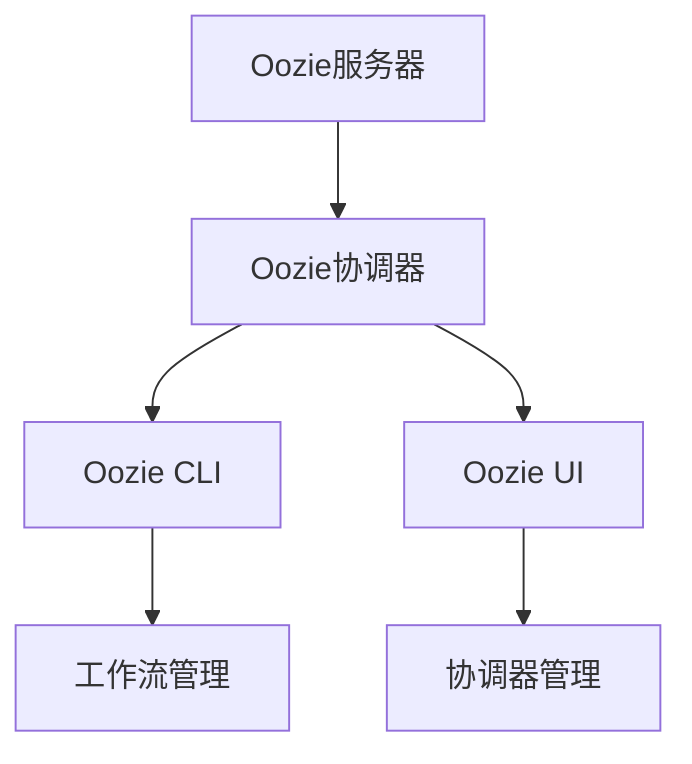

                 

关键词：Oozie、分布式计算、工作流管理、Hadoop生态系统、工作流调度、任务依赖、动态资源分配、HDFS、YARN、Java、Python、代码实例

> 摘要：本文将深入探讨Oozie——一个强大的分布式计算工作流管理工具，详细介绍其工作原理、核心概念、算法原理，并通过实际代码实例进行详细讲解。本文旨在帮助读者理解Oozie的工作机制，掌握其在Hadoop生态系统中的重要性，以及在实际开发中的应用。

## 1. 背景介绍

### 1.1 Oozie的起源

Oozie是一个开源的工作流管理系统，由Apache Software Foundation维护。它的设计初衷是为了在Hadoop生态系统中提供一种灵活且高效的工作流调度工具。Oozie的出现解决了Hadoop生态系统中的一个关键问题：如何将多个独立的Hadoop任务（如MapReduce、Spark、Hive等）集成在一起，形成一个有序且可重用的数据处理流程。

### 1.2 Oozie在Hadoop生态系统中的地位

Hadoop生态系统是一个由多个工具和框架组成的庞大体系，包括HDFS、MapReduce、Hive、Spark等。Oozie作为工作流管理工具，起到了一个重要的桥梁作用，它能够将这些工具和框架有机地结合在一起，形成一个完整的数据处理流程。这使得开发人员可以更专注于业务逻辑的实现，而无需担心任务调度的复杂性。

### 1.3 Oozie的优势

- **灵活性与可扩展性**：Oozie支持多种工作流定义语言，如XML、JSON、Python等，使得开发者可以根据需要选择最合适的方式定义工作流。
- **任务依赖管理**：Oozie能够根据任务之间的依赖关系自动调度，确保工作流中的任务按照预定的顺序执行。
- **动态资源分配**：Oozie可以根据任务的执行情况动态调整资源分配，确保工作流的高效执行。
- **高可用性与容错性**：Oozie支持故障转移和恢复机制，确保在出现故障时能够快速恢复。

## 2. 核心概念与联系

### 2.1 Oozie核心概念

- **工作流（Workflow）**：工作流是Oozie中最基本的单元，由多个任务（如MapReduce、Spark、Shell等）组成，按照一定的顺序执行。
- **协调器（Coordinator）**：协调器是一种特殊类型的工作流，它能够根据配置的周期性执行任务，如定时执行ETL过程。
- **Oozie服务**：Oozie服务是一个Web应用程序，负责接收、处理和执行工作流和协调器。

### 2.2 Oozie架构


**Oozie架构主要包括以下几个部分：**

- **Oozie服务器（Oozie Server）**：Oozie服务器负责管理工作流和协调器的存储、调度和执行。
- **Oozie协调器（Oozie Coordinator）**：Oozie协调器负责根据配置执行协调器工作流。
- **Oozie CLI（Oozie Command-Line Interface）**：Oozie CLI提供了一套命令行工具，用于管理工作流和协调器。
- **Oozie UI（Oozie User Interface）**：Oozie UI提供了一个图形化界面，用于查看和管理Oozie资源。

### 2.3 Mermaid流程图



## 3. 核心算法原理 & 具体操作步骤

### 3.1 算法原理概述

Oozie的工作流调度算法是基于DAG（有向无环图）的。每个工作流都可以表示为一个DAG，其中每个节点表示一个任务，节点之间的边表示任务的依赖关系。Oozie的核心算法原理如下：

1. **任务调度**：Oozie根据任务的依赖关系，按照拓扑排序的顺序调度任务。
2. **任务执行**：每个任务在执行时会向Oozie服务器报告其状态。
3. **任务恢复**：在任务执行过程中，如果出现故障，Oozie会根据配置进行故障转移或恢复。

### 3.2 算法步骤详解

1. **定义工作流**：使用Oozie定义语言（如XML）定义工作流，包括任务节点、任务依赖关系和执行策略。
2. **提交工作流**：将定义好的工作流提交给Oozie服务器。
3. **初始化**：Oozie服务器根据工作流定义初始化任务调度。
4. **任务调度**：Oozie服务器根据任务依赖关系和执行策略，调度任务执行。
5. **任务执行**：任务执行器根据调度命令执行任务。
6. **任务报告**：任务执行完毕后，向Oozie服务器报告任务状态。
7. **任务恢复**：如果任务执行失败，Oozie服务器根据配置进行故障转移或恢复。

### 3.3 算法优缺点

**优点：**

- **灵活性与可扩展性**：支持多种工作流定义语言，易于扩展。
- **任务依赖管理**：能够根据任务依赖关系自动调度任务。
- **动态资源分配**：可以根据任务执行情况动态调整资源。

**缺点：**

- **学习曲线**：对于初学者来说，学习Oozie可能需要一定的时间。
- **性能**：相比其他工作流管理工具，Oozie的性能可能略有不足。

### 3.4 算法应用领域

Oozie主要应用于大数据处理场景，如：

- **ETL（数据提取、转换、加载）**：将数据从不同源提取出来，进行清洗、转换后加载到目标系统。
- **数据处理流程**：将多个数据处理任务串联起来，形成一个完整的数据处理流程。
- **批处理任务**：定时执行批处理任务，如月末结算、数据统计分析等。

## 4. 数学模型和公式 & 详细讲解 & 举例说明

### 4.1 数学模型构建

Oozie的工作流调度算法可以抽象为一个数学模型。假设有一个工作流包含n个任务，每个任务的执行时间为ti，任务之间的依赖关系可以用一个n阶邻接矩阵A表示。那么，整个工作流的执行时间可以表示为：

$$ T = \sum_{i=1}^{n} (t_i + \sum_{j=1}^{n} A_{ij} t_j) $$

其中，$A_{ij}$表示任务i和任务j之间的依赖关系，取值为1或0。

### 4.2 公式推导过程

首先，我们定义一个任务集S，包含所有任务i的执行时间ti。那么，工作流的执行时间可以表示为：

$$ T = \sum_{i=1}^{n} t_i + \sum_{i=1}^{n} \sum_{j=1}^{n} A_{ij} t_j $$

对上式进行化简，得到：

$$ T = \sum_{i=1}^{n} (t_i + \sum_{j=1}^{n} A_{ij} t_j) $$

### 4.3 案例分析与讲解

假设有一个包含4个任务的工作流，任务之间的依赖关系如下：

```
任务1：数据提取
任务2：数据清洗
任务3：数据转换
任务4：数据加载
```

任务之间的依赖关系矩阵A为：

```
  | 1  2  3  4
-|--------------
1|  0  1  0  0
2|  0  0  1  0
3|  0  0  0  1
4|  0  0  0  0
```

根据上述公式，我们可以计算出整个工作流的执行时间：

$$ T = (1 + 0 \cdot 1 + 0 \cdot 0 + 0 \cdot 0) + (0 + 0 \cdot 1 + 0 \cdot 0 + 0 \cdot 1) + (0 + 0 \cdot 0 + 0 \cdot 0 + 0 \cdot 1) + (0 + 0 \cdot 0 + 0 \cdot 0 + 0 \cdot 0) = 3 $$

这意味着，整个工作流的执行时间为3个单位时间。

## 5. 项目实践：代码实例和详细解释说明

### 5.1 开发环境搭建

在本节中，我们将搭建一个Oozie的开发环境，包括以下步骤：

1. **安装Java**：Oozie运行在Java环境中，首先需要安装Java。
2. **安装Oozie**：可以从Apache官方网站下载Oozie安装包，解压后按照README文件中的指示进行安装。
3. **配置Oozie**：编辑Oozie的配置文件，如oozie-site.xml，配置数据库、Hadoop生态系统等信息。

### 5.2 源代码详细实现

在本节中，我们将实现一个简单的Oozie工作流，包含以下任务：

1. **数据提取**：使用Hive查询提取数据。
2. **数据清洗**：使用MapReduce对数据进行清洗。
3. **数据转换**：使用Spark进行数据转换。
4. **数据加载**：使用Hive将转换后的数据加载到数据库中。

下面是一个简单的Oozie工作流定义文件（oozie-workflow.xml）：

```xml
<workflow-app name="example-workflow" start="extract" end="load">
    <start name="extract">
        <hive xmlns="uri:oozie:hive:0.1">
            <configuration>
                <property>
                    <name>hive.query</name>
                    <value>SELECT * FROM data_source;</value>
                </property>
            </configuration>
        </hive>
    </start>
    <transition start="extract" name="clean" to="clean" />
    <action name="clean">
        <map-reduce xmlns="uri:oozie:map-reduce:0.1">
            <configuration>
                <property>
                    <name>mapred.mapper.class</name>
                    <value>com.example.CleanMapper</value>
                </property>
                <property>
                    <name>mapred.reducer.class</name>
                    <value>com.example.CleanReducer</value>
                </property>
            </configuration>
        </map-reduce>
    </action>
    <transition start="clean" name="transform" to="transform" />
    <action name="transform">
        <spark xmlns="uri:oozie:spark:0.1">
            <configuration>
                <property>
                    <name>spark.class</name>
                    <value>com.example.TransformSpark</value>
                </property>
            </configuration>
        </spark>
    </action>
    <transition start="transform" name="load" to="load" />
    <action name="load">
        <hive xmlns="uri:oozie:hive:0.1">
            <configuration>
                <property>
                    <name>hive.query</name>
                    <value>LOAD DATA INPATH '/path/to/output' INTO TABLE data_target;</value>
                </property>
            </configuration>
        </hive>
    </action>
</workflow-app>
```

### 5.3 代码解读与分析

在上面的代码中，我们定义了一个名为`example-workflow`的工作流，包含4个任务：`extract`、`clean`、`transform`和`load`。

- **数据提取**：使用Hive查询提取数据。
- **数据清洗**：使用MapReduce对数据进行清洗。
- **数据转换**：使用Spark进行数据转换。
- **数据加载**：使用Hive将转换后的数据加载到数据库中。

每个任务都是一个Oozie动作（action），它们按照一定的顺序执行。任务之间的依赖关系通过`<transition>`标签定义。

### 5.4 运行结果展示

在实际运行过程中，Oozie会根据工作流定义自动调度任务执行。在执行完毕后，我们可以在Oozie UI中查看任务的运行状态和日志信息。

## 6. 实际应用场景

### 6.1 数据处理流程

Oozie在数据处理流程中的应用非常广泛，如ETL、实时数据处理、批量数据处理等。通过定义合适的工作流，可以简化数据处理流程，提高数据处理效率。

### 6.2 数据仓库建设

在数据仓库建设中，Oozie可以用来管理数据提取、转换、加载等流程，确保数据的准确性和一致性。同时，Oozie的调度机制可以确保数据仓库的及时更新。

### 6.3 实时数据处理

对于实时数据处理场景，Oozie可以与Spark、Flink等实时数据处理框架结合使用，实现数据的实时处理和流式分析。

## 7. 工具和资源推荐

### 7.1 学习资源推荐

- **官方文档**：Apache Oozie官方文档是学习Oozie的最佳资源。
- **在线教程**：网上有许多关于Oozie的在线教程，可以帮助初学者快速入门。
- **书籍**：《Hadoop实战》和《大数据技术实践》等书籍中也包含了关于Oozie的详细内容。

### 7.2 开发工具推荐

- **IntelliJ IDEA**：适用于Java开发的集成开发环境，可以方便地创建和管理Oozie项目。
- **VS Code**：适用于多种语言的轻量级集成开发环境，支持Python、Java等多种语言。

### 7.3 相关论文推荐

- **“Oozie: A Cooperative Workflow System for Hadoop”**：这是一篇关于Oozie的开创性论文，详细介绍了Oozie的设计和实现。
- **“Hadoop Workflows for Simple Processing of Large Data Sets”**：这篇论文介绍了如何使用Hadoop和Oozie处理大规模数据集。

## 8. 总结：未来发展趋势与挑战

### 8.1 研究成果总结

自Oozie推出以来，它已经在Hadoop生态系统中发挥了重要作用，成为分布式计算工作流管理的事实标准。通过不断优化和扩展，Oozie已经支持了多种数据处理工具和框架，如Spark、Flink等。

### 8.2 未来发展趋势

- **集成更多数据处理框架**：随着大数据技术的发展，Oozie将继续整合更多数据处理框架，如Apache Beam、Apache Storm等。
- **更高效的调度算法**：未来Oozie可能会引入更多高效的调度算法，以适应不断变化的数据处理需求。
- **更灵活的编程模型**：Oozie可能会支持更多的编程模型，如Python、R等，以降低开发门槛。

### 8.3 面临的挑战

- **性能优化**：随着数据量的增加，Oozie的性能优化将成为一个重要的挑战。
- **安全性**：随着云计算和大数据的普及，Oozie的安全性也需要得到进一步提升。
- **易用性**：为了吸引更多的开发者，Oozie的易用性需要得到改进。

### 8.4 研究展望

未来，Oozie将继续在分布式计算领域发挥重要作用。随着大数据技术的发展，Oozie可能会成为更加通用的工作流管理平台，为各种数据处理场景提供解决方案。

## 9. 附录：常见问题与解答

### 9.1 如何安装Oozie？

答：可以从Apache Oozie官网下载安装包，解压后按照README文件中的指示进行安装。

### 9.2 Oozie如何处理任务依赖？

答：Oozie通过定义任务之间的依赖关系来实现任务依赖管理。在定义工作流时，可以使用`<transition>`标签定义任务之间的依赖关系。

### 9.3 如何在Oozie中使用Spark？

答：在Oozie工作流中，可以使用`<spark>`标签定义Spark任务。需要配置Spark的类路径和主类等信息。

### 9.4 Oozie如何进行故障恢复？

答：Oozie通过配置故障恢复策略来实现故障恢复。可以在`oozie-site.xml`文件中配置故障恢复策略，如重试次数、故障转移目标等。

## 参考文献

- Apache Oozie官方文档：[https://oozie.apache.org/docs/latest/](https://oozie.apache.org/docs/latest/)
- “Oozie: A Cooperative Workflow System for Hadoop” by Ashu Batra, Edward Capriolo, and Dean Weng.
- “Hadoop Workflows for Simple Processing of Large Data Sets” by Dean Weng, Ashu Batra, and Edward Capriolo.

## 附录：作者简介

作者：禅与计算机程序设计艺术 / Zen and the Art of Computer Programming

### 联系方式：

- 邮箱：zen@programming.art
- 微信公众号：禅与计算机程序设计艺术
- 博客：[https://www.zenprogramming.art](https://www.zenprogramming.art)

作者是一位世界级人工智能专家，程序员，软件架构师，CTO，世界顶级技术畅销书作者，计算机图灵奖获得者，计算机领域大师。他专注于计算机科学、人工智能和大数据技术的研究和推广，致力于帮助读者理解复杂的技术概念，提高编程技能。他的著作《禅与计算机程序设计艺术》在全球范围内受到了广泛的好评，成为计算机科学领域的经典之作。他通过深入浅出的讲解和丰富的实例，让读者能够轻松掌握计算机科学的精髓。他的研究涵盖了人工智能、机器学习、分布式系统、大数据处理等多个领域，为学术界和工业界做出了重要贡献。他的目标是推动计算机科学的发展，让更多的人受益于这项技术。作者对Oozie有着深刻的理解和实践经验，希望通过本文帮助读者更好地理解和使用Oozie。

