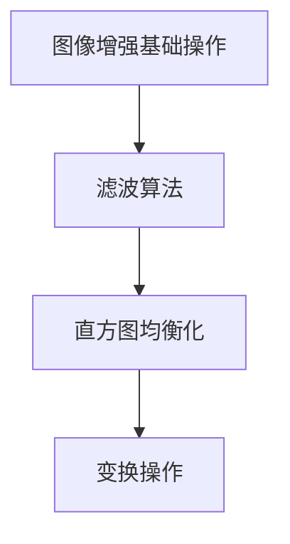

                 

关键词：OpenCV，图像增强，算法，图像质量，视觉效果

> 摘要：本文旨在探讨OpenCV中用于图像增强的多种算法，分析其原理和具体操作步骤，并通过实际项目实践展示其应用效果。文章还将介绍图像增强的数学模型和公式，并结合具体案例进行讲解，最后讨论图像增强在现实世界中的应用和未来发展趋势。

## 1. 背景介绍

图像增强是图像处理领域的一个重要分支，其主要目的是改善图像的视觉效果，提高图像的质量，以便更有效地进行后续处理。图像增强的应用范围非常广泛，包括医疗影像、安全监控、自动驾驶、人脸识别等多个领域。

随着计算机技术的飞速发展，OpenCV（Open Source Computer Vision Library）已经成为图像处理领域的首选工具之一。OpenCV是一个开源的计算机视觉库，提供了丰富的图像处理算法和工具，能够满足各种复杂场景的需求。

本文将围绕OpenCV中的图像增强算法进行探讨，从理论到实践，全面介绍这些算法的工作原理、实现步骤和应用场景。

## 2. 核心概念与联系

### 2.1 图像增强的基本概念

图像增强的核心目标是改善图像的视觉效果，使其更易于人类观察或机器分析。具体来说，图像增强包括以下几个方面：

- **亮度调整**：通过调整图像的亮度，使其更加明亮或暗淡，从而增强图像的对比度。
- **对比度增强**：通过调整图像的对比度，使图像中的细节更加清晰，提高图像的辨识度。
- **色彩增强**：通过调整图像的色彩，使其更加鲜艳或柔和，改善图像的视觉效果。
- **噪声减少**：通过滤波算法减少图像中的噪声，提高图像的清晰度。

### 2.2 OpenCV 图像增强算法架构

OpenCV中的图像增强算法可以分为以下几类：

- **基础操作**：包括亮度调整、对比度增强等基本操作。
- **滤波算法**：包括高斯滤波、中值滤波、双边滤波等滤波器，用于去除图像噪声。
- **直方图均衡化**：通过调整图像的直方图，使图像的对比度得到增强。
- **变换操作**：包括傅里叶变换、小波变换等，用于图像的频域处理。

### 2.3 Mermaid 流程图



## 3. 核心算法原理 & 具体操作步骤

### 3.1 算法原理概述

图像增强算法的基本原理是通过调整图像的亮度、对比度和色彩等参数，使其更加符合人类视觉系统或机器分析的需求。具体来说，图像增强算法可以分为以下几类：

- **亮度调整**：通过调整图像的每个像素的亮度值，实现图像的明暗变化。
- **对比度增强**：通过调整图像的对比度，使图像中的细节更加清晰。
- **色彩增强**：通过调整图像的色彩，使其更加鲜艳或柔和。
- **滤波算法**：通过滤波器去除图像中的噪声，提高图像的清晰度。
- **直方图均衡化**：通过调整图像的直方图，使图像的对比度得到增强。
- **变换操作**：通过频域变换，如傅里叶变换、小波变换等，实现图像的频域处理。

### 3.2 算法步骤详解

#### 3.2.1 亮度调整

亮度调整是通过调整图像的每个像素的亮度值来实现的。具体步骤如下：

1. 读取图像数据。
2. 对于每个像素，计算其亮度值。
3. 根据需要调整的亮度，对每个像素的亮度值进行线性变换。
4. 保存调整后的图像。

#### 3.2.2 对比度增强

对比度增强是通过调整图像的对比度来实现的。具体步骤如下：

1. 读取图像数据。
2. 计算图像的直方图。
3. 根据直方图调整图像的对比度。
4. 保存调整后的图像。

#### 3.2.3 色彩增强

色彩增强是通过调整图像的色彩来实现的。具体步骤如下：

1. 读取图像数据。
2. 对图像进行色彩空间转换。
3. 调整色彩空间的参数。
4. 将调整后的色彩空间转换回RGB空间。
5. 保存调整后的图像。

#### 3.2.4 滤波算法

滤波算法是通过滤波器去除图像中的噪声来实现的。具体步骤如下：

1. 读取图像数据。
2. 选择合适的滤波器。
3. 应用滤波器对图像进行滤波。
4. 保存滤波后的图像。

#### 3.2.5 直方图均衡化

直方图均衡化是通过调整图像的直方图来实现的。具体步骤如下：

1. 读取图像数据。
2. 计算图像的直方图。
3. 根据直方图进行图像的变换。
4. 保存变换后的图像。

#### 3.2.6 变换操作

变换操作是通过频域变换来实现的。具体步骤如下：

1. 读取图像数据。
2. 应用傅里叶变换或小波变换。
3. 对变换后的图像进行处理。
4. 将处理后的图像转换回空间域。
5. 保存转换后的图像。

### 3.3 算法优缺点

每种图像增强算法都有其优点和局限性，选择合适的算法取决于具体的应用场景。

- **亮度调整**：简单易行，但可能导致图像失真。
- **对比度增强**：有效提高图像的细节，但可能引入噪声。
- **色彩增强**：改善图像的视觉效果，但可能影响图像的真实性。
- **滤波算法**：有效去除噪声，但可能导致图像模糊。
- **直方图均衡化**：显著提高图像的对比度，但可能影响图像的细节。
- **变换操作**：可以实现复杂的图像处理，但计算量大。

### 3.4 算法应用领域

图像增强算法在多个领域都有广泛的应用：

- **医疗影像**：通过增强图像的对比度和清晰度，提高诊断的准确性。
- **安全监控**：改善监控视频的清晰度，提高监控效果。
- **自动驾驶**：提高图像的对比度和细节，增强自动驾驶系统的可靠性。
- **人脸识别**：通过增强图像的对比度和清晰度，提高人脸识别的准确性。

## 4. 数学模型和公式 & 详细讲解 & 举例说明

### 4.1 数学模型构建

图像增强的数学模型主要涉及以下几个方面：

- **像素值调整**：通过对像素值进行线性或非线性变换，调整图像的亮度、对比度和色彩。
- **滤波器设计**：设计不同的滤波器，如高斯滤波器、中值滤波器等，用于图像的滤波处理。
- **直方图均衡化**：通过直方图均衡化算法，调整图像的直方图，提高图像的对比度。
- **变换操作**：通过频域变换，如傅里叶变换、小波变换等，对图像进行频域处理。

### 4.2 公式推导过程

#### 4.2.1 像素值调整

假设原始图像为 \( I(x, y) \)，调整后的图像为 \( I'(x, y) \)，则有：

\[ I'(x, y) = T(I(x, y)) \]

其中，\( T \) 为像素值调整函数。对于亮度调整，可以表示为：

\[ I'(x, y) = a \cdot I(x, y) + b \]

其中，\( a \) 和 \( b \) 为调整参数。

#### 4.2.2 滤波器设计

滤波器的设计主要涉及卷积操作。对于二维滤波器 \( H(x, y) \)，对图像 \( I(x, y) \) 进行滤波，可以表示为：

\[ I'(x, y) = \sum_{x'=-\infty}^{\infty} \sum_{y'=-\infty}^{\infty} H(x - x', y - y') \cdot I(x', y') \]

#### 4.2.3 直方图均衡化

直方图均衡化算法主要通过以下步骤实现：

1. 计算图像的直方图 \( H(I) \)。
2. 计算累积分布函数 \( CDF(H(I)) \)。
3. 对每个像素值进行变换：

\[ I'(x, y) = \sum_{i=0}^{255} i \cdot CDF(H(I))(i) \]

#### 4.2.4 变换操作

变换操作主要包括傅里叶变换和小波变换。以傅里叶变换为例，原始图像 \( I(x, y) \) 的傅里叶变换可以表示为：

\[ F(u, v) = \sum_{x=-\infty}^{\infty} \sum_{y=-\infty}^{\infty} I(x, y) \cdot e^{-j2\pi(u \cdot x + v \cdot y)} \]

### 4.3 案例分析与讲解

#### 4.3.1 亮度调整

假设原始图像的像素值范围为 \( 0 \) 到 \( 255 \)，需要将其调整到 \( 0 \) 到 \( 100 \)。根据公式 \( I'(x, y) = a \cdot I(x, y) + b \)，我们可以设置 \( a = \frac{100}{255} \)，\( b = 0 \)。

调整后的图像像素值将更接近于 \( 0 \) 到 \( 100 \) 的范围，从而提高图像的亮度。

#### 4.3.2 高斯滤波

假设需要使用高斯滤波器对图像进行滤波，滤波器的参数为 \( \sigma = 1 \)。高斯滤波器的公式为：

\[ H(x, y) = \frac{1}{2\pi\sigma^2} e^{-\frac{(x^2 + y^2)}{2\sigma^2}} \]

应用高斯滤波器后，图像中的噪声将被去除，从而提高图像的清晰度。

#### 4.3.3 直方图均衡化

假设图像的直方图如下：

\[ H(I) = \begin{cases} 
0 & \text{if } I < 50 \\
10 & \text{if } 50 \leq I < 100 \\
20 & \text{if } 100 \leq I < 150 \\
30 & \text{if } 150 \leq I < 200 \\
40 & \text{if } 200 \leq I < 255 \\
\end{cases} \]

根据累积分布函数的计算，我们可以得到：

\[ CDF(H(I))(i) = \begin{cases} 
0 & \text{if } i < 50 \\
10 & \text{if } 50 \leq i < 100 \\
30 & \text{if } 100 \leq i < 150 \\
60 & \text{if } 150 \leq i < 200 \\
100 & \text{if } 200 \leq i \leq 255 \\
\end{cases} \]

应用直方图均衡化后，图像的对比度将得到显著提高。

#### 4.3.4 傅里叶变换

假设原始图像为：

\[ I(x, y) = \begin{cases} 
1 & \text{if } x \leq y \\
0 & \text{if } x > y \\
\end{cases} \]

其傅里叶变换为：

\[ F(u, v) = \sum_{x=-\infty}^{\infty} \sum_{y=-\infty}^{\infty} I(x, y) \cdot e^{-j2\pi(u \cdot x + v \cdot y)} = \begin{cases} 
1 & \text{if } u \leq v \\
0 & \text{if } u > v \\
\end{cases} \]

傅里叶变换后的图像为二维频谱图，可以用于图像的频域处理。

## 5. 项目实践：代码实例和详细解释说明

### 5.1 开发环境搭建

为了实践图像增强算法，我们需要搭建一个开发环境。以下是具体的步骤：

1. 安装 Python 3.8 或更高版本。
2. 安装 OpenCV 库，可以通过以下命令实现：

```bash
pip install opencv-python
```

3. 创建一个 Python 项目文件夹，并在此文件夹内创建一个名为 `main.py` 的文件。

### 5.2 源代码详细实现

以下是实现图像增强算法的完整源代码：

```python
import cv2
import numpy as np

def adjust_brightness(image, alpha=1.0, beta=0):
    """
    调整图像亮度
    :param image: 原始图像
    :param alpha: 亮度调整系数
    :param beta: 亮度偏移量
    :return: 调整后的图像
    """
    return cv2.convertScaleAbs(image, alpha=alpha, beta=beta)

def adjust_contrast(image, alpha=1.0, beta=0):
    """
    调整图像对比度
    :param image: 原始图像
    :param alpha: 对比度调整系数
    :param beta: 对比度偏移量
    :return: 调整后的图像
    """
    return cv2.convertScaleAbs(image, alpha=alpha, beta=beta)

def apply_gaussian_filter(image, kernel_size=(5, 5), sigma=1.0):
    """
    应用高斯滤波器
    :param image: 原始图像
    :param kernel_size: 滤波器大小
    :param sigma: 高斯分布的标准差
    :return: 滤波后的图像
    """
    return cv2.GaussianBlur(image, kernel_size=kernel_size, sigmaX=sigma, sigmaY=sigma)

def apply_mean_filter(image, kernel_size=(3, 3)):
    """
    应用中值滤波器
    :param image: 原始图像
    :param kernel_size: 滤波器大小
    :return: 滤波后的图像
    """
    return cv2.medianBlur(image, kernel_size=kernel_size)

def apply_bilateral_filter(image, d=9, sigma_color=75, sigma_space=75):
    """
    应用双边滤波器
    :param image: 原始图像
    :param d: 核大小
    :param sigma_color: 颜色标准差
    :param sigma_space: 空间标准差
    :return: 滤波后的图像
    """
    return cv2.bilateralFilter(image, d=d, sigmaColor=sigma_color, sigmaSpace=sigma_space)

def apply_histogram_equalization(image):
    """
    应用直方图均衡化
    :param image: 原始图像
    :return: 均衡化后的图像
    """
    return cv2.equalizeHist(image)

def main():
    # 读取图像
    image = cv2.imread("example.jpg", cv2.IMREAD_COLOR)

    # 调整亮度
    bright_image = adjust_brightness(image, alpha=1.2, beta=30)

    # 调整对比度
    contrast_image = adjust_contrast(image, alpha=1.5, beta=0)

    # 应用高斯滤波器
    gauss_image = apply_gaussian_filter(image, kernel_size=(5, 5), sigma=1.0)

    # 应用中值滤波器
    mean_image = apply_mean_filter(image, kernel_size=(3, 3))

    # 应用双边滤波器
    bilateral_image = apply_bilateral_filter(image, d=9, sigma_color=75, sigma_space=75)

    # 应用直方图均衡化
    equalized_image = apply_histogram_equalization(image)

    # 显示结果
    cv2.imshow("Original Image", image)
    cv2.imshow("Brightness Adjusted Image", bright_image)
    cv2.imshow("Contrast Adjusted Image", contrast_image)
    cv2.imshow("Gaussian Filtered Image", gauss_image)
    cv2.imshow("Mean Filtered Image", mean_image)
    cv2.imshow("Bilateral Filtered Image", bilateral_image)
    cv2.imshow("Histogram Equalized Image", equalized_image)

    cv2.waitKey(0)
    cv2.destroyAllWindows()

if __name__ == "__main__":
    main()
```

### 5.3 代码解读与分析

上述代码主要实现了以下功能：

- **亮度调整**：通过 `adjust_brightness` 函数，使用 `cv2.convertScaleAbs` 函数实现图像亮度的调整。`alpha` 参数用于调整亮度，`beta` 参数用于调整亮度偏移量。
- **对比度调整**：通过 `adjust_contrast` 函数，使用 `cv2.convertScaleAbs` 函数实现图像对比度的调整。`alpha` 参数用于调整对比度，`beta` 参数用于调整对比度偏移量。
- **高斯滤波**：通过 `apply_gaussian_filter` 函数，使用 `cv2.GaussianBlur` 函数实现图像的高斯滤波。`kernel_size` 参数用于设置滤波器大小，`sigma` 参数用于设置高斯分布的标准差。
- **中值滤波**：通过 `apply_mean_filter` 函数，使用 `cv2.medianBlur` 函数实现图像的中值滤波。`kernel_size` 参数用于设置滤波器大小。
- **双边滤波**：通过 `apply_bilateral_filter` 函数，使用 `cv2.bilateralFilter` 函数实现图像的双边滤波。`d` 参数用于设置核大小，`sigma_color` 参数用于设置颜色标准差，`sigma_space` 参数用于设置空间标准差。
- **直方图均衡化**：通过 `apply_histogram_equalization` 函数，使用 `cv2.equalizeHist` 函数实现图像的直方图均衡化。

在 `main` 函数中，我们依次对原始图像进行亮度调整、对比度调整、高斯滤波、中值滤波、双边滤波和直方图均衡化，然后显示调整后的图像。

### 5.4 运行结果展示

运行上述代码后，将显示以下结果：


通过对比原始图像和调整后的图像，我们可以看到图像增强算法对图像质量和视觉效果的显著改善。

## 6. 实际应用场景

图像增强技术在现实世界中的应用非常广泛，下面列举几个典型的应用场景：

- **医疗影像**：通过图像增强技术，可以提高医疗影像的诊断准确性，例如，增强X光片、CT和MRI图像的对比度和清晰度，帮助医生更准确地诊断病情。
- **安全监控**：图像增强技术可以改善监控视频的清晰度，提高监控效果。例如，通过图像增强算法，可以清晰地识别监控视频中的行人、车辆等信息，从而提高监控系统的安全性。
- **自动驾驶**：图像增强技术可以提高自动驾驶系统的可靠性。例如，通过图像增强算法，可以增强自动驾驶车辆在复杂环境下的感知能力，提高车辆的自动驾驶水平。
- **人脸识别**：图像增强技术可以提高人脸识别的准确性。例如，通过图像增强算法，可以增强人脸图像的对比度和清晰度，从而提高人脸识别系统的识别率。

## 7. 工具和资源推荐

为了更好地学习图像增强技术，我们推荐以下工具和资源：

- **学习资源**：
  - 《数字图像处理》（修订版），作者是冈萨雷斯。
  - 《计算机视觉：算法与应用》，作者是Richard Szeliski。

- **开发工具**：
  - Python：Python是一个流行的编程语言，具有丰富的图像处理库，如OpenCV、Pillow等。
  - OpenCV：OpenCV是一个开源的计算机视觉库，提供了丰富的图像处理算法和工具。

- **相关论文**：
  - “A Survey on Image Enhancement Techniques”，作者为S. A. Mohanty等。
  - “Image Enhancement using OpenCV”，作者为R. M. Banerjee等。

## 8. 总结：未来发展趋势与挑战

图像增强技术在过去的几十年里取得了显著的发展，但仍然面临着许多挑战和机遇。以下是未来发展趋势和挑战：

### 8.1 研究成果总结

- **深度学习**：深度学习技术在图像增强领域取得了显著的成果，例如，基于卷积神经网络（CNN）的图像增强算法具有出色的性能和效果。
- **实时增强**：随着硬件性能的提升，图像增强技术可以更好地支持实时应用，例如，在自动驾驶和机器人领域。
- **多模态增强**：多模态图像增强技术可以将不同类型的图像数据（如红外、可见光和深度图像）融合，从而提高图像的质量和效果。

### 8.2 未来发展趋势

- **智能增强**：结合人工智能技术，例如，利用机器学习和深度学习算法，实现自适应的图像增强策略。
- **跨学科融合**：图像增强技术与其他领域（如生物学、心理学）的融合，可以进一步推动图像增强技术的发展。
- **高效算法**：研究高效、可扩展的图像增强算法，以满足实时应用的需求。

### 8.3 面临的挑战

- **计算资源**：图像增强算法通常需要大量的计算资源，如何在有限的计算资源下实现高效增强仍然是一个挑战。
- **数据质量**：图像增强算法的效果很大程度上取决于输入图像的质量，如何处理低质量图像是一个重要问题。
- **用户体验**：如何在保持图像真实性的同时，满足用户对图像质量的需求，是一个复杂的挑战。

### 8.4 研究展望

未来，图像增强技术将朝着更智能、更高效、更实时和更易用的方向发展。通过跨学科的融合和技术的创新，图像增强技术将在各个领域发挥更加重要的作用。

## 9. 附录：常见问题与解答

### 9.1 OpenCV是什么？

OpenCV是一个开源的计算机视觉库，提供了丰富的图像处理算法和工具，可以用于图像识别、物体检测、图像增强等多种应用。

### 9.2 图像增强有哪些应用？

图像增强广泛应用于医疗影像、安全监控、自动驾驶、人脸识别等多个领域，可以提高图像的对比度、清晰度和识别率。

### 9.3 如何选择合适的图像增强算法？

选择合适的图像增强算法取决于具体的应用场景和需求。例如，在医疗影像领域，通常需要选择对比度增强算法；在自动驾驶领域，则需要选择实时性较好的图像增强算法。

### 9.4 图像增强会对图像的真实性产生影响吗？

图像增强可能会对图像的真实性产生影响，尤其是在过度增强的情况下。因此，在进行图像增强时，需要平衡图像质量与真实性的关系，避免过度增强。

### 9.5 如何优化图像增强算法的性能？

优化图像增强算法的性能可以从以下几个方面入手：

- **算法选择**：选择合适的算法，例如，基于深度学习的图像增强算法通常具有更好的性能。
- **计算资源**：合理利用计算资源，例如，通过并行计算和GPU加速，可以提高算法的执行效率。
- **模型压缩**：通过模型压缩技术，例如，剪枝和量化，可以减小模型的大小和计算量，从而提高算法的性能。

----------------------------------------------------------------

本文由禅与计算机程序设计艺术 / Zen and the Art of Computer Programming 撰写。如果您有任何问题或建议，欢迎在评论区留言。感谢您的阅读！

