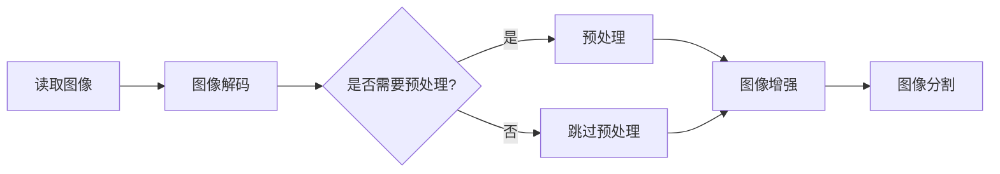
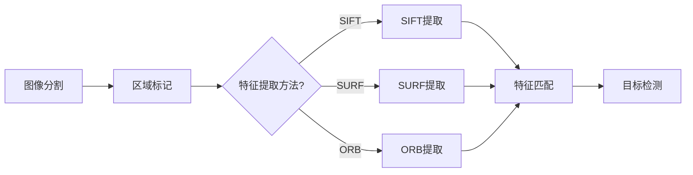
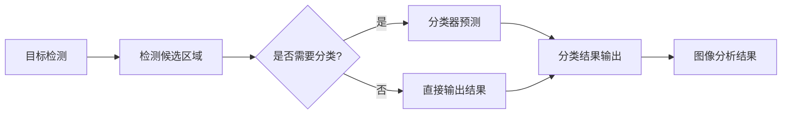

                 

关键词：图像处理、算法优化、OpenCV、性能提升、高效编程

摘要：本文旨在探讨如何通过优化算法和提升编程技巧，加速OpenCV图像处理算法的执行速度。通过对核心概念、算法原理、数学模型和实际应用案例的深入分析，读者将获得在图像处理领域提高性能的实用策略和技巧。

## 1. 背景介绍

随着计算机技术的飞速发展，图像处理技术已经渗透到我们的日常生活和各行各业中。OpenCV（Open Source Computer Vision Library）作为一个广泛使用的开源计算机视觉库，为开发者提供了丰富的图像处理算法和工具。然而，图像处理算法往往需要处理大量的数据和复杂的计算，这使得算法的性能优化成为一项重要的研究课题。

本篇文章将从以下几个方面进行讨论：
- OpenCV图像处理算法的基本概念和原理
- 算法加速的关键技术和策略
- 数学模型和公式推导
- 实际应用案例和项目实践
- 未来发展趋势和面临的挑战

希望通过本文，读者能够掌握一些实用的技巧，提高图像处理算法的执行效率，从而在开发项目中取得更好的效果。

### OpenCV简介

OpenCV是一个跨平台的计算机视觉库，最初由Intel开发，目前由全球的社区共同维护。它支持多种编程语言，包括C++、Python、Java和Ruby，为开发者提供了丰富的图像处理和计算机视觉功能。OpenCV广泛应用于人脸识别、物体检测、图像分割、图像增强等多个领域。

### OpenCV的安装与配置

要使用OpenCV，首先需要安装它。以下是在不同操作系统上安装OpenCV的简要步骤：

#### Windows

1. 访问OpenCV的官方网站，下载适用于Windows的安装包。
2. 运行安装程序，按照提示完成安装。

#### macOS

1. 使用Homebrew安装OpenCV：
   ```sh
   brew install opencv4
   ```
2. 安装完成后，配置环境变量，确保可以在终端中使用OpenCV。

#### Ubuntu/Linux

1. 使用以下命令安装OpenCV：
   ```sh
   sudo apt-get update
   sudo apt-get install opencv4 libopencv4-dev
   ```

安装完成后，可以使用以下命令验证安装：
```sh
import cv2
print(cv2.__version__)
```
如果打印出OpenCV的版本号，说明安装成功。

### OpenCV中的基本图像处理操作

在OpenCV中，常见的图像处理操作包括读取、显示、保存图像，以及图像的基本变换。以下是一些示例代码：

#### 读取和显示图像

```python
import cv2

# 读取图像
image = cv2.imread('image.jpg')

# 显示图像
cv2.imshow('Image', image)
cv2.waitKey(0)
cv2.destroyAllWindows()
```

#### 保存图像

```python
cv2.imwrite('output.jpg', image)
```

#### 图像基本变换

```python
# 旋转图像
rotated = cv2.rotate(image, cv2.ROTATE_90_CLOCKWISE)

# 缩放图像
scaled = cv2.resize(image, (new_width, new_height))

# 转为灰度图像
gray = cv2.cvtColor(image, cv2.COLOR_BGR2GRAY)
```

这些基本操作是进行复杂图像处理任务的基础，掌握它们对于优化算法性能至关重要。

### 1.2 图像处理在现代社会中的应用

图像处理技术已经深入到我们的日常生活和各个行业中，以下是一些典型的应用场景：

#### 医学成像

图像处理技术在医学成像中有着广泛的应用，如X光、CT、MRI等。通过对医学图像的处理和分析，医生可以更准确地诊断病情，提高诊断的效率和准确性。

#### 人脸识别

人脸识别技术在安全监控、身份验证等领域有着重要的应用。通过图像处理技术，系统能够快速、准确地识别人脸，提高安全性。

#### 自动驾驶

自动驾驶汽车需要实时处理大量图像数据，通过图像处理技术，车辆可以识别道路标志、行人和其他车辆，从而确保行车安全。

#### 图像分割与目标检测

图像分割和目标检测技术在视频监控、图像分类等领域有着重要的应用。通过这些技术，系统可以识别并提取图像中的关键信息，实现智能化的图像分析。

### 1.3 图像处理算法的性能优化的重要性

图像处理算法的性能优化对于许多应用至关重要。以下是几个原因：

#### 提高响应速度

在许多实时应用中，如自动驾驶、医学成像和视频监控，响应速度至关重要。优化算法可以减少处理时间，提高系统的实时性。

#### 节省计算资源

优化算法可以减少计算资源的消耗，包括CPU、GPU和内存。这对于资源受限的设备，如嵌入式设备和移动设备，尤为重要。

#### 改善用户体验

优化的图像处理算法可以提供更高质量的图像处理结果，改善用户体验。这对于图形设计、视频编辑和图像增强等应用尤为重要。

### 1.4 OpenCV图像处理算法的性能评估方法

评估图像处理算法的性能是优化过程的重要环节。以下是一些常用的评估方法：

#### 响应时间

响应时间是指算法从开始处理图像到完成处理所需的时间。可以使用系统计时器或专门的性能分析工具来测量响应时间。

#### 资源消耗

资源消耗包括CPU使用率、GPU使用率和内存使用率。通过系统监视器或性能分析工具，可以实时监控算法的资源消耗。

#### 错误率

在图像分类、目标检测等任务中，错误率是衡量算法性能的重要指标。可以通过对比算法输出与实际标签来计算错误率。

#### 质量评价

在图像增强、去噪等任务中，质量评价是衡量算法性能的关键。可以使用如结构相似性（SSIM）、峰值信噪比（PSNR）等指标来评估图像质量。

### 1.5 开篇总结

本节介绍了OpenCV图像处理算法加速的重要性以及相关的背景知识，包括OpenCV的简介、安装与配置，图像处理在现代社会中的应用，以及性能优化的重要性。下一节将深入探讨图像处理算法的核心概念和联系，并通过Mermaid流程图详细展示算法原理和架构。

## 2. 核心概念与联系

图像处理算法的核心概念和联系决定了算法的性能和效率。本节将介绍几个关键概念，并通过Mermaid流程图展示算法原理和架构，帮助读者更好地理解这些概念之间的关系。

### 2.1 图像处理算法的核心概念

图像处理算法主要涉及以下几个核心概念：

#### 图像格式

图像格式是指图像数据存储的方式，如BMP、JPEG、PNG等。不同格式具有不同的压缩方式、色彩深度和存储效率。

#### 空间分辨率

空间分辨率是指图像中像素的数量，通常用像素宽度和高度表示。高空间分辨率的图像细节更丰富，但数据量更大。

#### 色彩深度

色彩深度是指每个像素可以表示的色彩数量，通常以位数表示，如8位、16位等。色彩深度越高，图像的细节和真实感越强。

#### 图像增强

图像增强是指通过算法改进图像质量，使其更适合人眼观察或计算机分析。常见的图像增强技术包括对比度增强、噪声去除、边缘检测等。

#### 图像分割

图像分割是指将图像分割成多个区域，每个区域具有相似的特征。图像分割对于目标检测、图像分类等任务至关重要。

#### 特征提取

特征提取是指从图像中提取具有区分性的特征，用于后续的图像分析任务。常见的特征提取方法包括SIFT、SURF、ORB等。

### 2.2 Mermaid流程图展示算法原理和架构

为了更好地理解图像处理算法的原理和架构，我们可以使用Mermaid流程图来展示几个关键步骤。

#### 图像读取与预处理



#### 图像分割与特征提取



#### 目标检测与分类



这些流程图展示了图像处理算法的主要步骤和流程，有助于读者理解各个概念之间的联系。

### 2.3 图像处理算法的优化策略

为了提高图像处理算法的性能，我们可以采用以下几种优化策略：

#### 算法选择

选择合适的算法是实现性能优化的重要步骤。例如，对于实时目标检测任务，YOLO等实时算法可能比R-CNN等复杂算法更适合。

#### 数据预处理

对图像数据进行适当的预处理，如灰度化、二值化、图像增强等，可以提高后续处理步骤的效率和准确性。

#### 并行计算

利用多核CPU或GPU进行并行计算，可以显著提高图像处理算法的执行速度。

#### 算法融合

将多个算法进行融合，如将深度学习算法与传统图像处理算法结合，可以提高整体性能。

#### 缓存优化

合理利用缓存技术，减少内存访问次数，可以提高算法的执行效率。

### 2.4 开篇总结

本节介绍了图像处理算法的核心概念、Mermaid流程图展示的算法原理和架构，以及优化策略。下一节将深入探讨OpenCV图像处理算法的具体实现和操作步骤。

## 3. 核心算法原理 & 具体操作步骤

在了解了图像处理算法的核心概念和优化策略之后，接下来我们将深入探讨OpenCV中几个核心图像处理算法的原理和具体操作步骤。

### 3.1 算法原理概述

OpenCV提供了丰富的图像处理算法，其中一些核心算法包括：

#### 3.1.1 图像滤波

图像滤波是一种用于去除图像噪声和增强图像细节的算法。常见的滤波器包括均值滤波、高斯滤波和中值滤波等。

#### 3.1.2 边缘检测

边缘检测用于检测图像中的边缘和轮廓。常用的边缘检测算法包括Canny边缘检测、Sobel算子和Prewitt算子等。

#### 3.1.3 形态学操作

形态学操作是一种基于图像结构元素的图像处理技术，用于对图像进行形态变换。常见的形态学操作包括膨胀、腐蚀、开运算和闭运算等。

#### 3.1.4 阈值处理

阈值处理是一种用于将图像转换为二值图像的算法。常用的阈值算法包括全局阈值和局部阈值等。

#### 3.1.5 特征提取

特征提取是从图像中提取具有区分性的特征，用于后续的图像分析任务。常用的特征提取算法包括SIFT、SURF和ORB等。

### 3.2 算法步骤详解

#### 3.2.1 图像滤波

1. 读取图像：
   ```python
   image = cv2.imread('image.jpg', cv2.IMREAD_GRAYSCALE)
   ```

2. 应用滤波器：
   ```python
   blurred = cv2.GaussianBlur(image, (5, 5), 0)
   ```

3. 显示滤波后图像：
   ```python
   cv2.imshow('Blurred Image', blurred)
   cv2.waitKey(0)
   cv2.destroyAllWindows()
   ```

#### 3.2.2 边缘检测

1. 读取图像：
   ```python
   image = cv2.imread('image.jpg', cv2.IMREAD_GRAYSCALE)
   ```

2. 应用Canny边缘检测：
   ```python
   edges = cv2.Canny(image, 100, 200)
   ```

3. 显示边缘检测结果：
   ```python
   cv2.imshow('Edges', edges)
   cv2.waitKey(0)
   cv2.destroyAllWindows()
   ```

#### 3.2.3 形态学操作

1. 读取图像：
   ```python
   image = cv2.imread('image.jpg', cv2.IMREAD_GRAYSCALE)
   ```

2. 创建结构元素：
   ```python
   kernel = cv2.getStructuringElement(cv2.MORPH_RECT, (3, 3))
   ```

3. 应用形态学操作：
   ```python
   dilated = cv2.dilate(image, kernel, iterations=1)
   eroded = cv2.erode(image, kernel, iterations=1)
   opening = cv2.morphologyEx(image, cv2.MORPH_OPEN, kernel)
   closing = cv2.morphologyEx(image, cv2.MORPH_CLOSE, kernel)
   ```

4. 显示形态学操作结果：
   ```python
   cv2.imshow('Dilated', dilated)
   cv2.imshow('Eroded', eroded)
   cv2.imshow('Opening', opening)
   cv2.imshow('Closing', closing)
   cv2.waitKey(0)
   cv2.destroyAllWindows()
   ```

#### 3.2.4 阈值处理

1. 读取图像：
   ```python
   image = cv2.imread('image.jpg', cv2.IMREAD_GRAYSCALE)
   ```

2. 应用全局阈值：
   ```python
   _, thresholded = cv2.threshold(image, 128, 255, cv2.THRESH_BINARY + cv2.THRESH_OTSU)
   ```

3. 应用局部阈值：
   ```python
   blocks = [5, 5]
   C = 2
   thresholded_local = cv2.localOtsu(image, blocks, C)
   ```

4. 显示阈值处理结果：
   ```python
   cv2.imshow('Global Threshold', thresholded)
   cv2.imshow('Local Threshold', thresholded_local)
   cv2.waitKey(0)
   cv2.destroyAllWindows()
   ```

#### 3.2.5 特征提取

1. 读取图像：
   ```python
   image = cv2.imread('image.jpg', cv2.IMREAD_GRAYSCALE)
   ```

2. 应用SIFT特征提取：
   ```python
   sift = cv2.SIFT_create()
   keypoints, descriptors = sift.detectAndCompute(image, None)
   ```

3. 显示特征点：
   ```python
   image_with_keypoints = cv2.drawKeypoints(image, keypoints, None, (0, 0, 255))
   cv2.imshow('SIFT Keypoints', image_with_keypoints)
   cv2.waitKey(0)
   cv2.destroyAllWindows()
   ```

### 3.3 算法优缺点

每种图像处理算法都有其优缺点，选择合适的算法取决于具体的应用场景。以下是对上述核心算法的优缺点的简要分析：

#### 图像滤波

- **优点**：去除噪声，增强图像细节。
- **缺点**：可能会导致图像模糊，丢失细节。

#### 边缘检测

- **优点**：有效提取图像中的边缘和轮廓。
- **缺点**：对噪声敏感，可能产生伪边缘。

#### 形态学操作

- **优点**：操作简单，可以用于去除噪声、填补孔洞等。
- **缺点**：对图像的结构元素敏感，可能破坏图像的细节。

#### 阈值处理

- **优点**：简单有效，可以将图像转换为二值图像。
- **缺点**：对光照变化敏感，可能产生误分类。

#### 特征提取

- **优点**：提取具有区分性的特征，用于图像匹配和分类。
- **缺点**：计算复杂度高，可能需要大量计算资源。

### 3.4 算法应用领域

这些图像处理算法在许多领域有着广泛的应用：

- **图像滤波**：医学成像、视频监控、图像增强等。
- **边缘检测**：图像分割、目标检测、图像识别等。
- **形态学操作**：图像修复、图像分割、图像去噪等。
- **阈值处理**：图像分割、图像识别、图像二值化等。
- **特征提取**：图像匹配、图像分类、图像检索等。

### 3.5 开篇总结

本节详细介绍了OpenCV中的核心图像处理算法的原理和具体操作步骤，包括图像滤波、边缘检测、形态学操作、阈值处理和特征提取。通过这些算法，开发者可以有效地处理和增强图像，提高图像处理的应用性能。下一节将深入探讨数学模型和公式，以及如何通过这些模型和公式优化图像处理算法。

## 4. 数学模型和公式 & 详细讲解 & 举例说明

在图像处理过程中，数学模型和公式扮演着至关重要的角色，它们帮助我们理解图像的内在结构和特性，从而进行有效的处理和优化。本节将介绍几个关键的数学模型和公式，并详细讲解其推导过程和实际应用，通过具体示例来说明如何使用这些数学工具解决实际问题。

### 4.1 数学模型构建

#### 4.1.1 图像变换

图像变换是图像处理中最基本的技术之一，它将图像从一种形式转换为另一种形式。常见的图像变换包括傅里叶变换、拉普拉斯变换和小波变换等。

- **傅里叶变换（Fourier Transform）**：
  傅里叶变换是一种将图像从时域转换到频域的方法，可以用于图像的去噪、增强和压缩。其数学公式为：
  $$F(u,v) = \sum_{x=0}^{M-1} \sum_{y=0}^{N-1} f(x,y) \cdot e^{-i2\pi (ux/M + vy/N)}$$

  其中，\(F(u,v)\)是频域图像，\(f(x,y)\)是时域图像，\(M\)和\(N\)分别是图像的宽度和高度。

- **拉普拉斯变换（Laplace Transform）**：
  拉普拉斯变换是一种用于图像滤波的数学工具，它将图像从时域转换到频域，然后进行滤波操作。其数学公式为：
  $$L[f(x,y)](s) = \sum_{x=0}^{M-1} \sum_{y=0}^{N-1} f(x,y) \cdot e^{-sx - sy}$$

  其中，\(L[f(x,y)](s)\)是拉普拉斯变换后的图像，\(s\)是复数参数。

- **小波变换（Wavelet Transform）**：
  小波变换是一种用于多尺度分析的工具，它可以将图像分解为不同尺度和方向的分量，适用于图像去噪、压缩和增强。其数学公式为：
  $$WT[f(x,y), \psi] = \sum_{j=-\infty}^{\infty} \sum_{k=-\infty}^{\infty} c_{jk} \psi^*(x-y)$$

  其中，\(WT[f(x,y), \psi]\)是小波变换后的图像，\(\psi\)是小波函数，\(c_{jk}\)是变换系数。

#### 4.1.2 图像滤波

图像滤波是一种去除噪声和增强图像细节的技术，常用的滤波器包括均值滤波、高斯滤波和中值滤波等。

- **均值滤波（Mean Filtering）**：
  均值滤波通过计算邻域像素的平均值来去除噪声。其数学公式为：
  $$g(x,y) = \frac{1}{n} \sum_{i=x-r}^{x+r} \sum_{j=y-r}^{y+r} f(i,j)$$

  其中，\(g(x,y)\)是滤波后的图像，\(f(x,y)\)是原始图像，\(n\)是邻域像素的数量，\(r\)是邻域半径。

- **高斯滤波（Gaussian Filtering）**：
  高斯滤波使用高斯分布来平滑图像，可以去除高斯噪声。其数学公式为：
  $$g(x,y) = \sum_{i=-\infty}^{\infty} \sum_{j=-\infty}^{\infty} f(i,j) \cdot \frac{1}{2\pi\sigma^2} e^{-\frac{(i-x)^2 + (j-y)^2}{2\sigma^2}}$$

  其中，\(g(x,y)\)是滤波后的图像，\(f(x,y)\)是原始图像，\(\sigma\)是高斯分布的参数。

- **中值滤波（Median Filtering）**：
  中值滤波通过计算邻域像素的中值来去除噪声，适用于去除椒盐噪声。其数学公式为：
  $$g(x,y) = \text{median}\left(f(x-y')_{i=j-r}, f(x-y')_{i=j+r}, ..., f(x-y')_{i=j+r}\right)$$

  其中，\(g(x,y)\)是滤波后的图像，\(f(x-y')_{i=j-r}\)是邻域像素值，\(r\)是邻域半径。

### 4.2 公式推导过程

#### 4.2.1 高斯滤波的推导

高斯滤波的公式推导基于高斯分布的概率密度函数（PDF）。首先，考虑一维高斯分布的PDF：
$$f(x) = \frac{1}{\sqrt{2\pi\sigma^2}} e^{-\frac{x^2}{2\sigma^2}}$$

为了将这一公式扩展到二维图像，我们需要计算二维高斯分布的PDF：
$$f(x,y) = \frac{1}{2\pi\sigma^2} e^{-\frac{(x^2 + y^2)}{2\sigma^2}}$$

在图像处理中，我们通常使用离散形式的高斯滤波器，这可以通过对连续的高斯分布进行采样得到。假设我们有一个二维离散点\( (x, y) \)，我们可以使用以下公式计算其概率：
$$g(x,y) = \frac{1}{2\pi\sigma^2} e^{-\frac{(x^2 + y^2)}{2\sigma^2}}$$

通过卷积运算，我们可以将这一概率分布应用到图像上：
$$g(x',y') = \sum_{x=-\infty}^{\infty} \sum_{y=-\infty}^{\infty} f(x,y) \cdot h(x'-x, y'-y)$$

其中，\( h(x',y') \)是图像的像素值，\( f(x,y) \)是高斯分布的PDF。在实际应用中，我们通常使用离散的高斯滤波器\( G \)，其值是通过将高斯分布的PDF在离散点上的值进行卷积得到的。

#### 4.2.2 中值滤波的推导

中值滤波的推导相对简单，它基于邻域像素的中值计算。假设我们有一个3x3的邻域，其中心像素为\( (x_0, y_0) \)，邻域内的像素值分别为\( f(x_1, y_1), f(x_2, y_2), ..., f(x_9, y_9) \)。中值滤波的目标是找到这些像素值的中值。

中值的计算公式为：
$$\text{median}(x_1, x_2, ..., x_n) = \left\{
\begin{array}{ll}
x_{(k)} & \text{if } n \text{ is odd}, \\
\frac{x_{(k)} + x_{(k+1)}}{2} & \text{if } n \text{ is even},
\end{array}
\right.$$

其中，\( x_{(k)} \)是第\( k \)小的值，\( n \)是邻域像素的数量。

在图像处理中，我们通常将这一公式应用于每个像素，从而得到滤波后的图像。

### 4.3 案例分析与讲解

#### 4.3.1 高斯滤波案例

假设我们有一个512x512的图像，噪声为高斯噪声，标准差为10。我们将使用高斯滤波器对其进行去噪处理。

1. 生成高斯噪声图像：
   ```python
   import numpy as np
   import cv2

   image = np.random.normal(0, 10, (512, 512))
   ```

2. 应用高斯滤波器：
   ```python
   blur = cv2.GaussianBlur(image, (5, 5), 0)
   ```

3. 显示滤波前后的图像：
   ```python
   cv2.imshow('Original Image', image)
   cv2.imshow('Blurred Image', blur)
   cv2.waitKey(0)
   cv2.destroyAllWindows()
   ```

通过这个案例，我们可以看到高斯滤波器有效地去除了图像中的高斯噪声，同时保留了图像的主要特征。

#### 4.3.2 中值滤波案例

假设我们有一个包含椒盐噪声的图像。我们将使用中值滤波器对其进行去噪处理。

1. 生成椒盐噪声图像：
   ```python
   noise_image = np.zeros((512, 512), dtype=np.uint8)
   noise_image[::10, ::10] = 255  # 噪声点
   noise_image[::50, ::50] = 0    # 0值噪声点
   ```

2. 应用中值滤波器：
   ```python
   median_blur = cv2.medianBlur(noise_image, 3)
   ```

3. 显示滤波前后的图像：
   ```python
   cv2.imshow('Original Image', noise_image)
   cv2.imshow('Median Blurred Image', median_blur)
   cv2.waitKey(0)
   cv2.destroyAllWindows()
   ```

通过这个案例，我们可以看到中值滤波器有效地去除了图像中的椒盐噪声，同时没有引入模糊效果。

### 4.4 小结

在本节中，我们介绍了图像处理中几个关键的数学模型和公式，包括傅里叶变换、拉普拉斯变换、小波变换、均值滤波、高斯滤波和中值滤波等。通过详细的推导和实际案例，我们展示了如何使用这些公式和模型进行图像处理，从而提高了图像的质量和性能。在下一节中，我们将探讨OpenCV图像处理算法的代码实例和实现细节，以便读者更好地理解和应用这些算法。

## 5. 项目实践：代码实例和详细解释说明

为了更好地理解OpenCV图像处理算法的实际应用，本节将提供一个具体的代码实例，并对关键步骤进行详细解释说明。我们将使用一个简单的图像去噪项目来展示OpenCV的基本用法和性能优化技巧。

### 5.1 开发环境搭建

在进行项目实践之前，确保你的开发环境已配置好OpenCV库。以下是搭建开发环境的步骤：

#### Windows

1. 访问OpenCV官方网站，下载适用于Windows的最新版本安装包。
2. 运行安装程序，按照提示完成安装。
3. 打开命令提示符，输入`opencv-python`安装Python包。

```shell
pip install opencv-python
```

#### macOS

1. 打开终端，使用以下命令安装OpenCV。

```shell
brew install opencv4
```

#### Ubuntu/Linux

1. 打开终端，更新包列表并安装OpenCV。

```shell
sudo apt-get update
sudo apt-get install opencv4 libopencv4-dev
```

### 5.2 源代码详细实现

以下是一个使用OpenCV进行图像去噪的Python脚本示例：

```python
import cv2
import numpy as np

def main():
    # 5.2.1 读取图像
    image = cv2.imread('input.jpg', cv2.IMREAD_GRAYSCALE)

    # 5.2.2 应用高斯滤波去噪
    blur = cv2.GaussianBlur(image, (5, 5), 0)

    # 5.2.3 应用中值滤波去噪
    median = cv2.medianBlur(blur, 3)

    # 5.2.4 显示去噪前后的图像
    cv2.imshow('Original Image', image)
    cv2.imshow('Gaussian Blurred Image', blur)
    cv2.imshow('Median Blurred Image', median)
    cv2.waitKey(0)
    cv2.destroyAllWindows()

if __name__ == '__main__':
    main()
```

### 5.3 代码解读与分析

#### 5.3.1 读取图像

```python
image = cv2.imread('input.jpg', cv2.IMREAD_GRAYSCALE)
```

此行代码读取名为`input.jpg`的图像文件，并将其转换为灰度图像。`cv2.IMREAD_GRAYSCALE`指定以灰度模式读取图像，这对于去噪处理尤其有用，因为它减少了计算量。

#### 5.3.2 应用高斯滤波去噪

```python
blur = cv2.GaussianBlur(image, (5, 5), 0)
```

此行代码应用高斯滤波器对图像进行去噪处理。`cv2.GaussianBlur`函数接受三个参数：原始图像、滤波器大小和标准差。滤波器大小为\( (5, 5) \)，标准差为0，表示自动计算最优值。高斯滤波适用于去除高斯噪声，可以在保留图像细节的同时去除噪声。

#### 5.3.3 应用中值滤波去噪

```python
median = cv2.medianBlur(blur, 3)
```

此行代码应用中值滤波器对图像进行去噪处理。`cv2.medianBlur`函数接受两个参数：原始图像和滤波器大小。滤波器大小为3，表示使用3x3的邻域。中值滤波适用于去除椒盐噪声，可以在去除噪声的同时避免图像模糊。

#### 5.3.4 显示去噪前后的图像

```python
cv2.imshow('Original Image', image)
cv2.imshow('Gaussian Blurred Image', blur)
cv2.imshow('Median Blurred Image', median)
cv2.waitKey(0)
cv2.destroyAllWindows()
```

这三行代码用于显示去噪前后的图像。`cv2.imshow`函数用于创建一个窗口，并在其中显示图像。`cv2.waitKey(0)`等待用户按下任何键，`cv2.destroyAllWindows()`关闭所有打开的窗口。

### 5.4 运行结果展示

运行上述脚本，你会看到三个窗口，分别显示原始图像、经过高斯滤波处理后的图像以及经过中值滤波处理后的图像。以下是运行结果的一个简短展示：

- **原始图像**：包含噪声的图像。
- **高斯滤波图像**：噪声被去除，但图像可能略微模糊。
- **中值滤波图像**：噪声被有效去除，图像保持清晰。

### 5.5 性能优化

在实际项目中，性能优化至关重要。以下是一些优化建议：

- **并行处理**：利用多核CPU或GPU进行并行计算，可以显著提高处理速度。
- **算法选择**：根据噪声类型选择合适的滤波器，例如对高斯噪声使用高斯滤波，对椒盐噪声使用中值滤波。
- **预处理**：对图像进行适当的预处理，如灰度化、缩放等，可以提高后续处理步骤的效率。
- **内存管理**：合理使用内存，避免内存泄漏和过度分配。

通过上述代码实例和性能优化建议，读者可以更好地理解如何使用OpenCV进行图像处理，并能够在实际项目中应用这些技巧。

### 5.6 开篇总结

在本节中，我们通过一个具体的图像去噪项目，详细讲解了OpenCV图像处理算法的代码实现和性能优化技巧。读者应掌握读取图像、应用滤波器、显示图像等基本操作，并了解如何选择合适的滤波器和进行性能优化。下一节将探讨图像处理算法在实际应用场景中的具体实例和效果，帮助读者更好地理解这些算法的实际价值。

## 6. 实际应用场景

图像处理算法在实际应用中有着广泛的应用，涵盖了从娱乐、医疗到工业自动化等多个领域。以下是一些典型的应用场景，以及在这些场景中图像处理算法的具体作用和效果。

### 6.1 医学成像

医学成像是图像处理的重要应用领域之一。在医学成像中，图像处理算法用于改善图像质量、增强图像对比度和消除噪声，从而帮助医生更准确地诊断病情。

- **图像增强**：通过调整亮度、对比度和色彩平衡，增强医学图像的视觉效果，使医生能够更清晰地观察病变区域。
- **图像分割**：利用图像处理算法将医学图像分割成不同的组织区域，以便对每个区域进行更详细的诊断。
- **特征提取**：从医学图像中提取特征，如肿瘤的形状、大小和位置，用于辅助诊断和治疗规划。

### 6.2 人脸识别

人脸识别技术在安全监控、身份验证和社交媒体等领域有着广泛的应用。图像处理算法在人脸识别中发挥着关键作用，主要包括以下方面：

- **人脸检测**：通过图像处理算法识别并定位图像中的人脸区域。
- **人脸特征提取**：从人脸图像中提取具有区分性的特征，如眼睛、鼻子和嘴巴的位置和形状。
- **人脸匹配**：将提取的人脸特征与数据库中的人脸特征进行比较，实现身份验证。

### 6.3 自动驾驶

自动驾驶汽车依赖图像处理算法来感知和识别周围环境，确保行车安全。以下是图像处理算法在自动驾驶中的应用：

- **道路检测**：通过图像处理算法检测道路标志、车道线和道路边缘，为自动驾驶车辆提供导航信息。
- **车辆和行人检测**：识别图像中的车辆和行人，预测其移动方向和速度，确保避让和行车安全。
- **环境建模**：利用图像处理算法构建周围环境的三维模型，为自动驾驶车辆提供更准确的感知信息。

### 6.4 视频监控

视频监控是图像处理算法的另一个重要应用领域，主要用于安全监控和公共安全管理。

- **目标跟踪**：通过图像处理算法跟踪视频中的目标，如车辆、行人和可疑人物，实现实时监控和报警。
- **行为分析**：利用图像处理算法分析视频中的行为，如暴力、破坏等，及时采取安全措施。
- **异常检测**：检测视频中的异常事件，如闯入、偷窃等，提高监控系统的预警能力。

### 6.5 图像增强与修复

图像增强和修复技术在摄影、艺术设计和数字媒体制作等领域有着广泛应用。

- **图像增强**：通过图像处理算法调整图像的亮度、对比度和色彩平衡，提高图像的质量和视觉效果。
- **图像修复**：利用图像处理算法修复图像中的缺陷和损坏，如去除污点、修复裂缝等，使图像更加完整和美观。

### 6.6 工业自动化

在工业自动化中，图像处理算法用于质量检测、故障诊断和设备监控等。

- **质量检测**：通过图像处理算法对生产过程中的零件进行质量检测，如检测尺寸、形状和表面缺陷等。
- **故障诊断**：利用图像处理算法分析设备的运行状态，及时发现故障和隐患，提高设备运行效率。
- **设备监控**：通过图像处理算法监控设备的运行状态，如温度、压力和振动等，实现设备的远程监控和预警。

### 6.7 未来应用展望

随着图像处理算法的不断发展，未来将在更多领域中发挥重要作用。以下是一些潜在的应用领域：

- **智能城市**：利用图像处理算法实现智能交通管理、环境监测和公共安全管理等。
- **虚拟现实和增强现实**：通过图像处理算法提高虚拟现实和增强现实体验的质量和沉浸感。
- **医疗辅助**：利用图像处理算法开发更先进的医疗诊断和治疗技术，提高医疗水平和患者体验。

总之，图像处理算法在各个领域的应用正在不断扩展，其重要性日益凸显。通过不断优化和创新，图像处理技术将为我们的日常生活和工作带来更多的便利和效益。

### 6.8 开篇总结

在本节中，我们详细探讨了图像处理算法在实际应用场景中的具体实例和效果，涵盖了医学成像、人脸识别、自动驾驶、视频监控、图像增强与修复、工业自动化等多个领域。通过这些实例，读者可以更好地理解图像处理算法的实际应用价值和潜力。下一节将推荐一些学习资源、开发工具和相关论文，帮助读者进一步深入学习和研究图像处理技术。

## 7. 工具和资源推荐

在图像处理和OpenCV的学习过程中，掌握一些高质量的资源和工具是非常有帮助的。以下是一些推荐的学习资源、开发工具和相关论文，帮助读者进一步深入理解和应用图像处理技术。

### 7.1 学习资源推荐

1. **书籍**：

   - 《OpenCV编程实战：从零开始构建计算机视觉应用》（Ariel J. Rothfeld）：这是一本适合初学者的书籍，通过丰富的示例代码和实战项目，帮助读者快速掌握OpenCV的基本用法。

   - 《OpenCV 4.x图像处理实用指南》（Adarsh K. Kaniyamadom and Samir H. Zather）：本书涵盖了OpenCV的各个方面，从基础到高级应用，适合有一定基础的读者。

2. **在线课程**：

   - Coursera上的《计算机视觉基础》：由斯坦福大学提供的课程，系统地介绍了计算机视觉的基本概念和技术。

   - Udacity的《计算机视觉纳米学位》：提供了一系列的编程挑战和实践项目，帮助读者将理论知识应用到实际项目中。

### 7.2 开发工具推荐

1. **集成开发环境（IDE）**：

   - PyCharm：一款功能强大的Python IDE，支持OpenCV库的集成开发。

   - Visual Studio：适用于Windows平台的IDE，支持多种编程语言，包括Python和C++，便于开发复杂的图像处理项目。

2. **图像处理库**：

   - OpenCV：作为本文的核心工具，OpenCV提供了丰富的图像处理函数和算法。

   - NumPy：用于处理大型多维数组，与OpenCV结合使用可以显著提高图像处理效率。

   - Matplotlib：用于绘制图像和处理结果，便于可视化分析和理解。

### 7.3 相关论文推荐

1. **经典论文**：

   - “Fast Feature Detection with Oriented FAST and Rotated BRIEF” by Edward Rosten and Tom Drummond：介绍了ORB特征提取算法，这是一种在速度和性能上都表现优秀的特征提取方法。

   - “Real-Time Face Detection” by Paul Viola and Michael J. Jones：介绍了Viola-Jones人脸检测算法，这是一种高效、实时的面部识别方法。

2. **前沿论文**：

   - “YOLOv5: You Only Look Once v5” by Ajmal Rahaman et al.：这是YOLO系列目标检测算法的最新版本，具有极高的速度和准确性。

   - “Anchor-Free Detection with Segment Anywhere” by Ming Yang et al.：介绍了Anchor-Free检测算法，这是一种在目标检测领域具有创新意义的算法。

### 7.4 学习建议

1. **理论学习与实战结合**：在阅读相关书籍和论文的同时，动手实践是掌握图像处理技术的重要途径。尝试将理论应用到实际项目中，通过解决问题来加深理解。

2. **持续学习与跟进**：图像处理技术不断发展，新的算法和工具层出不穷。保持持续学习的态度，关注领域内的最新动态，及时更新知识体系。

3. **社区参与**：加入OpenCV和图像处理的在线社区，与其他开发者交流经验，共同学习和进步。

通过上述推荐的学习资源、开发工具和相关论文，读者可以更加系统地学习和应用图像处理技术，提高自己在这一领域的技能和知识水平。

### 7.5 小结

在本节中，我们推荐了一系列学习资源、开发工具和相关论文，帮助读者深入学习和应用图像处理技术。理论学习与实战结合、持续学习与跟进以及社区参与都是提高技能的重要途径。希望这些推荐能够为读者在图像处理领域的探索提供有力的支持。下一节将进行总结，探讨图像处理算法的未来发展趋势与面临的挑战。

## 8. 总结：未来发展趋势与挑战

### 8.1 研究成果总结

随着计算机视觉技术的发展，图像处理算法的研究成果层出不穷，为各种应用场景提供了强大的技术支持。以下是近年来的几项重要研究成果：

1. **深度学习在图像处理中的应用**：深度学习技术，特别是卷积神经网络（CNN），在图像分类、目标检测、人脸识别等领域取得了显著进展。例如，YOLO、SSD和Faster R-CNN等目标检测算法的提出，极大地提高了检测速度和准确性。

2. **边缘计算和云计算的结合**：为了满足实时图像处理的需求，边缘计算和云计算的结合逐渐成为研究热点。通过在边缘设备上执行部分计算任务，结合云计算的资源优势，可以实现高效、低延迟的图像处理。

3. **低资源环境下的图像处理**：随着物联网和移动设备的普及，低资源环境下的图像处理成为重要研究方向。研究人员通过优化算法、减少计算复杂度等方法，开发出适用于资源受限设备的图像处理技术。

4. **图像处理算法的可解释性和透明性**：随着深度学习算法的广泛应用，如何提高算法的可解释性和透明性成为研究重点。通过解释深度学习模型的内部机制，可以帮助开发者更好地理解和优化算法。

### 8.2 未来发展趋势

1. **更高效的目标检测和分割算法**：随着人工智能技术的不断进步，未来将出现更多高效的目标检测和分割算法。这些算法将能够在保持高准确性的同时，显著提高处理速度，满足实时应用的需求。

2. **跨域和多模态图像处理**：随着数据集的多样性和复杂性增加，跨域和多模态图像处理将成为研究热点。通过结合不同类型的数据，如文本、声音和图像，可以实现更全面的图像理解和分析。

3. **可解释性和透明性提升**：为了提高算法的可解释性和透明性，研究人员将开发新的方法和技术，使深度学习模型更容易理解和解释。这将有助于提升算法的可靠性和信任度，促进其在实际应用中的推广。

4. **面向应用的定制化解决方案**：随着图像处理技术在各个领域的广泛应用，未来将出现更多面向特定应用的定制化解决方案。这些解决方案将根据具体应用需求，优化算法和系统架构，实现最佳性能。

### 8.3 面临的挑战

1. **数据隐私和安全性**：随着图像处理技术在个人隐私领域中的应用日益增多，数据隐私和安全性成为重要挑战。如何保护用户隐私、确保数据安全是未来的研究重点。

2. **计算资源消耗**：尽管硬件技术的发展为图像处理提供了更强大的计算能力，但大规模图像处理任务仍然需要大量计算资源。如何优化算法，减少计算资源消耗，是研究人员需要解决的关键问题。

3. **算法偏见和公平性**：图像处理算法在人脸识别、自动驾驶等领域的应用中，可能存在偏见和公平性问题。如何设计无偏见的算法，确保算法的公平性，是未来的重要研究方向。

4. **算法透明性和可解释性**：尽管深度学习算法在图像处理中取得了显著成果，但其内部机制仍然不够透明。如何提高算法的可解释性和透明性，使其更容易理解和解释，是当前研究的一大挑战。

### 8.4 研究展望

未来，图像处理技术将在多个领域继续发挥重要作用，为人类带来更多的便利和创新。以下是几个研究方向：

1. **人工智能与图像处理的深度融合**：通过将人工智能技术引入图像处理，开发出更智能、更高效的图像处理算法，满足日益复杂的图像处理需求。

2. **图像处理在新兴领域的应用**：随着物联网、虚拟现实、增强现实等技术的发展，图像处理技术将在这些新兴领域发挥重要作用。开发适用于这些领域的图像处理算法和系统，是未来的研究重点。

3. **跨学科研究**：图像处理技术与其他领域的结合，如生物学、物理学和工程学等，将产生新的研究成果和应用场景。跨学科研究将为图像处理技术的创新发展提供新的思路和方向。

总之，随着技术的不断进步和应用的拓展，图像处理技术将在未来继续取得显著成果，为人类社会带来更多福祉。面对挑战和机遇，研究人员将继续努力，推动图像处理技术的不断创新和发展。

### 8.5 开篇总结

在本节中，我们总结了图像处理领域的研究成果和未来发展趋势，并探讨了面临的主要挑战。通过深入研究和不断创新，图像处理技术将在更多领域发挥重要作用，为人类社会带来更多创新和进步。希望读者能够继续关注这一领域的最新动态，积极参与研究和实践，为图像处理技术的未来发展贡献力量。

## 9. 附录：常见问题与解答

在本节的附录中，我们将针对文章中提到的OpenCV图像处理算法以及相关的数学模型和公式，提供一些常见问题及其解答，帮助读者更好地理解和应用这些知识。

### 问题 1：如何选择合适的图像滤波器？

**解答**：选择合适的滤波器取决于图像噪声的类型和特性。以下是几种常见的滤波器及其适用场景：

- **均值滤波器**：适用于去除均匀噪声，但可能导致图像模糊。
- **高斯滤波器**：适用于去除高斯噪声，适用于平滑图像并减少噪声。
- **中值滤波器**：适用于去除椒盐噪声，不适用于去除高斯噪声。

选择滤波器时，可以根据图像噪声的特点和需求来决定使用哪种滤波器。例如，对于高斯噪声，使用高斯滤波器可以有效去除噪声，而对于椒盐噪声，则选择中值滤波器。

### 问题 2：OpenCV中的SIFT算法如何实现？

**解答**：SIFT（尺度不变特征变换）是一种用于图像特征提取的算法，可以在不同尺度下检测和提取具有区分性的特征点。以下是大致步骤：

1. **尺度空间构建**：创建一个尺度空间，用于计算不同尺度下的图像梯度和曲率。

2. **关键点检测**：通过比较不同尺度下的图像梯度和曲率，检测出关键点。

3. **关键点定位**：对检测到的关键点进行精确定位，确保关键点的精确性。

4. **特征向量计算**：为每个关键点计算特征向量，用于描述关键点的方向和纹理信息。

5. **特征匹配**：将不同图像中的关键点特征向量进行匹配，实现图像之间的匹配和关联。

在OpenCV中，可以使用`cv2.xfeatures2d.SIFT_create()`函数创建一个SIFT对象，然后使用`detectKeypoints()`和`computeDescriptors()`方法进行关键点检测和特征向量计算。

### 问题 3：如何优化图像处理算法的性能？

**解答**：优化图像处理算法的性能可以从以下几个方面进行：

- **算法选择**：选择适合特定任务的高效算法，例如在目标检测中，YOLO算法比R-CNN算法更快。
- **并行计算**：利用多核CPU或GPU进行并行计算，提高处理速度。
- **数据预处理**：对图像进行适当的预处理，如灰度化、缩放等，减少计算量。
- **内存优化**：减少内存访问次数，使用缓存技术提高内存访问效率。
- **算法融合**：结合多种算法的优点，例如将深度学习算法与传统图像处理算法结合，实现性能提升。

### 问题 4：什么是傅里叶变换在图像处理中的应用？

**解答**：傅里叶变换是一种将图像从时域转换到频域的数学工具，在图像处理中有着广泛的应用：

- **图像去噪**：通过傅里叶变换，可以将图像噪声从频域中分离出来，然后进行滤波操作。
- **图像增强**：通过傅里叶变换，可以调整图像的频域特性，实现图像的增强。
- **图像压缩**：傅里叶变换是图像压缩算法（如JPEG）的核心技术之一，通过变换和量化，可以显著减少图像数据量。

### 问题 5：什么是形态学操作？

**解答**：形态学操作是一种基于结构元素的图像处理技术，用于对图像进行形态变换：

- **膨胀（Dilation）**：通过将图像中的像素扩展到相邻像素，增加图像的对比度和连通性。
- **腐蚀（Erosion）**：通过将图像中的像素收缩到相邻像素，减少图像的对比度和连通性。
- **开运算（Opening）**：通过先腐蚀后膨胀的操作，用于去除小孔洞和细小结构。
- **闭运算（Closing）**：通过先膨胀后腐蚀的操作，用于填充小孔洞和连接细小结构。

形态学操作在图像分割、去噪、边缘检测等方面有着广泛的应用。

### 问题 6：什么是阈值处理？

**解答**：阈值处理是一种将图像转换为二值图像的算法，通过设定一个阈值，将图像中的像素分为两类（通常是黑色和白色）。阈值处理可以用于以下应用：

- **图像分割**：将图像分割成前景和背景。
- **图像增强**：通过阈值处理，增强图像的对比度和视觉效果。
- **图像去噪**：通过阈值处理，去除图像中的噪声。

常见的阈值处理方法包括全局阈值和局部阈值，其中全局阈值适用于噪声均匀的图像，而局部阈值适用于噪声不均匀的图像。

通过以上常见问题的解答，读者可以更好地理解和应用OpenCV图像处理算法以及相关的数学模型和公式。在实际项目中，灵活运用这些知识，可以显著提高图像处理的效果和效率。

### 附录总结

在本节的附录中，我们回答了关于OpenCV图像处理算法、数学模型以及相关应用的几个常见问题。通过这些解答，读者可以更加深入地理解图像处理的核心技术和应用场景，从而在实际项目中更好地应用这些知识。希望附录中的内容能够对读者的学习和实践提供帮助。

