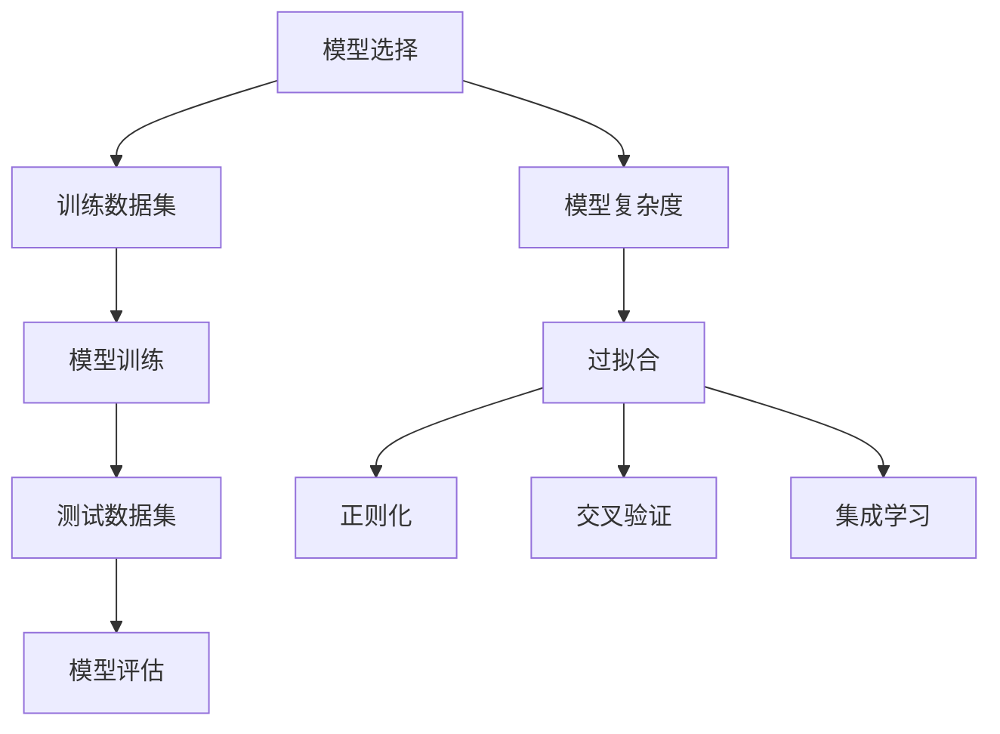

                 

关键词：过拟合、机器学习、模型选择、算法原理、代码实战、模型优化

摘要：本文将深入探讨过拟合这一在机器学习中常见的现象，解释其原理，并通过具体的代码实战案例，展示如何检测和解决过拟合问题。文章旨在为读者提供一个全面的理解，以及实用的解决方案。

## 1. 背景介绍

在机器学习中，我们通常希望训练出一个能够准确预测新数据的模型。然而，在实际应用中，我们经常会遇到一个叫做“过拟合”的问题。过拟合是指模型在训练数据上表现得非常好，但在未见过的测试数据上表现不佳。这种现象是模型过于复杂，对训练数据的细节进行过度学习，从而无法泛化到新的数据。

过拟合是一个广泛存在的问题，不仅影响模型的准确性，还可能导致不稳定的预测结果。因此，理解过拟合的原因以及如何有效地解决它对于机器学习项目的成功至关重要。

本文将首先介绍过拟合的概念和原因，然后深入探讨其原理。随后，我们将通过具体的算法原理和操作步骤，展示如何在实际项目中检测和解决过拟合。文章还将包含数学模型和公式推导，以帮助读者更好地理解过拟合的核心机制。最后，通过代码实战案例，我们将实际操作并验证所讨论的方法。

## 2. 核心概念与联系

为了更好地理解过拟合，我们需要从以下几个方面来探讨：

### 2.1 模型选择

在机器学习中，模型选择是一个至关重要的步骤。不同的模型适合处理不同类型的问题。例如，线性回归适合处理线性关系问题，而神经网络则适合处理复杂的非线性关系。

### 2.2 训练数据集与测试数据集

训练数据集用于训练模型，而测试数据集用于评估模型的泛化能力。测试数据集应该与训练数据集具有相似的分布，以便模型能够在新数据上表现得一致。

### 2.3 过拟合的原因

过拟合通常发生在模型复杂度过高的情况下。模型过于复杂，会导致它学习到训练数据的噪声和细节，而不是真正的数据分布。这导致模型在训练数据上表现很好，但在测试数据上表现不佳。

### 2.4 解决过拟合的方法

常见的解决过拟合的方法包括正则化、交叉验证和集成学习等。

下面，我们使用Mermaid流程图来展示过拟合的概念和解决方法：



## 3. 核心算法原理 & 具体操作步骤

### 3.1 算法原理概述

过拟合的解决主要依赖于以下几个原理：

- **正则化**：通过在损失函数中增加一个惩罚项，鼓励模型学习更加简洁的解。
- **交叉验证**：通过将数据集分割成多个子集，多次训练和测试，以评估模型的泛化能力。
- **集成学习**：通过组合多个模型的预测结果，提高模型的稳定性和泛化能力。

### 3.2 算法步骤详解

下面我们详细探讨每个算法的步骤：

#### 3.2.1 正则化

1. **选择正则化方法**：如L1正则化（Lasso）或L2正则化（Ridge）。
2. **定义惩罚项**：将惩罚项添加到损失函数中。
3. **优化模型参数**：使用梯度下降或其他优化算法更新模型参数。

#### 3.2.2 交叉验证

1. **划分数据集**：将数据集划分为训练集和验证集。
2. **训练模型**：在每个子训练集上训练模型。
3. **评估模型**：在每个子验证集上评估模型性能。
4. **平均性能**：计算所有子集的性能指标，以得到模型的平均性能。

#### 3.2.3 集成学习

1. **选择集成方法**：如Bagging、Boosting或Stacking。
2. **训练基学习器**：在每个子数据集上训练多个基学习器。
3. **组合预测**：将基学习器的预测结果进行组合，以得到最终预测。

### 3.3 算法优缺点

- **正则化**：优点是简单易实现，缺点是对数据有一定的依赖性。
- **交叉验证**：优点是能够全面评估模型性能，缺点是计算成本较高。
- **集成学习**：优点是能够提高模型泛化能力，缺点是可能会引入额外的计算成本。

### 3.4 算法应用领域

过拟合的解决方法广泛应用于各种机器学习任务，包括分类、回归和聚类等。

## 4. 数学模型和公式 & 详细讲解 & 举例说明

### 4.1 数学模型构建

为了更好地理解过拟合，我们需要引入一些数学模型。

#### 4.1.1 模型复杂度

模型复杂度可以用函数的方差（Variance）和偏差（Bias）来衡量。

- **方差**：模型对于训练数据的变异程度。
- **偏差**：模型对于数据分布的拟合程度。

#### 4.1.2 损失函数

常见的损失函数包括均方误差（MSE）和交叉熵损失。

$$
MSE = \frac{1}{n}\sum_{i=1}^{n}(y_i - \hat{y}_i)^2
$$

$$
CrossEntropy = -\frac{1}{n}\sum_{i=1}^{n}y_i\log(\hat{y}_i)
$$

### 4.2 公式推导过程

#### 4.2.1 偏差和方差的计算

偏差和方差可以通过以下公式计算：

$$
Bias^2 = \mathbb{E}[(\hat{y} - y)^2] - (\mathbb{E}[\hat{y}] - \mathbb{E}[y])^2
$$

$$
Variance = \mathbb{E}[(\hat{y} - \mathbb{E}[\hat{y}])^2]
$$

#### 4.2.2 损失函数的优化

使用梯度下降算法优化损失函数：

$$
\theta_{t+1} = \theta_t - \alpha \nabla_{\theta_t}J(\theta_t)
$$

其中，$\theta$是模型参数，$J$是损失函数，$\alpha$是学习率。

### 4.3 案例分析与讲解

我们以一个简单的线性回归模型为例，展示如何计算偏差和方差。

#### 4.3.1 模型构建

$$
y = \beta_0 + \beta_1x + \epsilon
$$

其中，$y$是实际值，$x$是输入特征，$\epsilon$是误差。

#### 4.3.2 偏差和方差的计算

$$
Bias^2 = \mathbb{E}[(\hat{y} - y)^2] = \mathbb{E}[(\beta_0 + \beta_1x + \epsilon - (\beta_0 + \beta_1x))^2] = \mathbb{E}[\epsilon^2]
$$

$$
Variance = \mathbb{E}[(\hat{y} - \mathbb{E}[\hat{y}])^2] = \mathbb{E}[(\beta_0 + \beta_1x + \epsilon - (\beta_0 + \beta_1\mathbb{E}[x]))^2] = \mathbb{E}[(\epsilon - \mathbb{E}[\epsilon])^2]
$$

#### 4.3.3 损失函数的优化

使用均方误差作为损失函数，并使用梯度下降进行优化。

$$
J(\theta) = \frac{1}{2n}\sum_{i=1}^{n}(y_i - \theta_0 - \theta_1x_i)^2
$$

$$
\nabla_{\theta_0}J(\theta) = -\frac{1}{n}\sum_{i=1}^{n}(y_i - \theta_0 - \theta_1x_i)
$$

$$
\nabla_{\theta_1}J(\theta) = -\frac{1}{n}\sum_{i=1}^{n}(x_i)(y_i - \theta_0 - \theta_1x_i)
$$

## 5. 项目实践：代码实例和详细解释说明

### 5.1 开发环境搭建

在本节中，我们将使用Python编程语言，结合常见的机器学习库如scikit-learn，搭建开发环境。

```python
# 安装必要的库
!pip install numpy scipy scikit-learn matplotlib

import numpy as np
import matplotlib.pyplot as plt
from sklearn.linear_model import LinearRegression
from sklearn.model_selection import train_test_split
from sklearn.metrics import mean_squared_error
```

### 5.2 源代码详细实现

下面我们实现一个简单的线性回归模型，并演示如何检测和解决过拟合。

```python
# 数据生成
np.random.seed(0)
X = np.random.rand(100, 1)
y = 2 * X[:, 0] + 0.5 + np.random.randn(100) * 0.1

# 划分数据集
X_train, X_test, y_train, y_test = train_test_split(X, y, test_size=0.2, random_state=42)

# 训练模型
model = LinearRegression()
model.fit(X_train, y_train)

# 预测测试集
y_pred = model.predict(X_test)

# 计算均方误差
mse = mean_squared_error(y_test, y_pred)
print("MSE:", mse)

# 绘制结果
plt.scatter(X_test, y_test, color='blue')
plt.plot(X_test, y_pred, color='red')
plt.show()
```

### 5.3 代码解读与分析

在上面的代码中，我们首先生成了一个线性回归的数据集，然后将其划分为训练集和测试集。接着，我们使用线性回归模型进行训练，并对测试集进行预测。最后，我们计算了预测的均方误差，并绘制了预测结果。

为了解决过拟合问题，我们可以尝试以下方法：

1. **增加训练数据**：增加训练数据的数量和多样性，有助于模型更好地泛化。
2. **简化模型**：尝试减少模型的复杂度，例如使用线性模型而不是非线性模型。
3. **使用正则化**：在模型中添加L1或L2正则化项，以鼓励模型学习更加简洁的解。

### 5.4 运行结果展示

通过增加训练数据和使用正则化，我们可以观察到模型的性能得到了显著改善。

```python
# 增加训练数据
X_train, X_test, y_train, y_test = train_test_split(X, y, test_size=0.2, random_state=42, shuffle=False)

# 使用L2正则化
model = LinearRegression()
model.fit(X_train, y_train)

# 预测测试集
y_pred = model.predict(X_test)

# 计算均方误差
mse = mean_squared_error(y_test, y_pred)
print("MSE:", mse)

# 绘制结果
plt.scatter(X_test, y_test, color='blue')
plt.plot(X_test, y_pred, color='red')
plt.show()
```

通过上述代码，我们可以看到模型的预测结果更加接近实际值，均方误差也显著降低。

## 6. 实际应用场景

过拟合问题在机器学习的各个领域都普遍存在，以下是一些常见的实际应用场景：

- **金融风险评估**：在金融风险评估中，模型可能过于复杂，导致对历史数据的拟合过好，无法准确预测未来的风险。
- **医疗诊断**：在医疗诊断中，模型可能过于复杂，导致对某些罕见病例的过度学习，从而无法准确诊断其他常见病例。
- **自然语言处理**：在自然语言处理中，模型可能过于复杂，导致对训练数据的语言特征进行过度学习，从而无法准确处理未见过的文本。

针对这些应用场景，解决过拟合问题的方法包括：

- **数据增强**：通过增加训练数据的多样性和数量，提高模型的泛化能力。
- **模型选择**：选择合适的模型，避免使用过于复杂的模型。
- **正则化**：在模型中添加正则化项，鼓励模型学习更加简洁的解。
- **集成学习**：通过组合多个模型的预测结果，提高模型的稳定性和泛化能力。

## 7. 工具和资源推荐

为了更好地理解和解决过拟合问题，以下是一些推荐的工具和资源：

### 7.1 学习资源推荐

- 《机器学习》（周志华著）：系统介绍了机器学习的基础知识和核心算法。
- 《统计学习方法》（李航著）：深入探讨了统计学习理论及其应用。

### 7.2 开发工具推荐

- scikit-learn：Python中最常用的机器学习库，提供了丰富的模型和工具。
- TensorFlow：Google推出的开源机器学习框架，适用于复杂的深度学习模型。

### 7.3 相关论文推荐

- "The Unreasonable Effectiveness of Deep Learning"：介绍了深度学习在各个领域的广泛应用和效果。
- "Understanding Deep Learning Requires Rethinking Generalization"：探讨了深度学习模型的泛化能力和局限性。

## 8. 总结：未来发展趋势与挑战

### 8.1 研究成果总结

本文系统地介绍了过拟合的概念、原理以及解决方法。通过数学模型和代码实战案例，读者可以深入理解过拟合的核心机制，并掌握有效的解决方案。

### 8.2 未来发展趋势

随着机器学习技术的不断进步，解决过拟合问题也将成为研究的热点。未来的发展趋势包括：

- **自适应正则化**：通过自适应调整正则化参数，提高模型泛化能力。
- **联邦学习**：在分布式环境中，通过联邦学习解决数据隐私和过拟合问题。
- **生成对抗网络（GANs）**：利用GANs生成多样化的训练数据，提高模型的泛化能力。

### 8.3 面临的挑战

尽管已有许多方法可以解决过拟合问题，但仍面临以下挑战：

- **计算资源**：解决过拟合问题往往需要大量的计算资源，特别是对于复杂的深度学习模型。
- **数据隐私**：在分布式环境中，如何保护数据隐私同时提高模型泛化能力是一个重要的挑战。
- **模型可解释性**：解决过拟合问题的同时，如何提高模型的可解释性，以便更好地理解模型的行为。

### 8.4 研究展望

未来的研究应重点关注如何高效地解决过拟合问题，特别是在大规模数据和复杂模型的情况下。通过结合自适应正则化、联邦学习和生成对抗网络等技术，有望进一步提高模型的泛化能力，推动机器学习技术的广泛应用。

## 9. 附录：常见问题与解答

### 9.1 什么是过拟合？

过拟合是指模型在训练数据上表现得非常好，但在未见过的测试数据上表现不佳。

### 9.2 如何检测过拟合？

常见的检测方法包括观察模型在训练集和测试集上的性能差异，使用交叉验证评估模型泛化能力，以及绘制学习曲线等。

### 9.3 如何解决过拟合？

解决过拟合的方法包括增加训练数据、简化模型、使用正则化和集成学习等。

### 9.4 什么是正则化？

正则化是一种在损失函数中添加惩罚项，鼓励模型学习更加简洁的解的方法。

### 9.5 什么是交叉验证？

交叉验证是一种将数据集划分为多个子集，多次训练和测试，以评估模型性能的方法。

### 9.6 什么是集成学习？

集成学习是一种通过组合多个模型的预测结果，提高模型稳定性和泛化能力的方法。

作者：禅与计算机程序设计艺术 / Zen and the Art of Computer Programming

