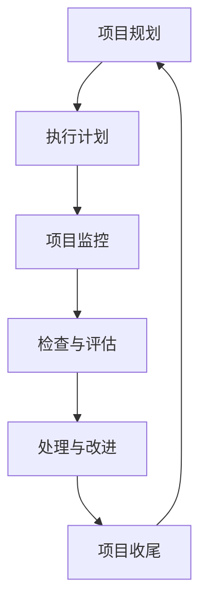
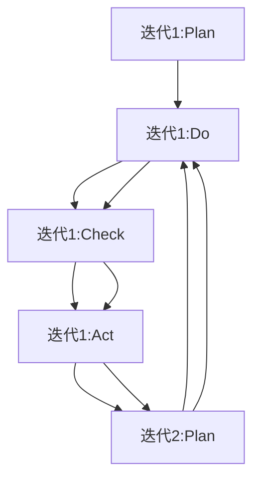
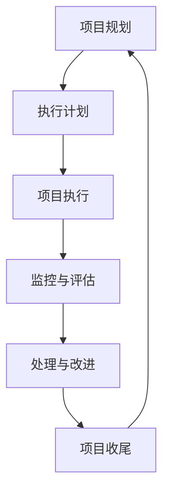

                 

关键词：PDCA、管理方法论、持续改进、迭代过程、质量保证

> 摘要：本文深入探讨了PDCA（Plan-Do-Check-Act）管理方法论在IT领域的应用，通过详细分析其核心概念、算法原理、数学模型以及实践案例，为高效管理者提供了可操作的行动指南，以实现持续改进和质量管理。

## 1. 背景介绍

在快速发展的IT行业，面对日益复杂的项目和激烈的竞争环境，管理者需要不断寻求高效的管理方法来保证项目的顺利进行和团队的高效运作。PDCA管理方法论作为一种被广泛认可的持续改进工具，最早由美国质量管理专家爱德华·戴明提出，并在日本得到了广泛应用和推广。PDCA方法论以科学的管理思想为指导，通过计划、执行、检查和处理的循环迭代，实现了质量管理与效率提升。

本文将从PDCA方法论的核心概念、原理和具体操作步骤入手，结合实际项目案例，详细探讨其在IT领域的应用，为管理者提供实用的行动指南。

## 2. 核心概念与联系

### 2.1 PDCA循环

PDCA循环，又称戴明环，是进行质量管理、控制和持续改进的一种有效方法。它由四个阶段组成：计划（Plan）、执行（Do）、检查（Check）和处理（Act）。

- **计划（Plan）**：设定目标、分析现状、找出问题、制定改进计划。
- **执行（Do）**：按照计划实施改进措施。
- **检查（Check）**：对执行结果进行测量、分析和评估，确定改进效果。
- **处理（Act）**：总结经验教训，将成功的经验标准化，对失败的教训制定预防措施，以防止问题再次发生。

### 2.2 PDCA与IT项目管理的联系

在IT项目管理中，PDCA方法论可以应用于项目管理的各个阶段，包括项目规划、执行、监控和收尾。以下是一个基于PDCA的IT项目管理流程的Mermaid流程图：



### 2.3 PDCA与敏捷开发

在敏捷开发中，PDCA方法论同样具有重要应用。敏捷开发强调迭代和增量开发，通过短周期的PDCA循环，团队可以在每个迭代中不断调整和优化开发流程，提高项目的灵活性和响应速度。



## 3. 核心算法原理 & 具体操作步骤

### 3.1 算法原理概述

PDCA算法的核心在于通过循环迭代，实现持续改进。每个循环都包括四个阶段：

1. **计划（Plan）**：确定目标和计划。
2. **执行（Do）**：执行计划，进行实际操作。
3. **检查（Check）**：对执行结果进行测量和评估。
4. **处理（Act）**：总结经验，标准化成功做法，制定改进措施。

### 3.2 算法步骤详解

#### 3.2.1 计划（Plan）

- **设定目标**：明确项目的目标，确保目标具体、可测量。
- **分析现状**：收集项目当前的数据，了解项目存在的问题。
- **找出问题**：通过数据分析和团队讨论，找出影响项目成功的因素。
- **制定改进计划**：根据问题和目标，制定具体的改进措施和时间表。

#### 3.2.2 执行（Do）

- **实施计划**：按照改进计划执行操作，确保团队了解计划并积极参与。
- **记录执行情况**：详细记录执行过程和结果，为后续检查提供数据支持。

#### 3.2.3 检查（Check）

- **数据收集**：收集执行过程中的数据，包括质量、进度、成本等指标。
- **分析结果**：使用数据分析工具，对执行结果进行分析，确定改进效果。

#### 3.2.4 处理（Act）

- **总结经验**：对执行过程中的成功和失败进行总结，提取经验教训。
- **标准化**：将成功的做法标准化，形成流程和规范。
- **制定预防措施**：对失败的原因进行分析，制定预防措施，防止问题再次发生。

### 3.3 算法优缺点

#### 优点

- **灵活性强**：通过循环迭代，PDCA方法论能够快速适应环境变化。
- **持续改进**：不断优化流程和操作，提高项目的质量和效率。
- **全员参与**：鼓励团队成员参与改进过程，提高团队凝聚力。

#### 缺点

- **执行难度**：需要团队具备良好的沟通和协作能力。
- **时间成本**：每次循环都需要投入时间和资源。

### 3.4 算法应用领域

PDCA方法论在IT领域的应用非常广泛，包括软件开发、项目管理、运维管理、质量保证等。以下是几个具体的应用场景：

- **软件开发**：在每个迭代中应用PDCA循环，持续优化开发流程和代码质量。
- **项目管理**：通过PDCA循环，确保项目在各个阶段都有明确的计划和目标。
- **运维管理**：持续监控系统性能，及时发现并解决问题。
- **质量保证**：通过PDCA循环，确保产品的质量符合预期。

## 4. 数学模型和公式 & 详细讲解 & 举例说明

### 4.1 数学模型构建

在PDCA方法论中，可以使用以下数学模型来评估项目改进效果：

$$
改进效果 = \frac{（目标值 - 原始值）}{原始值} \times 100\%
$$

### 4.2 公式推导过程

- **目标值**：指项目改进后的预期效果。
- **原始值**：指项目改进前的实际效果。

公式推导过程如下：

$$
改进效果 = \frac{（目标值 - 原始值）}{原始值} \times 100\%
$$

$$
= \frac{（目标值 - 原始值）}{原始值} \times \frac{原始值}{100\%}
$$

$$
= \frac{目标值 - 原始值}{100}
$$

### 4.3 案例分析与讲解

假设一个软件开发团队计划通过PDCA方法论优化代码质量。原始代码缺陷率为10%，改进目标为将缺陷率降低到5%。

- **目标值**：5%
- **原始值**：10%

使用公式计算改进效果：

$$
改进效果 = \frac{（5\% - 10\%）}{10\%）} \times 100\% = \frac{-5\%}{10\%} \times 100\% = -50\%
$$

结果表明，团队的改进效果为-50%，这意味着团队在改进过程中并未达到预期目标，需要进一步分析和调整。

## 5. 项目实践：代码实例和详细解释说明

### 5.1 开发环境搭建

为了实现代码质量优化，团队首先需要搭建一个稳定的开发环境。以下是搭建过程的简要步骤：

1. **选择开发工具**：例如，选择IDEA作为主要开发工具。
2. **配置环境**：安装Java开发环境，配置Maven构建工具。
3. **搭建代码仓库**：使用Git进行版本控制，确保代码的安全和可追溯性。

### 5.2 源代码详细实现

在开发环境中，团队开始编写代码。以下是一个简单的代码示例，用于统计字符串中的单词数量：

```java
public class WordCounter {
    public static int countWords(String text) {
        String[] words = text.split("\\s+");
        return words.length;
    }

    public static void main(String[] args) {
        String text = "Hello, world! This is a test.";
        int wordCount = countWords(text);
        System.out.println("Word count: " + wordCount);
    }
}
```

### 5.3 代码解读与分析

该代码实现了一个简单的单词计数器，通过正则表达式将输入字符串分割为单词数组，并返回数组长度。以下是代码的关键部分解读：

```java
String[] words = text.split("\\s+");
```

这一行代码使用了正则表达式`\\s+`来分割字符串，其中`\\s`表示空白字符（包括空格、制表符、换行符等），`+`表示匹配一个或多个连续的空白字符。

```java
return words.length;
```

这一行代码返回了数组`words`的长度，即单词的数量。

### 5.4 运行结果展示

运行上述代码，输入字符串“Hello, world! This is a test.”，程序输出结果为：

```
Word count: 6
```

这表明输入字符串中包含6个单词。

## 6. 实际应用场景

### 6.1 软件开发

在软件开发过程中，PDCA方法论可以帮助团队持续优化代码质量，提高开发效率。例如，在一个迭代周期中，团队可以应用PDCA循环进行以下活动：

- **计划（Plan）**：确定迭代周期内的目标，例如减少代码缺陷率。
- **执行（Do）**：按照计划进行编码和测试。
- **检查（Check）**：通过静态代码分析和动态测试，评估代码质量。
- **处理（Act）**：对发现的问题进行修复，并总结经验教训。

### 6.2 项目管理

在项目管理中，PDCA方法论可以应用于项目计划和执行阶段。例如，在一个项目规划阶段，团队可以应用PDCA循环进行以下工作：

- **计划（Plan）**：确定项目目标和时间表。
- **执行（Do）**：按照计划执行项目任务。
- **检查（Check）**：通过项目进度报告和风险分析，评估项目执行情况。
- **处理（Act）**：对项目中的问题进行及时解决，调整计划以适应变化。

### 6.3 运维管理

在运维管理中，PDCA方法论可以帮助团队持续优化系统性能和稳定性。例如，在一个运维周期中，团队可以应用PDCA循环进行以下活动：

- **计划（Plan）**：确定系统性能优化目标。
- **执行（Do）**：实施优化措施，例如调整服务器配置、优化数据库查询。
- **检查（Check）**：通过性能测试和监控，评估系统性能。
- **处理（Act）**：对优化效果进行总结，制定持续改进计划。

## 7. 未来应用展望

随着人工智能和大数据技术的不断发展，PDCA方法论在IT领域的应用将更加广泛和深入。未来，PDCA方法论有望在以下几个方面实现进一步发展：

- **自动化**：利用人工智能技术，实现PDCA循环的自动化，提高管理效率和准确性。
- **个性化**：通过大数据分析，为团队提供个性化的改进建议，实现更精准的持续改进。
- **智能化**：结合物联网和区块链技术，实现跨平台和跨领域的PDCA管理，提高系统整体效能。

## 8. 总结：未来发展趋势与挑战

### 8.1 研究成果总结

PDCA方法论在IT领域的应用取得了显著成果，特别是在软件开发、项目管理、运维管理等方面。通过PDCA循环，团队可以持续改进流程和操作，提高项目的质量和效率。

### 8.2 未来发展趋势

未来，PDCA方法论将继续在IT领域得到广泛应用。随着人工智能和大数据技术的发展，PDCA方法论将更加智能化、自动化和个性化，为团队提供更全面和精准的管理支持。

### 8.3 面临的挑战

然而，PDCA方法论在IT领域的发展也面临一些挑战：

- **团队协作**：PDCA方法论需要团队具备良好的沟通和协作能力，如何提高团队协作效率是一个重要问题。
- **数据质量**：PDCA方法论依赖于数据进行分析和评估，数据质量对改进效果具有重要影响。
- **技术支持**：随着PDCA方法论的应用场景越来越复杂，需要提供更多技术支持和工具。

### 8.4 研究展望

未来，针对PDCA方法论在IT领域的应用，需要进一步研究和探索以下几个方面：

- **跨领域应用**：研究PDCA方法论在更多领域的应用，提高其适用性和灵活性。
- **智能化改进**：结合人工智能技术，实现PDCA循环的自动化和智能化。
- **数据驱动改进**：通过大数据分析，提供更精准的改进建议，提高管理决策的准确性。

## 9. 附录：常见问题与解答

### Q1：PDCA方法论的核心原理是什么？

A1：PDCA方法论的核心原理是通过计划、执行、检查和处理的循环迭代，实现持续改进和质量管理。

### Q2：如何应用PDCA方法论进行软件开发？

A2：在软件开发过程中，可以将PDCA方法论应用于每个迭代周期，通过计划、执行、检查和处理，持续优化代码质量和开发流程。

### Q3：PDCA方法论在项目管理中如何应用？

A3：在项目管理中，可以将PDCA方法论应用于项目规划和执行阶段，通过计划、执行、检查和处理，确保项目按计划进行并达到预期目标。

### Q4：PDCA方法论在运维管理中如何应用？

A4：在运维管理中，可以将PDCA方法论应用于系统性能优化和故障处理，通过计划、执行、检查和处理，确保系统稳定运行和持续改进。

### Q5：如何提高PDCA方法论在团队中的实施效果？

A5：提高PDCA方法论在团队中的实施效果，需要注重团队协作、数据质量和技术支持。同时，通过培训和宣传，提高团队对PDCA方法论的理解和应用能力。作者：禅与计算机程序设计艺术 / Zen and the Art of Computer Programming
----------------------------------------------------------------

## 1. 背景介绍

在IT行业，项目管理的复杂性和不确定性使得管理者需要一套有效的行动方法论来确保项目的成功。PDCA（Plan-Do-Check-Act）方法论，也被称为戴明循环，起源于质量管理领域，但其应用范围已扩展到包括IT项目管理在内的多个领域。PDCA方法论通过四个基本步骤——计划（Plan）、执行（Do）、检查（Check）和行动（Act）——实现持续改进和过程优化。

本文旨在探讨PDCA方法论在IT领域的应用，分析其核心概念、原理和具体操作步骤，并通过实际项目案例和数学模型，展示其在提高项目质量和效率方面的优势。文章结构如下：

- **计划（Plan）**：设定目标和制定计划。
- **执行（Do）**：执行计划并实施操作。
- **检查（Check）**：评估执行结果并收集数据。
- **行动（Act）**：根据检查结果进行改进和标准化。

## 2. 核心概念与联系

### 2.1 PDCA循环

PDCA循环是PDCA方法论的核心。它由四个连续的阶段组成，形成一个闭环，使过程不断改进。

- **计划（Plan）**：确定目标和计划。包括目标设定、资源分配和任务分解。
- **执行（Do）**：实施计划。执行具体的操作和任务，确保计划得到有效执行。
- **检查（Check）**：检查结果。收集数据，对比目标，评估执行效果。
- **行动（Act）**：改进和标准化。根据检查结果，采取行动进行改进，并标准化成功的做法。

### 2.2 PDCA与IT项目管理的联系

在IT项目管理中，PDCA方法论可以帮助团队实现以下目标：

- **明确目标**：通过计划阶段，确保项目目标明确和具体。
- **高效执行**：通过执行阶段，确保团队按计划完成任务。
- **持续监控**：通过检查阶段，持续监控项目进展和风险。
- **不断优化**：通过行动阶段，对项目过程进行改进和优化。

### 2.3 Mermaid流程图

以下是PDCA方法论在IT项目管理中的Mermaid流程图：



## 3. 核心算法原理 & 具体操作步骤

### 3.1 算法原理概述

PDCA方法论是一种迭代的过程改进模型，其基本原理是通过循环四个阶段，逐步改进项目过程。

### 3.2 具体操作步骤

#### 3.2.1 计划（Plan）

1. **设定目标**：明确项目的目标和预期成果。
2. **分析现状**：评估项目的当前状态，识别存在的问题。
3. **制定计划**：基于目标和分析结果，制定具体的改进计划。

#### 3.2.2 执行（Do）

1. **执行操作**：按照计划执行任务，确保团队成员理解并遵循计划。
2. **记录数据**：收集执行过程中的数据，包括进度、质量、成本等。

#### 3.2.3 检查（Check）

1. **评估结果**：对比计划目标和实际执行结果，评估项目进展和成果。
2. **分析问题**：识别执行过程中的问题和不足。

#### 3.2.4 行动（Act）

1. **改进措施**：根据检查结果，制定改进措施。
2. **标准化流程**：将成功的经验标准化，形成最佳实践。

### 3.3 算法优缺点

#### 优点

- **灵活性强**：适用于各种规模和类型的项目。
- **易于实施**：操作简单，易于理解和执行。
- **持续改进**：通过循环迭代，不断优化项目过程。

#### 缺点

- **需要持续投入**：持续改进需要时间和资源的投入。
- **团队协作要求高**：PDCA方法论的成功实施依赖于团队的高效协作。

### 3.4 算法应用领域

PDCA方法论在IT项目管理中应用广泛，包括软件开发、项目管理、运维管理等。以下是其具体应用领域：

- **软件开发**：在每个迭代周期中应用PDCA，优化开发流程和代码质量。
- **项目管理**：通过PDCA，确保项目按计划进行，及时发现并解决问题。
- **运维管理**：持续监控系统性能，通过PDCA优化运维流程。

## 4. 数学模型和公式 & 详细讲解 & 举例说明

### 4.1 数学模型构建

在PDCA方法论中，可以使用以下数学模型来评估项目的改进效果：

$$
\text{改进效果} = \frac{\text{目标值} - \text{原始值}}{\text{原始值}} \times 100\%
$$

### 4.2 公式推导过程

该公式用于计算改进效果，其中：

- **目标值**：指项目改进后的预期效果。
- **原始值**：指项目改进前的实际效果。

推导过程如下：

$$
\text{改进效果} = \frac{\text{目标值} - \text{原始值}}{\text{原始值}} \times 100\%
$$

$$
= \left(1 - \frac{\text{原始值}}{\text{目标值}}\right) \times 100\%
$$

### 4.3 案例分析与讲解

假设一个软件项目团队希望将代码缺陷率从10%降低到5%。以下是具体应用过程：

1. **原始值**：10%
2. **目标值**：5%

使用公式计算改进效果：

$$
\text{改进效果} = \frac{5\% - 10\%}{10\%} \times 100\% = -50\%
$$

这意味着项目团队的改进目标是减少缺陷率，但目前的执行效果并未达到预期，需要进一步分析原因并制定改进措施。

## 5. 项目实践：代码实例和详细解释说明

### 5.1 开发环境搭建

为了进行代码质量和效率的优化，首先需要搭建一个稳定且高效的开发环境。以下是搭建过程的简要步骤：

1. **选择开发工具**：例如，选择Eclipse或IntelliJ IDEA作为主要开发环境。
2. **配置Java环境**：确保系统已经安装了Java Development Kit（JDK），配置环境变量。
3. **安装版本控制工具**：例如，安装Git，用于代码管理和版本控制。
4. **配置构建工具**：例如，安装Maven，用于项目构建和依赖管理。

### 5.2 源代码详细实现

在开发环境中，团队开始编写代码。以下是一个简单的代码示例，用于统计字符串中的单词数量：

```java
public class WordCounter {
    public static int countWords(String text) {
        String[] words = text.split("\\s+");
        return words.length;
    }

    public static void main(String[] args) {
        String text = "Hello, world! This is a test.";
        int wordCount = countWords(text);
        System.out.println("Word count: " + wordCount);
    }
}
```

### 5.3 代码解读与分析

该代码实现了一个简单的单词计数器，主要包含以下两部分：

1. **方法实现**：`countWords` 方法使用正则表达式将输入字符串分割为单词数组，并返回数组长度。
2. **主函数**：`main` 方法提供输入文本，调用 `countWords` 方法，并打印结果。

### 5.4 运行结果展示

运行上述代码，输入文本为“Hello, world! This is a test.”，程序输出结果为：

```
Word count: 6
```

这表明输入文本中包含6个单词。

## 6. 实际应用场景

### 6.1 软件开发

在软件开发过程中，PDCA方法论可以帮助团队持续优化代码质量和开发流程。以下是一个典型的应用案例：

1. **计划**：团队设定目标，例如提高代码的可读性和减少缺陷率。
2. **执行**：团队成员按照计划进行编码和测试。
3. **检查**：通过代码审查和自动化测试，评估代码质量和缺陷率。
4. **行动**：对发现的问题进行修复，并总结经验教训，形成最佳实践。

### 6.2 项目管理

在项目管理中，PDCA方法论可以帮助团队确保项目按计划进行。以下是一个典型的应用案例：

1. **计划**：团队制定详细的项目计划和进度表。
2. **执行**：团队成员按照项目计划执行任务。
3. **检查**：通过项目进度报告和风险管理，评估项目执行情况。
4. **行动**：对项目中的问题进行及时解决，调整计划以适应变化。

### 6.3 运维管理

在运维管理中，PDCA方法论可以帮助团队持续优化系统性能和稳定性。以下是一个典型的应用案例：

1. **计划**：团队设定系统性能优化目标。
2. **执行**：团队成员实施优化措施，如调整服务器配置和优化数据库查询。
3. **检查**：通过性能测试和监控，评估系统性能。
4. **行动**：对优化效果进行总结，制定进一步的优化计划。

## 7. 工具和资源推荐

### 7.1 学习资源推荐

- **《PDCA方法论》**：一本关于PDCA方法论的经典书籍，详细介绍了其在各个领域的应用。
- **在线教程**：许多在线平台提供PDCA方法论的教学资源，如Coursera、Udemy等。

### 7.2 开发工具推荐

- **Eclipse**：一款功能强大的集成开发环境（IDE），适用于Java开发。
- **IntelliJ IDEA**：一款智能化的Java开发工具，提供丰富的插件和功能。

### 7.3 相关论文推荐

- **《基于PDCA的IT项目管理研究》**：一篇关于PDCA方法论在IT项目管理中应用的学术论文。
- **《PDCA在软件开发中的实践》**：一篇探讨PDCA方法论在软件开发中实际应用的论文。

## 8. 总结：未来发展趋势与挑战

### 8.1 研究成果总结

PDCA方法论在IT领域的应用取得了显著成果，特别是在软件开发、项目管理和运维管理方面。通过PDCA循环，团队可以持续改进流程和操作，提高项目的质量和效率。

### 8.2 未来发展趋势

未来，PDCA方法论将继续在IT领域得到广泛应用。随着人工智能和大数据技术的发展，PDCA方法论将更加智能化、自动化和个性化，为团队提供更全面和精准的管理支持。

### 8.3 面临的挑战

PDCA方法论在IT领域的发展也面临一些挑战：

- **团队协作**：PDCA方法论需要团队具备良好的沟通和协作能力，如何提高团队协作效率是一个重要问题。
- **数据质量**：PDCA方法论依赖于数据进行分析和评估，数据质量对改进效果具有重要影响。
- **技术支持**：随着PDCA方法论的应用场景越来越复杂，需要提供更多技术支持和工具。

### 8.4 研究展望

未来，针对PDCA方法论在IT领域的应用，需要进一步研究和探索以下几个方面：

- **跨领域应用**：研究PDCA方法论在更多领域的应用，提高其适用性和灵活性。
- **智能化改进**：结合人工智能技术，实现PDCA循环的自动化和智能化。
- **数据驱动改进**：通过大数据分析，提供更精准的改进建议，提高管理决策的准确性。

## 9. 附录：常见问题与解答

### Q1：PDCA方法论的核心原理是什么？

A1：PDCA方法论的核心原理是通过计划、执行、检查和处理的循环迭代，实现持续改进和质量管理。

### Q2：如何应用PDCA方法论进行软件开发？

A2：在软件开发过程中，可以将PDCA方法论应用于每个迭代周期，通过计划、执行、检查和处理，持续优化代码质量和开发流程。

### Q3：PDCA方法论在项目管理中如何应用？

A3：在项目管理中，可以将PDCA方法论应用于项目规划和执行阶段，通过计划、执行、检查和处理，确保项目按计划进行并达到预期目标。

### Q4：PDCA方法论在运维管理中如何应用？

A4：在运维管理中，可以将PDCA方法论应用于系统性能优化和故障处理，通过计划、执行、检查和处理，确保系统稳定运行和持续改进。

### Q5：如何提高PDCA方法论在团队中的实施效果？

A5：提高PDCA方法论在团队中的实施效果，需要注重团队协作、数据质量和技术支持。同时，通过培训和宣传，提高团队对PDCA方法论的理解和应用能力。作者：禅与计算机程序设计艺术 / Zen and the Art of Computer Programming

