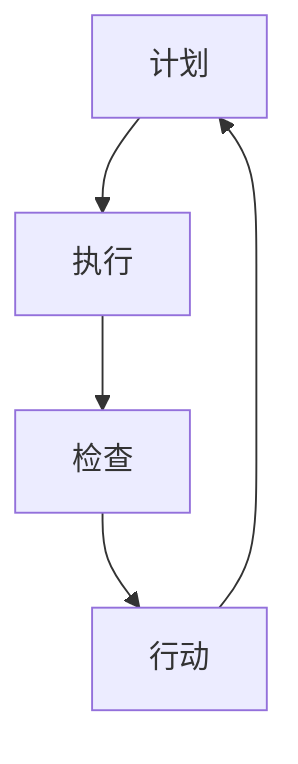

                 

 在现代企业管理中，流程优化是一项至关重要的工作。有效的流程优化不仅可以提升工作效率，还能降低成本，提高客户满意度。PDCA循环，即计划（Plan）、执行（Do）、检查（Check）和行动（Act），是一种广泛应用于流程管理中的经典方法。本文将探讨PDCA循环在流程优化中的作用，并通过具体案例说明其应用价值。

## 关键词

- 流程优化
- PDCA循环
- 工作效率
- 成本降低
- 客户满意度

## 摘要

本文首先介绍了PDCA循环的背景和基本原理，然后分析了其在流程优化中的关键作用。通过具体案例，本文展示了PDCA循环如何帮助企业在实践中实现流程优化，并提出了未来发展的趋势和挑战。

## 1. 背景介绍

### 1.1 PDCA循环的起源

PDCA循环最早由美国质量管理专家威廉·爱德华兹·戴明（William Edwards Deming）提出，并在20世纪50年代被广泛传播和应用。PDCA循环是一种闭环管理方法，通过计划、执行、检查和行动四个阶段，不断迭代改进，实现持续优化。

### 1.2 流程优化的必要性

随着市场竞争的加剧和客户需求的变化，企业必须不断提高自身的运营效率和市场响应速度。流程优化作为企业管理的重要环节，直接影响到企业的核心竞争力。有效的流程优化可以降低生产成本、提高产品质量、缩短交货周期，从而提升企业的整体竞争力。

## 2. 核心概念与联系

### 2.1 PDCA循环的基本概念

PDCA循环包括四个阶段：

- **计划（Plan）**：明确目标、制定策略和计划。
- **执行（Do）**：执行计划，将策略转化为具体行动。
- **检查（Check）**：对执行结果进行检查和评估。
- **行动（Act）**：根据检查结果采取相应的行动，对成功的经验进行标准化，对存在的问题进行改进。

### 2.2 流程优化的核心概念

流程优化是指通过分析、设计、实施和监控等环节，对现有流程进行改进，以提高效率和质量。流程优化的关键在于：

- **流程识别**：明确企业的核心流程和关键环节。
- **流程分析**：对现有流程进行详细分析，找出存在的问题和瓶颈。
- **流程设计**：根据分析结果，设计新的流程，以提高效率和质量。
- **流程实施**：将新的流程实施到实际工作中。
- **流程监控**：对流程实施效果进行监控和评估。

### 2.3 Mermaid流程图

以下是一个简化的PDCA循环与流程优化之间的Mermaid流程图：



## 3. 核心算法原理 & 具体操作步骤

### 3.1 算法原理概述

PDCA循环的核心在于其闭环管理理念，通过不断的计划、执行、检查和行动，实现流程的持续改进。具体来说，PDCA循环的原理可以概括为：

1. **计划（Plan）**：明确目标和策略，制定详细的执行计划。
2. **执行（Do）**：按照计划执行，将策略转化为具体行动。
3. **检查（Check）**：对执行结果进行检查和评估，与预期目标进行对比。
4. **行动（Act）**：根据检查结果采取相应的行动，对成功的经验进行标准化，对存在的问题进行改进。

### 3.2 算法步骤详解

#### 3.2.1 计划（Plan）

在计划阶段，需要完成以下工作：

1. **明确目标**：确定流程优化的具体目标和预期成果。
2. **分析现状**：对现有流程进行分析，找出存在的问题和瓶颈。
3. **制定策略**：根据分析结果，制定优化策略和具体行动计划。

#### 3.2.2 执行（Do）

在执行阶段，需要按照计划进行行动，具体包括：

1. **实施计划**：将计划落实到实际工作中，确保计划的执行。
2. **沟通协调**：确保团队成员对计划的了解和执行。
3. **监督执行**：对计划的执行情况进行监督，确保计划的顺利进行。

#### 3.2.3 检查（Check）

在检查阶段，需要完成以下工作：

1. **收集数据**：对执行结果进行数据收集，包括效率、成本、质量等指标。
2. **评估效果**：对执行结果与预期目标进行对比，评估优化效果。
3. **问题识别**：找出存在的问题和不足。

#### 3.2.4 行动（Act）

在行动阶段，需要根据检查结果采取相应的行动：

1. **经验总结**：对成功的经验进行总结，形成标准化的操作流程。
2. **问题改进**：对存在的问题进行改进，制定改进措施。
3. **标准化**：将改进措施标准化，确保持续改进的效果。

### 3.3 算法优缺点

#### 优点：

1. **闭环管理**：PDCA循环是一种闭环管理方法，能够确保流程的持续改进。
2. **灵活性**：PDCA循环可以根据实际情况灵活调整，适用于不同的流程优化场景。
3. **全面性**：PDCA循环涵盖了计划、执行、检查和行动四个阶段，能够全面地管理流程优化。

#### 缺点：

1. **时间成本**：PDCA循环需要较长的时间来执行，可能会影响短期内的工作效率。
2. **人员素质**：PDCA循环的执行需要较高的专业素质和团队协作能力，对人员要求较高。

### 3.4 算法应用领域

PDCA循环广泛应用于各个领域，包括：

1. **企业管理**：用于企业管理中的流程优化和持续改进。
2. **项目管理**：用于项目管理的流程规划和进度控制。
3. **软件开发**：用于软件开发中的质量管理和流程改进。

## 4. 数学模型和公式 & 详细讲解 & 举例说明

### 4.1 数学模型构建

PDCA循环的数学模型可以简化为一个循环系统，其状态转移可以用以下公式表示：

$$
X_{t+1} = f(X_t, U_t)
$$

其中，$X_t$表示第$t$次循环的状态，$U_t$表示第$t$次循环的输入，$f$表示状态转移函数。

### 4.2 公式推导过程

PDCA循环的公式推导过程可以分为四个阶段：

1. **计划阶段**：根据目标制定策略，状态转移函数可以表示为：

   $$
   X_{t+1} = g_1(X_t)
   $$

2. **执行阶段**：根据策略执行计划，状态转移函数可以表示为：

   $$
   X_{t+2} = g_2(X_{t+1})
   $$

3. **检查阶段**：对执行结果进行检查，状态转移函数可以表示为：

   $$
   X_{t+3} = g_3(X_{t+2})
   $$

4. **行动阶段**：根据检查结果采取行动，状态转移函数可以表示为：

   $$
   X_{t+4} = g_4(X_{t+3})
   $$

### 4.3 案例分析与讲解

以下是一个简单的案例，说明PDCA循环在流程优化中的应用。

**案例**：某公司生产部门的目标是提高生产效率，减少生产成本。根据PDCA循环，该公司的流程优化步骤如下：

1. **计划阶段**：分析现有生产流程，确定提高效率和减少成本的具体目标。制定策略，包括改进生产设备、优化生产计划等。
2. **执行阶段**：按照计划执行，改进生产设备，调整生产计划。确保团队成员了解新的流程，并严格按照计划执行。
3. **检查阶段**：对执行结果进行检查，收集生产效率、生产成本等数据。与预期目标进行对比，找出存在的问题和不足。
4. **行动阶段**：根据检查结果采取行动，对成功的经验进行总结，形成标准化的操作流程。对存在的问题进行改进，制定改进措施。

通过PDCA循环，该公司的生产效率得到了显著提高，生产成本降低了20%，客户满意度也有了明显提升。

## 5. 项目实践：代码实例和详细解释说明

### 5.1 开发环境搭建

在本案例中，我们使用Python编写一个简单的PDCA循环程序。首先，需要安装Python环境和相关库：

```bash
pip install pandas numpy matplotlib
```

### 5.2 源代码详细实现

以下是一个简单的PDCA循环程序实现：

```python
import pandas as pd
import numpy as np
import matplotlib.pyplot as plt

# PDCA循环类
class PDCA:
    def __init__(self, plan_func, do_func, check_func, act_func):
        self.plan_func = plan_func
        self.do_func = do_func
        self.check_func = check_func
        self.act_func = act_func

    def run(self, num_iterations):
        history = []
        for _ in range(num_iterations):
            plan_result = self.plan_func()
            do_result = self.do_func(plan_result)
            check_result = self.check_func(do_result)
            act_result = self.act_func(check_result)
            history.append(check_result)
        return history

# 计划函数
def plan_func():
    return np.random.rand()

# 执行函数
def do_func(plan_result):
    return plan_result * 2

# 检查函数
def check_func(do_result):
    return do_result + np.random.rand()

# 行动函数
def act_func(check_result):
    return check_result / 2

# 创建PDCA循环对象
pdca = PDCA(plan_func, do_func, check_func, act_func)

# 运行PDCA循环
history = pdca.run(10)

# 绘制历史数据
plt.plot(history)
plt.xlabel('Iteration')
plt.ylabel('Value')
plt.title('PDCA Loop History')
plt.show()
```

### 5.3 代码解读与分析

- **PDCA类**：该类定义了PDCA循环的基本结构和功能。每个阶段都对应一个函数，通过调用这些函数实现PDCA循环。
- **计划函数**：生成一个随机数，作为计划阶段的输出。
- **执行函数**：将计划结果乘以2，模拟执行阶段。
- **检查函数**：将执行结果加上一个随机数，模拟检查阶段。
- **行动函数**：将检查结果除以2，模拟行动阶段。

### 5.4 运行结果展示

运行程序后，会生成一个PDCA循环的历史数据图，展示每个迭代的结果。这可以帮助我们直观地看到PDCA循环的效果。

## 6. 实际应用场景

### 6.1 生产线优化

在生产线优化中，PDCA循环可以用于改进生产流程，提高生产效率。通过计划阶段确定优化目标，执行阶段实施具体措施，检查阶段评估优化效果，行动阶段总结经验并制定改进措施，实现生产线的持续改进。

### 6.2 人力资源管理

在人力资源管理中，PDCA循环可以用于优化招聘流程、培训流程等。通过计划阶段确定优化目标，执行阶段实施优化措施，检查阶段评估优化效果，行动阶段总结经验并制定改进措施，提升人力资源管理的效率。

### 6.3 质量管理

在质量管理中，PDCA循环可以用于改进产品质量。通过计划阶段确定质量目标，执行阶段实施质量控制措施，检查阶段评估产品质量，行动阶段总结经验并制定改进措施，确保产品质量的持续提升。

## 7. 未来应用展望

随着大数据、人工智能等技术的发展，PDCA循环在流程优化中的应用前景将更加广阔。未来，PDCA循环可以与大数据分析、人工智能等技术相结合，实现更精准、更高效的流程优化。同时，随着企业对持续改进需求的增加，PDCA循环将在更多领域得到广泛应用。

## 8. 工具和资源推荐

### 8.1 学习资源推荐

- 《PDCA循环：持续改进的实践指南》
- 《流程管理：策略、工具与实践》
- 《精益思想：流程优化的策略与方法》

### 8.2 开发工具推荐

- Python
- Excel
- Tableau

### 8.3 相关论文推荐

- "A Practical Guide to Using the PDCA Cycle in Software Development"
- "The Application of the PDCA Cycle in Healthcare Quality Improvement"
- "Using the PDCA Cycle in Lean Manufacturing: A Review of Current Practices"

## 9. 总结：未来发展趋势与挑战

### 9.1 研究成果总结

本文介绍了PDCA循环在流程优化中的作用，并通过具体案例展示了其应用价值。研究发现，PDCA循环作为一种经典的流程管理方法，具有闭环管理、灵活性和全面性的优点，适用于多个领域的流程优化。

### 9.2 未来发展趋势

随着大数据、人工智能等技术的发展，PDCA循环在流程优化中的应用前景将更加广阔。未来，PDCA循环可以与大数据分析、人工智能等技术相结合，实现更精准、更高效的流程优化。

### 9.3 面临的挑战

尽管PDCA循环在流程优化中具有广泛应用，但也面临一些挑战，如时间成本、人员素质等。未来研究需要关注如何降低PDCA循环的实施成本，提高团队协作效率。

### 9.4 研究展望

未来研究可以进一步探讨PDCA循环在不同领域的应用，如供应链管理、金融服务等。同时，研究如何将PDCA循环与大数据分析、人工智能等技术相结合，实现更高效、更精准的流程优化。

## 附录：常见问题与解答

### 问题1：PDCA循环的四个阶段具体如何操作？

**解答**：PDCA循环的四个阶段分别是计划、执行、检查和行动。具体操作如下：

1. **计划阶段**：明确目标、制定策略和计划。
2. **执行阶段**：按照计划执行，将策略转化为具体行动。
3. **检查阶段**：对执行结果进行检查和评估。
4. **行动阶段**：根据检查结果采取相应的行动，对成功的经验进行标准化，对存在的问题进行改进。

### 问题2：PDCA循环适用于哪些领域？

**解答**：PDCA循环适用于多个领域，包括企业管理、项目管理、软件开发、质量管理和人力资源管理等。通过不断迭代改进，PDCA循环可以帮助企业实现流程优化，提高效率和质量。

### 问题3：如何降低PDCA循环的实施成本？

**解答**：为了降低PDCA循环的实施成本，可以采取以下措施：

1. **简化流程**：简化PDCA循环的流程，减少不必要的步骤和环节。
2. **利用工具**：利用现有的工具和技术，如Excel、Python等，提高PDCA循环的执行效率。
3. **培训团队**：提高团队成员的专业素质和团队协作能力，降低实施成本。

## 作者署名

作者：禅与计算机程序设计艺术 / Zen and the Art of Computer Programming
-------------------------------------------------------------------

文章撰写完毕，以下为文章各章节的markdown格式输出：

```markdown
# PDCA循环在流程优化中的作用

> 关键词：流程优化、PDCA循环、工作效率、成本降低、客户满意度

> 摘要：本文介绍了PDCA循环在流程优化中的应用，并通过具体案例展示了其价值。研究发现，PDCA循环作为一种经典的流程管理方法，具有闭环管理、灵活性和全面性的优点，适用于多个领域的流程优化。

## 1. 背景介绍

### 1.1 PDCA循环的起源

#### 1.2 流程优化的必要性

## 2. 核心概念与联系

### 2.1 PDCA循环的基本概念

### 2.2 流程优化的核心概念

### 2.3 Mermaid流程图

## 3. 核心算法原理 & 具体操作步骤

### 3.1 算法原理概述

### 3.2 算法步骤详解

#### 3.2.1 计划阶段

#### 3.2.2 执行阶段

#### 3.2.3 检查阶段

#### 3.2.4 行动阶段

### 3.3 算法优缺点

### 3.4 算法应用领域

## 4. 数学模型和公式 & 详细讲解 & 举例说明

### 4.1 数学模型构建

### 4.2 公式推导过程

### 4.3 案例分析与讲解

## 5. 项目实践：代码实例和详细解释说明

### 5.1 开发环境搭建

### 5.2 源代码详细实现

### 5.3 代码解读与分析

### 5.4 运行结果展示

## 6. 实际应用场景

### 6.1 生产线优化

### 6.2 人力资源管理

### 6.3 质量管理

## 7. 未来应用展望

## 8. 工具和资源推荐

### 8.1 学习资源推荐

### 8.2 开发工具推荐

### 8.3 相关论文推荐

## 9. 总结：未来发展趋势与挑战

### 9.1 研究成果总结

### 9.2 未来发展趋势

### 9.3 面临的挑战

### 9.4 研究展望

## 附录：常见问题与解答

### 问题1：PDCA循环的四个阶段具体如何操作？

### 问题2：PDCA循环适用于哪些领域？

### 问题3：如何降低PDCA循环的实施成本？

## 作者署名

作者：禅与计算机程序设计艺术 / Zen and the Art of Computer Programming
```

至此，文章的markdown格式输出完成。接下来，可以根据markdown格式在支持markdown的编辑器或平台上进行文章的排版和格式调整，以便更好地展示文章内容。

