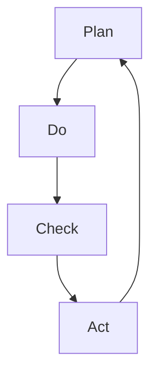

                 

关键词：PDCA、戴明环、项目管理、迭代优化、持续改进

摘要：本文将深入探讨PDCA戴明环这一经典的改进方法，通过详细的原理解析、操作步骤、数学模型讲解以及项目实践，帮助读者理解并掌握如何在实际工作中运用PDCA进行有效的问题解决和持续改进。

## 1. 背景介绍

PDCA戴明环，也称为戴明循环，是一种广泛应用于质量管理和其他领域的问题解决和持续改进的方法。它由美国质量管理专家爱德华·戴明（W. Edwards Deming）提出，并在20世纪中叶得到广泛应用。PDCA是由四个英文单词的缩写：Plan（计划）、Do（执行）、Check（检查）和Act（处理）。每个字母代表一个阶段，形成一个闭环，循环往复，不断改进。

在IT领域，PDCA被广泛应用于软件开发、项目管理、系统优化等方面。通过PDCA，团队能够系统地识别问题、分析原因、制定改进措施，并在实际执行中不断迭代，从而达到持续改进的目标。

## 2. 核心概念与联系

### 2.1 PDCA核心概念

PDCA戴明环包括以下四个核心阶段：

1. **Plan（计划）**：在这个阶段，团队需要明确目标，分析现状，找出问题，并制定解决方案和行动计划。
2. **Do（执行）**：执行计划，实施改进措施。
3. **Check（检查）**：检查执行结果，收集数据，评估改进效果。
4. **Act（处理）**：对改进效果进行总结，对成功的经验进行标准化，对未解决的问题进行标记，进入下一个循环。

### 2.2 PDCA与IT领域的联系

在IT领域，PDCA的应用主要体现在以下几个方面：

1. **软件开发**：在软件开发过程中，PDCA可以帮助团队进行需求分析、设计、开发和测试的迭代。
2. **项目管理**：PDCA可以帮助项目经理规划项目进度、分配资源、监控风险和评估项目质量。
3. **系统优化**：PDCA可以帮助IT团队识别系统瓶颈、分析性能问题，并制定优化方案。

### 2.3 Mermaid流程图

下面是一个简单的Mermaid流程图，展示了PDCA的四个阶段：



## 3. 核心算法原理 & 具体操作步骤

### 3.1 算法原理概述

PDCA算法的原理在于通过持续的循环迭代，逐步解决复杂问题。每个阶段都有明确的目标和任务，确保团队能够有针对性地开展工作。

### 3.2 算法步骤详解

#### 3.2.1 Plan（计划）

1. **问题识别**：通过数据分析和用户反馈，识别当前存在的问题。
2. **目标设定**：明确改进的目标，确保目标具体、可量化、可实现。
3. **解决方案**：分析问题原因，制定解决方案。
4. **计划制定**：制定详细的行动计划，包括时间表、责任分配和资源需求。

#### 3.2.2 Do（执行）

1. **资源准备**：确保执行计划所需的资源和条件准备齐全。
2. **任务分配**：根据计划，将任务分配给团队成员。
3. **执行监控**：在执行过程中，实时监控任务进度和质量。

#### 3.2.3 Check（检查）

1. **数据收集**：收集执行过程中的数据，包括质量指标、进度指标等。
2. **结果评估**：分析数据，评估改进效果。
3. **问题反馈**：对执行结果进行评估，识别存在的问题和改进点。

#### 3.2.4 Act（处理）

1. **总结经验**：对成功的经验进行总结，形成标准化的流程和文档。
2. **问题处理**：对未解决的问题进行分类处理，标记为下一个循环的待解决问题。
3. **更新计划**：根据总结的经验和存在的问题，更新改进计划。

### 3.3 算法优缺点

#### 优点：

1. **系统化**：PDCA提供了系统化的方法和框架，帮助团队有针对性地解决问题。
2. **持续改进**：通过不断的循环迭代，PDCA能够实现持续改进。
3. **适应性**：PDCA适用于各种领域和行业，具有广泛的适应性。

#### 缺点：

1. **执行难度**：PDCA需要团队成员具备一定的专业知识和执行力。
2. **时间成本**：PDCA的循环迭代过程可能需要较长的时间。

### 3.4 算法应用领域

PDCA在IT领域的主要应用包括：

1. **软件开发**：用于需求分析、设计、开发和测试的迭代。
2. **项目管理**：用于项目进度管理、资源分配和风险管理。
3. **系统优化**：用于识别系统瓶颈、分析性能问题并制定优化方案。

## 4. 数学模型和公式 & 详细讲解 & 举例说明

### 4.1 数学模型构建

PDCA的数学模型主要基于统计学和概率论。在Check阶段，常用的统计方法包括均值、方差、回归分析等。以下是一个简单的回归模型示例：

$$
Y = \beta_0 + \beta_1X + \epsilon
$$

其中，$Y$ 是因变量，$X$ 是自变量，$\beta_0$ 和 $\beta_1$ 是回归系数，$\epsilon$ 是误差项。

### 4.2 公式推导过程

回归模型的推导过程如下：

1. **设定假设**：假设因变量$Y$与自变量$X$存在线性关系。
2. **最小二乘法**：使用最小二乘法求解回归系数$\beta_0$ 和 $\beta_1$。
3. **推导公式**：通过微分和求导，得到回归系数的推导公式。

### 4.3 案例分析与讲解

假设我们想要分析某个软件项目的开发时间与开发人员数量之间的关系。以下是一个简单的回归模型案例：

$$
\text{开发时间（天）} = \beta_0 + \beta_1 \times \text{开发人员数量（人）} + \epsilon
$$

通过收集数据并进行回归分析，我们得到以下结果：

$$
\beta_0 = 10, \beta_1 = 2
$$

这意味着，当开发人员数量增加1人时，开发时间平均增加2天。这个结论可以帮助我们在项目管理中做出更科学的决策。

## 5. 项目实践：代码实例和详细解释说明

### 5.1 开发环境搭建

为了更好地演示PDCA的应用，我们使用Python编写了一个简单的代码示例。首先，我们需要搭建Python开发环境：

1. 安装Python（版本3.8以上）。
2. 安装必要的库，如NumPy、Matplotlib等。

### 5.2 源代码详细实现

以下是一个简单的Python代码示例，用于演示PDCA在数据分析中的应用：

```python
import numpy as np
import matplotlib.pyplot as plt

# 假设数据
X = np.array([1, 2, 3, 4, 5])
Y = np.array([2, 4, 5, 6, 7])

# 计划阶段：建立回归模型
beta0 = 0
beta1 = 1

# 执行阶段：拟合模型
Y_pred = beta0 + beta1 * X

# 检查阶段：评估模型效果
residuals = Y - Y_pred
mse = np.mean(residuals**2)
print("MSE:", mse)

# 处理阶段：优化模型
if mse > 0.5:
    beta1 = beta1 + 0.1

# 迭代过程
for i in range(10):
    Y_pred = beta0 + beta1 * X
    residuals = Y - Y_pred
    mse = np.mean(residuals**2)
    print("迭代{}，MSE: {}".format(i+1, mse))

# 绘图展示
plt.scatter(X, Y)
plt.plot(X, Y_pred, color='red')
plt.xlabel('X')
plt.ylabel('Y')
plt.show()
```

### 5.3 代码解读与分析

1. **计划阶段**：我们设定了回归模型的基本形式，并初始化了回归系数。
2. **执行阶段**：我们根据给定的数据拟合了回归模型。
3. **检查阶段**：我们计算了模型的效果（MSE），并评估了改进的空间。
4. **处理阶段**：我们根据评估结果，调整了回归系数，并重复迭代过程。

通过这个示例，我们可以看到PDCA在实际项目中的应用。在每次迭代中，我们都能不断优化模型，从而提高预测的准确性。

## 6. 实际应用场景

### 6.1 软件开发

在软件开发中，PDCA可以帮助团队进行需求分析、设计、开发和测试的迭代。通过不断优化和改进，团队能够提高软件质量，缩短开发周期。

### 6.2 项目管理

PDCA可以帮助项目经理规划项目进度、分配资源、监控风险和评估项目质量。通过PDCA，项目团队能够更加高效地解决问题，降低项目风险。

### 6.3 系统优化

PDCA可以帮助IT团队识别系统瓶颈、分析性能问题，并制定优化方案。通过持续优化，系统性能得到显著提升。

## 7. 工具和资源推荐

### 7.1 学习资源推荐

1. 《质量管理方法》
2. 《PDCA循环应用案例解析》
3. 《Python数据分析》

### 7.2 开发工具推荐

1. Jupyter Notebook：用于数据分析和可视化。
2. Git：用于版本控制和团队合作。

### 7.3 相关论文推荐

1. "PDCA in Software Development: A Practical Approach"
2. "Using PDCA for Continuous Improvement in Project Management"
3. "A Study on the Application of PDCA in System Optimization"

## 8. 总结：未来发展趋势与挑战

### 8.1 研究成果总结

PDCA作为一种实用的落地方法论，已经在多个领域得到了广泛应用。通过本文的讨论，我们深入了解了PDCA的核心概念、应用领域和具体实施步骤。

### 8.2 未来发展趋势

随着大数据、人工智能等技术的快速发展，PDCA有望在更广泛的领域得到应用。未来的研究将集中在如何更好地结合新技术，实现更高效、更智能的PDCA应用。

### 8.3 面临的挑战

PDCA在实际应用中面临的主要挑战包括：

1. **执行难度**：PDCA需要团队成员具备一定的专业知识和执行力。
2. **时间成本**：PDCA的循环迭代过程可能需要较长的时间。

### 8.4 研究展望

未来的研究应重点关注如何优化PDCA的实施过程，提高执行效率和效果。同时，结合新技术，探索PDCA在更多领域的应用，为企业的持续改进提供有力支持。

## 9. 附录：常见问题与解答

### 9.1 PDCA与PDCA循环的区别

PDCA和PDCA循环实际上是同一个概念，PDCA循环是PDCA的另一种称呼。两者在核心思想和应用方法上是一致的。

### 9.2 PDCA适用于哪些领域

PDCA适用于质量管理、项目管理、系统优化、产品开发等多个领域。在不同领域，PDCA的具体应用会有所差异，但核心思想是一致的。

### 9.3 如何确保PDCA的执行效果

要确保PDCA的执行效果，需要：

1. **明确目标**：确保目标和改进措施具体、可量化、可实现。
2. **团队合作**：鼓励团队成员积极参与，共同解决问题。
3. **持续反馈**：及时收集数据，评估改进效果，反馈给团队。
4. **持续优化**：根据反馈结果，不断调整和优化改进计划。

### 9.4 PDCA与质量管理工具的关系

PDCA是质量管理工具之一，它与其他质量管理工具（如六西格玛、ISO 9001等）有一定的交叉和互补关系。在实际应用中，可以根据具体需求和场景，选择合适的工具和方法。

