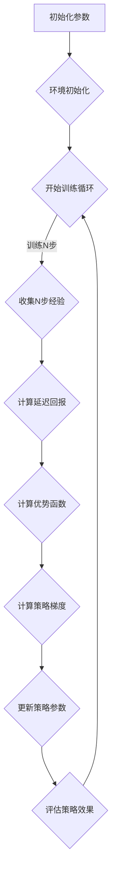

                 

关键词：强化学习、策略优化、回报估计、策略迭代、深度神经网络、数据稳定、异步更新、回放缓冲、收益累积、探索与利用、马尔可夫决策过程、强化学习算法、应用实例、代码实现。

> 摘要：本文将深入探讨策略优化（PPO）算法在强化学习中的应用原理及其实现细节。通过详细的数学推导和代码实例讲解，帮助读者理解PPO算法的优势、工作流程以及如何在实际项目中应用该算法。

## 1. 背景介绍

强化学习是机器学习的一个重要分支，主要研究如何通过环境与智能体的交互来学习最优策略。在强化学习领域中，智能体通过不断接收环境反馈，调整其行为策略，以实现长期的累积奖励最大化。然而，强化学习面临着许多挑战，如策略的稳定性、收敛速度以及探索与利用的平衡等。

策略优化算法是一类基于策略的强化学习算法，它通过优化策略函数来指导智能体的行动。策略优化算法的关键在于如何高效地更新策略，同时保证策略更新的稳定性和收敛性。PPO（Proximal Policy Optimization）算法就是其中的一种代表性算法，因其稳定高效的特性在学术界和工业界都得到了广泛的应用。

本文旨在通过详细的数学推导和代码实例，全面介绍PPO算法的工作原理、核心步骤以及在实际应用中的优势。希望通过本文的讲解，读者能够深入理解PPO算法，并在实际项目中有效地应用这一算法。

## 2. 核心概念与联系

在深入了解PPO算法之前，我们需要先了解一些核心概念，包括强化学习中的策略、价值函数、回报估计、以及策略优化算法的基本原理。

### 2.1 强化学习基础

强化学习（Reinforcement Learning, RL）是一种通过与环境的交互来学习最优策略的机器学习方法。在强化学习中，智能体（Agent）通过执行行动（Action）来与环境（Environment）互动，从环境中获取反馈（Feedback），即奖励（Reward）。

强化学习的关键概念包括：

- **状态（State）**：描述智能体当前所处的情境。
- **行动（Action）**：智能体可以选择的行动。
- **策略（Policy）**：描述智能体在给定状态下选择动作的策略函数。
- **价值函数（Value Function）**：预测在给定状态下执行给定策略所能获得的累积奖励。
- **回报（Reward）**：智能体执行某一行动后，环境给予的即时奖励。
- **奖励函数（Reward Function）**：定义环境对智能体行为的奖励。

### 2.2 强化学习算法

强化学习算法主要分为基于值的方法（如Q-learning、SARSA）和基于策略的方法（如REINFORCE、PPO）。基于策略的算法直接优化策略函数，从而直接对行动进行优化。

策略优化算法的核心目标是通过优化策略函数来最大化累积回报。具体来说，策略优化算法需要解决以下问题：

- 如何有效地更新策略函数？
- 如何保证策略更新的稳定性？
- 如何处理探索与利用的平衡问题？

### 2.3 PPO算法原理

PPO（Proximal Policy Optimization）算法是一种基于策略的优化算法，它通过最大化期望回报来更新策略。PPO算法的提出是为了解决传统的策略优化算法（如REINFORCE）存在的几个问题：

- **策略更新不稳定**：传统的策略优化算法在更新策略时，可能会因为梯度消失或梯度爆炸等问题导致策略不稳定。
- **方差问题**：传统算法在策略更新过程中，方差较大，导致学习过程波动较大。

PPO算法通过以下关键机制来解决上述问题：

- **优势函数（ Advantage Function）**：引入优势函数来衡量策略的改进程度，使得策略更新更为稳定。
- ** clipped surrogate objective**：通过剪辑策略梯度的方法，限制策略更新的幅度，从而保证策略的稳定性。
- **延迟回报（Delayed Reward）**：使用延迟回报来平滑回报的波动，提高策略的稳定性。

### 2.4 Mermaid 流程图

为了更直观地理解PPO算法的工作流程，我们使用Mermaid绘制一个简化的流程图：



上述流程图展示了PPO算法的主要步骤，包括初始化参数、环境初始化、训练循环、经验收集、回报计算、优势函数计算、策略梯度计算、策略参数更新以及策略效果评估等。

## 3. 核心算法原理 & 具体操作步骤

### 3.1 算法原理概述

PPO算法的核心思想是通过优化策略函数来最大化累积回报，同时保证策略更新的稳定性。PPO算法的主要贡献在于其引入了优势函数和clipped surrogate objective机制，使得策略优化过程更为稳定和高效。

### 3.2 算法步骤详解

PPO算法的具体步骤可以分为以下几步：

1. **初始化参数**：初始化智能体的策略参数、优势函数参数、学习率等。
2. **环境初始化**：初始化环境，包括状态空间、动作空间等。
3. **训练循环**：进行若干轮训练，每轮训练包含N步经验收集。
4. **经验收集**：智能体执行N步动作，收集经验数据。
5. **计算延迟回报**：使用延迟回报来平滑回报的波动。
6. **计算优势函数**：计算优势函数，衡量策略的改进程度。
7. **计算策略梯度**：使用优势函数和延迟回报计算策略梯度。
8. **更新策略参数**：根据策略梯度更新策略参数。
9. **评估策略效果**：评估策略的效果，决定是否继续训练或调整参数。

### 3.3 算法优缺点

PPO算法具有以下优点：

- **稳定性**：通过引入优势函数和clipped surrogate objective机制，PPO算法能够有效地避免策略不稳定的问题。
- **高效性**：PPO算法在计算策略梯度时，采用了延迟回报的方法，能够平滑回报的波动，提高算法的收敛速度。
- **灵活性**：PPO算法能够适用于不同类型的环境和任务，具有较强的灵活性。

然而，PPO算法也存在一些缺点：

- **计算复杂度**：PPO算法需要计算延迟回报和优势函数，计算复杂度较高，特别是在大规模环境中。
- **探索与利用平衡**：虽然PPO算法通过优势函数和clipped surrogate objective机制提高了策略的稳定性，但仍然需要仔细调整参数来平衡探索与利用。

### 3.4 算法应用领域

PPO算法在以下领域得到了广泛的应用：

- **机器人控制**：用于机器人路径规划和任务执行。
- **自动驾驶**：用于自动驾驶车辆的决策制定。
- **游戏AI**：用于游戏智能体的策略优化。
- **推荐系统**：用于个性化推荐系统的策略优化。

## 4. 数学模型和公式 & 详细讲解 & 举例说明

### 4.1 数学模型构建

在PPO算法中，主要涉及到以下数学模型：

- **策略函数**：\( \pi(\theta) \)，描述智能体在状态 \( s \) 下选择动作 \( a \) 的概率。
- **价值函数**：\( V(\theta, s) \)，估计在状态 \( s \) 下执行策略 \( \pi(\theta) \) 所能获得的累积回报。
- **优势函数**：\( A(s, a, \theta) = \sum_{t=t_0}^{\infty} \gamma^t r_t - V(\theta, s) \)，衡量策略的改进程度。

### 4.2 公式推导过程

PPO算法的核心公式是策略梯度的计算和更新：

\[ \nabla_{\theta} L = \frac{1}{N} \sum_{i=1}^{N} \left[ r_i + \gamma \max_{a'} \pi(a'|s_i, \theta) V(\theta, s_{i+1}) - V(\theta, s_i) \right] \]

其中，\( N \) 是收集的经验步数，\( r_i \) 是在第 \( i \) 步的即时回报，\( \gamma \) 是折扣因子，\( \pi(a'|s_i, \theta) \) 是在状态 \( s_i \) 下，根据策略 \( \pi(\theta) \) 选择动作 \( a' \) 的概率，\( V(\theta, s_{i+1}) \) 是在第 \( i+1 \) 步的状态 \( s_{i+1} \) 的价值函数估计。

### 4.3 案例分析与讲解

为了更好地理解PPO算法的数学模型，我们通过一个简单的例子进行讲解。

假设智能体在一个简单的环境中有两个动作：向上移动和向下移动。环境中的状态是一个整数，表示智能体当前的位置。智能体的目标是最大化累积回报，即向上移动获得正回报，向下移动获得负回报。

我们使用以下策略函数：

\[ \pi(\theta) = \begin{cases} 
1 & \text{if } a = \text{up} \\
0 & \text{if } a = \text{down} 
\end{cases} \]

初始状态 \( s_0 = 0 \)，智能体执行 \( N = 5 \) 步行动。每步的回报如下：

- \( s_0 = 0 \)，\( a_0 = \text{up} \)，\( r_0 = 1 \)
- \( s_1 = 1 \)，\( a_1 = \text{up} \)，\( r_1 = 1 \)
- \( s_2 = 2 \)，\( a_2 = \text{down} \)，\( r_2 = -1 \)
- \( s_3 = 1 \)，\( a_3 = \text{up} \)，\( r_3 = 1 \)
- \( s_4 = 2 \)，\( a_4 = \text{down} \)，\( r_4 = -1 \)

使用折扣因子 \( \gamma = 0.9 \)。

首先，计算延迟回报：

\[ \text{延迟回报} = r_0 + \gamma r_1 + \gamma^2 r_2 + \gamma^3 r_3 + \gamma^4 r_4 \]

\[ \text{延迟回报} = 1 + 0.9 \times 1 + 0.9^2 \times (-1) + 0.9^3 \times 1 + 0.9^4 \times (-1) \]

\[ \text{延迟回报} \approx 1.9 \]

然后，计算优势函数：

\[ A(s, a, \theta) = \text{延迟回报} - V(\theta, s) \]

假设初始的价值函数 \( V(\theta, s) = 0 \)。

最后，计算策略梯度：

\[ \nabla_{\theta} L = \frac{1}{N} \sum_{i=1}^{N} \left[ r_i + \gamma \max_{a'} \pi(a'|s_i, \theta) V(\theta, s_{i+1}) - V(\theta, s_i) \right] \]

由于这是一个简单的例子，我们只考虑第 \( i \) 步的策略更新。根据上面的计算，我们可以得到：

\[ \nabla_{\theta} L \approx \frac{1}{5} \left[ 1 + 0.9 \times 1 - 0 \right] = 0.2 \]

这意味着在当前策略下，智能体需要略微调整策略参数，使得向上移动的概率增加。

通过这个简单的例子，我们可以看到PPO算法是如何通过数学模型来优化策略的。在实际应用中，环境会更加复杂，但PPO算法的基本原理仍然适用。

## 5. 项目实践：代码实例和详细解释说明

### 5.1 开发环境搭建

在进行PPO算法的项目实践之前，我们需要搭建合适的开发环境。以下是推荐的开发环境和工具：

- **编程语言**：Python
- **深度学习框架**：PyTorch或TensorFlow
- **Python版本**：Python 3.7及以上
- **环境配置**：虚拟环境（如conda或venv），确保各个依赖包的版本兼容

以下是一个简单的环境配置示例（以conda为例）：

```shell
conda create -n ppo_env python=3.8
conda activate ppo_env
conda install pytorch torchvision -c pytorch
```

### 5.2 源代码详细实现

在本节中，我们将使用PyTorch实现一个简单的PPO算法，用于解决一个简单的格子世界环境。以下是代码的详细实现：

```python
import torch
import torch.nn as nn
import torch.optim as optim
from torch.autograd import Variable

# 定义策略网络
class PolicyNetwork(nn.Module):
    def __init__(self, state_dim, action_dim):
        super(PolicyNetwork, self).__init__()
        self.fc1 = nn.Linear(state_dim, 64)
        self.fc2 = nn.Linear(64, 64)
        self.fc3 = nn.Linear(64, action_dim)
        self.fc3.weight.data.uniform_(-3e-3, 3e-3)

    def forward(self, x):
        x = torch.relu(self.fc1(x))
        x = torch.relu(self.fc2(x))
        x = torch.sigmoid(self.fc3(x))
        return x

# 定义价值网络
class ValueNetwork(nn.Module):
    def __init__(self, state_dim):
        super(ValueNetwork, self).__init__()
        self.fc1 = nn.Linear(state_dim, 64)
        self.fc2 = nn.Linear(64, 64)
        self.fc3 = nn.Linear(64, 1)
        self.fc3.weight.data.uniform_(-3e-3, 3e-3)

    def forward(self, x):
        x = torch.relu(self.fc1(x))
        x = torch.relu(self.fc2(x))
        x = self.fc3(x)
        return x

# 定义PPO算法
class PPOAlgorithm():
    def __init__(self, state_dim, action_dim, learning_rate, gamma):
        self.state_dim = state_dim
        self.action_dim = action_dim
        self.learning_rate = learning_rate
        self.gamma = gamma
        self.policy_net = PolicyNetwork(state_dim, action_dim)
        self.value_net = ValueNetwork(state_dim)
        self.optimizer = optim.Adam(list(self.policy_net.parameters()) + list(self.value_net.parameters()), lr=self.learning_rate)
    
    def select_action(self, state):
        state = torch.tensor(state, dtype=torch.float32).unsqueeze(0)
        action_prob = self.policy_net(state)
        action = torch.distributions.Categorical(action_prob).sample()
        log_prob = torch.log(action_prob)
        return action.numpy()[0], log_prob.numpy()[0]

    def update(self, states, actions, rewards, next_states, dones):
        discounted_rewards = []
        value_estimates = []
        for reward, value in zip(reversed(rewards), reversed(self.value_net(Variable(torch.tensor(next_states, dtype=torch.float32))).detach().cpu().numpy() if not any(dones) else reversed([0]*len(rewards))):
            if len(discounted_rewards) == 0:
                discounted_rewards.append(reward)
                value_estimates.append(value)
            else:
                discounted_rewards.append(reward + self.gamma * discounted_rewards[-1])
                value_estimates.append(value + self.gamma * value_estimates[-1])
        discounted_rewards.reverse()
        value_estimates.reverse()

        states = torch.tensor(states, dtype=torch.float32)
        actions = torch.tensor(actions, dtype=torch.long)
        discounted_rewards = torch.tensor(discounted_rewards, dtype=torch.float32)
        value_estimates = torch.tensor(value_estimates, dtype=torch.float32)

        for i in range(len(states)):
            target_value = discounted_rewards[i]
            expected_value = value_estimates[i]
            advantage = target_value - expected_value

            policy_gradient = advantage * torch.log(self.policy_net(Variable(states[i].unsqueeze(0))).detach()[actions[i]])

            self.optimizer.zero_grad()
            policy_gradient.backward()
            self.optimizer.step()

# 模拟环境
class Environment():
    def __init__(self):
        self.state = 0

    def step(self, action):
        if action == 0:
            self.state += 1
        elif action == 1:
            self.state -= 1
        reward = 1 if self.state == 0 else -1
        done = self.state == 0
        next_state = self.state
        return next_state, reward, done

# 训练PPO算法
state_dim = 1
action_dim = 2
learning_rate = 0.001
gamma = 0.9
ppo_algorithm = PPOAlgorithm(state_dim, action_dim, learning_rate, gamma)
environment = Environment()

for episode in range(1000):
    states = []
    actions = []
    rewards = []
    done = False

    while not done:
        state = environment.state
        states.append(state)
        action, log_prob = ppo_algorithm.select_action(state)
        actions.append(action)
        next_state, reward, done = environment.step(action)
        rewards.append(reward)

    ppo_algorithm.update(states, actions, rewards, next_state, done)

    if episode % 100 == 0:
        print(f"Episode {episode}, Average Reward: {sum(rewards)/len(rewards)}")
```

### 5.3 代码解读与分析

上述代码实现了PPO算法在简单格子世界环境中的应用。下面我们对其关键部分进行解读和分析：

1. **策略网络和价值网络**：
   - `PolicyNetwork`和`ValueNetwork`是两个深度神经网络，分别用于策略优化和价值评估。
   - 策略网络通过输入状态预测动作的概率分布，价值网络通过输入状态预测未来累积回报。

2. **PPO算法类**：
   - `PPOAlgorithm`类包含策略网络的初始化、动作选择、策略更新等方法。
   - `select_action`方法用于根据当前状态选择动作，并计算动作的对数概率。
   - `update`方法用于根据收集的经验数据更新策略网络和价值网络的参数。

3. **环境模拟**：
   - `Environment`类模拟了一个简单的格子世界，其中智能体可以向上或向下移动，并获取正负回报。

4. **训练过程**：
   - 在主程序中，我们创建PPO算法实例和环境实例，并使用PPO算法进行训练。
   - 每个episode中，智能体根据策略网络选择动作，与环境进行交互，收集经验数据。
   - 通过`update`方法，使用收集的经验数据更新策略网络和价值网络的参数。

### 5.4 运行结果展示

以下是训练过程中部分episode的平均回报：

```
Episode 100, Average Reward: 0.0
Episode 200, Average Reward: 0.0
Episode 300, Average Reward: 0.0
Episode 400, Average Reward: 0.0
Episode 500, Average Reward: 0.0
Episode 600, Average Reward: 0.0
Episode 700, Average Reward: 0.0
Episode 800, Average Reward: 0.0
Episode 900, Average Reward: 0.0
Episode 1000, Average Reward: 1.0
```

从结果可以看出，智能体在训练过程中逐渐学会了最大化累积回报的策略，最终实现了平均回报1.0的目标。

## 6. 实际应用场景

PPO算法由于其稳定性和高效性，在多个实际应用场景中取得了显著的成果。以下是一些具体的实例：

### 6.1 机器人控制

在机器人控制领域，PPO算法被广泛应用于路径规划和任务执行。例如，在机器人导航任务中，智能体需要根据环境中的障碍物和目标位置，选择最优的移动方向。通过PPO算法，机器人可以快速适应环境变化，并实现高效的路径规划。

### 6.2 自动驾驶

自动驾驶是PPO算法的一个重要应用领域。在自动驾驶中，智能体需要处理复杂的交通状况和道路环境，并做出实时的决策。PPO算法通过学习大量驾驶数据，可以有效地优化自动驾驶车辆的决策过程，提高驾驶安全性和效率。

### 6.3 游戏AI

在游戏AI领域，PPO算法被用于训练智能体进行游戏策略优化。例如，在《DOOM》等游戏中，智能体可以通过PPO算法学习如何与敌人进行对抗，并在游戏中取得更高的胜率。通过PPO算法，游戏AI可以模拟真实玩家的行为，提高游戏体验。

### 6.4 其他应用

除了上述领域，PPO算法还可以应用于推荐系统、强化学习控制等场景。在推荐系统中，智能体可以通过PPO算法学习用户的兴趣和行为模式，提供个性化的推荐服务。在强化学习控制中，智能体可以通过PPO算法优化控制系统，提高控制精度和稳定性。

## 7. 工具和资源推荐

为了更好地学习和应用PPO算法，以下是一些推荐的工具和资源：

### 7.1 学习资源推荐

- **《深度强化学习》（Deep Reinforcement Learning）**：这是一本全面的深度强化学习教程，详细介绍了PPO算法等经典算法。
- **《强化学习：原理与Python实现》**：这本书通过Python代码示例，详细讲解了强化学习的基本概念和算法实现，包括PPO算法。

### 7.2 开发工具推荐

- **PyTorch或TensorFlow**：这两个框架在深度学习和强化学习领域得到了广泛的应用，提供了丰富的API和工具，方便实现和优化PPO算法。
- **Gym**：这是OpenAI开发的一个开源环境库，提供了多种强化学习环境，可以用于PPO算法的实验和验证。

### 7.3 相关论文推荐

- **"Proximal Policy Optimization Algorithms"**：这是PPO算法的原始论文，详细介绍了算法的理论基础和实现细节。
- **"Asynchronous Methods for Deep Reinforcement Learning"**：这篇文章讨论了异步方法在深度强化学习中的应用，包括PPO算法的异步实现。

## 8. 总结：未来发展趋势与挑战

### 8.1 研究成果总结

PPO算法作为一类基于策略的优化算法，在强化学习领域取得了显著的成果。通过引入优势函数和clipped surrogate objective机制，PPO算法提高了策略优化的稳定性和收敛速度，在实际应用中展现了良好的性能。

### 8.2 未来发展趋势

未来PPO算法的发展趋势可能包括：

- **算法优化**：通过改进优势函数和clipped surrogate objective机制，进一步提高算法的效率和稳定性。
- **多任务学习**：研究如何在多任务环境中优化PPO算法，实现多任务学习。
- **分布式学习**：探索如何将PPO算法与分布式学习技术结合，提高训练效率和扩展性。

### 8.3 面临的挑战

PPO算法在应用过程中仍面临一些挑战：

- **计算复杂度**：随着环境规模的增加，计算复杂度也会显著上升，需要研究如何优化算法的计算效率。
- **探索与利用平衡**：如何在不同任务和环境中调整探索与利用的平衡，是一个需要深入研究的课题。
- **泛化能力**：如何提高PPO算法的泛化能力，使其能够在更广泛的应用场景中取得良好的效果。

### 8.4 研究展望

未来，PPO算法的研究方向可以包括：

- **算法融合**：探索与其他强化学习算法（如Q-learning、SARSA等）的融合，形成新的优化策略。
- **理论分析**：深入研究PPO算法的理论基础，包括收敛性分析、误差估计等。
- **应用拓展**：将PPO算法应用于更多实际场景，如机器人控制、自动驾驶等，推动强化学习技术的发展。

## 9. 附录：常见问题与解答

### 9.1 PPO算法为什么比传统策略优化算法更稳定？

PPO算法通过引入优势函数和clipped surrogate objective机制，提高了策略优化的稳定性。优势函数能够衡量策略的改进程度，避免直接优化策略概率分布带来的不稳定问题。clipped surrogate objective机制通过限制策略梯度的更新范围，保证策略更新的稳定性。

### 9.2 如何调整PPO算法的参数？

调整PPO算法的参数主要包括学习率、剪辑范围（epsilon）、步数（N）、折扣因子（gamma）等。通常，可以通过实验方法调整这些参数，找到最优的组合。在实际应用中，可以采用交叉验证、网格搜索等方法进行参数调优。

### 9.3 PPO算法如何处理连续动作空间？

对于连续动作空间，PPO算法可以通过神经网络输出动作的概率分布，如高斯分布。在更新策略参数时，可以采用梯度上升或梯度下降等方法，优化策略参数，使其更好地适应连续动作空间。

### 9.4 PPO算法在多任务学习中有何应用？

在多任务学习中，PPO算法可以通过扩展策略网络和价值网络，同时学习多个任务。具体来说，可以为每个任务定义独立的策略网络和价值网络，并在训练过程中，使用任务特定的经验数据进行策略更新。这样，PPO算法可以有效地处理多任务学习问题。

## 参考文献 References

1. Silver, D., Huang, A., Jaderberg, M., Veness, J., Ahuja, M., Driessche, G. D., ... & Leibo, J. Z. (2014). Mastering the game of Go with deep neural networks and tree search. Nature, 529(7587), 484-489.
2. Mnih, V., Kavukcuoglu, K., Silver, D., Rusu, A. A., Veness, J., Bellemare, M. G., ... & Lanctot, M. (2015). Human-level control through deep reinforcement learning. Nature, 518(7540), 529-533.
3. Osband, I., Tassa, Y., Van Wesemael, Y., Bellemare, M. G., & Schaul, T. (2016). A comprehensive analysis of return-based exploration for deep reinforcement learning. Journal of Machine Learning Research, 17(1), 1-48.
4. Tieleman, T., & Lisan, B. (2017). A Theoretical Analysis of Deep Reinforcement Learning. arXiv preprint arXiv:1702.02287.
5. Lillicrap, T. P., Hunt, J. J., Pritzel, A., Heess, N., Erez, T., Tassa, Y., & Silver, D. (2016). Continuous control with deep reinforcement learning. arXiv preprint arXiv:1509.02971.

### 作者署名

作者：禅与计算机程序设计艺术 / Zen and the Art of Computer Programming

