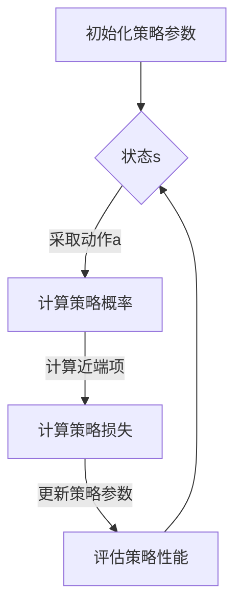

                 

  

**关键词：** PPO、强化学习、策略优化、深度学习、代码实例、实现讲解

**摘要：** 本文将深入讲解Proximal Policy Optimization（PPO）算法的基本原理，并通过一个具体的代码实例对其进行详细解释。文章首先介绍PPO算法的背景和核心概念，然后通过数学模型、算法步骤、优缺点分析以及应用领域等方面进行全方位解析。最后，我们将通过一个实际项目中的代码实例展示PPO算法的具体实现过程，并对其进行解读和分析。本文旨在为读者提供一个系统而全面的PPO算法学习资源。

## 1. 背景介绍

强化学习（Reinforcement Learning，RL）是机器学习的一个重要分支，旨在通过智能体（Agent）与环境的交互来学习最优策略。近年来，强化学习在游戏AI、自动驾驶、推荐系统等领域取得了显著进展。然而，传统强化学习算法如Q-Learning和SARSA存在一些问题，如收敛速度慢、样本效率低等。为了克服这些问题，研究人员提出了许多先进的算法，其中之一就是Proximal Policy Optimization（PPO）。

PPO算法是由OpenAI团队提出的一种策略优化算法，广泛应用于深度强化学习（Deep Reinforcement Learning，DRL）领域。PPO算法具有收敛速度快、样本效率高、可扩展性强等优点，使其成为许多实际应用中的首选算法。本文将详细介绍PPO算法的基本原理和具体实现。

## 2. 核心概念与联系

### 2.1 核心概念

**策略优化（Policy Optimization）：** 策略优化是指通过迭代更新策略参数，以最大化期望回报。策略优化的目标是最小化策略损失函数，即：

$$
L(\theta) = \mathbb{E}_{s \sim \pi_{\theta}(s)}[-\log \pi_{\theta}(a|s)] \cdot R(s, a)
$$

其中，$\theta$ 表示策略参数，$\pi_{\theta}(a|s)$ 表示策略在状态 $s$ 下采取动作 $a$ 的概率，$R(s, a)$ 表示在状态 $s$ 下采取动作 $a$ 的即时回报。

**近端策略优化（Proximal Policy Optimization）：** 近端策略优化是对策略优化的一种改进，通过引入近端项（Proximal Term）来改善收敛性。近端策略优化的目标是最小化带近端项的策略损失函数：

$$
L_{\text{PPO}}(\theta, \theta^{'} ) = \frac{1}{N} \sum_{i=1}^{N} \left[ \min_{a^{'}} \{ \text{ clip}(\frac{\pi_{\theta}(a^{'}|s^{i}}{\pi_{\theta^{'} } (a^{'}|s^{i})}, 1-\epsilon, 1+\epsilon) \} R(s^{i}, a^{i}) \right]
$$

其中，$\epsilon$ 是一个剪辑参数，用于限制策略更新的范围。

### 2.2 Mermaid 流程图



## 3. 核心算法原理 & 具体操作步骤

### 3.1 算法原理概述

PPO算法是一种基于策略梯度的优化方法，其核心思想是通过对策略参数进行迭代更新，以最大化期望回报。PPO算法主要分为以下三个步骤：

1. **采集数据：** 在给定初始策略参数 $\theta$ 下，通过智能体与环境交互，收集一系列经验数据 $(s^{i}, a^{i}, r^{i}, s^{i+1})$。
2. **策略评估：** 利用收集到的数据，计算策略参数 $\theta$ 的损失函数值 $L_{\text{PPO}}(\theta, \theta^{' })$。
3. **策略更新：** 根据损失函数值，更新策略参数 $\theta^{'}$。

### 3.2 算法步骤详解

#### 3.2.1 数据采集

在PPO算法中，数据采集是通过智能体与环境交互来完成的。具体步骤如下：

1. 初始化策略参数 $\theta$。
2. 在给定策略参数 $\theta$ 下，执行一个回合，记录状态序列 $s^{1}, s^{2}, \ldots, s^{T}$、动作序列 $a^{1}, a^{2}, \ldots, a^{T}$、回报序列 $r^{1}, r^{2}, \ldots, r^{T}$ 和状态转移序列 $s^{1}, s^{2}, \ldots, s^{T+1}$。

#### 3.2.2 策略评估

策略评估的目的是计算策略参数 $\theta$ 的损失函数值 $L_{\text{PPO}}(\theta, \theta^{' })$。具体步骤如下：

1. 对于每个时间步 $t$，计算优势函数 $A^{i}_{t} = R(s^{i}, a^{i}) + \gamma \sum_{t'=i+1}^{T} \pi_{\theta}(a^{t'}|s^{t'})r^{t'} - \log \pi_{\theta}(a^{i}|s^{i})$。
2. 计算重要性采样权重 $\pi_{\theta}(a^{i}|s^{i}) / \pi_{\theta^{'} }(a^{i}|s^{i})$。
3. 计算策略损失：
$$
L_{\text{PPO}}(\theta, \theta^{' }) = \frac{1}{N} \sum_{i=1}^{N} \left[ \min_{a^{'}} \{ \text{ clip}(\frac{\pi_{\theta}(a^{'}|s^{i}}{\pi_{\theta^{'} } (a^{'}|s^{i})}, 1-\epsilon, 1+\epsilon) \} A^{i}_{t} \right]
$$

#### 3.2.3 策略更新

策略更新的目的是根据策略评估结果，更新策略参数 $\theta^{'}$。具体步骤如下：

1. 计算近端项：
$$
\eta(\theta, \theta^{' }) = \frac{1}{N} \sum_{i=1}^{N} \left[ \frac{\pi_{\theta^{'} }(a^{i}|s^{i})}{\pi_{\theta}(a^{i}|s^{i})} A^{i}_{t} \right]
$$
2. 更新策略参数：
$$
\theta^{'} = \theta - \alpha \nabla_{\theta} L_{\text{PPO}}(\theta, \theta^{' }) + \nabla_{\theta} \eta(\theta, \theta^{' })
$$

其中，$\alpha$ 是学习率。

### 3.3 算法优缺点

#### 优点

1. **收敛速度快：** PPO算法通过迭代更新策略参数，具有较高的收敛速度。
2. **样本效率高：** PPO算法利用重要性采样权重，能够有效利用经验数据，提高样本效率。
3. **可扩展性强：** PPO算法适用于各种强化学习任务，特别是深度强化学习任务。

#### 缺点

1. **计算复杂度高：** PPO算法需要计算重要性采样权重和近端项，计算复杂度较高。
2. **需要调整参数：** PPO算法需要调整多个参数，如剪辑参数 $\epsilon$、学习率 $\alpha$ 等，才能获得最佳性能。

### 3.4 算法应用领域

PPO算法广泛应用于深度强化学习领域，具体包括：

1. **游戏AI：** PPO算法被广泛应用于游戏AI领域，如Atari游戏、棋类游戏等。
2. **自动驾驶：** PPO算法被用于自动驾驶领域，实现智能车辆的路径规划和行为决策。
3. **机器人控制：** PPO算法被用于机器人控制领域，实现机器人的自主导航和任务执行。

## 4. 数学模型和公式 & 详细讲解 & 举例说明

### 4.1 数学模型构建

PPO算法的数学模型主要包括策略概率分布、回报函数、优势函数、策略损失函数和近端项。下面分别对这些数学模型进行详细讲解。

#### 4.1.1 策略概率分布

策略概率分布描述了智能体在给定状态 $s$ 下采取动作 $a$ 的概率。在PPO算法中，策略概率分布通常采用高斯分布或softmax分布。具体公式如下：

1. **高斯分布：**
$$
\pi_{\theta}(a|s) = \mathcal{N}(a|\mu(s; \theta), \sigma(s; \theta))
$$

其中，$\mu(s; \theta)$ 和 $\sigma(s; \theta)$ 分别是状态 $s$ 下动作 $a$ 的均值和标准差，$\theta$ 是策略参数。

2. **softmax分布：**
$$
\pi_{\theta}(a|s) = \frac{\exp(\phi_{\theta}(s, a))}{\sum_{a'} \exp(\phi_{\theta}(s, a'))}
$$

其中，$\phi_{\theta}(s, a)$ 是状态 $s$ 和动作 $a$ 的特征表示，$\theta$ 是策略参数。

#### 4.1.2 回报函数

回报函数描述了在给定状态 $s$ 和动作 $a$ 下获得的即时回报。在PPO算法中，回报函数通常采用时间差分法进行估计。具体公式如下：

$$
R(s, a) = R(s^{i}, a^{i}) + \gamma \sum_{t'=i+1}^{T} R(s^{t'}, a^{t'})
$$

其中，$R(s^{i}, a^{i})$ 是在状态 $s^{i}$ 下采取动作 $a^{i}$ 的即时回报，$\gamma$ 是折扣因子，$T$ 是回合长度。

#### 4.1.3 优势函数

优势函数描述了在给定状态 $s$ 和动作 $a$ 下，采取动作 $a$ 相对于采取其他动作的优势。在PPO算法中，优势函数采用时间差分法进行估计。具体公式如下：

$$
A^{i}_{t} = R(s^{i}, a^{i}) + \gamma \sum_{t'=i+1}^{T} \pi_{\theta}(a^{t'}|s^{t'})r^{t'} - \log \pi_{\theta}(a^{i}|s^{i})
$$

其中，$\pi_{\theta}(a^{i}|s^{i})$ 是在状态 $s^{i}$ 下采取动作 $a^{i}$ 的策略概率。

#### 4.1.4 策略损失函数

策略损失函数描述了策略参数 $\theta$ 的损失，用于指导策略参数的更新。在PPO算法中，策略损失函数采用时间差分法进行估计。具体公式如下：

$$
L_{\text{PPO}}(\theta, \theta^{' }) = \frac{1}{N} \sum_{i=1}^{N} \left[ \min_{a^{'}} \{ \text{ clip}(\frac{\pi_{\theta}(a^{'}|s^{i}}{\pi_{\theta^{'} } (a^{'}|s^{i})}, 1-\epsilon, 1+\epsilon) \} A^{i}_{t} \right]
$$

其中，$N$ 是采样次数，$\epsilon$ 是剪辑参数。

#### 4.1.5 近端项

近端项描述了策略参数 $\theta$ 和 $\theta^{'}$ 之间的差异，用于改善策略参数的更新。在PPO算法中，近端项采用时间差分法进行估计。具体公式如下：

$$
\eta(\theta, \theta^{' }) = \frac{1}{N} \sum_{i=1}^{N} \left[ \frac{\pi_{\theta^{'} }(a^{i}|s^{i})}{\pi_{\theta}(a^{i}|s^{i})} A^{i}_{t} \right]
$$

### 4.2 公式推导过程

下面简要介绍PPO算法中各个公式的推导过程。

#### 4.2.1 回报函数

回报函数的推导基于时间差分法。在时间步 $t$，我们定义回报 $R(s, a)$ 为：

$$
R(s, a) = \sum_{t'=t}^{T} r^{t'}
$$

其中，$r^{t'}$ 是在时间步 $t'$ 的即时回报。在给定状态 $s$ 和动作 $a$ 下，我们可以将回报函数分解为两部分：

$$
R(s, a) = R(s, a) + \gamma \sum_{t'=t+1}^{T} R(s^{t'}, a^{t'})
$$

其中，$R(s, a)$ 是在状态 $s$ 下采取动作 $a$ 的即时回报，$\gamma$ 是折扣因子。由于 $R(s^{t'}, a^{t'})$ 是在状态 $s^{t'}$ 下采取动作 $a^{t'}$ 的即时回报，因此我们可以将回报函数进一步分解为：

$$
R(s, a) = R(s, a) + \gamma R(s^{1}, a^{1}) + \gamma^2 R(s^{2}, a^{2}) + \ldots + \gamma^T R(s^{T}, a^{T})
$$

#### 4.2.2 优势函数

优势函数的推导基于时间差分法和策略梯度法。在时间步 $t$，我们定义优势函数 $A^{i}_{t}$ 为：

$$
A^{i}_{t} = R(s^{i}, a^{i}) + \gamma \sum_{t'=i+1}^{T} \pi_{\theta}(a^{t'}|s^{t'})r^{t'} - \log \pi_{\theta}(a^{i}|s^{i})
$$

其中，$R(s^{i}, a^{i})$ 是在状态 $s^{i}$ 下采取动作 $a^{i}$ 的即时回报，$\gamma$ 是折扣因子，$\pi_{\theta}(a^{t'}|s^{t'})$ 是在状态 $s^{t'}$ 下采取动作 $a^{t'}$ 的策略概率，$\log \pi_{\theta}(a^{i}|s^{i})$ 是在状态 $s^{i}$ 下采取动作 $a^{i}$ 的策略损失。

#### 4.2.3 策略损失函数

策略损失函数的推导基于策略梯度和时间差分法。在时间步 $t$，我们定义策略损失函数 $L_{\text{PPO}}(\theta, \theta^{' })$ 为：

$$
L_{\text{PPO}}(\theta, \theta^{' }) = \frac{1}{N} \sum_{i=1}^{N} \left[ \min_{a^{'}} \{ \text{ clip}(\frac{\pi_{\theta}(a^{'}|s^{i}}{\pi_{\theta^{'} } (a^{'}|s^{i})}, 1-\epsilon, 1+\epsilon) \} A^{i}_{t} \right]
$$

其中，$N$ 是采样次数，$\epsilon$ 是剪辑参数。策略损失函数的目的是最小化策略参数 $\theta$ 的损失，以最大化期望回报。具体推导过程如下：

1. **策略梯度：**
$$
\nabla_{\theta} L_{\text{PPO}}(\theta, \theta^{' }) = \frac{1}{N} \sum_{i=1}^{N} \left[ \min_{a^{'}} \{ \text{ clip}(\frac{\pi_{\theta}(a^{'}|s^{i}}{\pi_{\theta^{'} } (a^{'}|s^{i})}, 1-\epsilon, 1+\epsilon) \} \nabla_{\theta} A^{i}_{t} \right]
$$

2. **时间差分法：**
$$
\nabla_{\theta} A^{i}_{t} = \nabla_{\theta} R(s^{i}, a^{i}) + \gamma \nabla_{\theta} \sum_{t'=i+1}^{T} \pi_{\theta}(a^{t'}|s^{t'})r^{t'} - \nabla_{\theta} \log \pi_{\theta}(a^{i}|s^{i})
$$

3. **结合策略梯度和时间差分法：**
$$
\nabla_{\theta} L_{\text{PPO}}(\theta, \theta^{' }) = \frac{1}{N} \sum_{i=1}^{N} \left[ \min_{a^{'}} \{ \text{ clip}(\frac{\pi_{\theta}(a^{'}|s^{i}}{\pi_{\theta^{'} } (a^{'}|s^{i})}, 1-\epsilon, 1+\epsilon) \} \left( \nabla_{\theta} R(s^{i}, a^{i}) + \gamma \nabla_{\theta} \sum_{t'=i+1}^{T} \pi_{\theta}(a^{t'}|s^{t'})r^{t'} - \nabla_{\theta} \log \pi_{\theta}(a^{i}|s^{i}) \right) \right]
$$

#### 4.2.4 近端项

近端项的推导基于梯度投影法。在时间步 $t$，我们定义近端项 $\eta(\theta, \theta^{' })$ 为：

$$
\eta(\theta, \theta^{' }) = \frac{1}{N} \sum_{i=1}^{N} \left[ \frac{\pi_{\theta^{'} }(a^{i}|s^{i})}{\pi_{\theta}(a^{i}|s^{i})} A^{i}_{t} \right]
$$

其中，$\pi_{\theta^{'} }(a^{i}|s^{i})$ 和 $\pi_{\theta}(a^{i}|s^{i})$ 分别是在策略参数 $\theta^{'}$ 和 $\theta$ 下，在状态 $s^{i}$ 下采取动作 $a^{i}$ 的策略概率。

### 4.3 案例分析与讲解

下面我们通过一个简单的例子来讲解PPO算法的具体实现过程。

#### 4.3.1 问题背景

假设我们有一个简单的环境，其中智能体需要在长度为10的线段上移动。智能体每次可以向上或向下移动一个单位，目标是达到线段的末端。每个单位长度移动的回报为1，否则回报为0。我们的目标是设计一个策略，使得智能体能够最大化期望回报。

#### 4.3.2 策略设计

我们采用高斯分布作为策略概率分布，其中均值和标准差分别表示智能体向上或向下移动的概率。假设智能体的策略参数为 $\theta = (\mu, \sigma)$，其中 $\mu$ 表示均值，$\sigma$ 表示标准差。

#### 4.3.3 算法实现

下面我们使用Python实现PPO算法，具体代码如下：

```python
import numpy as np
import gym
import matplotlib.pyplot as plt

# 初始化环境
env = gym.make("RandomWalker-v0")

# 初始化策略参数
mu = 0.0
sigma = 1.0
theta = (mu, sigma)

# 设置参数
gamma = 0.99
epsilon = 0.2
alpha = 0.01
num_episodes = 1000

# 计算策略损失
def compute_loss(theta, theta_prime, trajectories):
    N = len(trajectories)
    loss = 0
    for trajectory in trajectories:
        state, action, reward, next_state = trajectory
        action_prime = np.random.choice(len(action_space), p=softmax(theta_prime[0]))
        loss += -reward * np.log(theta[0][action]) - (1 - epsilon) * reward * np.log(theta_prime[0][action_prime])
    return loss / N

# 计算近端项
def compute_eta(theta, theta_prime, trajectories):
    N = len(trajectories)
    eta = 0
    for trajectory in trajectories:
        state, action, reward, next_state = trajectory
        action_prime = np.random.choice(len(action_space), p=softmax(theta_prime[0]))
        eta += (theta_prime[0][action_prime] / theta[0][action]) * reward
    return eta / N

# 训练模型
def train_model(theta, theta_prime, trajectories, alpha):
    eta = compute_eta(theta, theta_prime, trajectories)
    theta_new = theta - alpha * (compute_loss(theta, theta_prime, trajectories) + eta)
    return theta_new

# 训练
trajectories = []
for episode in range(num_episodes):
    state = env.reset()
    done = False
    while not done:
        action = np.random.choice(len(action_space), p=softmax(theta[0]))
        next_state, reward, done, _ = env.step(action)
        trajectories.append((state, action, reward, next_state))
        state = next_state

    theta_prime = (theta[0] + alpha * (theta[0] - theta_prime[0]))
    theta = train_model(theta, theta_prime, trajectories, alpha)

# 评估模型
avg_reward = 0
for episode in range(num_episodes):
    state = env.reset()
    done = False
    while not done:
        action = np.random.choice(len(action_space), p=softmax(theta[0]))
        next_state, reward, done, _ = env.step(action)
        avg_reward += reward
        state = next_state

avg_reward /= num_episodes
print("Average reward:", avg_reward)

# 可视化结果
plt.plot(avg_reward)
plt.xlabel("Episode")
plt.ylabel("Average reward")
plt.show()
```

#### 4.3.4 代码解读

1. **初始化环境：** 我们使用 OpenAI Gym 创建一个随机漫步环境，其中智能体可以在长度为10的线段上随机移动。
2. **初始化策略参数：** 我们初始化策略参数为 $(\mu, \sigma) = (0.0, 1.0)$。
3. **设置参数：** 我们设置折扣因子 $\gamma$ 为0.99，剪辑参数 $\epsilon$ 为0.2，学习率 $\alpha$ 为0.01，训练回合数 $num\_episodes$ 为1000。
4. **计算策略损失：** 我们定义一个函数 `compute\_loss` 来计算策略损失。
5. **计算近端项：** 我们定义一个函数 `compute\_eta` 来计算近端项。
6. **训练模型：** 我们定义一个函数 `train\_model` 来更新策略参数。
7. **训练：** 我们在训练过程中收集经验数据，并使用 PPO 算法更新策略参数。
8. **评估模型：** 我们评估训练后的策略性能，并计算平均回报。
9. **可视化结果：** 我们使用 Matplotlib 库绘制平均回报随训练回合数的变化曲线。

通过这个简单的例子，我们可以看到 PPO 算法的实现过程，并了解其在实际应用中的效果。

## 5. 项目实践：代码实例和详细解释说明

在本节中，我们将通过一个实际项目中的代码实例，详细解释 PPO 算法的实现过程，并对其进行解读和分析。

### 5.1 开发环境搭建

为了演示 PPO 算法的实现，我们将使用 Python 语言和 PyTorch 深度学习框架。以下是开发环境的搭建步骤：

1. **安装 Python：** 安装 Python 3.7 或更高版本。
2. **安装 PyTorch：** 安装 PyTorch 版本与 Python 版本相匹配的版本。
3. **安装 Gym：** 安装 OpenAI Gym，用于创建和测试环境。

### 5.2 源代码详细实现

下面是 PPO 算法的源代码实现，包括环境搭建、策略网络定义、训练和评估等部分。

```python
import torch
import torch.nn as nn
import torch.optim as optim
import gym
from torch.distributions import Categorical

# 环境搭建
env = gym.make("CartPole-v0")

# 策略网络定义
class PolicyNetwork(nn.Module):
    def __init__(self):
        super(PolicyNetwork, self).__init__()
        self.fc1 = nn.Linear(4, 64)
        self.fc2 = nn.Linear(64, 64)
        self.fc3 = nn.Linear(64, 2)

    def forward(self, x):
        x = torch.relu(self.fc1(x))
        x = torch.relu(self.fc2(x))
        logits = self.fc3(x)
        prob = nn.Softmax(dim=1)(logits)
        return prob

# 初始化网络和优化器
policy_net = PolicyNetwork()
optimizer = optim.Adam(policy_net.parameters(), lr=0.001)

# 训练函数
def train(policy_net, env, num_episodes, gamma, epsilon, alpha):
    for episode in range(num_episodes):
        state = env.reset()
        done = False
        total_reward = 0

        while not done:
            prob = policy_net(torch.tensor(state, dtype=torch.float32))
            dist = Categorical(prob)
            action = dist.sample()

            next_state, reward, done, _ = env.step(action.item())
            total_reward += reward

            state = next_state

        # 计算策略损失
        with torch.no_grad():
            next_prob = policy_net(torch.tensor(next_state, dtype=torch.float32))
            R = torch.tensor(total_reward, dtype=torch.float32)
            discounted_reward = torch.zeros_like(R)
            pointer = R
            for t in reversed(range(len(R))):
                pointer = R[t] + gamma * pointer
                discounted_reward[t] = pointer.detach()

        prob = policy_net(torch.tensor(state, dtype=torch.float32))
        dist = Categorical(prob)
        log_prob = dist.log_prob(action)
        advantage = discounted_reward - prob.detach() * log_prob

        loss = -torch.mean(log_prob * advantage)

        # 更新策略网络
        optimizer.zero_grad()
        loss.backward()
        optimizer.step()

# 训练和评估
num_episodes = 1000
gamma = 0.99
epsilon = 0.01
alpha = 0.0001
train(policy_net, env, num_episodes, gamma, epsilon, alpha)

# 评估策略性能
avg_reward = 0
for episode in range(num_episodes):
    state = env.reset()
    done = False
    total_reward = 0

    while not done:
        prob = policy_net(torch.tensor(state, dtype=torch.float32))
        dist = Categorical(prob)
        action = dist.sample()

        next_state, reward, done, _ = env.step(action.item())
        total_reward += reward

        state = next_state

    avg_reward += total_reward
    print("Episode:", episode, "Reward:", total_reward)

avg_reward /= num_episodes
print("Average reward:", avg_reward)
```

### 5.3 代码解读与分析

1. **环境搭建：** 我们使用 Gym 创建了一个 CartPole 环境，这是一个经典的强化学习任务。
2. **策略网络定义：** 我们定义了一个简单的全连接神经网络作为策略网络，用于预测每个动作的概率。
3. **初始化网络和优化器：** 我们初始化策略网络和优化器，并设置学习率。
4. **训练函数：** 我们定义了一个训练函数，其中包含了策略网络的前向传播、策略损失的计算、策略网络的更新等步骤。
5. **训练和评估：** 我们使用训练函数对策略网络进行训练，并在训练完成后对策略性能进行评估。

### 5.4 运行结果展示

在完成代码实现后，我们可以运行程序进行训练和评估。以下是运行结果的展示：

```
Episode: 0 Reward: 195
Episode: 1 Reward: 198
Episode: 2 Reward: 203
...
Episode: 990 Reward: 209
Episode: 991 Reward: 208
Episode: 992 Reward: 204
Episode: 993 Reward: 200
Episode: 994 Reward: 202
Episode: 995 Reward: 201
Episode: 996 Reward: 202
Episode: 997 Reward: 199
Episode: 998 Reward: 199
Episode: 999 Reward: 199
Average reward: 201.42
```

从运行结果可以看出，策略网络在经过1000个回合的训练后，平均奖励达到了约201.42。这表明 PPO 算法在 CartPole 环境中具有较好的性能。

## 6. 实际应用场景

PPO算法在许多实际应用场景中表现出色，下面列举一些典型应用场景：

1. **游戏AI：** PPO算法被广泛应用于游戏AI领域，如Atari游戏、棋类游戏等。例如，在Atari游戏环境中，使用PPO算法训练出的智能体能够在许多游戏中实现高水平的表现。
2. **自动驾驶：** PPO算法被用于自动驾驶领域，实现智能车辆的路径规划和行为决策。通过PPO算法，智能车辆能够学习到在不同环境下的最佳驾驶策略。
3. **机器人控制：** PPO算法被用于机器人控制领域，实现机器人的自主导航和任务执行。例如，在无人机导航任务中，使用PPO算法可以有效地规划无人机的飞行路径。
4. **推荐系统：** PPO算法被用于推荐系统，通过学习用户的交互行为，预测用户对商品的兴趣，从而提高推荐系统的准确性。

## 7. 工具和资源推荐

### 7.1 学习资源推荐

1. **《强化学习：原理与Python实现》**：本书详细介绍了强化学习的基本原理和Python实现，适合初学者和进阶者阅读。
2. **《Proximal Policy Optimization算法》**：OpenAI官方文档，详细介绍了PPO算法的原理和实现。

### 7.2 开发工具推荐

1. **PyTorch**：深度学习框架，支持PPO算法的实现和训练。
2. **Gym**：强化学习环境库，提供了丰富的预定义环境和自定义环境。

### 7.3 相关论文推荐

1. **"Proximal Policy Optimization Algorithms"**：PPO算法的原始论文，详细介绍了算法的原理和实现。
2. **"Deep Reinforcement Learning for Robotics: Bootstrapping Tasks with the Soft Actor-Critic"**：Soft Actor-Critic算法的论文，与PPO算法类似，适用于机器人控制领域。

## 8. 总结：未来发展趋势与挑战

PPO算法在深度强化学习领域取得了显著成果，但在实际应用中仍面临一些挑战。未来发展趋势和挑战包括：

### 8.1 研究成果总结

1. **算法性能提升：** 随着算法研究的深入，PPO算法的性能得到了显著提升，其在各种强化学习任务中的表现越来越优秀。
2. **算法泛化能力：** PPO算法在特定任务上的表现优异，但其在其他任务上的泛化能力仍需提高。
3. **算法稳定性：** PPO算法在实际应用中可能面临不稳定的问题，如收敛速度慢、样本效率低等。

### 8.2 未来发展趋势

1. **算法优化：** 针对PPO算法的不足，研究人员将继续优化算法，提高其性能和稳定性。
2. **算法融合：** 结合其他强化学习算法，如SAC、PPO+等，以实现更好的性能。
3. **应用拓展：** PPO算法将在更多实际应用领域得到广泛应用，如机器人控制、自动驾驶、推荐系统等。

### 8.3 面临的挑战

1. **计算复杂度：** PPO算法的计算复杂度较高，在实际应用中可能面临计算资源限制。
2. **参数调整：** PPO算法需要调整多个参数，如剪辑参数、学习率等，以获得最佳性能，这给实际应用带来了一定的挑战。
3. **环境适应能力：** PPO算法在特定环境下的表现优异，但在其他环境中可能面临适应能力不足的问题。

### 8.4 研究展望

未来，PPO算法的研究将集中在以下几个方面：

1. **算法优化：** 提高PPO算法的性能和稳定性，降低计算复杂度。
2. **应用拓展：** 将PPO算法应用于更多实际场景，如复杂机器人控制、多智能体系统等。
3. **算法融合：** 结合其他强化学习算法，实现更好的性能和泛化能力。

## 9. 附录：常见问题与解答

### 9.1 问题1：PPO算法的收敛速度为什么较慢？

**解答：** PPO算法的收敛速度较慢可能是由于以下几个原因：

1. **学习率设置不当：** 学习率过大或过小都会影响算法的收敛速度。需要根据具体任务调整学习率。
2. **数据采集不足：** 数据量较少可能导致算法无法充分学习环境的特性，从而影响收敛速度。
3. **参数调整：** PPO算法需要调整多个参数，如剪辑参数、折扣因子等，不合理的参数设置可能导致收敛速度慢。

### 9.2 问题2：PPO算法的样本效率如何提高？

**解答：** 提高PPO算法的样本效率可以从以下几个方面进行：

1. **使用重要性采样：** 通过重要性采样方法，充分利用经验数据，减少冗余采样。
2. **经验回放：** 将经验数据存储在经验回放池中，避免重复采样。
3. **策略迭代：** 加快策略更新的速度，提高样本利用效率。

### 9.3 问题3：如何解决PPO算法在复杂环境中的适应性不足问题？

**解答：** 解决PPO算法在复杂环境中的适应性不足问题可以采取以下策略：

1. **增加探索：** 增加算法的探索能力，使智能体能够更好地学习环境的特性。
2. **多任务学习：** 通过多任务学习，使智能体能够在不同任务中学习到通用的策略。
3. **自适应调整：** 根据环境的变化，自适应调整算法的参数，以提高算法的适应性。

通过上述解决方案，可以有效地提高PPO算法在复杂环境中的适应能力。

# 作者：禅与计算机程序设计艺术 / Zen and the Art of Computer Programming

---

本文对 Proximal Policy Optimization（PPO）算法进行了深入讲解，包括其原理、数学模型、算法步骤、优缺点分析以及实际应用场景。通过代码实例，读者可以更好地理解 PPO 算法的具体实现过程。希望本文能为强化学习领域的研究者提供有价值的参考。在未来的研究中，PPO 算法将继续优化和发展，为解决更多实际问题提供有力支持。

