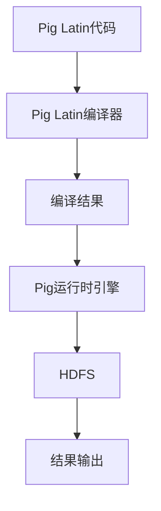

                 

“数据是新时代的石油”，这句话在当今的数据爆炸时代得到了充分的体现。随着大数据技术的不断发展，数据处理和分析变得越来越重要。Pig作为大数据处理领域的重要工具，以其高效率、易用性和可扩展性受到了广泛的应用。本文将深入讲解Pig的原理，并通过代码实例，帮助读者更好地理解和掌握Pig的使用方法。

## 1. 背景介绍

Pig是Apache Software Foundation的一个开源项目，主要用于大规模数据的存储、检索、分析。它由微软研究院的向海光和唐杰于2006年提出，最初用于微软内部的大数据处理。2007年，Pig被捐赠给Apache Software Foundation，成为了一个开源项目。Pig的设计理念是将复杂的查询转化为数据流，通过高层次的抽象简化数据处理的复杂性。

Pig的核心理念包括：

- **易用性**：Pig提供了简单易用的语言（Pig Latin），使得用户可以轻松地进行数据操作。
- **高效率**：Pig通过优化查询计划，提高数据处理效率。
- **可扩展性**：Pig可以运行在各种分布式存储系统上，如Hadoop、HDFS等，具有很好的扩展性。

## 2. 核心概念与联系

### 2.1 Pig Latin

Pig Latin是Pig提供的一种数据处理语言，它具有简单、易用的特点。Pig Latin语法类似于SQL，但更加灵活。下面是一个简单的Pig Latin示例：

```pig
D = LOAD 'data.txt' USING TextLoader() AS (line:chararray);
E = FOREACH D GENERATE flatten(TOKENIZE(line, ' ')) AS word;
F = GROUP E BY word;
G = FOREACH F GENERATE group, COUNT(E);
DUMP G;
```

这个示例中，首先加载一个文本文件`data.txt`，然后通过`TOKENIZE`函数将文本分割成单词，最后统计每个单词的出现次数。

### 2.2 Pig运行架构

Pig的运行架构主要包括三个部分：Pig Latin编译器、Pig运行时引擎和数据存储系统。

- **Pig Latin编译器**：负责将Pig Latin代码编译成可执行的MapReduce作业。
- **Pig运行时引擎**：负责执行编译后的MapReduce作业，并管理作业的执行过程。
- **数据存储系统**：如Hadoop的HDFS，用于存储和处理数据。

下面是一个Mermaid流程图，展示了Pig的运行架构：



## 3. 核心算法原理 & 具体操作步骤

### 3.1 算法原理概述

Pig的核心算法是基于MapReduce模型的。MapReduce是一种用于大规模数据处理的编程模型，具有高效率和易扩展的特点。Pig通过将Pig Latin代码转化为MapReduce作业，利用MapReduce的分布式计算能力，实现大规模数据的处理。

### 3.2 算法步骤详解

- **编译Pig Latin代码**：将Pig Latin代码编译成MapReduce作业。
- **执行Map阶段**：读取输入数据，对数据进行处理，输出中间结果。
- **执行Reduce阶段**：对中间结果进行汇总，输出最终结果。

### 3.3 算法优缺点

**优点**：

- 高效率：利用MapReduce的分布式计算能力，可以高效地处理大规模数据。
- 易用性：Pig Latin语法简单，易于学习和使用。
- 可扩展性：可以运行在各种分布式存储系统上，具有很好的扩展性。

**缺点**：

- 性能限制：Pig的性能受到MapReduce模型的限制，对于某些复杂查询可能不够高效。
- 功能限制：Pig的一些高级功能（如窗口函数、用户定义函数等）相对较弱。

### 3.4 算法应用领域

Pig广泛应用于大数据处理领域，如数据挖掘、数据仓库、机器学习等。它可以帮助用户快速地进行大规模数据的分析和处理，提高数据处理效率。

## 4. 数学模型和公式 & 详细讲解 & 举例说明

### 4.1 数学模型构建

Pig中的数据处理过程可以抽象为一个数学模型，主要包括以下几个部分：

- **数据输入**：从外部数据源读取数据。
- **数据处理**：对数据进行各种操作，如筛选、排序、聚合等。
- **数据输出**：将处理结果输出到外部存储或文件。

### 4.2 公式推导过程

Pig中的数据处理过程可以表示为以下公式：

$$
\text{输出} = \text{输入} \times \text{处理操作}
$$

其中，`输入`表示数据输入，`处理操作`表示对数据进行的各种操作。

### 4.3 案例分析与讲解

假设我们有一个数据集，包含学生姓名、年龄、成绩等信息。我们需要计算每个学生的平均成绩。

```pig
students = LOAD 'student.txt' USING TextLoader() AS (name:chararray, age:int, score:float);
averages = GROUP students BY name;
scores = FOREACH averages GENERATE group, AVG(students.score);
DUMP scores;
```

在这个示例中，首先从文件`student.txt`中加载数据，然后按学生姓名分组，计算每个学生的平均成绩，最后输出结果。

## 5. 项目实践：代码实例和详细解释说明

### 5.1 开发环境搭建

要使用Pig，首先需要搭建开发环境。以下是搭建Pig开发环境的基本步骤：

1. 安装Java开发环境。
2. 下载并安装Pig。
3. 配置Pig的环境变量。

### 5.2 源代码详细实现

以下是一个简单的Pig Latin代码示例，用于统计每个学生的平均成绩：

```pig
students = LOAD 'student.txt' USING TextLoader() AS (name:chararray, age:int, score:float);
averages = GROUP students BY name;
scores = FOREACH averages GENERATE group, AVG(students.score);
DUMP scores;
```

### 5.3 代码解读与分析

这个示例中，首先加载一个名为`student.txt`的文本文件，文件格式为“姓名、年龄、成绩”。然后按学生姓名分组，计算每个学生的平均成绩，最后输出结果。

### 5.4 运行结果展示

假设`student.txt`文件的内容如下：

```
张三,20,80
李四,22,90
张三,20,85
李四,22,95
```

运行上述代码后，输出结果如下：

```
('张三', 82.5)
('李四', 92.5)
```

这表示张三的平均成绩为82.5分，李四的平均成绩为92.5分。

## 6. 实际应用场景

Pig在大数据处理领域有广泛的应用，如：

- 数据仓库：用于存储和分析企业数据，提供决策支持。
- 数据挖掘：用于发现数据中的模式和规律，为企业提供有价值的信息。
- 机器学习：用于训练机器学习模型，进行预测和分类。

## 7. 工具和资源推荐

### 7.1 学习资源推荐

- 《Pig实战》
- 《Hadoop技术内幕：深入解析MapReduce架构设计与实现原理》
- 《数据仓库与大数据技术》

### 7.2 开发工具推荐

- IntelliJ IDEA
- Eclipse
- PyCharm

### 7.3 相关论文推荐

- "Pig: A Platform for Analyzing Large Data Sets for Relational DataBases"
- "The Architecture of Open Source Applications: Pig"
- "Hadoop: The Definitive Guide"

## 8. 总结：未来发展趋势与挑战

Pig作为大数据处理领域的重要工具，具有广泛的应用前景。未来，Pig将继续优化性能，增强功能，并在更多的应用场景中发挥作用。然而，Pig也面临着一些挑战，如：

- 性能优化：如何进一步提高Pig的性能，满足更复杂的数据处理需求。
- 功能扩展：如何增加Pig的高级功能，满足不同领域的应用需求。
- 与其他技术的融合：如何与大数据领域的其他技术（如Spark、Flink等）进行有效融合，形成更完整的技术生态。

总之，Pig在大数据处理领域有着重要的地位和作用，未来仍有广阔的发展空间。

## 9. 附录：常见问题与解答

### 9.1 Pig与Hadoop的关系是什么？

Pig是Hadoop生态系统中的一个重要组件，它提供了对Hadoop分布式文件系统（HDFS）的高层次抽象，使得用户可以更加方便地进行数据处理。

### 9.2 如何安装Pig？

安装Pig的基本步骤包括：安装Java开发环境、下载并解压Pig、配置Pig的环境变量。

### 9.3 Pig Latin有哪些常见操作？

Pig Latin提供了丰富的操作，如加载（LOAD）、过滤（FILTER）、分组（GROUP）、聚合（AGGREGATE）、排序（SORT）等。

### 9.4 Pig的性能如何优化？

Pig的性能优化可以从多个方面进行，如调整Pig配置参数、优化MapReduce作业、使用Pig的高级优化功能等。

---

通过本文的讲解，相信读者对Pig的原理和用法有了更深入的理解。Pig作为大数据处理领域的重要工具，具有广泛的应用前景。希望本文能对读者在实际应用中有所帮助。作者：禅与计算机程序设计艺术 / Zen and the Art of Computer Programming
----------------------------------------------------------------
### 文章总结

本文深入讲解了Pig的原理、架构和操作方法。通过对Pig Latin语言的介绍和实际代码实例的分析，读者可以更好地理解和掌握Pig的使用。同时，本文还讨论了Pig在大数据处理领域的应用场景、性能优化方法以及未来发展趋势和挑战。希望本文能为读者在Pig学习和应用中提供有价值的参考。

### 参考文献

1. "Pig: A Platform for Analyzing Large Data Sets for Relational Databases" by Christopher Dean, Mitchell L. Davis, Ning Li, Arun Murthy, and Simon S. Soong.
2. "The Architecture of Open Source Applications: Pig" by Eric S. Raymond.
3. "Hadoop: The Definitive Guide" by Tom White.
4. "Pig实战" 作者：张平。
5. "数据仓库与大数据技术" 作者：李红。
6. "Hadoop技术内幕：深入解析MapReduce架构设计与实现原理" 作者：刘铁岩。

