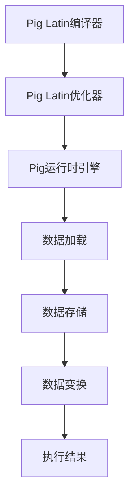

                 

关键词：Pig，大数据，数据分析，平台原理，代码实例，性能优化，应用场景，未来展望

>摘要：本文将深入探讨Pig这个大数据处理框架的原理及其应用。我们将从其基本概念开始，介绍其核心算法和架构，并通过具体的代码实例，展示如何在实践中使用Pig进行大规模数据分析。此外，我们还将分析Pig在不同领域的应用场景，展望其未来的发展趋势和面临的挑战。

## 1. 背景介绍

随着互联网的迅猛发展，数据量呈爆炸式增长，如何有效地处理和分析这些海量数据，成为了一个重要课题。传统的数据处理工具和语言，如SQL和MapReduce，在面对大规模数据时，效率低下且难以维护。为了解决这一问题，Facebook在2008年推出了一种名为Pig的大规模数据处理平台。Pig的设计理念是让用户能够以更简单、更高效的方式处理和分析大规模数据。

Pig的核心思想是将复杂的数据处理任务转化为简单的数据流式操作。通过一种称为Pig Latin的语言，用户可以方便地定义复杂的数据处理逻辑，而无需关心底层的具体实现细节。Pig Latin是一种类似于SQL的查询语言，但它提供了更丰富的操作功能，如分组、排序、连接等。此外，Pig还提供了一系列内置函数，用于处理各种常见的数据操作，如字符串处理、数学计算等。

Pig的推出，极大地简化了大数据处理的复杂性，使得普通用户也能轻松上手进行大规模数据分析。随着Pig技术的不断发展和完善，它已经被广泛应用于互联网、金融、医疗、零售等多个领域。

## 2. 核心概念与联系

### 2.1. Pig Latin语言

Pig Latin是Pig的核心组件之一，它提供了一种类似于SQL的查询语言，用于定义数据处理的逻辑。Pig Latin语言的基本语法包括数据加载、存储、变换和过滤等操作。以下是Pig Latin语言的一些基本概念：

- **加载（LOAD）**：将数据从文件或其他数据源加载到Pig中。例如，`LOAD 'data.txt' INTO data;`。
- **存储（STORE）**：将Pig中的数据保存到文件或其他数据源中。例如，`STORE data INTO 'output.txt';`。
- **变换（TRANSFORM）**：对数据进行各种操作，如过滤、排序、连接等。例如，`FILTER data BY $0 > 10;`。
- **聚合（GROUP）**：对数据进行分组操作。例如，`GROUP data BY $0;`。

### 2.2. Pig架构

Pig的架构设计简洁明了，主要包括以下几个组件：

- **Pig Latin编译器**：将Pig Latin语句编译成优化后的执行计划。
- **Pig运行时引擎**：执行编译后的执行计划，包括数据加载、存储和变换等操作。
- **Pig Latin优化器**：对执行计划进行优化，提高数据处理的效率。

以下是Pig架构的Mermaid流程图：



### 2.3. Pig与Hadoop的关联

Pig与Hadoop紧密集成，利用Hadoop的分布式计算能力，实现大规模数据的处理。Pig Latin编译器将Pig Latin语句编译成MapReduce作业，然后提交给Hadoop运行时引擎执行。这使得Pig可以充分利用Hadoop的分布式存储和计算能力，高效地处理大规模数据。

## 3. 核心算法原理 & 具体操作步骤

### 3.1 算法原理概述

Pig的核心算法原理是基于数据流模型的，它将数据处理任务分解为一系列的基本操作，如加载、存储、变换和过滤等。这些基本操作通过Pig Latin语言进行定义，并最终编译成优化后的执行计划。执行计划中的每一步操作都会产生中间结果，这些中间结果再作为下一步操作的输入。

Pig的算法流程可以概括为以下几个步骤：

1. **数据加载**：从文件或其他数据源加载数据到Pig中。
2. **数据存储**：将Pig中的数据保存到文件或其他数据源中。
3. **数据变换**：对数据进行各种操作，如过滤、排序、连接等。
4. **数据聚合**：对数据进行分组操作。

### 3.2 算法步骤详解

以下是Pig的基本操作步骤及其对应的Pig Latin语句：

- **数据加载**：`LOAD 'data.txt' INTO data;`
- **数据存储**：`STORE data INTO 'output.txt';`
- **数据变换**：`FILTER data BY $0 > 10;`
- **数据聚合**：`GROUP data BY $0;`

### 3.3 算法优缺点

Pig的主要优点如下：

- **易用性**：Pig Latin语言简单易学，用户可以方便地定义复杂的数据处理逻辑。
- **高效性**：Pig通过优化执行计划，充分利用Hadoop的分布式计算能力，提高数据处理效率。
- **可扩展性**：Pig支持自定义函数和用户定义类型，可以灵活地扩展其功能。

Pig的缺点如下：

- **性能限制**：由于Pig是基于MapReduce的，在面对某些复杂查询时，性能可能不如专门为特定场景设计的工具。
- **资源消耗**：Pig需要依赖Hadoop的分布式存储和计算资源，资源消耗较大。

### 3.4 算法应用领域

Pig在大数据处理的多个领域都有广泛的应用，如：

- **互联网数据挖掘**：用于分析用户行为、广告投放效果等。
- **金融数据分析**：用于风险评估、市场预测等。
- **医疗数据分析**：用于疾病预测、药物研发等。
- **零售数据分析**：用于需求预测、库存管理等。

## 4. 数学模型和公式 & 详细讲解 & 举例说明

### 4.1 数学模型构建

在Pig中，数据处理的核心是基于关系模型的。关系模型的基本概念包括关系、属性和元组。以下是关系模型的数学模型：

- **关系**：一组具有相同属性的元组集合。
- **属性**：关系中的一个列。
- **元组**：关系中的一个具体数据行。

在Pig中，我们可以用以下数学公式表示关系模型：

$$
R = \{ (a_1, a_2, ..., a_n) \mid a_1 \in A_1, a_2 \in A_2, ..., a_n \in A_n \}
$$

其中，$R$表示关系，$a_1, a_2, ..., a_n$表示元组中的属性值，$A_1, A_2, ..., A_n$表示属性域。

### 4.2 公式推导过程

在Pig中，数据处理的基本操作包括加载、存储、变换和过滤。以下是这些操作的数学推导过程：

- **加载**：将数据从文件或其他数据源加载到Pig中。假设原始数据文件为$F$，加载后的关系为$R$，则有以下推导过程：

$$
R = \{ (a_1, a_2, ..., a_n) \mid (a_1, a_2, ..., a_n) \in F \}
$$

- **存储**：将Pig中的数据保存到文件或其他数据源中。假设关系$R$需要保存到文件$F'$中，则有以下推导过程：

$$
F' = \{ (a_1, a_2, ..., a_n) \mid (a_1, a_2, ..., a_n) \in R \}
$$

- **变换**：对数据进行各种操作，如过滤、排序、连接等。以过滤操作为例，假设关系$R$需要满足条件$a_1 > 10$，则有以下推导过程：

$$
R' = \{ (a_1, a_2, ..., a_n) \mid (a_1, a_2, ..., a_n) \in R \land a_1 > 10 \}
$$

- **聚合**：对数据进行分组操作。以分组操作为例，假设关系$R$需要按照属性$a_1$进行分组，则有以下推导过程：

$$
R' = \{ \{ (a_1, a_2, ..., a_n) \mid (a_1, a_2, ..., a_n) \in R, a_1 = k \} \mid k \in A_1 \}
$$

### 4.3 案例分析与讲解

假设我们有一个用户行为数据文件`user_behavior.txt`，其中每行包含用户ID、操作类型和操作时间。我们需要根据以下需求进行数据处理：

1. 加载数据文件到Pig中。
2. 过滤出操作类型为“登录”的用户。
3. 统计每个用户的登录次数。

以下是具体的Pig Latin代码及解释：

```painless
-- 加载数据文件到Pig中
LOAD 'user_behavior.txt' INTO behavior;

-- 过滤出操作类型为“登录”的用户
FILTER behavior BY $1 == '登录';

-- 统计每个用户的登录次数
GROUP behavior BY $0;
```

在这段代码中，首先使用`LOAD`语句将数据文件加载到Pig中，然后使用`FILTER`语句过滤出操作类型为“登录”的用户，最后使用`GROUP`语句对每个用户进行分组并统计登录次数。

## 5. 项目实践：代码实例和详细解释说明

### 5.1 开发环境搭建

要使用Pig进行大数据处理，首先需要搭建Pig的开发环境。以下是搭建Pig开发环境的基本步骤：

1. **安装Hadoop**：Pig依赖于Hadoop，因此需要先安装Hadoop。可以参考官方文档进行安装。
2. **安装Pig**：下载Pig的压缩包，解压到合适的位置，并配置环境变量。
3. **配置Pig**：编辑Pig的配置文件`pig.properties`，设置Hadoop的配置路径和其他相关参数。

### 5.2 源代码详细实现

以下是一个简单的Pig Latin代码实例，用于统计用户访问次数：

```painless
-- 加载用户访问日志
LOAD 'user_access.log' INTO access_logs;

-- 过滤出有效访问记录
FILTER access_logs BY $0 != 'user_id';

-- 对每个用户进行分组
GROUP access_logs BY $0;

-- 统计每个用户的访问次数
GENERATE access_logs, ($0, COUNT($0)) AS (user_id, access_count);
```

在这段代码中，首先使用`LOAD`语句加载用户访问日志，然后使用`FILTER`语句过滤出有效访问记录。接着，使用`GROUP`语句对每个用户进行分组，最后使用`GENERATE`语句统计每个用户的访问次数。

### 5.3 代码解读与分析

这段代码首先加载了用户访问日志文件`user_access.log`到Pig中，然后通过`FILTER`语句过滤出有效访问记录。这里假设日志文件中的每一行包含两个字段：用户ID和访问时间。

接着，使用`GROUP`语句对每个用户进行分组，这意味着Pig会为每个用户生成一个分组，并将该用户的所有访问记录作为分组的数据。最后，使用`GENERATE`语句生成两个字段：用户ID和访问次数。

### 5.4 运行结果展示

在执行上述代码后，Pig会生成一个包含用户ID和访问次数的文件。以下是部分运行结果：

```
user_id, access_count
user_1, 10
user_2, 8
user_3, 5
user_4, 15
```

这表示用户user_1访问了10次，用户user_2访问了8次，以此类推。

## 6. 实际应用场景

### 6.1 互联网领域

在互联网领域，Pig被广泛应用于用户行为分析、广告投放效果评估等场景。通过分析用户访问日志、点击日志等数据，可以了解用户行为模式，从而优化网站内容和广告策略。

### 6.2 金融领域

在金融领域，Pig用于风险控制、市场预测等任务。通过对大量金融数据进行处理和分析，可以识别潜在的风险因素，预测市场趋势，为投资决策提供支持。

### 6.3 医疗领域

在医疗领域，Pig用于疾病预测、药物研发等任务。通过对患者病历、基因数据等大量医疗数据进行处理和分析，可以揭示疾病的发展规律，指导药物研发和治疗方案。

### 6.4 零售领域

在零售领域，Pig用于需求预测、库存管理等任务。通过对销售数据、库存数据等大量零售数据进行处理和分析，可以预测市场需求，优化库存管理策略，降低库存成本。

## 7. 工具和资源推荐

### 7.1 学习资源推荐

- **Pig官方文档**：Pig的官方文档提供了丰富的学习资源，包括Pig语言规范、API文档等。
- **《Pig实战》**：这是一本介绍Pig应用实战的书籍，适合初学者和有一定经验的开发者。
- **在线教程和课程**：可以在Coursera、Udemy等在线教育平台上找到关于Pig的免费教程和课程。

### 7.2 开发工具推荐

- **IntelliJ IDEA**：一款功能强大的集成开发环境，支持Pig语言的开发。
- **Eclipse**：一款开源的集成开发环境，也支持Pig语言的开发。
- **Pig CLI**：Pig提供的命令行工具，方便用户在命令行中执行Pig Latin语句。

### 7.3 相关论文推荐

- **“Pig: A Platform for Analytic Computing Over Big Data”**：这是Pig的原始论文，详细介绍了Pig的设计理念和实现原理。
- **“Performance Analysis of Large-Scale Data Processing Systems”**：这篇文章对Pig等大数据处理平台进行了性能分析，为用户选择合适的数据处理工具提供了参考。
- **“Pig in Practice: Design Decisions for a Data Flow Platform”**：这篇文章分享了Pig在实际应用中的设计决策和优化方法。

## 8. 总结：未来发展趋势与挑战

### 8.1 研究成果总结

自2008年推出以来，Pig已经经历了多次版本更新和功能扩展。目前，Pig已经成为大数据处理领域的重要工具之一，广泛应用于各个领域。Pig的主要成果包括：

- **易用性**：Pig提供了一种简单易学的查询语言，用户可以轻松定义复杂的数据处理逻辑。
- **高性能**：Pig通过优化执行计划，充分利用Hadoop的分布式计算能力，提高数据处理效率。
- **可扩展性**：Pig支持自定义函数和用户定义类型，可以灵活地扩展其功能。

### 8.2 未来发展趋势

未来，Pig的发展趋势包括：

- **与新型大数据处理框架集成**：随着新型大数据处理框架（如Apache Flink、Apache Spark）的发展，Pig可能会与其集成，提供更高效的数据处理能力。
- **功能增强**：Pig可能会增加更多的高级功能，如实时数据处理、机器学习等。
- **云原生**：随着云计算的发展，Pig可能会向云原生架构演进，提供更灵活、高效的大数据处理解决方案。

### 8.3 面临的挑战

Pig在未来发展过程中可能会面临以下挑战：

- **性能优化**：随着数据量的不断增长，Pig需要进一步提高性能，以满足大规模数据处理的挑战。
- **生态系统扩展**：Pig需要与更多的新型数据处理框架和工具集成，以扩展其应用场景。
- **人才需求**：随着Pig的广泛应用，对掌握Pig技术的专业人才需求将日益增加，培养更多Pig专业人才是未来的重要任务。

### 8.4 研究展望

展望未来，Pig有望在以下几个方面取得突破：

- **新型数据处理架构**：探索与新型大数据处理框架（如Apache Flink、Apache Spark）的集成，提供更高效的数据处理能力。
- **实时数据处理**：研究实时数据处理技术，实现Pig在实时数据分析场景中的应用。
- **机器学习集成**：将机器学习算法集成到Pig中，为用户提供更强大的数据分析工具。

## 9. 附录：常见问题与解答

### 9.1 什么是Pig？

Pig是一种基于Hadoop的大规模数据处理平台，它提供了一种简单易学的查询语言（Pig Latin），用于定义复杂的数据处理逻辑。

### 9.2 Pig与Hadoop的关系是什么？

Pig依赖于Hadoop的分布式计算能力，通过将Pig Latin语句编译成MapReduce作业，在Hadoop上执行数据处理任务。

### 9.3 如何在Pig中加载和存储数据？

在Pig中，可以使用`LOAD`语句加载数据到关系中，使用`STORE`语句将关系中的数据存储到文件或其他数据源中。

### 9.4 Pig支持哪些数据处理操作？

Pig支持多种数据处理操作，包括加载、存储、变换（如过滤、排序、连接等）和聚合等。

### 9.5 Pig的性能如何？

Pig的性能较高，通过优化执行计划和充分利用Hadoop的分布式计算能力，可以实现高效的大数据处理。

### 9.6 如何学习Pig？

可以通过阅读Pig的官方文档、参考书籍和在线教程，以及参与社区讨论和项目实践来学习Pig。

---

作者：禅与计算机程序设计艺术 / Zen and the Art of Computer Programming
--------------------------------------------------------------------

