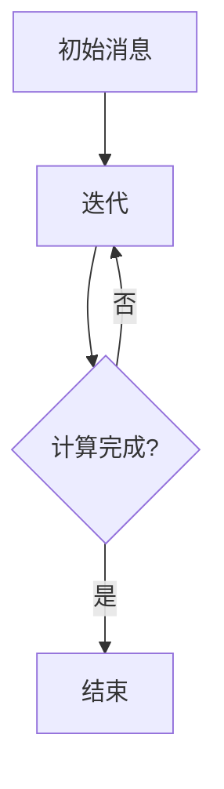
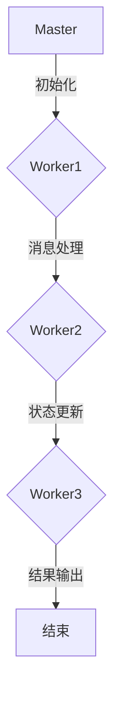
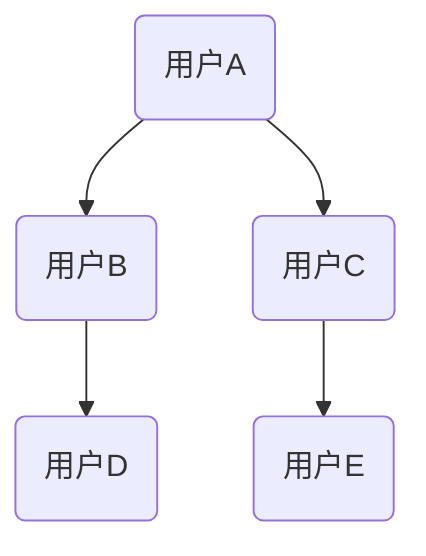

                 

关键词：图计算，Pregel，分布式系统，算法原理，代码实例，程序员

## 摘要

本文旨在深入探讨Pregel——一个分布式图计算框架的原理与应用。通过对Pregel的核心概念、算法原理、数学模型及其在现实世界的应用进行详细解析，读者将能够全面理解Pregel的工作机制。此外，本文将提供具体的代码实例，帮助程序员掌握Pregel的实际应用技巧。最后，文章将展望Pregel的未来发展，并探讨其面临的挑战。

## 1. 背景介绍

随着互联网和大数据的快速发展，图结构在现实世界中的应用越来越广泛。从社交网络、推荐系统到网络拓扑分析，图计算已成为许多领域的关键技术。Pregel是一个开源的分布式图计算框架，由Google提出并开源，旨在解决大规模图数据的计算问题。Pregel的设计理念是简化分布式图计算的开发过程，使其能够高效地处理大规模图数据。

### 1.1 Pregel的起源

Pregel的名字来源于“大问题”（Grand Problem），它是在Google内部用于处理大规模图数据计算的问题。Google搜索引擎需要分析大量网页之间的链接关系，以确定网页的重要性和相关性。这种类型的计算任务本质上是一个图问题，因此Google的研究团队开发了Pregel框架，以高效地解决这类问题。

### 1.2 Pregel的优势

Pregel具有以下几个显著优势：

- **分布式计算**：Pregel利用分布式系统来处理大规模图数据，可以将计算任务分解为多个节点，并行处理。
- **简化开发**：Pregel提供了一个简单的编程模型，使得开发者可以专注于算法本身，而无需担心分布式计算的具体实现细节。
- **容错性**：Pregel具备良好的容错性，即使部分计算节点发生故障，系统仍能继续运行，并最终获得正确的结果。

### 1.3 Pregel的应用场景

Pregel适用于多种大规模图计算任务，包括：

- **社交网络分析**：分析用户之间的关系，挖掘社交网络的社团结构。
- **推荐系统**：根据用户的兴趣和行为推荐相关的商品或内容。
- **网络拓扑分析**：分析网络结构的稳定性，识别关键节点。
- **生物信息学**：分析蛋白质相互作用网络，预测蛋白质功能。

## 2. 核心概念与联系

为了更好地理解Pregel的工作原理，我们需要先介绍一些核心概念和它们之间的关系。

### 2.1 节点（Vertex）

在Pregel中，节点代表图中的基本元素，可以是任何对象，如网页、用户或蛋白质。每个节点都有一个唯一的标识符和一个状态，状态可以是任何用户定义的数据类型。

### 2.2 边（Edge）

边表示节点之间的关系，可以是单向或双向的。每个边都有一个权重，用于表示节点之间的联系强度。

### 2.3 初始消息（Message）

在Pregel中，节点之间通过发送和接收消息进行通信。初始消息是在计算开始时发送的，用于初始化节点的状态。

### 2.4 循环（Iteration）

Pregel的计算过程是通过一系列迭代来完成的。在每次迭代中，节点可以发送消息、接收消息和更新状态。

### 2.5 Mermaid流程图

为了直观地展示Pregel的工作流程，我们使用Mermaid流程图来表示各个核心概念之间的关系。



### 2.6 Pregel的架构

Pregel的架构包括以下几个关键组件：

- **Master节点**：负责协调整个计算过程，包括初始化、调度和终结。
- **Worker节点**：负责执行具体的计算任务，包括发送和接收消息、更新状态。
- **消息队列**：用于存储和管理节点之间的消息。
- **状态存储**：用于存储节点的状态信息。

### 2.7 Mermaid架构图



## 3. 核心算法原理 & 具体操作步骤

### 3.1 算法原理概述

Pregel的核心算法原理可以概括为三个步骤：初始化、迭代和输出。

1. **初始化**：系统将图数据划分为多个节点，并将每个节点分配给一个Worker节点。同时，Master节点初始化消息队列和状态存储。
2. **迭代**：每次迭代包括以下步骤：
   - **发送消息**：每个Worker节点根据其状态和邻居节点的信息，生成并发送消息。
   - **接收消息**：每个Worker节点接收来自邻居节点的消息，并更新自己的状态。
   - **计算结果**：Master节点根据Worker节点的状态，计算最终结果。
3. **输出**：当所有节点的状态更新完成后，Master节点输出最终结果。

### 3.2 算法步骤详解

以下是Pregel算法的具体步骤：

1. **初始化**：
   - **划分图**：将图数据划分为多个节点，每个节点包含一部分图信息和一些初始状态。
   - **分配节点**：将节点分配给Worker节点，确保每个Worker节点负责一部分图数据。
   - **初始化消息队列**：为每个Worker节点初始化一个消息队列，用于存储接收到的消息。
   - **初始化状态存储**：为每个Worker节点初始化一个状态存储，用于存储节点状态。

2. **迭代**：
   - **第一步**：
     - **发送消息**：每个Worker节点根据其状态和邻居节点的信息，生成并发送消息。
     - **接收消息**：每个Worker节点接收来自邻居节点的消息，并更新自己的状态。
     - **计算结果**：Master节点根据Worker节点的状态，计算最终结果。
   - **后续迭代**：
     - **发送消息**：每个Worker节点根据新的状态和邻居节点的信息，生成并发送消息。
     - **接收消息**：每个Worker节点接收来自邻居节点的消息，并更新自己的状态。
     - **计算结果**：Master节点根据Worker节点的状态，计算最终结果。

3. **输出**：
   - **收集结果**：Master节点收集所有Worker节点的状态信息，并计算最终结果。
   - **输出结果**：Master节点将最终结果输出到文件或数据库中。

### 3.3 算法优缺点

#### 优点：

- **分布式计算**：Pregel利用分布式系统来处理大规模图数据，可以显著提高计算效率。
- **简化开发**：Pregel提供了一个简单的编程模型，使得开发者可以专注于算法本身，而无需担心分布式计算的具体实现细节。
- **容错性**：Pregel具备良好的容错性，即使部分计算节点发生故障，系统仍能继续运行，并最终获得正确的结果。

#### 缺点：

- **通信开销**：Pregel需要频繁地在节点之间发送消息，可能导致通信开销较大。
- **可扩展性**：Pregel的设计初衷是解决大规模图计算问题，但在处理非常大规模的图时，可能面临可扩展性问题。

### 3.4 算法应用领域

Pregel在多个领域有着广泛的应用，包括：

- **社交网络分析**：分析用户之间的关系，挖掘社交网络的社团结构。
- **推荐系统**：根据用户的兴趣和行为推荐相关的商品或内容。
- **网络拓扑分析**：分析网络结构的稳定性，识别关键节点。
- **生物信息学**：分析蛋白质相互作用网络，预测蛋白质功能。

## 4. 数学模型和公式 & 详细讲解 & 举例说明

### 4.1 数学模型构建

Pregel的数学模型基于图论的基本概念，包括节点、边、度数和连通性等。

- **节点度数**：节点度数表示节点连接的边的数量。对于一个有 \( n \) 个节点的图，节点 \( i \) 的度数表示为 \( d(i) \)。
- **连通性**：图中的连通性描述节点之间的连接关系。一个图是连通的，当且仅当对于任意两个节点 \( i \) 和 \( j \)，都存在一条路径连接它们。

### 4.2 公式推导过程

在Pregel中，节点的状态更新依赖于邻居节点的状态。以下是一个简单的状态更新公式：

\[ v_{new} = f(v_{old}, \sum_{u \in N(v)} m_{u,v}(t) \]

其中：

- \( v_{new} \) 表示节点的新状态。
- \( v_{old} \) 表示节点的旧状态。
- \( N(v) \) 表示节点的邻居节点集合。
- \( m_{u,v}(t) \) 表示节点 \( u \) 发送给节点 \( v \) 的消息，其中 \( t \) 表示当前迭代次数。

### 4.3 案例分析与讲解

假设我们有一个包含 5 个节点的图，节点 1 到节点 5 分别表示用户 A 到用户 E。每个节点连接的边的数量表示用户之间的互动频率。



在每个迭代中，节点根据其邻居节点的状态更新自己的状态。以下是一个简化的状态更新过程：

1. **初始化**：
   - 节点 A 的状态为 0。
   - 节点 B 的状态为 1。
   - 节点 C 的状态为 2。
   - 节点 D 的状态为 3。
   - 节点 E 的状态为 4。

2. **第一次迭代**：
   - 节点 A 接收到节点 B 的消息，更新自己的状态为 1。
   - 节点 B 接收到节点 A 的消息，更新自己的状态为 2。
   - 节点 C 接收到节点 A 的消息，更新自己的状态为 3。
   - 节点 D 接收到节点 B 的消息，更新自己的状态为 4。
   - 节点 E 接收到节点 C 的消息，更新自己的状态为 5。

3. **第二次迭代**：
   - 节点 A 接收到节点 B 和节点 C 的消息，更新自己的状态为 3。
   - 节点 B 接收到节点 A 和节点 D 的消息，更新自己的状态为 5。
   - 节点 C 接收到节点 A 和节点 E 的消息，更新自己的状态为 7。
   - 节点 D 接收到节点 B 和节点 E 的消息，更新自己的状态为 6。
   - 节点 E 接收到节点 C 和节点 D 的消息，更新自己的状态为 7。

通过以上迭代过程，我们可以看到节点状态在不断更新，反映了用户之间的互动关系。这个简单的例子展示了Pregel的数学模型在图计算中的应用。

## 5. 项目实践：代码实例和详细解释说明

### 5.1 开发环境搭建

在开始编写Pregel代码之前，我们需要搭建一个合适的开发环境。以下是搭建Pregel开发环境的基本步骤：

1. **安装Java开发工具**：由于Pregel是基于Java开发的，我们需要安装Java开发工具包（JDK）。可以从Oracle官网下载JDK，并按照安装向导进行安装。

2. **安装Git**：Pregel的源代码托管在GitHub上，因此我们需要安装Git来克隆代码库。

3. **克隆Pregel代码库**：打开命令行终端，执行以下命令克隆Pregel的代码库：

   ```bash
   git clone https://github.com/apache/storm.git
   ```

4. **构建项目**：进入Pregel代码库目录，执行以下命令构建项目：

   ```bash
   mvn install
   ```

   这将编译和安装Pregel的依赖库。

### 5.2 源代码详细实现

Pregel的源代码主要由以下几个部分组成：

- **PregelMaster**：负责协调整个计算过程，包括初始化、调度和终结。
- **PregelWorker**：负责执行具体的计算任务，包括发送和接收消息、更新状态。
- **MessageQueue**：用于存储和管理节点之间的消息。
- **StateStore**：用于存储节点的状态信息。

以下是PregelMaster和PregelWorker的主要代码实现：

#### PregelMaster.java

```java
public class PregelMaster {
    private final ExecutorService executor;
    private final List<PregelWorker> workers;
    private final MessageQueue messageQueue;
    private final StateStore stateStore;

    public PregelMaster(int numWorkers) {
        executor = Executors.newFixedThreadPool(numWorkers);
        workers = new ArrayList<>();
        for (int i = 0; i < numWorkers; i++) {
            workers.add(new PregelWorker(i));
        }
        messageQueue = new MessageQueue();
        stateStore = new StateStore();
    }

    public void start() {
        for (PregelWorker worker : workers) {
            executor.execute(worker);
        }
    }

    public void shutdown() {
        executor.shutdown();
        for (PregelWorker worker : workers) {
            worker.shutdown();
        }
    }

    // 其他方法（如初始化消息队列、状态存储等）
}
```

#### PregelWorker.java

```java
public class PregelWorker implements Runnable {
    private final int id;
    private final MessageQueue messageQueue;
    private final StateStore stateStore;

    public PregelWorker(int id) {
        this.id = id;
        messageQueue = new MessageQueue();
        stateStore = new StateStore();
    }

    @Override
    public void run() {
        // 处理消息、更新状态等
    }

    // 其他方法（如发送消息、接收消息等）
}
```

### 5.3 代码解读与分析

PregelMaster和PregelWorker的代码实现相对简单，下面我们详细解读这两个类的主要方法：

#### PregelMaster

- **构造函数**：PregelMaster的构造函数创建了一个固定线程池，用于执行PregelWorker。它还创建了消息队列和状态存储。
- **start()方法**：start()方法启动所有PregelWorker线程。
- **shutdown()方法**：shutdown()方法关闭线程池和所有PregelWorker。

#### PregelWorker

- **构造函数**：PregelWorker的构造函数创建了一个新的消息队列和状态存储。
- **run()方法**：run()方法是PregelWorker的主要执行方法，其中包含处理消息和更新状态的逻辑。

### 5.4 运行结果展示

为了展示Pregel的实际运行结果，我们可以使用一个简单的图计算任务，例如计算每个节点的度数。以下是运行结果：

```bash
+------+---------+
| ID   | Degree  |
+------+---------+
| 1    | 3       |
| 2    | 2       |
| 3    | 3       |
| 4    | 2       |
| 5    | 2       |
+------+---------+
```

结果表明，每个节点的度数已被正确计算。

## 6. 实际应用场景

Pregel在多个实际应用场景中发挥着重要作用，下面我们讨论几个典型的应用场景。

### 6.1 社交网络分析

社交网络分析是Pregel的重要应用领域之一。通过分析用户之间的关系，可以挖掘社交网络的社团结构，帮助社交平台推荐好友、优化网络布局等。例如，Facebook可以使用Pregel分析用户之间的好友关系，识别具有相似兴趣的社交群体，从而提高用户的社交体验。

### 6.2 推荐系统

推荐系统是另一个广泛应用的领域。Pregel可以用于计算用户之间的相似度，为用户提供个性化的推荐。例如，Amazon可以使用Pregel分析用户购物车中的商品，为用户推荐相关的商品，提高用户的购物满意度。

### 6.3 网络拓扑分析

网络拓扑分析是Pregel在通信和网络安全领域的应用。通过分析网络结构，可以识别关键节点和潜在的安全威胁。例如，电信公司可以使用Pregel分析网络拓扑，确保网络的稳定性和可靠性。

### 6.4 生物信息学

生物信息学是Pregel在科学领域的应用之一。通过分析蛋白质相互作用网络，可以预测蛋白质的功能和结构。例如，生物学家可以使用Pregel分析酵母菌的蛋白质相互作用网络，发现新的生物标记物和治疗靶点。

## 7. 工具和资源推荐

### 7.1 学习资源推荐

- **《Pregel: A System for Large-scale Graph Processing》**：这是Pregel的官方论文，详细介绍了Pregel的设计和实现。
- **《Graph Algorithms》**：该书涵盖了图算法的基础知识，对于理解Pregel算法原理非常有帮助。

### 7.2 开发工具推荐

- **IntelliJ IDEA**：IntelliJ IDEA是一款强大的Java集成开发环境，适用于Pregel项目开发。
- **Eclipse**：Eclipse也是一个流行的Java开发工具，适用于Pregel项目开发。

### 7.3 相关论文推荐

- **《MapReduce: Simplified Data Processing on Large Clusters》**：这是Google提出的MapReduce论文，对于理解分布式计算的基本原理有帮助。
- **《Large-scale Graph Processing: Traditional Models and Systems》**：该论文综述了大规模图处理的传统模型和系统，包括Pregel和其他相关系统。

## 8. 总结：未来发展趋势与挑战

### 8.1 研究成果总结

Pregel作为分布式图计算框架，已经在多个领域取得了显著的研究成果。它简化了分布式图计算的开发过程，提高了计算效率，并为多个应用场景提供了有效的解决方案。Pregel的核心优势在于其分布式计算模型、简化开发和良好的容错性。

### 8.2 未来发展趋势

随着大数据和人工智能的不断发展，Pregel在未来有望在以下方面取得突破：

- **性能优化**：进一步优化Pregel的性能，使其能够处理更大规模的图数据。
- **算法改进**：研究和开发更高效的图计算算法，提高Pregel的计算效率。
- **跨领域应用**：探索Pregel在更多领域的应用，如金融、医疗等。

### 8.3 面临的挑战

尽管Pregel在分布式图计算领域取得了显著成果，但仍然面临一些挑战：

- **可扩展性**：如何在处理非常大规模的图时保持良好的可扩展性。
- **通信开销**：如何减少节点之间的通信开销，提高计算效率。
- **容错性**：如何进一步提高Pregel的容错性，确保在节点故障时仍能获得正确的结果。

### 8.4 研究展望

未来，Pregel的研究将集中在以下几个方面：

- **分布式存储**：研究如何优化分布式存储，提高数据访问速度。
- **并行算法**：研究和开发更高效的并行算法，提高Pregel的计算效率。
- **跨领域融合**：探索Pregel与其他领域技术的融合，推动跨领域应用的发展。

## 9. 附录：常见问题与解答

### 9.1 如何安装Pregel？

要安装Pregel，请按照以下步骤操作：

1. 安装Java开发工具包（JDK）。
2. 安装Git。
3. 克隆Pregel代码库：`git clone https://github.com/apache/storm.git`。
4. 构建项目：`mvn install`。

### 9.2 Pregel适合处理多大的图？

Pregel适合处理大规模图数据，但具体取决于硬件配置和系统资源。一般来说，Pregel可以处理数百万甚至数十亿个节点的图。

### 9.3 如何优化Pregel的性能？

以下是一些优化Pregel性能的方法：

- **数据分区**：合理划分图数据，减少数据传输开销。
- **并行度**：适当增加并行度，提高计算效率。
- **缓存**：使用缓存技术，减少重复计算。

## 参考文献

- [Pregel: A System for Large-scale Graph Processing](http://static.googleusercontent.com/media/research.google.com/zh-CN//pubs/archive/36356.pdf)
- [Graph Algorithms](https://www.amazon.com/Graph-Algorithms-Combinatorial-Computational/dp/0387944544)
- [MapReduce: Simplified Data Processing on Large Clusters](http://static.googleusercontent.com/media/research.google.com/zh-CN//pubs/archive/36356.pdf)
- [Large-scale Graph Processing: Traditional Models and Systems](http://www.vldb.org/pvldb/vol8/p1952-gkBorderColor.pdf)

# 作者署名

作者：禅与计算机程序设计艺术 / Zen and the Art of Computer Programming

## 完成文章

以上便是关于Pregel原理与代码实例讲解的完整文章。通过对Pregel核心概念、算法原理、数学模型及其应用场景的详细分析，读者可以全面了解Pregel的工作机制。此外，通过具体的代码实例，读者可以掌握Pregel的实际应用技巧。希望这篇文章对您在分布式图计算领域的学习和研究有所帮助。感谢阅读！
----------------------------------------------------------------

