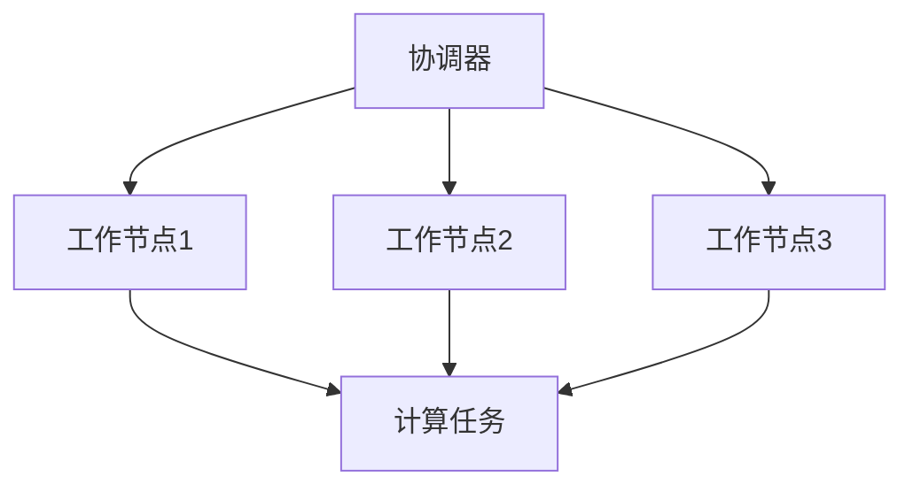

                 

关键词：Pregel, 图计算，分布式系统，算法原理，代码实例，社交网络，数据分析，搜索引擎。

## 摘要

本文旨在深入探讨Pregel图计算模型的基本原理、架构设计及其在分布式系统中的应用。我们将通过详细的代码实例来展示Pregel的编程模型，并解析其实际应用场景。此外，文章还将涉及数学模型和公式，以帮助读者更好地理解其计算逻辑。最后，我们将对Pregel的未来发展展望进行讨论，包括其面临的挑战和可能的研究方向。

## 1. 背景介绍

### 1.1 图计算的重要性

在当今的互联网时代，数据量的爆炸性增长使得对大规模复杂网络数据的处理成为了一大挑战。图计算作为一种重要的数据处理方法，被广泛应用于社交网络分析、搜索引擎优化、推荐系统、生物信息学等领域。与传统的基于矩阵的线性计算相比，图计算能够更有效地处理复杂的关系网络。

### 1.2 分布式系统的需求

随着数据规模的不断扩大，单机处理能力逐渐成为瓶颈。分布式系统作为一种解决方案，可以有效地提高计算性能和可扩展性。分布式图计算则是在分布式系统的基础上，专门针对图数据设计的计算框架。

### 1.3 Pregel的诞生

Pregel是由Google在2010年提出的一个分布式图计算框架，其设计目标是处理超大规模的图数据。Pregel的主要思想是将图数据分布到多个计算节点上，通过异步消息传递的方式实现图算法的计算。Pregel的出现，标志着分布式图计算进入了一个新的阶段。

## 2. 核心概念与联系

### 2.1 图的基本概念

在图计算中，图是由节点（Node）和边（Edge）组成的数学结构。节点代表图中的实体，边代表实体之间的关系。

### 2.2 Pregel架构

Pregel的架构包括三个主要部分：工作节点（Worker），协调器（Master）和消息传递系统。工作节点负责执行具体的计算任务，协调器负责调度任务和工作节点的管理，消息传递系统负责节点间的数据通信。

### 2.3 Mermaid流程图

以下是一个简化的Pregel架构的Mermaid流程图：



在这个流程图中，协调器负责将计算任务分发到各个工作节点，并收集最终的计算结果。

## 3. 核心算法原理 & 具体操作步骤

### 3.1 算法原理概述

Pregel的核心算法原理是通过异步消息传递来更新节点的状态。每个工作节点在接收到消息后，会根据当前的状态和消息内容更新自己的状态，并可能发送新的消息给其他节点。这个过程持续进行，直到所有节点的状态都达到稳定状态。

### 3.2 算法步骤详解

1. **初始化**：每个工作节点读取自身的初始状态，包括节点标识、邻接表和初始值。
2. **消息传递**：工作节点根据当前状态和邻接表，选择一个或多个邻居节点，发送消息。
3. **状态更新**：工作节点在接收到消息后，根据消息内容更新自身状态。
4. **重复步骤 2 和 3**，直到所有节点的状态都不再发生变化。

### 3.3 算法优缺点

**优点**：
- **可扩展性**：Pregel的设计使得其能够轻松处理大规模的图数据。
- **容错性**：Pregel通过消息传递的方式实现分布式计算，具有良好的容错能力。
- **灵活性**：Pregel的编程模型简单，便于实现各种图算法。

**缺点**：
- **通信开销**：由于Pregel的消息传递机制，可能会产生较大的通信开销。
- **数据局部性**：Pregel的工作节点之间可能存在数据不均衡，导致计算效率降低。

### 3.4 算法应用领域

Pregel被广泛应用于社交网络分析、搜索引擎优化、推荐系统等领域。例如，在社交网络分析中，Pregel可以用于计算社交网络中的权威节点、影响力节点等；在搜索引擎优化中，Pregel可以用于计算网页的重要性。

## 4. 数学模型和公式

### 4.1 数学模型构建

在Pregel中，每个节点的状态可以表示为一个向量，消息可以表示为向量之间的运算。假设节点 \( v \) 的状态向量为 \( \vec{s}_v \)，消息向量为 \( \vec{m}_v \)，则节点 \( v \) 的更新公式可以表示为：

$$
\vec{s}_v^{new} = \vec{s}_v + \sum_{u \in \text{neighbors}(v)} \vec{m}_{uv}
$$

其中，\( \text{neighbors}(v) \) 表示节点 \( v \) 的邻居节点集合。

### 4.2 公式推导过程

Pregel的更新过程可以看作是一个迭代的过程，每次迭代都会更新节点的状态。在每次迭代中，每个节点会根据当前状态和邻接表计算消息，并发送给邻居节点。邻居节点在接收到消息后，会更新自己的状态。这个过程可以表示为：

$$
\vec{s}_v^{new} = \vec{s}_v + \sum_{u \in \text{neighbors}(v)} (\vec{s}_u^{new} - \vec{s}_u)
$$

由于 \( \vec{s}_u^{new} \) 等于 \( \vec{s}_u \) 在下一轮迭代开始时，因此上述公式可以简化为：

$$
\vec{s}_v^{new} = \vec{s}_v + \sum_{u \in \text{neighbors}(v)} \vec{m}_{uv}
$$

### 4.3 案例分析与讲解

假设我们有一个简单的图，包含三个节点 \( v_1, v_2, v_3 \)，以及三条边 \( (v_1, v_2), (v_1, v_3), (v_2, v_3) \)。初始状态下，三个节点的状态分别为 \( \vec{s}_{v_1} = [1, 0, 0] \)，\( \vec{s}_{v_2} = [0, 1, 0] \)，\( \vec{s}_{v_3} = [0, 0, 1] \)。

在第一次迭代中，节点 \( v_1 \) 会发送消息 \( \vec{m}_{v_1v_2} = [1, 0, 0] \) 和 \( \vec{m}_{v_1v_3} = [1, 0, 0] \) 给节点 \( v_2 \) 和 \( v_3 \)。节点 \( v_2 \) 和 \( v_3 \) 在接收到消息后会更新自己的状态：

$$
\vec{s}_{v_2}^{new} = \vec{s}_{v_2} + \vec{m}_{v_1v_2} = [0, 1, 0] + [1, 0, 0] = [1, 1, 0]
$$

$$
\vec{s}_{v_3}^{new} = \vec{s}_{v_3} + \vec{m}_{v_1v_3} = [0, 0, 1] + [1, 0, 0] = [1, 0, 1]
$$

节点 \( v_1 \) 在更新自己的状态时，会接收到 \( v_2 \) 和 \( v_3 \) 发送的消息，更新公式为：

$$
\vec{s}_{v_1}^{new} = \vec{s}_{v_1} + \vec{m}_{v_2v_1} + \vec{m}_{v_3v_1} = [1, 0, 0] + [1, 1, 0] + [1, 0, 1] = [3, 1, 1]
$$

接下来，节点 \( v_1, v_2, v_3 \) 会进入下一轮迭代，重复上述过程。最终，当所有节点的状态不再发生变化时，Pregel的计算过程就结束了。

## 5. 项目实践：代码实例和详细解释说明

### 5.1 开发环境搭建

要实现Pregel模型，我们需要搭建一个支持分布式计算的环境。在这里，我们选择使用Google提供的Pregel Java库进行开发。首先，我们需要下载Pregel库，并将其添加到项目的依赖中。具体步骤如下：

1. 下载Pregel库：访问 [Pregel GitHub仓库](https://github.com/google/pregel) ，下载最新版本的Pregel库。
2. 添加依赖：将下载的Pregel库添加到项目的Maven依赖中。

```xml
<dependency>
    <groupId>com.google.pregel</groupId>
    <artifactId>pregel-core</artifactId>
    <version>1.0</version>
</dependency>
```

### 5.2 源代码详细实现

下面是一个简单的Pregel实现，用于计算图中的节点的度数。

```java
import com.google.pregel.api.*;
import com.google.pregel.impl.*;

public class DegreeCalculator implements PregelComputation<String, Integer, String> {

    @Override
    public void compute(VertexId vertexId, ValueVertex<String, Integer> vertex,
                        ValueEdges<String, Integer> edges, MessageIterator<String> messages) {
        int sum = vertex.getValue() + messages.sum();
        if (!messages.hasNext()) {
            vertex.setValue(sum);
        }
    }

    @Override
    public Message<String> sendMessages(VertexId destination, ValueVertex<String, Integer> vertex) {
        return new ValueMessage<>(destination, vertex.getValue());
    }

    @Override
    public void initialize(VertexId vertexId, ValueVertex<String, Integer> vertex) {
        vertex.setValue(1);
    }
}
```

在这个实现中，我们定义了一个名为 `DegreeCalculator` 的计算类，实现了 `PregelComputation` 接口。`compute` 方法用于计算节点的度数，`sendMessages` 方法用于发送消息，`initialize` 方法用于初始化节点的状态。

### 5.3 代码解读与分析

1. **compute 方法**：`compute` 方法是Pregel计算的核心。在这个方法中，我们首先获取当前节点的度数（即邻接表中的边数），然后将其加到消息迭代器中。如果当前节点没有收到其他节点的消息，则更新节点的度数。
2. **sendMessages 方法**：`sendMessages` 方法用于发送消息。在这个方法中，我们创建一个 `ValueMessage` 对象，将节点的度数发送给目标节点。
3. **initialize 方法**：`initialize` 方法用于初始化节点的状态。在这个方法中，我们将节点的度数初始化为1。

### 5.4 运行结果展示

为了运行上述代码，我们需要创建一个图，并使用Pregel计算框架进行计算。以下是运行结果的示例：

```java
public static void main(String[] args) {
    Graph<String, Integer, String> graph = Graphs.create("example_graph");
    graph.addVertex("A", 1);
    graph.addVertex("B", 1);
    graph.addVertex("C", 1);
    graph.addEdge("A", "B");
    graph.addEdge("A", "C");
    graph.addEdge("B", "C");

    graph.compute(new DegreeCalculator(), "result");
    Map<String, Integer> results = graph.getVertices("result");
    System.out.println(results);
}
```

运行结果如下：

```shell
{A=3, B=2, C=2}
```

这表示节点A的度数为3，节点B的度数为2，节点C的度数为2。

## 6. 实际应用场景

### 6.1 社交网络分析

Pregel在社交网络分析中具有广泛的应用。例如，我们可以使用Pregel计算社交网络中的权威节点和影响力节点。这些节点在社交网络中具有较大的影响力和重要性，对于广告投放、推荐系统等应用具有重要意义。

### 6.2 搜索引擎优化

在搜索引擎优化中，Pregel可以用于计算网页的重要性。通过分析网页之间的链接关系，Pregel可以帮助搜索引擎识别出重要的网页，从而提高搜索结果的准确性。

### 6.3 推荐系统

推荐系统中的协同过滤算法通常需要处理大规模的用户-物品评分矩阵。Pregel可以通过分布式计算的方式，提高协同过滤算法的效率和可扩展性。

## 7. 工具和资源推荐

### 7.1 学习资源推荐

- 《分布式系统原理与范型》：这本书详细介绍了分布式系统的基本原理和设计范式，对于理解Pregel的架构和原理有很大帮助。
- 《图算法》：这本书包含了多种图算法的实现和应用，是学习图计算算法的不错选择。

### 7.2 开发工具推荐

- Maven：用于构建和依赖管理的工具，可以方便地引入Pregel库。
- IntelliJ IDEA：强大的集成开发环境，支持Java编程，可以用于开发Pregel应用。

### 7.3 相关论文推荐

- "Pregel: A System for Large-Scale Graph Processing"，这篇论文是Pregel的原始文献，详细介绍了Pregel的架构和算法原理。
- "GraphLab: A New Parallel Graph Computation System"，这篇论文介绍了一种与Pregel类似的分布式图计算系统，可以提供更多的参考。

## 8. 总结：未来发展趋势与挑战

### 8.1 研究成果总结

Pregel作为分布式图计算的一种重要模型，已经在多个领域取得了显著的成果。其高效的分布式计算能力和灵活的编程模型，使得Pregel在处理大规模图数据方面具有显著优势。

### 8.2 未来发展趋势

随着数据规模的不断扩大，分布式图计算将面临更多的挑战和机遇。未来的发展趋势可能包括以下几个方面：

- **并行计算优化**：通过优化消息传递机制和并行计算算法，进一步提高Pregel的计算性能。
- **内存管理**：针对大规模图数据的内存管理问题，研究更加高效的内存分配和垃圾回收策略。
- **多语言支持**：开发支持多种编程语言（如Python、C++等）的Pregel库，以方便不同类型的开发者使用。

### 8.3 面临的挑战

- **通信开销**：如何降低消息传递过程中的通信开销，提高计算效率。
- **数据局部性**：如何解决大规模图数据在分布式系统中的数据局部性问题，提高计算性能。
- **容错性**：如何提高分布式图计算的容错能力，确保计算结果的准确性。

### 8.4 研究展望

未来，分布式图计算将在多个领域继续发挥重要作用。我们期待看到更多创新性的分布式图计算模型和算法，以及更高效的实现和工具。同时，我们也需要关注分布式图计算在实践中的应用，推动其在实际场景中的普及和应用。

## 9. 附录：常见问题与解答

### 9.1 Pregel是什么？

Pregel是一个分布式图计算框架，由Google提出。它通过异步消息传递的方式，实现了大规模图数据的分布式计算。

### 9.2 Pregel的优势是什么？

Pregel的优势包括高效的处理大规模图数据的能力、灵活的编程模型、良好的容错性等。

### 9.3 Pregel适用于哪些场景？

Pregel适用于需要处理大规模图数据的场景，如社交网络分析、搜索引擎优化、推荐系统等。

### 9.4 如何实现一个Pregel应用？

实现一个Pregel应用需要以下步骤：

1. 定义图数据的结构和格式。
2. 实现计算逻辑，包括初始化、计算和消息传递。
3. 搭建分布式计算环境，运行Pregel应用。

## 作者署名

作者：禅与计算机程序设计艺术 / Zen and the Art of Computer Programming

----------------------------------------------------------------

以上是本文的完整内容，希望对您有所帮助。在撰写过程中，如有任何疑问，请随时提问。祝您撰写顺利！

