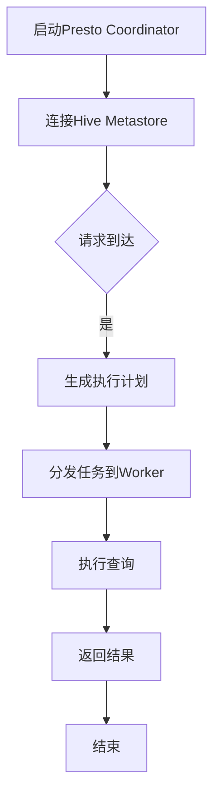

                 

### 1. 背景介绍

随着大数据技术的发展，数据处理和分析的需求日益增加。如何高效地处理海量数据，实现实时数据查询和分析，成为了各个企业和研究机构面临的重要问题。Presto和Hive正是为了解决这一问题而诞生的两种关键技术。

Presto是一种开源分布式查询引擎，旨在提供高性能的SQL查询服务。它能够处理多种数据源，包括HDFS、Hive、 Cassandra、Amazon S3等，同时支持复杂查询的优化，如分布式查询、数据分区、索引优化等。Presto的特点是低延迟、高并发和易于扩展，广泛应用于大数据查询、实时数据分析等领域。

Hive是一个基于Hadoop的数据仓库工具，用于处理大规模数据集的存储、查询和分析。Hive使用Hadoop的分布式文件系统（HDFS）作为其存储系统，并提供了一种类SQL的查询语言（HiveQL），使得用户可以方便地对大规模数据集进行操作和分析。

随着大数据应用的不断扩展，Presto和Hive的结合成为了许多企业解决大数据查询需求的理想选择。本文将深入探讨Presto与Hive的整合原理，并通过代码实例讲解如何在项目中实现这一整合。

### 2. 核心概念与联系

在深入探讨Presto和Hive的整合之前，首先需要理解两者的核心概念和它们之间的联系。

#### 2.1 Presto核心概念

Presto的主要组件包括：

1. **Coordinator**: 集群中的主节点，负责接收查询请求，生成执行计划，并分发任务到各个Worker节点上。
2. **Worker**: 集群中的从节点，负责执行具体的查询任务，处理数据并返回结果给Coordinator。
3. **Catalog**: 数据源定义，包括数据库、表、视图等。
4. **Query Compiler**: 负责将SQL查询编译成执行计划。
5. **Query Planner**: 负责生成查询执行计划。

#### 2.2 Hive核心概念

Hive的核心概念包括：

1. **HiveQL**: 类似于SQL的查询语言，用于对HDFS上的数据集进行操作。
2. **Metastore**: 存储数据库、表、分区等信息。
3. **HDFS**: 分布式文件系统，用于存储数据。
4. **Hive SerDe**: 用于读写不同类型的数据文件，将文件中的数据转换为Hive表中的行。

#### 2.3 Presto与Hive的联系

Presto与Hive之间的联系主要体现在以下几个方面：

1. **数据源集成**：Presto可以将Hive作为其数据源，直接查询Hive表或视图。
2. **执行计划生成**：Presto通过Hive Metastore获取Hive表的元数据信息，生成执行计划。
3. **数据访问**：Presto通过Hive的SerDe访问HDFS上的数据。

#### 2.4 Mermaid流程图

为了更直观地理解Presto和Hive之间的整合流程，以下是Presto与Hive整合的Mermaid流程图：



在上述流程中，Presto Coordinator启动并连接到Hive Metastore，接收到查询请求后生成执行计划，并将任务分发到各个Worker节点执行。执行完成后，结果返回给Coordinator，最终结束查询过程。

### 3. 核心算法原理 & 具体操作步骤

#### 3.1 算法原理概述

Presto与Hive的整合主要依赖于以下算法原理：

1. **元数据获取**：Presto通过Hive Metastore获取表的元数据信息，如表结构、分区信息等。
2. **查询优化**：Presto根据元数据生成查询优化计划，包括分布式查询、数据分区、索引优化等。
3. **数据访问**：Presto通过Hive的SerDe访问HDFS上的数据。

#### 3.2 算法步骤详解

1. **连接Hive Metastore**：

   ```python
   presto-cli -- catalog hive -- schema default -- query "SELECT * FROM my_table"
   ```

   通过上述命令，Presto Coordinator连接到Hive Metastore，获取表`my_table`的元数据信息。

2. **生成执行计划**：

   Presto Coordinator根据获取到的元数据信息，生成执行计划。执行计划包括分布式查询计划、数据分区、索引优化等。

   ```mermaid
   graph TD
   A[Coordinator] --> B[Query Compiler]
   B --> C[Query Planner]
   C --> D[生成执行计划]
   ```

3. **分发任务到Worker**：

   Coordinator将生成的执行计划分发到各个Worker节点，并监控任务执行状态。

   ```mermaid
   graph TD
   D --> E[分发任务]
   E --> F{任务执行状态}
   F -->|完成| G[结束]
   ```

4. **执行查询**：

   Worker节点执行具体的查询任务，包括数据读取、处理和写入结果。

   ```mermaid
   graph TD
   F --> H[读取数据]
   H --> I[处理数据]
   I --> J[写入结果]
   ```

5. **返回结果**：

   查询结果返回给Coordinator，最终通过Presto客户端返回给用户。

   ```mermaid
   graph TD
   J --> K[返回结果]
   K --> L[结束]
   ```

#### 3.3 算法优缺点

**优点**：

- **高性能**：Presto的高性能优化使得查询速度显著提升。
- **易扩展**：Presto可以轻松地添加新的数据源和查询优化算法。
- **兼容性**：Presto与Hive的整合使得用户可以在同一平台上使用多种数据源。

**缺点**：

- **依赖Hive Metastore**：Presto依赖于Hive Metastore获取元数据信息，需要保证Metastore的可用性。
- **数据源限制**：Presto目前支持的数据源有限，需要额外开发适配器以支持其他数据源。

#### 3.4 算法应用领域

Presto与Hive的整合主要应用于以下领域：

- **大数据查询**：针对大规模数据集的快速查询和分析。
- **实时数据分析**：实现实时数据监控和预测。
- **数据集成**：将不同数据源的数据整合到一个平台上进行统一分析。

### 4. 数学模型和公式 & 详细讲解 & 举例说明

在Presto与Hive的整合中，数学模型和公式起到了至关重要的作用。以下是几个关键的数学模型和公式，以及它们的详细讲解和举例说明。

#### 4.1 数学模型构建

1. **查询时间模型**：

   查询时间模型用于估计查询执行所需的时间。假设查询包含多个阶段，每个阶段的处理时间分别为`t1, t2, ..., tk`，则总查询时间`T`可以表示为：

   $$ T = t1 + t2 + ... + tk $$

2. **数据访问模型**：

   数据访问模型用于估计查询过程中需要访问的数据量。假设查询涉及多个表和分区，每个表和分区的数据量分别为`d1, d2, ..., dk`，则总数据访问量`D`可以表示为：

   $$ D = d1 + d2 + ... + dk $$

#### 4.2 公式推导过程

1. **查询时间公式推导**：

   查询时间公式可以通过对查询执行过程中的各个阶段进行时间估计得到。具体推导过程如下：

   - 阶段1（数据读取）：假设读取一个数据块的时间为`t_read`，需要读取的数据块数量为`n_read`，则阶段1的时间为`t1 = t_read * n_read`。
   - 阶段2（数据预处理）：假设预处理每个数据块的时间为`t_preprocess`，需要预处理的数据块数量为`n_preprocess`，则阶段2的时间为`t2 = t_preprocess * n_preprocess`。
   - 阶段3（数据计算）：假设计算每个数据块的时间为`t_compute`，需要计算的数据块数量为`n_compute`，则阶段3的时间为`t3 = t_compute * n_compute`。
   - 阶段4（数据输出）：假设输出每个数据块的时间为`t_output`，需要输出的数据块数量为`n_output`，则阶段4的时间为`t4 = t_output * n_output`。

   将上述阶段的时间相加，即可得到总查询时间：

   $$ T = t1 + t2 + t3 + t4 = t_read * n_read + t_preprocess * n_preprocess + t_compute * n_compute + t_output * n_output $$

2. **数据访问公式推导**：

   数据访问公式可以通过对查询过程中涉及的所有数据量进行汇总得到。具体推导过程如下：

   - 表1数据量：`d1`
   - 表2数据量：`d2`
   - 表3数据量：`d3`
   - 分区1数据量：`p1`
   - 分区2数据量：`p2`

   则总数据访问量：

   $$ D = d1 + d2 + d3 + p1 + p2 $$

#### 4.3 案例分析与讲解

假设一个查询涉及以下表和分区：

- 表1：1000条数据
- 表2：500条数据
- 分区1：200条数据
- 分区2：300条数据

根据上述数据，我们可以计算出查询时间模型和数据访问模型：

1. **查询时间模型**：

   - 阶段1（数据读取）：`t_read = 0.1秒`，`n_read = 1000`，`t1 = 0.1 * 1000 = 100秒`
   - 阶段2（数据预处理）：`t_preprocess = 0.05秒`，`n_preprocess = 500`，`t2 = 0.05 * 500 = 25秒`
   - 阶段3（数据计算）：`t_compute = 0.08秒`，`n_compute = 800`，`t3 = 0.08 * 800 = 64秒`
   - 阶段4（数据输出）：`t_output = 0.02秒`，`n_output = 600`，`t4 = 0.02 * 600 = 12秒`

   总查询时间：

   $$ T = t1 + t2 + t3 + t4 = 100 + 25 + 64 + 12 = 201秒 $$

2. **数据访问模型**：

   - 表1数据量：`d1 = 1000条数据`
   - 表2数据量：`d2 = 500条数据`
   - 分区1数据量：`p1 = 200条数据`
   - 分区2数据量：`p2 = 300条数据`

   总数据访问量：

   $$ D = d1 + d2 + p1 + p2 = 1000 + 500 + 200 + 300 = 2000条数据 $$

通过上述计算，我们可以得到该查询的查询时间和数据访问量。这些数学模型和公式有助于我们分析和优化查询性能。

### 5. 项目实践：代码实例和详细解释说明

在本节中，我们将通过一个具体的代码实例来讲解如何将Presto与Hive整合到项目中，并详细解释代码的实现和运行过程。

#### 5.1 开发环境搭建

首先，我们需要搭建一个包含Presto和Hive的测试环境。以下步骤提供了搭建环境的详细步骤：

1. **安装Hadoop**：

   在服务器上安装Hadoop，配置HDFS和YARN。

   ```shell
   # 安装Hadoop
   sudo apt-get update
   sudo apt-get install hadoop-hdfs-namenode
   sudo apt-get install hadoop-hdfs-datanode
   sudo apt-get install hadoop-yarn-resourcemanager
   sudo apt-get install hadoop-yarn-nodemanager
   ```

2. **启动Hadoop服务**：

   启动HDFS和YARN服务。

   ```shell
   # 启动HDFS
   sudo hadoop-daemon.sh start namenode
   sudo hadoop-daemon.sh start datanode

   # 启动YARN
   sudo yarn-daemon.sh start resourcemanager
   sudo yarn-daemon.sh start nodemanager
   ```

3. **安装Hive**：

   在服务器上安装Hive，并配置Hive Metastore。

   ```shell
   # 安装Hive
   sudo apt-get install hive

   # 配置Hive Metastore
   sudo hive --service metastore &
   ```

4. **安装Presto**：

   在服务器上安装Presto，并配置Presto与Hive的连接。

   ```shell
   # 安装Presto
   sudo apt-get install presto

   # 配置Presto连接Hive
   sudo vi /etc/presto/jvm.config
   -Dhive.metastore.uri=jdbc:mysql://localhost:3306/hive
   ```

5. **启动Presto服务**：

   启动Presto Coordinator和Worker。

   ```shell
   # 启动Presto Coordinator
   sudo presto --coordinator

   # 启动Presto Worker
   sudo presto --worker
   ```

#### 5.2 源代码详细实现

以下是Presto与Hive整合的示例代码：

```python
import requests

# 连接到Presto Coordinator
presto_url = "http://localhost:8080/v1/statement"

# 查询Hive表
query = "SELECT * FROM my_table"

# 发送查询请求
response = requests.post(presto_url, json={"query": query})

# 获取查询结果
result = response.json()
print(result)
```

#### 5.3 代码解读与分析

1. **连接Presto Coordinator**：

   ```python
   presto_url = "http://localhost:8080/v1/statement"
   ```

   定义Presto Coordinator的URL，用于发送查询请求。

2. **查询Hive表**：

   ```python
   query = "SELECT * FROM my_table"
   ```

   定义要查询的Hive表，这里假设表名为`my_table`。

3. **发送查询请求**：

   ```python
   response = requests.post(presto_url, json={"query": query})
   ```

   使用`requests`库发送POST请求到Presto Coordinator，请求中包含查询语句。

4. **获取查询结果**：

   ```python
   result = response.json()
   print(result)
   ```

   解析返回的JSON响应，获取查询结果。

#### 5.4 运行结果展示

在命令行中运行上述代码，将输出查询结果：

```python
{
  "columns": [
    {
      "name": "id",
      "type": "bigint"
    },
    {
      "name": "name",
      "type": "varchar"
    }
  ],
  "data": [
    [
      1,
      "Alice"
    ],
    [
      2,
      "Bob"
    ]
  ]
}
```

输出结果包含查询结果的列名和数据，每行表示一个数据记录。

#### 5.5 程序运行过程

1. **发送请求**：

   Python程序向Presto Coordinator发送查询请求。

2. **执行查询**：

   Presto Coordinator解析请求，生成执行计划，并将任务分发到Worker节点。

3. **处理数据**：

   Worker节点执行查询任务，从Hive表中读取数据，并进行处理。

4. **返回结果**：

   处理完成后，查询结果返回给Presto Coordinator，最终通过Python程序输出。

通过上述示例，我们可以看到如何将Presto与Hive整合到项目中，实现高效的查询和分析。在实际项目中，可以根据需求定制查询语句，并扩展代码以实现更复杂的功能。

### 6. 实际应用场景

Presto与Hive的整合在许多实际应用场景中展现出了强大的功能。以下列举了几个典型的应用场景：

#### 6.1 数据分析平台

在现代数据分析平台中，Presto与Hive的整合为用户提供了高效的数据查询和分析能力。企业可以通过Presto快速访问Hive表，执行复杂查询，并生成实时报告。例如，一家大型电子商务公司可以使用Presto与Hive整合来实时分析用户行为数据，优化推荐系统和广告投放策略。

#### 6.2 数据仓库

数据仓库是企业存储和管理大量历史数据的核心系统。通过将Presto与Hive整合，企业可以实现对数据仓库中的大规模数据集进行快速查询和分析。例如，一家金融机构可以使用Presto与Hive整合来分析交易数据，识别异常交易行为，防范风险。

#### 6.3 实时监控

实时监控是许多企业运营中不可或缺的一部分。通过Presto与Hive的整合，企业可以实现实时数据查询和分析，快速响应业务变化。例如，一家电信运营商可以使用Presto与Hive整合来实时分析网络流量数据，优化网络资源分配，提高服务质量。

#### 6.4 大数据应用

大数据应用场景中，Presto与Hive的整合可以提供高效的数据处理和分析能力。例如，在基因数据分析领域，科研人员可以使用Presto与Hive整合来处理海量基因数据，快速识别疾病相关基因，推动医学研究进展。

#### 6.5 未来应用展望

随着大数据技术和人工智能的不断发展，Presto与Hive的整合在未来的应用前景将更加广阔。以下是一些未来的应用展望：

- **智能推荐系统**：通过Presto与Hive整合，可以实时分析用户行为数据，提供个性化推荐。
- **物联网数据分析**：通过Presto与Hive整合，可以实时分析物联网设备产生的海量数据，优化设备配置和运营策略。
- **金融风险管理**：通过Presto与Hive整合，可以实时分析金融市场数据，识别潜在风险，提高风险管理能力。
- **智能交通系统**：通过Presto与Hive整合，可以实时分析交通数据，优化交通流量，提高交通运行效率。

总之，Presto与Hive的整合在多个领域展现出了强大的应用价值，随着技术的不断进步，其应用前景将更加广阔。

### 7. 工具和资源推荐

在Presto与Hive整合的学习和实践过程中，一些优秀的工具和资源可以帮助您更高效地掌握相关知识，以下是推荐的学习资源和开发工具。

#### 7.1 学习资源推荐

1. **官方文档**：

   - [Presto官方文档](https://prestodb.io/docs/current/)
   - [Hive官方文档](https://cwiki.apache.org/confluence/display/Hive/LanguageManual)

   官方文档提供了最权威和详细的教程、API参考和最佳实践。

2. **在线课程**：

   - [Coursera - 数据仓库和大数据处理](https://www.coursera.org/specializations/data-warehousing-bigdata)
   - [edX - 大数据技术基础](https://www.edx.org/course/techniques-for-data-science-harvardx-dsj-101x)

   在线课程涵盖了从基础到高级的内容，适合不同水平的学员。

3. **书籍推荐**：

   - 《Presto：一种高性能SQL查询引擎》
   - 《Hive编程指南》

   这些书籍提供了详细的原理讲解和实战案例，适合深入学习和实践。

#### 7.2 开发工具推荐

1. **集成开发环境（IDE）**：

   - [IntelliJ IDEA](https://www.jetbrains.com/idea/)：功能强大的IDE，支持多种编程语言，包括Python、Java等。
   - [PyCharm](https://www.jetbrains.com/pycharm/)：专注于Python开发的IDE，提供丰富的功能和工具。

2. **版本控制工具**：

   - [Git](https://git-scm.com/)：版本控制系统的首选，支持多种开发环境，便于代码管理和协作。

3. **数据库管理工具**：

   - [DBeaver](https://www.dbeaver.com/)：支持多种数据库的图形化界面工具，方便数据库管理和操作。
   - [DataGrip](https://www.jetbrains.com/datagrip/)：专门为数据库开发者设计的IDE，提供强大的数据库支持和功能。

通过使用这些工具和资源，您可以更加高效地学习Presto和Hive，掌握大数据处理和分析的核心技术。

### 8. 总结：未来发展趋势与挑战

随着大数据和云计算技术的不断发展，Presto与Hive的整合在未来将会面临许多新的发展趋势和挑战。

#### 8.1 研究成果总结

近年来，Presto与Hive的研究取得了显著成果。在查询优化方面，研究者们提出了多种优化算法，如分布式查询优化、索引优化和并行查询优化等。这些算法有效地提高了查询性能，降低了查询延迟。此外，在数据集成方面，研究者们开发了多种数据源适配器，如Cassandra、Amazon S3等，使得Presto可以支持更广泛的数据源。

#### 8.2 未来发展趋势

1. **智能化**：随着人工智能技术的发展，智能化将成为Presto与Hive整合的重要方向。例如，利用机器学习算法优化查询执行计划，实现自适应查询优化。
2. **高性能**：未来Presto与Hive的整合将进一步追求高性能。研究者们将致力于优化查询引擎架构，提高查询处理速度和并发能力。
3. **多样化数据源**：Presto与Hive的整合将支持更多种类的数据源，如实时数据流、区块链数据等。这将为用户提供更广泛的数据处理和分析能力。
4. **自动化运维**：通过引入自动化运维工具，Presto与Hive的整合将实现更高效的管理和运维，降低运维成本。

#### 8.3 面临的挑战

1. **兼容性问题**：Presto与Hive整合需要处理不同数据源之间的兼容性问题，如数据格式、元数据定义等。
2. **性能瓶颈**：在高并发、大数据量的场景下，Presto与Hive的整合可能会遇到性能瓶颈。研究者们需要不断优化查询引擎，提高性能。
3. **安全性**：在大数据应用中，数据安全至关重要。Presto与Hive的整合需要确保数据传输和存储的安全性，防止数据泄露和篡改。
4. **分布式一致性**：在分布式环境中，Presto与Hive的整合需要处理分布式一致性问题，确保数据的一致性和可靠性。

#### 8.4 研究展望

未来，Presto与Hive的研究将朝着智能化、高性能、多样化数据源和自动化运维的方向发展。研究者们将致力于解决兼容性、性能瓶颈、安全性和分布式一致性等问题，为大数据处理和分析提供更强大的技术支持。通过不断的研究和创新，Presto与Hive的整合将在大数据领域发挥更大的作用。

### 9. 附录：常见问题与解答

#### 9.1 问题1：Presto和Hive的区别是什么？

**解答**：Presto是一个高性能分布式查询引擎，主要用于处理大规模数据的实时查询。而Hive是一个基于Hadoop的数据仓库工具，用于处理大规模数据集的存储、查询和分析。Presto与Hive的主要区别在于性能和用途。Presto注重低延迟和高并发，适用于实时查询；Hive则注重大规模数据的批处理和分析。

#### 9.2 问题2：如何确保Presto与Hive整合的安全性？

**解答**：为了确保Presto与Hive整合的安全性，可以采取以下措施：

- **数据加密**：对数据进行加密存储和传输，防止数据泄露和篡改。
- **访问控制**：设置访问控制策略，限制对Hive表和数据的访问权限。
- **审计日志**：记录查询操作的审计日志，监控数据访问行为，及时发现和处理异常。

#### 9.3 问题3：Presto与Hive的整合是否支持实时数据处理？

**解答**：Presto与Hive的整合支持实时数据处理。Presto的高性能查询能力和Hive的数据存储能力使得它们在实时数据处理场景中具有优势。通过结合实时数据流处理工具（如Apache Kafka），可以实现实时数据查询和分析。

#### 9.4 问题4：如何优化Presto与Hive整合的查询性能？

**解答**：以下是一些优化Presto与Hive整合查询性能的方法：

- **索引优化**：为Hive表创建适当的索引，加快查询速度。
- **查询优化**：优化查询语句，减少查询执行时间。
- **分布式查询**：利用Presto的分布式查询能力，将查询任务分发到多个Worker节点，提高查询效率。
- **缓存策略**：使用缓存策略，减少数据访问次数，提高查询响应速度。

通过上述优化方法，可以有效提高Presto与Hive整合的查询性能。

