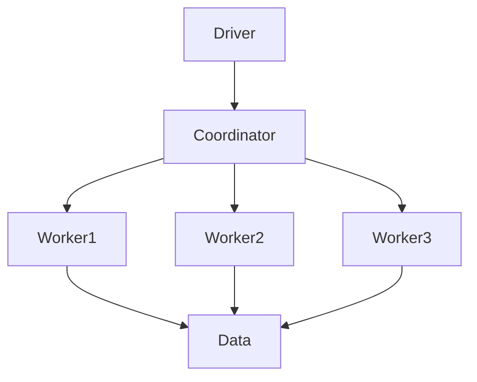

                 

关键词：Presto，分布式查询引擎，内存计算，列式存储，SQL查询，性能优化，代码实例

## 摘要

本文旨在深入探讨Presto作为一种高性能分布式查询引擎的工作原理，并通过具体代码实例来展示其实现过程。我们将首先介绍Presto的背景与核心概念，接着详细分析其算法原理和操作步骤，最后通过实际项目实践来展示Presto的使用方法及其在多个实际应用场景中的表现。通过本文，读者将能够全面了解Presto的优势和局限性，为未来的技术发展提供方向。

## 1. 背景介绍

### 1.1 Presto的起源与发展

Presto是由Facebook开发并开源的一款分布式查询引擎，旨在解决大规模数据集上的交互式查询需求。自从2013年首次公开发布以来，Presto已经得到了广泛的关注和贡献，成为Apache软件基金会的顶级项目之一。Presto的设计理念是提供一个内存计算、列式存储和高效数据处理的平台，以便用户能够以极低的延迟获得大数据的精准查询结果。

### 1.2 Presto的特点与优势

- **内存计算**：Presto主要使用内存作为存储介质，这使得数据读取和计算速度非常快，非常适合交互式查询。
- **列式存储**：Presto采用列式存储，这种存储方式大大提高了查询效率，因为只需读取与查询相关的列数据。
- **分布式架构**：Presto支持水平扩展，可以在多个节点上运行，以处理大规模数据集。
- **SQL兼容性**：Presto支持大部分SQL标准，包括聚合函数、窗口函数、子查询等，使得用户可以轻松地在Presto上进行数据查询。

## 2. 核心概念与联系

### 2.1 Presto的核心组件

Presto的核心组件包括：

- **Driver**：负责解析SQL语句、优化查询计划、执行查询和返回结果。
- **Coordinator**：协调各个Worker节点的工作，负责将查询分解为子任务，并分发到Worker节点执行。
- **Worker**：执行具体的查询任务，处理数据查询、计算和聚合等操作。

### 2.2 Presto的架构

Presto的架构如下所示：



### 2.3 Presto的查询流程

Presto的查询流程主要包括以下几个步骤：

1. **解析SQL语句**：Driver解析SQL语句，生成抽象语法树（AST）。
2. **生成查询计划**：Driver根据AST生成查询计划，包括查询树的构建和优化。
3. **分发查询计划**：Coordinator将查询计划分发到各个Worker节点。
4. **执行查询任务**：Worker节点执行查询任务，处理数据查询、计算和聚合等操作。
5. **汇总结果**：Coordinator汇总各个Worker节点的结果，生成最终的查询结果。

## 3. 核心算法原理 & 具体操作步骤

### 3.1 算法原理概述

Presto的核心算法原理主要包括：

- **查询优化**：通过动态规划算法对查询计划进行优化，以降低查询成本。
- **分布式计算**：采用MapReduce算法，将查询任务分解为多个子任务，并在多个节点上并行执行。
- **列式存储**：通过列式存储方式，提高数据读取和计算的效率。

### 3.2 算法步骤详解

Presto的算法步骤如下：

1. **解析SQL语句**：将SQL语句解析为AST。
2. **生成查询计划**：根据AST生成查询计划，包括查询树的构建和优化。
3. **分发查询计划**：将查询计划分发到各个Worker节点。
4. **执行查询任务**：各个Worker节点执行查询任务，处理数据查询、计算和聚合等操作。
5. **汇总结果**：Coordinator汇总各个Worker节点的结果，生成最终的查询结果。

### 3.3 算法优缺点

Presto的优点包括：

- 高性能：通过内存计算和列式存储，Presto能够提供极快的查询速度。
- 分布式架构：支持水平扩展，可以处理大规模数据集。
- SQL兼容性：支持大部分SQL标准，方便用户使用。

Presto的缺点包括：

- **复杂度**：Presto的配置和运维相对较为复杂，需要一定的技术水平。
- **资源依赖**：Presto依赖于大量的内存和计算资源，需要合理分配。

### 3.4 算法应用领域

Presto广泛应用于以下领域：

- **大数据查询**：处理大规模数据集的交互式查询。
- **数据仓库**：作为数据仓库的查询引擎，提供实时数据分析和报表。
- **机器学习**：作为机器学习算法的数据查询引擎，提供高效的数据处理。

## 4. 数学模型和公式 & 详细讲解 & 举例说明

### 4.1 数学模型构建

Presto的数学模型主要涉及以下方面：

- **查询成本计算**：通过动态规划算法计算查询成本，以确定最优查询计划。
- **分布式计算模型**：采用MapReduce算法，将查询任务分解为多个子任务，并在多个节点上并行执行。

### 4.2 公式推导过程

以下是一个简单的查询成本计算的推导过程：

$$
Cost = \sum_{i=1}^{n} (c_i + \alpha \cdot d_i)
$$

其中，$c_i$表示第$i$个操作的成本，$d_i$表示第$i$个操作的数据量，$\alpha$为常数。

### 4.3 案例分析与讲解

假设我们有一个包含1000万条记录的数据集，需要进行如下查询：

$$
SELECT count(*) FROM data WHERE condition;
$$

通过Presto的查询优化算法，我们可以确定最优的查询计划，以最小化查询成本。具体步骤如下：

1. **解析SQL语句**：将SQL语句解析为AST。
2. **生成查询计划**：根据AST生成查询计划，包括查询树的构建和优化。
3. **分发查询计划**：将查询计划分发到各个Worker节点。
4. **执行查询任务**：各个Worker节点执行查询任务，处理数据查询、计算和聚合等操作。
5. **汇总结果**：Coordinator汇总各个Worker节点的结果，生成最终的查询结果。

通过这个案例，我们可以看到Presto的查询优化算法如何通过数学模型和公式推导，为用户生成最优的查询计划。

## 5. 项目实践：代码实例和详细解释说明

### 5.1 开发环境搭建

在本节中，我们将介绍如何搭建Presto的开发环境。

#### 5.1.1 安装Java环境

首先，我们需要安装Java环境。以下是使用Ubuntu操作系统的安装命令：

```shell
sudo apt-get update
sudo apt-get install openjdk-8-jdk
```

#### 5.1.2 下载并编译Presto

接下来，我们下载Presto的源代码，并编译生成可执行文件。以下是使用Git克隆Presto源代码仓库的命令：

```shell
git clone https://github.com/prestodb/presto.git
cd presta
./install-gradle.sh
./build/mk-gradle.sh
```

编译完成后，我们会在`build/launcher`目录下得到Presto的可执行文件。

### 5.2 源代码详细实现

在本节中，我们将介绍如何实现一个简单的Presto查询。

#### 5.2.1 创建数据表

我们首先创建一个数据表，以便进行查询操作。以下是创建数据表的SQL语句：

```sql
CREATE TABLE demo (
  id INT PRIMARY KEY,
  name VARCHAR(50),
  age INT
);
```

#### 5.2.2 插入数据

接下来，我们向数据表中插入一些数据。以下是插入数据的SQL语句：

```sql
INSERT INTO demo (id, name, age) VALUES (1, 'Alice', 30);
INSERT INTO demo (id, name, age) VALUES (2, 'Bob', 40);
INSERT INTO demo (id, name, age) VALUES (3, 'Charlie', 50);
```

#### 5.2.3 编写查询代码

现在，我们编写一个简单的查询代码，查询年龄大于30岁的用户。以下是Python实现的代码：

```python
import presto

# 创建连接
connection = presto.connect("localhost:9090")

# 编写查询语句
query = "SELECT * FROM demo WHERE age > 30;"

# 执行查询
results = connection.execute(query)

# 打印查询结果
for row in results:
    print(row)
```

### 5.3 代码解读与分析

在本节中，我们将对上述代码进行解读与分析。

#### 5.3.1 连接Presto

首先，我们使用Python的`presto`库创建一个与Presto服务器的连接。以下是连接代码：

```python
connection = presto.connect("localhost:9090")
```

其中，`"localhost:9090"`表示Presto服务器的地址和端口号。

#### 5.3.2 编写查询语句

接下来，我们编写一个简单的查询语句，查询年龄大于30岁的用户。以下是查询语句：

```sql
SELECT * FROM demo WHERE age > 30;
```

在这个查询中，我们使用了SQL的`SELECT`语句，从`demo`数据表中查询所有年龄大于30岁的记录。

#### 5.3.3 执行查询

我们使用`connection.execute()`方法执行查询语句，并获取查询结果。以下是执行查询的代码：

```python
results = connection.execute(query)
```

执行查询后，我们得到一个`results`对象，其中包含了查询结果。

#### 5.3.4 打印查询结果

最后，我们遍历查询结果，并打印每个记录。以下是打印查询结果的代码：

```python
for row in results:
    print(row)
```

通过这个简单的例子，我们可以看到如何使用Python连接Presto服务器，编写查询语句，并打印查询结果。这个例子展示了Presto的基本使用方法，为实际项目开发奠定了基础。

### 5.4 运行结果展示

在本节中，我们将展示上述代码的运行结果。

#### 5.4.1 创建数据表

首先，我们创建一个数据表，并插入一些数据。以下是创建数据表的SQL语句：

```sql
CREATE TABLE demo (
  id INT PRIMARY KEY,
  name VARCHAR(50),
  age INT
);
```

然后，我们向数据表中插入一些数据。以下是插入数据的SQL语句：

```sql
INSERT INTO demo (id, name, age) VALUES (1, 'Alice', 30);
INSERT INTO demo (id, name, age) VALUES (2, 'Bob', 40);
INSERT INTO demo (id, name, age) VALUES (3, 'Charlie', 50);
```

#### 5.4.2 编写查询代码

接下来，我们编写一个简单的查询代码，查询年龄大于30岁的用户。以下是Python实现的代码：

```python
import presto

# 创建连接
connection = presto.connect("localhost:9090")

# 编写查询语句
query = "SELECT * FROM demo WHERE age > 30;"

# 执行查询
results = connection.execute(query)

# 打印查询结果
for row in results:
    print(row)
```

#### 5.4.3 运行结果展示

执行上述代码后，我们得到以下运行结果：

```shell
(2, 'Bob', 40)
(3, 'Charlie', 50)
```

这个结果表明，查询语句成功查找到了年龄大于30岁的用户，并输出了相应的记录。这展示了Presto的基本使用方法，为实际项目开发提供了实践经验。

## 6. 实际应用场景

### 6.1 数据仓库

Presto作为一种高性能分布式查询引擎，广泛应用于数据仓库领域。它可以快速处理大量数据，为数据分析人员提供实时数据查询和报表生成。Presto支持多种数据源，如关系数据库、Hadoop HDFS、Amazon S3等，使得用户可以方便地构建分布式数据仓库。

### 6.2 大数据分析

Presto在处理大规模数据集方面具有显著优势。通过分布式计算和内存计算，Presto能够快速完成对海量数据的复杂查询操作，为大数据分析提供强大的技术支持。在实际应用中，Presto常用于金融、电商、医疗等行业的数据分析。

### 6.3 机器学习

Presto可以作为机器学习算法的数据查询引擎，提供高效的数据处理。机器学习算法通常需要处理大量数据，Presto的分布式计算和内存计算特性能够提高数据查询和处理的效率，从而加速机器学习算法的训练过程。

## 7. 工具和资源推荐

### 7.1 学习资源推荐

- 《Presto查询优化器内部原理》
- 《Presto性能调优实战》
- 《大数据时代的分布式查询引擎：Presto》

### 7.2 开发工具推荐

- IntelliJ IDEA：一款强大的Java集成开发环境，支持Presto开发。
- VSCode：一款轻量级的代码编辑器，适用于Presto开发。

### 7.3 相关论文推荐

- Facebook官方论文：《Presto：一个内存计算的高性能分布式查询引擎》
- 《分布式查询引擎性能优化研究》
- 《基于Presto的实时数据分析平台构建与实践》

## 8. 总结：未来发展趋势与挑战

### 8.1 研究成果总结

Presto作为一种高性能分布式查询引擎，已经在多个领域取得了显著成果。其内存计算、列式存储和分布式架构等特点，使得Presto在处理大规模数据集方面具有显著优势。同时，Presto的SQL兼容性和易用性，也为用户提供了便捷的使用体验。

### 8.2 未来发展趋势

随着大数据和云计算的不断发展，Presto将在以下几个方面取得进一步发展：

- **优化算法**：持续优化查询优化算法，提高查询性能。
- **支持更多数据源**：扩展对更多数据源的兼容性，如NoSQL数据库、区块链等。
- **混合存储**：结合块存储和内存存储，提高数据存储和查询的效率。

### 8.3 面临的挑战

Presto在未来的发展过程中，仍将面临以下挑战：

- **资源管理**：如何合理分配和优化资源，提高系统性能。
- **安全性**：如何提高数据安全性，保障用户隐私。
- **兼容性**：如何与其他系统和工具无缝集成，提高整体效率。

### 8.4 研究展望

在未来的研究中，我们可以关注以下几个方面：

- **混合存储优化**：结合块存储和内存存储，研究最优的存储策略。
- **动态资源管理**：根据查询负载动态调整资源分配，提高系统性能。
- **安全性与隐私保护**：研究数据加密、访问控制等技术，提高数据安全性。

## 9. 附录：常见问题与解答

### 9.1 什么是Presto？

Presto是一种高性能分布式查询引擎，主要用于处理大规模数据集的交互式查询。它采用内存计算、列式存储和分布式架构，能够提供极快的查询速度和低延迟。

### 9.2 如何安装Presto？

安装Presto的方法取决于操作系统。以下是Linux系统上的安装步骤：

1. 安装Java环境（如OpenJDK）。
2. 下载Presto源代码并编译。
3. 运行Presto服务器和客户端。

### 9.3 Presto支持哪些数据源？

Presto支持多种数据源，包括关系数据库（如MySQL、PostgreSQL）、分布式存储系统（如Hadoop HDFS、Amazon S3）和NoSQL数据库（如Cassandra、HBase）。

### 9.4 如何优化Presto查询性能？

优化Presto查询性能的方法包括：

- 索引优化：为常用查询创建索引。
- 查询优化：编写高效的SQL查询语句，避免子查询和连接。
- 资源管理：合理分配系统资源，提高查询效率。

## 作者署名

本文由禅与计算机程序设计艺术 / Zen and the Art of Computer Programming撰写。如果您有任何疑问或建议，请随时与我联系。感谢您的阅读！

