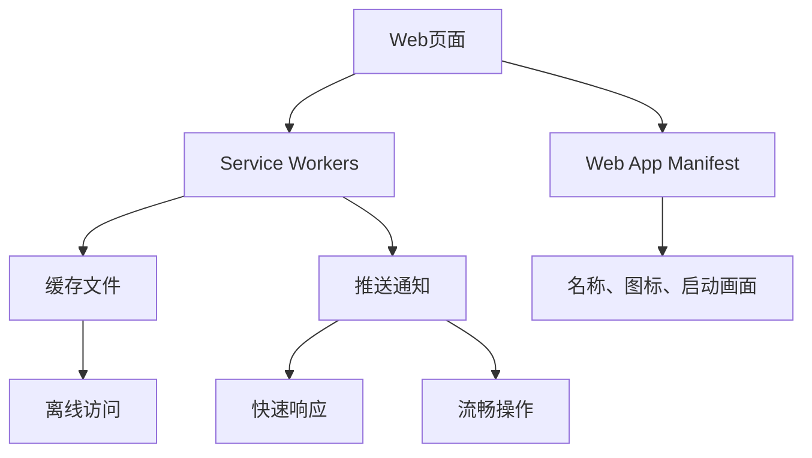

                 

关键词：Progressive Web Apps (PWA)、Web应用、原生应用、跨平台、用户体验、性能优化、服务工人、缓存策略、渐进式增强

> 摘要：随着移动互联网的快速发展，用户对应用的性能、功能和体验要求越来越高。Progressive Web Apps (PWA)作为Web与原生应用之间的桥梁，提供了一种全新的解决方案，满足了用户对高质量应用的需求。本文将深入探讨PWA的核心概念、架构、技术原理以及在实际开发中的应用，为开发者提供全面的技术指导和实践建议。

## 1. 背景介绍

在过去，Web应用和原生应用在技术和用户体验上存在显著差异。Web应用以浏览器为载体，具有跨平台、开发成本低、更新灵活等优点，但其性能和用户体验相对较弱；而原生应用则具备优秀的性能和用户体验，但需针对不同平台分别开发，开发成本高且更新速度慢。

随着移动互联网的普及，用户对应用性能、功能和体验的要求越来越高。为了满足这一需求，开发者们开始探索一种介于Web应用和原生应用之间的新型应用——Progressive Web Apps (PWA)。

PWA首次出现在2015年，由Google提出，旨在解决Web应用和原生应用之间的痛点，提供一种高性能、高用户体验、跨平台的新型应用方案。PWA结合了Web应用的灵活性和原生应用的优势，使得开发者能够以一种更加高效的方式构建高质量的应用。

### 1.1 PWA的核心特点

PWA具有以下核心特点：

1. **渐进式增强**：PWA能够在旧版浏览器上正常工作，同时在新版浏览器上实现高级功能和优化。
2. **高性能**：PWA通过缓存策略、服务工人等技术手段，提供快速响应和流畅的用户体验。
3. **高可发现性**：PWA可以通过Web搜索、URL访问等方式被用户发现和分享。
4. **可安装性**：PWA支持用户在浏览器中添加到主屏幕，实现类似于原生应用的启动和操作体验。
5. **安全性**：PWA采用HTTPS协议，确保用户数据传输的安全。

## 2. 核心概念与联系

### 2.1 PWA的核心概念

PWA的核心概念包括以下三个方面：

1. **渐进式增强**：PWA能够在旧版浏览器上正常工作，同时在新版浏览器上实现高级功能和优化。这种渐进式增强的方式使得开发者能够兼顾不同浏览器的兼容性，提高应用的可访问性。
2. **服务工人**：服务工人（Service Workers）是一种运行在浏览器后台的脚本，用于拦截和处理网络请求、缓存文件、推送通知等。服务工人是PWA的核心技术之一，能够显著提升应用的性能和用户体验。
3. **Web App Manifest**：Web App Manifest是一个JSON文件，用于描述PWA的基本信息，如名称、图标、启动画面等。通过配置Web App Manifest，开发者可以使得PWA具有更好的用户体验和可安装性。

### 2.2 PWA的架构

PWA的架构可以分为三个主要部分：

1. **Web页面**：Web页面是PWA的核心，用于展示应用的内容和功能。
2. **Service Workers**：Service Workers负责处理网络请求、缓存文件、推送通知等。通过Service Workers，开发者可以实现离线访问、快速响应、缓存更新等高级功能。
3. **Web App Manifest**：Web App Manifest用于配置PWA的基本信息和外观。通过Web App Manifest，开发者可以使得PWA具有更好的用户体验和可安装性。

### 2.3 PWA与Web应用、原生应用的联系

PWA是Web应用和原生应用之间的桥梁，具有以下联系：

1. **Web应用**：PWA继承了Web应用的跨平台、开发成本低、更新灵活等优点。
2. **原生应用**：PWA在性能和用户体验方面借鉴了原生应用的优势，通过服务工人、缓存策略等技术手段，实现了快速响应、流畅操作、离线访问等高级功能。

### 2.4 PWA的Mermaid流程图

以下是PWA的核心概念和架构的Mermaid流程图：



## 3. 核心算法原理 & 具体操作步骤

### 3.1 算法原理概述

PWA的核心算法原理主要涉及以下几个方面：

1. **渐进式增强**：通过检测用户浏览器的版本和功能，动态调整应用的表现形式，使得旧版浏览器能够正常访问，新版浏览器能够实现高级功能和优化。
2. **Service Workers**：利用Service Workers拦截和处理网络请求，缓存文件，从而实现快速响应、离线访问等功能。
3. **Web App Manifest**：通过配置Web App Manifest，使得PWA具有更好的用户体验和可安装性。

### 3.2 算法步骤详解

1. **检测浏览器版本和功能**：通过检测用户浏览器的版本和功能，判断是否支持PWA的核心特性。
2. **加载Web页面**：根据浏览器版本和功能，加载适当的Web页面。
3. **注册Service Workers**：通过在主线程注册Service Workers，使得Service Workers能够拦截和处理网络请求。
4. **缓存文件**：通过Service Workers缓存应用的资源文件，实现快速响应和离线访问。
5. **推送通知**：通过Service Workers发送推送通知，实现与用户的实时交互。
6. **配置Web App Manifest**：通过配置Web App Manifest，使得PWA具有更好的用户体验和可安装性。

### 3.3 算法优缺点

**优点**：

1. **跨平台**：PWA支持多种操作系统和设备，无需针对不同平台进行单独开发。
2. **高性能**：通过Service Workers缓存文件，实现快速响应和流畅操作。
3. **高可发现性**：PWA可以通过Web搜索、URL访问等方式被用户发现和分享。
4. **可安装性**：PWA支持用户在浏览器中添加到主屏幕，实现类似于原生应用的启动和操作体验。
5. **安全性**：PWA采用HTTPS协议，确保用户数据传输的安全。

**缺点**：

1. **兼容性问题**：部分旧版浏览器可能不支持PWA的核心特性，影响用户体验。
2. **开发成本**：PWA的开发相对于传统Web应用和原生应用，需要更多的技术和资源投入。

### 3.4 算法应用领域

PWA主要应用于以下领域：

1. **电商平台**：电商平台可以通过PWA提升用户购物体验，实现快速响应、离线访问等功能。
2. **新闻资讯**：新闻资讯类应用可以通过PWA实现实时推送、快速浏览等功能。
3. **社交媒体**：社交媒体应用可以通过PWA提升用户体验，实现快速响应、流畅操作等功能。

## 4. 数学模型和公式 & 详细讲解 & 举例说明

### 4.1 数学模型构建

PWA的性能优化主要涉及以下几个数学模型：

1. **响应时间模型**：响应时间模型用于评估PWA的响应速度。假设PWA的响应时间为T，网络延迟为N，缓存命中率为C，则响应时间模型为：

   $$T = N + C \cdot (1 - D)$$

   其中，N为网络延迟，C为缓存命中率，D为请求的动态内容比例。

2. **缓存命中率模型**：缓存命中率模型用于评估PWA的缓存效果。假设缓存命中率为H，缓存容量为S，请求频率为R，则缓存命中率模型为：

   $$H = \frac{S}{S + R}$$

### 4.2 公式推导过程

1. **响应时间模型推导**：

   PWA的响应时间由网络延迟、缓存命中时间和动态内容处理时间组成。假设网络延迟为N，缓存命中时间为C，动态内容处理时间为D，则响应时间模型为：

   $$T = N + C + D$$

   由于缓存命中时间C与缓存容量S和请求频率R有关，因此可以将C表示为：

   $$C = \frac{S}{S + R}$$

   代入响应时间模型，得到：

   $$T = N + \frac{S}{S + R} + D$$

   由于动态内容处理时间D与请求的动态内容比例有关，可以将D表示为：

   $$D = 1 - C$$

   代入响应时间模型，得到：

   $$T = N + \frac{S}{S + R} + 1 - C$$

   化简得：

   $$T = N + C \cdot (1 - D)$$

2. **缓存命中率模型推导**：

   缓存命中率H表示缓存中被请求的内容占总内容的比例。假设缓存容量为S，请求频率为R，则缓存中被请求的内容为R，总内容为S + R。因此，缓存命中率模型为：

   $$H = \frac{R}{S + R}$$

### 4.3 案例分析与讲解

假设一个PWA应用的网络延迟为200ms，缓存容量为100MB，请求频率为1MB/s。根据缓存命中率模型，可以计算出缓存命中率：

$$H = \frac{100}{100 + 1} = 0.99$$

根据响应时间模型，可以计算出响应时间：

$$T = 200 + 0.99 \cdot (1 - 0.99) = 200 + 0.99 \cdot 0.01 = 200.099$$

因此，该PWA应用的平均响应时间为200.099ms。通过优化缓存策略和降低网络延迟，可以进一步减少响应时间，提升用户体验。

## 5. 项目实践：代码实例和详细解释说明

### 5.1 开发环境搭建

1. **安装Node.js**：首先，确保已经安装了Node.js环境。可以通过访问Node.js官网（https://nodejs.org/）下载并安装Node.js。
2. **安装Vue CLI**：通过命令行安装Vue CLI，Vue CLI是一个用于快速生成和管理Vue.js项目的工具。

   ```bash
   npm install -g @vue/cli
   ```

3. **创建Vue项目**：使用Vue CLI创建一个全新的Vue项目。

   ```bash
   vue create pwa-project
   ```

   在创建项目时，选择PWA选项，以确保项目支持PWA特性。

### 5.2 源代码详细实现

以下是创建PWA项目的基本步骤和代码实现：

1. **配置Web App Manifest**：

   在项目根目录下创建一个名为`manifest.json`的文件，并添加以下内容：

   ```json
   {
     "name": "PWA Project",
     "short_name": "PWA App",
     "description": "A Progressive Web App example.",
     "start_url": "./index.html",
     "display": "standalone",
     "background_color": "#ffffff",
     "theme_color": "#000000",
     "icons": [
       {
         "src": "icon-192x192.png",
         "sizes": "192x192",
         "type": "image/png"
       },
       {
         "src": "icon-512x512.png",
         "sizes": "512x512",
         "type": "image/png"
       }
     ]
   }
   ```

2. **注册Service Workers**：

   在`src`目录下创建一个名为`service-worker.js`的文件，并添加以下代码：

   ```javascript
   self.addEventListener('install', function(event) {
     event.waitUntil(
       caches.open('pwa-cache').then(function(cache) {
         return cache.addAll([
           './',
           './index.html',
           './styles/main.css',
           './scripts/main.js',
           './images/icon-192x192.png',
           './images/icon-512x512.png'
         ]);
       })
     );
   });

   self.addEventListener('fetch', function(event) {
     event.respondWith(
       caches.match(event.request).then(function(response) {
         return response || fetch(event.request);
       })
     );
   });
   ```

3. **引入Web App Manifest**：

   在`public`目录下的`index.html`文件中，添加以下代码：

   ```html
   <link rel="manifest" href="manifest.json">
   ```

4. **添加安装按钮**：

   在`public`目录下的`index.html`文件中，添加一个安装按钮：

   ```html
   <button id="install-btn">Install PWA</button>
   ```

   然后在`src`目录下的`main.js`文件中，添加以下代码：

   ```javascript
   document.getElementById('install-btn').addEventListener('click', function() {
     if (!('serviceWorker' in navigator)) {
       console.error('Service workers are not supported');
       return;
     }

     navigator.serviceWorker.register('/service-worker.js').then(function(registration) {
       console.log('Service worker registered:', registration);
     }).catch(function(error) {
       console.error('Service worker registration failed:', error);
     });
   });
   ```

### 5.3 代码解读与分析

1. **manifest.json**：该文件用于配置PWA的基本信息和外观，如名称、图标、启动画面等。通过配置`display: "standalone"`，使得PWA在启动时以独立模式显示，而非嵌入在浏览器中。

2. **service-worker.js**：该文件是PWA的核心，用于注册Service Workers，缓存文件，处理网络请求等。在`install`事件中，Service Workers会在安装时将指定的文件缓存到本地。在`fetch`事件中，Service Workers会优先使用缓存中的文件，提高响应速度。

3. **index.html**：在`index.html`文件中，通过引入`manifest.json`和添加安装按钮，使得PWA能够在用户点击安装按钮时添加到主屏幕。

4. **main.js**：在`main.js`文件中，通过监听安装按钮的点击事件，注册Service Workers。如果用户的浏览器支持Service Workers，则会调用`navigator.serviceWorker.register()`方法注册Service Workers。

### 5.4 运行结果展示

1. **安装PWA**：在浏览器中打开项目，点击安装按钮，PWA会添加到主屏幕。

2. **离线访问**：在离线状态下，打开PWA，应用依然能够正常运行，展示缓存的内容。

3. **缓存更新**：在在线状态下，访问PWA，应用会根据Service Workers的缓存策略，优先使用缓存中的内容，然后根据需要更新缓存。

## 6. 实际应用场景

PWA在实际应用中具有广泛的应用场景，以下是一些典型的应用场景：

1. **电商平台**：电商平台可以通过PWA提升用户购物体验，实现快速响应、离线访问等功能，从而提高用户留存率和转化率。

2. **新闻资讯**：新闻资讯类应用可以通过PWA实现实时推送、快速浏览等功能，提高用户访问量和用户满意度。

3. **社交媒体**：社交媒体应用可以通过PWA提升用户体验，实现快速响应、流畅操作等功能，从而增强用户粘性。

4. **金融理财**：金融理财应用可以通过PWA提供实时数据查询、交易提醒等功能，提高用户投资效率。

5. **教育学习**：教育学习类应用可以通过PWA提供离线学习、在线互动等功能，提高学习效果。

## 7. 工具和资源推荐

为了更好地开发PWA，以下是几个推荐的工具和资源：

### 7.1 学习资源推荐

1. **Google 官方文档**：Google提供了详细的PWA开发文档，涵盖了从基础概念到高级技术的各个方面（https://developers.google.com/web/）。
2. **MDN Web Docs**：Mozilla Developer Network提供了全面的Web技术文档，包括PWA的开发指南和API参考（https://developer.mozilla.org/zh-CN/）。

### 7.2 开发工具推荐

1. **Vue CLI**：Vue CLI是一个用于快速生成和管理Vue.js项目的工具，支持PWA插件（https://cli.vuejs.org/）。
2. **Create React App**：Create React App是一个用于快速生成和管理React项目的工具，支持PWA插件（https://create-react-app.dev/docs/）。

### 7.3 相关论文推荐

1. **"Progressive Web Apps: What They Are and Why You Should Care"**：该论文详细介绍了PWA的概念、优势和开发方法。
2. **"Service Workers: Pushing the Web Forward"**：该论文深入探讨了Service Workers的工作原理和应用场景。

## 8. 总结：未来发展趋势与挑战

PWA作为一种新型的应用方案，具有广泛的 应用前景和巨大的发展潜力。然而，在未来的发展中，PWA也面临一系列挑战。

### 8.1 研究成果总结

1. **性能优化**：通过Service Workers、缓存策略等技术手段，PWA实现了高性能和流畅的用户体验。
2. **跨平台兼容性**：PWA支持多种操作系统和设备，无需针对不同平台进行单独开发。
3. **高可发现性**：PWA可以通过Web搜索、URL访问等方式被用户发现和分享。
4. **可安装性**：PWA支持用户在浏览器中添加到主屏幕，实现类似于原生应用的启动和操作体验。
5. **安全性**：PWA采用HTTPS协议，确保用户数据传输的安全。

### 8.2 未来发展趋势

1. **PWA技术普及**：随着PWA技术的不断完善和成熟，越来越多的应用将采用PWA方案，提高用户满意度和竞争力。
2. **PWA与原生应用融合**：未来，PWA与原生应用可能会实现更深度的融合，使得开发者能够更加灵活地选择开发方案。
3. **PWA在IoT领域的应用**：随着物联网技术的发展，PWA有望在智能家居、智能穿戴等IoT设备上发挥重要作用。

### 8.3 面临的挑战

1. **兼容性问题**：部分旧版浏览器可能不支持PWA的核心特性，影响用户体验。
2. **开发成本**：PWA的开发相对于传统Web应用和原生应用，需要更多的技术和资源投入。
3. **性能优化**：尽管PWA已经实现了较高的性能，但如何在更复杂的场景中进一步提升性能，仍然是亟待解决的问题。

### 8.4 研究展望

1. **优化PWA性能**：研究如何通过新型算法和技术手段，进一步提高PWA的性能和用户体验。
2. **跨平台兼容性**：研究如何解决PWA在不同操作系统和设备上的兼容性问题，提高其可访问性。
3. **PWA与AI结合**：探索如何将人工智能技术应用于PWA，实现更智能、更个性化的用户体验。

## 9. 附录：常见问题与解答

### 9.1 PWA是什么？

PWA（Progressive Web Apps）是一种新型的Web应用方案，结合了Web应用的灵活性和原生应用的优势，提供了一种高性能、高用户体验、跨平台的新型应用方案。

### 9.2 PWA的核心特点有哪些？

PWA的核心特点包括：

1. **渐进式增强**：PWA能够在旧版浏览器上正常工作，同时在新版浏览器上实现高级功能和优化。
2. **高性能**：PWA通过缓存策略、服务工人等技术手段，提供快速响应和流畅的用户体验。
3. **高可发现性**：PWA可以通过Web搜索、URL访问等方式被用户发现和分享。
4. **可安装性**：PWA支持用户在浏览器中添加到主屏幕，实现类似于原生应用的启动和操作体验。
5. **安全性**：PWA采用HTTPS协议，确保用户数据传输的安全。

### 9.3 如何开发PWA？

开发PWA主要包括以下步骤：

1. **配置Web App Manifest**：在项目根目录下创建一个名为`manifest.json`的文件，配置PWA的基本信息和外观。
2. **注册Service Workers**：在项目根目录下创建一个名为`service-worker.js`的文件，用于注册Service Workers，缓存文件等。
3. **引入Web App Manifest**：在项目根目录下的`index.html`文件中，引入`manifest.json`。
4. **添加安装按钮**：在`index.html`文件中，添加一个安装按钮，用于引导用户安装PWA。

### 9.4 PWA与原生应用的区别是什么？

PWA与原生应用的主要区别在于：

1. **开发成本**：PWA的开发成本相对较低，无需针对不同平台进行单独开发；而原生应用需要针对不同平台进行开发和维护。
2. **性能和用户体验**：PWA通过缓存策略、服务工人等技术手段，提供高性能和流畅的用户体验；而原生应用则具备更优秀的性能和用户体验。
3. **跨平台性**：PWA支持多种操作系统和设备，而原生应用则需要针对不同平台进行开发。

### 9.5 PWA有哪些实际应用场景？

PWA的实际应用场景包括：

1. **电商平台**：电商平台可以通过PWA提升用户购物体验，实现快速响应、离线访问等功能。
2. **新闻资讯**：新闻资讯类应用可以通过PWA实现实时推送、快速浏览等功能。
3. **社交媒体**：社交媒体应用可以通过PWA提升用户体验，实现快速响应、流畅操作等功能。
4. **金融理财**：金融理财应用可以通过PWA提供实时数据查询、交易提醒等功能。
5. **教育学习**：教育学习类应用可以通过PWA提供离线学习、在线互动等功能。

### 9.6 PWA的开发难点有哪些？

PWA的开发难点主要包括：

1. **兼容性问题**：部分旧版浏览器可能不支持PWA的核心特性，影响用户体验。
2. **性能优化**：在复杂的场景中，如何进一步提升PWA的性能和用户体验，仍是一个挑战。
3. **开发成本**：PWA的开发相对于传统Web应用和原生应用，需要更多的技术和资源投入。

