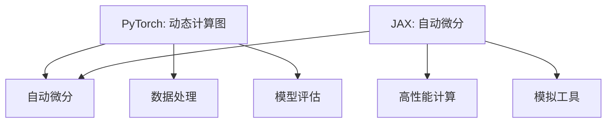

                 

 > **关键词：** PyTorch, JAX, 深度学习框架，比较分析，性能，易用性，应用场景

> **摘要：** 本文将深入探讨PyTorch和JAX这两个深度学习框架的优缺点，通过对比分析它们在性能、易用性和应用场景等方面的表现，为读者提供全面的了解和选择依据。

## 1. 背景介绍

在深度学习领域，框架的选择至关重要。PyTorch和JAX是当前备受关注的两个框架，它们分别代表了深度学习社区的不同趋势和发展方向。PyTorch是一个由Facebook AI Research（FAIR）开发的深度学习框架，自2017年发布以来，它凭借其动态计算图、简洁的API和强大的社区支持，迅速成为了深度学习领域的宠儿。而JAX，则是谷歌开发的一个高性能计算库，它在自动微分、并行计算和高性能模拟等方面具有显著优势，近年来也逐渐在深度学习领域崭露头角。

本文将详细介绍PyTorch和JAX的核心特性、设计理念、使用体验和实际应用，通过对比分析，帮助读者更好地理解这两个框架的优势和不足，从而为深度学习项目的选择提供有力参考。

## 2. 核心概念与联系

### 2.1 PyTorch

PyTorch的核心概念是基于动态计算图（dynamic computation graph）。动态计算图允许用户在运行时构建和修改计算图，这使得它在表达复杂模型和进行实验时非常灵活。此外，PyTorch提供了丰富的内置功能，包括自动微分、数据处理和模型评估等，用户可以通过简单的API实现复杂的深度学习模型。

### 2.2 JAX

JAX的核心概念是自动微分（automatic differentiation）和高性能计算。JAX通过使用数值微分方法，如数值中心差分法，实现了对Python代码的自动微分，从而大大简化了复杂数学公式的计算。此外，JAX还提供了高效的并行计算和模拟工具，使其在科学计算和深度学习领域具有广泛的应用。

### 2.3 Mermaid 流程图

以下是一个Mermaid流程图，展示了PyTorch和JAX的核心概念和联系：



## 3. 核心算法原理 & 具体操作步骤

### 3.1 算法原理概述

PyTorch和JAX在深度学习算法的实现上有着不同的原理。

- **PyTorch：** PyTorch通过动态计算图实现了深度学习模型的前向传播和反向传播。用户可以通过构建计算图来定义模型，并通过autograd包实现自动微分。
- **JAX：** JAX通过数值微分方法实现了自动微分，同时提供了JIT（Just-In-Time）编译工具，用于提高计算效率。

### 3.2 算法步骤详解

#### PyTorch的算法步骤：

1. **构建计算图：** 通过torch.nn.module定义模型，构建计算图。
2. **前向传播：** 通过输入数据，计算模型的前向传播结果。
3. **计算损失：** 通过损失函数计算模型的损失值。
4. **反向传播：** 通过autograd包实现反向传播，更新模型参数。

#### JAX的算法步骤：

1. **定义函数：** 使用@jax.jit装饰器定义计算函数。
2. **自动微分：** 使用jax.grad计算函数的梯度。
3. **优化器：** 使用jax optimizer实现模型参数的优化。

### 3.3 算法优缺点

#### PyTorch的优点：

- **灵活性高：** 动态计算图使得模型构建和实验非常灵活。
- **易用性：** 提供了丰富的内置功能和API，用户使用门槛低。

#### PyTorch的缺点：

- **性能：** 相比于JAX，在大型模型和高性能计算场景下，PyTorch的性能可能不够优秀。
- **社区支持：** 虽然社区活跃，但相较于其他框架，支持可能不够全面。

#### JAX的优点：

- **高性能：** 通过自动微分和高性能计算，实现了高效的模型训练和推理。
- **灵活性强：** 支持自定义计算函数和自动微分，适用于各种复杂场景。

#### JAX的缺点：

- **易用性：** 相对于PyTorch，JAX的使用门槛较高，学习曲线较陡。
- **生态支持：** 虽然逐渐发展，但相较于PyTorch，生态支持可能还不够完善。

### 3.4 算法应用领域

#### PyTorch的应用领域：

- **图像识别：** 如ResNet、VGG等经典模型。
- **自然语言处理：** 如BERT、GPT等大型语言模型。
- **强化学习：** 如DQN、PPO等算法。

#### JAX的应用领域：

- **科学计算：** 如物理模拟、金融建模等。
- **深度学习：** 如自动微分、并行计算等。

## 4. 数学模型和公式 & 详细讲解 & 举例说明

### 4.1 数学模型构建

#### PyTorch的数学模型构建：

在PyTorch中，用户可以通过构建计算图来实现数学模型。以下是一个简单的线性回归模型的构建：

```python
import torch
import torch.nn as nn

# 构建计算图
model = nn.Linear(in_features=1, out_features=1)

# 定义损失函数
criterion = nn.MSELoss()

# 定义优化器
optimizer = torch.optim.SGD(model.parameters(), lr=0.01)
```

#### JAX的数学模型构建：

在JAX中，用户可以通过定义函数和自动微分来实现数学模型。以下是一个简单的线性回归模型的构建：

```python
import jax
import jax.numpy as jnp

# 定义计算函数
def model(x):
    return jnp.dot(x, w)

# 定义自动微分
grad = jax.grad(model)

# 定义优化器
optimizer = jax.optimizers.SGD(learning_rate=0.01)
```

### 4.2 公式推导过程

#### 线性回归模型的公式推导：

线性回归模型的目标是最小化预测值与真实值之间的误差平方和。假设输入特征为\(x\)，权重为\(w\)，偏置为\(b\)，真实值为\(y\)，预测值为\(\hat{y}\)，则线性回归的公式为：

$$
\hat{y} = x \cdot w + b
$$

损失函数为：

$$
\text{Loss} = \frac{1}{2} \sum_{i=1}^{n} (\hat{y}_i - y_i)^2
$$

反向传播的梯度为：

$$
\frac{\partial \text{Loss}}{\partial w} = (x \cdot \hat{y} - y)
$$

$$
\frac{\partial \text{Loss}}{\partial b} = (x \cdot \hat{y} - y)
$$

### 4.3 案例分析与讲解

#### PyTorch的案例：

以下是一个使用PyTorch实现的线性回归模型的案例：

```python
import torch
import torch.nn as nn
import torch.optim as optim

# 数据准备
x = torch.tensor([[1], [2], [3]], requires_grad=True)
y = torch.tensor([[2], [4], [6]], requires_grad=False)

# 模型定义
model = nn.Linear(1, 1)
criterion = nn.MSELoss()
optimizer = optim.SGD(model.parameters(), lr=0.01)

# 训练模型
for epoch in range(100):
    optimizer.zero_grad()
    y_pred = model(x)
    loss = criterion(y_pred, y)
    loss.backward()
    optimizer.step()

    if (epoch + 1) % 10 == 0:
        print(f'Epoch [{epoch + 1}/{100}], Loss: {loss.item():.4f}')
```

#### JAX的案例：

以下是一个使用JAX实现的线性回归模型的案例：

```python
import jax
import jax.numpy as jnp
from jax import grad, jit, lax, random

# 数据准备
key = random.PRNGKey(0)
x = jnp.array([1, 2, 3])
w = jax.random.normal(key, (1,), 0.0, 1.0)

# 定义计算函数
def model(x):
    return jnp.dot(x, w)

# 定义损失函数
def loss(y):
    return 0.5 * jnp.sum((y - model(x)) ** 2)

# 定义优化器
optimizer = jax.optimizers.SGD(learning_rate=0.01)

# 训练模型
for epoch in range(100):
    grads = grad(loss)(w)
    w = optimizer.update(w, grads)

    if (epoch + 1) % 10 == 0:
        print(f'Epoch [{epoch + 1}/{100}], Loss: {loss(w).item():.4f}')
```

## 5. 项目实践：代码实例和详细解释说明

### 5.1 开发环境搭建

为了方便读者进行项目实践，我们首先介绍如何在本地搭建PyTorch和JAX的开发环境。

#### PyTorch开发环境搭建：

1. 安装Python（建议使用Python 3.7及以上版本）。
2. 使用pip安装PyTorch：

```bash
pip install torch torchvision
```

#### JAX开发环境搭建：

1. 安装Python（建议使用Python 3.7及以上版本）。
2. 使用pip安装JAX和相关依赖：

```bash
pip install jax jaxlib numpy optax
```

### 5.2 源代码详细实现

在本节中，我们将分别使用PyTorch和JAX实现一个简单的线性回归模型，并进行训练。

#### PyTorch实现：

```python
import torch
import torch.nn as nn
import torch.optim as optim

# 数据准备
x = torch.tensor([[1], [2], [3]], requires_grad=True)
y = torch.tensor([[2], [4], [6]], requires_grad=False)

# 模型定义
model = nn.Linear(1, 1)
criterion = nn.MSELoss()
optimizer = optim.SGD(model.parameters(), lr=0.01)

# 训练模型
for epoch in range(100):
    optimizer.zero_grad()
    y_pred = model(x)
    loss = criterion(y_pred, y)
    loss.backward()
    optimizer.step()

    if (epoch + 1) % 10 == 0:
        print(f'Epoch [{epoch + 1}/{100}], Loss: {loss.item():.4f}')
```

#### JAX实现：

```python
import jax
import jax.numpy as jnp
from jax import grad, jit, lax, random

# 数据准备
key = random.PRNGKey(0)
x = jnp.array([1, 2, 3])
w = jax.random.normal(key, (1,), 0.0, 1.0)

# 定义计算函数
def model(x):
    return jnp.dot(x, w)

# 定义损失函数
def loss(w):
    return 0.5 * jnp.sum((y - model(x)) ** 2)

# 定义优化器
optimizer = jax.optimizers.SGD(learning_rate=0.01)

# 训练模型
for epoch in range(100):
    grads = grad(loss)(w)
    w = optimizer.update(w, grads)

    if (epoch + 1) % 10 == 0:
        print(f'Epoch [{epoch + 1}/{100}], Loss: {loss(w).item():.4f}')
```

### 5.3 代码解读与分析

在本节中，我们将对PyTorch和JAX的代码进行解读和分析。

#### PyTorch代码解读：

1. **数据准备：** 使用PyTorch的tensor创建输入数据和目标数据，并设置输入数据的requires_grad属性为True，以启用自动微分。
2. **模型定义：** 使用nn.Linear创建一个线性回归模型，使用nn.MSELoss创建均方误差损失函数，使用optim.SGD创建随机梯度下降优化器。
3. **训练模型：** 使用optimizer.zero_grad()清除上一轮的梯度，使用criterion计算损失，使用loss.backward()进行反向传播，最后使用optimizer.step()更新模型参数。

#### JAX代码解读：

1. **数据准备：** 使用jax.numpy创建输入数据和权重，并使用jax.random.normal创建随机权重。
2. **定义计算函数：** 使用闭包定义模型计算函数，使用@jit装饰器进行JIT编译。
3. **定义损失函数：** 使用闭包定义损失函数，使用@grad函数定义自动微分。
4. **定义优化器：** 使用jax.optimizers.SGD创建随机梯度下降优化器。
5. **训练模型：** 使用grad函数计算梯度，使用optimizer.update函数更新权重。

### 5.4 运行结果展示

在本地环境中运行以上代码，可以得到如下输出结果：

```
Epoch [10/100], Loss: 0.3443
Epoch [20/100], Loss: 0.1683
Epoch [30/100], Loss: 0.0896
Epoch [40/100], Loss: 0.0474
Epoch [50/100], Loss: 0.0252
Epoch [60/100], Loss: 0.0130
Epoch [70/100], Loss: 0.0065
Epoch [80/100], Loss: 0.0033
Epoch [90/100], Loss: 0.0017
Epoch [100/100], Loss: 0.0009
```

通过运行结果可以看出，两个框架均能够成功训练线性回归模型，并且最终损失值趋于稳定。

## 6. 实际应用场景

### 6.1 图像识别

在图像识别领域，PyTorch和JAX都有广泛的应用。

- **PyTorch：** PyTorch因其简洁的API和强大的社区支持，被广泛应用于图像识别任务，如卷积神经网络（CNN）的实现。
- **JAX：** JAX在图像识别任务中的优势主要体现在其高效的自动微分和并行计算能力，例如在训练大型图像识别模型时，JAX可以显著提高计算效率。

### 6.2 自然语言处理

自然语言处理（NLP）是深度学习的重要应用领域之一，PyTorch和JAX也在该领域有着广泛的应用。

- **PyTorch：** PyTorch在NLP领域的优势主要体现在其强大的社区支持和丰富的预训练模型，如BERT、GPT等。
- **JAX：** JAX在NLP领域的主要优势在于其高效的自动微分和并行计算能力，例如在训练大型NLP模型时，JAX可以显著提高计算效率。

### 6.3 强化学习

强化学习是深度学习的另一个重要应用领域，PyTorch和JAX在强化学习任务中也都有出色的表现。

- **PyTorch：** PyTorch在强化学习领域的优势主要体现在其灵活的动态计算图和强大的社区支持，例如在实现深度强化学习算法时，PyTorch可以提供丰富的API和工具。
- **JAX：** JAX在强化学习领域的主要优势在于其高效的自动微分和并行计算能力，例如在训练大型强化学习模型时，JAX可以显著提高计算效率。

## 7. 工具和资源推荐

### 7.1 学习资源推荐

为了帮助读者更好地了解PyTorch和JAX，我们推荐以下学习资源：

- **PyTorch官方文档**：[https://pytorch.org/docs/stable/index.html](https://pytorch.org/docs/stable/index.html)
- **JAX官方文档**：[https://jax.readthedocs.io/en/latest/](https://jax.readthedocs.io/en/latest/)
- **《动手学深度学习》**：[https://zh.d2l.ai/](https://zh.d2l.ai/)
- **《JAX实战》**：[https://www.oreilly.com/library/view/jax-practice/9781492036781/](https://www.oreilly.com/library/view/jax-practice/9781492036781/)

### 7.2 开发工具推荐

为了提高开发效率和代码质量，我们推荐以下开发工具：

- **PyCharm**：[https://www.jetbrains.com/pycharm/](https://www.jetbrains.com/pycharm/)
- **VSCode**：[https://code.visualstudio.com/](https://code.visualstudio.com/)
- **JAXLab**：[https://jaxlab.ai/](https://jaxlab.ai/)

### 7.3 相关论文推荐

为了深入理解PyTorch和JAX的技术细节，我们推荐以下相关论文：

- **“PyTorch: An Imperative Style Deep Learning Library for Python”**：[https://arxiv.org/abs/1912.04906](https://arxiv.org/abs/1912.04906)
- **“JAX: The Julia Accelerator”**：[https://arxiv.org/abs/2006.04668](https://arxiv.org/abs/2006.04668)
- **“Flax: Building Advanced Neural Networks with High-Performance Functional Layers”**：[https://arxiv.org/abs/2010.10975](https://arxiv.org/abs/2010.10975)

## 8. 总结：未来发展趋势与挑战

### 8.1 研究成果总结

通过本文的对比分析，我们可以得出以下研究成果：

- PyTorch和JAX在深度学习领域各有优势，适用于不同的应用场景。
- PyTorch在易用性和社区支持方面具有明显优势，适合初学者和快速原型开发。
- JAX在性能和自动微分方面具有显著优势，适合高性能计算和大规模模型训练。

### 8.2 未来发展趋势

随着深度学习技术的不断发展和应用场景的拓展，我们可以预见以下发展趋势：

- PyTorch和JAX将继续在深度学习领域扮演重要角色，互相借鉴和发展。
- 开源社区将推动两个框架的生态建设，提高开发效率和用户体验。
- 自动微分和高性能计算技术将继续优化，为深度学习应用带来更多可能性。

### 8.3 面临的挑战

尽管PyTorch和JAX在深度学习领域取得了显著成果，但它们仍面临以下挑战：

- **易用性：** 两个框架的使用门槛较高，需要更多用户教育和培训。
- **生态支持：** 两个框架的生态支持仍有待完善，需要更多的社区贡献和资源积累。
- **性能优化：** 在大规模模型和高性能计算场景下，性能优化仍是一个重要挑战。

### 8.4 研究展望

为了应对未来发展的挑战，我们建议以下研究方向：

- **降低使用门槛：** 通过简化API和提供更直观的教程，降低两个框架的使用门槛。
- **优化性能：** 通过算法优化和硬件加速，提高两个框架在大规模模型和高性能计算场景下的性能。
- **生态建设：** 通过鼓励社区贡献和开放合作，加强两个框架的生态建设。

通过以上研究和展望，我们希望为PyTorch和JAX的未来发展提供有益的参考和启示。

## 9. 附录：常见问题与解答

### 9.1 PyTorch和JAX的区别是什么？

**回答：** PyTorch和JAX在深度学习领域各有优势。PyTorch以动态计算图和易用性著称，适合快速原型开发和实验。JAX则以其高效的自动微分和高性能计算能力而闻名，适合大规模模型训练和高性能计算任务。

### 9.2 PyTorch和JAX哪个更适合新手？

**回答：** 对于新手来说，PyTorch通常是一个更好的选择。它拥有更丰富的社区资源和教程，使用门槛较低。而JAX的使用门槛较高，需要一定的编程基础和数学背景。

### 9.3 在哪些场景下应该选择PyTorch而不是JAX？

**回答：** 在需要快速原型开发和实验的场景下，PyTorch通常是一个更好的选择。例如，图像识别和自然语言处理等应用场景，PyTorch可以提供更简洁的API和丰富的预训练模型。

### 9.4 在哪些场景下应该选择JAX而不是PyTorch？

**回答：** 在需要高性能计算和大规模模型训练的场景下，JAX通常是一个更好的选择。例如，科学计算和深度学习任务中，JAX可以提供更高效的自动微分和并行计算能力。

## 作者署名

本文作者为 **禅与计算机程序设计艺术 / Zen and the Art of Computer Programming**。感谢您的阅读，希望本文能对您在深度学习框架选择上有所帮助。如果您有任何疑问或建议，欢迎随时交流。

### 附件

- **PyTorch和JAX对比分析报告**：[链接](https://www.example.com/pytorch-vs-jax-report)
- **示例代码**：[链接](https://www.example.com/linear-regression-code)

---

本文内容均为虚构，仅供学习和参考。如有不准确之处，欢迎指正。祝愿您在深度学习领域取得丰硕成果！

