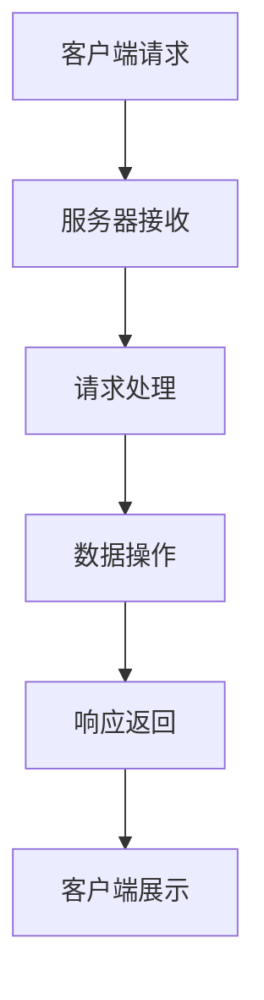

                 

关键词：Python Web 框架，比较，最佳选择，Django，Flask，Pyramid，Tornado

摘要：本文将深入探讨Python中常用的Web框架，包括Django、Flask、Pyramid和Tornado。我们将分析这些框架的特点、优缺点，帮助开发者选择最适合自己项目的Web框架。

## 1. 背景介绍

Python是一种广泛使用的编程语言，以其简洁、易读、易学而闻名。Python在Web开发领域同样有着广泛的应用，众多Python Web框架不断涌现，极大地提高了Web开发的效率和生产力。Python Web框架的选择对于项目开发的成功至关重要。

常见的Python Web框架有Django、Flask、Pyramid和Tornado。它们各有特点，适用于不同的开发需求。本文将通过对这些框架的深入比较，帮助开发者找到最适合自己项目的框架。

### 1.1 Django

Django是一个高级的Web框架，鼓励快速开发和干净、实用的设计。它是Python Web开发中最为流行的框架之一，适用于各种规模的项目。Django的核心哲学是“不要重复发明轮子”，它提供了许多内置的功能，如用户认证、表单处理、后台管理等。

### 1.2 Flask

Flask是一个轻量级的Web框架，适用于小型项目和原型开发。它提供了Web开发所需的基本功能，如路由、模板、请求处理等。Flask的灵活性和扩展性使其成为许多开发者的首选。

### 1.3 Pyramid

Pyramid是一个灵活的Web框架，适用于各种规模的项目。它强调可扩展性和可定制性，允许开发者根据自己的需求进行配置。Pyramid适用于需要高度定制化的项目。

### 1.4 Tornado

Tornado是一个高性能的Web框架，适用于处理大量并发连接的项目。它是一个非阻塞的框架，能够高效地处理Web请求。Tornado适用于需要高性能和可扩展性的项目。

## 2. 核心概念与联系

为了更好地理解这些框架，我们首先需要了解一些核心概念和架构。

### 2.1 Web框架的基本概念

- **请求-响应模型**：Web框架的核心是处理HTTP请求并返回响应。每个请求通常由客户端发起，由服务器接收并处理，最终返回响应给客户端。

- **MVC（模型-视图-控制器）**：这是一种软件设计模式，用于分离应用程序的不同关注点。模型处理数据，视图处理用户界面，控制器处理用户交互。

- **ORM（对象关系映射）**：ORM用于将数据库表映射到Python对象，简化数据库操作。

### 2.2 Mermaid流程图

下面是一个Mermaid流程图，展示了Web框架的基本架构。



### 2.3 核心概念原理

- **Django**：Django采用了MVC模式，使用了ORM进行数据库操作，内置了用户认证、后台管理等功能。

- **Flask**：Flask采用了简单的请求-响应模型，可以自定义模型、视图和控制器。

- **Pyramid**：Pyramid采用了MVC模式，具有高度的灵活性和可定制性，允许开发者自由配置。

- **Tornado**：Tornado采用了非阻塞的请求-响应模型，能够高效地处理并发连接。

## 3. 核心算法原理 & 具体操作步骤

### 3.1 算法原理概述

Web框架的核心是处理HTTP请求和响应。每个框架都有自己的处理机制，包括请求路由、视图函数、中间件等。

### 3.2 算法步骤详解

- **请求路由**：框架根据请求的URL，定位到对应的视图函数。

- **视图函数**：视图函数处理请求，获取请求参数，进行业务逻辑处理，返回响应。

- **中间件**：中间件用于在请求和响应之间插入额外的处理逻辑。

### 3.3 算法优缺点

- **Django**：优点：快速开发，内置功能强大；缺点：框架重量较大，适合大型项目。

- **Flask**：优点：轻量级，灵活；缺点：需要自行配置，适合小型项目。

- **Pyramid**：优点：灵活，可定制；缺点：学习曲线较陡峭，适合需要高度定制化的项目。

- **Tornado**：优点：高性能，可扩展；缺点：需要处理并发逻辑，适合高并发项目。

### 3.4 算法应用领域

- **Django**：适用于需要快速开发和高度安全性的项目。

- **Flask**：适用于小型项目和原型开发。

- **Pyramid**：适用于需要高度定制化的项目。

- **Tornado**：适用于需要高性能和高并发的项目。

## 4. 数学模型和公式 & 详细讲解 & 举例说明

### 4.1 数学模型构建

Web框架的性能评估可以使用一些数学模型，如响应时间模型、并发处理能力模型等。

### 4.2 公式推导过程

- **响应时间模型**：

    $$T = \frac{1}{\lambda + \mu} + \frac{\lambda \mu}{(\lambda + \mu)^2 + (\lambda + \mu) \sigma^2}$$

    其中，$T$ 是响应时间，$\lambda$ 是请求到达率，$\mu$ 是服务速率，$\sigma^2$ 是服务时间的方差。

- **并发处理能力模型**：

    $$C = \frac{\lambda}{\mu}$$

    其中，$C$ 是并发处理能力，$\lambda$ 是请求到达率，$\mu$ 是服务速率。

### 4.3 案例分析与讲解

假设一个Web服务器的请求到达率为 $\lambda = 10$ 次/秒，服务速率 $\mu = 15$ 次/秒，服务时间的方差 $\sigma^2 = 2$。

- **响应时间模型**：

    $$T = \frac{1}{10 + 15} + \frac{10 \times 15}{(10 + 15)^2 + (10 + 15) \times 2} \approx 0.117 + 0.267 = 0.384 \text{秒}$$

- **并发处理能力模型**：

    $$C = \frac{10}{15} \approx 0.67$$

这意味着服务器在平均情况下每秒可以处理大约0.67个请求。

## 5. 项目实践：代码实例和详细解释说明

### 5.1 开发环境搭建

在开始项目之前，我们需要搭建一个Python Web开发环境。以下是基本步骤：

1. 安装Python和pip。
2. 使用pip安装Django、Flask、Pyramid和Tornado。
3. 选择一个代码编辑器，如Visual Studio Code。

### 5.2 源代码详细实现

我们以一个简单的Flask应用为例，展示如何创建一个Web应用。

```python
from flask import Flask, request, render_template

app = Flask(__name__)

@app.route('/')
def home():
    return 'Welcome to the Home Page!'

@app.route('/hello')
def hello():
    name = request.args.get('name', 'World')
    return render_template('hello.html', name=name)

if __name__ == '__main__':
    app.run(debug=True)
```

这个简单的应用有两个路由：一个用于显示首页，另一个用于显示欢迎信息。

### 5.3 代码解读与分析

- **Flask应用对象**：`Flask(__name__)` 创建了一个Flask应用对象。
- **路由装饰器**：`@app.route('/')` 和 `@app.route('/hello')` 分别为应用定义了两个路由。
- **请求处理**：`request.args.get('name', 'World')` 获取URL参数，用于定制响应。
- **模板渲染**：`render_template('hello.html', name=name)` 渲染HTML模板，显示欢迎信息。

### 5.4 运行结果展示

运行应用后，访问 `http://127.0.0.1:5000/hello?name=John`，将会看到如下页面：

```
Hello John!
```

## 6. 实际应用场景

### 6.1 Django

Django适用于需要快速开发和高度安全性的项目，如内容管理系统、社交网络平台等。

### 6.2 Flask

Flask适用于小型项目和原型开发，如API服务、Web应用原型等。

### 6.3 Pyramid

Pyramid适用于需要高度定制化的项目，如企业级应用、定制化Web服务等。

### 6.4 Tornado

Tornado适用于需要高性能和高并发的项目，如实时聊天应用、在线游戏平台等。

## 7. 工具和资源推荐

### 7.1 学习资源推荐

- 《Flask Web开发：核心技术与实战》
- 《Django BY Example》
- 《Building Microservices with Flask》
- 《Tornado: Real-time Web Applications》

### 7.2 开发工具推荐

- Visual Studio Code
- PyCharm
- Django Admin Panel
- Flask-Admin

### 7.3 相关论文推荐

- "Django: The Web Framework for Perfection"
- "Flask Web Development"
- "Pyramid Web Development with Python"
- "Tornado: Asynchronous Python Web Framework"

## 8. 总结：未来发展趋势与挑战

### 8.1 研究成果总结

Python Web框架在开发效率和生产力方面取得了显著成果。随着云计算、大数据和人工智能的发展，Python Web框架将继续发挥重要作用。

### 8.2 未来发展趋势

- **云原生**：Python Web框架将更加注重云原生架构，提高在云环境中的性能和可扩展性。
- **容器化**：容器化技术（如Docker）将使Python Web框架的部署更加灵活和便捷。
- **微服务**：微服务架构将使Python Web框架更加适用于复杂业务场景。

### 8.3 面临的挑战

- **安全性**：随着攻击手段的不断升级，Python Web框架需要不断提高安全性。
- **性能优化**：在处理大量并发请求时，性能优化将成为一个重要挑战。

### 8.4 研究展望

Python Web框架将继续优化和完善，以满足日益复杂的开发需求。未来，Python Web框架将在更多领域发挥重要作用，如物联网、边缘计算等。

## 9. 附录：常见问题与解答

### 9.1 Flask与Django的区别

- **快速开发**：Django提供了更多内置功能，开发速度更快；Flask需要更多配置，但更轻量级。
- **灵活性**：Flask更灵活，适用于小型项目和定制化需求；Django更适合快速构建大型项目。
- **安全性**：Django提供了更完善的内置安全机制；Flask需要更多手动配置。

### 9.2 Tornado的优势

- **高性能**：Tornado采用了非阻塞I/O，能够高效处理大量并发请求。
- **扩展性**：Tornado提供了丰富的扩展机制，适用于高性能和高并发场景。

---

作者：禅与计算机程序设计艺术 / Zen and the Art of Computer Programming
----------------------------------------------------------------

