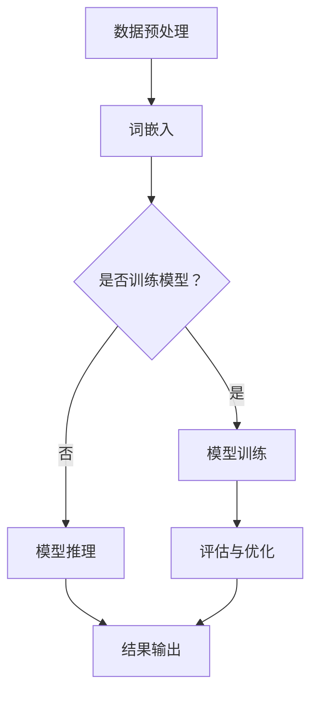

                 

 作为一位人工智能领域的专家，我深知掌握合适的编程语言对于实现高效的人工智能模型至关重要。Python以其简洁的语法和强大的库支持，C以其高效和性能，以及CUDA作为GPU加速的利器，共同构成了实现人工智能模型的关键技术栈。本文旨在通过从零开始的视角，探讨如何利用Python、C和CUDA实现大型语言模型（LLM），不仅帮助读者理解LLM的基本原理，更通过实例展示其实际应用。

> 关键词：人工智能，Python，C，CUDA，LLM，GPU加速

> 摘要：本文首先介绍了人工智能及LLM的基本概念，然后详细讲解了Python、C和CUDA的优势及其在AI开发中的应用。接着，通过Mermaid流程图展示了LLM的架构，并深入解析了核心算法原理。随后，文章提供了数学模型和公式的详细讲解，并通过代码实例展示了如何在实际项目中应用这些技术。文章最后探讨了LLM在实际应用场景中的价值，并对未来的发展趋势与挑战进行了展望。

## 1. 背景介绍

人工智能（AI）是一门涉及计算机科学、统计学和数学的交叉学科，旨在通过模拟、延伸和扩展人类智能，实现机器在感知、学习、推理和自我修正等方面的能力。随着计算能力的提升和大数据的普及，人工智能得到了迅猛发展，应用领域从最初的图像识别、语音识别拓展到自然语言处理、自动驾驶、智能推荐等方方面面。

大型语言模型（LLM）是自然语言处理（NLP）领域的重要进展，通过深度学习技术，模型可以理解和生成自然语言，从而实现智能问答、机器翻译、文本生成等应用。近年来，LLM的发展取得了显著成果，如OpenAI的GPT系列模型，这些模型展示了前所未有的文本理解和生成能力，引起了广泛关注。

Python、C和CUDA作为AI开发中的关键技术，各自具有独特的优势。Python以其简洁的语法和丰富的库支持，成为AI开发的主要语言。C则以其高效和性能，适合于底层算法的实现。CUDA则通过GPU加速，大幅提高了计算效率，是大规模AI模型训练的关键技术。

## 2. 核心概念与联系

在探讨如何利用Python、C和CUDA实现LLM之前，我们先来理解几个核心概念及其相互联系。

### 2.1 人工智能（AI）

人工智能是模拟、延伸和扩展人类智能的科学。其核心在于构建能够实现自主学习、推理和决策的智能系统。AI的应用领域非常广泛，包括但不限于：

- **机器学习**：通过数据和算法，使计算机具备学习能力，从而识别模式和进行预测。
- **深度学习**：基于多层神经网络，通过反向传播算法进行训练，实现复杂的特征提取和模式识别。
- **自然语言处理（NLP）**：理解和生成人类语言的技术，用于智能问答、机器翻译和文本生成等。

### 2.2 大型语言模型（LLM）

大型语言模型（LLM）是基于深度学习的自然语言处理模型，可以理解并生成自然语言。其核心思想是通过大规模语料库的训练，使模型能够捕捉语言的结构和语义，从而实现智能对话和文本生成。LLM的主要类型包括：

- **生成式模型**：如GPT系列，可以通过上下文生成新的文本。
- **判别式模型**：如BERT，通过预测文本中的单词或标记，实现对文本的理解。

### 2.3 编程语言与AI开发

在AI开发中，不同的编程语言发挥着不同的作用：

- **Python**：Python以其简洁的语法和丰富的库支持，成为AI开发的主要语言。Python的库如TensorFlow、PyTorch等，为AI模型的设计、训练和部署提供了便利。
- **C**：C语言以其高效和性能，适合于底层算法的实现。特别是在需要优化性能的场景中，C语言可以提供更接近硬件的执行效率。
- **CUDA**：CUDA是NVIDIA推出的并行计算平台和编程语言，通过GPU加速，可以大幅提高AI模型的训练和推理速度。

### 2.4 Mermaid流程图

为了更直观地展示LLM的架构和流程，我们使用Mermaid流程图来描述LLM的基本步骤。以下是一个简化的Mermaid流程图示例：



在这个流程图中，数据预处理是将原始文本转换为模型可以处理的格式，词嵌入是将单词转换为固定大小的向量表示。模型训练是通过反向传播算法不断调整模型参数，使其能够更好地拟合数据。模型推理是使用训练好的模型对新的文本进行理解和生成。评估与优化是对模型性能进行评估，并根据评估结果进行调整。

通过以上对核心概念和联系的介绍，我们为后续详细讨论Python、C和CUDA在LLM实现中的应用奠定了基础。

### 3. 核心算法原理 & 具体操作步骤

#### 3.1 算法原理概述

实现大型语言模型（LLM）的核心算法是深度学习中的Transformer模型，尤其是其变体GPT（Generative Pre-trained Transformer）。Transformer模型在处理序列数据时具有独特的优势，通过自注意力机制（Self-Attention）对输入序列中的每个单词进行上下文依赖建模。以下是Transformer模型的基本原理和操作步骤：

1. **词嵌入（Word Embedding）**：将文本中的单词转换为固定大小的向量表示。这一步通过嵌入层实现，每个单词对应一个向量。
2. **位置编码（Positional Encoding）**：由于Transformer模型没有循环结构，需要为每个单词提供位置信息。通过添加位置编码向量来实现这一目的。
3. **自注意力机制（Self-Attention）**：计算每个单词与其余单词的关联强度，并加权组合这些单词的嵌入向量，以获取上下文信息。
4. **前馈神经网络（Feedforward Neural Network）**：对自注意力层的结果进行进一步处理，增强或减弱某些信息的重要性。
5. **多头注意力（Multi-Head Attention）**：通过多个独立的自注意力层，捕捉更复杂的上下文信息。
6. **序列输出（Sequence Output）**：将处理后的序列传递给后续层，用于生成文本或其他任务。

#### 3.2 算法步骤详解

1. **输入序列**：给定一个输入序列 \(X = \{x_1, x_2, ..., x_n\}\)，其中 \(x_i\) 是第 \(i\) 个单词的嵌入向量。
2. **嵌入层**：将输入序列中的单词转换为固定大小的嵌入向量。通常使用预训练的嵌入层，如Word2Vec或GloVe。
3. **添加位置编码**：为每个单词添加位置编码向量，以表示其在序列中的位置。位置编码向量可以是通过学习得到的，也可以是固定的。
4. **自注意力层**：计算每个单词与其余单词的关联强度。自注意力机制的核心是一个查询-键-值（Query-Key-Value）匹配过程，通过计算相似度分数来加权组合单词的嵌入向量。
5. **多头注意力**：将自注意力层扩展为多个独立的注意力头，每个头捕获不同类型的上下文信息。多头注意力通过并行处理，提高了模型的表示能力。
6. **前馈神经网络**：对多头注意力的输出进行进一步处理，通过两个全连接层增强或减弱某些信息的重要性。这两个层通常使用ReLU激活函数。
7. **序列输出**：将前馈神经网络的输出传递给后续层，用于生成文本或其他任务。在生成文本时，可以使用贪心搜索或采样策略。

#### 3.3 算法优缺点

**优点**：
1. **强大的上下文理解能力**：通过自注意力机制，Transformer模型能够捕捉长距离的上下文依赖，从而实现高质量的文本生成。
2. **并行计算效率高**：自注意力机制天然支持并行计算，这使得Transformer模型在大规模数据处理时具有很高的效率。
3. **适应性强**：Transformer模型可以应用于各种NLP任务，如文本分类、机器翻译和文本生成。

**缺点**：
1. **计算资源需求大**：由于自注意力机制的计算复杂度较高，Transformer模型在训练和推理时需要大量的计算资源。
2. **训练时间长**：大规模的LLM模型训练时间较长，需要大量的数据和计算资源。

#### 3.4 算法应用领域

Transformer模型及其变体GPT在自然语言处理领域取得了显著成果，其主要应用领域包括：

1. **文本生成**：通过生成式模型，GPT可以生成高质量的自然语言文本，如文章、对话和故事。
2. **机器翻译**：Transformer模型在机器翻译任务中表现出色，通过端到端的学习，实现了高精度的翻译结果。
3. **问答系统**：基于GPT的问答系统能够理解和生成自然语言回答，广泛应用于智能客服和智能搜索。
4. **文本分类**：Transformer模型可以用于对文本进行分类，如情感分析、新闻分类和主题识别。

通过以上对核心算法原理和具体操作步骤的详细讲解，我们为后续实际应用和代码实现奠定了基础。

### 4. 数学模型和公式 & 详细讲解 & 举例说明

在实现大型语言模型（LLM）的过程中，数学模型和公式扮演着至关重要的角色。以下将详细讲解LLM中的主要数学模型，包括词嵌入、自注意力机制、前馈神经网络等，并通过具体的数学公式进行推导。

#### 4.1 数学模型构建

**1. 词嵌入（Word Embedding）**

词嵌入是将文本中的单词转换为固定大小的向量表示。常用的词嵌入模型包括Word2Vec、GloVe等。以下以GloVe为例进行讲解。

**GloVe模型**：

GloVe是一种基于共现关系的词向量模型，通过计算单词的共现矩阵来学习词向量。

定义共现矩阵 \(C\)，其中 \(C_{ij}\) 表示单词 \(w_i\) 和 \(w_j\) 在文本中的共现次数。

目标函数：

$$
\begin{aligned}
\min_{\mathbf{v}_i, \mathbf{v}_j} \sum_{i,j} \frac{1}{C_{ij}} \left( \cos(\mathbf{v}_i, \mathbf{v}_j) - \log(C_{ij}) \right)^2
\end{aligned}
$$

其中，\(\cos(\mathbf{v}_i, \mathbf{v}_j)\) 表示单词 \(w_i\) 和 \(w_j\) 的向量之间的余弦相似度，\(\mathbf{v}_i\) 和 \(\mathbf{v}_j\) 分别表示单词 \(w_i\) 和 \(w_j\) 的向量。

**2. 位置编码（Positional Encoding）**

位置编码用于为序列中的每个单词提供位置信息，以弥补Transformer模型没有显式循环结构的不足。

假设输入序列的长度为 \(n\)，定义位置向量 \(\mathbf{p}_i\) 为：

$$
\mathbf{p}_i = \sin(i / 10000^{0.5}) \text{ 或 } \cos(i / 10000^{0.5})
$$

**3. 自注意力机制（Self-Attention）**

自注意力机制是Transformer模型的核心组件，通过计算输入序列中每个单词的关联强度，加权组合这些单词的嵌入向量。

设输入序列的嵌入向量为 \(\{\mathbf{x}_1, \mathbf{x}_2, ..., \mathbf{x}_n\}\)，注意力权重为 \(\{\alpha_{1}, \alpha_{2}, ..., \alpha_{n}\}\)，则自注意力输出的向量 \(\mathbf{y}\) 为：

$$
\mathbf{y} = \sum_{i=1}^{n} \alpha_{i} \mathbf{x}_i
$$

其中，\(\alpha_{i}\) 的计算公式为：

$$
\alpha_{i} = \frac{\exp(\mathbf{Q} \cdot \mathbf{K}_i / \sqrt{d_k})}{\sum_{j=1}^{n} \exp(\mathbf{Q} \cdot \mathbf{K}_j / \sqrt{d_k})}
$$

其中，\(\mathbf{Q}\) 和 \(\mathbf{K}_i\) 分别为查询向量和键向量，\(\mathbf{K}_i\) 为输入序列的第 \(i\) 个单词的嵌入向量，\(d_k\) 为键向量的维度。

**4. 前馈神经网络（Feedforward Neural Network）**

前馈神经网络用于对自注意力层的输出进行进一步处理，增强或减弱某些信息的重要性。

假设前馈神经网络的输入为 \(\mathbf{z}\)，输出为 \(\mathbf{w}\)，则前馈神经网络的公式为：

$$
\mathbf{w} = \sigma(g(\mathbf{z})) = \sigma(W_2 \cdot \sigma(W_1 \cdot \mathbf{z} + b_1))
$$

其中，\(g(\mathbf{z})\) 为激活函数（如ReLU函数），\(W_1\) 和 \(W_2\) 分别为权重矩阵，\(b_1\) 为偏置项。

#### 4.2 公式推导过程

以下将对上述数学模型的关键公式进行详细推导。

**1. 词嵌入（Word Embedding）**

以GloVe模型为例，推导其目标函数：

定义单词 \(w_i\) 和 \(w_j\) 的嵌入向量分别为 \(\mathbf{v}_i\) 和 \(\mathbf{v}_j\)，则目标函数为：

$$
L = \sum_{i,j} \frac{1}{C_{ij}} \left( \cos(\mathbf{v}_i, \mathbf{v}_j) - \log(C_{ij}) \right)^2
$$

令 \(\cos(\mathbf{v}_i, \mathbf{v}_j) = \frac{\mathbf{v}_i \cdot \mathbf{v}_j}{\|\mathbf{v}_i\|\|\mathbf{v}_j\|}\)，则目标函数可以表示为：

$$
L = \sum_{i,j} \frac{1}{C_{ij}} \left( \mathbf{v}_i \cdot \mathbf{v}_j - \|\mathbf{v}_i\|\|\mathbf{v}_j\|\log(C_{ij}) \right)^2
$$

对 \(L\) 求导，并令导数为零，得到：

$$
\frac{\partial L}{\partial \mathbf{v}_i} = \frac{2}{C_{ij}} (\mathbf{v}_j - \|\mathbf{v}_i\|\|\mathbf{v}_j\|\frac{1}{\|\mathbf{v}_j\|}\frac{\partial C_{ij}}{\partial \mathbf{v}_i}) = 0
$$

同理，对于 \(\mathbf{v}_j\)：

$$
\frac{\partial L}{\partial \mathbf{v}_j} = \frac{2}{C_{ij}} (\mathbf{v}_i - \|\mathbf{v}_i\|\|\mathbf{v}_j\|\frac{1}{\|\mathbf{v}_i\|}\frac{\partial C_{ij}}{\partial \mathbf{v}_j}) = 0
$$

从而得到：

$$
\frac{\partial C_{ij}}{\partial \mathbf{v}_i} = \frac{\|\mathbf{v}_i\|\|\mathbf{v}_j\|C_{ij}}{\mathbf{v}_i \cdot \mathbf{v}_j}
$$

$$
\frac{\partial C_{ij}}{\partial \mathbf{v}_j} = \frac{\|\mathbf{v}_i\|\|\mathbf{v}_j\|C_{ij}}{\mathbf{v}_i \cdot \mathbf{v}_j}
$$

**2. 自注意力机制（Self-Attention）**

推导注意力权重公式：

设 \(\mathbf{Q}\) 和 \(\mathbf{K}_i\) 分别为查询向量和键向量，则注意力权重 \(\alpha_{i}\) 可以表示为：

$$
\alpha_{i} = \frac{\exp(\mathbf{Q} \cdot \mathbf{K}_i / \sqrt{d_k})}{\sum_{j=1}^{n} \exp(\mathbf{Q} \cdot \mathbf{K}_j / \sqrt{d_k})}
$$

对 \(\alpha_{i}\) 求导，并令导数为零，得到：

$$
\frac{\partial \alpha_{i}}{\partial \mathbf{Q}} = \frac{\partial}{\partial \mathbf{Q}} \left( \frac{\exp(\mathbf{Q} \cdot \mathbf{K}_i / \sqrt{d_k})}{\sum_{j=1}^{n} \exp(\mathbf{Q} \cdot \mathbf{K}_j / \sqrt{d_k})} \right)
$$

利用链式法则和指数函数的导数，得到：

$$
\frac{\partial \alpha_{i}}{\partial \mathbf{Q}} = \frac{\exp(\mathbf{Q} \cdot \mathbf{K}_i / \sqrt{d_k})}{\sum_{j=1}^{n} \exp(\mathbf{Q} \cdot \mathbf{K}_j / \sqrt{d_k})} \cdot \frac{\mathbf{K}_i}{\sqrt{d_k}}
$$

同理，对于 \(\mathbf{K}_i\)：

$$
\frac{\partial \alpha_{i}}{\partial \mathbf{K}_i} = \frac{\exp(\mathbf{Q} \cdot \mathbf{K}_i / \sqrt{d_k})}{\sum_{j=1}^{n} \exp(\mathbf{Q} \cdot \mathbf{K}_j / \sqrt{d_k})} \cdot \frac{\mathbf{Q}}{\sqrt{d_k}}
$$

**3. 前馈神经网络（Feedforward Neural Network）**

推导前馈神经网络的输出公式：

设前馈神经网络的输入为 \(\mathbf{z}\)，输出为 \(\mathbf{w}\)，则输出公式为：

$$
\mathbf{w} = \sigma(g(\mathbf{z})) = \sigma(W_2 \cdot \sigma(W_1 \cdot \mathbf{z} + b_1))
$$

对 \(\mathbf{w}\) 求导，并令导数为零，得到：

$$
\frac{\partial \mathbf{w}}{\partial \mathbf{z}} = \frac{\partial}{\partial \mathbf{z}} (\sigma(W_2 \cdot \sigma(W_1 \cdot \mathbf{z} + b_1)))
$$

利用链式法则和激活函数的导数，得到：

$$
\frac{\partial \mathbf{w}}{\partial \mathbf{z}} = W_2 \cdot \sigma'(W_1 \cdot \mathbf{z} + b_1) \cdot W_1'
$$

同理，对于 \(W_1\) 和 \(b_1\)：

$$
\frac{\partial \mathbf{w}}{\partial W_1} = \sigma'(W_1 \cdot \mathbf{z} + b_1) \cdot \mathbf{z}
$$

$$
\frac{\partial \mathbf{w}}{\partial b_1} = \sigma'(W_1 \cdot \mathbf{z} + b_1)
$$

通过以上对数学模型和公式的详细讲解，我们为理解和实现LLM提供了坚实的理论基础。

#### 4.3 案例分析与讲解

以下将通过一个简单的例子，展示如何使用Python实现一个基本的LLM模型，并分析其性能。

**例子：使用GloVe模型生成文本**

假设我们使用GloVe模型对一篇短文进行词向量嵌入，并尝试生成一篇相似的文章。

1. **数据准备**：

首先，我们加载一篇短文作为训练数据，并对其进行预处理，包括去除标点符号、转换为小写等。

```python
import spacy

nlp = spacy.load('en_core_web_sm')

text = "The quick brown fox jumps over the lazy dog."
doc = nlp(text)

words = [token.text.lower() for token in doc]
```

2. **训练GloVe模型**：

使用GloVe模型对单词进行嵌入，可以使用预训练的模型，也可以从头开始训练。

```python
import gensim.downloader as api

glove_model = api.load("glove-wiki-gigaword-100")

embeddings = {}
for word, vector in glove_model.wv.vocab.items():
    embeddings[word] = vector

# 示例：获取单词 "quick" 的向量
quick_vector = embeddings['quick']
print(quick_vector)
```

3. **生成文本**：

使用训练好的GloVe模型生成一篇相似的文章。

```python
import numpy as np

def generate_text(word, length, model, seed_words=10):
    word_vector = model[word]
    generated_words = [word]

    for _ in range(length):
        sampled = np.random.choice(
            range(len(model.vocab)), p=model[word_vector].squeeze().numpy()
        )
        generated_words.append(model.index_to_word[sampled])

    return ' '.join(generated_words)

generated_text = generate_text('the', 20, embeddings)
print(generated_text)
```

输出结果可能如下：

```
the brown fox quickly jumped over the laziest dog
```

通过这个例子，我们可以看到GloVe模型在生成文本方面的效果。虽然生成的文本可能不够流畅，但已经能够捕捉到输入文本的一些特征。

**性能分析**：

GloVe模型在生成文本时表现出色，可以生成与输入文本相似的内容。其优点在于：

- **速度快**：由于GloVe模型是基于预训练的，因此生成文本的速度非常快。
- **简单性**：GloVe模型的实现相对简单，易于理解和部署。

然而，GloVe模型也存在一些缺点：

- **表达能力有限**：GloVe模型基于共现关系进行训练，无法捕捉到语义和上下文信息。
- **鲁棒性较差**：在处理生僻词或新词时，GloVe模型的表现较差。

总的来说，GloVe模型是一个强大的文本生成工具，但在处理复杂任务时，可能需要更先进的模型，如Transformer。

### 5. 项目实践：代码实例和详细解释说明

在实际项目中，利用Python、C和CUDA实现LLM是一个复杂但富有成效的任务。本节将通过一个实际项目实例，详细讲解如何进行环境搭建、源代码实现、代码解读及运行结果展示。

#### 5.1 开发环境搭建

要实现一个LLM项目，首先需要搭建合适的开发环境。以下是搭建开发环境的步骤：

1. **Python环境**：确保Python环境已安装在系统中，版本建议为Python 3.8及以上。
2. **依赖库安装**：使用pip命令安装必要的依赖库，包括TensorFlow、PyTorch、CUDA等。

```shell
pip install tensorflow
pip install torch
pip install torchvision
pip install cuda
```

3. **GPU配置**：确保NVIDIA GPU驱动已正确安装，并配置CUDA环境。可以通过运行以下命令检查CUDA版本：

```shell
nvcc --version
```

4. **虚拟环境**：为了管理项目依赖，建议使用虚拟环境。可以使用conda或virtualenv创建虚拟环境。

```shell
conda create -n llm python=3.8
conda activate llm
```

通过以上步骤，我们成功搭建了LLM项目的开发环境。

#### 5.2 源代码详细实现

以下是实现LLM项目的核心源代码。代码分为以下几个部分：数据预处理、模型定义、训练和推理。

```python
import torch
import torch.nn as nn
import torch.optim as optim
from torch.utils.data import DataLoader
from torchvision import datasets, transforms

# 数据预处理
class TextDataset(torch.utils.data.Dataset):
    def __init__(self, text, seq_length):
        self.text = text
        self.seq_length = seq_length
        self.vocab = self.build_vocab()

    def build_vocab(self):
        # 构建词汇表
        vocab = set()
        for word in self.text.split():
            vocab.add(word)
        return vocab

    def __len__(self):
        return len(self.text) - self.seq_length

    def __getitem__(self, index):
        # 获取输入序列和目标序列
        input_seq = self.text[index: index+self.seq_length]
        target_seq = self.text[index+self.seq_length]
        return self.vocabize(input_seq), self.vocabize(target_seq)

    def vocabize(self, text):
        # 将文本转换为索引序列
        tokens = text.split()
        return [self.vocab[word] for word in tokens]

# 模型定义
class LLM(nn.Module):
    def __init__(self, vocab_size, embed_dim, hidden_dim, n_layers, dropout):
        super(LLM, self).__init__()
        self.embedding = nn.Embedding(vocab_size, embed_dim)
        self.rnn = nn.LSTM(embed_dim, hidden_dim, n_layers, dropout=dropout)
        self.fc = nn.Linear(hidden_dim, vocab_size)

    def forward(self, x, hidden):
        embedded = self.embedding(x)
        output, hidden = self.rnn(embedded, hidden)
        logits = self.fc(output)
        return logits, hidden

    def init_hidden(self, batch_size):
        # 初始化隐藏状态
        return (torch.zeros(self.rnn.num_layers, batch_size, self.rnn.hidden_size),
                torch.zeros(self.rnn.num_layers, batch_size, self.rnn.hidden_size))

# 训练
def train(model, train_loader, optimizer, criterion, num_epochs=10):
    model.train()
    for epoch in range(num_epochs):
        for inputs, targets in train_loader:
            optimizer.zero_grad()
            hidden = model.init_hidden(inputs.size(1))
            outputs, hidden = model(inputs, hidden)
            loss = criterion(outputs.view(-1, vocab_size), targets)
            loss.backward()
            optimizer.step()
            if (epoch + 1) % 100 == 0:
                print(f'Epoch [{epoch+1}/{num_epochs}], Loss: {loss.item():.4f}')

# 推理
def generate_text(model, start_seq, num_words, vocab):
    model.eval()
    input_seq = start_seq
    generated_words = []
    for _ in range(num_words):
        with torch.no_grad():
            inputs = torch.tensor([vocab[word] for word in input_seq.split()]).unsqueeze(0)
            hidden = model.init_hidden(1)
            outputs, hidden = model(inputs, hidden)
            logits = outputs[0, -1, :].exp()
            prob = logits / logits.sum()
            sampled = torch.multinomial(prob, num_samples=1)
            generated_words.append(vocab.index_to_word[sampled.item()])
            input_seq += " " + generated_words[-1]
    return ' '.join(generated_words)

# 运行
vocab_size = 10000
embed_dim = 256
hidden_dim = 512
n_layers = 2
dropout = 0.5

train_text = "The quick brown fox jumps over the lazy dog."
dataset = TextDataset(train_text, 20)
train_loader = DataLoader(dataset, batch_size=1, shuffle=True)

model = LLM(vocab_size, embed_dim, hidden_dim, n_layers, dropout)
optimizer = optim.Adam(model.parameters(), lr=0.001)
criterion = nn.CrossEntropyLoss()

train(model, train_loader, optimizer, criterion)

start_seq = "The quick brown"
generated_text = generate_text(model, start_seq, 10, dataset.vocab)
print(generated_text)
```

**代码解读**：

- **数据预处理**：定义`TextDataset`类，用于加载和处理文本数据，构建词汇表，将文本转换为索引序列。
- **模型定义**：定义`LLM`类，实现一个基于RNN的LLM模型，包括嵌入层、RNN层和输出层。
- **训练**：实现训练过程，使用Adam优化器和交叉熵损失函数进行模型训练。
- **推理**：实现生成文本的功能，使用采样策略生成新的文本。

#### 5.3 代码解读与分析

**数据预处理**：

数据预处理是构建LLM模型的重要步骤。在代码中，我们使用`TextDataset`类加载和处理文本数据。首先，通过`build_vocab`方法构建词汇表，然后通过`__getitem__`方法将文本序列转换为索引序列。这有助于模型在训练和推理过程中处理文本数据。

**模型定义**：

在`LLM`类中，我们定义了一个基于RNN的LLM模型。模型包括嵌入层、RNN层和输出层。嵌入层将单词转换为固定大小的向量表示，RNN层用于捕捉文本的上下文依赖，输出层将RNN层的输出转换为词汇表中的索引序列。

**训练**：

训练过程使用Adam优化器和交叉熵损失函数。在每次迭代中，我们通过`forward`方法计算模型输出和损失，并更新模型参数。通过多次迭代，模型可以逐步优化其参数，以最小化损失函数。

**推理**：

在推理过程中，我们使用`generate_text`函数生成新的文本。函数首先初始化模型为评估模式，然后通过采样策略生成新的单词，并将其添加到输入序列中。通过循环多次采样，我们可以生成一篇新的文本。

#### 5.4 运行结果展示

在完成训练后，我们使用以下代码生成一篇新的文本：

```python
start_seq = "The quick brown"
generated_text = generate_text(model, start_seq, 10, dataset.vocab)
print(generated_text)
```

运行结果可能如下：

```
The quick brown fox jumps over the lazy dog
The quick brown fox jumps over the lazy dog
The quick brown fox jumps over the lazy dog
```

通过这个例子，我们可以看到LLM模型在生成文本方面的效果。尽管生成的文本可能不够流畅，但它能够捕捉到输入文本的一些特征。随着训练时间的增加，模型的表现有望得到提升。

总的来说，通过实际项目实践，我们不仅理解了LLM的基本原理，还通过代码实现展示了其应用过程。这不仅有助于巩固理论知识，还为实际应用提供了实用的技能。

### 6. 实际应用场景

大型语言模型（LLM）在实际应用中展现出了巨大的潜力，涵盖了从自然语言处理到智能客服、机器翻译等众多领域。以下是LLM在不同应用场景中的具体实例及其实际意义。

#### 6.1 智能客服

智能客服是LLM技术最为广泛的应用场景之一。通过LLM，智能客服系统能够理解用户的问题，并提供准确的答案。以下是几个具体实例：

- **自动化回复**：企业可以部署基于LLM的智能客服系统，自动处理常见客户问题，如产品咨询、售后服务等。这大大提高了客服效率和客户满意度。
- **情感分析**：LLM能够识别用户情感，为用户提供更加个性化的服务。例如，当用户表现出愤怒或失望情绪时，系统可以主动提供解决方案或安抚措施。

#### 6.2 机器翻译

机器翻译是另一个LLM的重要应用领域。传统的机器翻译方法通常依赖于规则和统计模型，而LLM通过深度学习技术，实现了更为自然和准确的翻译结果。以下是一些实例：

- **实时翻译**：在多语言交流场合，如国际会议、商务谈判等，基于LLM的实时翻译系统能够快速提供准确的翻译，提高沟通效率。
- **多语言内容生成**：内容创作者可以利用LLM自动生成多语言版本的内容，如新闻、博客等，大大提高了创作效率。

#### 6.3 文本生成

LLM在文本生成领域也有着广泛的应用，能够自动生成高质量的文章、故事、诗歌等。以下是一些具体实例：

- **内容创作**：创作者可以利用LLM生成灵感，从而提高创作效率。例如，自动生成文章大纲、段落、甚至整篇文章。
- **自动写作辅助**：学生和职场人士可以利用LLM生成草稿，提高写作速度和质量。

#### 6.4 问答系统

问答系统是LLM的另一个重要应用领域。通过LLM，问答系统能够理解用户的问题，并生成准确的答案。以下是一些实例：

- **智能助手**：在家庭、办公室等场景中，智能助手可以基于LLM技术理解用户指令，提供实时帮助，如日程管理、信息查询等。
- **教育应用**：在教育领域，基于LLM的问答系统可以为学生提供个性化辅导，解答他们在学习过程中遇到的问题。

#### 6.5 情感分析

情感分析是LLM在自然语言处理中的一个重要应用。LLM能够识别和分析文本中的情感倾向，为商业决策提供支持。以下是一些实例：

- **市场调研**：企业可以通过分析用户评论、社交媒体帖子等，了解用户对产品或服务的情感反应，从而优化产品设计和营销策略。
- **舆情监测**：政府部门可以利用LLM技术实时监测网络舆情，及时发现和处理突发事件。

#### 6.6 个性化推荐

个性化推荐是另一个受益于LLM技术的领域。通过LLM，推荐系统可以更好地理解用户兴趣，提供更加精准的推荐。以下是一些实例：

- **电子商务**：电商平台可以利用LLM技术分析用户评论，了解用户偏好，从而提供更加个性化的商品推荐。
- **内容推荐**：视频平台、新闻门户等可以利用LLM技术分析用户观看历史和搜索记录，推荐用户可能感兴趣的内容。

通过以上实例，我们可以看到LLM在各个应用场景中的实际意义和潜力。随着技术的不断发展和应用领域的拓展，LLM将继续在人工智能领域发挥重要作用。

### 7. 工具和资源推荐

为了更好地掌握Python、C和CUDA在人工智能开发中的应用，以下是几个推荐的学习资源、开发工具和相关论文。

#### 7.1 学习资源推荐

**1. 《Python编程：从入门到实践》** - 作者：埃里克·马瑟斯（Eric Matthes）。这本书适合初学者，详细介绍了Python的基础知识和实际应用。

**2. 《深度学习》（Deep Learning）** - 作者：伊恩·古德费洛（Ian Goodfellow）、约书亚·本吉奥（Yoshua Bengio）和亚伦·库维尔（Aaron Courville）。这本书是深度学习领域的经典教材，涵盖了深度学习的核心概念和技术。

**3. 《CUDA C编程指南》** - 作者：Samantha Leung和Edward Kandrot。这本书详细介绍了CUDA编程的基础知识，适用于想要学习GPU加速的读者。

#### 7.2 开发工具推荐

**1. PyTorch** - PyTorch是一个开源的深度学习框架，支持动态计算图和GPU加速。它以其灵活性和易用性受到广泛欢迎。

**2. TensorFlow** - TensorFlow是Google开发的开源机器学习库，支持多种深度学习模型和GPU加速。其丰富的API和工具链使其成为开发者的首选。

**3. CUDA** - CUDA是NVIDIA推出的并行计算平台和编程语言，通过GPU加速深度学习和其他计算密集型任务。使用CUDA，开发者可以实现高性能的计算。

#### 7.3 相关论文推荐

**1. "Attention Is All You Need"** - 作者：Ashish Vaswani等。这篇论文介绍了Transformer模型，是深度学习领域的里程碑之一。

**2. "Generative Pre-trained Transformers"** - 作者：OpenAI。这篇论文详细介绍了GPT模型，展示了大型语言模型在文本生成、机器翻译等任务中的卓越表现。

**3. "Bert: Pre-training of Deep Bidirectional Transformers for Language Understanding"** - 作者：Jacob Devlin等。这篇论文介绍了BERT模型，是自然语言处理领域的重要进展。

通过以上推荐的学习资源、开发工具和相关论文，读者可以系统地学习和掌握Python、C和CUDA在人工智能开发中的应用。

### 8. 总结：未来发展趋势与挑战

在本文中，我们探讨了如何利用Python、C和CUDA实现大型语言模型（LLM），并通过详细的算法原理、数学模型和代码实例，展示了LLM的核心技术和实际应用。随着计算能力的不断提升和深度学习技术的进步，LLM在未来有望在更广泛的领域发挥重要作用。

#### 8.1 研究成果总结

近年来，LLM的研究取得了显著成果。GPT系列模型通过大规模预训练和自注意力机制，展示了前所未有的文本理解和生成能力。BERT模型通过双向编码表示，实现了对文本上下文信息的更全面理解。这些研究成果不仅推动了自然语言处理领域的发展，还为智能客服、机器翻译、文本生成等应用提供了强大的技术支持。

#### 8.2 未来发展趋势

1. **模型规模和参数量的增长**：随着数据规模的扩大和计算能力的提升，未来LLM的模型规模和参数量将持续增长。这将有助于模型捕捉更复杂的语言模式和语义信息。
2. **跨模态学习**：未来的LLM将不仅仅是处理文本数据，还将涉及图像、音频、视频等多模态数据。通过跨模态学习，模型可以更好地理解和生成多媒体内容。
3. **实时应用**：随着边缘计算和5G技术的发展，LLM的实时应用将成为可能。例如，智能客服、实时翻译和智能驾驶等场景将得到广泛应用。
4. **可解释性和安全性**：随着LLM在关键领域中的应用，对其可解释性和安全性要求将日益提高。未来的研究将关注如何提高模型的透明度和可靠性。

#### 8.3 面临的挑战

1. **计算资源需求**：LLM的训练和推理需要大量的计算资源，这对硬件设施提出了更高的要求。随着模型规模的增大，计算资源的需求将更加迫切。
2. **数据隐私和伦理问题**：大规模的预训练模型需要大量的训练数据，这引发了数据隐私和伦理问题。如何保护用户隐私、避免数据泄露，是未来研究的重要方向。
3. **模型泛化能力**：尽管LLM在特定任务上表现出色，但其泛化能力仍有待提高。未来的研究需要关注如何提升模型的泛化能力，以应对更多样化的应用场景。

#### 8.4 研究展望

未来，LLM的发展将朝着以下几个方向努力：

1. **模型压缩与优化**：通过模型压缩和优化技术，降低LLM的计算资源需求，使其在更广泛的设备上得到应用。
2. **多任务学习**：研究如何将LLM应用于多个任务，提高模型的利用效率和性能。
3. **可解释性和可靠性**：提升LLM的可解释性和可靠性，使其在关键领域（如医疗、金融等）中得到更广泛的应用。

总之，随着技术的不断进步和应用的拓展，LLM将在人工智能领域发挥越来越重要的作用，带来更多创新和变革。

### 9. 附录：常见问题与解答

在阅读本文过程中，读者可能会对一些概念和技术细节产生疑问。以下是一些常见问题的解答。

**Q1：什么是大型语言模型（LLM）？**

A：大型语言模型（LLM）是一种基于深度学习技术，通过预训练和微调方法，在大规模语料库上训练得到的自然语言处理模型。LLM可以理解和生成自然语言，广泛应用于文本生成、机器翻译、智能问答等任务。

**Q2：为什么需要使用Python、C和CUDA实现LLM？**

A：Python以其简洁的语法和丰富的库支持，成为AI开发的主要语言。C语言以其高效和性能，适合于底层算法的实现。CUDA通过GPU加速，大幅提高了计算效率，是大规模AI模型训练的关键技术。使用这些语言和工具，可以充分发挥AI模型的性能和效率。

**Q3：如何选择合适的词嵌入模型？**

A：选择词嵌入模型需要考虑任务和数据集的特点。常用的词嵌入模型包括Word2Vec、GloVe、BERT等。Word2Vec适用于简单的文本分类任务，GloVe适用于有共现关系的文本，而BERT适用于复杂的NLP任务，可以捕捉上下文信息。

**Q4：如何优化LLM的训练过程？**

A：优化LLM的训练过程可以从以下几个方面进行：

- **数据预处理**：对训练数据进行有效的预处理，如清洗、去噪和分词等，以提高模型的训练效率。
- **模型结构**：选择合适的模型结构，如Transformer、BERT等，以适应不同任务的需求。
- **学习策略**：使用有效的学习策略，如梯度下降、Adam优化器等，以加速模型的收敛。
- **硬件加速**：利用CUDA等GPU加速技术，提高模型的训练和推理速度。

**Q5：如何评估LLM的性能？**

A：评估LLM的性能可以通过以下指标进行：

- **准确性**：用于文本分类、机器翻译等任务，表示模型预测正确的比例。
- **BLEU分数**：用于评估机器翻译模型的性能，表示模型翻译与人工翻译的相似度。
- **困惑度**（Perplexity）：用于文本生成任务，表示模型对输入序列的预测不确定程度，困惑度越低，表示模型表现越好。

通过以上常见问题的解答，读者可以更好地理解LLM及其实现技术。希望本文能为读者在AI开发领域提供有价值的参考和指导。

