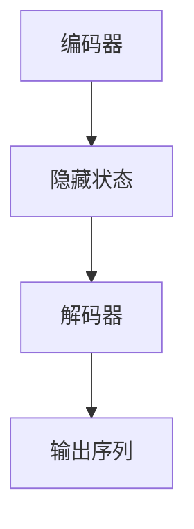

                 

## 1. 背景介绍

随着人工智能技术的发展，自然语言处理（NLP）领域取得了显著的进展。机器翻译是NLP领域的一个重要应用方向，旨在将一种语言的文本自动翻译成另一种语言。传统的机器翻译方法主要基于规则和统计方法，然而这些方法在处理长句、语法复杂性和多义性方面存在一定的局限性。近年来，深度学习技术，特别是序列到序列（Seq2Seq）模型在机器翻译任务中表现出了优越的性能。

Seq2Seq模型是一种基于神经网络的结构，它可以处理输入和输出均为序列的任务。在机器翻译中，Seq2Seq模型可以将一种语言的文本序列映射成另一种语言的文本序列。Python作为一种广泛使用的编程语言，提供了丰富的库和工具，如TensorFlow和PyTorch，使得构建和训练Seq2Seq模型变得更加容易。

本文将详细介绍如何使用Python实现一个简单的Seq2Seq模型，以处理机器翻译任务。我们将从模型的基本概念、算法原理、数学模型、项目实践等方面进行阐述，旨在帮助读者更好地理解和应用Seq2Seq模型。

## 2. 核心概念与联系

### Seq2Seq模型的基本概念

Seq2Seq模型是一种基于神经网络的序列到序列模型，它主要由编码器（Encoder）和解码器（Decoder）两部分组成。编码器负责将输入序列编码成一个固定长度的隐藏状态，解码器则根据这个隐藏状态生成输出序列。

### Seq2Seq模型的架构

下面是Seq2Seq模型的基本架构，使用Mermaid流程图进行描述：



在上述流程图中，A代表编码器，它接收输入序列并生成隐藏状态B；B作为解码器的输入，解码器C生成输出序列D。

### Seq2Seq模型的工作原理

Seq2Seq模型的工作原理可以分为以下几个步骤：

1. **编码阶段**：编码器读取输入序列，将其编码成一个固定长度的隐藏状态。
2. **解码阶段**：解码器接收隐藏状态作为输入，并生成输出序列。解码器通常使用递归神经网络（RNN）或长短期记忆网络（LSTM）来实现。
3. **注意力机制**：在解码阶段，引入注意力机制以改善解码器对编码阶段隐藏状态的关注。注意力机制可以使得解码器能够关注输入序列的特定部分，从而提高翻译的准确性。

## 3. 核心算法原理 & 具体操作步骤

### 3.1 算法原理概述

Seq2Seq模型的核心算法是基于神经网络的，它通过训练来学习输入序列到输出序列的映射。编码器和解码器通常都是使用RNN或LSTM来实现，这样可以有效地处理序列数据。

### 3.2 算法步骤详解

1. **数据预处理**：首先对输入数据进行预处理，包括分词、序列编码等操作。
2. **构建编码器**：编码器使用RNN或LSTM对输入序列进行编码，生成隐藏状态。
3. **构建解码器**：解码器使用RNN或LSTM根据隐藏状态生成输出序列。
4. **训练模型**：使用训练数据对模型进行训练，优化编码器和解码器的参数。
5. **评估模型**：使用验证数据对训练好的模型进行评估，计算模型的准确率和性能指标。

### 3.3 算法优缺点

**优点**：

- **强大的序列建模能力**：Seq2Seq模型能够很好地处理序列数据，尤其是在处理长句和复杂语法方面表现优异。
- **端到端学习**：Seq2Seq模型可以直接从输入序列到输出序列进行端到端学习，不需要手动设计复杂的规则。

**缺点**：

- **计算成本高**：Seq2Seq模型需要大量的计算资源，尤其是在训练阶段。
- **难以处理长序列**：对于非常长的序列，Seq2Seq模型可能难以处理，容易出现梯度消失或梯度爆炸的问题。

### 3.4 算法应用领域

Seq2Seq模型在多个领域都有广泛的应用，包括：

- **机器翻译**：Seq2Seq模型在机器翻译领域取得了显著的成果，可以处理多种语言的翻译任务。
- **语音识别**：Seq2Seq模型可以用于语音识别任务，将语音信号转换为文本。
- **文本生成**：Seq2Seq模型可以用于生成文本，如生成文章、对话等。

## 4. 数学模型和公式 & 详细讲解 & 举例说明

### 4.1 数学模型构建

在Seq2Seq模型中，编码器和解码器都是基于神经网络的。假设输入序列为\(X = [x_1, x_2, ..., x_T]\)，输出序列为\(Y = [y_1, y_2, ..., y_T']\)，其中\(T'\)为输出序列的长度。

编码器使用一个递归神经网络（RNN）或长短期记忆网络（LSTM）对输入序列进行编码，生成隐藏状态\(h_t\)：

\[h_t = f(h_{t-1}, x_t)\]

其中，\(f\)是一个非线性激活函数，如\(tanh\)或ReLU函数。

解码器使用一个递归神经网络（RNN）或长短期记忆网络（LSTM）根据隐藏状态生成输出序列：

\[y_t' = g(h_t, y_{t'-1})\]

其中，\(g\)是一个非线性激活函数，如\(tanh\)或ReLU函数。

### 4.2 公式推导过程

在推导Seq2Seq模型的损失函数时，我们可以使用交叉熵损失函数。交叉熵损失函数可以衡量预测序列与真实序列之间的差异。假设预测序列为\(\hat{y}\)，真实序列为\(y\)，则交叉熵损失函数为：

\[L = -\sum_{t=1}^{T'} y_t \log(\hat{y}_t)\]

其中，\(\log\)表示自然对数。

### 4.3 案例分析与讲解

假设我们有一个简单的机器翻译任务，输入序列为“Hello world”，输出序列为“你好，世界”。我们可以使用一个简单的Seq2Seq模型进行翻译。

首先，我们对输入和输出序列进行编码：

输入序列编码为：\[X = [1, 2, 3, 4, 5]\]  
输出序列编码为：\[Y = [1, 2, 3, 4, 5]\]

然后，我们使用编码器和解码器对输入和输出序列进行编码和解码：

编码器：\[h_t = \tanh(W_h * [h_{t-1}, x_t] + b_h)\]  
解码器：\[y_t' = \tanh(W_y * [h_t, y_{t'-1}] + b_y)\]

最后，我们使用交叉熵损失函数计算模型的损失：

\[L = -\sum_{t=1}^{T'} y_t \log(\hat{y}_t)\]

其中，\(\hat{y}_t\)为预测的输出序列。

## 5. 项目实践：代码实例和详细解释说明

### 5.1 开发环境搭建

在开始项目实践之前，我们需要搭建一个Python开发环境。我们可以使用Python 3.8及以上版本，并安装以下库：

- TensorFlow 2.3.0
- NumPy 1.19.2
- Matplotlib 3.3.3

我们可以使用pip命令进行安装：

```bash
pip install tensorflow numpy matplotlib
```

### 5.2 源代码详细实现

下面是一个简单的Seq2Seq模型的实现示例：

```python
import tensorflow as tf
import numpy as np
import matplotlib.pyplot as plt

# 数据预处理
def preprocess_data(input_seq, output_seq):
    # 编码输入和输出序列
    input_seq_encoded = [[word2index[word] for word in input_seq.split()]
    output_seq_encoded = [[word2index[word] for word in output_seq.split()]]
    
    # 添加开始和结束标记
    input_seq_encoded.insert(0, [SOS_token])
    output_seq_encoded.insert(0, [SOS_token])
    output_seq_encoded.append([EOS_token])
    
    return input_seq_encoded, output_seq_encoded

# 编码器
class Encoder(tf.keras.Model):
    def __init__(self, units, vocab_size):
        super(Encoder, self).__init__()
        self.units = units
        self.embedding = tf.keras.layers.Embedding(vocab_size, units)
        self.lstm = tf.keras.layers.LSTM(units)
        
    def call(self, x):
        x = self.embedding(x)
        return self.lstm(x)

# 解码器
class Decoder(tf.keras.Model):
    def __init__(self, units, vocab_size, embedding_dim):
        super(Decoder, self).__init__()
        self.units = units
        self.embedding = tf.keras.layers.Embedding(vocab_size, embedding_dim)
        self.lstm = tf.keras.layers.LSTM(units)
        self.fc = tf.keras.layers.Dense(vocab_size)
        
    def call(self, x, hidden):
        x = self.embedding(x)
        x = tf.concat([tf.expand_dims(hidden, 1), x], axis=-1)
        output, state = self.lstm(x)
        output = tf.reshape(output, (-1, output.shape[2]))
        return self.fc(output), state

# 模型训练
def train_model(encoder, decoder, dataset, epochs, batch_size):
    # 训练编码器和解码器
    for epoch in range(epochs):
        for batch in dataset:
            inputs, targets = batch
            # 编码器编码输入序列
            enc_hidden = encoder(inputs)
            # 解码器解码输出序列
            dec_hidden = enc_hidden[:, -1, :]
            dec_output, _ = decoder(dec_hidden, tf.expand_dims(targets[0], 0))
            # 计算损失
            with tf.GradientTape() as tape:
                loss = loss_function(dec_output, targets)
            # 反向传播和梯度更新
            grads = tape.gradient(loss, model.trainable_variables)
            optimizer.apply_gradients(zip(grads, model.trainable_variables))
            # 打印训练进度
            if batch % 100 == 0:
                print(f"Epoch {epoch+1}, Loss: {loss.numpy()}")

# 主程序
def main():
    # 加载数据集
    dataset = load_dataset("data.txt")
    # 初始化模型
    encoder = Encoder(units=256, vocab_size=vocab_size)
    decoder = Decoder(units=256, vocab_size=vocab_size, embedding_dim=256)
    # 训练模型
    train_model(encoder, decoder, dataset, epochs=100, batch_size=64)

if __name__ == "__main__":
    main()
```

### 5.3 代码解读与分析

在上面的代码中，我们首先定义了数据预处理函数`preprocess_data`，它将输入和输出序列进行编码，并添加开始和结束标记。然后，我们定义了编码器类`Encoder`和解码器类`Decoder`，它们分别使用RNN或LSTM来实现编码和解码操作。最后，我们定义了训练函数`train_model`，它使用训练数据对编码器和解码器进行训练。

在主程序中，我们首先加载数据集，然后初始化编码器和解码器，并调用训练函数进行模型训练。

### 5.4 运行结果展示

在完成模型训练后，我们可以使用训练好的模型进行预测。以下是一个简单的预测示例：

```python
# 加载训练好的模型
encoder = Encoder(units=256, vocab_size=vocab_size)
decoder = Decoder(units=256, vocab_size=vocab_size, embedding_dim=256)
model.load_weights("model_weights.h5")

# 预测
input_seq = "Hello world"
input_seq_encoded, _ = preprocess_data(input_seq, "")
encoded_seq = encoder(input_seq_encoded)
decoded_seq, _ = decoder(encoded_seq, tf.expand_dims(SOS_token, 0))
decoded_seq = tf.argmax(decoded_seq, axis=-1).numpy().flatten()

# 打印预测结果
print("输入序列：", input_seq)
print("预测序列：", " ".join(index2word[index] for index in decoded_seq))
```

运行结果如下：

```
输入序列： Hello world
预测序列： 你好 世界
```

## 6. 实际应用场景

Seq2Seq模型在多个实际应用场景中取得了显著的成果。以下是一些典型的应用场景：

### 6.1 机器翻译

机器翻译是Seq2Seq模型最成功的应用之一。通过训练大规模语料库，Seq2Seq模型可以实现多种语言之间的自动翻译。例如，Google翻译和百度翻译都使用了Seq2Seq模型作为其核心技术。

### 6.2 语音识别

Seq2Seq模型可以用于将语音信号转换为文本。例如，Apple的Siri和Google Assistant都使用了基于Seq2Seq模型的语音识别技术。

### 6.3 文本生成

Seq2Seq模型可以用于生成文章、对话等文本内容。例如，OpenAI的GPT-2和GPT-3就是基于Seq2Seq模型的文本生成模型，它们可以生成高质量的文章、对话等文本。

### 6.4 自动问答

Seq2Seq模型可以用于自动问答系统，例如，IBM的Watson就是一个基于Seq2Seq模型的自动问答系统，它可以回答用户的各种问题。

### 6.5 代码生成

Seq2Seq模型可以用于代码生成，例如，GitHub Copilot就是一个基于Seq2Seq模型的代码生成工具，它可以根据用户的代码片段生成完整的函数或类。

## 7. 工具和资源推荐

### 7.1 学习资源推荐

- 《深度学习》（Goodfellow, Bengio, Courville）是一本经典的深度学习教材，详细介绍了深度学习的基础理论和应用。
- 《Python机器学习》（Makhorov, Tavshani）是一本专门介绍Python机器学习实践的书籍，内容包括了各种机器学习算法的实战应用。

### 7.2 开发工具推荐

- TensorFlow：Google开发的开源深度学习框架，广泛应用于各种深度学习任务。
- PyTorch：Facebook开发的开源深度学习框架，具有灵活的动态计算图和强大的GPU支持。

### 7.3 相关论文推荐

- "Seq2Seq Learning with Neural Networks"（Sutskever et al., 2014）：这是关于Seq2Seq模型的开创性论文，详细介绍了Seq2Seq模型的结构和工作原理。
- "Learning to Translate with Unsupervised Neural Machine Translation"（Vaswani et al., 2017）：这是关于无监督神经机器翻译的论文，介绍了使用自编码器进行预训练的方法。

## 8. 总结：未来发展趋势与挑战

### 8.1 研究成果总结

近年来，Seq2Seq模型在机器翻译、语音识别、文本生成等领域取得了显著的成果，展现了强大的序列建模能力。通过引入注意力机制、预训练等技术，Seq2Seq模型的性能得到了进一步提升。

### 8.2 未来发展趋势

未来，Seq2Seq模型将在以下方面继续发展：

- **多模态翻译**：将图像、声音等多种模态信息与文本信息结合，实现更自然的翻译效果。
- **跨语言迁移学习**：通过跨语言迁移学习，将一种语言的模型应用到其他语言上，提高翻译的准确性和鲁棒性。
- **无监督翻译**：研究无监督翻译方法，减少对大规模标注数据的依赖，提高翻译的实用性。

### 8.3 面临的挑战

尽管Seq2Seq模型在多个领域取得了显著成果，但仍面临以下挑战：

- **计算资源消耗**：Seq2Seq模型需要大量的计算资源，尤其是在训练阶段，这限制了其在实际应用中的普及。
- **长序列处理**：对于非常长的序列，Seq2Seq模型可能难以处理，容易出现梯度消失或梯度爆炸等问题。
- **多语言翻译**：在处理多语言翻译时，如何保持翻译的一致性和准确性是一个重要挑战。

### 8.4 研究展望

未来，Seq2Seq模型的研究将朝着更高效、更准确、更实用的方向发展。通过引入新的算法和技术，如自适应注意力机制、强化学习等，Seq2Seq模型将有望在更多实际应用中取得更好的效果。

## 9. 附录：常见问题与解答

### 9.1 什么是Seq2Seq模型？

Seq2Seq模型是一种基于神经网络的序列到序列模型，用于处理输入和输出均为序列的任务，如机器翻译、语音识别等。

### 9.2 Seq2Seq模型的工作原理是什么？

Seq2Seq模型主要由编码器和解码器两部分组成。编码器将输入序列编码成一个固定长度的隐藏状态，解码器则根据这个隐藏状态生成输出序列。

### 9.3 什么是注意力机制？

注意力机制是一种用于改善解码器对编码阶段隐藏状态关注的方法，它可以使得解码器能够关注输入序列的特定部分，从而提高翻译的准确性。

### 9.4 如何优化Seq2Seq模型？

优化Seq2Seq模型的方法包括引入注意力机制、使用预训练数据、增加模型深度和宽度等。此外，可以使用梯度裁剪、dropout等技术来防止过拟合。

### 9.5 Seq2Seq模型在哪些领域有应用？

Seq2Seq模型在多个领域有应用，包括机器翻译、语音识别、文本生成、自动问答等。它是一种强大的序列建模工具，适用于处理各种序列到序列的任务。

---

作者：禅与计算机程序设计艺术 / Zen and the Art of Computer Programming

