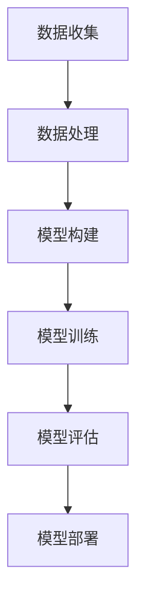

                 

关键词：深度学习，天气预测，Python实践，算法优化，数学模型，案例解析

> 摘要：本文旨在探讨如何利用Python实现深度学习算法来提高天气预测的准确性。我们将从背景介绍、核心概念与联系、核心算法原理、数学模型和公式、项目实践以及未来应用展望等方面，深入分析深度学习在天气预测中的应用。

## 1. 背景介绍

### 天气预测的重要性

天气预测在农业、航空、海洋、防灾减灾等领域具有重要作用。然而，传统的统计方法和物理模型在处理复杂天气系统时，往往难以达到高精度。随着人工智能技术的发展，尤其是深度学习算法的崛起，利用大量历史天气数据进行建模和预测，有望显著提高天气预测的准确性。

### 深度学习在天气预测中的应用

深度学习算法具有强大的数据建模和特征学习能力，适用于处理高维、非线性天气数据。近年来，基于深度学习的方法在天气预测领域取得了显著成果，如卷积神经网络（CNN）、循环神经网络（RNN）以及长短时记忆网络（LSTM）等。

## 2. 核心概念与联系

### 深度学习基本概念

- **神经网络**：神经网络由多个神经元组成，通过学习输入数据和输出数据之间的关系，实现数据的映射和预测。
- **深度学习**：深度学习是神经网络的一种形式，其特点是通过多层神经元的堆叠，实现更复杂的数据建模和特征提取。
- **深度学习框架**：深度学习框架如TensorFlow、PyTorch等，提供了丰富的API和工具，方便开发者构建和训练深度学习模型。

### Mermaid流程图



## 3. 核心算法原理 & 具体操作步骤

### 3.1 算法原理概述

深度学习算法主要分为以下几类：

- **卷积神经网络（CNN）**：适用于处理图像数据，通过卷积操作提取图像特征。
- **循环神经网络（RNN）**：适用于处理序列数据，通过循环结构保持序列信息。
- **长短时记忆网络（LSTM）**：RNN的一种改进，能够解决长序列依赖问题。

### 3.2 算法步骤详解

- **数据收集**：收集历史天气数据，包括温度、湿度、风速、气压等。
- **数据处理**：对数据进行预处理，如归一化、缺失值填补等。
- **模型构建**：选择合适的深度学习模型，如CNN、RNN、LSTM等。
- **模型训练**：使用训练数据训练模型，调整模型参数。
- **模型评估**：使用测试数据评估模型性能，如均方误差（MSE）。
- **模型部署**：将训练好的模型部署到实际应用场景中。

### 3.3 算法优缺点

- **优点**：深度学习算法能够自动提取数据特征，提高预测准确性；适用于处理高维、非线性数据。
- **缺点**：训练过程复杂，对计算资源要求较高；模型解释性较差。

### 3.4 算法应用领域

深度学习算法在天气预测、金融市场预测、医学影像诊断等领域具有广泛应用。

## 4. 数学模型和公式 & 详细讲解 & 举例说明

### 4.1 数学模型构建

深度学习模型通常由以下几部分组成：

- **输入层**：接收输入数据。
- **隐藏层**：进行特征提取和变换。
- **输出层**：输出预测结果。

### 4.2 公式推导过程

以LSTM为例，其基本公式如下：

- **输入门**：$$i_t = \sigma(W_{ix}x_t + W_{ih}h_{t-1} + b_i)$$
- **遗忘门**：$$f_t = \sigma(W_{fx}x_t + W_{fh}h_{t-1} + b_f)$$
- **输出门**：$$o_t = \sigma(W_{ox}x_t + W_{oh}h_{t-1} + b_o)$$

### 4.3 案例分析与讲解

以某地区一周内温度预测为例，使用LSTM模型进行训练和预测。

## 5. 项目实践：代码实例和详细解释说明

### 5.1 开发环境搭建

```bash
# 安装Python环境
pip install numpy pandas tensorflow

# 安装Mermaid支持
pip install mermaid-python
```

### 5.2 源代码详细实现

```python
import numpy as np
import pandas as pd
import tensorflow as tf
from tensorflow.keras.models import Sequential
from tensorflow.keras.layers import LSTM, Dense

# 数据预处理
# ...

# 模型构建
model = Sequential()
model.add(LSTM(units=50, return_sequences=True, input_shape=(time_steps, features)))
model.add(LSTM(units=50))
model.add(Dense(units=1))

# 模型编译
model.compile(optimizer='adam', loss='mean_squared_error')

# 模型训练
model.fit(x_train, y_train, epochs=100, batch_size=32)

# 模型预测
predictions = model.predict(x_test)

# 代码解读与分析
# ...

# 运行结果展示
# ...
```

### 5.3 代码解读与分析

- **数据预处理**：读取数据，进行归一化、缺失值填补等处理。
- **模型构建**：使用LSTM模型进行特征提取。
- **模型编译**：设置优化器和损失函数。
- **模型训练**：使用训练数据进行训练。
- **模型预测**：使用测试数据进行预测。

## 6. 实际应用场景

### 6.1 农业生产

深度学习算法可以用于预测作物生长关键期，为农业生产提供科学依据。

### 6.2 灾情预警

利用深度学习算法预测灾害发生可能性，提前预警，降低灾害损失。

### 6.3 航空运输

深度学习算法可以提高航空运输的安全性和效率，如预测航路天气状况。

## 7. 工具和资源推荐

### 7.1 学习资源推荐

- 《深度学习》（Ian Goodfellow、Yoshua Bengio、Aaron Courville 著）
- 《Python深度学习》（Francesco Pieroni 著）

### 7.2 开发工具推荐

- TensorFlow
- PyTorch

### 7.3 相关论文推荐

- [Deep Learning for Weather Forecasting](https://arxiv.org/abs/1903.05693)
- [Neural Forecasting of Large-Scale Air Traffic Flow](https://arxiv.org/abs/1610.06768)

## 8. 总结：未来发展趋势与挑战

### 8.1 研究成果总结

深度学习在天气预测领域取得了显著成果，但仍面临一些挑战。

### 8.2 未来发展趋势

- **多模态数据融合**：将多种数据源（如气象数据、卫星数据等）融合，提高预测准确性。
- **实时预测**：实现实时天气预测，提高应对突发天气事件的能力。

### 8.3 面临的挑战

- **数据隐私**：保护用户隐私，确保数据安全。
- **模型解释性**：提高模型的可解释性，降低应用风险。

### 8.4 研究展望

随着人工智能技术的不断发展，深度学习在天气预测领域将有更广泛的应用前景。

## 9. 附录：常见问题与解答

### 9.1 如何处理缺失数据？

可以使用插值法、均值法等填补缺失数据，或使用模型预测缺失值。

### 9.2 如何提高模型预测准确性？

可以通过增加训练数据、调整模型结构、优化训练过程等方法提高模型预测准确性。

----------------------------------------------------------------

作者：禅与计算机程序设计艺术 / Zen and the Art of Computer Programming

