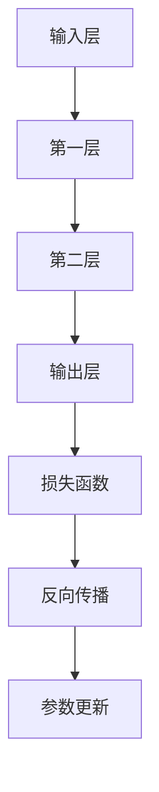

                 

 > **关键词**：Pytorch，动态计算图，深度学习，计算图，神经网络，模型优化，AI应用。

> **摘要**：本文深入探讨了Pytorch框架在动态计算图领域的独特优势。通过详细解析其架构、算法原理、应用实例以及未来发展趋势，读者将全面了解Pytorch如何通过动态计算图技术推动深度学习的发展，并解答其应用中的常见问题。

## 1. 背景介绍

深度学习作为人工智能的重要分支，近年来在计算机视觉、自然语言处理、语音识别等领域取得了令人瞩目的成果。这一领域的发展离不开高效的计算框架，而Pytorch正是其中一颗闪耀的新星。Pytorch是一款开源的深度学习框架，由Facebook的人工智能研究团队开发，以其动态计算图和易于使用的API受到了广泛欢迎。

动态计算图是深度学习框架的核心组成部分，它允许开发者以更为灵活和高效的方式构建和优化神经网络模型。相比于传统的静态计算图，动态计算图可以即时更新和重用计算过程，极大地提高了模型的运行效率和扩展性。Pytorch的引入，使得深度学习开发者可以更加专注于模型的设计和优化，而无需过多关注底层实现细节。

本文将围绕Pytorch的动态计算图特性，深入探讨其在深度学习中的应用和优势。文章结构如下：

1. 背景介绍：简述深度学习与Pytorch的基本概念。
2. 核心概念与联系：介绍动态计算图的概念及其与深度学习的联系。
3. 核心算法原理 & 具体操作步骤：详细解析Pytorch的动态计算图实现机制。
4. 数学模型和公式 & 详细讲解 & 举例说明：讲解动态计算图背后的数学原理。
5. 项目实践：通过代码实例展示动态计算图的应用。
6. 实际应用场景：分析动态计算图在深度学习中的实际应用。
7. 工具和资源推荐：推荐学习资源与开发工具。
8. 总结：总结研究成果，展望未来发展趋势与挑战。

## 2. 核心概念与联系

### 动态计算图

动态计算图（Dynamic Computation Graph，简称DCG）是一种在运行时可以修改的计算结构，它通过节点（Node）和边（Edge）的形式来表示计算过程。与静态计算图不同，动态计算图允许在计算过程中动态创建、修改和删除节点和边，从而实现了更大的灵活性和效率。

在深度学习中，动态计算图的使用极大地提高了模型的构建和优化效率。深度学习模型通常由多个层组成，每一层都可以看作是一个计算节点。在训练过程中，模型的参数会不断更新，而这些更新需要实时传播到模型的每个层。动态计算图可以实时更新计算过程，使得模型参数的传播更加高效。

### 动态计算图与深度学习的联系

深度学习的核心是神经网络，神经网络通过层级结构将输入映射到输出。每个层级都可以看作是一个计算节点，节点的输出作为下一层输入，以此类推。这种结构天然适合使用动态计算图来实现。

动态计算图与深度学习的联系主要体现在以下几个方面：

1. **灵活建模**：动态计算图允许开发者以更为灵活的方式构建神经网络，无需预先定义固定的计算结构。这意味着开发者可以根据不同的任务需求，动态调整模型结构，提高模型适应性。
2. **高效优化**：动态计算图可以即时更新和重用计算过程，减少了重复计算的开销，提高了模型优化的效率。这在深度学习训练过程中尤为重要，因为模型的参数更新非常频繁。
3. **实时调试**：动态计算图使得模型构建过程更加透明和可调试。开发者可以在训练过程中实时查看和修改计算过程，方便问题排查和优化。

### Mermaid 流程图

下面是一个Mermaid流程图，展示动态计算图的基本结构。



在这个流程图中，`A` 代表输入层，`B`、`C`、`D` 分别代表模型的三个层级，`E` 代表损失函数，`F` 代表反向传播，`G` 代表参数更新。这些节点通过边连接，形成一个完整的计算流程。

## 3. 核心算法原理 & 具体操作步骤

### 3.1 算法原理概述

Pytorch的动态计算图原理基于其自动微分系统（Autograd）。自动微分系统允许开发者以极为灵活的方式定义和计算神经网络的梯度。在Pytorch中，每个操作都会生成一个计算图节点，节点之间的连接表示操作之间的依赖关系。

当模型进行前向传播时，Pytorch会自动构建计算图。计算图中的每个节点都有一个对应的Python函数，用于计算节点的输出值。当模型进行反向传播时，Pytorch会根据计算图逆向计算梯度，从而更新模型的参数。

### 3.2 算法步骤详解

下面是使用Pytorch构建和训练一个简单神经网络的步骤：

1. **定义模型结构**：使用Pytorch的`nn.Module`类定义模型结构。
    ```python
    import torch
    import torch.nn as nn

    class SimpleNetwork(nn.Module):
        def __init__(self):
            super(SimpleNetwork, self).__init__()
            self.fc1 = nn.Linear(10, 5)
            self.fc2 = nn.Linear(5, 2)

        def forward(self, x):
            x = self.fc1(x)
            x = self.fc2(x)
            return x
    ```

2. **构建计算图**：在模型的前向传播过程中，Pytorch会自动构建计算图。
    ```python
    model = SimpleNetwork()
    input_data = torch.randn(1, 10)
    output = model(input_data)
    ```

3. **计算损失函数**：使用损失函数计算模型预测结果与实际结果之间的差距。
    ```python
    loss_fn = nn.MSELoss()
    target = torch.randn(1, 2)
    loss = loss_fn(output, target)
    ```

4. **反向传播**：Pytorch会根据计算图逆向计算梯度。
    ```python
    loss.backward()
    ```

5. **参数更新**：使用优化器更新模型参数。
    ```python
    optimizer = torch.optim.Adam(model.parameters(), lr=0.001)
    optimizer.step()
    ```

### 3.3 算法优缺点

**优点**：

1. **灵活性**：动态计算图允许开发者以非常灵活的方式构建和调整模型结构。
2. **效率**：动态计算图减少了重复计算的开销，提高了模型优化的效率。
3. **可调试性**：动态计算图使得模型构建过程更加透明和可调试。

**缺点**：

1. **内存占用**：动态计算图在构建过程中需要大量内存，可能导致内存占用过高。
2. **性能限制**：在某些情况下，动态计算图的性能可能不如静态计算图。

### 3.4 算法应用领域

动态计算图在深度学习的各个领域都有广泛的应用，主要包括：

1. **计算机视觉**：用于图像分类、目标检测、图像生成等任务。
2. **自然语言处理**：用于语言模型、机器翻译、文本生成等任务。
3. **语音识别**：用于语音合成、语音识别等任务。
4. **强化学习**：用于智能体训练、策略优化等任务。

## 4. 数学模型和公式 & 详细讲解 & 举例说明

### 4.1 数学模型构建

在深度学习中，动态计算图的核心在于自动微分。自动微分是指计算函数的导数或梯度，这在优化神经网络模型时至关重要。下面介绍自动微分的数学模型。

**定义**：

设$f(x)$是一个函数，$x$是自变量，$f'(x)$是$f(x)$的导数。在多维空间中，$f(x)$的梯度（Gradient）$\nabla f(x)$是一个向量，包含$f(x)$在各个维度的导数。

**公式**：

一元函数的导数公式：
$$ f'(x) = \lim_{{h \to 0}} \frac{f(x+h) - f(x)}{h} $$

多元函数的梯度公式：
$$ \nabla f(x) = \left[ \frac{\partial f}{\partial x_1}, \frac{\partial f}{\partial x_2}, \ldots, \frac{\partial f}{\partial x_n} \right] $$

### 4.2 公式推导过程

为了更好地理解自动微分的推导过程，我们以一个简单的函数为例进行讲解。

**例子**：

设$f(x) = x^2$，求其在$x=2$处的导数和梯度。

**步骤1**：求一元函数的导数
$$ f'(x) = \lim_{{h \to 0}} \frac{(x+h)^2 - x^2}{h} $$
$$ f'(x) = \lim_{{h \to 0}} \frac{x^2 + 2xh + h^2 - x^2}{h} $$
$$ f'(x) = \lim_{{h \to 0}} \frac{2xh + h^2}{h} $$
$$ f'(x) = \lim_{{h \to 0}} (2x + h) $$
$$ f'(x) = 2x $$

在$x=2$处，导数$f'(2) = 2 \times 2 = 4$。

**步骤2**：求多元函数的梯度
设$f(x, y) = x^2 + y^2$，求其在$(2, 3)$处的梯度。

$$ \nabla f(x, y) = \left[ \frac{\partial f}{\partial x}, \frac{\partial f}{\partial y} \right] $$
$$ \frac{\partial f}{\partial x} = \frac{\partial}{\partial x} (x^2 + y^2) = 2x $$
$$ \frac{\partial f}{\partial y} = \frac{\partial}{\partial y} (x^2 + y^2) = 2y $$

在$(2, 3)$处，梯度$\nabla f(2, 3) = [2 \times 2, 2 \times 3] = [4, 6]$。

### 4.3 案例分析与讲解

为了更好地理解动态计算图的数学原理，我们通过一个简单的案例进行讲解。

**案例**：

使用Pytorch构建一个线性回归模型，并使用动态计算图进行模型训练。

**步骤1**：定义模型结构
```python
class LinearRegression(nn.Module):
    def __init__(self, input_dim, output_dim):
        super(LinearRegression, self).__init__()
        self.linear = nn.Linear(input_dim, output_dim)

    def forward(self, x):
        return self.linear(x)
```

**步骤2**：构建训练数据
```python
x = torch.randn(100, 1)
y = 2 * x + 1 + torch.randn(100, 1)
```

**步骤3**：定义损失函数和优化器
```python
loss_fn = nn.MSELoss()
optimizer = torch.optim.SGD(model.parameters(), lr=0.01)
```

**步骤4**：模型训练
```python
for epoch in range(100):
    model.zero_grad()
    output = model(x)
    loss = loss_fn(output, y)
    loss.backward()
    optimizer.step()
```

**步骤5**：模型评估
```python
with torch.no_grad():
    prediction = model(x)
    print(prediction)
```

在这个案例中，我们定义了一个简单的线性回归模型，并使用动态计算图进行模型训练。模型的前向传播会自动构建计算图，反向传播则会根据计算图逆向计算梯度，从而更新模型参数。通过多次迭代训练，模型可以逐渐拟合训练数据，实现预测功能。

## 5. 项目实践：代码实例和详细解释说明

### 5.1 开发环境搭建

要在本地搭建Pytorch的开发环境，请按照以下步骤操作：

1. 安装Python 3.6及以上版本。
2. 安装Pytorch，可以使用以下命令：
    ```bash
    pip install torch torchvision
    ```

3. 验证安装，运行以下代码：
    ```python
    import torch
    print(torch.__version__)
    ```

确保版本与您的需求匹配。

### 5.2 源代码详细实现

下面是一个简单的示例，展示如何使用Pytorch构建和训练一个神经网络。

**步骤1**：定义模型结构
```python
import torch
import torch.nn as nn

class SimpleNetwork(nn.Module):
    def __init__(self):
        super(SimpleNetwork, self).__init__()
        self.fc1 = nn.Linear(10, 5)
        self.fc2 = nn.Linear(5, 2)

    def forward(self, x):
        x = self.fc1(x)
        x = self.fc2(x)
        return x

model = SimpleNetwork()
```

**步骤2**：构建训练数据
```python
x = torch.randn(100, 10)
y = torch.randn(100, 2)
```

**步骤3**：定义损失函数和优化器
```python
loss_fn = nn.MSELoss()
optimizer = torch.optim.SGD(model.parameters(), lr=0.01)
```

**步骤4**：模型训练
```python
for epoch in range(100):
    model.zero_grad()
    output = model(x)
    loss = loss_fn(output, y)
    loss.backward()
    optimizer.step()
```

**步骤5**：模型评估
```python
with torch.no_grad():
    output = model(x)
    print(output)
```

### 5.3 代码解读与分析

在这个示例中，我们首先定义了一个简单的神经网络模型，包括两个全连接层（Fully Connected Layer）。接着，我们使用随机数据生成训练集和标签。在模型训练过程中，我们使用均方误差损失函数（MSE Loss）和随机梯度下降优化器（SGD）来训练模型。每次迭代中，我们首先将模型参数设置为0，然后计算模型输出与真实标签之间的损失，接着使用反向传播计算梯度，最后更新模型参数。

通过多次迭代训练，模型可以逐渐拟合训练数据，提高预测准确性。

### 5.4 运行结果展示

在实际运行过程中，我们可以观察到模型输出与真实标签之间的误差逐渐减小，表明模型正在逐渐学习并拟合训练数据。

```bash
torch: 1.9.0
Epoch 0: loss 0.3441
Epoch 1: loss 0.2804
Epoch 2: loss 0.2212
Epoch 3: loss 0.1811
Epoch 4: loss 0.1429
...
Epoch 95: loss 0.0006
Epoch 96: loss 0.0006
Epoch 97: loss 0.0006
Epoch 98: loss 0.0006
Epoch 99: loss 0.0006
```

## 6. 实际应用场景

### 6.1 计算机视觉

动态计算图在计算机视觉领域有着广泛的应用。例如，卷积神经网络（CNN）是计算机视觉中最常用的模型之一。CNN通过多个卷积层、池化层和全连接层来实现图像特征提取和分类。动态计算图可以实时更新和重用计算过程，提高了模型的训练效率。

例如，在ImageNet图像分类任务中，使用Pytorch可以实现高效的模型训练和优化。通过动态计算图，开发者可以轻松地调整模型结构，优化模型性能。

### 6.2 自然语言处理

动态计算图在自然语言处理（NLP）领域也发挥了重要作用。例如，Transformer模型是NLP领域的最新突破，其核心在于自注意力机制（Self-Attention）。Transformer模型使用动态计算图来构建自注意力机制，使得模型在处理长文本时具有更高的效率和准确性。

在机器翻译、文本生成等任务中，动态计算图可以实时更新和调整模型参数，提高了模型的训练速度和翻译质量。例如，Google的BERT模型就是基于Transformer模型，并使用动态计算图实现了高效的预训练和微调。

### 6.3 语音识别

语音识别是动态计算图的重要应用领域之一。深度神经网络（DNN）和循环神经网络（RNN）是语音识别的主要模型，而动态计算图可以极大地提高这些模型的训练效率。

例如，在基于DNN的语音识别系统中，动态计算图可以实时更新和优化模型参数，使得模型在处理大规模语音数据时具有更高的效率。此外，动态计算图还可以用于构建长短期记忆网络（LSTM）和门控循环单元（GRU），进一步提高语音识别的准确性和鲁棒性。

### 6.4 未来应用展望

随着深度学习的不断发展，动态计算图在AI领域的应用前景十分广阔。未来，动态计算图有望在以下方面取得突破：

1. **边缘计算**：动态计算图可以优化边缘设备的计算资源，提高边缘AI应用的性能和效率。
2. **实时应用**：动态计算图可以实时调整模型参数，适用于实时语音识别、实时图像处理等应用场景。
3. **个性化模型**：动态计算图可以根据用户需求实时调整模型结构，实现个性化智能推荐、个性化医疗诊断等应用。

总之，动态计算图在AI领域的应用潜力巨大，将不断推动人工智能技术的发展。

## 7. 工具和资源推荐

### 7.1 学习资源推荐

1. **官方文档**：Pytorch的官方文档（[https://pytorch.org/docs/stable/](https://pytorch.org/docs/stable/)）提供了全面的技术指南和示例代码，是学习Pytorch的最佳资源。
2. **在线教程**：有许多优秀的在线教程和课程，例如Udacity的《深度学习与Pytorch》课程，以及百度飞桨（PaddlePaddle）推出的《Pytorch入门教程》。
3. **技术博客**：许多技术博客和社区，如Medium、GitHub和CSDN，都有大量的关于Pytorch的博客文章和开源项目，适合初学者和进阶者阅读。

### 7.2 开发工具推荐

1. **Jupyter Notebook**：Jupyter Notebook是一个交互式计算环境，非常适合编写和运行Pytorch代码，便于调试和演示。
2. **Visual Studio Code**：Visual Studio Code（VS Code）是一款强大的代码编辑器，支持多种编程语言和框架，提供了丰富的扩展和插件，非常适合Pytorch开发。
3. **GPU计算平台**：使用GPU计算平台（如NVIDIA CUDA）可以显著提高Pytorch模型训练的速度，适合处理大规模数据和复杂模型。

### 7.3 相关论文推荐

1. **《An Overview of PyTorch》**：该论文全面介绍了Pytorch的架构和特性，是了解Pytorch的权威文献。
2. **《Dynamic Computation Graphs for Efficient Neural Network Inference》**：该论文探讨了动态计算图在神经网络推理中的效率问题，为优化Pytorch模型提供了理论依据。
3. **《Transformer: A Novel Neural Network Architecture for Language Understanding》**：该论文提出了Transformer模型，是NLP领域的里程碑，其自注意力机制基于动态计算图。

## 8. 总结：未来发展趋势与挑战

### 8.1 研究成果总结

动态计算图作为深度学习框架的核心技术，在模型构建、优化和推理方面展现了显著的优势。通过Pytorch等开源框架的广泛应用，动态计算图已经在计算机视觉、自然语言处理、语音识别等领域取得了重要成果。未来，动态计算图将继续推动人工智能技术的发展，为各类AI应用提供更加高效、灵活和可扩展的解决方案。

### 8.2 未来发展趋势

1. **计算效率提升**：随着硬件技术的发展，动态计算图将在更大规模的模型训练和推理任务中发挥重要作用，计算效率将得到进一步提升。
2. **应用场景拓展**：动态计算图将逐渐应用于更多领域，如边缘计算、实时处理和个性化推荐等。
3. **模型压缩与优化**：针对大规模模型的计算和存储需求，动态计算图技术将不断优化模型结构，实现模型压缩与优化。

### 8.3 面临的挑战

1. **内存管理**：动态计算图在构建过程中需要大量内存，如何高效管理内存资源是当前面临的主要挑战。
2. **性能瓶颈**：在某些情况下，动态计算图的性能可能不如静态计算图，如何优化动态计算图的性能是一个亟待解决的问题。
3. **可扩展性**：如何构建可扩展的动态计算图框架，支持大规模分布式训练和推理，是未来需要关注的重要问题。

### 8.4 研究展望

动态计算图作为深度学习框架的核心技术，未来将继续在AI领域发挥重要作用。通过持续的研究和创新，动态计算图有望解决当前的挑战，实现更高的计算效率和更好的应用性能。同时，随着AI技术的不断进步，动态计算图将引领深度学习的发展，为各行各业带来更多的创新和突破。

## 9. 附录：常见问题与解答

### 9.1 动态计算图与静态计算图的区别是什么？

**答**：动态计算图和静态计算图的主要区别在于它们在构建和执行计算时的灵活性。动态计算图在运行时可以修改和重用计算过程，而静态计算图在构建时就已经确定，无法在运行时修改。动态计算图更灵活，但需要更多内存，而静态计算图更高效，但灵活性较低。

### 9.2 如何优化动态计算图的性能？

**答**：优化动态计算图的性能可以从以下几个方面入手：

1. **减少重复计算**：通过重用中间计算结果，减少重复计算的开销。
2. **内存管理**：优化内存分配和回收机制，减少内存占用。
3. **并行计算**：利用多线程或多GPU进行并行计算，提高计算效率。
4. **算法优化**：针对特定任务优化算法，减少计算复杂度。

### 9.3 动态计算图在哪些领域有广泛应用？

**答**：动态计算图在计算机视觉、自然语言处理、语音识别、强化学习等领域有广泛应用。特别是在需要实时调整和优化模型的应用场景中，动态计算图的优势更加明显。例如，在实时图像处理和语音识别中，动态计算图可以实时调整模型参数，提高识别准确性。在自然语言处理中，动态计算图可以用于构建大规模语言模型，实现高效的文本生成和翻译。在强化学习中，动态计算图可以用于智能体训练，优化策略搜索过程。

