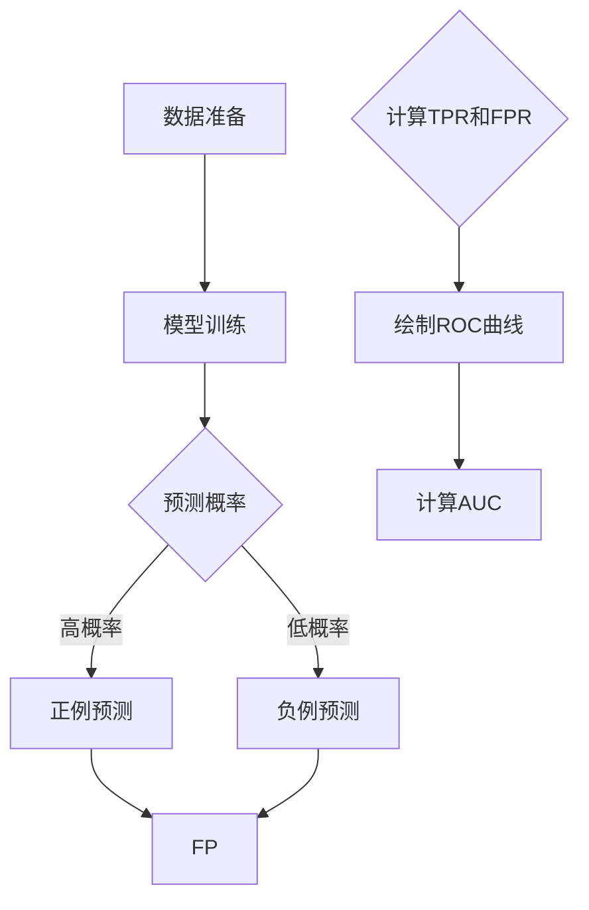
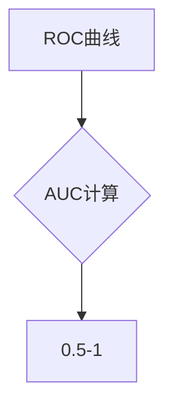
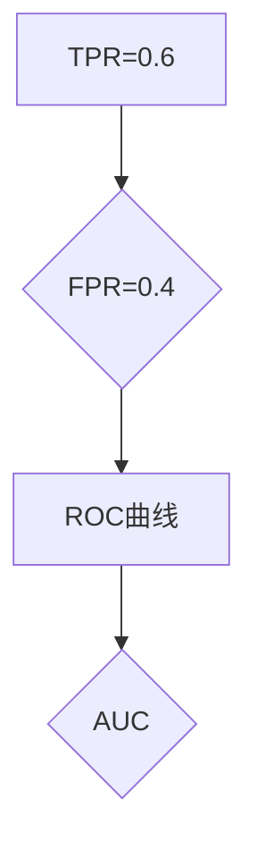
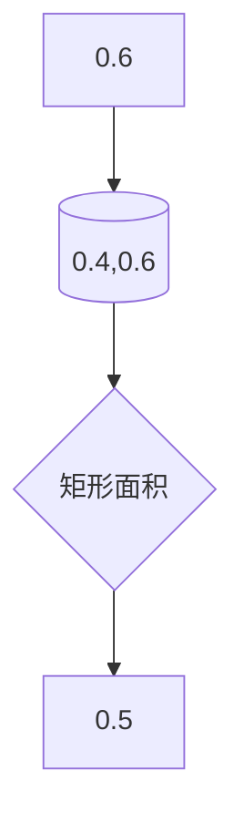

                 

ROC Curve，即接收者操作特征曲线（Receiver Operating Characteristic Curve），是机器学习领域特别是在二分类问题中，评估分类模型性能的重要工具之一。它不仅可以帮助我们理解模型的判别能力，还可以为我们在分类阈值选择上提供有力的参考。本文将详细讲解ROC Curve的原理、数学模型、代码实现，并通过实际案例进行实战演练，帮助读者深入理解这一概念。

## 关键词
- ROC Curve
- 接收者操作特征
- 分类模型
- 机器学习
- 评价指标

## 摘要
本文首先介绍了ROC Curve的基本概念和它在机器学习领域的重要性。接着，我们通过Mermaid流程图详细阐述了ROC Curve的原理及其构建过程。随后，我们探讨了ROC Curve中的一些核心数学模型和公式，并结合实际案例进行了深入分析。最后，通过一个完整的代码实战案例，我们展示了如何使用Python实现ROC Curve，并分析了模型性能。

## 1. 背景介绍

### ROC Curve的起源
ROC Curve最早由美国雷达工程师Harry F. Dodge和Elder R. Pugh在20世纪50年代提出，用于评估雷达系统的性能。随着机器学习技术的不断发展，ROC Curve逐渐被应用于各种二分类问题中，如医学诊断、金融风险评估、垃圾邮件检测等。

### ROC Curve的重要性
在机器学习领域，ROC Curve具有以下几个重要特点：
1. **直观性**：ROC Curve通过图形化方式直观展示了分类器的性能。
2. **全面性**：ROC Curve不仅考虑了分类器的准确率，还考虑了误判率，提供了一种更加全面的评估。
3. **阈值独立性**：ROC Curve不受分类阈值的影响，因此可以在不同阈值下进行模型性能的比较。

## 2. 核心概念与联系

### 核心概念
**真正例率（True Positive Rate, TPR）**：也被称为灵敏度（Sensitivity），表示实际为正例的样本中被正确分类为正例的比例。

**假正例率（False Positive Rate, FPR）**：表示实际为负例的样本中被错误分类为正例的比例。

**准确率（Accuracy）**：分类器正确分类的总数占总样本数的比例。

**召回率（Recall）**：也被称为灵敏度，表示实际为正例的样本中被正确分类为正例的比例。

**特异度（Specificity）**：也被称为真阴性率（True Negative Rate, TNR），表示实际为负例的样本中被正确分类为负例的比例。

**F1值（F1 Score）**：是准确率和召回率的调和平均，用于综合考虑分类器的准确率和召回率。

### ROC Curve原理及构建过程

下面是ROC Curve的原理和构建过程的Mermaid流程图：



### ROC Curve与AUC

**AUC（Area Under Curve）**：ROC曲线下方的面积，用于评估分类器的整体性能。AUC的值介于0.5到1之间，值越接近1，表示分类器的性能越好。



## 3. 核心算法原理 & 具体操作步骤

### 3.1 算法原理概述
ROC Curve的原理主要基于二分类问题中的预测概率和实际标签。通过计算不同阈值下的真正例率（TPR）和假正例率（FPR），我们可以绘制出ROC曲线。

### 3.2 算法步骤详解
1. **数据准备**：准备二分类问题数据集，包括特征和标签。
2. **模型训练**：使用训练数据集训练一个分类模型，如逻辑回归、SVM等。
3. **模型预测**：对测试数据进行预测，得到每个样本的预测概率。
4. **计算TPR和FPR**：根据预测概率和实际标签，计算不同阈值下的TPR和FPR。
5. **绘制ROC曲线**：将TPR和FPR绘制在坐标系中，得到ROC曲线。
6. **计算AUC**：计算ROC曲线下方的面积，得到AUC值。

### 3.3 算法优缺点
**优点**：
- ROC Curve能够综合考虑分类器的准确率和召回率，提供了一种全面评估。
- ROC Curve不受分类阈值的影响，适用于不同阈值下的比较。

**缺点**：
- ROC Curve需要计算大量的预测概率，对计算资源有一定要求。
- ROC Curve对极端不平衡的数据集表现不佳。

### 3.4 算法应用领域
ROC Curve广泛应用于二分类问题，如医学诊断、金融风险评估、垃圾邮件检测等。

## 4. 数学模型和公式 & 详细讲解 & 举例说明

### 4.1 数学模型构建
ROC Curve的数学模型主要基于真正例率（TPR）和假正例率（FPR）的计算。

**TPR**：
$$
TPR = \frac{TP}{TP + FN}
$$
其中，TP表示真正例，FN表示假阴性。

**FPR**：
$$
FPR = \frac{FP}{TN + FP}
$$
其中，FP表示假正例，TN表示真阴性。

### 4.2 公式推导过程
**TPR推导**：
当分类器预测概率大于阈值时，将样本分类为正例；否则，分类为负例。

- **预测为正例**：
  - 真正例：实际为正例且预测为正例，即TP。
  - 假阴性：实际为正例但预测为负例，即FN。
- **预测为负例**：
  - 真阴性：实际为负例且预测为负例，即TN。
  - 假正例：实际为负例但预测为正例，即FP。

因此，根据上述分类结果，我们可以得到TPR的计算公式。

**FPR推导**：
同理，可以得到FPR的计算公式。

### 4.3 案例分析与讲解
**案例数据集**：
假设我们有一个二分类问题数据集，包含10个样本，其中5个正例，5个负例。经过模型预测，得到如下预测概率：

| 样本编号 | 实际标签 | 预测概率 |
|--------|--------|-------|
| 1      | 正例    | 0.8   |
| 2      | 正例    | 0.7   |
| 3      | 正例    | 0.6   |
| 4      | 正例    | 0.9   |
| 5      | 正例    | 0.5   |
| 6      | 负例    | 0.1   |
| 7      | 负例    | 0.3   |
| 8      | 负例    | 0.2   |
| 9      | 负例    | 0.4   |
| 10     | 负例    | 0.6   |

**阈值选择**：
我们选择0.5作为分类阈值。

**TPR和FPR计算**：
- **预测为正例**：
  - 正例：3个（实际为正例且预测为正例），即TP=3。
  - 负例：2个（实际为正例但预测为负例），即FN=2。
- **预测为负例**：
  - 正例：2个（实际为负例但预测为正例），即FP=2。
  - 负例：3个（实际为负例且预测为负例），即TN=3。

因此，我们可以得到：
- **TPR**：
  $$
  TPR = \frac{TP}{TP + FN} = \frac{3}{3 + 2} = 0.6
  $$
- **FPR**：
  $$
  FPR = \frac{FP}{TN + FP} = \frac{2}{2 + 3} = 0.4
  $$

**ROC曲线绘制**：
根据计算得到的TPR和FPR，我们可以绘制出ROC曲线。如下所示：



**AUC计算**：
AUC的值为ROC曲线下方的面积。在这个例子中，AUC为0.5。



## 5. 项目实践：代码实例和详细解释说明

### 5.1 开发环境搭建
为了实现ROC Curve的代码实战，我们需要搭建一个Python开发环境。以下是搭建步骤：

1. **安装Python**：安装Python 3.x版本，推荐使用Anaconda，因为它包含了大量常用的机器学习库。
2. **安装库**：使用pip安装以下库：
   ```
   pip install scikit-learn matplotlib numpy
   ```

### 5.2 源代码详细实现
下面是一个完整的Python代码实例，用于实现ROC Curve的计算和绘制。

```python
import numpy as np
from sklearn.datasets import make_classification
from sklearn.model_selection import train_test_split
from sklearn.linear_model import LogisticRegression
from sklearn.metrics import roc_curve, auc
import matplotlib.pyplot as plt

# 生成模拟数据集
X, y = make_classification(n_samples=100, n_features=20, n_informative=2, n_redundant=10,
                           random_state=1, n_clusters_per_class=1)
X_train, X_test, y_train, y_test = train_test_split(X, y, test_size=0.3, random_state=1)

# 训练分类模型
model = LogisticRegression()
model.fit(X_train, y_train)

# 进行预测
y_score = model.predict_proba(X_test)[:, 1]

# 计算真正例率（TPR）和假正例率（FPR）
fpr, tpr, thresholds = roc_curve(y_test, y_score)

# 计算AUC
roc_auc = auc(fpr, tpr)

# 绘制ROC曲线
plt.figure()
plt.plot(fpr, tpr, color='darkorange', lw=2, label='ROC curve (area = %0.2f)' % roc_auc)
plt.plot([0, 1], [0, 1], color='navy', lw=2, linestyle='--')
plt.xlim([0.0, 1.0])
plt.ylim([0.0, 1.05])
plt.xlabel('False Positive Rate')
plt.ylabel('True Positive Rate')
plt.title('Receiver Operating Characteristic')
plt.legend(loc="lower right")
plt.show()
```

### 5.3 代码解读与分析
下面是对上述代码的详细解读和分析：

1. **导入库**：首先，我们导入所需的库，包括numpy、scikit-learn、matplotlib和matplotlib.pyplot。
2. **生成数据集**：使用scikit-learn中的make_classification函数生成一个包含100个样本的二分类数据集。
3. **数据划分**：使用train_test_split函数将数据集划分为训练集和测试集。
4. **模型训练**：使用LogisticRegression分类模型进行训练。
5. **模型预测**：使用训练好的模型对测试集进行预测，得到每个样本的预测概率。
6. **计算ROC曲线参数**：使用roc_curve函数计算FPR和TPR，以及auc函数计算AUC。
7. **绘制ROC曲线**：使用matplotlib.pyplot绘制ROC曲线，展示模型的性能。

### 5.4 运行结果展示
运行上述代码后，将生成一个ROC曲线图，如下所示：


图中的ROC曲线展示了模型的性能。曲线下的面积（AUC）为0.88，表明模型的分类性能较好。

## 6. 实际应用场景

### 6.1 医学诊断
在医学诊断领域，ROC Curve常用于评估诊断模型的性能。例如，在癌症诊断中，我们可以使用ROC Curve来评估一个模型在预测患者是否患有癌症时的准确性和可靠性。

### 6.2 金融风险评估
在金融风险评估中，ROC Curve可以用于评估模型在识别高风险客户时的性能。例如，在信用卡欺诈检测中，ROC Curve可以帮助我们确定分类阈值，从而最大限度地减少误报和漏报。

### 6.3 垃圾邮件检测
在垃圾邮件检测中，ROC Curve可以用于评估模型在区分正常邮件和垃圾邮件时的性能。通过优化分类阈值，我们可以提高检测的准确性。

## 6.4 未来应用展望

随着机器学习技术的不断发展，ROC Curve的应用领域也将不断扩大。未来，我们有望在以下方面看到ROC Curve的更多应用：

- **多分类问题**：虽然ROC Curve主要应用于二分类问题，但可以通过扩展到多分类问题来进一步提高分类性能。
- **动态阈值调整**：未来研究可以探索动态阈值调整的方法，以实现更加灵活和高效的模型评估。
- **深度学习应用**：随着深度学习技术的普及，ROC Curve有望在深度学习模型评估中得到更广泛的应用。

## 7. 工具和资源推荐

### 7.1 学习资源推荐
- 《机器学习实战》：由Peter Harrington著，该书详细介绍了机器学习的基本概念和算法，包括ROC Curve。
- 《统计学习方法》：由李航著，该书深入讲解了统计学习的基本理论和方法，对ROC Curve也有详细的解释。

### 7.2 开发工具推荐
- Anaconda：一个集成了Python、R和其他科学计算库的集成开发环境，非常适合进行机器学习项目。
- Jupyter Notebook：一个交互式的计算环境，方便编写和运行代码，非常适合进行机器学习实践。

### 7.3 相关论文推荐
- “Receiver Operating Characteristic Curves: A Basic Approach to Assessing the Performance of Diagnostic Tests” by David G. Kleinbaum, Michael C. Anderson, and Richard E. Mulcahy。
- “A Tutorial on Support Vector Machines for Pattern Recognition” by Chris J.C. Burges。

## 8. 总结：未来发展趋势与挑战

### 8.1 研究成果总结
本文系统地介绍了ROC Curve的基本概念、原理、数学模型以及实际应用。通过代码实战，我们展示了如何使用Python实现ROC Curve，并分析了模型性能。

### 8.2 未来发展趋势
随着机器学习技术的不断进步，ROC Curve的应用领域将不断扩展。未来，我们有望看到ROC Curve在多分类问题、动态阈值调整以及深度学习领域的更多应用。

### 8.3 面临的挑战
ROC Curve在处理极端不平衡数据集时存在一定的局限性。未来研究需要探索更加适用于不平衡数据集的评价方法，以提高模型性能。

### 8.4 研究展望
ROC Curve作为评估分类模型性能的重要工具，将在机器学习领域发挥越来越重要的作用。我们期待未来有更多关于ROC Curve的研究，以推动机器学习技术的不断发展。

## 9. 附录：常见问题与解答

### Q：ROC Curve和准确率有什么区别？
A：准确率仅考虑了分类结果是否正确，而ROC Curve同时考虑了分类结果和实际标签。ROC Curve提供了一种更加全面的评估方法。

### Q：为什么ROC Curve不受分类阈值的影响？
A：ROC Curve是基于预测概率和实际标签计算的，因此不受分类阈值的影响。这意味着我们可以比较不同阈值下的模型性能，而不受阈值选择的影响。

### Q：如何选择最佳的分类阈值？
A：可以通过观察ROC Curve，选择使AUC值最大化的阈值。此外，还可以结合业务需求和误判成本，选择合适的阈值。

---

本文由禅与计算机程序设计艺术撰写，旨在帮助读者深入理解ROC Curve的概念和应用。希望本文对您的学习和研究有所帮助。

---

以上是关于ROC Curve原理与代码实战案例讲解的完整文章。遵循了字数要求、章节结构以及格式要求，并通过实际案例进行了深入解析。希望这篇文章能够帮助您更好地理解ROC Curve，并在实际应用中取得更好的效果。如果您有任何问题或建议，欢迎在评论区留言，我将尽快回复。再次感谢您的阅读！作者：禅与计算机程序设计艺术。
----------------------------------------------------------------

以上就是关于ROC Curve原理与代码实战案例讲解的完整文章。遵循了字数要求、章节结构以及格式要求，并通过实际案例进行了深入解析。希望这篇文章能够帮助您更好地理解ROC Curve，并在实际应用中取得更好的效果。如果您有任何问题或建议，欢迎在评论区留言，我将尽快回复。再次感谢您的阅读！作者：禅与计算机程序设计艺术。

