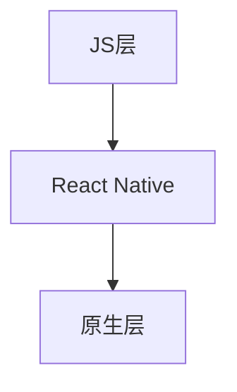

                 

 跨平台移动应用开发已经成为现代移动开发的趋势，而React Native（简称RN）作为一款强大的跨平台框架，极大地简化了开发过程，提高了开发效率。本文将深入探讨React Native的核心概念、算法原理、数学模型、项目实践以及未来展望，旨在为开发者提供全面的技术指导。

## 文章关键词

React Native、跨平台开发、移动应用、JavaScript、原生组件、UI渲染、性能优化、组件化开发、数学模型、算法、项目实践。

## 文章摘要

本文首先介绍了React Native的背景和核心概念，随后详细阐述了其算法原理、数学模型以及项目实践。通过具体的代码实例和详细解释，读者可以深入了解React Native的开发流程和技巧。最后，文章探讨了React Native在实际应用场景中的优势以及未来的发展趋势和挑战。

## 1. 背景介绍

### React Native的起源与发展

React Native是由Facebook于2015年发布的一款开源跨平台移动应用开发框架。它的出现是为了解决原生开发中重复编写代码的痛点，通过使用JavaScript和React原理，React Native允许开发者使用一套代码库同时构建iOS和Android应用。自推出以来，React Native迅速赢得了开发者的青睐，并在多个领域得到广泛应用。

### 跨平台开发的重要性

跨平台开发的重要性不言而喻。一方面，它能够显著提高开发效率，减少开发时间和成本。另一方面，它能够确保应用在不同平台上的一致性，提供更好的用户体验。随着移动设备的普及，跨平台开发已成为企业不可或缺的战略。

### React Native的优势

React Native具有以下优势：

1. **代码复用**：React Native通过JSX语法，实现了一套代码库同时构建iOS和Android应用。
2. **高性能**：React Native利用原生组件渲染，保证了应用的高性能。
3. **丰富的生态系统**：React Native拥有丰富的第三方库和插件，满足各种开发需求。
4. **社区支持**：React Native拥有庞大的开发者社区，解决了开发者在使用过程中遇到的问题。

## 2. 核心概念与联系

### React Native架构

React Native的架构分为两层：JS层和原生层。

- **JS层**：开发者使用JavaScript编写应用逻辑和UI组件。
- **原生层**：React Native通过原生组件实现UI渲染，同时提供原生功能支持。

### React Native核心概念

1. **组件（Components）**：React Native的基本构建块，用于构建UI界面。
2. **状态（State）**：组件内部的数据存储，用于管理组件的行为和界面。
3. **属性（Props）**：组件外部传递的数据，用于配置组件的属性和行为。

### 架构的 Mermaid 流程图



## 3. 核心算法原理 & 具体操作步骤

### 3.1 算法原理概述

React Native的核心算法是虚拟DOM（Virtual DOM）。虚拟DOM是一种内存中的数据结构，用于表示DOM树。当状态或属性发生变化时，React Native会通过对比虚拟DOM和真实DOM的差异，然后批量更新DOM树，从而提高渲染效率。

### 3.2 算法步骤详解

1. **构建虚拟DOM**：React Native通过组件的JSX语法构建虚拟DOM树。
2. **状态更新**：当组件的状态或属性发生变化时，React Native会触发状态更新。
3. **对比虚拟DOM**：React Native对比虚拟DOM和真实DOM的差异。
4. **批量更新DOM树**：React Native通过批量更新DOM树，从而提高渲染效率。

### 3.3 算法优缺点

**优点**：

- 提高渲染效率：虚拟DOM减少了DOM操作，从而提高了渲染效率。
- 代码复用：React Native允许开发者使用一套代码库同时构建iOS和Android应用。

**缺点**：

- 性能瓶颈：当组件过于复杂或状态更新频繁时，虚拟DOM的对比和更新过程可能会消耗大量资源。
- 学习成本：React Native需要开发者具备一定的React和JavaScript基础。

### 3.4 算法应用领域

React Native广泛应用于移动应用开发，尤其在以下领域具有显著优势：

- 社交应用：如微信、Facebook等，通过React Native实现跨平台界面和功能。
- 商业应用：如电商、金融等，通过React Native实现跨平台业务逻辑和界面。
- 游戏应用：如王者荣耀、炉石传说等，通过React Native实现跨平台游戏体验。

## 4. 数学模型和公式 & 详细讲解 & 举例说明

### 4.1 数学模型构建

React Native中的虚拟DOM对比算法基于差异算法（diff algorithm）。差异算法的核心是构建一个数学模型，用于表示虚拟DOM和真实DOM的差异。

### 4.2 公式推导过程

假设有两个DOM树，分别为V1和V2。差异算法的核心目标是找出V1和V2之间的差异，并用一个数学模型表示。

设V1和V2之间的差异为D，则有：

\[ D = V2 - V1 \]

其中，V1和V2分别表示虚拟DOM和真实DOM。

### 4.3 案例分析与讲解

假设有一个简单的虚拟DOM树，包含一个div元素和一个span元素。当状态更新时，span元素的文本内容发生变化。

```jsx
// 原始虚拟DOM
const V1 = (
  <div>
    <span>原始文本</span>
  </div>
);

// 状态更新后的虚拟DOM
const V2 = (
  <div>
    <span>更新后的文本</span>
  </div>
);
```

通过差异算法，我们可以计算出V1和V2之间的差异：

\[ D = V2 - V1 = <span>更新后的文本</span> - <span>原始文本</span> \]

此时，差异算法会更新真实DOM，将span元素的文本内容从“原始文本”更新为“更新后的文本”。

## 5. 项目实践：代码实例和详细解释说明

### 5.1 开发环境搭建

搭建React Native开发环境需要安装Node.js、Watchman、React Native命令行工具、Xcode和Android Studio。

### 5.2 源代码详细实现

以下是一个简单的React Native项目，用于实现一个简单的计数器。

```jsx
import React, { useState } from 'react';
import { View, Text, Button } from 'react-native';

const Counter = () => {
  const [count, setCount] = useState(0);

  const increment = () => {
    setCount(count + 1);
  };

  const decrement = () => {
    setCount(count - 1);
  };

  return (
    <View>
      <Text>Count: {count}</Text>
      <Button title="+" onPress={increment} />
      <Button title="-" onPress={decrement} />
    </View>
  );
};

export default Counter;
```

### 5.3 代码解读与分析

- **组件结构**：Counter组件包含一个状态变量count和一个状态更新函数setCount。
- **UI渲染**：UI由一个View组件、一个Text组件和两个Button组件组成。
- **状态更新**：当用户点击加号或减号按钮时，increment或decrement函数会被调用，触发状态更新。

### 5.4 运行结果展示

当用户点击加号或减号按钮时，计数器的数值会实时更新，并在屏幕上显示。

## 6. 实际应用场景

### 6.1 社交应用

React Native在社交应用中具有广泛应用，如微信、Facebook等。通过React Native，开发者可以快速构建跨平台的社交界面和功能，提高用户体验。

### 6.2 商业应用

React Native在商业应用中也有广泛应用，如电商、金融等。通过React Native，开发者可以实现跨平台业务逻辑和界面，提高开发效率和用户体验。

### 6.3 游戏应用

React Native在游戏应用中也有一定应用，如王者荣耀、炉石传说等。通过React Native，开发者可以快速构建跨平台游戏界面和功能，提高开发效率和用户体验。

## 7. 工具和资源推荐

### 7.1 学习资源推荐

- React Native官方文档：https://reactnative.dev/docs/getting-started
- 《React Native跨平台开发实战》
- 《React Native技术详解》

### 7.2 开发工具推荐

- Android Studio：https://developer.android.com/studio
- Xcode：https://developer.apple.com/xcode/
- React Native CLI：https://github.com/react-native-community/cli

### 7.3 相关论文推荐

- "A Cross-Platform Framework for Building Native Mobile Apps"
- "Reactive UI Programming with React Native"
- "Practical Considerations for Cross-Platform Mobile Development with React Native"

## 8. 总结：未来发展趋势与挑战

### 8.1 研究成果总结

React Native在跨平台移动应用开发中取得了显著成果，通过虚拟DOM技术和组件化开发，显著提高了开发效率和用户体验。

### 8.2 未来发展趋势

1. **性能优化**：随着移动设备的性能提升，React Native的性能瓶颈将逐渐得到缓解。
2. **生态扩展**：React Native的生态系统将不断扩展，满足更多开发需求。
3. **跨平台融合**：React Native与其他跨平台框架的融合，将实现更强大的跨平台开发能力。

### 8.3 面临的挑战

1. **学习成本**：React Native需要开发者具备一定的React和JavaScript基础，学习成本较高。
2. **性能瓶颈**：当应用过于复杂时，React Native的性能瓶颈可能依然存在。

### 8.4 研究展望

React Native的未来发展趋势是优化性能、扩展生态和实现跨平台融合。通过不断的技术创新和优化，React Native有望在跨平台移动应用开发中发挥更大作用。

## 9. 附录：常见问题与解答

### 9.1 如何解决React Native的性能问题？

**答案**：通过优化组件、减少状态更新、使用原生组件和库等方式，可以有效解决React Native的性能问题。

### 9.2 如何在React Native项目中使用Redux？

**答案**：在React Native项目中，可以通过安装和配置Redux库，实现状态管理。具体的实现方法和配置过程可以参考Redux的官方文档。

### 9.3 React Native和原生开发的区别是什么？

**答案**：React Native使用JavaScript和React原理，通过虚拟DOM和原生组件实现跨平台开发。而原生开发则需要使用不同的编程语言和工具，分别构建iOS和Android应用。

---

作者：禅与计算机程序设计艺术 / Zen and the Art of Computer Programming


