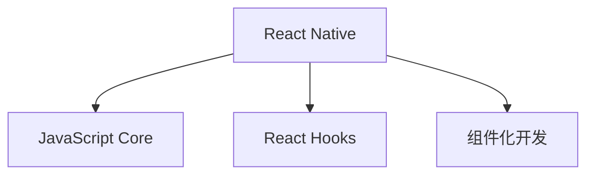

                 

 

> 关键词：React Native、移动应用开发、跨平台、JavaScript、React.js、React Hooks、组件化开发、性能优化

> 摘要：本文将深入探讨React Native框架在移动应用开发领域的应用，分析其核心概念、开发流程、性能优化技巧以及未来发展趋势。通过实例解析，帮助开发者理解如何高效构建跨平台移动应用程序。

## 1. 背景介绍

随着移动互联网的快速发展，移动应用市场日益繁荣。开发者面临着在有限的开发资源下，快速开发高质量、跨平台的应用程序的需求。传统的原生开发（iOS的Swift/Objective-C、Android的Java/Kotlin）虽然性能优越，但开发成本高、周期长。跨平台框架应运而生，其中React Native以其独特的优势成为移动应用开发的热门选择。

React Native由Facebook推出，允许开发者使用JavaScript和React.js编写代码，从而在iOS和Android平台上构建高性能的应用。其核心思想是组件化开发，共享代码，减少重复工作，提高开发效率。React Native的出现，使得开发者能够在不牺牲性能的情况下，实现一次编写，跨平台运行。

## 2. 核心概念与联系

### React Native的核心概念

#### React Native组件

React Native组件是构建应用的基本单元，类似于Web开发中的React组件。每个组件都拥有自己的状态和行为，可以独立开发、测试和优化。组件化开发使得代码更易于管理、复用和维护。

#### JavaScript Core

React Native使用了JavaScript Core作为运行环境，这是一种基于Chakra Core的JavaScript引擎。它提供了高效的执行速度，保证了应用的性能。

#### React Hooks

React Hooks是React 16.8引入的新特性，允许在函数组件中使用状态和生命周期方法。React Hooks使得组件的状态管理和生命周期逻辑更加简洁，提升了代码的可读性和可维护性。

### Mermaid流程图



### 核心概念的联系

React Native通过JavaScript Core运行JavaScript代码，React Hooks提供了在函数组件中管理状态和生命周期的方法，组件化开发实现了代码的模块化和复用。这些核心概念共同构成了React Native的强大架构。

## 3. 核心算法原理 & 具体操作步骤

### 3.1 算法原理概述

React Native的核心算法原理主要包括：

1. **组件渲染原理**：React Native通过Virtual DOM（虚拟DOM）来实现组件的渲染。当组件的状态或属性发生变化时，React Native会将新的状态或属性与Virtual DOM进行比较，并计算出需要进行的最小更新操作，然后更新实际的DOM结构。
   
2. **事件处理原理**：React Native使用原生事件系统处理用户交互。当用户触发某个操作（如点击屏幕），原生事件会被传递到React Native层，然后通过JavaScript进行响应和处理。

### 3.2 算法步骤详解

#### 组件渲染步骤

1. **初始化组件**：创建组件实例，并设置初始状态和属性。
2. **渲染Virtual DOM**：使用JSX语法生成Virtual DOM结构。
3. **更新Virtual DOM**：当组件的状态或属性发生变化时，React Native会比较新的状态或属性与Virtual DOM，计算出需要进行的最小更新操作。
4. **更新DOM结构**：将Virtual DOM的更新应用到实际的DOM结构上。

#### 事件处理步骤

1. **监听原生事件**：React Native会在组件的根元素上监听所有原生事件。
2. **传递事件到JavaScript**：当原生事件发生时，React Native会将事件对象传递到JavaScript层。
3. **处理事件**：在JavaScript层处理事件，如执行特定的函数或修改组件的状态。

### 3.3 算法优缺点

**优点**：

1. **高效的组件渲染**：通过Virtual DOM实现高效的组件渲染，减少DOM操作，提升性能。
2. **丰富的组件库**：React Native拥有丰富的组件库，可以方便地实现各种界面效果。
3. **跨平台开发**：使用JavaScript和React.js开发，可以实现一次编写，跨平台运行。

**缺点**：

1. **性能瓶颈**：在某些复杂场景下，React Native的性能可能低于原生应用。
2. **JavaScript引擎依赖**：React Native依赖于JavaScript Core引擎，可能带来一定的性能开销。

### 3.4 算法应用领域

React Native广泛应用于各类移动应用开发，如社交媒体、电子商务、游戏、金融等。特别是在需要快速迭代、频繁更新的场景中，React Native的优势更为明显。

## 4. 数学模型和公式 & 详细讲解 & 举例说明

### 4.1 数学模型构建

React Native的性能优化可以借助数学模型进行分析。以下是一个简单的数学模型：

#### 时间复杂度模型

$$
T(n) = c \times n \log n
$$

其中，$T(n)$ 表示渲染时间，$n$ 表示组件节点数，$c$ 为常数。

#### 空间复杂度模型

$$
S(n) = c \times n
$$

其中，$S(n)$ 表示内存占用，$n$ 表示组件节点数，$c$ 为常数。

### 4.2 公式推导过程

#### 时间复杂度推导

渲染时间取决于组件节点的数量和树的深度。每个节点需要遍历一次，并进行比较和更新操作。因此，时间复杂度为 $c \times n \log n$。

#### 空间复杂度推导

内存占用主要取决于组件节点的数量。每个节点都需要存储一些状态和属性，因此，空间复杂度为 $c \times n$。

### 4.3 案例分析与讲解

假设有一个包含100个节点的组件树，每个节点都需要进行渲染和更新操作。根据上述数学模型，我们可以计算出：

#### 时间复杂度

$$
T(n) = c \times 100 \log 100 = c \times 100 \times 2 = 200c
$$

渲染时间约为200c毫秒。

#### 空间复杂度

$$
S(n) = c \times 100 = 100c
$$

内存占用约为100c字节。

通过调整组件节点数量和优化渲染算法，我们可以降低时间复杂度和空间复杂度，从而提高React Native的性能。

## 5. 项目实践：代码实例和详细解释说明

### 5.1 开发环境搭建

搭建React Native开发环境需要安装以下工具：

1. **Node.js**：安装最新版本的Node.js。
2. **React Native CLI**：通过npm全局安装React Native CLI。
3. **Android Studio**：安装Android Studio，并配置Android SDK。
4. **Xcode**：安装Xcode，并配置iOS开发环境。

### 5.2 源代码详细实现

以下是一个简单的React Native示例，用于展示React Native组件的基本使用：

```jsx
import React from 'react';
import { View, Text, StyleSheet } from 'react-native';

const App = () => {
  return (
    <View style={styles.container}>
      <Text style={styles.welcome}>Welcome to React Native!</Text>
    </View>
  );
};

const styles = StyleSheet.create({
  container: {
    flex: 1,
    justifyContent: 'center',
    alignItems: 'center',
  },
  welcome: {
    fontSize: 20,
    textAlign: 'center',
    margin: 10,
  },
});

export default App;
```

### 5.3 代码解读与分析

1. **导入模块**：首先，我们引入了React和React Native的核心模块，包括View、Text和StyleSheet。
2. **组件定义**：App组件是一个功能组件，它返回一个View容器，并在容器中包含一个Text元素，用于展示欢迎信息。
3. **样式定义**：使用StyleSheet创建样式对象，用于设置组件的样式。

### 5.4 运行结果展示

运行该示例后，我们将在移动设备或模拟器上看到一个包含“Welcome to React Native!”文本的界面。

## 6. 实际应用场景

React Native在实际应用中具有广泛的应用场景：

1. **社交媒体应用**：如Facebook、Instagram等，React Native可以用于构建高性能的动态内容和交互功能。
2. **电子商务应用**：如Amazon、eBay等，React Native可以实现丰富的商品展示、购物车和支付功能。
3. **游戏应用**：如Gameloft、Supercell等，React Native可以用于开发游戏界面和用户交互。
4. **金融应用**：如银行、投资平台等，React Native可以用于构建复杂的金融图表和数据分析。

## 7. 工具和资源推荐

### 7.1 学习资源推荐

1. **官方文档**：React Native的官方文档是学习React Native的最佳资源。
2. **书籍**：《React Native入门与实践》是一本适合初学者的入门书籍。
3. **在线教程**：有许多在线教程和视频课程，如Udemy、Coursera等。

### 7.2 开发工具推荐

1. **Visual Studio Code**：推荐使用Visual Studio Code进行React Native开发，它提供了丰富的插件和工具支持。
2. **Expo**：Expo是一个开源的开发框架，可以简化React Native的应用开发和部署。

### 7.3 相关论文推荐

1. **"React Native: An Overview"**：介绍了React Native的核心原理和架构。
2. **"Cross-Platform App Development with React Native"**：探讨了React Native在跨平台开发中的应用。

## 8. 总结：未来发展趋势与挑战

### 8.1 研究成果总结

React Native在移动应用开发领域取得了显著成果，其组件化开发、跨平台性能优化等特性受到了开发者的广泛认可。同时，React Native社区活跃，不断有新的工具和库出现，提升了开发效率和项目质量。

### 8.2 未来发展趋势

1. **性能提升**：随着硬件性能的提升和JavaScript引擎的优化，React Native的性能将进一步提升。
2. **生态完善**：React Native生态将继续完善，包括更多的组件库、工具和框架。
3. **更多应用领域**：React Native将在更多领域得到应用，如物联网、增强现实等。

### 8.3 面临的挑战

1. **性能瓶颈**：在处理复杂场景时，React Native的性能可能无法与原生应用相比。
2. **开发者技能要求**：React Native要求开发者具备JavaScript和React.js的基础知识，这对于新手来说可能有一定门槛。

### 8.4 研究展望

React Native在未来将继续发展，其跨平台性能和开发效率的优势将吸引更多开发者。同时，随着技术的不断进步，React Native有望在更多领域发挥重要作用。

## 9. 附录：常见问题与解答

### Q：React Native与原生应用相比，性能如何？

A：React Native在大多数场景下可以接近原生应用的性能，但在处理复杂场景时，性能可能略逊一筹。然而，通过合理的优化和算法改进，React Native的性能可以不断提升。

### Q：React Native是否适合新手学习？

A：是的，React Native适合新手学习。尽管它要求开发者具备JavaScript和React.js的基础知识，但通过官方文档、教程和社区支持，新手可以较快地掌握React Native开发。

### Q：React Native有哪些优点？

A：React Native的优点包括：

1. **跨平台开发**：使用JavaScript和React.js，实现一次编写，跨平台运行。
2. **组件化开发**：提高代码复用性和可维护性。
3. **高效的开发效率**：减少重复工作，提高开发速度。
4. **丰富的组件库**：方便实现各种界面效果。

## 结论

React Native是一种强大的跨平台移动应用开发框架，凭借其组件化开发、高效的开发效率等特性，受到了广大开发者的喜爱。尽管存在一定的性能瓶颈和开发者技能要求，但React Native在未来仍将保持其市场地位，并在更多领域发挥作用。作者：禅与计算机程序设计艺术 / Zen and the Art of Computer Programming。

