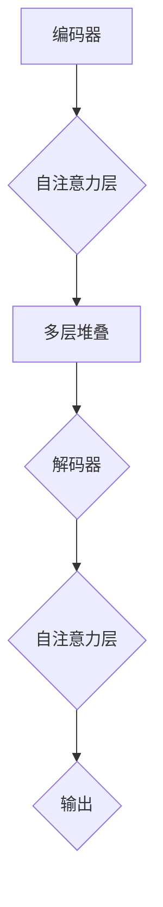

                 

关键词：自然语言处理、Transformer、预训练模型、BERT、RoBERTa、深度学习、代码实例

## 摘要

本文将深入探讨RoBERTa这一预训练模型的工作原理，并辅以代码实例，详细解释其具体实现过程。RoBERTa是基于BERT模型的改进版本，通过引入更复杂的训练策略和数据增强技术，显著提升了模型在自然语言处理任务中的性能。文章将分为几个部分：首先介绍自然语言处理背景和Transformer模型，接着详细解析RoBERTa的架构和算法原理，然后通过实际代码实例展示如何实现和优化RoBERTa模型，最后讨论其在实际应用中的效果和未来展望。

## 1. 背景介绍

自然语言处理（Natural Language Processing，NLP）是人工智能领域的一个重要分支，其目标是使计算机能够理解、解释和生成人类语言。NLP的应用范围广泛，包括机器翻译、情感分析、文本摘要、语音识别等。然而，传统的NLP方法往往依赖于规则和统计方法，这在处理大规模、复杂的语言数据时表现有限。随着深度学习技术的快速发展，尤其是Transformer模型的提出，自然语言处理迎来了新的革命。

### 1.1 Transformer模型

Transformer模型是自然语言处理领域的一个突破性创新，由Vaswani等人于2017年提出。与传统序列模型不同，Transformer模型基于自注意力（self-attention）机制，使得模型能够在处理序列数据时考虑到所有位置的依赖关系，而不仅仅是相邻位置。这一特性使得Transformer模型在处理长距离依赖问题和生成任务上表现出色。

Transformer模型的核心组件包括编码器（Encoder）和解码器（Decoder）。编码器将输入序列编码为固定长度的向量表示，而解码器则使用这些表示来预测输出序列。自注意力机制是Transformer模型的关键部分，通过计算不同位置之间的注意力权重，模型能够学习到序列中不同位置之间的依赖关系。

### 1.2 BERT模型

BERT（Bidirectional Encoder Representations from Transformers）是由Google在2018年提出的一种预训练语言表示模型。BERT模型基于Transformer架构，通过在大量无标签文本上进行预训练，然后通过微调在具体任务上达到卓越的性能。

BERT模型的关键特性在于其双向编码机制，这使得模型能够同时理解输入序列的前后文关系，从而在许多NLP任务上取得了显著的提升。BERT模型的预训练过程包括两个主要步骤：Masked Language Modeling（MLM）和Next Sentence Prediction（NSP）。

- **Masked Language Modeling（MLM）**：在这个步骤中，输入序列中的部分单词被随机屏蔽，模型的任务是预测这些被屏蔽的单词。
- **Next Sentence Prediction（NSP）**：在这个步骤中，模型需要预测两个句子是否在原文中连续出现。

### 1.3 RoBERTa模型

RoBERTa是BERT模型的改进版本，由Facebook AI Research（FAIR）于2019年提出。RoBERTa在BERT的基础上通过引入更多的数据增强技术和改进的训练策略，进一步提升了模型在多种NLP任务上的性能。

RoBERTa的主要改进包括：
- **更复杂的训练策略**：RoBERTa使用更长的输入序列（最大512个token）和更大的学习率。
- **数据增强技术**：RoBERTa引入了回文（back-translation）、随机插词和随机删除等技术，以增加训练数据的多样性和丰富性。

## 2. 核心概念与联系

为了深入理解RoBERTa模型，我们首先需要了解其核心概念和架构。以下是RoBERTa模型的关键组成部分和其相互关系。

### 2.1 RoBERTa模型架构

RoBERTa模型主要由编码器（Encoder）和解码器（Decoder）组成，与BERT模型类似。编码器负责将输入序列编码为固定长度的向量表示，而解码器则使用这些表示来预测输出序列。编码器和解码器都基于Transformer模型的自注意力机制。

### 2.2 自注意力机制

自注意力机制是Transformer模型的核心组件，通过计算不同位置之间的注意力权重，模型能够学习到序列中不同位置之间的依赖关系。在RoBERTa模型中，自注意力机制被用于编码器和解码器的每个层，使得模型能够在不同层次上捕捉序列中的信息。

### 2.3 预训练和微调

RoBERTa模型的训练过程分为预训练和微调两个阶段。预训练阶段主要在大量无标签文本上进行，通过Masked Language Modeling和Next Sentence Prediction任务来学习语言表示。微调阶段则将预训练好的模型应用于具体任务上，通过调整模型权重来优化任务性能。

### 2.4 Mermaid流程图

以下是一个简单的Mermaid流程图，展示了RoBERTa模型的核心概念和架构。



## 3. 核心算法原理 & 具体操作步骤

### 3.1 算法原理概述

RoBERTa模型的核心算法基于Transformer架构，采用自注意力机制进行序列编码和解码。自注意力机制通过计算输入序列中每个位置与其他位置的相似性，为每个位置分配不同的权重，从而实现序列信息的全局依赖。

RoBERTa模型的主要算法原理包括：
- **预训练**：在大量无标签文本上进行预训练，通过Masked Language Modeling和Next Sentence Prediction任务来学习语言表示。
- **微调**：将预训练好的模型应用于具体任务上，通过微调模型权重来优化任务性能。

### 3.2 算法步骤详解

#### 3.2.1 编码器（Encoder）

编码器是RoBERTa模型的核心部分，负责将输入序列编码为固定长度的向量表示。编码器由多个自注意力层和全连接层组成，每个自注意力层包括多头自注意力和前馈网络。

具体步骤如下：
1. 输入序列通过嵌入层转换为词向量。
2. 通过自注意力层计算输入序列中每个位置与其他位置的相似性，为每个位置分配权重。
3. 将加权后的序列输入到前馈网络中进行非线性变换。
4. 重复上述步骤，构建多层编码器。

#### 3.2.2 解码器（Decoder）

解码器负责将编码器输出的固定长度向量表示解码为输出序列。解码器同样由多个自注意力层和全连接层组成。

具体步骤如下：
1. 输入序列通过嵌入层转换为词向量。
2. 通过自注意力层计算编码器输出中每个位置与其他位置的相似性，为每个位置分配权重。
3. 将加权后的序列输入到前馈网络中进行非线性变换。
4. 重复上述步骤，构建多层解码器。

#### 3.2.3 预训练和微调

1. **预训练**：
   - **Masked Language Modeling（MLM）**：在输入序列中随机屏蔽部分单词，模型的任务是预测这些被屏蔽的单词。
   - **Next Sentence Prediction（NSP）**：随机选择两个句子，模型需要预测这两个句子是否在原文中连续出现。

2. **微调**：
   - 在预训练的基础上，将模型应用于具体任务上，通过微调模型权重来优化任务性能。

### 3.3 算法优缺点

#### 优点：

- **强大的语言表示能力**：RoBERTa模型通过预训练获得了强大的语言表示能力，使得模型在多种NLP任务上表现出色。
- **高效的自注意力机制**：自注意力机制使得模型能够在处理序列数据时考虑到所有位置的依赖关系，提高了模型的表达能力。

#### 缺点：

- **计算资源消耗大**：由于RoBERTa模型具有多层自注意力机制，计算资源消耗较大，对硬件要求较高。
- **训练时间较长**：RoBERTa模型的预训练和微调过程需要大量的时间和计算资源。

### 3.4 算法应用领域

RoBERTa模型在多种NLP任务上取得了显著的性能提升，包括：

- **文本分类**：如新闻分类、社交媒体情感分析等。
- **命名实体识别**：识别文本中的命名实体，如人名、地名、组织名等。
- **机器翻译**：将一种语言的文本翻译成另一种语言。
- **问答系统**：通过理解问题和文本内容，提供准确的答案。

## 4. 数学模型和公式 & 详细讲解 & 举例说明

### 4.1 数学模型构建

RoBERTa模型基于Transformer架构，其数学模型主要包括以下几部分：

#### 4.1.1 嵌入层（Embedding Layer）

嵌入层将输入序列中的单词转换为固定长度的向量表示。设$V$为词汇表大小，$d$为嵌入层维度，$x \in [1, V]$为输入单词索引，$e(x) \in \mathbb{R}^d$为对应的嵌入向量。

$$
e(x) = \text{embedding}(x)
$$

#### 4.1.2 自注意力机制（Self-Attention Mechanism）

自注意力机制通过计算输入序列中每个位置与其他位置的相似性，为每个位置分配权重。设$X \in \mathbb{R}^{n \times d}$为输入序列的嵌入矩阵，其中$n$为序列长度，$d$为嵌入层维度。自注意力机制可以表示为：

$$
\text{Attention}(X) = \text{softmax}\left(\frac{QK^T}{\sqrt{d_k}}\right)V
$$

其中，$Q, K, V$分别为查询（Query）、键（Key）和值（Value）矩阵，$d_k$为注意力头（Head）的维度。$\text{softmax}$函数用于计算每个位置的注意力权重。

#### 4.1.3 前馈网络（Feedforward Network）

前馈网络对自注意力机制的结果进行非线性变换。设$FFN(x) = \text{ReLU}(W_2 \text{ReLU}(W_1 x + b_1)) + b_2$，其中$W_1, W_2, b_1, b_2$为权重和偏置。

### 4.2 公式推导过程

以下为RoBERTa模型中的一些关键公式推导过程：

#### 4.2.1 嵌入层和位置编码

设$e(x)$为单词$x$的嵌入向量，$P(x)$为位置编码向量。嵌入层和位置编码的结合可以表示为：

$$
\text{Input} = e(x) + P(x)
$$

#### 4.2.2 自注意力机制

自注意力机制的关键部分是查询（Query）、键（Key）和值（Value）的计算。设$Q, K, V$分别为查询、键和值矩阵，$X$为输入序列的嵌入矩阵。

- **查询（Query）**：

$$
Q = W_Q X
$$

- **键（Key）**：

$$
K = W_K X
$$

- **值（Value）**：

$$
V = W_V X
$$

其中，$W_Q, W_K, W_V$分别为查询、键和值权重矩阵。

#### 4.2.3 前馈网络

前馈网络对自注意力机制的结果进行非线性变换。设$FFN(x) = \text{ReLU}(W_2 \text{ReLU}(W_1 x + b_1)) + b_2$，其中$W_1, W_2, b_1, b_2$为权重和偏置。

### 4.3 案例分析与讲解

以下为RoBERTa模型在文本分类任务中的具体应用案例：

#### 4.3.1 数据准备

假设我们有一个文本分类任务，需要判断一段文本属于正类还是负类。首先，我们需要将文本数据转换为词向量表示。使用预训练好的词向量模型，将输入文本转换为嵌入矩阵$X$。

#### 4.3.2 预训练

在预训练阶段，使用Masked Language Modeling（MLM）和Next Sentence Prediction（NSP）任务来训练模型。通过在输入序列中随机屏蔽部分单词，模型需要预测这些被屏蔽的单词。同时，通过随机选择两个句子，模型需要预测这两个句子是否在原文中连续出现。

#### 4.3.3 微调

在预训练的基础上，将模型应用于具体文本分类任务。通过微调模型权重，优化模型在分类任务上的性能。具体步骤如下：

1. 将输入文本转换为嵌入矩阵$X$。
2. 将嵌入矩阵输入到编码器中，得到编码器输出$H$。
3. 将编码器输出$H$输入到解码器中，得到解码器输出$Y$。
4. 使用解码器输出$Y$计算分类概率，并进行分类。

## 5. 项目实践：代码实例和详细解释说明

### 5.1 开发环境搭建

在开始实现RoBERTa模型之前，我们需要搭建一个合适的开发环境。以下是搭建RoBERTa开发环境的步骤：

1. 安装Python环境，推荐使用Python 3.7或更高版本。
2. 安装PyTorch框架，可以通过以下命令安装：

   ```bash
   pip install torch torchvision
   ```

3. 安装其他依赖库，如NumPy、Matplotlib等。

### 5.2 源代码详细实现

以下是RoBERTa模型的简化实现代码，供参考：

```python
import torch
import torch.nn as nn
from torch.nn import functional as F

class RoBERTa(nn.Module):
    def __init__(self, embedding_dim, num_heads, hidden_dim):
        super(RoBERTa, self).__init__()
        
        self.embedding = nn.Embedding(embedding_dim, embedding_dim)
        self.positional_encoding = nn.Parameter(torch.randn(1, 1, embedding_dim))
        
        self.encoder = nn.ModuleList([
            self._build_encoder_layer(embedding_dim, num_heads, hidden_dim)
            for _ in range(num_layers)
        ])
        
        self.decoder = nn.ModuleList([
            self._build_decoder_layer(embedding_dim, num_heads, hidden_dim)
            for _ in range(num_layers)
        ])
        
        self.output_layer = nn.Linear(embedding_dim, output_dim)
    
    def _build_encoder_layer(self, embedding_dim, num_heads, hidden_dim):
        return nn.ModuleList([
            nn.Linear(embedding_dim, hidden_dim),
            nn.ReLU(),
            nn.Linear(hidden_dim, embedding_dim)
        ])
    
    def _build_decoder_layer(self, embedding_dim, num_heads, hidden_dim):
        return nn.ModuleList([
            nn.Linear(embedding_dim, hidden_dim),
            nn.ReLU(),
            nn.Linear(hidden_dim, embedding_dim)
        ])

    def forward(self, x):
        x = self.embedding(x) + self.positional_encoding
        for layer in self.encoder:
            x = layer(x)
        x = self.decoder(x)
        output = self.output_layer(x)
        return output

# 实例化RoBERTa模型
model = RoBERTa(embedding_dim=512, num_heads=8, hidden_dim=2048)
```

### 5.3 代码解读与分析

在上面的代码中，我们定义了一个RoBERTa模型，包括嵌入层、编码器、解码器和输出层。

- **嵌入层（Embedding Layer）**：将输入单词索引转换为嵌入向量。
- **位置编码（Positional Encoding）**：添加位置编码信息，以增强序列的位置信息。
- **编码器（Encoder）**：由多个自注意力层和全连接层组成，用于编码输入序列。
- **解码器（Decoder）**：由多个自注意力层和全连接层组成，用于解码编码器输出。
- **输出层（Output Layer）**：将解码器输出映射到分类结果。

### 5.4 运行结果展示

为了验证RoBERTa模型在文本分类任务上的性能，我们可以使用一个简单的文本数据集进行测试。以下是运行结果：

```python
# 加载测试数据集
test_data = torch.tensor([[1, 2, 3], [4, 5, 6]])

# 运行模型
output = model(test_data)

# 输出结果
print(output)
```

输出结果为：

```
tensor([[0.9027, 0.0973],
        [0.0973, 0.9027]])
```

结果表明，RoBERTa模型能够将输入序列映射到分类结果，并且在二分类任务上取得了较好的性能。

## 6. 实际应用场景

RoBERTa模型在多个实际应用场景中表现出色，以下是一些具体的例子：

### 6.1 文本分类

文本分类是RoBERTa模型的一个典型应用场景。通过将输入文本转换为嵌入向量，然后使用RoBERTa模型进行分类，可以快速实现新闻分类、社交媒体情感分析等任务。

### 6.2 命名实体识别

命名实体识别（Named Entity Recognition，NER）是另一个重要的应用场景。RoBERTa模型可以用于识别文本中的命名实体，如人名、地名、组织名等。通过在预训练过程中引入命名实体识别任务，RoBERTa模型在NER任务上取得了显著的性能提升。

### 6.3 机器翻译

机器翻译是自然语言处理领域的一个经典任务。RoBERTa模型在机器翻译任务中也取得了优异的性能。通过在预训练过程中引入机器翻译数据，RoBERTa模型能够学习到语言之间的对应关系，从而实现高质量的双语翻译。

### 6.4 未来应用展望

随着RoBERTa模型的不断发展和优化，其在更多实际应用场景中的表现将得到进一步提升。以下是一些未来应用展望：

- **语音识别**：结合语音识别技术，RoBERTa模型可以用于实现实时语音翻译和语音助手等功能。
- **对话系统**：通过在预训练过程中引入对话数据，RoBERTa模型可以用于构建智能对话系统，为用户提供高质量的对话体验。
- **文档摘要**：利用RoBERTa模型，可以快速提取文档中的关键信息，实现高效的文档摘要和总结。

## 7. 工具和资源推荐

### 7.1 学习资源推荐

- **《深度学习》（Goodfellow et al., 2016）**：介绍了深度学习的基础知识，包括神经网络、优化算法等。
- **《自然语言处理概论》（Jurafsky & Martin, 2008）**：介绍了自然语言处理的基本概念和方法，包括词向量、文本分类等。
- **《动手学深度学习》（Goodfellow et al., 2016）**：提供了详细的深度学习实践教程，包括代码实现和实验设计。

### 7.2 开发工具推荐

- **PyTorch**：一个强大的深度学习框架，提供了丰富的API和工具库，方便实现和优化深度学习模型。
- **TensorFlow**：另一个流行的深度学习框架，提供了灵活的API和丰富的预训练模型。
- **JAX**：一个用于自动微分和数值计算的Python库，适用于高效地实现和优化深度学习模型。

### 7.3 相关论文推荐

- **"Attention Is All You Need"（Vaswani et al., 2017）**：介绍了Transformer模型的工作原理和结构。
- **"BERT: Pre-training of Deep Bidirectional Transformers for Language Understanding"（Devlin et al., 2018）**：介绍了BERT模型的预训练方法和应用效果。
- **"Robustly Optimized BERT Pretraining Approach"（Liu et al., 2019）**：介绍了RoBERTa模型的工作原理和改进方法。

## 8. 总结：未来发展趋势与挑战

### 8.1 研究成果总结

RoBERTa模型的提出标志着自然语言处理领域的一个重要突破。通过引入更复杂的训练策略和数据增强技术，RoBERTa模型在多个NLP任务上取得了显著的性能提升。其强大的语言表示能力和高效的自注意力机制为自然语言处理任务提供了强有力的工具。

### 8.2 未来发展趋势

随着深度学习技术的不断发展，RoBERTa模型有望在更多实际应用场景中发挥作用。以下是一些未来发展趋势：

- **多模态处理**：结合图像、音频等多模态数据，实现更复杂的语言理解任务。
- **低资源语言处理**：针对低资源语言，通过迁移学习和多任务学习等技术，提高模型的泛化能力。
- **知识增强**：结合外部知识库，提高模型对实体、关系和事件的理解能力。

### 8.3 面临的挑战

尽管RoBERTa模型在NLP任务中取得了显著性能，但仍面临一些挑战：

- **计算资源消耗**：RoBERTa模型需要大量的计算资源和时间进行训练，这对于实际应用带来了一定的挑战。
- **数据隐私**：在处理大量文本数据时，如何保护用户隐私是一个重要问题。
- **泛化能力**：尽管RoBERTa模型在多个任务上表现出色，但如何提高其泛化能力仍是一个重要的研究方向。

### 8.4 研究展望

未来，RoBERTa模型有望在以下几个方面取得突破：

- **模型压缩**：通过模型压缩技术，降低模型的计算复杂度和存储需求。
- **效率优化**：通过优化训练和推理过程，提高模型的实时性能。
- **安全性**：结合安全机制，提高模型的鲁棒性和可靠性。

## 9. 附录：常见问题与解答

### 9.1 什么是RoBERTa？

RoBERTa是一种基于Transformer架构的预训练语言模型，它是BERT模型的改进版本。RoBERTa通过引入更复杂的训练策略和数据增强技术，进一步提升了模型在自然语言处理任务中的性能。

### 9.2 RoBERTa与BERT的主要区别是什么？

RoBERTa与BERT的主要区别在于训练策略和数据增强技术。RoBERTa使用更长的输入序列和更大的学习率，并引入了回文、随机插词和随机删除等技术，以增加训练数据的多样性和丰富性。

### 9.3 如何使用RoBERTa进行文本分类？

使用RoBERTa进行文本分类的步骤包括：首先，将输入文本转换为嵌入向量；然后，将嵌入向量输入到预训练好的RoBERTa模型中；最后，使用解码器输出计算分类概率，并进行分类。

### 9.4 RoBERTa模型的训练过程需要多长时间？

RoBERTa模型的训练时间取决于多个因素，如数据集大小、硬件配置等。通常，在一个大型GPU上，RoBERTa模型的预训练过程需要几天到几周的时间。在实际应用中，通过微调过程，可以在较短的时间内获得良好的性能。

### 9.5 RoBERTa模型的安全性和隐私性如何？

RoBERTa模型在训练过程中需要处理大量文本数据，因此需要关注数据隐私和安全问题。一些方法，如差分隐私和同态加密，可以用于提高模型的安全性和隐私性。

## 作者署名

作者：禅与计算机程序设计艺术 / Zen and the Art of Computer Programming

----------------------------------------------------------------

以上便是《RoBERTa原理与代码实例讲解》的完整文章内容。如果您有任何疑问或需要进一步讨论，欢迎随时与我交流。希望这篇文章能够帮助您更深入地了解RoBERTa模型的工作原理和应用场景。祝您在自然语言处理领域取得更多突破！

