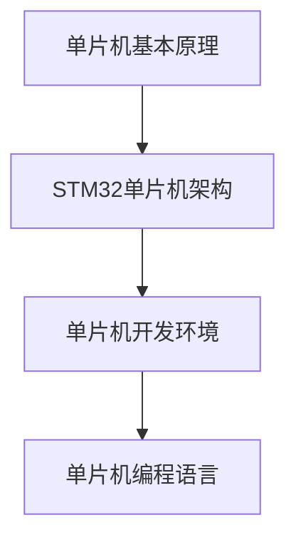

                 

关键词：STM32单片机、嵌入式系统、LED点亮、复杂控制系统、开发环境、代码实例、应用领域、未来展望

摘要：本文旨在介绍STM32单片机的基本开发流程，从最基础的LED点亮到构建复杂的控制系统，帮助读者掌握STM32单片机的开发技巧和应用方法。

## 1. 背景介绍

### STM32单片机的概述
STM32单片机是由STMicroelectronics公司推出的一系列高性能、低成本的微控制器。它广泛应用于嵌入式系统中，具有高性能、低功耗、丰富的外设接口等特点。

### 嵌入式系统的概念
嵌入式系统是指嵌入在其他设备中的计算机系统，它执行特定的功能，不受用户的直接控制。STM32单片机作为嵌入式系统的重要组成部分，承担了系统控制、数据处理、通信等功能。

## 2. 核心概念与联系

### 单片机基本原理
单片机是一种具有中央处理单元（CPU）、存储器、输入输出接口等功能的微型计算机系统。STM32单片机的工作原理主要包括指令集、寄存器、外设接口等方面。

### STM32单片机架构
STM32单片机采用ARM Cortex-M内核，具有高性能和低功耗的特点。其架构包括核心处理单元、存储器子系统、外设接口、电源管理等模块。

### 单片机开发环境
单片机开发环境主要包括集成开发环境（IDE）、编程语言、调试工具等。常用的开发环境有STM32CubeIDE、Keil uVision等。

### 单片机编程语言
单片机编程通常采用C语言。C语言具有丰富的库函数和强大的数据类型，适合进行嵌入式系统开发。

### Mermaid流程图

## 3. 核心算法原理 & 具体操作步骤

### 3.1 算法原理概述
单片机的工作原理主要包括指令执行、寄存器操作、外设控制等方面。通过编写适当的程序代码，可以实现各种功能。

### 3.2 算法步骤详解
1. 初始化单片机硬件资源，如时钟、GPIO等。
2. 编写主程序，实现功能逻辑。
3. 调试程序，确保功能正确。

### 3.3 算法优缺点
- 优点：灵活性强、可定制化、成本低。
- 缺点：开发难度较大、对开发者要求较高。

### 3.4 算法应用领域
STM32单片机广泛应用于智能家居、工业自动化、医疗设备、通信设备等领域。

## 4. 数学模型和公式 & 详细讲解 & 举例说明

### 4.1 数学模型构建
单片机编程中，常用的数学模型包括数字滤波、PID控制等。

### 4.2 公式推导过程
- 数字滤波公式：$$y(n) = (1 - \alpha)y(n-1) + \alpha x(n)$$
- PID控制公式：$$u(t) = K_p e(t) + K_i \int_{0}^{t} e(\tau)d\tau + K_d \frac{de(t)}{dt}$$

### 4.3 案例分析与讲解
以数字滤波为例，介绍如何通过编程实现数字滤波器。

## 5. 项目实践：代码实例和详细解释说明

### 5.1 开发环境搭建
搭建STM32单片机开发环境，包括安装STM32CubeIDE、下载相应的硬件驱动程序等。

### 5.2 源代码详细实现
以点亮LED为例，介绍如何编写单片机程序。

### 5.3 代码解读与分析
分析代码中的关键部分，如GPIO配置、定时器配置等。

### 5.4 运行结果展示
展示程序运行的效果，如LED灯的点亮和熄灭。

## 6. 实际应用场景

### 6.1 智能家居
STM32单片机可以用于智能门锁、智能照明等设备中。

### 6.2 工业自动化
STM32单片机可以用于工业机器人、自动化生产线等设备中。

### 6.3 医疗设备
STM32单片机可以用于医疗监护设备、医疗器械等。

### 6.4 通信设备
STM32单片机可以用于无线通信设备、网络通信设备等。

## 7. 工具和资源推荐

### 7.1 学习资源推荐
- 《STM32单片机开发实战》
- 《嵌入式系统设计》

### 7.2 开发工具推荐
- STM32CubeIDE
- Keil uVision

### 7.3 相关论文推荐
- “STM32单片机的开发与应用”
- “基于STM32单片机的智能家居系统设计”

## 8. 总结：未来发展趋势与挑战

### 8.1 研究成果总结
STM32单片机在嵌入式系统中的应用越来越广泛，未来发展趋势包括更高效、更智能的控制系统。

### 8.2 未来发展趋势
- 更高效的控制算法
- 更智能的系统集成
- 更广泛的应用领域

### 8.3 面临的挑战
- 开发者技能要求提高
- 面对复杂系统的设计难度

### 8.4 研究展望
随着技术的发展，STM32单片机在嵌入式系统中的应用前景将更加广阔。

## 9. 附录：常见问题与解答

### 9.1 如何选择STM32单片机？
根据应用场景和需求，选择合适的型号。

### 9.2 如何学习STM32单片机开发？
可以通过在线课程、书籍、论坛等途径学习。

### 9.3 如何调试STM32单片机程序？
可以使用集成开发环境中的调试工具进行调试。

----------------------------------------------------------------

作者：禅与计算机程序设计艺术 / Zen and the Art of Computer Programming

