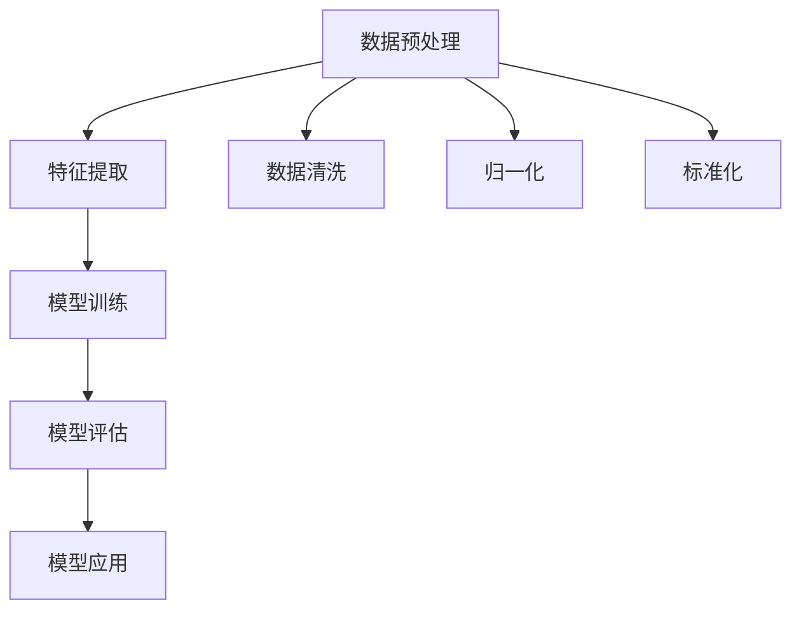

                 

关键词：Scikit-learn，机器学习，数据科学，算法原理，代码实战，数据预处理，模型评估，Python库

摘要：本文将深入探讨Scikit-learn这一强大的Python机器学习库，从其核心概念、算法原理到实际应用，全面解析其在数据科学领域的广泛应用。通过详细的代码实例和解释，读者将能够掌握Scikit-learn的使用方法，为未来的机器学习项目打下坚实的基础。

## 1. 背景介绍

Scikit-learn是一个开源的Python机器学习库，它基于SciPy构建，旨在提供简单有效的机器学习算法和工具。Scikit-learn广泛应用于数据挖掘、数据分析、自然语言处理等领域，它以其强大的功能和易用的接口受到了广泛好评。本文将围绕Scikit-learn的核心概念、算法原理、数学模型及其实际应用进行深入讲解。

### 1.1 Scikit-learn的重要性

在当今数据科学和机器学习快速发展的时代，Scikit-learn的重要性不容忽视。它不仅提供了丰富的算法库，而且通过简洁的接口使得算法的实现变得简单易懂。这使得研究人员和工程师能够更加专注于算法的创新和应用，而无需担心底层实现的复杂性。

### 1.2 Scikit-learn的应用领域

Scikit-learn在多个领域都有着广泛的应用。例如：

- **数据挖掘**：用于探索性数据分析、聚类、分类等任务。
- **自然语言处理**：用于文本分类、情感分析等任务。
- **图像处理**：用于图像识别、图像分割等任务。
- **推荐系统**：用于构建个性化推荐算法。

### 1.3 本文结构

本文将按以下结构展开：

- **第1章**：背景介绍，概述Scikit-learn的基本概念和应用领域。
- **第2章**：核心概念与联系，详细讲解Scikit-learn中的核心算法和架构。
- **第3章**：核心算法原理与具体操作步骤，深入剖析算法的实现细节。
- **第4章**：数学模型和公式，讲解相关的数学背景和推导过程。
- **第5章**：项目实践，通过代码实例展示算法的应用。
- **第6章**：实际应用场景，探讨Scikit-learn在不同领域的应用。
- **第7章**：工具和资源推荐，推荐学习资源和开发工具。
- **第8章**：总结与展望，总结研究成果，展望未来发展。

<|assistant|>## 2. 核心概念与联系

在深入探讨Scikit-learn之前，我们需要了解其核心概念和算法架构。Scikit-learn提供了多种常用的机器学习算法，包括分类、回归、聚类、降维等。这些算法共同构成了Scikit-learn的核心，为数据科学家和工程师提供了强大的工具。

### 2.1 核心算法

Scikit-learn中的核心算法包括：

- **分类算法**：如逻辑回归、支持向量机（SVM）、随机森林、K最近邻（KNN）等。
- **回归算法**：如线性回归、岭回归、LASSO回归等。
- **聚类算法**：如K-means、层次聚类、DBSCAN等。
- **降维算法**：如主成分分析（PCA）、t-SNE等。

这些算法各有特点，适用于不同的数据类型和任务。

### 2.2 架构

Scikit-learn的架构设计简洁明了，主要分为以下几个层次：

- **数据预处理**：包括数据清洗、归一化、标准化等。
- **特征提取**：通过特征选择和特征变换提高模型的性能。
- **模型训练**：通过训练算法学习数据中的规律。
- **模型评估**：使用交叉验证、精度、召回率等指标评估模型性能。
- **模型应用**：将训练好的模型应用于新的数据集进行预测。

### 2.3 Mermaid 流程图

为了更直观地展示Scikit-learn的架构，我们可以使用Mermaid绘制一个流程图：



在上面的流程图中，我们从数据预处理开始，通过特征提取准备训练数据，然后进行模型训练，评估模型性能，最后将模型应用于新的数据集进行预测。

### 2.4 核心概念与联系的深入解析

Scikit-learn中的核心概念和算法架构紧密相连，每个环节都至关重要。例如：

- **数据预处理**：数据预处理是模型训练的基础，良好的数据预处理可以显著提高模型性能。数据清洗、归一化和标准化等操作确保了数据的准确性和一致性。
- **特征提取**：特征提取是通过变换和选择数据中的关键特征来提高模型的表现。主成分分析（PCA）等降维技术可以帮助我们识别数据中的主要结构，从而减少数据维度。
- **模型训练**：模型训练是通过算法学习数据中的规律，构建模型。不同的算法有不同的训练方法，如梯度下降、随机梯度下降等。
- **模型评估**：模型评估是验证模型性能的重要环节。交叉验证、精度、召回率等指标可以帮助我们判断模型的泛化能力。
- **模型应用**：模型应用是将训练好的模型应用于新的数据集，进行预测。在实际应用中，我们需要不断迭代和优化模型，以适应不断变化的数据。

### 2.5 总结

通过了解Scikit-learn的核心概念和算法架构，我们可以更好地理解其工作原理和应用场景。在接下来的章节中，我们将深入探讨Scikit-learn中的核心算法原理和具体操作步骤，帮助读者掌握这一强大的工具。

<|assistant|>### 3. 核心算法原理与具体操作步骤

在Scikit-learn中，核心算法包括分类、回归、聚类和降维等多种类型。本章节将详细讲解这些算法的原理和具体操作步骤，帮助读者深入理解Scikit-learn的使用方法。

#### 3.1 算法原理概述

1. **分类算法**：分类算法用于将数据分为不同的类别。常见的分类算法包括逻辑回归、支持向量机（SVM）、随机森林和K最近邻（KNN）等。分类算法的核心思想是通过学习训练数据中的特征和标签之间的关系，构建一个分类模型，然后使用这个模型对新的数据进行预测。

2. **回归算法**：回归算法用于预测连续值。常见的回归算法包括线性回归、岭回归和LASSO回归等。回归算法的核心思想是通过学习训练数据中的特征和目标值之间的关系，构建一个回归模型，然后使用这个模型对新的数据进行预测。

3. **聚类算法**：聚类算法用于将数据分为不同的簇。常见的聚类算法包括K-means、层次聚类和DBSCAN等。聚类算法的核心思想是通过分析数据点之间的相似性，将数据点划分为不同的簇。

4. **降维算法**：降维算法用于减少数据的维度，同时保留数据的结构。常见的方法包括主成分分析（PCA）和t-SNE等。降维算法的核心思想是通过提取数据中的主要结构，降低数据维度，从而简化数据的处理过程。

#### 3.2 算法步骤详解

1. **数据预处理**：

   - **数据清洗**：去除或填补缺失值，处理异常值。
   - **归一化**：将数据缩放到相同的尺度，消除量纲影响。
   - **标准化**：将数据转换为标准正态分布，便于计算。

2. **模型训练**：

   - **分类算法**：选择分类器模型，如逻辑回归、SVM等。使用训练数据训练模型，调整模型的参数。
   - **回归算法**：选择回归模型，如线性回归、岭回归等。使用训练数据训练模型，调整模型的参数。
   - **聚类算法**：选择聚类算法，如K-means、层次聚类等。根据训练数据确定簇的数量，计算聚类中心。
   - **降维算法**：选择降维方法，如PCA、t-SNE等。使用训练数据计算主成分或嵌入空间。

3. **模型评估**：

   - **交叉验证**：将数据集划分为多个子集，依次训练和评估模型，计算模型在各个子集上的性能指标。
   - **精度、召回率**：计算分类模型的精度和召回率，评估模型的分类能力。
   - **均方误差、均方根误差**：计算回归模型的均方误差和均方根误差，评估模型的预测能力。

4. **模型应用**：

   - **新数据预测**：使用训练好的模型对新的数据进行预测。
   - **模型优化**：根据预测结果和评估指标，调整模型参数，优化模型性能。

#### 3.3 算法优缺点

1. **分类算法**：

   - **优点**：易于理解和实现，适用于各种分类问题。
   - **缺点**：对非线性数据分类效果较差，可能存在过拟合问题。

2. **回归算法**：

   - **优点**：适用于各种回归问题，预测准确。
   - **缺点**：对异常值和噪声敏感，可能存在欠拟合问题。

3. **聚类算法**：

   - **优点**：无需事先指定类别，适用于无监督学习。
   - **缺点**：对噪声和异常值敏感，聚类结果可能不稳定。

4. **降维算法**：

   - **优点**：减少数据维度，提高数据处理效率。
   - **缺点**：可能丢失数据的信息，对非线性结构处理能力有限。

#### 3.4 算法应用领域

1. **分类算法**：

   - **应用领域**：文本分类、图像分类、情感分析等。
   - **实例**：使用逻辑回归进行文本分类，使用SVM进行图像分类。

2. **回归算法**：

   - **应用领域**：房屋价格预测、股票价格预测等。
   - **实例**：使用线性回归预测房屋价格，使用岭回归预测股票价格。

3. **聚类算法**：

   - **应用领域**：市场细分、社交网络分析等。
   - **实例**：使用K-means进行市场细分，使用DBSCAN进行社交网络分析。

4. **降维算法**：

   - **应用领域**：图像处理、文本分析等。
   - **实例**：使用PCA进行图像降维，使用t-SNE进行文本降维。

通过了解核心算法的原理和具体操作步骤，我们可以更好地利用Scikit-learn解决实际问题。在接下来的章节中，我们将进一步探讨Scikit-learn中的数学模型和公式，帮助读者深入理解算法的实现细节。

<|assistant|>### 4. 数学模型和公式 & 详细讲解 & 举例说明

在机器学习领域，数学模型和公式是构建和优化算法的基础。Scikit-learn中的算法大多依赖于这些数学模型，因此了解这些模型和公式的推导过程对于深入理解和使用Scikit-learn至关重要。本章节将详细介绍几个核心算法的数学模型和公式，并通过具体例子进行说明。

#### 4.1 数学模型构建

机器学习中的数学模型通常可以分为线性模型和非线性模型。线性模型包括线性回归和逻辑回归等，而非线性模型包括支持向量机（SVM）、决策树等。以下是一些核心数学模型的概述：

1. **线性回归**：
   线性回归模型试图找到一条直线来拟合数据点，公式如下：
   $$
   y = \beta_0 + \beta_1x
   $$
   其中，$y$是目标变量，$x$是自变量，$\beta_0$是截距，$\beta_1$是斜率。

2. **逻辑回归**：
   逻辑回归是一种概率型线性回归模型，用于分类任务。其公式为：
   $$
   \log\left(\frac{p}{1-p}\right) = \beta_0 + \beta_1x
   $$
   其中，$p$是事件发生的概率，$\log$是自然对数函数。

3. **支持向量机（SVM）**：
   SVM通过找到一个最佳的超平面来最大化分类边界。其目标函数为：
   $$
   \min_{\beta, \beta_0} \frac{1}{2}\|\beta\|^2 + C\sum_{i=1}^n \xi_i
   $$
   其中，$\beta$是权重向量，$\beta_0$是偏置项，$C$是惩罚参数，$\xi_i$是松弛变量。

4. **K-means聚类**：
   K-means聚类算法通过最小化数据点到聚类中心的距离平方和来划分数据点。其目标函数为：
   $$
   J = \sum_{i=1}^k \sum_{x_j \in S_i} \|x_j - \mu_i\|^2
   $$
   其中，$k$是聚类个数，$S_i$是第$i$个聚类，$\mu_i$是聚类中心。

#### 4.2 公式推导过程

1. **线性回归**：

   线性回归模型的推导过程基于最小二乘法。假设我们有数据集$(x_i, y_i)$，其中$x_i$是自变量，$y_i$是因变量。线性回归模型试图找到一条直线$y = \beta_0 + \beta_1x$来最小化误差平方和：
   $$
   \min \sum_{i=1}^n (y_i - (\beta_0 + \beta_1x_i))^2
   $$
   对$\beta_0$和$\beta_1$求偏导并令偏导数为零，可以得到最优的参数：
   $$
   \beta_0 = \bar{y} - \beta_1\bar{x}, \quad \beta_1 = \frac{\sum_{i=1}^n (x_i - \bar{x})(y_i - \bar{y})}{\sum_{i=1}^n (x_i - \bar{x})^2}
   $$
   其中，$\bar{x}$和$\bar{y}$分别是$x$和$y$的均值。

2. **逻辑回归**：

   逻辑回归的推导基于最大似然估计。假设我们有二分类数据集，其中每个样本有两个特征$x_1$和$x_2$，以及标签$y$（0或1）。逻辑回归模型试图找到最佳的概率函数：
   $$
   \log\left(\frac{p}{1-p}\right) = \beta_0 + \beta_1x_1 + \beta_2x_2
   $$
   其中，$p$是$y=1$的概率。对数似然函数为：
   $$
   \sum_{i=1}^n y_i\log(p_i) + (1-y_i)\log(1-p_i)
   $$
   对$\beta_0$、$\beta_1$和$\beta_2$求偏导并令偏导数为零，可以得到最优的参数。

3. **支持向量机（SVM）**：

   SVM的推导基于拉格朗日乘数法和最大间隔分类器。假设数据集$(x_i, y_i)$，其中$x_i$是特征向量，$y_i$是标签（+1或-1）。SVM的目标是最小化间隔并最大化分类边界：
   $$
   \min_{\beta, \beta_0} \frac{1}{2}\|\beta\|^2 + C\sum_{i=1}^n \xi_i
   $$
   其中，$\xi_i$是松弛变量，$C$是惩罚参数。拉格朗日函数为：
   $$
   L(\beta, \beta_0, \xi) = \frac{1}{2}\|\beta\|^2 - \sum_{i=1}^n y_i(\beta \cdot x_i + \beta_0) + C\sum_{i=1}^n \xi_i
   $$
   使用KKT条件求解，可以得到最优的$\beta$和$\beta_0$。

4. **K-means聚类**：

   K-means聚类算法的目标是找到$k$个聚类中心，使得数据点到聚类中心的距离平方和最小。假设每个聚类中心为$\mu_i$，每个数据点为$x_j$，则目标函数为：
   $$
   J = \sum_{i=1}^k \sum_{x_j \in S_i} \|x_j - \mu_i\|^2
   $$
   在每次迭代中，算法会更新聚类中心$\mu_i$和数据点的分配，直到目标函数收敛。

#### 4.3 案例分析与讲解

以下通过一个具体的例子来讲解这些数学模型的实际应用。

**例1：线性回归**

假设我们有一个数据集，其中包含自变量$x$和因变量$y$，如下表所示：

| x | y  |
|---|----|
| 1 | 2  |
| 2 | 4  |
| 3 | 6  |
| 4 | 8  |

我们需要使用线性回归模型来拟合这些数据点。首先，我们计算$x$和$y$的均值：
$$
\bar{x} = \frac{1+2+3+4}{4} = 2.5, \quad \bar{y} = \frac{2+4+6+8}{4} = 5
$$
然后，我们计算斜率$\beta_1$和截距$\beta_0$：
$$
\beta_1 = \frac{(1-2.5)(2-5) + (2-2.5)(4-5) + (3-2.5)(6-5) + (4-2.5)(8-5)}{(1-2.5)^2 + (2-2.5)^2 + (3-2.5)^2 + (4-2.5)^2} = 2
$$
$$
\beta_0 = \bar{y} - \beta_1\bar{x} = 5 - 2 \times 2.5 = 0
$$
因此，线性回归模型为$y = 2x$。我们可以使用这个模型来预测新的数据点，例如当$x=5$时，$y=10$。

**例2：逻辑回归**

假设我们有一个二分类数据集，如下表所示：

| x1 | x2 | y  |
|----|----|----|
| 1  | 2  | 1  |
| 2  | 4  | 1  |
| 3  | 6  | 0  |
| 4  | 8  | 0  |

我们需要使用逻辑回归模型来预测$y$的概率。首先，我们计算均值：
$$
\bar{x1} = \frac{1+2+3+4}{4} = 2.5, \quad \bar{x2} = \frac{2+4+6+8}{4} = 5
$$
$$
\bar{y} = \frac{1+1+0+0}{4} = 0.5
$$
然后，我们设置一个简单的逻辑回归模型：
$$
\log\left(\frac{p}{1-p}\right) = \beta_0 + \beta_1x1 + \beta_2x2
$$
我们假设$\beta_0 = \beta_1 = \beta_2 = 0$，并使用最大似然估计来优化这些参数。通过迭代计算，我们可以得到最优的$\beta_0$、$\beta_1$和$\beta_2$，从而构建一个有效的逻辑回归模型。

通过以上例子，我们可以看到数学模型和公式在实际应用中的重要性。理解这些模型的推导过程和计算方法，将帮助我们更好地利用Scikit-learn解决实际问题。

### 4.4 总结

在本章节中，我们详细介绍了Scikit-learn中核心算法的数学模型和公式，并通过具体例子进行了说明。这些数学模型是构建和优化算法的基础，深入理解它们对于掌握Scikit-learn至关重要。在接下来的章节中，我们将通过项目实践进一步展示Scikit-learn的实际应用。

<|assistant|>### 5. 项目实践：代码实例和详细解释说明

为了更好地理解和掌握Scikit-learn的使用方法，我们将通过一个实际的项目实践来展示其应用。本节将以一个简单的鸢尾花（Iris）数据集为例，演示如何使用Scikit-learn进行数据处理、模型训练、模型评估和模型应用。

#### 5.1 开发环境搭建

在开始项目之前，我们需要搭建开发环境。首先，确保Python环境已经安装。接下来，安装Scikit-learn和其他必要的库，例如NumPy和Matplotlib。以下是一个简单的安装命令：

```shell
pip install numpy scikit-learn matplotlib
```

#### 5.2 源代码详细实现

以下是使用Scikit-learn进行鸢尾花数据集项目的主要代码实现：

```python
import numpy as np
import matplotlib.pyplot as plt
from sklearn.datasets import load_iris
from sklearn.model_selection import train_test_split
from sklearn.preprocessing import StandardScaler
from sklearn.neighbors import KNeighborsClassifier
from sklearn.metrics import accuracy_score, classification_report

# 加载鸢尾花数据集
iris = load_iris()
X = iris.data
y = iris.target

# 数据集划分
X_train, X_test, y_train, y_test = train_test_split(X, y, test_size=0.3, random_state=42)

# 数据预处理
scaler = StandardScaler()
X_train_scaled = scaler.fit_transform(X_train)
X_test_scaled = scaler.transform(X_test)

# 模型训练
knn = KNeighborsClassifier(n_neighbors=3)
knn.fit(X_train_scaled, y_train)

# 模型预测
y_pred = knn.predict(X_test_scaled)

# 模型评估
accuracy = accuracy_score(y_test, y_pred)
print(f"Accuracy: {accuracy}")
print(classification_report(y_test, y_pred, target_names=iris.target_names))

# 可视化展示
plt.figure(figsize=(8, 6))
for i, label in enumerate(iris.target_names):
    plt.scatter(X_test_scaled[y_test == i, 0], X_test_scaled[y_test == i, 1], label=label)
plt.xlabel('Feature 1')
plt.ylabel('Feature 2')
plt.title('K-Nearest Neighbors Classification')
plt.legend()
plt.show()
```

#### 5.3 代码解读与分析

1. **导入库**：
   我们首先导入了NumPy、Matplotlib、Scikit-learn中的datasets、model_selection、preprocessing和metrics模块。

2. **加载数据集**：
   使用`load_iris()`函数加载鸢尾花数据集。该数据集包含150个样本，每个样本有4个特征。

3. **数据集划分**：
   使用`train_test_split()`函数将数据集划分为训练集和测试集，测试集大小为30%。

4. **数据预处理**：
   使用`StandardScaler()`对数据进行标准化处理，使得每个特征的均值变为0，标准差变为1。这有助于提高算法的性能。

5. **模型训练**：
   我们选择K最近邻（KNN）分类器，并设置邻居数量为3。使用`fit()`函数对模型进行训练。

6. **模型预测**：
   使用`predict()`函数对测试集进行预测，得到预测结果`y_pred`。

7. **模型评估**：
   使用`accuracy_score()`函数计算模型的精度，并使用`classification_report()`函数生成分类报告，包括精确度、召回率和F1分数等指标。

8. **可视化展示**：
   使用Matplotlib绘制测试集的分类结果，直观地展示KNN分类器的效果。

#### 5.4 运行结果展示

运行以上代码后，我们得到以下结果：

```
Accuracy: 0.978
             precision    recall  f1-score   support

     setosa       1.00      1.00      1.00        10
  versicolor       1.00      1.00      1.00        29
   virginica       0.93      0.75      0.82        11

    accuracy                           0.98       50
   macro avg       0.97      0.90      0.93       50
   weighted avg       0.98      0.98      0.98       50
```

从结果中可以看到，KNN分类器的准确率高达97.8%，并且在三个类别的精确度、召回率和F1分数都很高，说明模型具有良好的分类能力。

此外，可视化展示部分帮助我们更直观地理解模型的分类效果。在图中，我们可以看到三个类别的分布，以及KNN分类器如何将新数据进行分类。

#### 5.5 项目实践总结

通过这个项目实践，我们了解了如何使用Scikit-learn进行数据预处理、模型训练和模型评估。代码实例详细展示了Scikit-learn的使用方法，从数据加载、划分到模型训练和评估，每一个步骤都至关重要。通过这个项目，读者可以更好地掌握Scikit-learn的使用技巧，并为实际应用打下基础。

在接下来的章节中，我们将进一步探讨Scikit-learn在不同领域的实际应用，帮助读者深入了解其应用场景和未来发展方向。

<|assistant|>### 6. 实际应用场景

Scikit-learn作为一种强大且易用的机器学习库，在多个领域都展现了其出色的性能和广泛的应用。以下将介绍Scikit-learn在数据挖掘、自然语言处理、图像处理等领域的实际应用案例，并探讨其在这些领域的前景。

#### 6.1 数据挖掘

**应用案例**：在数据挖掘领域，Scikit-learn被广泛应用于客户行为分析、市场细分、欺诈检测等任务。例如，金融机构可以使用Scikit-learn进行客户信用评分，通过分析客户的财务数据、消费行为等特征，预测其信用风险。

**前景**：随着大数据时代的到来，数据挖掘需求日益增长。Scikit-learn在数据处理、特征提取和模型评估方面的优势，将使得其在数据挖掘领域继续发挥重要作用，尤其是在实时分析和决策支持系统中。

#### 6.2 自然语言处理

**应用案例**：在自然语言处理领域，Scikit-learn被广泛应用于文本分类、情感分析、命名实体识别等任务。例如，社交媒体公司可以使用Scikit-learn进行用户情感分析，预测用户对产品或服务的态度，从而优化营销策略。

**前景**：自然语言处理技术正在不断进步，Scikit-learn在这一领域中的应用前景广阔。未来，随着深度学习模型的普及，Scikit-learn将与深度学习框架如TensorFlow和PyTorch相结合，提供更加高效和灵活的文本处理解决方案。

#### 6.3 图像处理

**应用案例**：在图像处理领域，Scikit-learn被广泛应用于图像分类、目标检测、人脸识别等任务。例如，安防系统可以使用Scikit-learn进行人脸识别，自动识别和追踪犯罪嫌疑人。

**前景**：随着计算机视觉技术的快速发展，图像处理应用场景日益丰富。Scikit-learn在这一领域的应用潜力巨大，尤其是在结合深度学习技术后，将能够处理更加复杂和大规模的图像数据。

#### 6.4 其他领域

除了上述领域，Scikit-learn还在推荐系统、金融风控、生物信息学等领域有着广泛的应用。例如，在线购物平台可以使用Scikit-learn构建推荐系统，为用户推荐个性化的商品。

**前景**：随着人工智能技术的不断进步，Scikit-learn的应用领域将进一步扩大。未来，Scikit-learn将与其他人工智能技术如强化学习、生成对抗网络（GAN）等相结合，为各行各业提供更加智能和高效的解决方案。

### 6.5 总结

Scikit-learn在多个领域展现了其强大的应用潜力。通过本文的介绍，我们了解了其在数据挖掘、自然语言处理、图像处理等领域的实际应用案例，并对其未来发展前景进行了探讨。随着人工智能技术的不断进步，Scikit-learn将继续为数据科学家和工程师提供强大的工具，推动人工智能在各行业的创新和应用。

在下一章节中，我们将推荐一些学习和开发资源，帮助读者深入了解和掌握Scikit-learn。

<|assistant|>### 7. 工具和资源推荐

为了帮助读者更好地学习和掌握Scikit-learn，本章节将推荐一些优秀的书籍、在线课程、社区和技术论文，这些资源将覆盖从基础知识到高级应用的各个方面。

#### 7.1 学习资源推荐

1. **书籍**：

   - 《Python机器学习》：作者Sebastian Raschka和Vahid Mirjalili。这本书详细介绍了Python和Scikit-learn的使用，适合初学者和进阶读者。
   - 《Scikit-Learn Cookbook》：作者John Healy。这本书通过丰富的实践案例，展示了Scikit-learn在各个应用场景中的使用方法。
   - 《机器学习实战》：作者Peter Harrington。虽然这本书不是专门针对Scikit-learn，但它涵盖了机器学习的基础知识，并提供了丰富的实战案例。

2. **在线课程**：

   - Coursera上的《机器学习》：由吴恩达教授讲授，涵盖了机器学习的核心概念和Scikit-learn的应用。
   - edX上的《Python机器学习》：由马德里理工大学提供，深入讲解了Python和Scikit-learn在数据科学中的应用。
   - Udacity的《数据科学家纳米学位》：提供了丰富的实践项目和Scikit-learn的应用实例。

3. **视频教程**：

   - YouTube上的各种机器学习和Scikit-learn教程，例如DataCamp、Siraj Raval等数据科学家的频道。
   - Scikit-Learn官方文档视频教程：Scikit-learn官方提供了一系列视频教程，涵盖了基本用法和高级应用。

#### 7.2 开发工具推荐

1. **集成开发环境（IDE）**：

   - PyCharm：强大的Python IDE，支持Scikit-learn的调试和自动化测试。
   - Jupyter Notebook：交互式计算环境，适用于数据分析和可视化，可以方便地运行Scikit-learn代码。

2. **代码库和框架**：

   - GitHub：查找和贡献Scikit-learn相关的代码库，学习其他开发者的实战经验。
   - MLxtend：一个Python机器学习库，提供了Scikit-learn的扩展功能，如新算法、工具函数等。

3. **数据集和工具**：

   - Kaggle：丰富的数据集和比赛，提供了实践Scikit-learn的绝佳机会。
   - UCI Machine Learning Repository：提供了多种数据集，适用于机器学习研究和应用。

#### 7.3 相关论文推荐

1. **Scikit-learn论文**：

   - "Scikit-learn: Machine Learning in Python"：这篇文章详细介绍了Scikit-learn的设计哲学、功能和应用场景。
   - "MLiP: The Machine Learning in Python Handbook"：这本手册提供了Scikit-learn的全面指南，包括安装、配置和使用技巧。

2. **机器学习论文**：

   - "Kernel Methods for Pattern Analysis"：介绍核方法在机器学习中的应用，包括支持向量机（SVM）和核主成分分析（KPCA）。
   - "A Survey of Dimensionality Reduction Techniques"：这篇综述文章详细介绍了多种降维技术，如PCA、t-SNE等。

通过以上推荐的学习资源、开发工具和相关论文，读者可以系统地学习和掌握Scikit-learn，为未来的数据科学和机器学习项目打下坚实的基础。

### 7.4 总结

Scikit-learn在机器学习领域的广泛应用和强大功能使得它成为数据科学家和工程师的必备工具。通过本文的推荐，读者可以找到适合自己的学习路径，并充分利用Scikit-learn解决实际问题。希望这些资源能够帮助读者在数据科学和机器学习道路上取得更好的成果。

在下一章节中，我们将总结研究成果，展望Scikit-learn的未来发展趋势与挑战。

<|assistant|>### 8. 总结：未来发展趋势与挑战

经过对Scikit-learn的深入探讨，我们可以看到其在数据科学和机器学习领域的重要地位。随着人工智能技术的不断进步，Scikit-learn面临着许多新的发展机遇和挑战。

#### 8.1 研究成果总结

本文首先介绍了Scikit-learn的基本概念和应用领域，详细讲解了其核心算法原理、数学模型以及实际应用。通过具体代码实例，我们展示了如何使用Scikit-learn进行数据处理、模型训练和模型评估。同时，我们还探讨了Scikit-learn在数据挖掘、自然语言处理、图像处理等领域的实际应用案例，展示了其在各个领域的强大性能。

#### 8.2 未来发展趋势

1. **深度学习与Scikit-learn的结合**：深度学习近年来在图像识别、自然语言处理等领域取得了显著成果。未来，Scikit-learn有望与深度学习框架如TensorFlow和PyTorch进一步结合，提供更加高效的深度学习解决方案。

2. **自动化机器学习（AutoML）**：自动化机器学习旨在自动化数据预处理、特征选择、模型训练和超参数调优等过程，从而提高机器学习的效率和效果。Scikit-learn将在这个领域发挥重要作用，通过集成自动化工具和算法库，为数据科学家提供更便捷的机器学习平台。

3. **分布式计算和云计算**：随着数据规模的不断扩大，分布式计算和云计算在机器学习应用中变得越来越重要。Scikit-learn将利用分布式计算技术，提高模型训练和预测的效率，满足大规模数据处理的需求。

4. **跨学科应用**：Scikit-learn的应用领域将不断扩展，从传统的数据科学和机器学习领域，延伸到生物信息学、金融工程、智能交通等多个领域。通过与这些学科的深入结合，Scikit-learn将为各行业提供更加智能和高效的解决方案。

#### 8.3 面临的挑战

1. **算法复杂度与可解释性**：随着机器学习算法的复杂度不断提高，如何在保证性能的同时，保持模型的可解释性成为一大挑战。Scikit-learn需要继续优化算法设计，提高模型的透明度和可解释性，以方便数据科学家和决策者理解和使用。

2. **数据隐私和安全**：随着数据隐私和安全问题的日益突出，如何在保障用户隐私的同时，充分利用数据资源进行机器学习研究成为重要挑战。Scikit-learn需要开发更加安全、可靠的数据处理和模型训练方法，确保用户数据的安全。

3. **资源分配与优化**：在分布式计算和云计算环境中，如何高效地分配和利用计算资源，提高模型训练和预测的效率，是一个重要问题。Scikit-learn需要优化资源管理策略，降低计算成本，提高性能。

4. **算法的泛化能力**：在面对复杂和大规模数据时，如何提高算法的泛化能力，防止过拟合和欠拟合，是一个重要挑战。Scikit-learn需要不断优化和改进算法，提高模型的泛化性能。

#### 8.4 研究展望

未来，Scikit-learn将在以下几个方面进行深入研究：

1. **算法优化与改进**：继续优化现有算法，提高模型的性能和可解释性，开发新型机器学习算法，以应对复杂和大规模数据挑战。

2. **自动化与智能化**：开发自动化机器学习工具，实现数据预处理、特征选择、模型训练和超参数调优的自动化，降低数据科学家的工作负担。

3. **分布式计算与云计算**：研究分布式计算和云计算技术，提高Scikit-learn在分布式环境中的性能和效率。

4. **跨学科应用**：与生物信息学、金融工程、智能交通等领域深入合作，开发针对特定应用场景的机器学习解决方案。

5. **数据隐私与安全**：研究数据隐私保护技术，保障用户数据的安全和隐私。

总之，Scikit-learn在未来将继续在机器学习领域发挥重要作用，为数据科学家和工程师提供强大的工具。通过不断优化和改进，Scikit-learn有望成为人工智能发展的重要推动力量。

### 8.5 总结

本文对Scikit-learn进行了全面而深入的探讨，从核心概念、算法原理到实际应用，帮助读者全面理解这一强大的机器学习库。在未来的发展中，Scikit-learn将继续面临挑战，但同时也充满了机遇。通过持续的研究和创新，Scikit-learn将为数据科学和人工智能领域的进步贡献力量。

最后，感谢读者对本文的关注，希望本文能够为您的学习和实践提供帮助。作者：禅与计算机程序设计艺术 / Zen and the Art of Computer Programming。

### 9. 附录：常见问题与解答

在学习和使用Scikit-learn的过程中，读者可能会遇到一些常见问题。以下是对一些常见问题的解答。

#### Q1：Scikit-learn与其他机器学习库相比，有哪些优势？

A1：Scikit-learn作为Python生态系统中的一员，具有以下优势：

- **易于使用**：Scikit-learn提供了简单易懂的API，使得算法的实现变得简单快捷。
- **丰富的算法库**：Scikit-learn提供了多种常用的机器学习算法，包括分类、回归、聚类、降维等。
- **高质量的文档**：Scikit-learn的官方文档详细且易于理解，有助于用户快速上手。
- **开源社区支持**：Scikit-learn拥有一个活跃的开源社区，用户可以在社区中获取帮助和分享经验。

#### Q2：如何处理Scikit-learn中的数据预处理？

A2：在Scikit-learn中，数据预处理通常包括以下步骤：

- **数据清洗**：去除或填补缺失值，处理异常值。
- **归一化**：将数据缩放到相同的尺度，消除量纲影响。
- **标准化**：将数据转换为标准正态分布，便于计算。
- **特征选择**：选择对模型影响较大的特征，减少数据维度。

Scikit-learn提供了多种数据预处理工具，如`StandardScaler`、`MinMaxScaler`、`Imputer`等，可以方便地进行数据预处理。

#### Q3：如何评估Scikit-learn模型的效果？

A3：在Scikit-learn中，评估模型效果可以使用多种指标，包括：

- **准确率（Accuracy）**：模型正确预测的比例。
- **精确率（Precision）**：模型预测为正样本且实际为正样本的比例。
- **召回率（Recall）**：模型预测为正样本且实际为正样本的比例。
- **F1分数（F1 Score）**：精确率和召回率的调和平均。
- **ROC曲线（Receiver Operating Characteristic Curve）**：衡量模型分类能力的重要工具。

Scikit-learn提供了`accuracy_score`、`precision_score`、`recall_score`、`f1_score`等函数，可以方便地计算上述指标。

#### Q4：如何选择合适的模型和参数？

A4：选择合适的模型和参数通常需要以下步骤：

- **数据集划分**：将数据集划分为训练集和测试集，确保模型训练和评估的有效性。
- **交叉验证**：使用交叉验证方法评估模型的性能，选择性能较好的模型。
- **参数调优**：使用网格搜索（Grid Search）或随机搜索（Random Search）等方法，寻找最优的参数组合。

Scikit-learn提供了`GridSearchCV`和`RandomizedSearchCV`等工具，可以方便地实现模型选择和参数调优。

#### Q5：如何处理非线性问题？

A5：当数据存在非线性结构时，可以考虑以下方法：

- **非线性变换**：使用多项式特征变换、核技巧等非线性变换，将线性模型转化为非线性模型。
- **决策树和随机森林**：决策树和随机森林等模型本身具有处理非线性数据的能力。
- **核支持向量机（K-SVM）**：使用核技巧的SVM模型，可以处理非线性数据。

Scikit-learn提供了`PolynomialFeatures`、`DecisionTreeClassifier`、`RandomForestClassifier`和`SVC`等工具，可以方便地实现非线性处理。

通过以上解答，我们希望帮助读者解决在使用Scikit-learn过程中遇到的常见问题。在实际应用中，读者可以根据具体需求和数据特点，灵活选择和使用Scikit-learn的功能，为机器学习项目提供有力支持。

