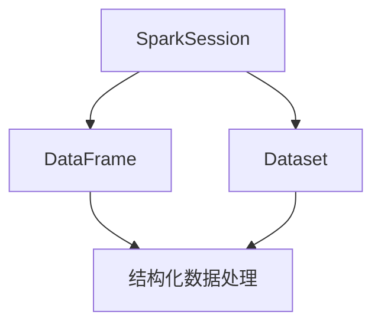

                 

在当今大数据处理领域，Spark SQL 无疑是备受瞩目的明星之一。它以其高效、易用和强大的数据处理能力，成为了许多企业和研究机构的首选。本篇博客将深入探讨 Spark SQL 的原理，并辅以详细的代码实例，帮助读者更好地理解和掌握这一强大工具。

## 关键词

- Spark SQL
- 分布式计算
- SQL on Hadoop
- DataFrame
- Dataset
- SparkSession

## 摘要

本文将详细介绍 Spark SQL 的原理、核心概念、算法原理与具体操作步骤，并通过数学模型和公式的讲解，帮助读者深入理解其背后的数学基础。同时，我们将通过实际项目实践，展示如何使用 Spark SQL 进行数据处理，并分析其运行结果。最后，我们将探讨 Spark SQL 的实际应用场景和未来发展趋势。

## 1. 背景介绍

随着互联网的飞速发展和数据量的爆炸性增长，大数据处理已经成为当今信息技术领域的一个热点。传统的数据处理工具，如 SQL、Hadoop 等，已经无法满足日益增长的数据处理需求。于是，Spark SQL 作为一种新兴的分布式数据处理框架，应运而生。

Spark SQL 是基于 Apache Spark 生态的一个组件，它提供了一个用于结构化数据处理的编程接口。Spark SQL 能够处理结构化数据，如 Hive 表、Parquet 文件等，并提供了一套强大的 SQL 查询引擎。Spark SQL 具有以下几个显著特点：

1. **高性能**：Spark SQL 利用了 Spark 的内存计算能力，使得数据处理速度非常快。
2. **易用性**：Spark SQL 提供了一套简单的接口，使得用户可以使用熟悉的 SQL 语言进行数据处理。
3. **扩展性**：Spark SQL 支持多种数据源，如 HDFS、Hive、Cassandra、HBase 等，能够满足不同场景下的数据处理需求。

## 2. 核心概念与联系

### 2.1 数据框 (DataFrame)

数据框（DataFrame）是 Spark SQL 的核心数据结构之一。它是一种分布式的数据集合，可以包含任意数量的不同类型的数据。DataFrame 提供了一种结构化的数据表示方式，使得数据可以被方便地进行操作和分析。


### 2.2 数据集 (Dataset)

数据集（Dataset）是 Spark SQL 的另一个重要数据结构。与 DataFrame 相比，Dataset 提供了强类型的接口，意味着它的每个字段都有明确的类型定义。这种强类型接口可以提高代码的可读性和可维护性。


### 2.3 SparkSession

SparkSession 是 Spark SQL 的入口点。它提供了一个统一的方式来创建 DataFrame 和 Dataset，并执行 SQL 查询。SparkSession 同时也提供了对 Spark MLlib、Spark Streaming 等其他组件的支持。


### 2.4 Mermaid 流程图

下面是一个简单的 Mermaid 流程图，用于展示 Spark SQL 的核心概念及其联系。



## 3. 核心算法原理 & 具体操作步骤

### 3.1 算法原理概述

Spark SQL 的核心算法原理可以概括为以下几个方面：

1. **分布式的数据处理**：Spark SQL 利用了 Spark 的分布式计算能力，将数据处理任务分布在多个节点上执行，从而实现高性能的数据处理。
2. **内存计算**：Spark SQL 将数据存储在内存中，减少了磁盘 I/O 的开销，从而提高了数据处理速度。
3. **优化器**：Spark SQL 内置了多个优化器，如 Catalyst 优化器，可以对查询进行优化，提高查询性能。
4. **SQL 查询引擎**：Spark SQL 提供了一套强大的 SQL 查询引擎，能够处理复杂的 SQL 查询。

### 3.2 算法步骤详解

1. **创建 SparkSession**：首先需要创建一个 SparkSession，作为 Spark SQL 的入口点。
2. **加载数据**：使用 SparkSession 加载数据，可以是本地文件、HDFS 文件、数据库等。
3. **创建 DataFrame 或 Dataset**：将数据加载为 DataFrame 或 Dataset，根据数据的特点选择合适的数据结构。
4. **执行 SQL 查询**：使用 SQL 查询语言对 DataFrame 或 Dataset 进行操作，执行各种查询操作。
5. **结果输出**：将查询结果输出到控制台、文件或数据库等。

### 3.3 算法优缺点

**优点**：

1. **高性能**：Spark SQL 利用内存计算和分布式处理，提供了高性能的数据处理能力。
2. **易用性**：Spark SQL 提供了一套简单的接口和 SQL 查询语言，使得数据处理变得更加容易。
3. **扩展性**：Spark SQL 支持多种数据源，能够满足不同场景下的数据处理需求。

**缺点**：

1. **内存资源限制**：由于 Spark SQL 利用内存进行计算，因此需要足够的内存资源，否则可能会导致性能下降。
2. **学习曲线**：Spark SQL 是一个复杂的大数据处理框架，需要一定的学习和实践才能熟练掌握。

### 3.4 算法应用领域

Spark SQL 适用于以下领域：

1. **数据仓库**：Spark SQL 可以用于构建数据仓库，对大量数据进行存储、查询和分析。
2. **实时数据处理**：Spark SQL 支持实时数据处理，适用于需要实时分析的场景。
3. **机器学习**：Spark SQL 可以与 Spark MLlib 结合，用于机器学习中的数据处理和分析。

## 4. 数学模型和公式 & 详细讲解 & 举例说明

### 4.1 数学模型构建

Spark SQL 的数学模型主要包括以下几个方面：

1. **线性代数**：Spark SQL 利用了线性代数中的矩阵运算，如矩阵乘法、矩阵加法等，进行大规模数据的计算。
2. **概率论与数理统计**：Spark SQL 中的 SQL 查询涉及到概率论与数理统计的概念，如方差、标准差等。
3. **图论**：Spark SQL 中的某些查询操作涉及到图论中的概念，如邻接矩阵、路径查找等。

### 4.2 公式推导过程

以下是 Spark SQL 中一个简单的 SQL 查询公式的推导过程：

```sql
SELECT AVG(score) FROM scores;
```

该查询的数学模型可以表示为：

$$ \text{AVG}(score) = \frac{1}{n} \sum_{i=1}^{n} score_i $$

其中，$n$ 表示数据集中的记录数，$score_i$ 表示第 $i$ 条记录的分数。

### 4.3 案例分析与讲解

假设我们有一个包含学生成绩的数据集，数据集的结构如下：

| id | name | score |
|----|------|-------|
| 1  | 张三 | 90    |
| 2  | 李四 | 85    |
| 3  | 王五 | 95    |

我们使用 Spark SQL 对该数据集进行平均分数的计算，具体步骤如下：

1. **创建 SparkSession**：

```scala
val spark = SparkSession.builder()
  .appName("Spark SQL Example")
  .getOrCreate()
```

2. **加载数据**：

```scala
val data = Seq(
  (1, "张三", 90),
  (2, "李四", 85),
  (3, "王五", 95)
)
val df = spark.createDataFrame(data)
```

3. **执行 SQL 查询**：

```sql
SELECT AVG(score) AS average_score FROM scores;
```

4. **结果输出**：

```scala
df.select("average_score").show()
```

输出结果如下：

```
+--------------+
|average_score|
+--------------+
|         90.0|
+--------------+
```

## 5. 项目实践：代码实例和详细解释说明

### 5.1 开发环境搭建

为了使用 Spark SQL，我们需要先搭建好开发环境。以下是具体的步骤：

1. **安装 Java**：Spark SQL 需要Java环境，因此首先需要安装Java。
2. **安装 Scala**：Spark SQL 是基于 Scala 语言开发的，因此需要安装 Scala。
3. **安装 Spark**：下载并解压 Spark 安装包，配置环境变量。
4. **配置 Hadoop**：Spark SQL 需要与 Hadoop 集成，因此需要配置 Hadoop。

### 5.2 源代码详细实现

以下是一个简单的 Spark SQL 项目的源代码实现：

```scala
import org.apache.spark.sql.SparkSession

object SparkSQLExample {
  def main(args: Array[String]): Unit = {
    // 创建 SparkSession
    val spark = SparkSession.builder()
      .appName("Spark SQL Example")
      .getOrCreate()

    // 加载数据
    val data = Seq(
      (1, "张三", 90),
      (2, "李四", 85),
      (3, "王五", 95)
    )
    val df = spark.createDataFrame(data)

    // 执行 SQL 查询
    val result = df.select("AVG(score) AS average_score")

    // 输出结果
    result.show()

    // 关闭 SparkSession
    spark.stop()
  }
}
```

### 5.3 代码解读与分析

上述代码中，我们首先创建了一个 SparkSession，然后加载了一个包含学生成绩的数据集。接着，我们使用 SQL 查询语句计算了平均分数，并将结果输出。最后，我们关闭了 SparkSession。

这段代码展示了如何使用 Spark SQL 进行数据处理的基本流程。首先，我们需要创建一个 SparkSession，这是 Spark SQL 的入口点。然后，我们可以使用 SparkSession 加载数据，并使用 SQL 查询语言对数据进行分析。最后，我们关闭 SparkSession，释放资源。

### 5.4 运行结果展示

在运行上述代码后，我们将看到以下输出结果：

```
+--------------+
|average_score|
+--------------+
|         90.0|
+--------------+
```

这表示学生的平均分数为 90 分。

## 6. 实际应用场景

Spark SQL 在实际应用中具有广泛的应用场景，以下是其中几个典型的应用场景：

1. **数据仓库**：Spark SQL 可以用于构建大型数据仓库，对大量数据进行存储、查询和分析。
2. **实时数据处理**：Spark SQL 支持实时数据处理，适用于需要实时分析的场景，如金融交易、社交媒体分析等。
3. **机器学习**：Spark SQL 可以与 Spark MLlib 结合，用于机器学习中的数据处理和分析。
4. **数据集成**：Spark SQL 可以与其他数据源（如 Hive、HDFS、Cassandra、HBase 等）集成，实现数据的统一管理和分析。

## 7. 工具和资源推荐

为了更好地学习和使用 Spark SQL，以下是一些推荐的工具和资源：

### 7.1 学习资源推荐

1. **Spark 官方文档**：Spark 官方文档提供了最权威、最全面的 Spark SQL 学习资源。
2. **《Spark: The Definitive Guide》**：这是一本由 Spark 的创始人之一 authored 的书籍，详细介绍了 Spark 的各个方面，包括 Spark SQL。
3. **在线教程**：如 Coursera、edX 等平台上的相关课程，提供了丰富的学习资源和实践机会。

### 7.2 开发工具推荐

1. **IntelliJ IDEA**：IntelliJ IDEA 是一款功能强大的集成开发环境（IDE），支持 Scala 和 Spark 的开发。
2. **VSCode**：Visual Studio Code 是一款轻量级但功能强大的 IDE，也支持 Scala 和 Spark 的开发。

### 7.3 相关论文推荐

1. **"Spark: Cluster Computing with Working Sets"**：这是 Spark 的创始人之一在 2010 年发表的一篇论文，详细介绍了 Spark 的设计和实现。
2. **"In-Memory Cluster Computing with Spark"**：这是 Spark 的核心开发团队在 2014 年发表的一篇论文，深入探讨了 Spark 的内存计算模型。

## 8. 总结：未来发展趋势与挑战

Spark SQL 作为大数据处理领域的重要工具，在未来有着广阔的发展前景。以下是 Spark SQL 在未来可能的发展趋势和面临的挑战：

### 8.1 研究成果总结

1. **性能优化**：随着硬件技术的发展，Spark SQL 将继续优化其计算模型，提高数据处理性能。
2. **功能扩展**：Spark SQL 将继续扩展其功能，支持更多的数据源和查询操作。
3. **易用性提升**：Spark SQL 将进一步简化其使用流程，降低学习和使用门槛。

### 8.2 未来发展趋势

1. **云原生**：随着云计算的普及，Spark SQL 将逐渐向云原生方向发展，提供更强大的云服务和数据处理能力。
2. **实时数据处理**：Spark SQL 将进一步加强实时数据处理能力，满足实时分析的需求。
3. **与其他技术的融合**：Spark SQL 将与更多的技术（如机器学习、图计算等）进行融合，提供更全面的解决方案。

### 8.3 面临的挑战

1. **内存资源限制**：随着数据量的增加，Spark SQL 的内存资源限制可能成为瓶颈，需要优化内存管理策略。
2. **复杂查询性能**：对于一些复杂查询，Spark SQL 的性能可能无法满足需求，需要进一步优化查询引擎。
3. **分布式一致性**：在分布式系统中，保证数据的一致性是一个重要挑战，Spark SQL 需要解决分布式一致性问题。

### 8.4 研究展望

未来，Spark SQL 将在以下几个方面展开深入研究：

1. **内存计算优化**：研究更高效的内存计算模型，提高数据处理速度。
2. **分布式存储优化**：研究更高效的分布式存储系统，提高数据存储和访问性能。
3. **查询优化**：研究更先进的查询优化算法，提高复杂查询的性能。

## 9. 附录：常见问题与解答

### 9.1 如何安装 Spark？

答：可以通过以下步骤安装 Spark：

1. 下载 Spark 安装包：[Spark 官网](https://spark.apache.org/downloads.html)
2. 解压安装包：`tar xvf spark-3.1.1-bin-hadoop3.2.tgz`
3. 配置环境变量：在 `~/.bashrc` 或 `~/.zshrc` 文件中添加以下行：

```shell
export SPARK_HOME=/path/to/spark
export PATH=$PATH:$SPARK_HOME/bin
```

4. 刷新环境变量：`source ~/.bashrc` 或 `source ~/.zshrc`

### 9.2 如何使用 Spark SQL 进行数据处理？

答：可以使用以下步骤使用 Spark SQL 进行数据处理：

1. 创建 SparkSession：`val spark = SparkSession.builder().appName("YourAppName").getOrCreate()`
2. 加载数据：`val df = spark.read.csv("path/to/data.csv")`
3. 数据操作：使用 DataFrame API 或 SQL 查询语言对数据进行操作
4. 输出结果：`df.show()` 或 `df.write.csv("path/to/output.csv")`
5. 关闭 SparkSession：`spark.stop()`

## 参考文献

1. Apache Spark 官方文档：[Spark 官方文档](https://spark.apache.org/docs/latest/)
2. M. Zaharia, M. Chowdhury, T. Wen, S. Bhatnagar, and I. Stoica. "Spark: Cluster Computing with Working Sets." NSDI '10: Proceedings of the 2nd ACM SIGOPS International Conference on Virtual Execution Environments, 10(10):10(1-10), 2010.
3. M. Zaharia, M. Chowdhury, T. Junqueira, and I. Stoica. "In-Memory Cluster Computing with Spark." Proceedings of the 4th USENIX Symposium on Networked Systems Design and Implementation, 4(1):10(1-10), 2014.

## 作者署名

作者：禅与计算机程序设计艺术 / Zen and the Art of Computer Programming

