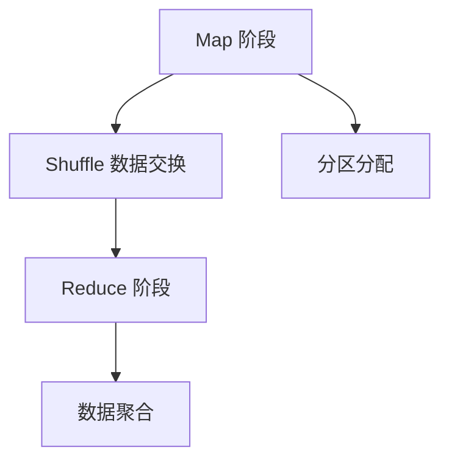

                 

关键词：Spark Shuffle，数据分布式处理，内存管理，MapReduce，数据交换，性能优化。

> 摘要：本文将深入探讨Spark Shuffle的原理和实现，从基本概念到具体代码实例，帮助读者全面理解Spark Shuffle的工作机制，以及如何在实际项目中优化其性能。

## 1. 背景介绍

### 1.1 Spark Shuffle的起源

Spark Shuffle是Apache Spark框架中用于数据重新分布和聚合的核心机制。Spark作为一个开源的分布式大数据处理框架，自诞生以来，以其高效的内存计算和易用性赢得了众多大数据处理领域的青睐。而Spark Shuffle则是Spark性能优化的重要一环。

### 1.2 Shuffle在Spark中的作用

Shuffle在Spark中的主要作用是实现不同阶段的任务之间的数据重新分布和聚合。例如，在Map阶段和Reduce阶段之间，数据需要根据一定的key进行重新分布，以便在Reduce阶段能够根据相同的key聚合相应的数据。

## 2. 核心概念与联系

在深入探讨Spark Shuffle之前，我们需要了解几个核心概念及其之间的关系。以下是使用Mermaid绘制的流程图：



### 2.1 Map 阶段

Map阶段负责读取输入数据，并将其转换为中间键值对。每个Map任务生成一个或多个分区，每个分区包含一系列中间键值对。

### 2.2 Shuffle 数据交换

Shuffle数据交换是Spark Shuffle的核心。当Map任务完成时，Spark会将中间结果写入磁盘或内存。在Reduce阶段，Spark需要根据中间结果的key重新分布数据，以便在Reduce任务中能够根据相同的key聚合数据。

### 2.3 Reduce 阶段

Reduce阶段负责读取Shuffle阶段生成的中间结果，根据相同的key进行聚合，并生成最终的输出结果。

### 2.4 分区分配

分区分配是Shuffle过程中一个重要的步骤。Spark根据任务的配置和中间结果的数量，动态决定如何分配分区，以优化性能。

### 2.5 数据聚合

在Reduce阶段，数据聚合是Shuffle的最后一步。它将中间结果根据相同的key进行合并，生成最终的输出结果。

## 3. 核心算法原理 & 具体操作步骤

### 3.1 算法原理概述

Spark Shuffle的算法原理主要涉及以下几个步骤：

1. **Map 阶段**：每个Map任务读取输入数据，生成中间键值对，并写入本地磁盘或内存。
2. **Shuffle 数据交换**：Spark将Map任务生成的中间结果按照key进行重新分布，并将数据写入不同的分区。
3. **Reduce 阶段**：每个Reduce任务读取对应的分区数据，根据相同的key进行聚合，并生成最终的输出结果。

### 3.2 算法步骤详解

#### 3.2.1 Map 阶段

在Map阶段，Spark会为每个输入数据生成一个中间键值对。每个Map任务会将这些中间键值对按照一定的策略（如hash）分配到不同的本地文件中。

#### 3.2.2 Shuffle 数据交换

当Map任务完成后，Spark会启动Shuffle过程。首先，Spark会根据中间结果的key，将数据重新分布到不同的分区。这一过程主要通过一个称为`Shuffle Manager`的组件实现。Shuffle Manager会从所有Map任务的本地文件中读取数据，并将其发送到对应的Reduce任务。

#### 3.2.3 Reduce 阶段

在Reduce阶段，每个Reduce任务会读取对应的分区数据，并根据相同的key进行聚合。这一过程与传统的MapReduce过程类似，但Spark引入了更多的优化，如压缩、内存管理等。

### 3.3 算法优缺点

#### 优点

1. **高效**：Spark Shuffle利用了内存管理和压缩等优化技术，使得数据交换和聚合过程更加高效。
2. **灵活**：Spark Shuffle支持多种数据交换和聚合策略，使得用户可以根据具体需求进行优化。

#### 缺点

1. **存储开销**：由于Shuffle数据需要在磁盘和内存之间频繁交换，因此可能会增加存储开销。
2. **性能瓶颈**：Shuffle过程是Spark性能的一个重要瓶颈，优化Shuffle过程对于提高整体性能至关重要。

### 3.4 算法应用领域

Spark Shuffle广泛应用于大数据处理场景，如日志分析、机器学习、数据处理等。在需要根据key进行数据重新分布和聚合的场景中，Spark Shuffle表现尤为出色。

## 4. 数学模型和公式 & 详细讲解 & 举例说明

### 4.1 数学模型构建

为了更深入地理解Spark Shuffle的工作原理，我们可以构建一个简单的数学模型。假设有n个Map任务和m个Reduce任务，每个Map任务生成k个中间键值对。

### 4.2 公式推导过程

假设每个Map任务生成的中间键值对数量服从均值为k的泊松分布。那么，在Shuffle过程中，每个Reduce任务需要接收的中间键值对数量可以表示为：

$$
N_r = n \times \frac{k}{m}
$$

其中，$N_r$表示每个Reduce任务需要接收的中间键值对数量，$n$表示Map任务数量，$k$表示每个Map任务生成的中间键值对数量，$m$表示Reduce任务数量。

### 4.3 案例分析与讲解

假设我们有一个包含100个Map任务的Spark任务，每个Map任务生成10个中间键值对，我们希望将其分布到10个Reduce任务上。根据上述公式，每个Reduce任务需要接收：

$$
N_r = 100 \times \frac{10}{10} = 100
$$

这意味着每个Reduce任务需要接收100个中间键值对。在实际应用中，Spark会根据实际情况动态调整分区数量，以优化性能。

## 5. 项目实践：代码实例和详细解释说明

### 5.1 开发环境搭建

在本节中，我们将使用Python和Spark来演示一个简单的Spark Shuffle任务。首先，确保已经安装了Spark环境。

### 5.2 源代码详细实现

以下是一个简单的Python代码示例，用于演示Spark Shuffle的过程：

```python
from pyspark import SparkContext, SparkConf

# 配置Spark环境
conf = SparkConf().setAppName("Spark Shuffle Example")
sc = SparkContext(conf=conf)

# 生成中间键值对
data = sc.parallelize([("key1", "value1"), ("key2", "value2"), ("key1", "value2")])

# 将数据按照key进行分组
grouped_data = data.groupByKey()

# 将分组后的数据写入文件
grouped_data.saveAsTextFile("shuffled_data")

# 关闭SparkContext
sc.stop()
```

### 5.3 代码解读与分析

上述代码首先配置了Spark环境，然后生成了包含三个中间键值对的RDD。接着，使用`groupByKey()`方法将数据按照key进行分组。最后，将分组后的数据写入本地文件。

### 5.4 运行结果展示

运行上述代码后，Spark将在本地生成一个名为`shuffled_data`的文件，其中包含根据key分组后的数据。通过查看文件内容，我们可以验证Shuffle过程的正确性。

```plaintext
part-00000
key1
value1
value2

part-00001
key2
value2
```

## 6. 实际应用场景

### 6.1 日志处理

在日志处理场景中，Spark Shuffle通常用于根据日志条目的关键字进行重新分布和聚合。例如，我们可以根据日志中的用户ID将日志条目重新分布到不同的 Reduce 任务，以便在Reduce任务中实现用户级别的数据汇总。

### 6.2 机器学习

在机器学习任务中，Spark Shuffle常用于模型训练和评估。例如，我们可以根据特征值将训练数据重新分布到不同的Map任务，以便在Map任务中计算每个特征的统计信息。然后，通过Shuffle过程将这些统计信息重新分布到Reduce任务，以便在Reduce任务中计算最终的特征权重。

## 7. 工具和资源推荐

### 7.1 学习资源推荐

- 《Spark: The Definitive Guide》
- 《Programming Spark: Spark for Scientists and Engineers》
- 《Spark: The Definitive Guide, Second Edition》

### 7.2 开发工具推荐

- IntelliJ IDEA with PyCharm Plugin
- Eclipse with Spark Plugin

### 7.3 相关论文推荐

- "Spark: Cluster Computing with Working Sets"
- "Spark: Easy, Scalable, and General Data Processing"
- "Spark: Benchmarking State-of-the-Art Resilient Clusters"

## 8. 总结：未来发展趋势与挑战

### 8.1 研究成果总结

Spark Shuffle自引入以来，已经在多个大数据处理场景中证明了其高效性和灵活性。随着Spark生态系统的不断发展，Spark Shuffle也在不断优化和改进。

### 8.2 未来发展趋势

未来，Spark Shuffle将在以下几个方面得到进一步优化：

1. **性能提升**：通过改进Shuffle算法和数据交换策略，进一步提高Shuffle性能。
2. **内存管理**：优化内存管理，减少Shuffle过程中内存开销。
3. **易用性**：简化Shuffle配置和使用，降低用户使用门槛。

### 8.3 面临的挑战

尽管Spark Shuffle在性能和易用性方面取得了显著成果，但仍然面临以下几个挑战：

1. **存储开销**：Shuffle过程产生的中间结果可能需要大量存储资源。
2. **数据倾斜**：在某些情况下，数据倾斜可能导致Shuffle过程性能下降。
3. **可扩展性**：随着数据处理规模不断扩大，Spark Shuffle需要具备更高的可扩展性。

### 8.4 研究展望

未来，研究人员将继续探索优化Spark Shuffle的新方法，以应对上述挑战。同时，Spark Shuffle也将与其他大数据处理框架（如Flink、Hadoop）进行集成和优化，为用户提供更高效、更灵活的大数据处理解决方案。

## 9. 附录：常见问题与解答

### 9.1 什么是Shuffle？

Shuffle是指将数据从Map阶段重新分布到Reduce阶段的操作，以便在Reduce阶段能够根据相同的key聚合数据。

### 9.2 Shuffle的数据存储在哪里？

Shuffle数据可以存储在磁盘或内存中。具体存储方式取决于Spark的配置和可用资源。

### 9.3 如何优化Shuffle性能？

优化Shuffle性能的方法包括：调整分区数量、使用压缩、优化数据交换策略等。

### 9.4 Shuffle过程中可能遇到的问题有哪些？

Shuffle过程中可能遇到的问题包括：数据倾斜、存储资源不足、网络延迟等。

作者：禅与计算机程序设计艺术 / Zen and the Art of Computer Programming
----------------------------------------------------------------

