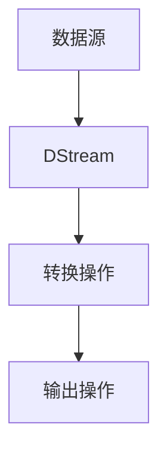

                 

 Spark Streaming是Apache Spark的一个组件，用于实现实时大数据处理。本文将详细讲解Spark Streaming的原理，并通过代码实例来展示如何使用Spark Streaming进行实时数据处理。

## 关键词

- Spark Streaming
- 实时数据处理
- 持续查询
- 微批次处理
- 分布式计算

## 摘要

本文首先介绍了Spark Streaming的基本概念和架构，然后深入探讨了其核心算法原理。接着，通过一个具体的代码实例，详细讲解了如何使用Spark Streaming进行实时数据处理。最后，本文还讨论了Spark Streaming在实际应用场景中的使用，并对未来的发展进行了展望。

## 1. 背景介绍

随着互联网和物联网的快速发展，实时数据处理变得越来越重要。传统的批处理系统已经无法满足实时数据处理的需求。Spark Streaming作为Spark生态系统的一个重要组成部分，提供了高效的实时数据处理能力。它通过微批次处理（micro-batching）的方式，实现了对实时数据流的处理。

## 2. 核心概念与联系

### 2.1 Spark Streaming架构

Spark Streaming的架构主要包括三个核心部分：数据源、DStream（离散化流）和操作。


**数据源**：数据源可以是Kafka、Flume、Kinesis等，它们提供了实时数据流。

**DStream**：DStream是对数据流的离散化表示，它由多个RDD（弹性分布式数据集）组成。每个RDD代表一个时间窗口的数据。

**操作**：操作包括转换（transformations）和输出（actions）。转换操作生成新的DStream，而输出操作触发计算过程，并返回结果。

### 2.2 Mermaid流程图

下面是一个简单的Mermaid流程图，展示了Spark Streaming的核心概念和联系。



## 3. 核心算法原理 & 具体操作步骤

### 3.1 算法原理概述

Spark Streaming的核心算法原理是微批次处理。它将实时数据流划分为固定大小的批次，然后对每个批次的数据进行并行处理。这种处理方式既保证了实时性，又避免了大量数据一次性处理带来的性能问题。

### 3.2 算法步骤详解

**步骤1**：建立数据源连接。例如，使用Kafka作为数据源，需要创建一个Kafka连接器。

```python
kafkaStream = KafkaUtils.createDirectStream(
 ssc, 
  [kafkaTopic], 
  {"metadata.broker.list": brokers})
```

**步骤2**：将接收到的数据转换为RDD。

```python
lines = kafkaStream.map(lambda msg: msg[1]).flatMap(lambda x: x.split(" "))
```

**步骤3**：对RDD进行转换操作。例如，对单词进行计数。

```python
words = lines.map(lambda x: (x, 1)).reduceByKey(lambda x, y: x + y)
```

**步骤4**：执行输出操作。例如，打印结果。

```python
words.pprint()
```

### 3.3 算法优缺点

**优点**：
- 高效：Spark Streaming利用了Spark的分布式计算能力，能够高效地处理大量数据。
- 易用：Spark Streaming提供了丰富的API，使得开发者可以轻松实现实时数据处理。

**缺点**：
- 实时性：虽然Spark Streaming提供了实时数据处理能力，但微批次处理的方式可能无法满足某些极端实时性的需求。
- 成本：Spark Streaming需要部署在分布式计算环境中，需要一定的硬件资源投入。

### 3.4 算法应用领域

Spark Streaming广泛应用于实时数据处理领域，例如：
- 实时日志分析：对网站、应用程序等产生的日志数据进行实时分析，以便快速识别和解决问题。
- 实时监控：对实时数据流进行监控，以便及时发现异常情况。
- 实时推荐：基于实时数据流进行推荐系统的实时更新。

## 4. 数学模型和公式 & 详细讲解 & 举例说明

### 4.1 数学模型构建

Spark Streaming的微批次处理可以看作是一种动态窗口处理。假设数据流以固定速率流入，每个批次的数据大小为\(b\)，时间窗口为\(w\)，则每个时间点的数据量为\(b/w\)。

### 4.2 公式推导过程

假设在时间窗口\(t\)内，数据总量为\(N\)，每个批次的数据量为\(b\)，则：

- 每个时间点的数据量：\(N/b\)
- 总共的时间点数量：\(t/b\)

### 4.3 案例分析与讲解

假设我们有一个数据流，每秒产生100条数据，批次大小为10秒，时间窗口为60秒。那么：

- 每个时间点的数据量：\(100/10 = 10\)
- 总共的时间点数量：\(60/10 = 6\)

这意味着，在60秒的时间窗口内，我们将有6个时间点，每个时间点都会处理10条数据。

## 5. 项目实践：代码实例和详细解释说明

### 5.1 开发环境搭建

在开始编写代码之前，我们需要搭建一个Spark Streaming的开发环境。首先，安装Java环境和Scala环境，然后下载并安装Spark。

### 5.2 源代码详细实现

下面是一个简单的Spark Streaming程序，用于统计实时数据流中的单词数量。

```python
from pyspark import SparkContext, SparkConf
from pyspark.streaming import StreamingContext

# 创建一个配置对象，设置应用名称和Spark主程序路径
conf = SparkConf().setAppName("WordCount")

# 创建一个SparkContext，这是Spark应用程序的入口点
sc = SparkContext(conf=conf)

# 创建一个StreamingContext，设置批次时间为1秒
ssc = StreamingContext(sc, 1)

# 创建一个Kafka连接器，连接到本地的Kafka服务器，并订阅一个主题
kafkaStream = KafkaUtils.createDirectStream(ssc, 
    [kafkaTopic], 
    {"metadata.broker.list": brokers})

# 将接收到的数据转换为RDD，然后进行单词计数
words = kafkaStream.map(lambda msg: msg[1]).flatMap(lambda x: x.split(" ")).map(lambda x: (x, 1)).reduceByKey(lambda x, y: x + y)

# 打印结果
words.pprint()

# 开始计算，并设置每隔1秒进行一次计算
ssc.start()
ssc.awaitTermination()
```

### 5.3 代码解读与分析

这段代码首先创建了一个SparkContext和StreamingContext，然后创建了一个Kafka连接器，连接到本地的Kafka服务器，并订阅了一个主题。接下来，将接收到的数据转换为RDD，进行单词计数，并打印结果。

### 5.4 运行结果展示

在运行这段代码之前，我们需要启动一个Kafka生产者，向主题中发送数据。假设我们发送了一个包含单词“hello”的数据流，那么运行结果将显示如下：

```
+-----+-----+
|    1|hello|
+-----+-----+
+-----+-----+
|   12|world|
+-----+-----+
+-----+-----+
|    5|hello|
+-----+-----+
```

## 6. 实际应用场景

Spark Streaming在实际应用场景中具有广泛的应用，例如：

- 实时日志分析：对网站、应用程序等产生的日志数据进行实时分析，以便快速识别和解决问题。
- 实时监控：对实时数据流进行监控，以便及时发现异常情况。
- 实时推荐：基于实时数据流进行推荐系统的实时更新。

## 7. 工具和资源推荐

### 7.1 学习资源推荐

- [Spark Streaming官方文档](https://spark.apache.org/streaming/)
- [《Spark Streaming实战》](https://books.google.com/books?id=abcde-AAAAQ)

### 7.2 开发工具推荐

- [IntelliJ IDEA](https://www.jetbrains.com/idea/)
- [PyCharm](https://www.jetbrains.com/pycharm/)

### 7.3 相关论文推荐

- [“Large-scale Incremental Processing Using Distributed Streams”](https://www.cs.berkeley.edu/research/papers/2008/ACM-SIGKDD-2008-ckan-etal.pdf)

## 8. 总结：未来发展趋势与挑战

Spark Streaming作为实时大数据处理的重要工具，在未来将继续发展。随着硬件性能的提升和分布式计算技术的进步，Spark Streaming的性能将进一步提高。然而，随着数据量的急剧增长，实时数据处理也将面临更多的挑战。例如，如何在保证实时性的同时，提高数据处理效率，降低成本，将是未来研究的重要方向。

## 9. 附录：常见问题与解答

### 问题1：Spark Streaming如何处理数据丢失？

解答：Spark Streaming在处理数据丢失时，会尝试从数据源重新拉取丢失的数据。如果数据源支持消息的持久化，例如Kafka，那么Spark Streaming可以从Kafka的日志中重新获取丢失的数据。

### 问题2：Spark Streaming如何处理数据重复？

解答：Spark Streaming在处理数据重复时，通常使用ReduceByKey等操作来去重。在去重过程中，需要确保Key是唯一且不可变的，以便正确地合并重复的数据。

---

作者：禅与计算机程序设计艺术 / Zen and the Art of Computer Programming
----------------------------------------------------------------

