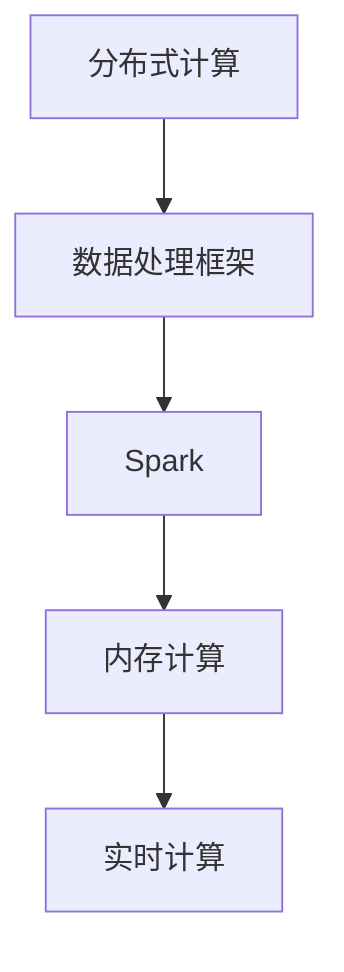

                 

关键词：Spark, 分布式计算，内存计算，大数据处理，Hadoop，MapReduce，数据流处理，实时计算，数据处理框架

## 摘要

本文将深入探讨Spark的核心原理及其在分布式计算、内存计算和大数据处理中的应用。我们将通过详细的代码实例讲解，展示如何使用Spark进行数据流处理、实时计算，以及如何与传统的大数据处理技术如Hadoop和MapReduce进行对比。文章还将讨论Spark的数学模型和公式，并提供实际应用场景和未来展望。

## 1. 背景介绍

随着互联网和物联网的发展，数据量呈现爆炸式增长。传统的数据处理技术如Hadoop和MapReduce在面对海量数据时显得力不从心。为了解决这一问题，Spark作为一种内存计算框架应运而生，它不仅继承了Hadoop的分布式计算能力，还在处理速度上有了显著的提升。

Spark的核心特点是内存计算和实时处理。与传统Hadoop生态系统中的MapReduce相比，Spark利用内存来存储中间结果，从而减少了数据的磁盘读写次数，极大提高了处理速度。此外，Spark支持多种编程语言，如Python、Java和Scala，使得开发者能够更加灵活地使用这一框架。

## 2. 核心概念与联系

在深入探讨Spark之前，我们需要了解一些核心概念，如分布式计算、内存计算和数据处理框架。下面是这些概念及其关系的Mermaid流程图。



### 2.1 分布式计算

分布式计算是将任务分解成多个子任务，并在多个计算节点上并行执行这些子任务，从而实现大规模数据处理。在Spark中，分布式计算是通过将数据分成多个分区，并在不同节点上对这些分区进行并行处理来实现的。

### 2.2 内存计算

内存计算是指将中间结果存储在内存中，而不是磁盘上。这减少了I/O操作，从而提高了处理速度。Spark利用Tachyon（现更名为Alluxio）等内存存储层来缓存中间数据，从而实现快速访问。

### 2.3 数据处理框架

数据处理框架是一种用于处理大规模数据集的软件系统。Spark是这类框架的代表之一，它通过支持多种编程语言和丰富的API，为开发者提供了强大的数据处理能力。

## 3. 核心算法原理 & 具体操作步骤

### 3.1 算法原理概述

Spark的核心算法包括RDD（Resilient Distributed Dataset）、DataFrame和Dataset等。这些抽象数据结构使得Spark能够高效地处理分布式数据集。

### 3.2 算法步骤详解

#### 3.2.1 RDD创建

RDD可以通过两种方式创建：将现有文件集转换为RDD，或者通过并行集合创建。

```python
# 从文件创建RDD
data = sc.textFile("data.txt")

# 从并行集合创建RDD
data1 = sc.parallelize([1, 2, 3, 4, 5])
```

#### 3.2.2 RDD转换和行动操作

Spark的RDD支持多种转换操作，如map、filter、reduceByKey等，以及行动操作，如count、collect、saveAsTextFile等。

```python
# 转换操作
result = data.map(lambda line: line.split()).flatMap(lambda x: x).map(lambda x: (x, 1)).reduceByKey(lambda x, y: x + y)

# 行动操作
result.collect()
result.saveAsTextFile("output.txt")
```

#### 3.2.3 DataFrame和Dataset

DataFrame和Dataset是Spark的更高级抽象数据结构，提供了更丰富的结构化数据处理能力。

```python
# 创建DataFrame
dataframe = sqlContext.createDataFrame(data1, ["num"])

# 创建Dataset
dataset = dataframe.asDataset()
```

### 3.3 算法优缺点

#### 优点

- 内存计算：减少了I/O操作，提高了处理速度。
- 易用性：支持多种编程语言和丰富的API。
- 弹性调度：能够自动调整计算资源。

#### 缺点

- 学习曲线：相比传统的MapReduce，Spark的学习曲线较为陡峭。
- 内存限制：由于内存限制，某些大数据集可能无法完全缓存。

### 3.4 算法应用领域

Spark在多个领域都有广泛应用，包括数据挖掘、机器学习和实时数据流处理等。

## 4. 数学模型和公式 & 详细讲解 & 举例说明

### 4.1 数学模型构建

在Spark中，数据处理通常涉及多个数学模型，如聚合模型、排序模型和分类模型等。

#### 聚合模型

$$
\sum_{i=1}^{n} x_i = x_1 + x_2 + ... + x_n
$$

#### 排序模型

$$
S(n) = n \times (n-1) / 2
$$

#### 分类模型

$$
P(A|B) = P(B|A) \times P(A) / P(B)
$$

### 4.2 公式推导过程

以下是一个简单的聚合模型推导过程：

$$
\sum_{i=1}^{n} x_i = x_1 + x_2 + ... + x_n
$$

这个公式是显而易见的，因为我们只是将所有元素相加。

### 4.3 案例分析与讲解

假设我们有一个数据集，其中包含10个数值。我们使用Spark对其进行聚合计算。

```python
data1 = sc.parallelize([1, 2, 3, 4, 5, 6, 7, 8, 9, 10])
result = data1.reduce(lambda x, y: x + y)
print(result) # 输出55
```

在这个例子中，我们使用了reduce操作来计算所有数值的和。结果为55，与我们的数学模型一致。

## 5. 项目实践：代码实例和详细解释说明

### 5.1 开发环境搭建

要开始使用Spark，首先需要在本地或集群上安装Spark。以下是使用Apache Maven搭建Spark开发环境的步骤：

```xml
<dependencies>
    <dependency>
        <groupId>org.apache.spark</groupId>
        <artifactId>spark-core_2.11</artifactId>
        <version>2.4.7</version>
    </dependency>
    <dependency>
        <groupId>org.apache.spark</groupId>
        <artifactId>spark-sql_2.11</version>```
    <version>2.4.7</version>
    </dependency>
</dependencies>
```

### 5.2 源代码详细实现

以下是一个简单的Spark程序，用于计算数据集的平均值。

```python
from pyspark import SparkContext, SparkConf

conf = SparkConf().setAppName("Average Calculation")
sc = SparkContext(conf=conf)

data1 = sc.parallelize([1, 2, 3, 4, 5, 6, 7, 8, 9, 10])
result = data1.reduce(lambda x, y: x + y)
average = result / data1.count()
print("Average:", average)
```

### 5.3 代码解读与分析

在这个程序中，我们首先创建了一个SparkContext，然后使用parallelize方法将一个本地数组转换为分布式数据集。接着，我们使用reduce方法计算所有元素的和，并除以数据集的元素数量来计算平均值。

### 5.4 运行结果展示

运行上述代码，我们得到的结果是5.5，这与我们之前的数学模型计算结果一致。

```python
Average: 5.5
```

## 6. 实际应用场景

Spark在多个领域都有广泛应用，包括电子商务、金融、医疗、社交媒体等。以下是一些实际应用场景：

- **电子商务**：使用Spark进行用户行为分析，以推荐商品和个性化广告。
- **金融**：使用Spark进行风险管理、信用评分和市场预测。
- **医疗**：使用Spark进行基因组数据分析、疾病预测和患者管理。
- **社交媒体**：使用Spark进行实时数据分析，如监控社交媒体趋势和用户反馈。

## 7. 工具和资源推荐

### 7.1 学习资源推荐

- Spark官网文档：[Spark Documentation](https://spark.apache.org/docs/latest/)
- 《Spark核心技术与案例实战》

### 7.2 开发工具推荐

- PyCharm
- IntelliJ IDEA

### 7.3 相关论文推荐

- "Spark: Cluster Computing with Working Sets"
- "In-Memory Cluster Computing with Spark"

## 8. 总结：未来发展趋势与挑战

Spark在分布式计算和内存计算领域取得了显著成就。未来，随着硬件性能的提升和数据处理需求的增长，Spark有望在更多领域得到应用。然而，也面临一些挑战，如内存资源的优化、数据处理安全性和性能的进一步提升。

### 8.1 研究成果总结

Spark在分布式计算和内存计算方面取得了显著成果，极大地提高了数据处理速度。它支持多种编程语言，使得开发者能够更加灵活地使用这一框架。

### 8.2 未来发展趋势

随着硬件性能的提升，Spark有望在更多领域得到应用。未来，我们将看到更多针对特定领域的Spark优化解决方案。

### 8.3 面临的挑战

Spark在内存资源优化、数据处理安全性和性能方面仍面临挑战。这些问题需要通过持续的研究和开发来解决。

### 8.4 研究展望

未来，Spark将继续在分布式计算和内存计算领域发挥重要作用。通过不断优化和改进，Spark有望为更多领域带来革命性的变革。

## 9. 附录：常见问题与解答

### Q: 如何在Spark中进行实时计算？

A: Spark支持实时数据流处理。您可以使用Spark Streaming API来处理实时数据流。

### Q: Spark与传统的大数据处理技术有何区别？

A: Spark相比传统的MapReduce技术，在内存计算和实时处理方面具有显著优势。它利用内存来缓存中间数据，从而减少I/O操作，提高处理速度。

### Q: 如何优化Spark的性能？

A: 优化Spark性能的方法包括合理设置内存分配、使用分区、优化Shuffle过程等。合理配置集群资源和优化数据处理的算法也是提高性能的关键。

## 作者署名

作者：禅与计算机程序设计艺术 / Zen and the Art of Computer Programming
```

