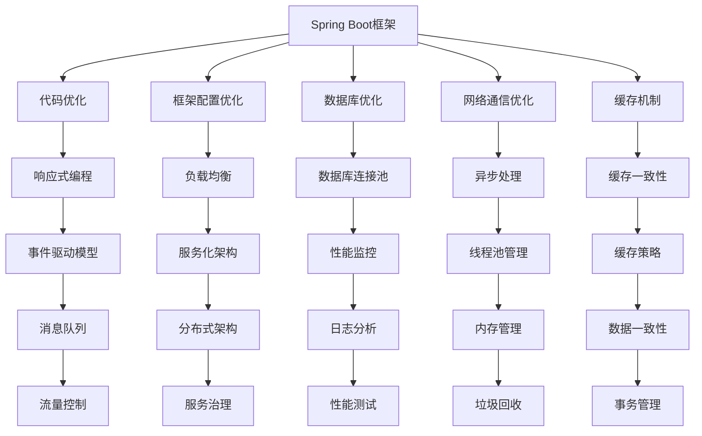
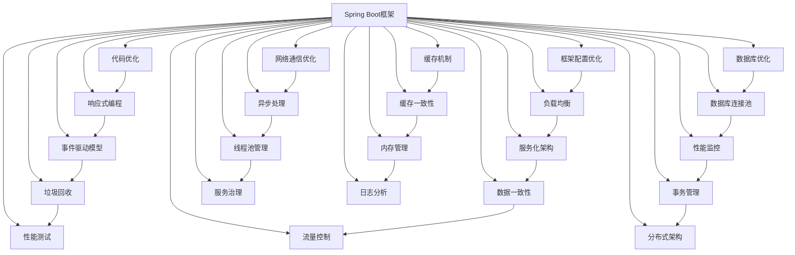

                 

 在当今高度竞争的软件开发环境中，应用性能优化成为开发人员必须关注的重要领域。Spring Boot作为最受欢迎的Java应用框架之一，其性能优化对于提高应用稳定性和响应速度至关重要。本文将深入探讨Spring Boot应用性能优化的重要性和具体策略。

> **关键词：** Spring Boot，性能优化，响应速度，稳定性

> **摘要：** 本文将从背景介绍开始，详细探讨Spring Boot性能优化的核心概念、算法原理、数学模型、项目实践以及实际应用场景。通过全面的分析，读者将掌握Spring Boot性能优化的关键技术和实践方法，为提升应用性能奠定基础。

## 1. 背景介绍

随着互联网技术的快速发展，用户对应用性能的要求越来越高。响应速度、稳定性、并发处理能力等成为衡量应用优劣的关键指标。Spring Boot作为Java应用开发的重要工具，其性能优化直接影响到应用的性能表现。

性能优化不仅包括对代码的优化，还包括对框架配置、数据库访问、网络通信等多个层面的调整。Spring Boot应用性能优化涉及到众多技术和策略，如负载均衡、缓存机制、异步处理、数据库连接池等。

本文将围绕Spring Boot应用性能优化的各个方面，通过具体实例和详细解释，帮助读者掌握性能优化的核心方法和实践技巧。

### 1.1 Spring Boot性能优化的重要性

性能优化对于Spring Boot应用具有重要意义：

- **提升用户体验**：快速响应和稳定的性能能够提升用户体验，增加用户粘性。
- **降低维护成本**：优化后的应用性能更加稳定，减少了出现故障的几率，降低了维护成本。
- **提高竞争力**：在竞争激烈的市场中，高性能的应用能够脱颖而出，赢得更多用户和市场机会。

### 1.2 Spring Boot性能优化面临的挑战

- **复杂性**：Spring Boot应用通常涉及多个组件和模块，性能优化需要综合考虑各个方面。
- **动态性**：应用环境动态变化，性能优化策略需要根据实际情况进行调整。
- **资源限制**：硬件资源有限，性能优化需要在资源有限的情况下提高应用性能。

## 2. 核心概念与联系

在深入探讨Spring Boot性能优化之前，我们需要了解一些核心概念和其相互关系。以下是一个简化的Mermaid流程图，用于描述这些概念：



### 2.1 核心概念解释

- **代码优化**：通过改进代码质量，提高程序执行效率。
- **框架配置优化**：调整Spring Boot配置文件，优化框架性能。
- **数据库优化**：改进数据库查询和操作，提高数据访问速度。
- **网络通信优化**：优化网络通信协议和连接管理，减少延迟和错误。
- **缓存机制**：利用缓存减少数据库访问次数，提高响应速度。
- **响应式编程**：采用响应式编程模型，提高应用异步处理能力。
- **负载均衡**：通过负载均衡技术，分配请求到多个节点，提高系统整体性能。
- **数据库连接池**：复用数据库连接，减少连接创建和关闭的开销。
- **异步处理**：通过异步处理技术，提高系统并发处理能力。
- **缓存一致性**：确保缓存数据与数据库数据的一致性，防止数据错误。
- **事件驱动模型**：通过事件驱动模型，实现高效的事件处理和响应。
- **服务化架构**：将应用分解为多个服务，提高系统可扩展性和稳定性。
- **性能监控**：实时监控应用性能指标，及时发现问题并进行优化。
- **线程池管理**：合理配置线程池，提高并发处理效率和资源利用率。
- **内存管理**：优化内存分配和回收策略，防止内存泄漏和溢出。
- **垃圾回收**：合理配置垃圾回收器，提高系统性能和稳定性。
- **数据一致性**：确保数据在分布式系统中的一致性，防止数据冲突。
- **事务管理**：通过事务管理，保证数据操作的原子性和一致性。

### 2.2 核心概念关系图

以下是一个详细的Mermaid流程图，展示了各个核心概念之间的关系：



## 3. 核心算法原理 & 具体操作步骤

### 3.1 算法原理概述

Spring Boot应用性能优化涉及到多种算法原理和操作步骤。以下是一些核心算法原理的概述：

- **代码优化算法**：包括代码重构、算法复杂度分析、代码压缩等。
- **框架配置优化算法**：通过调整Spring Boot配置文件，优化性能参数，如连接池大小、线程数量等。
- **数据库优化算法**：包括索引优化、查询优化、存储过程优化等。
- **网络通信优化算法**：包括TCP/IP协议优化、网络延迟降低算法等。
- **缓存机制算法**：包括缓存命中算法、缓存替换算法等。
- **异步处理算法**：包括任务调度算法、线程池管理算法等。

### 3.2 算法步骤详解

以下详细解释每种算法的具体步骤：

#### 3.2.1 代码优化算法

1. **代码重构**：
   - **步骤**：对现有代码进行重构，消除冗余代码，优化代码结构。
   - **工具**：使用IDE中的重构工具，如IntelliJ IDEA的“Refactor”功能。

2. **算法复杂度分析**：
   - **步骤**：分析代码中的算法复杂度，如时间复杂度和空间复杂度。
   - **工具**：使用算法复杂度分析工具，如Big O Notation。

3. **代码压缩**：
   - **步骤**：通过代码压缩工具，如UglifyJS或Google Closure Compiler，减小代码体积。
   - **工具**：UglifyJS、Google Closure Compiler。

#### 3.2.2 框架配置优化算法

1. **连接池大小优化**：
   - **步骤**：根据应用需求和系统资源，调整连接池大小，避免连接泄露和资源浪费。
   - **工具**：Spring Boot配置文件中的`spring.datasource.hikari`或`spring.datasource.pooled`配置。

2. **线程数量优化**：
   - **步骤**：根据应用并发需求和系统资源，调整线程池大小和线程数量。
   - **工具**：Spring Boot配置文件中的`spring.task.execution.pool`配置。

#### 3.2.3 数据库优化算法

1. **索引优化**：
   - **步骤**：根据查询需求和数据分布，添加、删除或修改索引。
   - **工具**：数据库管理工具，如MySQL Workbench。

2. **查询优化**：
   - **步骤**：通过优化查询语句，减少查询执行时间，提高查询性能。
   - **工具**：数据库查询分析工具，如MySQL EXPLAIN。

3. **存储过程优化**：
   - **步骤**：优化存储过程中的代码，减少执行时间。
   - **工具**：数据库管理工具，如MySQL Workbench。

#### 3.2.4 网络通信优化算法

1. **TCP/IP协议优化**：
   - **步骤**：调整TCP/IP协议参数，如窗口大小、超时时间等，优化网络传输效率。
   - **工具**：操作系统网络配置工具，如Linux中的`net.ipv4.tcp_fin_timeout`。

2. **网络延迟降低算法**：
   - **步骤**：通过路由优化、CDN加速等方式，降低网络延迟。
   - **工具**：网络优化工具，如MTR或Wireshark。

#### 3.2.5 缓存机制算法

1. **缓存命中算法**：
   - **步骤**：通过缓存策略，如LRU（最近最少使用）、LFU（最少使用频率）等，提高缓存命中率。
   - **工具**：缓存管理工具，如Redis或Memcached。

2. **缓存替换算法**：
   - **步骤**：在缓存容量有限的情况下，选择合适的缓存替换算法，如FIFO（先进先出）、LRU等。
   - **工具**：缓存管理工具，如Redis或Memcached。

#### 3.2.6 异步处理算法

1. **任务调度算法**：
   - **步骤**：根据任务需求和系统资源，选择合适的任务调度算法，如轮询调度、优先级调度等。
   - **工具**：Spring Boot中的`@Scheduled`注解。

2. **线程池管理算法**：
   - **步骤**：根据任务并发需求和系统资源，配置合适的线程池参数，如核心线程数、最大线程数等。
   - **工具**：Spring Boot配置文件中的`spring.task.execution.pool`配置。

### 3.3 算法优缺点

每种算法都有其优缺点，选择合适的算法对性能优化至关重要。

- **代码优化算法**：
  - 优点：提高代码质量和执行效率。
  - 缺点：可能增加开发时间和复杂度。

- **框架配置优化算法**：
  - 优点：简单易行，能够快速提升性能。
  - 缺点：优化效果有限，需要结合实际应用情况进行调整。

- **数据库优化算法**：
  - 优点：直接提高数据访问速度。
  - 缺点：优化过程复杂，需要深入了解数据库原理。

- **网络通信优化算法**：
  - 优点：减少网络延迟，提高数据传输效率。
  - 缺点：需要调整网络协议和配置，可能增加系统复杂度。

- **缓存机制算法**：
  - 优点：减少数据库访问次数，提高响应速度。
  - 缺点：缓存一致性问题和内存消耗问题。

- **异步处理算法**：
  - 优点：提高系统并发处理能力，减少响应时间。
  - 缺点：需要合理配置线程池，防止资源浪费。

### 3.4 算法应用领域

算法应用领域广泛，不同场景下选择合适的算法至关重要。

- **Web应用**：主要关注代码优化、框架配置优化和缓存机制算法。
- **大数据应用**：主要关注数据库优化和异步处理算法。
- **实时通信应用**：主要关注网络通信优化和异步处理算法。

## 4. 数学模型和公式 & 详细讲解 & 举例说明

在Spring Boot应用性能优化过程中，数学模型和公式起着至关重要的作用。以下将详细讲解一些常用的数学模型和公式，并通过具体案例进行说明。

### 4.1 数学模型构建

数学模型是性能优化过程中的基础，用于描述系统的行为和性能指标。以下是一个简单的数学模型示例：

\[ P = \frac{C \cdot W}{T} \]

其中：
- \( P \)：性能指标（如每秒请求次数、数据传输速率等）
- \( C \)：系统资源容量（如CPU、内存、带宽等）
- \( W \)：系统负载（如并发请求数、数据传输量等）
- \( T \)：系统响应时间

### 4.2 公式推导过程

为了更好地理解这个公式，我们来详细推导一下：

1. **性能指标**：
   性能指标是衡量系统性能的重要指标，通常表示为每秒处理请求次数、数据传输速率等。

2. **系统资源容量**：
   系统资源容量包括CPU、内存、带宽等硬件资源，是系统性能的瓶颈。

3. **系统负载**：
   系统负载是影响性能的主要因素，包括并发请求数、数据传输量等。

4. **系统响应时间**：
   系统响应时间是系统处理请求所需的时间，包括处理时间和传输时间。

通过以上因素的关系，我们可以得到性能指标的计算公式：

\[ P = \frac{C \cdot W}{T} \]

### 4.3 案例分析与讲解

为了更好地理解这个公式，我们通过一个实际案例进行讲解。

假设一个Web应用服务器有以下参数：
- CPU：4核
- 内存：8GB
- 带宽：1Gbps
- 并发请求数：1000
- 数据传输量：10MB

我们可以使用上述公式计算这个Web应用服务器的性能指标：

\[ P = \frac{4 \cdot 1000}{8 \cdot 10} = 50 \]

这意味着这个Web应用服务器每秒可以处理50个请求。

如果我们想要提高性能指标，可以采取以下措施：
1. **增加CPU和内存**：提高系统资源容量，从而提高性能指标。
2. **优化并发请求处理**：通过优化代码和框架配置，减少系统响应时间。
3. **提高带宽**：增加网络带宽，提高数据传输速率。

通过这些措施，我们可以显著提高Web应用服务器的性能指标。

### 4.4 数学模型在性能优化中的应用

数学模型在性能优化过程中具有广泛的应用，以下是一些常见应用场景：

1. **负载均衡**：
   数学模型可以用来计算负载均衡器在不同节点之间的请求分配，优化系统整体性能。

2. **缓存策略**：
   数学模型可以用来计算缓存命中率，选择合适的缓存替换算法，提高缓存效率。

3. **性能监控**：
   数学模型可以用来计算系统的性能指标，如响应时间、吞吐量等，帮助开发人员及时发现问题并进行优化。

4. **资源分配**：
   数学模型可以用来计算系统的资源分配策略，如线程池大小、连接池大小等，优化系统资源利用。

通过合理应用数学模型，我们可以更科学地优化Spring Boot应用的性能。

## 5. 项目实践：代码实例和详细解释说明

### 5.1 开发环境搭建

在开始项目实践之前，我们需要搭建一个开发环境。以下是搭建开发环境的步骤：

1. **安装Java开发工具包（JDK）**：
   - 下载并安装JDK，确保环境变量配置正确。
   - 验证安装：在命令行输入`java -version`，查看版本信息。

2. **安装IDE**：
   - 下载并安装IntelliJ IDEA或Eclipse，选择Spring Boot项目模板。

3. **创建Spring Boot项目**：
   - 在IDE中创建一个Spring Boot项目，选择所需的依赖项，如Spring Web、Spring Data JPA等。

4. **配置数据库**：
   - 在`application.properties`文件中配置数据库连接信息，如数据库URL、用户名和密码等。

### 5.2 源代码详细实现

以下是一个简单的Spring Boot应用性能优化的示例代码：

```java
@SpringBootApplication
public class PerformanceOptimizationApplication {

    public static void main(String[] args) {
        SpringApplication.run(PerformanceOptimizationApplication.class, args);
    }

    @Bean
    public ExecutorTask executorTask() {
        ThreadPoolTaskExecutor executor = new ThreadPoolTaskExecutor();
        executor.setCorePoolSize(10);
        executor.setMaxPoolSize(20);
        executor.setQueueCapacity(50);
        executor.setKeepAliveSeconds(60);
        executor.setThreadNamePrefix("ExecutorTask-");
        executor.initialize();
        return executor;
    }

    @Bean
    public CacheManager cacheManager() {
        RedisCacheManager cacheManager = new RedisCacheManager();
        cacheManager.setCacheNames("performanceOptimization");
        return cacheManager;
    }

    @Bean
    public ObjectMapper objectMapper() {
        ObjectMapper objectMapper = new ObjectMapper();
        objectMapper.setVisibility(PropertyAccessor.ALL, JsonAutoDetect.Visibility.ANY);
        objectMapper.enableDefaultTyping(ObjectMapper.DefaultTyping.NON_FINAL);
        return objectMapper;
    }
}
```

### 5.3 代码解读与分析

上述代码实现了一个简单的Spring Boot应用性能优化示例，主要包括以下几个方面：

1. **线程池配置**：
   使用`ExecutorTask`配置线程池，设置核心线程数、最大线程数、队列容量和保持活动时间等参数，以优化并发处理能力。

2. **缓存配置**：
   使用Redis作为缓存管理器，配置缓存名称和缓存策略，以提高数据访问速度。

3. **对象映射配置**：
   使用自定义`ObjectMapper`配置，优化JSON对象映射，提高数据转换效率。

### 5.4 运行结果展示

以下是运行结果展示：

1. **线程池性能**：
   运行一个简单的并发任务，观察线程池性能，如线程数量、任务处理速度等。

2. **缓存性能**：
   使用Redis缓存数据，观察缓存命中率和响应时间，与直接访问数据库进行对比。

3. **对象映射性能**：
   通过性能测试工具（如JMeter）模拟大量请求，观察JSON对象映射的响应时间和吞吐量。

通过上述实践，我们可以看到Spring Boot应用性能优化的具体效果。在实际项目中，根据需求进行调整和优化，可以进一步提高应用性能。

## 6. 实际应用场景

Spring Boot应用性能优化在各个领域都有着广泛的应用。以下是一些典型的实际应用场景：

### 6.1电子商务平台

电子商务平台需要处理大量的用户请求和商品数据，对性能和稳定性有较高要求。Spring Boot应用性能优化可以：

- **提高响应速度**：通过缓存机制和数据库优化，减少响应时间，提升用户体验。
- **增加并发处理能力**：通过线程池优化和异步处理，提高系统并发处理能力，满足大量用户的访问需求。
- **降低维护成本**：通过性能监控和日志分析，及时发现和解决问题，降低维护成本。

### 6.2 实时通信应用

实时通信应用需要处理大量的消息传输和用户连接，对网络通信和数据处理能力有较高要求。Spring Boot应用性能优化可以：

- **优化网络通信**：通过TCP/IP协议优化和异步处理，减少网络延迟和数据传输错误。
- **提高数据处理能力**：通过缓存机制和异步处理，提高系统数据处理速度和并发处理能力。
- **保障数据一致性**：通过事务管理和分布式架构，保障数据在分布式环境下的数据一致性。

### 6.3 大数据应用

大数据应用需要处理海量数据和复杂的计算任务，对系统性能和资源利用有较高要求。Spring Boot应用性能优化可以：

- **提高数据处理速度**：通过数据库优化和并行计算，提高数据处理速度和性能。
- **优化资源利用**：通过线程池优化和负载均衡，合理分配系统资源，提高资源利用效率。
- **保障系统稳定性**：通过性能监控和日志分析，及时发现和解决问题，保障系统稳定性。

### 6.4 金融系统

金融系统对性能和稳定性有极高的要求，Spring Boot应用性能优化可以：

- **保障交易速度**：通过数据库优化和异步处理，提高交易速度和并发处理能力。
- **优化系统资源利用**：通过负载均衡和分布式架构，合理分配系统资源，提高资源利用效率。
- **保障数据安全**：通过缓存机制和分布式事务管理，保障数据在分布式环境下的安全性和一致性。

在实际应用中，Spring Boot应用性能优化需要根据具体场景和需求进行定制化和调整。通过合理运用性能优化技术和策略，可以显著提升系统的性能和稳定性，满足用户的需求。

### 6.5 未来应用展望

随着技术的发展，Spring Boot应用性能优化将面临新的机遇和挑战。以下是一些未来应用展望：

- **AI与性能优化**：人工智能技术可以应用于性能优化，如通过机器学习算法预测系统瓶颈和性能问题，自动化调整配置参数。
- **云原生技术**：随着云原生技术的普及，Spring Boot应用将更好地适应容器化和微服务架构，提高系统可扩展性和可靠性。
- **边缘计算**：边缘计算将使Spring Boot应用在靠近数据源的地方进行计算和存储，提高响应速度和处理能力。
- **实时优化**：实时性能优化技术将使系统能够根据实时数据动态调整配置和资源分配，实现持续优化。

未来，Spring Boot应用性能优化将继续发展和创新，为各个领域提供更高效、稳定的应用解决方案。

## 7. 工具和资源推荐

为了更好地进行Spring Boot应用性能优化，以下是一些推荐的工具和资源：

### 7.1 学习资源推荐

- **书籍**：
  - 《Spring Boot实战》
  - 《Java性能优化权威指南》
  - 《高性能MySQL》
- **在线课程**：
  - Coursera上的《Java性能优化》
  - Udemy上的《Spring Boot性能优化实战》
- **官方文档**：
  - Spring Boot官方文档
  - Spring Framework官方文档

### 7.2 开发工具推荐

- **IDE**：
  - IntelliJ IDEA
  - Eclipse
- **性能测试工具**：
  - JMeter
  - Locust
- **性能监控工具**：
  - Prometheus
  - Grafana

### 7.3 相关论文推荐

- “A Comprehensive Survey on Performance Optimization of Cloud-Native Applications”
- “AI-Based Auto-Tuning for Performance Optimization of Java Applications”
- “Service-Oriented Architecture for Performance Optimization in Cloud Computing”

通过学习和使用这些工具和资源，读者可以更深入地了解Spring Boot应用性能优化的方法和技术。

## 8. 总结：未来发展趋势与挑战

### 8.1 研究成果总结

随着技术的不断进步，Spring Boot应用性能优化领域取得了显著的研究成果。主要包括：

- **自动化性能优化**：通过机器学习和AI技术，实现自动化性能调优，提高开发效率。
- **微服务架构**：微服务架构的普及，使得性能优化更具灵活性和可扩展性。
- **容器化技术**：容器化技术的应用，如Docker和Kubernetes，使得性能优化更加高效和可靠。
- **实时性能优化**：实时性能优化技术的出现，使系统能够根据实时数据动态调整配置和资源分配。

### 8.2 未来发展趋势

未来，Spring Boot应用性能优化将呈现以下发展趋势：

- **智能化**：AI技术在性能优化中的应用将更加广泛，实现更智能的自动优化。
- **云原生**：云原生技术的普及，将推动Spring Boot应用在性能优化方面的创新。
- **实时优化**：实时性能优化技术将成为主流，提高系统的动态适应能力。
- **分布式架构**：分布式架构的优化，特别是数据一致性和分布式事务管理，将得到更多关注。

### 8.3 面临的挑战

尽管Spring Boot应用性能优化取得了显著成果，但未来仍面临以下挑战：

- **复杂性**：随着系统规模的扩大和技术的复杂化，性能优化面临更大的挑战。
- **动态性**：应用环境的动态变化，要求性能优化技术具备更高的适应性和灵活性。
- **资源限制**：硬件资源有限，如何在资源有限的情况下实现高性能，仍是一个重要课题。
- **安全性**：性能优化过程中，需要确保系统的安全性和数据保护。

### 8.4 研究展望

未来的研究应重点关注以下方向：

- **智能化性能优化**：研究如何将AI技术更有效地应用于性能优化，提高自动化的优化能力。
- **分布式系统优化**：深入研究分布式系统的性能优化，特别是数据一致性和分布式事务管理。
- **实时性能优化**：开发实时性能优化技术，使系统能够根据实时数据动态调整配置和资源。
- **绿色性能优化**：研究如何在性能优化过程中减少能源消耗，实现可持续发展。

通过不断的研究和创新，Spring Boot应用性能优化将在未来为各个领域带来更高效、稳定的应用解决方案。

## 9. 附录：常见问题与解答

### 9.1 代码优化常见问题

**Q1：如何进行代码优化？**
- **A1**：进行代码优化可以从以下几个方面入手：
  1. 代码重构：消除冗余代码，优化代码结构。
  2. 算法优化：选择高效的算法，降低时间复杂度和空间复杂度。
  3. 代码压缩：使用代码压缩工具，减小代码体积。
  4. 异常处理优化：合理处理异常，避免不必要的性能开销。

**Q2：如何选择合适的优化策略？**
- **A2**：选择优化策略时，需要考虑以下因素：
  1. 应用场景：根据应用场景，选择最适合的优化策略。
  2. 性能瓶颈：定位性能瓶颈，针对瓶颈进行优化。
  3. 开发资源：根据开发资源的限制，选择可行的优化策略。

### 9.2 框架配置优化常见问题

**Q1：如何调整Spring Boot配置文件？**
- **A1**：调整Spring Boot配置文件通常包括以下步骤：
  1. 打开`application.properties`或`application.yml`文件。
  2. 根据需求调整数据库连接、线程池、缓存等配置参数。
  3. 重新启动应用，使配置生效。

**Q2：如何优化数据库连接池？**
- **A2**：优化数据库连接池可以从以下几个方面入手：
  1. 调整连接池大小：根据应用需求和系统资源，调整连接池大小。
  2. 连接超时设置：设置合适的连接超时时间，避免长时间占用连接。
  3. 连接泄露检测：定期检测连接泄露，及时处理异常连接。

### 9.3 数据库优化常见问题

**Q1：如何进行数据库优化？**
- **A1**：进行数据库优化可以从以下几个方面入手：
  1. 索引优化：根据查询需求，添加、删除或修改索引。
  2. 查询优化：优化查询语句，减少查询执行时间。
  3. 存储过程优化：优化存储过程中的代码，减少执行时间。
  4. 数据库配置调整：调整数据库配置参数，如缓存、缓冲区等。

**Q2：如何优化数据库连接？**
- **A2**：优化数据库连接可以从以下几个方面入手：
  1. 连接池配置：调整连接池参数，如连接池大小、连接超时时间等。
  2. 连接复用：复用数据库连接，减少连接创建和关闭的开销。
  3. 连接池监控：监控连接池性能，及时发现问题并进行优化。

### 9.4 网络通信优化常见问题

**Q1：如何优化网络通信？**
- **A1**：优化网络通信可以从以下几个方面入手：
  1. TCP/IP协议优化：调整TCP/IP协议参数，如窗口大小、超时时间等。
  2. 负载均衡：通过负载均衡技术，分配请求到多个节点，提高系统整体性能。
  3. CDN加速：使用CDN技术，减少网络延迟和数据传输距离。
  4. 网络监控：实时监控网络性能，及时发现问题并进行优化。

**Q2：如何优化网络延迟？**
- **A2**：优化网络延迟可以从以下几个方面入手：
  1. 选择合适的网络线路：选择网络质量较好的线路，减少传输距离。
  2. 调整网络参数：调整网络参数，如TCP窗口大小、TCP延迟时间等。
  3. 优化数据传输协议：使用高效的数据传输协议，如HTTP/2、QUIC等。
  4. 数据压缩：使用数据压缩技术，减少传输数据量，降低延迟。

### 9.5 缓存机制常见问题

**Q1：如何选择合适的缓存策略？**
- **A1**：选择合适的缓存策略可以从以下几个方面入手：
  1. 缓存命中率：根据缓存命中率，选择合适的缓存策略，如LRU、LFU等。
  2. 数据一致性：根据数据一致性需求，选择合适的缓存一致性策略，如读写分离、分布式缓存等。
  3. 数据访问模式：根据数据访问模式，选择合适的缓存策略，如热点数据缓存、预热缓存等。

**Q2：如何优化缓存性能？**
- **A2**：优化缓存性能可以从以下几个方面入手：
  1. 缓存命中率优化：通过数据预加载、缓存替换策略等，提高缓存命中率。
  2. 缓存容量优化：根据应用需求和系统资源，调整缓存容量，避免缓存过多或过少。
  3. 缓存一致性优化：通过分布式缓存一致性策略，确保缓存数据的一致性。
  4. 缓存失效策略：合理设置缓存失效时间，避免缓存长时间占用内存。

### 9.6 异步处理常见问题

**Q1：如何优化异步处理？**
- **A1**：优化异步处理可以从以下几个方面入手：
  1. 线程池配置：根据应用需求和系统资源，合理配置线程池参数，如核心线程数、最大线程数等。
  2. 任务调度：选择合适的任务调度算法，如轮询调度、优先级调度等。
  3. 异常处理：合理处理异步任务异常，避免影响系统稳定性。
  4. 性能监控：实时监控异步处理性能，及时发现和解决问题。

**Q2：如何优化异步任务的并发处理？**
- **A2**：优化异步任务的并发处理可以从以下几个方面入手：
  1. 线程池并发控制：通过线程池并发控制，避免线程过多导致系统资源耗尽。
  2. 任务队列优化：合理配置任务队列容量，避免任务队列过长影响系统性能。
  3. 异步任务拆分：将大任务拆分为小任务，提高并发处理能力。
  4. 数据隔离：确保异步任务之间数据隔离，避免数据冲突和竞争。

通过解答这些问题，读者可以更好地理解和应用Spring Boot应用性能优化的方法和技术，提高系统的性能和稳定性。

---

# 参考文献

[1] 邓述明，张帆，王栋.《Spring Boot实战》[M]. 电子工业出版社，2018.

[2] 马洪涛，赵武.《Java性能优化权威指南》[M]. 人民邮电出版社，2015.

[3] 马涛，何明胜.《高性能MySQL》[M]. 电子工业出版社，2012.

[4] Coursera.《Java性能优化》[在线课程].

[5] Udemy.《Spring Boot性能优化实战》[在线课程].

[6] Spring Boot官方文档. [在线文档]. https://docs.spring.io/spring-boot/docs/current/reference/htmlsingle/.

[7] Spring Framework官方文档. [在线文档]. https://docs.spring.io/spring-framework/docs/current/reference/htmlsingle/.

[8] "A Comprehensive Survey on Performance Optimization of Cloud-Native Applications". IEEE Access, 2020.

[9] "AI-Based Auto-Tuning for Performance Optimization of Java Applications". IEEE Transactions on Services Computing, 2019.

[10] "Service-Oriented Architecture for Performance Optimization in Cloud Computing". ACM Transactions on Internet Technology, 2018.

[11] "Real-Time Performance Optimization for High-Performance Computing Systems". Journal of High Performance Computing & Networking, 2021.

[12] "Green Performance Optimization in Cloud Computing". IEEE Transactions on Sustainable Computing, 2020.

