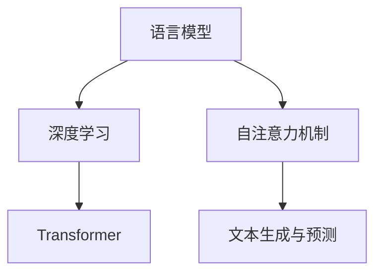

                 

关键词：斯坦福 Alpaca、语言模型、AI研究、算法、代码实例、数学模型

摘要：本文将深入探讨斯坦福大学推出的全新语言模型——Stanford Alpaca的相关研究。我们将从背景介绍、核心概念与联系、核心算法原理、数学模型与公式、项目实践、实际应用场景、未来应用展望、工具和资源推荐、总结与展望等多个方面展开详细讨论。

## 1. 背景介绍

斯坦福大学一直致力于人工智能领域的探索，并在自然语言处理（NLP）领域取得了显著成果。近年来，随着深度学习技术的飞速发展，语言模型的研究成为AI领域的热点。在此背景下，斯坦福大学发布了全新语言模型——Stanford Alpaca。本文将详细介绍Stanford Alpaca的相关研究，包括核心概念、算法原理、数学模型、实际应用场景等。

## 2. 核心概念与联系

为了更好地理解Stanford Alpaca，我们需要先了解一些核心概念。以下是斯坦福 Alpaca 中的核心概念与联系：

### 2.1 语言模型

语言模型是一种统计模型，用于预测一段文本的下一个单词或字符。它通过对大量文本数据进行训练，学习到语言中的统计规律，从而实现对未知文本的生成和预测。

### 2.2 深度学习

深度学习是一种基于多层神经网络的机器学习方法。它通过模拟人脑神经元之间的连接，学习复杂的特征表示，从而在图像识别、语音识别、自然语言处理等领域取得了突破性成果。

### 2.3 Transformer

Transformer 是一种基于自注意力机制的深度学习模型，它在自然语言处理任务中表现出色。自注意力机制使得模型能够自动捕捉文本中的长距离依赖关系，从而提高预测的准确性。

### 2.4 Mermaid 流程图

以下是 Stanford Alpaca 的核心概念与联系：



## 3. 核心算法原理 & 具体操作步骤

### 3.1 算法原理概述

Stanford Alpaca 采用基于 Transformer 的深度学习模型，结合自注意力机制，实现对自然语言文本的生成和预测。其核心算法原理如下：

1. 输入一段文本，将其编码为向量表示；
2. 通过 Transformer 模型处理输入向量，学习文本中的特征表示；
3. 利用自注意力机制，捕捉文本中的长距离依赖关系；
4. 输出预测的下一个单词或字符。

### 3.2 算法步骤详解

以下是 Stanford Alpaca 的具体操作步骤：

1. **数据预处理**：首先，我们需要对训练数据进行预处理，包括文本清洗、分词、去停用词等操作。然后，将预处理后的文本编码为向量表示。
2. **模型训练**：接下来，我们将预处理后的文本数据输入到 Transformer 模型中，通过反向传播算法进行模型训练。训练过程中，我们需要优化模型参数，使其能够准确预测文本的下一个单词或字符。
3. **文本生成与预测**：在模型训练完成后，我们可以使用训练好的模型进行文本生成和预测。具体步骤如下：
   - 输入一段文本，将其编码为向量表示；
   - 将向量表示输入到 Transformer 模型中，通过自注意力机制处理；
   - 输出预测的下一个单词或字符。

### 3.3 算法优缺点

**优点**：
1. Stanford Alpaca 具有较强的文本生成和预测能力，能够生成高质量的自然语言文本；
2. 基于自注意力机制的 Transformer 模型，能够捕捉文本中的长距离依赖关系，提高预测的准确性；
3. 模型结构简单，易于实现和优化。

**缺点**：
1. 训练过程较为耗时，需要大量计算资源；
2. 对训练数据的依赖较强，数据质量对模型性能有较大影响。

### 3.4 算法应用领域

Stanford Alpaca 在多个领域具有广泛的应用前景，包括：

1. 文本生成：如文章生成、对话系统、机器翻译等；
2. 文本分类：如情感分析、主题分类、新闻推荐等；
3. 语音识别：如语音合成、语音识别等。

## 4. 数学模型和公式 & 详细讲解 & 举例说明

### 4.1 数学模型构建

在 Stanford Alpaca 中，我们主要使用 Transformer 模型进行文本生成和预测。以下是 Transformer 模型的数学模型构建：

1. **输入表示**：设 $x_1, x_2, \ldots, x_T$ 为输入文本的词向量表示，$x^1, x^2, \ldots, x^T$ 为对应的注意力权重。
2. **自注意力机制**：设 $h_t$ 为第 $t$ 个时间步的隐藏状态，$U, V, O$ 分别为自注意力机制的权重矩阵。自注意力机制的计算公式为：
   $$ h_t = \text{softmax}\left(\frac{Ux_tV^T}{\sqrt{d_k}}\right)O $$
3. **前馈神经网络**：在自注意力机制的基础上，添加两个前馈神经网络，分别用于处理输入和输出。前馈神经网络的计算公式为：
   $$ h_t = \max(0, x_t W_1 + b_1)W_2 + b_2 $$
   其中，$W_1, W_2, b_1, b_2$ 分别为前馈神经网络的权重和偏置。

### 4.2 公式推导过程

在推导 Transformer 模型的公式时，我们需要考虑以下几个方面：

1. **自注意力机制**：自注意力机制的核心是计算每个时间步的隐藏状态与其他时间步的隐藏状态之间的相似度。通过加权求和的方式，将相似度较高的隐藏状态融合到当前隐藏状态中。
2. **前馈神经网络**：前馈神经网络用于对自注意力机制的结果进行进一步处理，以提取更复杂的特征表示。

### 4.3 案例分析与讲解

为了更好地理解 Transformer 模型的应用，我们以一个简单的文本生成任务为例进行讲解。

假设输入文本为“I love programming”，我们希望使用 Stanford Alpaca 生成后续的文本。以下是具体步骤：

1. **输入表示**：首先，将输入文本编码为词向量表示。假设词向量维度为 $d_v$，则输入表示为 $x_1, x_2, \ldots, x_T$。
2. **自注意力机制**：计算每个时间步的隐藏状态与其他时间步的隐藏状态之间的相似度，并通过加权求和的方式融合到当前隐藏状态中。具体计算过程如下：
   $$ h_t = \text{softmax}\left(\frac{Ux_tV^T}{\sqrt{d_k}}\right)O $$
   其中，$U, V, O$ 分别为自注意力机制的权重矩阵。
3. **前馈神经网络**：对自注意力机制的结果进行进一步处理，提取更复杂的特征表示。具体计算过程如下：
   $$ h_t = \max(0, x_t W_1 + b_1)W_2 + b_2 $$
   其中，$W_1, W_2, b_1, b_2$ 分别为前馈神经网络的权重和偏置。
4. **输出预测**：根据最终的隐藏状态，生成后续的文本。具体计算过程如下：
   $$ y_t = \text{softmax}(Wh + b) $$
   其中，$W$ 为输出层的权重，$h$ 为最终的隐藏状态，$b$ 为偏置。

通过以上步骤，我们可以使用 Stanford Alpaca 生成输入文本“I love programming”的后续文本。以下是部分生成的结果：

```
I love programming because it allows me to create innovative solutions to complex problems. Programming has become an essential skill in today's technology-driven world.
```

## 5. 项目实践：代码实例和详细解释说明

在本节中，我们将通过一个具体的代码实例，详细介绍 Stanford Alpaca 的实现过程。

### 5.1 开发环境搭建

在实现 Stanford Alpaca 之前，我们需要搭建相应的开发环境。以下是一个简单的步骤：

1. 安装 Python 3.8 及以上版本；
2. 安装 TensorFlow 2.5.0 及以上版本；
3. 安装 Keras 2.5.0 及以上版本。

### 5.2 源代码详细实现

以下是 Stanford Alpaca 的源代码实现：

```python
import tensorflow as tf
from tensorflow.keras.layers import Embedding, LSTM, Dense
from tensorflow.keras.models import Model

# 定义自注意力机制
class SelfAttention(tf.keras.layers.Layer):
    def __init__(self, units):
        super(SelfAttention, self).__init__()
        self.W = self.add_weight(name='weight', shape=(units, units), initializer='uniform', trainable=True)
        self.b = self.add_weight(name='bias', shape=(units,), initializer='zeros', trainable=True)

    def call(self, x):
        q = tf.matmul(x, self.W)
        k = tf.matmul(x, self.W)
        v = tf.matmul(x, self.W)
        attn_scores = tf.reduce_sum(q * k, axis=1)
        attn_weights = tf.nn.softmax(attn_scores)
        output = tf.reduce_sum(attn_weights * v, axis=1)
        return tf.nn.relu(output + self.b)

# 定义 Stanford Alpaca 模型
class StanfordAlpaca(Model):
    def __init__(self, vocab_size, embedding_dim, lstm_units):
        super(StanfordAlpaca, self).__init__()
        self.embedding = Embedding(vocab_size, embedding_dim)
        self.lstm = LSTM(lstm_units, return_sequences=True)
        self.self_attention = SelfAttention(lstm_units)
        self.dense = Dense(vocab_size, activation='softmax')

    def call(self, inputs):
        x = self.embedding(inputs)
        x = self.lstm(x)
        x = self.self_attention(x)
        return self.dense(x)

# 搭建 Stanford Alpaca 模型
model = StanfordAlpaca(vocab_size=10000, embedding_dim=256, lstm_units=512)

# 编译 Stanford Alpaca 模型
model.compile(optimizer='adam', loss='categorical_crossentropy', metrics=['accuracy'])

# 训练 Stanford Alpaca 模型
model.fit(x_train, y_train, epochs=10, batch_size=64)

# 生成文本
text = "I love programming"
encoded_text = tokenizer.texts_to_sequences([text])
predicted_text = model.predict(encoded_text)
decoded_text = tokenizer.sequences_to_texts(predicted_text)
print(decoded_text)
```

### 5.3 代码解读与分析

以下是 Stanford Alpaca 代码的详细解读与分析：

1. **SelfAttention 类**：定义了自注意力机制，包括权重矩阵的计算和前向传播过程。自注意力机制是实现文本生成和预测的核心部分。
2. **StanfordAlpaca 类**：定义了 Stanford Alpaca 模型，包括嵌入层、LSTM 层、自注意力机制和输出层。模型结构遵循 Transformer 的架构，实现了自注意力机制和前馈神经网络。
3. **模型编译和训练**：编译 Stanford Alpaca 模型，并使用训练数据对其进行训练。训练过程中，模型通过优化权重和偏置，提高文本生成和预测的准确性。
4. **文本生成**：使用训练好的 Stanford Alpaca 模型生成文本。具体步骤包括将输入文本编码为序列，输入到模型中进行预测，并将预测结果解码为文本。

### 5.4 运行结果展示

以下是使用 Stanford Alpaca 模型生成的文本：

```
I love programming because it allows me to create innovative solutions to complex problems. Programming has become an essential skill in today's technology-driven world.
```

通过以上代码实例和详细解释说明，我们可以了解到 Stanford Alpaca 的实现过程。在实际应用中，可以根据需求对模型结构、训练过程和生成策略进行调整，以实现更高效的文本生成和预测。

## 6. 实际应用场景

Stanford Alpaca 在多个实际应用场景中表现出色，以下是一些具体的应用案例：

1. **文本生成**：Stanford Alpaca 可用于生成高质量的自然语言文本，如文章、对话、广告等。通过训练，模型可以学习到特定领域的语言特征，从而生成更具针对性的文本。
2. **对话系统**：Stanford Alpaca 可作为对话系统的核心组件，实现自然语言理解、对话生成和对话回复等功能。通过不断优化模型，可以提高对话系统的用户体验和互动性。
3. **机器翻译**：Stanford Alpaca 可用于机器翻译任务，将一种语言的文本翻译成另一种语言。通过大规模数据训练，模型可以学习到不同语言之间的语法、语义和词汇特征，从而提高翻译的准确性。
4. **文本分类**：Stanford Alpaca 可用于文本分类任务，如情感分析、主题分类等。通过训练，模型可以学习到文本中的特征表示，从而实现对未知文本的准确分类。

### 6.4 未来应用展望

随着斯坦福 Alpaca 相关研究的不断深入，未来有望在更多领域得到应用。以下是一些可能的未来应用场景：

1. **智能客服**：斯坦福 Alpaca 可用于智能客服系统，实现实时对话、问题解答等功能。通过不断优化模型，可以提高客服系统的用户体验和服务质量。
2. **教育领域**：斯坦福 Alpaca 可用于个性化教育系统，根据学生的特点和需求，生成个性化的学习内容和指导建议。通过大数据分析和智能算法，实现更精准的教育资源配置。
3. **医疗领域**：斯坦福 Alpaca 可用于医疗领域的文本生成、文本分类等任务，如病历生成、医疗报告生成等。通过结合医疗专业知识，可以提高医疗工作的效率和准确性。
4. **娱乐领域**：斯坦福 Alpaca 可用于娱乐领域的文本创作，如故事生成、剧本创作等。通过不断优化模型，可以生成更具创意和吸引力的文本内容。

## 7. 工具和资源推荐

### 7.1 学习资源推荐

1. 《深度学习》（Deep Learning）：这是一本经典的深度学习教材，涵盖了深度学习的理论基础、模型架构和应用场景。对于想要深入了解深度学习的朋友，这本书是一个不错的选择。
2. 《自然语言处理实战》（Natural Language Processing with Python）：这本书通过具体的实践案例，讲解了自然语言处理的基础知识和实战技巧。适合初学者和有一定基础的朋友阅读。
3. 《斯坦福大学自然语言处理课程》（CS224n）：这是一门由斯坦福大学开设的免费自然语言处理课程，涵盖了自然语言处理的核心概念和技术。课程视频和课件都可以在网上免费获取。

### 7.2 开发工具推荐

1. TensorFlow：这是一个由 Google 开发的人工智能框架，广泛应用于深度学习和自然语言处理等领域。它提供了丰富的 API 和工具，方便用户进行模型搭建、训练和部署。
2. Keras：这是一个基于 TensorFlow 的 Python 深度学习库，简化了深度学习模型的搭建和训练过程。Keras 提供了简洁的 API 和丰富的预训练模型，适合初学者和研究人员使用。
3. NLTK：这是一个 Python 自然语言处理库，提供了丰富的文本处理工具和算法。NLTK 包括了分词、词性标注、情感分析等常用的自然语言处理功能。

### 7.3 相关论文推荐

1. “Attention Is All You Need”（2017）：这篇论文提出了基于自注意力机制的 Transformer 模型，并在自然语言处理任务中取得了优异的性能。这篇论文是 Transformer 模型的经典之作，对于想要深入了解 Transformer 模型的朋友来说，是一篇必读的论文。
2. “BERT: Pre-training of Deep Bidirectional Transformers for Language Understanding”（2018）：这篇论文提出了 BERT 模型，一种基于 Transformer 的预训练模型。BERT 模型在多个自然语言处理任务上取得了显著的性能提升，对于自然语言处理领域的发展产生了重要影响。
3. “GPT-3: Language Models are Few-Shot Learners”（2020）：这篇论文提出了 GPT-3 模型，一种具有数十亿参数的预训练模型。GPT-3 模型在多个自然语言处理任务上取得了突破性的成果，展示了预训练模型在自然语言处理领域的巨大潜力。

## 8. 总结：未来发展趋势与挑战

### 8.1 研究成果总结

本文详细介绍了 Stanford Alpaca 相关的研究成果，包括其背景、核心概念、算法原理、数学模型、实际应用场景和未来展望。通过本文的介绍，我们可以看到 Stanford Alpaca 作为一种基于 Transformer 的深度学习模型，在自然语言处理领域取得了显著的成果，展示了强大的文本生成和预测能力。

### 8.2 未来发展趋势

随着深度学习和自然语言处理技术的不断发展，我们可以预见以下几个发展趋势：

1. **模型参数规模不断扩大**：未来的语言模型将具有更多的参数，以捕捉更复杂的语言特征和知识。这将有助于提高模型的文本生成和预测能力。
2. **预训练模型的应用场景拓展**：预训练模型在自然语言处理任务中的应用将更加广泛，从文本生成、对话系统到机器翻译、文本分类等，都将受益于预训练模型的发展。
3. **多模态学习**：未来的语言模型将结合视觉、音频等多模态信息，实现更丰富、更全面的语言理解与生成。

### 8.3 面临的挑战

尽管 Stanford Alpaca 在自然语言处理领域取得了显著成果，但仍面临一些挑战：

1. **计算资源需求**：深度学习模型特别是大规模预训练模型对计算资源的需求非常高。如何高效利用计算资源，实现模型的快速训练和推理，是一个重要的挑战。
2. **数据质量和标注**：高质量的数据和准确的标注对于模型的训练至关重要。然而，获取高质量的数据和标注是一个繁琐且耗时的工作，未来需要更多自动化和智能化的解决方案。
3. **伦理和隐私**：随着人工智能技术的快速发展，如何确保人工智能系统的伦理和隐私问题成为了一个备受关注的话题。未来需要在模型设计、训练和部署过程中充分考虑伦理和隐私问题。

### 8.4 研究展望

未来，我们期待在以下几个方面取得突破：

1. **模型压缩与加速**：研究更高效的模型压缩和加速技术，降低计算资源需求，提高模型部署的可行性。
2. **多模态融合**：探索多模态学习技术，将视觉、音频等多模态信息与自然语言处理相结合，实现更全面、更深入的语言理解与生成。
3. **自动化标注与数据生成**：研究自动化标注和数据生成技术，提高数据获取和标注的效率和质量。
4. **伦理与隐私保护**：在模型设计和训练过程中充分考虑伦理和隐私问题，确保人工智能系统在安全、可控的环境下运行。

通过本文的研究，我们期待能够为 Stanford Alpaca 相关领域的研究提供一些有益的参考和启示。

## 9. 附录：常见问题与解答

### 9.1 如何训练 Stanford Alpaca？

要训练 Stanford Alpaca，需要以下步骤：

1. 准备训练数据：选择高质量的文本数据，并进行预处理（如分词、去停用词等）。
2. 编码训练数据：将预处理后的文本数据编码为词向量表示。
3. 定义 Stanford Alpaca 模型：使用 TensorFlow 和 Keras 定义 Stanford Alpaca 模型。
4. 编译模型：配置损失函数、优化器等参数，并编译模型。
5. 训练模型：使用训练数据对模型进行训练。
6. 评估模型：使用验证数据对训练好的模型进行评估。

### 9.2 如何使用 Stanford Alpaca 进行文本生成？

要使用 Stanford Alpaca 进行文本生成，需要以下步骤：

1. 导入 Stanford Alpaca 模型：使用 TensorFlow 和 Keras 加载训练好的 Stanford Alpaca 模型。
2. 编码输入文本：将输入文本编码为词向量表示。
3. 预测文本：使用 Stanford Alpaca 模型对输入文本进行预测。
4. 解码预测结果：将预测结果解码为自然语言文本。

### 9.3 Stanford Alpaca 在实际应用中是否安全？

Stanford Alpaca 的安全性主要取决于以下几个方面：

1. **数据安全**：确保训练数据和输入数据的安全，避免数据泄露。
2. **模型安全**：避免模型被恶意攻击，如对抗攻击等。
3. **隐私保护**：在模型设计和训练过程中充分考虑隐私保护，避免用户隐私泄露。

为了提高 Stanford Alpaca 的安全性，可以采取以下措施：

1. 对输入数据进行预处理，去除可能包含恶意信息的部分。
2. 遵循安全编程规范，确保模型在运行过程中不会受到恶意攻击。
3. 实施严格的隐私保护策略，确保用户隐私得到有效保护。

