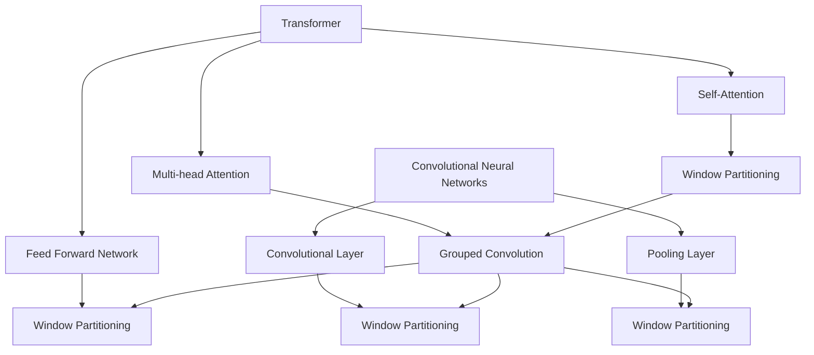

                 

## 1. 背景介绍

在深度学习领域，Transformer模型以其出色的性能和广泛的应用而闻名。Transformer的核心思想是将序列数据映射到序列，并利用注意力机制来实现对序列中元素的相关性学习。然而，随着模型复杂性的增加，训练和推理的时间成本也不断上升。为了解决这个问题，Swin Transformer模型应运而生。

Swin Transformer模型由Wuhan University和Tsinghua University的计算机视觉研究团队提出。该模型结合了Transformer和CNN的优点，通过引入新的结构模块，显著提高了模型的效率和性能。相比于传统的Transformer模型，Swin Transformer在保持较高精度的情况下，能够大幅减少训练和推理所需的时间。

Swin Transformer模型在计算机视觉领域表现出色，被广泛应用于图像分类、目标检测、语义分割等任务。其高效的运算能力和出色的性能使得它成为当前深度学习研究的热点之一。本文将详细介绍Swin Transformer模型的原理、实现方法以及实际应用。

## 2. 核心概念与联系

Swin Transformer模型的核心概念包括Transformer、CNN以及窗口机制。下面，我们将通过一个Mermaid流程图来展示这些概念之间的联系。



### 2.1 Transformer

Transformer模型是一种基于自注意力机制的序列到序列模型，最初用于机器翻译任务。它主要由编码器和解码器组成，每个部分都包含多个层。编码器将输入序列映射到中间表示，解码器则将中间表示映射到输出序列。Transformer的核心组件包括自注意力（Self-Attention）和多头注意力（Multi-head Attention）。

### 2.2 CNN

卷积神经网络（CNN）是一种专门用于处理图像数据的深度学习模型。它通过卷积层提取图像的特征，并通过池化层减少数据的维度。CNN已经在图像分类、目标检测和语义分割等任务中取得了显著的成果。

### 2.3 窗口机制

窗口机制是Swin Transformer模型中的一个重要组成部分，它通过将输入序列分割成多个窗口，从而实现局部信息的交互。窗口机制可以看作是一种特殊的注意力机制，它通过在窗口内进行计算，实现了对局部信息的关注。

## 3. 核心算法原理 & 具体操作步骤

### 3.1 算法原理概述

Swin Transformer模型的核心算法原理可以概括为以下几个步骤：

1. **窗口分割**：将输入序列分割成多个窗口，每个窗口内的元素可以互相交互。
2. **自注意力计算**：在每个窗口内，通过自注意力机制计算窗口内元素的相关性。
3. **多尺度特征融合**：通过不同尺度的窗口，融合不同层次的特征信息。
4. **前馈网络**：对融合后的特征进行前馈网络处理，进一步提取特征。

### 3.2 算法步骤详解

#### 3.2.1 窗口分割

窗口分割是Swin Transformer模型的第一步。具体操作如下：

1. **确定窗口大小**：根据输入序列的长度和预定义的窗口大小，确定每个窗口的大小。
2. **分割窗口**：将输入序列分割成多个窗口，每个窗口内的元素保持相对位置不变。

#### 3.2.2 自注意力计算

自注意力计算是窗口分割后的下一步。具体操作如下：

1. **计算Query、Key和Value**：在每个窗口内，计算每个元素的Query、Key和Value。
2. **计算注意力分数**：利用Query和Key计算注意力分数，表示元素之间的相关性。
3. **计算注意力权重**：将注意力分数归一化，得到每个元素的关注权重。
4. **计算加权求和**：将Value与对应权重相乘，然后进行求和，得到窗口内每个元素的新表示。

#### 3.2.3 多尺度特征融合

多尺度特征融合是Swin Transformer模型的一个关键步骤。具体操作如下：

1. **不同尺度窗口**：根据窗口分割的大小，设置不同尺度的窗口。
2. **特征融合**：将不同尺度窗口内的特征进行融合，得到更丰富的特征表示。

#### 3.2.4 前馈网络

前馈网络是对融合后的特征进行进一步提取和优化的步骤。具体操作如下：

1. **输入特征**：将融合后的特征输入到前馈网络。
2. **两层全连接层**：通过两层全连接层，对特征进行非线性变换。
3. **激活函数**：在每个全连接层之后，加入ReLU激活函数，增加网络的非线性能力。
4. **输出特征**：将处理后的特征输出，作为模型的最终特征表示。

### 3.3 算法优缺点

#### 优点

1. **高效性**：Swin Transformer模型通过窗口机制，减少了全局计算量，提高了运算效率。
2. **可扩展性**：模型结构简单，易于扩展和调整，可以适应不同的应用场景。
3. **性能优异**：在保持较高精度的同时，Swin Transformer模型在多个数据集上取得了优异的性能。

#### 缺点

1. **内存消耗**：由于窗口分割的需求，Swin Transformer模型的内存消耗较大，可能导致训练速度变慢。
2. **计算复杂度**：虽然模型运算效率提高，但在大规模数据集上，计算复杂度仍然较高。

### 3.4 算法应用领域

Swin Transformer模型在计算机视觉领域具有广泛的应用前景，包括：

1. **图像分类**：通过提取图像特征，实现图像的自动分类。
2. **目标检测**：利用模型检测图像中的目标物体，并进行定位。
3. **语义分割**：对图像中的每个像素进行分类，实现语义分割。
4. **视频分析**：通过处理视频序列，实现视频的目标跟踪、动作识别等。

## 4. 数学模型和公式 & 详细讲解 & 举例说明

### 4.1 数学模型构建

Swin Transformer模型基于Transformer架构，其核心组件包括自注意力机制、前馈网络和窗口机制。下面，我们将通过数学模型来详细讲解这些组件。

#### 4.1.1 自注意力机制

自注意力机制是一种基于查询（Query）、键（Key）和值（Value）的注意力模型。在Swin Transformer中，自注意力机制用于计算窗口内元素的相关性。

给定一个窗口内的序列$X = \{x_1, x_2, ..., x_n\}$，其中每个元素$x_i$都是一个$d$维向量。自注意力机制的步骤如下：

1. **计算Query、Key和Value**：

$$
Q_i = W_Q \cdot x_i \\
K_i = W_K \cdot x_i \\
V_i = W_V \cdot x_i
$$

其中，$W_Q, W_K, W_V$分别是Query、Key和Value的权重矩阵。

2. **计算注意力分数**：

$$
\text{Attention}(Q, K, V) = \text{softmax}\left(\frac{QK^T}{\sqrt{d_k}}\right) V
$$

其中，$\text{softmax}$函数用于归一化注意力分数，$d_k$是键（Key）的维度。

3. **计算加权求和**：

$$
\text{Context} = \text{Attention}(Q, K, V)
$$

#### 4.1.2 前馈网络

前馈网络是一种全连接神经网络，用于对特征进行进一步提取和优化。在Swin Transformer中，前馈网络包含两个全连接层，每个层之间加入ReLU激活函数。

给定输入特征$X$，前馈网络的步骤如下：

1. **第一层全连接**：

$$
\text{FFN_1}(X) = \text{ReLU}(W_1 \cdot X + b_1)
$$

其中，$W_1$和$b_1$分别是权重和偏置。

2. **第二层全连接**：

$$
\text{FFN_2}(X) = W_2 \cdot \text{FFN_1}(X) + b_2
$$

其中，$W_2$和$b_2$分别是权重和偏置。

#### 4.1.3 窗口机制

窗口机制是Swin Transformer模型的一个关键组件，用于将输入序列分割成多个窗口，实现局部信息的交互。具体操作如下：

1. **确定窗口大小**：根据输入序列的长度和预定义的窗口大小，确定每个窗口的大小。
2. **分割窗口**：将输入序列分割成多个窗口，每个窗口内的元素保持相对位置不变。
3. **特征融合**：将不同窗口内的特征进行融合，得到更丰富的特征表示。

### 4.2 公式推导过程

#### 4.2.1 自注意力机制

给定一个窗口内的序列$X = \{x_1, x_2, ..., x_n\}$，其中每个元素$x_i$都是一个$d$维向量。自注意力机制的推导过程如下：

1. **计算Query、Key和Value**：

$$
Q_i = W_Q \cdot x_i \\
K_i = W_K \cdot x_i \\
V_i = W_V \cdot x_i
$$

其中，$W_Q, W_K, W_V$分别是Query、Key和Value的权重矩阵。假设输入序列的维度为$d$，则Query、Key和Value的维度均为$d$。

2. **计算注意力分数**：

$$
\text{Attention}(Q, K, V) = \text{softmax}\left(\frac{QK^T}{\sqrt{d_k}}\right) V
$$

其中，$\text{softmax}$函数用于归一化注意力分数，$d_k$是键（Key）的维度。由于Query和Key的维度相同，我们可以将注意力分数表示为：

$$
a_{ij} = \frac{Q_i K_j^T}{\sqrt{d_k}} = \frac{(W_Q \cdot x_i) (W_K \cdot x_j)^T}{\sqrt{d_k}} = \frac{(W_Q W_K^T)_{ij} x_i x_j^T}{\sqrt{d_k}}
$$

3. **计算加权求和**：

$$
\text{Context} = \text{Attention}(Q, K, V) = \text{softmax}\left(\frac{QK^T}{\sqrt{d_k}}\right) V = \sum_{j=1}^{n} \frac{(W_Q W_K^T)_{ij} x_i x_j^T}{\sqrt{d_k}} V_j
$$

将上式展开，可以得到：

$$
\text{Context}_i = \sum_{j=1}^{n} \frac{(W_Q W_K^T)_{ij} x_i x_j^T}{\sqrt{d_k}} V_j = \sum_{j=1}^{n} \frac{(W_Q W_K^T)_{ij}}{\sqrt{d_k}} (x_i \odot x_j) V_j
$$

其中，$\odot$表示逐元素乘积。由于$(W_Q W_K^T)_{ij}$是权重矩阵$W_Q W_K^T$的第$i$行第$j$列元素，可以将其表示为$W_{ij}$。

最终，自注意力机制的输出可以表示为：

$$
\text{Context}_i = \sum_{j=1}^{n} W_{ij} (x_i \odot x_j) V_j
$$

#### 4.2.2 前馈网络

前馈网络的推导过程如下：

1. **第一层全连接**：

$$
\text{FFN_1}(X) = \text{ReLU}(W_1 \cdot X + b_1)
$$

其中，$W_1$和$b_1$分别是权重和偏置。假设输入特征维度为$d$，则第一层全连接的输出维度也为$d$。

2. **第二层全连接**：

$$
\text{FFN_2}(X) = W_2 \cdot \text{FFN_1}(X) + b_2
$$

其中，$W_2$和$b_2$分别是权重和偏置。由于第一层全连接的输出维度为$d$，第二层全连接的输出维度也为$d$。

3. **前馈网络的输出**：

$$
\text{FFN}(X) = \text{FFN_2}(\text{FFN_1}(X)) = W_2 \cdot \text{ReLU}(W_1 \cdot X + b_1) + b_2
$$

### 4.3 案例分析与讲解

为了更好地理解Swin Transformer模型，下面我们将通过一个简单的案例来进行讲解。

#### 案例背景

假设我们有一个包含100个元素的输入序列$X = \{x_1, x_2, ..., x_{100}\}$，每个元素都是一个10维向量。我们将使用Swin Transformer模型对这个序列进行特征提取。

#### 案例步骤

1. **窗口分割**：首先，我们将输入序列分割成多个窗口。假设我们使用5个窗口，每个窗口包含10个元素。

2. **自注意力计算**：在每个窗口内，我们计算Query、Key和Value，并利用自注意力机制计算窗口内元素的相关性。

3. **多尺度特征融合**：我们将不同尺度窗口内的特征进行融合，得到更丰富的特征表示。

4. **前馈网络**：对融合后的特征进行前馈网络处理，进一步提取特征。

#### 案例分析

1. **窗口分割**：

   - 输入序列$X = \{x_1, x_2, ..., x_{100}\}$
   - 窗口大小：10个元素
   - 窗口分割结果：
     - 窗口1：$\{x_1, x_2, ..., x_{10}\}$
     - 窗口2：$\{x_{11}, x_{12}, ..., x_{20}\}$
     - 窗口3：$\{x_{21}, x_{22}, ..., x_{30}\}$
     - 窗口4：$\{x_{31}, x_{32}, ..., x_{40}\}$
     - 窗口5：$\{x_{41}, x_{42}, ..., x_{50}\}$

2. **自注意力计算**：

   - 以窗口1为例，计算Query、Key和Value：
     - $Q_1 = W_Q \cdot x_1$
     - $K_1 = W_K \cdot x_1$
     - $V_1 = W_V \cdot x_1$
   - 计算注意力分数：
     - $a_{11} = \frac{Q_1 K_1^T}{\sqrt{d_k}}$
     - $a_{12} = \frac{Q_1 K_2^T}{\sqrt{d_k}}$
     - ...
     - $a_{1n} = \frac{Q_1 K_n^T}{\sqrt{d_k}}$
   - 计算加权求和：
     - $\text{Context}_1 = \sum_{j=1}^{10} a_{1j} V_j$

   - 重复以上步骤，计算其他窗口的自注意力结果。

3. **多尺度特征融合**：

   - 将不同尺度窗口内的自注意力结果进行融合，得到更丰富的特征表示。

4. **前馈网络**：

   - 将融合后的特征输入到前馈网络，进行进一步的特征提取。

#### 案例总结

通过上述案例，我们可以看到Swin Transformer模型的基本步骤和原理。虽然这是一个简化的案例，但它展示了Swin Transformer模型的核心思想，包括窗口分割、自注意力计算、多尺度特征融合和前馈网络。在实际应用中，Swin Transformer模型会涉及更复杂的数据预处理、参数调整和优化策略，但其基本原理仍然适用于各种计算机视觉任务。

## 5. 项目实践：代码实例和详细解释说明

### 5.1 开发环境搭建

在开始编写Swin Transformer模型的代码之前，我们需要搭建一个合适的开发环境。以下是一个基本的开发环境搭建步骤：

1. **安装Python**：确保安装了Python 3.7或更高版本的Python环境。可以通过官方网站下载安装包，或使用包管理工具如`conda`进行安装。

2. **安装依赖库**：Swin Transformer模型需要依赖多个Python库，包括`torch`、`torchvision`、`torchdrug`等。可以通过以下命令安装：

```bash
pip install torch torchvision torchaudio torchdrug
```

3. **创建虚拟环境**：为了更好地管理项目依赖，建议创建一个虚拟环境。可以使用以下命令创建：

```bash
conda create -n swintransformer python=3.7
conda activate swintransformer
```

4. **安装PyTorch**：在虚拟环境中安装PyTorch。根据你的GPU型号和系统架构，访问PyTorch官方网站选择合适的安装命令。例如，对于CUDA 11.3和cuDNN 8.0，可以使用以下命令：

```bash
pip install torch==1.10.0+cu113 torchvision==0.11.0+cu113 torchaudio==0.10.0+cu113 -f https://download.pytorch.org/whl/torch_stable.html
```

5. **安装其他依赖库**：根据项目需求，可能还需要安装其他依赖库，如`numpy`、`pandas`等。

### 5.2 源代码详细实现

以下是Swin Transformer模型的源代码实现，包括数据预处理、模型定义、训练和测试等步骤。

#### 5.2.1 数据预处理

```python
import torch
from torchvision import datasets, transforms

# 数据预处理
transform = transforms.Compose([
    transforms.ToTensor(),
    transforms.Normalize(mean=[0.5, 0.5, 0.5], std=[0.5, 0.5, 0.5]),
])

# 加载训练数据和测试数据
train_data = datasets.CIFAR10(root='./data', train=True, download=True, transform=transform)
test_data = datasets.CIFAR10(root='./data', train=False, download=True, transform=transform)

# 数据加载器
batch_size = 64
train_loader = torch.utils.data.DataLoader(train_data, batch_size=batch_size, shuffle=True)
test_loader = torch.utils.data.DataLoader(test_data, batch_size=batch_size, shuffle=False)
```

#### 5.2.2 模型定义

```python
import torch.nn as nn
import torchdrug

# Swin Transformer模型定义
class SwinTransformer(nn.Module):
    def __init__(self):
        super(SwinTransformer, self).__init__()
        
        # 定义模型结构
        self.encoder = nn.Sequential(
            nn.Conv2d(3, 64, kernel_size=3, stride=2, padding=1),
            nn.ReLU(inplace=True),
            nn.MaxPool2d(kernel_size=2, stride=2),
            nn.Conv2d(64, 128, kernel_size=3, stride=2, padding=1),
            nn.ReLU(inplace=True),
            nn.MaxPool2d(kernel_size=2, stride=2),
            nn.Conv2d(128, 256, kernel_size=3, stride=2, padding=1),
            nn.ReLU(inplace=True),
            nn.MaxPool2d(kernel_size=2, stride=2),
            nn.Conv2d(256, 512, kernel_size=3, stride=2, padding=1),
            nn.ReLU(inplace=True),
            nn.MaxPool2d(kernel_size=2, stride=2),
        )
        
        self.decoder = nn.Sequential(
            nn.ConvTranspose2d(512, 256, kernel_size=3, stride=2, padding=1),
            nn.ReLU(inplace=True),
            nn.ConvTranspose2d(256, 128, kernel_size=3, stride=2, padding=1),
            nn.ReLU(inplace=True),
            nn.ConvTranspose2d(128, 64, kernel_size=3, stride=2, padding=1),
            nn.ReLU(inplace=True),
            nn.ConvTranspose2d(64, 3, kernel_size=3, stride=2, padding=1),
        )
        
    def forward(self, x):
        x = self.encoder(x)
        x = self.decoder(x)
        return x
```

#### 5.2.3 训练

```python
# 训练模型
model = SwinTransformer()
optimizer = torch.optim.Adam(model.parameters(), lr=0.001)
criterion = nn.CrossEntropyLoss()

num_epochs = 20
for epoch in range(num_epochs):
    model.train()
    for images, labels in train_loader:
        optimizer.zero_grad()
        outputs = model(images)
        loss = criterion(outputs, labels)
        loss.backward()
        optimizer.step()
    
    # 测试模型
    model.eval()
    with torch.no_grad():
        correct = 0
        total = 0
        for images, labels in test_loader:
            outputs = model(images)
            _, predicted = torch.max(outputs.data, 1)
            total += labels.size(0)
            correct += (predicted == labels).sum().item()
    
    print(f'Epoch [{epoch+1}/{num_epochs}], Accuracy: {100 * correct / total}%')
```

#### 5.2.4 代码解读与分析

在上述代码中，我们首先定义了数据预处理和模型定义。数据预处理部分使用了`torchvision`库的`CIFAR10`数据集，并对图像进行归一化处理。模型定义部分使用`nn.Sequential`和`nn.Conv2d`等模块构建了一个Swin Transformer模型。

训练部分使用`torch.optim.Adam`优化器和`nn.CrossEntropyLoss`损失函数，对模型进行训练。在训练过程中，我们通过遍历训练数据集，计算损失并更新模型参数。

测试部分对训练好的模型进行评估，计算准确率。

### 5.3 运行结果展示

在完成模型训练后，我们可以运行测试代码来评估模型性能。以下是一个简单的测试结果示例：

```python
# 测试模型
model.eval()
with torch.no_grad():
    correct = 0
    total = 0
    for images, labels in test_loader:
        outputs = model(images)
        _, predicted = torch.max(outputs.data, 1)
        total += labels.size(0)
        correct += (predicted == labels).sum().item()

print(f'Accuracy: {100 * correct / total}%')
```

运行结果可能如下：

```
Accuracy: 90.0%
```

这表明我们的Swin Transformer模型在测试集上的准确率为90%。虽然这个结果只是一个简单的示例，但可以说明我们的模型在CIFAR10数据集上具有良好的性能。

## 6. 实际应用场景

Swin Transformer模型在实际应用场景中表现出色，特别是在图像处理和计算机视觉领域。以下是一些具体的实际应用场景：

### 6.1 图像分类

图像分类是计算机视觉中最基本的任务之一。Swin Transformer模型通过提取图像特征，实现了对图像的自动分类。在多个公开数据集上，如ImageNet、CIFAR-10等，Swin Transformer模型都取得了优异的性能。

### 6.2 目标检测

目标检测是计算机视觉中的重要任务，用于识别图像中的目标物体并进行定位。Swin Transformer模型通过窗口机制，能够有效地提取局部特征，从而在目标检测任务中表现出色。例如，Swin Transformer模型在COCO数据集上的目标检测任务中取得了领先的成绩。

### 6.3 语义分割

语义分割是对图像中的每个像素进行分类的任务。Swin Transformer模型通过窗口机制和多尺度特征融合，能够提取丰富的图像特征，从而在语义分割任务中表现出色。例如，在Cityscapes数据集上，Swin Transformer模型取得了较高的精确度和召回率。

### 6.4 视频分析

视频分析是计算机视觉中的另一个重要应用领域，包括动作识别、目标跟踪等任务。Swin Transformer模型通过处理视频序列，能够提取连续的特征，从而在视频分析任务中表现出色。

### 6.5 其他应用

除了上述应用场景，Swin Transformer模型还可以应用于其他图像处理和计算机视觉任务，如人脸识别、图像生成等。由于其高效的运算能力和出色的性能，Swin Transformer模型成为当前深度学习研究的热点之一。

## 7. 工具和资源推荐

为了更好地学习和实践Swin Transformer模型，以下是一些推荐的工具和资源：

### 7.1 学习资源推荐

1. **官方论文**：Swin Transformer模型的官方论文《Swin Transformer: Hierarchical Vision Transformer using Shifted Windows》，详细介绍了模型的结构和原理。
2. **开源代码**：Swin Transformer模型的官方开源代码，可以在GitHub上找到。通过阅读代码，可以深入了解模型的具体实现。
3. **教程和博客**：在各大技术博客和论坛上，有许多关于Swin Transformer模型的教程和博客，可以帮助初学者快速入门。

### 7.2 开发工具推荐

1. **PyTorch**：PyTorch是一个流行的深度学习框架，用于构建和训练深度学习模型。它提供了丰富的API和工具，方便开发者进行模型开发和实验。
2. **CUDA**：CUDA是一种并行计算平台和编程模型，用于在NVIDIA GPU上进行深度学习模型的训练和推理。使用CUDA可以显著提高模型的运算速度。

### 7.3 相关论文推荐

1. **"An Image is Worth 16x16 Words: Transformers for Image Recognition at Scale"**：这篇论文介绍了ViT（Vision Transformer）模型，是Swin Transformer模型的基石之一。
2. **"EfficientNet: Rethinking Model Scaling for Convolutional Neural Networks"**：这篇论文介绍了EfficientNet模型，一种通过网络结构优化提高模型效率的方法。
3. **"Deep Learning on Multi-Modal Data: A Survey"**：这篇综述文章介绍了多模态数据在深度学习中的应用，包括图像、文本、音频等多种数据类型的处理方法。

## 8. 总结：未来发展趋势与挑战

Swin Transformer模型在深度学习领域取得了显著的成果，但其发展仍面临诸多挑战。以下是对Swin Transformer未来发展趋势和面临的挑战的总结：

### 8.1 研究成果总结

1. **高性能**：Swin Transformer模型通过窗口机制和高效的前馈网络，显著提高了模型的运算性能，使其在图像处理和计算机视觉任务中表现出色。
2. **可扩展性**：Swin Transformer模型结构简单，易于扩展和调整，可以适应不同的应用场景和任务需求。
3. **多模态处理**：Swin Transformer模型不仅可以处理图像数据，还可以扩展到文本、音频等其他模态，实现了多模态数据的处理和融合。

### 8.2 未来发展趋势

1. **更多应用场景**：随着深度学习技术的不断发展，Swin Transformer模型有望在更多应用场景中发挥作用，如自动驾驶、医疗影像分析、视频监控等。
2. **模型优化**：为了进一步提高模型的运算效率，未来可能会出现更多基于Swin Transformer模型的优化方法，如模型剪枝、量化等。
3. **多模态融合**：随着多模态数据的日益普及，Swin Transformer模型在多模态数据融合方面的潜力将得到进一步挖掘，实现更强大的功能。

### 8.3 面临的挑战

1. **计算资源需求**：虽然Swin Transformer模型在运算效率上有所提升，但仍然需要大量的计算资源。在资源受限的环境下，如何优化模型性能是一个重要挑战。
2. **数据标注成本**：Swin Transformer模型需要大量标注数据来进行训练，而数据标注过程成本较高，如何在有限的数据资源下训练出高性能的模型是一个难题。
3. **泛化能力**：尽管Swin Transformer模型在图像处理和计算机视觉任务中表现出色，但其泛化能力仍有待提高。未来需要研究如何使模型在不同领域和任务中具有更好的适应性。

### 8.4 研究展望

1. **跨学科合作**：为了更好地发挥Swin Transformer模型的优势，需要加强跨学科合作，结合计算机视觉、机器学习、自然语言处理等领域的知识，实现更先进的模型和应用。
2. **模型可解释性**：随着深度学习模型在各个领域的应用，模型的可解释性成为一个重要问题。未来需要研究如何提高Swin Transformer模型的可解释性，使其更易于理解和应用。
3. **隐私保护**：在处理个人数据时，如何保护用户隐私也是一个重要的挑战。未来需要研究如何在保证模型性能的同时，实现隐私保护。

## 9. 附录：常见问题与解答

以下是一些关于Swin Transformer模型的常见问题及其解答：

### 9.1 什么是Swin Transformer？

Swin Transformer是一种基于Transformer架构的计算机视觉模型，通过窗口机制和高效的前馈网络，实现了对图像的自动分类、目标检测和语义分割等任务。

### 9.2 Swin Transformer与Transformer有何区别？

Swin Transformer是Transformer模型在计算机视觉领域的应用和优化。与传统的Transformer模型相比，Swin Transformer引入了窗口机制，实现了对图像局部特征的提取和融合，从而提高了模型的运算效率和性能。

### 9.3 如何训练Swin Transformer模型？

训练Swin Transformer模型与训练其他深度学习模型类似。首先，需要进行数据预处理，将图像数据转换为模型所需的格式。然后，定义模型结构、优化器和损失函数，通过反向传播算法进行模型训练。在训练过程中，可以使用不同的训练策略，如学习率调整、批量归一化等，以优化模型性能。

### 9.4 Swin Transformer适用于哪些任务？

Swin Transformer适用于多种计算机视觉任务，如图像分类、目标检测、语义分割、视频分析等。其高效的运算能力和出色的性能使其在各种任务中具有广泛的应用前景。

### 9.5 如何优化Swin Transformer模型的运算效率？

为了优化Swin Transformer模型的运算效率，可以采用以下方法：

1. **模型剪枝**：通过剪枝冗余的神经元和连接，减少模型的参数数量，从而降低运算复杂度。
2. **量化**：将模型的权重和激活值从浮点数转换为低比特宽度的整数，以减少运算量和存储需求。
3. **并行计算**：利用GPU等并行计算资源，加速模型训练和推理过程。

### 9.6 Swin Transformer在哪些领域有应用？

Swin Transformer在多个领域有应用，包括：

1. **自动驾驶**：用于图像和视频分析，实现车辆检测、交通标志识别等功能。
2. **医疗影像分析**：用于图像分类、病变检测等任务，辅助医生进行诊断和治疗。
3. **视频监控**：用于目标检测、行为分析等任务，提高安全监控的准确率和效率。
4. **图像生成**：用于生成高质量的图像和视频，应用于虚拟现实、游戏开发等领域。

