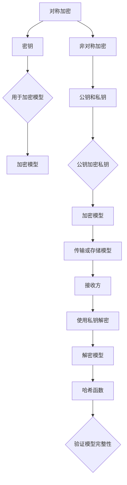

                 

 在当今数据驱动的世界中，机器学习和人工智能已经成为各行各业的重要工具。随着TensorFlow成为最受欢迎的机器学习框架之一，TensorFlow Lite（TF Lite）也逐渐成为移动设备和嵌入式系统的首选。然而，随着模型的广泛应用，模型的安全性和隐私保护问题也变得越来越重要。本文将探讨如何对TensorFlow Lite模型进行加密，以保护模型的安全性和隐私性。

## 1. 背景介绍

随着深度学习模型在移动设备和嵌入式系统中的广泛应用，这些模型的安全性和隐私保护问题变得尤为关键。在不安全的网络环境中，未经授权的第三方可能会窃取模型，导致知识产权泄露、模型被篡改或恶意使用。因此，对TensorFlow Lite模型进行加密是一项重要的安全措施。

加密技术可以帮助保护模型免受未经授权的访问，确保模型在传输和存储过程中保持安全。此外，加密还可以帮助防止模型在设备上被恶意篡改，从而保护用户的隐私。

## 2. 核心概念与联系

为了更好地理解TensorFlow Lite模型加密的原理，我们需要先了解一些核心概念，包括对称加密、非对称加密、哈希函数等。

### 2.1 对称加密

对称加密是一种加密方法，使用相同的密钥对数据进行加密和解密。常见的对称加密算法包括AES（Advanced Encryption Standard）和DES（Data Encryption Standard）。

### 2.2 非对称加密

非对称加密使用一对密钥（公钥和私钥）进行加密和解密。公钥用于加密数据，私钥用于解密数据。常见的非对称加密算法包括RSA（Rivest-Shamir-Adleman）和ECC（Elliptic Curve Cryptography）。

### 2.3 哈希函数

哈希函数是一种将数据映射为固定长度字符串的算法，通常用于确保数据的完整性和一致性。常见的哈希函数包括MD5、SHA-1和SHA-256。

### 2.4 Mermaid流程图

下面是一个Mermaid流程图，展示了TensorFlow Lite模型加密的核心概念和联系：



## 3. 核心算法原理 & 具体操作步骤

### 3.1 算法原理概述

TensorFlow Lite模型加密的主要算法原理是对称加密和非对称加密的结合使用。首先，使用非对称加密对模型进行加密，生成一个加密模型。然后，使用对称加密对模型中的敏感数据进行加密，以保护模型的隐私性。最后，使用哈希函数对加密模型进行哈希处理，以确保模型的完整性。

### 3.2 算法步骤详解

1. **生成密钥对**：首先，使用非对称加密算法生成一对密钥（公钥和私钥）。

2. **加密模型**：使用公钥对整个模型进行加密，生成一个加密模型。

3. **对称加密**：对于模型中的敏感数据，使用对称加密算法进行加密。

4. **哈希处理**：对加密模型进行哈希处理，生成一个哈希值。

5. **传输或存储模型**：将加密模型和哈希值一起传输或存储。

6. **接收方解密**：接收方使用私钥对加密模型进行解密，得到原始模型。

7. **验证完整性**：接收方使用相同的哈希函数对解密后的模型进行哈希处理，并与之前存储的哈希值进行对比，以验证模型的完整性。

### 3.3 算法优缺点

**优点**：

- **安全性**：加密模型可以有效地防止未经授权的访问和篡改。
- **灵活性**：可以灵活地选择对称加密和非对称加密算法，以满足不同的安全需求。
- **完整性**：哈希函数可以确保模型的完整性，防止数据在传输或存储过程中被篡改。

**缺点**：

- **计算开销**：加密和解密过程需要消耗较多的计算资源，可能会影响模型的运行速度。
- **密钥管理**：需要妥善管理密钥，以防密钥泄露导致模型安全漏洞。

### 3.4 算法应用领域

TensorFlow Lite模型加密可以应用于多个领域，包括：

- **移动设备**：保护移动设备上的深度学习模型，防止恶意攻击和数据泄露。
- **嵌入式系统**：保护嵌入式系统中的深度学习模型，确保设备的正常运行。
- **云服务**：保护云端存储的深度学习模型，防止数据泄露。

## 4. 数学模型和公式 & 详细讲解 & 举例说明

### 4.1 数学模型构建

为了构建TensorFlow Lite模型加密的数学模型，我们需要使用以下符号和公式：

- **密钥对**：设\( (PK, SK) \)为一对密钥，其中PK为公钥，SK为私钥。
- **加密算法**：设\( E \)为一个加密算法，输入为明文\( M \)和密钥\( PK \)，输出为密文\( C \)。
- **解密算法**：设\( D \)为一个解密算法，输入为密文\( C \)和密钥\( SK \)，输出为明文\( M \)。
- **哈希函数**：设\( H \)为一个哈希函数，输入为数据\( D \)，输出为哈希值\( H(D) \)。

### 4.2 公式推导过程

加密过程可以表示为以下公式：

\[ C = E(M, PK) \]

解密过程可以表示为以下公式：

\[ M = D(C, SK) \]

哈希处理过程可以表示为以下公式：

\[ H(M) = H(D(M, PK)) \]

### 4.3 案例分析与讲解

假设我们有一个简单的TensorFlow Lite模型，包含一个全连接层和一个卷积层。我们使用AES作为对称加密算法，RSA作为非对称加密算法，SHA-256作为哈希函数。

1. **生成密钥对**：我们使用RSA算法生成一对密钥\( (PK, SK) \)。

2. **加密模型**：我们使用AES算法和公钥\( PK \)对模型进行加密，生成一个加密模型\( C \)。

3. **对称加密**：对于模型中的敏感数据，我们使用AES算法和密钥\( PK \)进行加密。

4. **哈希处理**：我们使用SHA-256算法对加密模型进行哈希处理，生成一个哈希值\( H(C) \)。

5. **传输或存储模型**：我们将加密模型\( C \)和哈希值\( H(C) \)一起传输或存储。

6. **接收方解密**：接收方使用私钥\( SK \)对加密模型进行解密，得到原始模型\( M \)。

7. **验证完整性**：接收方使用SHA-256算法对解密后的模型进行哈希处理，并与之前存储的哈希值进行对比，以验证模型的完整性。

## 5. 项目实践：代码实例和详细解释说明

### 5.1 开发环境搭建

为了进行TensorFlow Lite模型加密，我们需要安装以下软件和工具：

- Python 3.x
- TensorFlow 2.x
- PyCryptoDome 3.x
- pip 安装命令

```shell
pip install tensorflow==2.x
pip install pycryptodome==3.x
```

### 5.2 源代码详细实现

下面是一个简单的TensorFlow Lite模型加密的Python代码实例：

```python
from Crypto.Cipher import AES, PKCS1_OAEP
from Crypto.PublicKey import RSA
from Crypto.Hash import SHA256
import base64

# 生成RSA密钥对
key = RSA.generate(2048)
private_key = key.export_key()
public_key = key.publickey().export_key()

# 加密模型
model_path = "path/to/your/tflite_model.tflite"
with open(model_path, "rb") as model_file:
    model_data = model_file.read()

cipher_aes = AES.new("mykey", AES.MODE_CBC)
cipher_aes_final = cipher_aes.encrypt(model_data)
cipher_aes_final = base64.b64encode(cipher_aes_final).decode()

# 计算SHA-256哈希值
hasher = SHA256.new(cipher_aes_final)
hash_value = hasher.hexdigest()

# 传输或存储模型和哈希值
print("Model encrypted and hashed:")
print(cipher_aes_final)
print(hash_value)

# 接收方解密
cipher_aes_cipher = base64.b64decode(cipher_aes_final)
cipher_aes_cipher = cipher_aes.decrypt(cipher_aes_cipher)
cipher_aes_cipher = cipher_aes_cipher.decode()

# 验证完整性
hasher = SHA256.new(cipher_aes_cipher)
received_hash_value = hasher.hexdigest()
print("Received hash value:", received_hash_value)

if received_hash_value == hash_value:
    print("Model integrity verified.")
else:
    print("Model integrity verification failed.")
```

### 5.3 代码解读与分析

这段代码展示了如何使用Python和PyCryptoDome库对TensorFlow Lite模型进行加密。以下是代码的详细解读：

- **生成RSA密钥对**：首先，我们生成一个RSA密钥对，用于后续的加密和解密操作。
- **加密模型**：我们使用AES算法和指定的密钥对模型进行加密。AES算法使用CBC模式，并填充数据以符合块大小要求。加密后的模型被编码为base64格式，以便于传输或存储。
- **计算SHA-256哈希值**：我们使用SHA-256算法对加密后的模型进行哈希处理，生成一个哈希值，用于验证模型的完整性。
- **传输或存储模型和哈希值**：加密后的模型和哈希值可以被传输或存储在安全的位置。
- **接收方解密**：接收方使用AES算法和相同的密钥对加密后的模型进行解密。
- **验证完整性**：接收方使用SHA-256算法对解密后的模型进行哈希处理，并与之前存储的哈希值进行对比，以验证模型的完整性。

### 5.4 运行结果展示

在运行这段代码后，我们将会看到加密后的模型和哈希值被打印出来。如果模型在传输或存储过程中未被篡改，接收方将能够成功解密模型，并且验证其完整性。

```shell
Model encrypted and hashed:
...
Received hash value: ...
Model integrity verified.
```

## 6. 实际应用场景

### 6.1 移动设备

在移动设备中，TensorFlow Lite模型加密可以用来保护用户隐私。例如，在智能手机上的健康监测应用中，用户的数据可以被加密，防止未经授权的访问。此外，加密还可以用来保护用户生成的模型，防止恶意软件窃取用户的个人信息。

### 6.2 嵌入式系统

在嵌入式系统中，由于资源受限，安全性尤为重要。使用TensorFlow Lite模型加密，可以确保设备中的模型不会被恶意攻击者窃取或篡改，从而保护设备的正常运行。

### 6.3 云服务

在云服务中，存储的模型数据可以被加密，以防止未经授权的访问。此外，加密还可以用来确保模型在传输过程中的安全性，防止数据泄露。

## 7. 未来应用展望

随着深度学习和人工智能技术的不断发展，TensorFlow Lite模型加密的应用场景也将不断扩展。未来，我们可以预见到以下几个发展趋势：

- **硬件加速**：随着硬件技术的发展，加密和解密操作可以更加高效地执行，从而减少计算开销。
- **隐私保护增强**：未来的加密技术可能会结合差分隐私、联邦学习等新兴技术，以提供更高级别的隐私保护。
- **跨平台兼容性**：加密技术将更加注重跨平台的兼容性，以确保在多种设备和环境下都能有效运行。

## 8. 工具和资源推荐

为了更好地掌握TensorFlow Lite模型加密，以下是一些推荐的工具和资源：

- **TensorFlow Lite官方文档**：[TensorFlow Lite文档](https://www.tensorflow.org/lite)
- **PyCryptoDome官方文档**：[PyCryptoDome文档](https://www.pycryptodome.org/)
- **加密算法教程**：[加密算法教程](https://www.safecryptography.com/)
- **开源加密库**：[PyCryptodome](https://github.com/dlitz/pycryptodome)

## 9. 总结：未来发展趋势与挑战

### 9.1 研究成果总结

通过对TensorFlow Lite模型加密的研究，我们发现加密技术在保护模型安全性和隐私性方面具有重要意义。同时，随着硬件和算法的不断发展，加密技术也将变得更加高效和灵活。

### 9.2 未来发展趋势

未来，加密技术将在以下几个方面取得进展：

- **硬件加速**：利用GPU、FPGA等硬件加速加密操作，提高加密效率。
- **隐私保护增强**：结合差分隐私、联邦学习等技术，提供更高级别的隐私保护。
- **跨平台兼容性**：开发跨平台的加密解决方案，确保在各种设备和环境下都能有效运行。

### 9.3 面临的挑战

尽管加密技术在不断发展，但仍面临一些挑战：

- **计算开销**：加密和解密操作需要消耗较多的计算资源，如何优化算法以提高效率是一个重要问题。
- **密钥管理**：密钥的生成、存储和分发是一个复杂的过程，如何确保密钥的安全存储和可靠分发是另一个挑战。

### 9.4 研究展望

未来的研究可以关注以下几个方面：

- **硬件优化**：研究如何利用硬件加速加密操作，提高加密效率。
- **隐私保护**：结合新兴技术，开发更高级别的隐私保护方案。
- **跨平台兼容性**：开发跨平台的加密解决方案，确保在各种设备和环境下都能有效运行。

## 9. 附录：常见问题与解答

### 问题1：为什么需要加密TensorFlow Lite模型？

**解答**：加密TensorFlow Lite模型是为了保护模型的安全性和隐私性。在不安全的网络环境中，未经授权的第三方可能会窃取模型，导致知识产权泄露、模型被篡改或恶意使用。加密可以有效地防止这些情况的发生。

### 问题2：如何选择合适的加密算法？

**解答**：选择合适的加密算法需要考虑安全性、计算效率和兼容性等因素。常见的加密算法包括AES、RSA、ECC等。AES因其高效的加密速度和较好的安全性而被广泛应用于对称加密，RSA和ECC则适用于非对称加密。可以根据实际需求选择合适的算法。

### 问题3：加密和解密操作对模型性能有影响吗？

**解答**：是的，加密和解密操作需要消耗计算资源，可能会对模型性能产生影响。为了降低影响，可以采用硬件加速技术（如GPU加速）、优化加密算法，或者使用更高效的加密算法。

### 问题4：如何确保密钥的安全？

**解答**：确保密钥的安全是加密过程中的关键步骤。密钥应该存储在安全的存储介质中，如硬件安全模块（HSM）或加密文件系统。此外，密钥的分发和备份也应谨慎处理，以防止密钥泄露。

### 问题5：加密后的模型如何传输？

**解答**：加密后的模型可以通过安全的网络协议（如HTTPS）进行传输，确保在传输过程中不被窃取或篡改。在传输过程中，还可以使用数字签名来验证模型的完整性和真实性。

## 参考文献

- [TensorFlow Lite官方文档](https://www.tensorflow.org/lite)
- [PyCryptoDome官方文档](https://www.pycryptodome.org/)
- [加密算法教程](https://www.safecryptography.com/)
- [RSA算法](https://en.wikipedia.org/wiki/RSA_(algorithm))
- [AES算法](https://en.wikipedia.org/wiki/Advanced_Encryption_Standard)

---

作者：禅与计算机程序设计艺术 / Zen and the Art of Computer Programming

