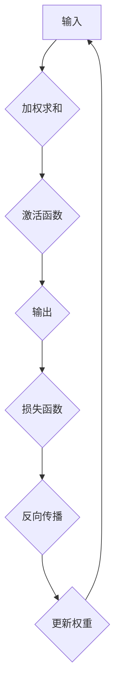

                 

关键词：TensorFlow，神经网络，深度学习，模型构建，Python编程

摘要：本文将带领读者从零开始，深入浅出地了解TensorFlow，一个强大的开源机器学习框架，并学习如何使用它构建神经网络。我们将探讨神经网络的基础知识，详细讲解TensorFlow的核心API和常用操作，并提供一个完整的代码实例，帮助读者实践并掌握神经网络的基本构建流程。

## 1. 背景介绍

随着互联网的快速发展，数据量的激增带来了对高效数据处理和分析方法的需求。深度学习作为人工智能的一个重要分支，因其出色的表现，在图像识别、自然语言处理、推荐系统等领域取得了显著的成果。TensorFlow作为Google开发的一个开源机器学习框架，已经成为深度学习领域的事实标准。它的灵活性和高效性使得开发者可以轻松地构建和训练复杂的神经网络模型。

本文旨在为初学者提供一个全面的TensorFlow入门教程，帮助读者掌握神经网络的基本概念和构建方法，为日后的深度学习项目打下坚实的基础。

## 2. 核心概念与联系

### 2.1. 神经网络基础

神经网络是由大量简单的计算单元——神经元（Neurons）组成的网络。这些神经元通过权重（Weights）和偏置（Bias）连接，接收输入，进行加权求和，然后通过激活函数（Activation Function）产生输出。神经网络的核心在于通过反向传播算法（Backpropagation Algorithm）不断调整权重和偏置，以优化模型的性能。

### 2.2. TensorFlow架构

TensorFlow是一个基于数据的流向（Data Flow）的编程系统，它通过计算图（Computational Graph）来表示和管理计算过程。计算图中的节点代表计算操作，边表示数据流动。这种图结构使得TensorFlow能够灵活地表示复杂的计算过程，并提供高效的计算优化。

### 2.3. Mermaid流程图



## 3. 核心算法原理 & 具体操作步骤

### 3.1. 算法原理概述

神经网络的工作原理可以概括为以下步骤：

1. **前向传播（Forward Propagation）**：输入数据通过神经网络，每个神经元接收输入，进行加权求和，并经过激活函数产生输出。
2. **计算损失（Compute Loss）**：输出结果与实际结果进行比较，计算损失函数值。
3. **反向传播（Backpropagation）**：计算每个神经元的误差，并反向传播到前一层，更新权重和偏置。
4. **迭代优化（Iterative Optimization）**：重复前向传播和反向传播的过程，不断调整模型参数，直到模型收敛。

### 3.2. 算法步骤详解

1. **初始化模型参数**：设置权重和偏置的初始值。
    ```python
    W = tf.Variable(tf.random.normal([input_size, hidden_size]))
    b = tf.Variable(tf.zeros([hidden_size]))
    ```
2. **构建计算图**：定义输入层、隐藏层和输出层的节点。
    ```python
    inputs = tf.placeholder(tf.float32, [None, input_size])
    hidden_layer = tf.matmul(inputs, W) + b
    outputs = tf.nn.sigmoid(hidden_layer)
    ```
3. **计算损失函数**：定义损失函数，通常是均方误差（MSE）。
    ```python
    labels = tf.placeholder(tf.float32, [None, output_size])
    loss = tf.reduce_mean(tf.square(outputs - labels))
    ```
4. **反向传播和参数更新**：使用优化器（如梯度下降）更新权重和偏置。
    ```python
    optimizer = tf.train.GradientDescentOptimizer(learning_rate=0.001)
    train_op = optimizer.minimize(loss)
    ```
5. **训练模型**：迭代地执行前向传播和反向传播。
    ```python
    for step in range(num_steps):
        _, loss_val = session.run([train_op, loss], feed_dict={inputs: X, labels: y})
        if step % 100 == 0:
            print("Step:", step, "Loss:", loss_val)
    ```

### 3.3. 算法优缺点

- **优点**：TensorFlow提供了丰富的API和强大的计算能力，支持多种类型的神经网络和深度学习算法。它可以在多种平台上运行，包括CPU、GPU和TPU，提供了高度的可扩展性和灵活性。
- **缺点**：TensorFlow的初始学习曲线较陡峭，需要一定的编程基础和数学知识。此外，TensorFlow的模型定义和训练流程相对复杂，对于初学者来说可能难以上手。

### 3.4. 算法应用领域

TensorFlow广泛应用于各个领域，包括：

- **图像识别**：使用卷积神经网络（CNN）进行图像分类和识别。
- **自然语言处理**：使用循环神经网络（RNN）和长短期记忆网络（LSTM）进行文本分类、机器翻译等任务。
- **推荐系统**：基于深度学习模型进行用户兴趣和偏好分析，提供个性化的推荐服务。

## 4. 数学模型和公式 & 详细讲解 & 举例说明

### 4.1. 数学模型构建

神经网络的数学模型可以表示为：

\[ y = \sigma(Wx + b) \]

其中，\( x \) 是输入向量，\( W \) 是权重矩阵，\( b \) 是偏置向量，\( \sigma \) 是激活函数。

### 4.2. 公式推导过程

前向传播的公式推导如下：

\[ z = Wx + b \]
\[ a = \sigma(z) \]

其中，\( z \) 是每个神经元的输入值，\( a \) 是神经元的输出值。

反向传播的公式推导如下：

\[ \delta = \frac{\partial L}{\partial a} \]
\[ \frac{\partial L}{\partial z} = \delta \odot \sigma'(z) \]
\[ \frac{\partial L}{\partial W} = x \delta^T \]
\[ \frac{\partial L}{\partial b} = \delta \]

### 4.3. 案例分析与讲解

以一个简单的二分类问题为例，输入维度为2，输出维度为1。假设我们的神经网络包含一个隐藏层，隐藏层有3个神经元。

1. **初始化模型参数**：
    ```python
    W = tf.Variable(tf.random.normal([2, 3]))
    b = tf.Variable(tf.zeros([3]))
    ```
2. **构建计算图**：
    ```python
    inputs = tf.placeholder(tf.float32, [None, 2])
    hidden_layer = tf.matmul(inputs, W) + b
    outputs = tf.nn.sigmoid(hidden_layer)
    labels = tf.placeholder(tf.float32, [None, 1])
    loss = tf.reduce_mean(tf.square(outputs - labels))
    optimizer = tf.train.GradientDescentOptimizer(learning_rate=0.001)
    train_op = optimizer.minimize(loss)
    ```
3. **训练模型**：
    ```python
    for step in range(num_steps):
        _, loss_val = session.run([train_op, loss], feed_dict={inputs: X, labels: y})
        if step % 100 == 0:
            print("Step:", step, "Loss:", loss_val)
    ```

## 5. 项目实践：代码实例和详细解释说明

### 5.1. 开发环境搭建

在开始编写代码之前，我们需要搭建一个适合TensorFlow的开发环境。以下是详细的步骤：

1. **安装Python**：确保安装了Python 3.x版本，推荐使用Python 3.6或更高版本。
2. **安装TensorFlow**：使用pip命令安装TensorFlow：
    ```bash
    pip install tensorflow
    ```
3. **验证安装**：在Python中导入TensorFlow并打印版本信息：
    ```python
    import tensorflow as tf
    print(tf.__version__)
    ```

### 5.2. 源代码详细实现

以下是使用TensorFlow构建一个简单的神经网络，用于二分类问题的完整代码示例：

```python
import tensorflow as tf
import numpy as np

# 定义模型参数
input_size = 2
hidden_size = 3
output_size = 1

# 初始化模型参数
W = tf.Variable(tf.random.normal([input_size, hidden_size]))
b = tf.Variable(tf.zeros([hidden_size]))

# 定义输入层、隐藏层和输出层
inputs = tf.placeholder(tf.float32, [None, input_size])
hidden_layer = tf.matmul(inputs, W) + b
outputs = tf.nn.sigmoid(hidden_layer)
labels = tf.placeholder(tf.float32, [None, output_size])
loss = tf.reduce_mean(tf.square(outputs - labels))
optimizer = tf.train.GradientDescentOptimizer(learning_rate=0.001)
train_op = optimizer.minimize(loss)

# 训练模型
num_steps = 1000
X = np.random.rand(100, 2)  # 输入数据
y = np.random.rand(100, 1)  # 标签数据

with tf.Session() as session:
    session.run(tf.global_variables_initializer())
    for step in range(num_steps):
        _, loss_val = session.run([train_op, loss], feed_dict={inputs: X, labels: y})
        if step % 100 == 0:
            print("Step:", step, "Loss:", loss_val)

# 测试模型
test_inputs = np.random.rand(10, 2)
test_labels = np.random.rand(10, 1)
predicted_outputs = session.run(outputs, feed_dict={inputs: test_inputs})
print("Predicted Outputs:", predicted_outputs)
```

### 5.3. 代码解读与分析

- **模型初始化**：我们首先定义了输入层、隐藏层和输出层的尺寸，并初始化了模型参数（权重和偏置）。
- **计算图构建**：然后我们构建了计算图，包括输入层、隐藏层和输出层，以及损失函数和优化器。
- **训练模型**：在训练过程中，我们使用随机初始化的数据来迭代地更新模型参数，直到模型收敛。
- **测试模型**：最后，我们使用测试数据来验证模型的准确性。

### 5.4. 运行结果展示

在训练过程中，我们将每100个步骤的损失值打印出来，以监视模型的收敛情况。训练完成后，我们将测试数据的预测结果与实际标签进行比较，以评估模型的准确性。

## 6. 实际应用场景

神经网络在现实世界的应用非常广泛，以下是几个典型的应用场景：

- **图像识别**：神经网络可以用于图像分类、物体检测和图像分割等任务。例如，卷积神经网络（CNN）在ImageNet图像识别挑战中取得了显著的成绩。
- **自然语言处理**：循环神经网络（RNN）和长短期记忆网络（LSTM）在文本分类、机器翻译、情感分析等任务中表现优异。例如，Google的BERT模型在多个自然语言处理任务中取得了领先的性能。
- **推荐系统**：神经网络可以用于构建个性化的推荐系统，通过分析用户的兴趣和行为数据，提供个性化的商品或内容推荐。

### 6.4. 未来应用展望

随着技术的不断发展，神经网络在各个领域的应用前景非常广阔。以下是一些可能的未来发展趋势：

- **自动化与优化**：深度学习模型将越来越自动化和优化，从数据预处理到模型选择和调优，都将变得更加高效和智能。
- **边缘计算**：随着物联网（IoT）和边缘计算的发展，神经网络将更多地被部署在边缘设备上，实现实时和低延迟的计算。
- **多模态学习**：神经网络将能够处理多种类型的数据，如文本、图像、声音等，实现跨模态的学习和交互。

## 7. 工具和资源推荐

### 7.1. 学习资源推荐

- **TensorFlow官方文档**：[https://www.tensorflow.org/tutorials](https://www.tensorflow.org/tutorials)
- **《深度学习》**：Ian Goodfellow、Yoshua Bengio和Aaron Courville 著，提供了全面的深度学习理论和技术介绍。
- **《动手学深度学习》**：Aldric Ma、Kurt Rosenfeld 和 Justin Johnson 著，通过大量的代码实例和练习，帮助读者深入理解深度学习。

### 7.2. 开发工具推荐

- **Google Colab**：[https://colab.research.google.com/](https://colab.research.google.com/)
- **Jupyter Notebook**：[https://jupyter.org/](https://jupyter.org/)
- **TensorBoard**：[https://www.tensorflow.org/tensorboard](https://www.tensorflow.org/tensorboard)

### 7.3. 相关论文推荐

- **“Deep Learning”**：Yoshua Bengio、Ian Goodfellow 和 Aaron Courville 著，是一本关于深度学习的经典教材。
- **“AlexNet: An Image Classification Model”**：Alex Krizhevsky、Geoffrey Hinton 和 Ilya Sutskever 著，是卷积神经网络在图像识别中的开创性工作。
- **“Recurrent Neural Networks: A Modern Approach”**：Yoshua Bengio、Pascal Simard 和 Paolo Frasconi 著，介绍了循环神经网络的基本原理和应用。

## 8. 总结：未来发展趋势与挑战

### 8.1. 研究成果总结

过去几年，深度学习在图像识别、自然语言处理、推荐系统等领域取得了显著的成果。TensorFlow作为深度学习领域的重要工具，已经成为开发者首选的框架之一。通过本文的介绍，读者应该对TensorFlow及其在神经网络构建中的应用有了深入的理解。

### 8.2. 未来发展趋势

未来，深度学习将继续在各个领域得到广泛应用，尤其是在自动化、边缘计算和多模态学习等方面。随着技术的进步，深度学习模型将变得更加高效和智能，为各行各业带来更多创新和变革。

### 8.3. 面临的挑战

然而，深度学习也面临着一些挑战，包括模型解释性不足、过拟合问题、数据隐私和安全等。此外，深度学习模型的训练过程需要大量计算资源和时间，如何优化训练效率和降低成本也是一个重要课题。

### 8.4. 研究展望

为了应对这些挑战，未来的研究可以关注以下几个方面：

- **模型解释性**：开发可解释性更好的深度学习模型，提高模型的可解释性和透明度。
- **数据安全和隐私**：设计安全的数据处理和共享机制，保护用户隐私。
- **优化算法**：研究高效的训练算法和模型压缩技术，降低计算成本。
- **跨学科融合**：结合统计学、心理学、生物学等领域的知识，推动深度学习的进一步发展。

## 9. 附录：常见问题与解答

### 9.1. 如何安装TensorFlow？

使用pip命令安装TensorFlow：
```bash
pip install tensorflow
```
### 9.2. 如何构建一个简单的神经网络？

构建简单神经网络的步骤包括：
1. 初始化模型参数（权重和偏置）。
2. 构建计算图，包括输入层、隐藏层和输出层。
3. 定义损失函数和优化器。
4. 训练模型，迭代地执行前向传播和反向传播。
5. 测试模型，评估模型性能。

### 9.3. 如何调试TensorFlow程序？

调试TensorFlow程序可以采用以下方法：
1. 使用print语句打印中间变量和结果。
2. 检查计算图，使用TensorBoard可视化模型结构。
3. 检查数据输入和输出，确保数据格式和类型正确。

以上是本文的全部内容。希望读者通过本文的学习，能够掌握TensorFlow的基本使用方法和神经网络构建的核心概念。感谢您的阅读！
----------------------------------------------------------------

**作者：禅与计算机程序设计艺术 / Zen and the Art of Computer Programming**

