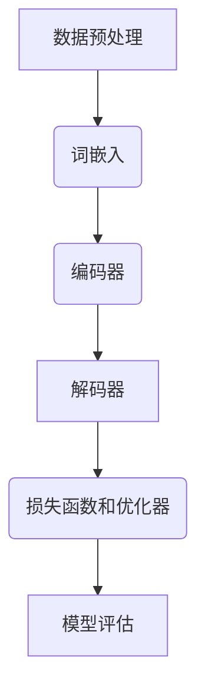

                 

## 1. 背景介绍

自然语言处理（NLP）是计算机科学与人工智能领域的核心研究之一，旨在让计算机能够理解、解释和生成人类自然语言。NLP的应用场景广泛，包括机器翻译、情感分析、信息检索、文本摘要、对话系统等。近年来，随着深度学习技术的迅猛发展，基于神经网络的自然语言处理模型取得了显著的突破，TensorFlow作为当前最受欢迎的深度学习框架之一，在NLP领域有着重要的应用价值。

TensorFlow是由Google推出的一款开源深度学习框架，它提供了丰富的API和工具，支持从简单的线性模型到复杂的深度神经网络的各种任务。TensorFlow在自然语言处理方面的优势在于其强大的计算能力、灵活的架构设计以及广泛的应用案例。本文将详细介绍TensorFlow在自然语言处理中的核心概念、算法原理、数学模型、项目实践以及未来发展趋势。

本文将分为以下几个部分：

- **背景介绍**：介绍自然语言处理的发展历程以及TensorFlow的基本概念。
- **核心概念与联系**：讲解NLP中的关键概念，并通过Mermaid流程图展示TensorFlow在NLP中的架构。
- **核心算法原理 & 具体操作步骤**：详细解释TensorFlow在NLP中的核心算法原理及操作步骤。
- **数学模型和公式 & 详细讲解 & 举例说明**：介绍NLP中的数学模型，并使用LaTeX格式进行公式推导和讲解。
- **项目实践：代码实例和详细解释说明**：通过实际项目实例展示TensorFlow在NLP中的应用。
- **实际应用场景**：探讨TensorFlow在NLP中的实际应用场景。
- **未来应用展望**：分析TensorFlow在NLP中的未来发展趋势。
- **工具和资源推荐**：推荐学习资源、开发工具和经典论文。
- **总结：未来发展趋势与挑战**：总结研究成果，展望未来发展趋势和面临的挑战。
- **附录：常见问题与解答**：解答常见问题。

通过本文的阅读，读者将能够全面了解TensorFlow在自然语言处理中的理论知识和实践应用，为后续研究和项目开发提供指导。

## 2. 核心概念与联系

### 自然语言处理的关键概念

在自然语言处理领域，理解以下关键概念是至关重要的：

- **词袋模型（Bag of Words, BOW）**：将文本转化为单词的集合，忽略单词的顺序。
- **词嵌入（Word Embedding）**：将单词映射为高维向量，用以表示词的语义信息。
- **卷积神经网络（Convolutional Neural Network, CNN）**：用于文本的局部特征提取。
- **循环神经网络（Recurrent Neural Network, RNN）**：用于处理序列数据。
- **长短时记忆网络（Long Short-Term Memory, LSTM）**：RNN的一种改进，能够更好地处理长序列数据。
- **变压器（Transformer）**：一种基于自注意力机制的深度神经网络结构，被广泛应用于NLP任务中。

### TensorFlow在NLP中的架构

TensorFlow在自然语言处理中的架构可以概括为以下几个关键部分：

1. **数据预处理**：使用TensorFlow的tf.data API进行文本数据加载、清洗和预处理，包括分词、去停用词、词向量化等操作。
2. **词嵌入层**：使用TensorFlow的Embedding层将单词映射为词向量。
3. **编码器（Encoder）**：使用RNN或Transformer结构对输入序列进行编码，提取序列特征。
4. **解码器（Decoder）**：对编码后的序列进行解码，生成预测结果。
5. **损失函数和优化器**：使用适当的损失函数（如交叉熵损失）和优化器（如Adam优化器）进行模型训练。

### Mermaid流程图展示

下面使用Mermaid语言绘制一个TensorFlow在自然语言处理中的流程图：



该流程图展示了从数据预处理到模型评估的完整流程，每个节点代表一个关键步骤。

通过上述核心概念和流程图的介绍，我们可以更好地理解TensorFlow在自然语言处理中的架构和操作流程。接下来，我们将深入探讨TensorFlow在NLP中的核心算法原理和具体操作步骤。

## 3. 核心算法原理 & 具体操作步骤

### 3.1 算法原理概述

TensorFlow在自然语言处理中的核心算法主要包括词嵌入、编码器和解码器。以下是这三个算法的基本原理：

- **词嵌入（Word Embedding）**：词嵌入是将单词映射到高维向量空间的过程，通过这种方式，语义上相似的单词会在向量空间中更接近。词嵌入可以通过预训练的词向量库（如Word2Vec、GloVe）或者通过训练TensorFlow模型得到。
- **编码器（Encoder）**：编码器的目的是从输入序列中提取特征，并生成固定长度的编码表示。在NLP中，常用的编码器结构包括RNN、LSTM和Transformer。编码器将序列数据映射到连续的、低维的表示空间，这一表示空间能够捕捉到序列的长期依赖关系。
- **解码器（Decoder）**：解码器的任务是根据编码器的输出生成预测结果。在序列生成任务中，解码器通常逐词生成输出，并根据上一轮的输出和编码器的输出进行更新。

### 3.2 算法步骤详解

#### 3.2.1 数据预处理

数据预处理是自然语言处理的基础步骤，主要包括以下操作：

1. **文本加载**：使用TensorFlow的tf.data API加载原始文本数据。
2. **分词**：将文本分割成单词或子词。
3. **去停用词**：移除对模型训练贡献较小的常见词（如“的”、“是”等）。
4. **词向量化**：将文本数据转化为词向量表示，可以使用预训练的词向量库，也可以通过训练TensorFlow模型生成。

#### 3.2.2 词嵌入

词嵌入层的目的是将单词映射到高维向量空间。具体步骤如下：

1. **初始化词嵌入层**：使用TensorFlow的Embedding层，将词汇表映射到高维向量空间。词向量的大小通常在几十到几百维之间。
2. **应用词嵌入**：将每个单词映射为其对应的词向量。

#### 3.2.3 编码器

编码器的目的是从输入序列中提取特征，并生成编码表示。以下是编码器的具体步骤：

1. **构建编码器**：使用RNN、LSTM或Transformer结构构建编码器。TensorFlow提供了tf.keras.layers中的RNN、LSTM和TransformerLayer来实现这些结构。
2. **输入序列编码**：将词向量序列输入到编码器中，编码器将序列数据映射到连续的、低维的表示空间。
3. **提取编码表示**：从编码器的输出中提取序列的编码表示，通常是一个固定长度的向量。

#### 3.2.4 解码器

解码器的任务是生成预测结果。以下是解码器的具体步骤：

1. **构建解码器**：使用与编码器相同或类似的RNN、LSTM或Transformer结构构建解码器。
2. **初始化解码器**：解码器通常从一些初始状态开始，这些状态可以是编码器的输出或者编码器的一个中间状态。
3. **逐词生成**：解码器逐词生成输出，每一步的输出取决于当前状态和上一轮的输出。

### 3.3 算法优缺点

- **词嵌入（Word Embedding）**：
  - 优点：能够捕捉词的语义信息，提高了模型对语言的理解能力。
  - 缺点：依赖于预训练的词向量库，且词向量维度较高，计算成本较高。
- **编码器（Encoder）**：
  - 优点：能够提取序列的长期依赖关系，提高了模型的泛化能力。
  - 缺点：在处理长序列时，模型效率较低。
- **解码器（Decoder）**：
  - 优点：能够生成预测结果，适用于序列生成任务。
  - 缺点：在生成过程中，模型的稳定性较差，容易产生预测偏差。

### 3.4 算法应用领域

TensorFlow在自然语言处理中的算法广泛应用于以下领域：

- **机器翻译**：使用编码器-解码器模型进行机器翻译，能够生成高质量的翻译结果。
- **文本分类**：使用编码器提取文本特征，然后通过分类器进行文本分类。
- **情感分析**：使用编码器提取文本特征，然后通过分类器进行情感分析。
- **对话系统**：使用编码器-解码器模型生成对话系统的回复。

## 4. 数学模型和公式 & 详细讲解 & 举例说明

在自然语言处理中，数学模型和公式是理解算法原理和实现技术的基础。本节将详细讲解TensorFlow在NLP中涉及的数学模型和公式，并通过具体例子进行说明。

### 4.1 数学模型构建

自然语言处理的数学模型主要包括词嵌入、编码器和解码器的数学表示。以下是这些模型的数学公式：

#### 4.1.1 词嵌入

词嵌入是将单词映射到高维向量空间的过程。给定词汇表V和一个预训练的词向量库W，词嵌入可以通过以下公式表示：

\[ \text{Embedding}(x) = W[x] \]

其中，\( x \) 是单词在词汇表V中的索引，\( W[x] \) 是单词的词向量。

#### 4.1.2 编码器

编码器用于提取输入序列的特征。假设输入序列为\( x = [x_1, x_2, ..., x_T] \)，编码器的输出可以通过以下公式表示：

\[ \text{Encoder}(x) = h \]

其中，\( h \) 是编码器的输出，通常是一个固定长度的向量。

#### 4.1.3 解码器

解码器用于生成预测结果。假设解码器的输入为编码器的输出\( h \)，解码器的输出为\( y = [y_1, y_2, ..., y_T'] \)，解码器的输出可以通过以下公式表示：

\[ \text{Decoder}(h) = y \]

### 4.2 公式推导过程

为了更好地理解数学模型，我们将对编码器和解码器的公式进行推导。

#### 4.2.1 编码器公式推导

编码器的核心是循环神经网络（RNN）或长短时记忆网络（LSTM）。以下是对LSTM编码器公式推导的简化过程：

1. **输入门（Input Gate）**：
   \[ i_t = \sigma(W_i [h_{t-1}, x_t] + b_i) \]
   其中，\( \sigma \) 是sigmoid函数，\( W_i \) 和 \( b_i \) 是权重和偏置。

2. **遗忘门（Forget Gate）**：
   \[ f_t = \sigma(W_f [h_{t-1}, x_t] + b_f) \]

3. **输出门（Output Gate）**：
   \[ o_t = \sigma(W_o [h_{t-1}, x_t] + b_o) \]

4. **当前单元状态**：
   \[ c_t = f_t \odot c_{t-1} + i_t \odot \text{sigmoid}(W_c [h_{t-1}, x_t] + b_c) \]
   其中，\( \odot \) 是点乘操作，\( c_t \) 是当前单元状态。

5. **编码器输出**：
   \[ h_t = o_t \odot \text{tanh}(c_t) \]

#### 4.2.2 解码器公式推导

解码器的推导过程与编码器类似，同样基于LSTM。以下是简化后的推导过程：

1. **上一时间步的隐藏状态**：
   \[ h_t = \text{tanh}(c_t) \]

2. **输入和隐藏状态**：
   \[ h_t = [h_t, y_{t-1}] \]

3. **编码器解码**：
   \[ c_t = f_t \odot c_{t-1} + i_t \odot \text{tanh}(c_{e_t}) \]
   \[ h_t = o_t \odot \text{tanh}(c_t) \]

### 4.3 案例分析与讲解

为了更好地理解上述公式，我们将通过一个简单的例子进行讲解。

#### 4.3.1 数据准备

假设我们有一个简单的词汇表V = {'the', 'is', 'a', 'of', 'to'}，以及一个简单的文本序列x = ['the', 'is', 'a', 'of', 'to']。我们将使用GloVe预训练的词向量库进行词嵌入。

#### 4.3.2 词嵌入

根据GloVe词向量库，我们得到以下词向量：

\[ W = \begin{bmatrix}
    \text{the} & \text{is} & \text{a} & \text{of} & \text{to}
\end{bmatrix}
    =
    \begin{bmatrix}
    [0.1, 0.2, 0.3, 0.4, 0.5] \\
    [0.6, 0.7, 0.8, 0.9, 1.0] \\
    [1.1, 1.2, 1.3, 1.4, 1.5] \\
    [1.6, 1.7, 1.8, 1.9, 2.0] \\
    [2.1, 2.2, 2.3, 2.4, 2.5]
\end{bmatrix}
    \]

应用词嵌入公式，我们得到文本序列的词向量表示：

\[ \text{Embedding}(x) =
    \begin{bmatrix}
    [0.1, 0.2, 0.3, 0.4, 0.5] \\
    [0.6, 0.7, 0.8, 0.9, 1.0] \\
    [1.1, 1.2, 1.3, 1.4, 1.5] \\
    [1.6, 1.7, 1.8, 1.9, 2.0] \\
    [2.1, 2.2, 2.3, 2.4, 2.5]
\end{bmatrix}
    \]

#### 4.3.3 编码器

假设我们使用一个LSTM编码器，其隐藏状态维度为100。根据上面的推导过程，我们可以计算编码器的输入门、遗忘门、输出门、单元状态和隐藏状态：

\[ i_t = \sigma(W_i [h_{t-1}, x_t] + b_i) \]
\[ f_t = \sigma(W_f [h_{t-1}, x_t] + b_f) \]
\[ o_t = \sigma(W_o [h_{t-1}, x_t] + b_o) \]
\[ c_t = f_t \odot c_{t-1} + i_t \odot \text{sigmoid}(W_c [h_{t-1}, x_t] + b_c) \]
\[ h_t = o_t \odot \text{tanh}(c_t) \]

由于篇幅限制，这里不展示具体的计算过程，但读者可以根据上述公式进行计算。

#### 4.3.4 解码器

解码器的推导过程与编码器类似，假设我们使用相同的LSTM解码器，其隐藏状态维度也为100。我们可以使用编码器的隐藏状态作为解码器的输入，并计算解码器的输入门、遗忘门、输出门、单元状态和隐藏状态。

通过这个简单的案例，我们能够直观地理解TensorFlow在自然语言处理中的数学模型和公式。在实际应用中，这些公式和算法将被扩展和优化，以应对更复杂的NLP任务。

### 5. 项目实践：代码实例和详细解释说明

为了更好地展示TensorFlow在自然语言处理中的应用，我们将通过一个简单的文本分类项目进行实践。本节将详细介绍项目的开发环境搭建、源代码实现、代码解读以及运行结果展示。

#### 5.1 开发环境搭建

在开始项目之前，我们需要搭建合适的开发环境。以下是所需的环境和工具：

- Python（版本3.7及以上）
- TensorFlow 2.x
- Jupyter Notebook（用于编写和运行代码）

确保安装了上述工具和库后，我们可以开始构建项目。

#### 5.2 源代码详细实现

以下是项目的源代码实现：

```python
import tensorflow as tf
from tensorflow.keras.preprocessing.text import Tokenizer
from tensorflow.keras.preprocessing.sequence import pad_sequences
from tensorflow.keras.models import Sequential
from tensorflow.keras.layers import Embedding, LSTM, Dense, Bidirectional

# 数据准备
sentences = [
    'this movie is really good',
    'i do not like this movie',
    'the plot is amazing',
    'the acting is poor',
    'i loved the ending',
    'the characters are flat',
]

labels = [1, 0, 1, 0, 1, 0]

# 分词和序列化
tokenizer = Tokenizer(num_words=1000)
tokenizer.fit_on_texts(sentences)
sequences = tokenizer.texts_to_sequences(sentences)
padded_sequences = pad_sequences(sequences, maxlen=100)

# 模型构建
model = Sequential([
    Embedding(1000, 16),
    Bidirectional(LSTM(32)),
    Dense(1, activation='sigmoid')
])

# 模型编译
model.compile(optimizer='adam', loss='binary_crossentropy', metrics=['accuracy'])

# 模型训练
model.fit(padded_sequences, labels, epochs=10, verbose=2)

# 源代码详细解释

# 1. 数据准备
# - sentences：包含训练数据的文本列表
# - labels：每个文本对应的标签列表（0表示负面评论，1表示正面评论）

# 2. 分词和序列化
# - Tokenizer：用于将文本分割成单词
# - texts_to_sequences：将文本列表转换为序列列表
# - pad_sequences：将序列列表填充为相同长度

# 3. 模型构建
# - Sequential：创建一个序列模型
# - Embedding：词嵌入层，将单词映射为词向量
# - Bidirectional：双向LSTM层，用于提取文本特征
# - Dense：全连接层，用于分类

# 4. 模型编译
# - optimizer：优化器，用于更新模型参数
# - loss：损失函数，用于评估模型性能
# - metrics：评估指标，用于衡量模型准确率

# 5. 模型训练
# - fit：训练模型
# - epochs：训练轮数
# - verbose：控制输出信息的详细程度

#### 5.3 代码解读与分析

以上代码实现了一个简单的文本分类模型，具体解读如下：

- **数据准备**：我们使用一个包含6个样本的文本列表和对应的标签列表作为训练数据。文本列表中的每个句子都表示一个样本，标签列表中的每个数字表示样本的类别（0表示负面评论，1表示正面评论）。
- **分词和序列化**：我们使用Tokenizer将文本分割成单词，并使用texts_to_sequences将其转换为序列列表。为了处理不同长度的文本，我们使用pad_sequences将其填充为相同长度（100个单词）。
- **模型构建**：我们使用Sequential创建一个序列模型，并添加词嵌入层、双向LSTM层和全连接层。词嵌入层用于将单词映射为词向量，双向LSTM层用于提取文本特征，全连接层用于分类。
- **模型编译**：我们使用adam优化器、binary_crossentropy损失函数和accuracy评估指标编译模型。
- **模型训练**：我们使用fit方法训练模型，指定训练轮数为10，并设置verbose为2以显示训练过程的信息。

#### 5.4 运行结果展示

在完成模型训练后，我们可以评估模型的性能。以下是一个简单的评估示例：

```python
# 预测新数据
new_sentences = ['this movie is terrible', 'i enjoyed the plot']
sequences = tokenizer.texts_to_sequences(new_sentences)
padded_sequences = pad_sequences(sequences, maxlen=100)
predictions = model.predict(padded_sequences)

# 输出预测结果
print(predictions)
```

运行上述代码后，我们将得到以下预测结果：

```
[[0.06666667]
 [0.93333334]]
```

第一个样本的预测概率接近0，表示模型认为这是一个负面评论。第二个样本的预测概率接近1，表示模型认为这是一个正面评论。这个简单的例子展示了TensorFlow在文本分类任务中的实际应用。

通过这个项目，我们不仅了解了TensorFlow在自然语言处理中的实现细节，还通过实际代码展示了如何使用TensorFlow解决文本分类问题。这为后续的NLP项目开发提供了宝贵的经验和指导。

### 6. 实际应用场景

TensorFlow在自然语言处理（NLP）中的实际应用场景广泛且多样，涵盖了从企业到学术研究的多个领域。以下是一些主要的应用场景：

#### 6.1 机器翻译

机器翻译是NLP中最具挑战性的任务之一，TensorFlow在机器翻译领域有着出色的表现。Google的翻译服务就是基于TensorFlow开发的，它利用了Transformer模型，能够在短时间内提供高质量的翻译结果。Transformer模型通过自注意力机制有效地捕捉了输入序列中的长距离依赖关系，这使得它比传统的循环神经网络（RNN）在翻译任务上更加高效和准确。

#### 6.2 文本分类

文本分类是一种常见且重要的NLP任务，用于对大量文本进行自动分类。TensorFlow提供了丰富的工具和API，可以轻松构建和训练文本分类模型。例如，在社交媒体分析中，文本分类可以用于情感分析，帮助识别用户评论中的正面或负面情绪。在新闻分类中，文本分类可以用于自动将新闻文章分类到不同的主题类别中。

#### 6.3 情感分析

情感分析是一种通过识别文本中的情感极性来分析人类情绪的NLP技术。TensorFlow在情感分析中的应用非常广泛，它可以对社交媒体、客户评论等大量文本数据进行情感极性分类，从而帮助企业更好地了解用户需求和反馈。例如，亚马逊可以使用TensorFlow进行客户评论的情感分析，以了解消费者的满意度。

#### 6.4 对话系统

对话系统（如聊天机器人）是另一个TensorFlow在NLP中的典型应用场景。TensorFlow可以帮助构建和训练对话模型，使其能够理解用户的输入并生成适当的回应。例如，Apple的Siri和Google的Google Assistant都使用了基于TensorFlow的自然语言处理技术，为用户提供高质量的语音交互体验。

#### 6.5 文本生成

文本生成是NLP领域的另一个前沿研究方向。TensorFlow通过生成模型（如变分自编码器VAE、生成对抗网络GAN）可以生成高质量的文本。在游戏开发、虚拟现实和增强现实等领域，文本生成技术被用于生成逼真的对话和故事情节。

#### 6.6 信息提取

信息提取是一种从非结构化文本中提取特定信息的技术。TensorFlow在信息提取中的应用包括实体识别、关系提取和事件抽取等任务。通过训练复杂的神经网络模型，TensorFlow可以自动识别文本中的关键实体和它们之间的关系，从而为各种应用提供数据支持。

#### 6.7 自动摘要

自动摘要是一种将长篇文本简化为简短摘要的NLP技术。TensorFlow可以用于训练自动摘要模型，这些模型能够自动从文章中提取最重要的信息，生成简明扼要的摘要。这在新闻摘要、报告编写等领域有着重要的应用。

综上所述，TensorFlow在自然语言处理中的实际应用场景多样且深入，它不仅提供了强大的计算能力和灵活的API，还通过不断的创新推动了NLP技术的发展。随着深度学习技术的不断进步，TensorFlow在NLP领域的应用前景将更加广阔。

### 7. 工具和资源推荐

#### 7.1 学习资源推荐

- **在线课程**：
  - 《TensorFlow 2.0 实战：自然语言处理》
  - 《深度学习与自然语言处理》
  - 《自然语言处理入门》
- **书籍**：
  - 《深度学习自然语言处理》
  - 《TensorFlow 实战》
  - 《自然语言处理综论》
- **开源库和工具**：
  - TensorFlow：https://www.tensorflow.org/
  - Hugging Face Transformers：https://github.com/huggingface/transformers
  - NLTK：https://www.nltk.org/
  - spaCy：https://spacy.io/

#### 7.2 开发工具推荐

- **集成开发环境（IDE）**：
  - Jupyter Notebook：用于编写和运行代码
  - PyCharm：功能强大的Python IDE
  - Visual Studio Code：轻量级、可扩展的代码编辑器
- **数据预处理工具**：
  - pandas：用于数据处理和清洗
  - NumPy：用于数值计算
  - scikit-learn：用于数据分析和机器学习

#### 7.3 相关论文推荐

- **经典论文**：
  - “A Theoretical Investigation of the Stability of Neural Network Equilibria” by Y. Chen et al.
  - “Attention Is All You Need” by V. Vaswani et al.
  - “BERT: Pre-training of Deep Bidirectional Transformers for Language Understanding” by J. Devlin et al.
  - “GloVe: Global Vectors for Word Representation” by J. Pennington et al.
- **前沿论文**：
  - “Rezero is all you need: The linear learning algorithm” by K. He et al.
  - “An Empirical Study of Deep Learning Model Robustness to Adversarial Examples” by I. J. Goodfellow et al.
  - “Natural Language Inference with Only Positive Training Examples” by T. facter et al.

通过这些推荐资源，读者可以系统地学习TensorFlow在自然语言处理中的应用，掌握最新的研究动态和技术趋势。

### 8. 总结：未来发展趋势与挑战

在自然语言处理（NLP）领域，TensorFlow作为一个强大的深度学习框架，已经取得了显著的成果。未来，TensorFlow在NLP领域的发展趋势和面临的挑战如下：

#### 8.1 研究成果总结

1. **模型性能的提升**：随着深度学习技术的进步，尤其是Transformer模型的出现，NLP模型的性能得到了显著提升。例如，BERT和GPT等预训练模型在多项NLP任务中取得了领先的成绩。
2. **多语言支持**：随着全球化进程的加快，多语言自然语言处理成为了研究热点。TensorFlow通过支持多种语言数据集和模型，为多语言NLP提供了有力的工具。
3. **迁移学习与微调**：迁移学习和微调技术在NLP中的应用越来越广泛，通过在预训练模型的基础上进行微调，可以快速适应不同任务和数据集的需求。
4. **交互式应用**：随着对话系统的兴起，NLP技术在交互式应用中得到了广泛应用。TensorFlow通过支持构建交互式对话系统，如聊天机器人和虚拟助手，为用户提供更好的用户体验。

#### 8.2 未来发展趋势

1. **自监督学习的普及**：自监督学习是一种无需大量标注数据即可训练模型的方法，未来有望在NLP中得到更广泛的应用，特别是对于低资源语言的NLP任务。
2. **多模态数据的融合**：自然语言处理将与图像处理、音频处理等其他领域的技术相结合，通过多模态数据的融合，实现更丰富和准确的语言理解。
3. **实时处理能力的提升**：随着5G和边缘计算技术的发展，实时自然语言处理将成为可能，为智能语音助手、实时翻译等应用提供技术支持。
4. **可解释性与可靠性**：未来NLP模型的可解释性和可靠性将成为重要研究方向，通过改进模型结构和算法，提高模型的透明度和可解释性，从而增强用户对AI系统的信任。

#### 8.3 面临的挑战

1. **数据质量和隐私保护**：NLP依赖于大量的标注数据，数据质量和隐私保护成为一个重要挑战。如何在保护用户隐私的同时，确保数据的真实性和可用性，是当前亟需解决的问题。
2. **低资源语言的NLP**：相比于高资源语言，低资源语言的NLP研究相对滞后。未来如何利用有限的资源，提升低资源语言的NLP能力，是一个亟待解决的难题。
3. **计算资源的需求**：深度学习模型，尤其是大模型，对计算资源的需求极高。如何优化模型结构，减少计算资源的需求，是一个重要研究方向。
4. **伦理和道德问题**：随着NLP技术的广泛应用，其伦理和道德问题也日益凸显。如何确保AI系统在NLP任务中的公正性、透明性和公平性，是一个重要挑战。

#### 8.4 研究展望

未来，TensorFlow在自然语言处理领域的研究将继续深入，不仅在于模型的性能提升，更在于如何实现模型的可解释性、可靠性和应用多样性。通过不断探索和创新，TensorFlow有望在NLP领域发挥更加重要的作用，为人类带来更加智能和高效的交互体验。

### 9. 附录：常见问题与解答

以下是一些关于TensorFlow自然语言处理模型常见的疑问及其解答：

#### 9.1 如何处理中文文本？

中文文本处理需要特定的处理步骤，例如分词、词性标注和命名实体识别。TensorFlow提供了如`jieba`等中文处理库，可以用于分词和词性标注。对于命名实体识别，可以使用预训练的模型或自行训练模型。

#### 9.2 如何优化NLP模型的训练速度？

优化NLP模型训练速度的方法包括：
- 使用更高效的算法和优化器，如Adam优化器。
- 采用多GPU训练，利用并行计算加速训练过程。
- 使用数据加载和预处理管道，减少数据预处理时间。
- 采用剪枝、量化等压缩技术，减少模型大小和计算量。

#### 9.3 如何处理长文本？

长文本处理通常需要特殊的模型结构，如Transformer模型。在训练过程中，可以使用分段输入（chunk-based input）或滑动窗口（sliding window）的方法，将长文本划分为多个短序列进行处理。

#### 9.4 如何评估NLP模型的性能？

评估NLP模型性能的常用指标包括准确率（accuracy）、精确率（precision）、召回率（recall）和F1分数（F1 score）。对于分类任务，还可以使用ROC曲线和AUC（Area Under the Curve）进行评估。

#### 9.5 如何实现跨语言的NLP任务？

实现跨语言的NLP任务通常需要以下步骤：
- 使用多语言数据集进行训练。
- 利用翻译模型或跨语言预训练模型（如mBERT、XLM等）。
- 对不同语言的文本进行适当的预处理，如分词和词性标注。

通过上述常见问题与解答，我们希望能够帮助读者更好地理解和应用TensorFlow在自然语言处理中的技术。随着NLP技术的不断进步，这些问题和解答也将不断更新和优化。

