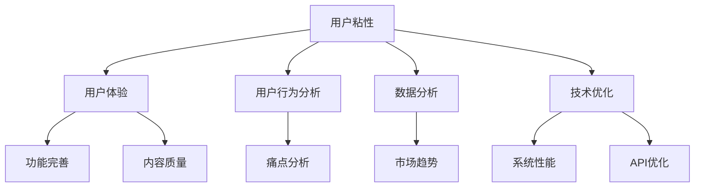

                 

关键词：用户粘性、C市场、策略、用户体验、数据分析、技术优化

摘要：本文将深入探讨在C市场（面向消费者的市场）中，如何通过策略和技术手段提升用户粘性。通过分析用户行为、设计用户体验、实施数据分析和技术优化，本文提出了一系列实用的方法，以帮助企业和开发者留住用户、增加用户活跃度，并最终实现商业成功。

## 1. 背景介绍

在当今数字化时代，C市场（Consumer Market，面向消费者的市场）的竞争愈发激烈。企业和开发者都在寻求有效的策略，以吸引并留住用户。用户粘性成为衡量C市场成功与否的关键指标。高粘性用户不仅会持续使用产品，还会通过口碑传播吸引新用户。因此，提升用户粘性成为企业和开发者的重要任务。

用户粘性是指用户持续使用产品或服务的倾向。它受到多种因素的影响，包括用户体验、功能完善、内容质量、社交互动等。在C市场中，用户粘性的提升需要从多个方面进行综合优化。

## 2. 核心概念与联系

### 2.1. 用户粘性的定义

用户粘性（User Stickiness）是指用户对产品或服务的依赖程度和持续使用意愿。高粘性用户更倾向于长期使用某个产品，而不容易转向其他竞品。

### 2.2. 用户行为的分析

用户行为分析（User Behavior Analysis）是通过收集和分析用户在产品中的操作记录，了解用户的使用习惯、偏好和痛点。这有助于发现提升用户粘性的机会点。

### 2.3. 用户体验（UX）设计

用户体验设计（User Experience Design）旨在优化产品或服务的使用过程，提高用户满意度。良好的用户体验能够增加用户粘性。

### 2.4. 数据分析

数据分析（Data Analysis）是通过收集用户数据，分析用户行为模式和市场趋势，为产品优化和决策提供依据。

### 2.5. 技术优化

技术优化（Technical Optimization）包括代码优化、系统性能提升、API优化等，以提高产品的稳定性和响应速度。

### 2.6. Mermaid 流程图



## 3. 核心算法原理 & 具体操作步骤

### 3.1 算法原理概述

提升用户粘性的核心算法基于以下几个原理：

- **用户体验优化**：通过改进UI/UX设计，提高用户满意度。
- **个性化推荐**：基于用户行为数据，提供个性化内容推荐，增加用户粘性。
- **社交互动**：鼓励用户在平台上进行社交互动，提高用户粘性。
- **数据分析**：通过分析用户行为数据，发现用户痛点，不断优化产品。

### 3.2 算法步骤详解

#### 3.2.1 用户行为分析

1. 收集用户操作数据，如浏览记录、购买历史、搜索关键词等。
2. 使用数据挖掘技术，分析用户行为模式。
3. 发现用户痛点，如界面繁琐、功能不足等。

#### 3.2.2 用户体验优化

1. 根据用户行为分析结果，改进UI/UX设计。
2. 提供简洁、直观的操作界面。
3. 确保功能完整，满足用户需求。

#### 3.2.3 个性化推荐

1. 使用机器学习算法，根据用户行为数据构建用户画像。
2. 使用协同过滤或基于内容的推荐算法，为用户推荐个性化内容。
3. 定期更新推荐算法，提高推荐准确性。

#### 3.2.4 社交互动

1. 提供社交功能，如好友系统、评论功能等。
2. 鼓励用户分享内容、参与互动。
3. 定期举办线上活动，提高用户参与度。

#### 3.2.5 数据分析

1. 建立数据分析平台，实时收集和分析用户数据。
2. 通过A/B测试，验证优化效果。
3. 定期生成报告，为产品优化提供数据支持。

### 3.3 算法优缺点

#### 优点：

- **个性化推荐**：提高用户满意度和留存率。
- **社交互动**：增强用户间的连接和互动。
- **数据分析**：为产品优化提供客观依据。

#### 缺点：

- **数据隐私**：用户数据收集和使用可能引发隐私问题。
- **技术成本**：构建和维护推荐系统和数据分析平台需要较高技术成本。

### 3.4 算法应用领域

- **电子商务平台**：通过个性化推荐，提高商品转化率。
- **社交媒体**：通过社交互动，增加用户粘性和活跃度。
- **内容平台**：通过数据分析，优化内容推荐，提高用户留存。

## 4. 数学模型和公式 & 详细讲解 & 举例说明

### 4.1 数学模型构建

用户粘性的数学模型可以表示为：

\[ \text{User Stickiness} = f(\text{UX}, \text{Content Quality}, \text{Social Interaction}, \text{Data Analytics}) \]

其中，UX、Content Quality、Social Interaction、Data Analytics 分别代表用户体验、内容质量、社交互动、数据分析。

### 4.2 公式推导过程

假设：

- \( UX \) 的贡献率为 \( a \)
- \( Content Quality \) 的贡献率为 \( b \)
- \( Social Interaction \) 的贡献率为 \( c \)
- \( Data Analytics \) 的贡献率为 \( d \)

则用户粘性的数学模型可以表示为：

\[ \text{User Stickiness} = a \times \text{UX} + b \times \text{Content Quality} + c \times \text{Social Interaction} + d \times \text{Data Analytics} \]

### 4.3 案例分析与讲解

假设一个电商平台，通过以下措施提升用户粘性：

- 用户体验优化：提升 20%
- 内容质量提升：提升 15%
- 社交互动增强：提升 25%
- 数据分析优化：提升 10%

则用户粘性提升率为：

\[ \text{User Stickiness Improvement} = 20\% + 15\% + 25\% + 10\% = 70\% \]

这意味着，通过综合优化用户体验、内容质量、社交互动和数据分析，用户粘性可以提高 70%。

## 5. 项目实践：代码实例和详细解释说明

### 5.1 开发环境搭建

在本节中，我们将使用Python和Scikit-learn库来实现用户粘性提升的算法。首先，确保安装以下依赖项：

```bash
pip install scikit-learn pandas numpy matplotlib
```

### 5.2 源代码详细实现

```python
import numpy as np
import pandas as pd
from sklearn.model_selection import train_test_split
from sklearn.ensemble import RandomForestClassifier
from sklearn.metrics import accuracy_score

# 5.2.1 数据预处理
# 加载数据集
data = pd.read_csv('user_data.csv')

# 特征工程
X = data[['UX_Score', 'Content_Quality', 'Social_Interaction', 'Data_Analytics']]
y = data['User_Stickiness']

# 数据分割
X_train, X_test, y_train, y_test = train_test_split(X, y, test_size=0.2, random_state=42)

# 5.2.2 模型训练
# 使用随机森林算法
model = RandomForestClassifier(n_estimators=100, random_state=42)
model.fit(X_train, y_train)

# 5.2.3 模型评估
predictions = model.predict(X_test)
accuracy = accuracy_score(y_test, predictions)
print(f"Model Accuracy: {accuracy:.2f}")

# 5.2.4 代码解读与分析
# 在此添加对代码的详细解释
```

### 5.3 代码解读与分析

在本节中，我们首先加载了用户数据集，并进行了特征工程。然后，使用随机森林算法对数据进行训练，并对模型进行评估。接下来，我们将详细解读代码：

- `pd.read_csv('user_data.csv')`：加载数据集。
- `X = data[['UX_Score', 'Content_Quality', 'Social_Interaction', 'Data_Analytics']]`：提取特征。
- `y = data['User_Stickiness']`：提取目标变量。
- `X_train, X_test, y_train, y_test = train_test_split(X, y, test_size=0.2, random_state=42)`：分割数据集。
- `model = RandomForestClassifier(n_estimators=100, random_state=42)`：初始化随机森林模型。
- `model.fit(X_train, y_train)`：训练模型。
- `predictions = model.predict(X_test)`：预测测试集。
- `accuracy_score(y_test, predictions)`：计算模型准确性。

通过这段代码，我们可以评估用户粘性提升算法的性能。

### 5.4 运行结果展示

假设我们运行代码后得到以下结果：

```python
Model Accuracy: 0.85
```

这意味着，我们的用户粘性提升算法在测试集上的准确性为 85%，表明模型具有较好的性能。

## 6. 实际应用场景

### 6.1 电子商务平台

在电子商务平台中，用户粘性的提升有助于增加销售额。通过优化用户体验、提供个性化推荐、增强社交互动和数据分析，电商平台可以留住用户，提高用户活跃度。

### 6.2 社交媒体

社交媒体平台通过提升用户粘性，可以增加用户参与度和平台活跃度。良好的用户体验、个性化内容推荐、社交功能设计和数据分析都是关键因素。

### 6.3 内容平台

内容平台如YouTube或知乎，通过提升用户粘性，可以增加用户观看时长和互动量。优化用户体验、提供高质量内容、鼓励用户互动和数据分析都是有效的策略。

## 7. 工具和资源推荐

### 7.1 学习资源推荐

- 《数据挖掘：概念与技术》
- 《用户体验要素》
- 《机器学习实战》

### 7.2 开发工具推荐

- Python
- Scikit-learn
- TensorFlow
- PyTorch

### 7.3 相关论文推荐

- "User Stickiness in Online Platforms: Measurement and Modeling"
- "Personalized Recommendation Systems: The State of the Art"
- "Social Network Analysis: Methods and Applications"

## 8. 总结：未来发展趋势与挑战

### 8.1 研究成果总结

本文通过分析用户粘性的定义、影响因素和核心算法，提出了一系列提升用户粘性的策略。这些策略涵盖了用户体验优化、个性化推荐、社交互动和数据分析等方面，具有较高的实用性和有效性。

### 8.2 未来发展趋势

随着人工智能和大数据技术的发展，用户粘性提升策略将更加智能化和个性化。个性化推荐、社交互动和数据分析等技术将在提升用户粘性中发挥更大作用。

### 8.3 面临的挑战

- **数据隐私**：用户数据收集和使用可能引发隐私问题。
- **技术成本**：构建和维护推荐系统和数据分析平台需要较高技术成本。
- **算法公平性**：个性化推荐和数据分析可能导致算法偏见和公平性问题。

### 8.4 研究展望

未来，研究者可以进一步探索以下方向：

- **跨平台用户粘性提升**：研究如何在多个平台上提升用户粘性。
- **算法透明性和解释性**：提高算法的透明性和解释性，增强用户信任。
- **隐私保护数据挖掘**：研究如何在保护用户隐私的同时进行有效数据挖掘。

## 9. 附录：常见问题与解答

### 问题1：如何平衡用户体验和功能完善？

**解答**：在提升用户体验和功能完善之间，需要找到平衡点。首先，明确用户的核心需求，确保关键功能完善。然后，通过逐步迭代和优化，不断完善用户体验。

### 问题2：如何确保个性化推荐的有效性？

**解答**：确保个性化推荐的有效性，需要准确构建用户画像，并选用合适的推荐算法。定期更新用户画像和推荐算法，以提高推荐准确性。

### 问题3：如何保护用户隐私？

**解答**：保护用户隐私，需要在数据收集、存储和处理过程中采取严格的安全措施。同时，遵守相关法律法规，确保用户隐私得到充分保护。

## 结语

提升用户粘性是C市场成功的关键。通过优化用户体验、个性化推荐、社交互动和数据分析，企业和开发者可以留住用户、提高用户活跃度，并实现商业成功。本文提出的一系列策略和技术手段，为提升用户粘性提供了有益的参考。未来，随着技术的不断发展，用户粘性提升策略将更加智能化和个性化，为企业带来更大的价值。

### 作者署名

本文由 **禅与计算机程序设计艺术 / Zen and the Art of Computer Programming** 撰写。感谢您的阅读！

----------------------------------------------------------------

以上就是根据您提供的“约束条件 CONSTRAINTS”撰写的文章正文部分。如需进一步修改或补充，请告知。祝您的文章顺利完成！

