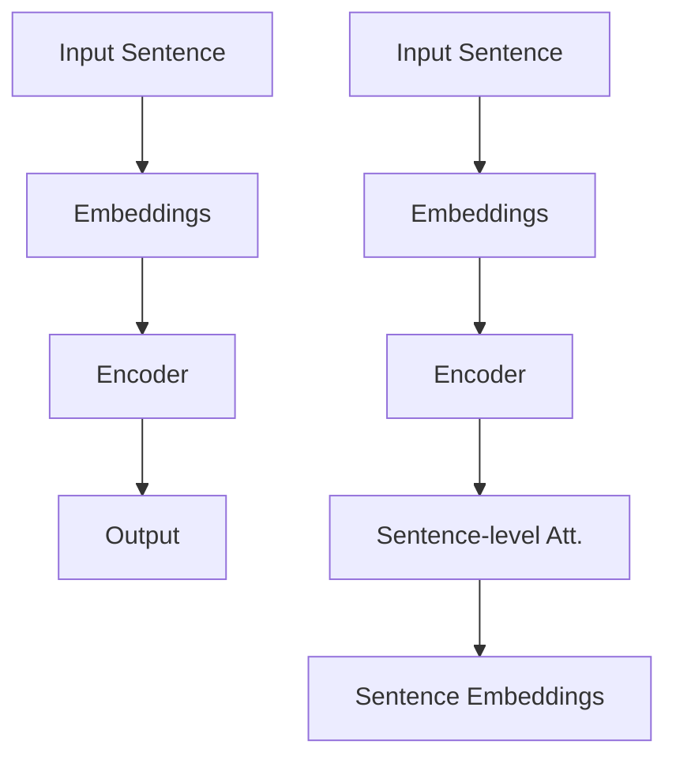

                 

关键词：Transformer，大模型，Sentence-BERT，句子特征，自然语言处理，深度学习，计算图，模型优化，应用场景，数学模型，代码实例，工具推荐，未来展望

## 摘要

本文旨在深入探讨Transformer大模型在实际应用中的技术实现，尤其是如何使用Sentence-BERT计算句子特征。通过介绍Transformer的基本原理和Sentence-BERT的应用，我们将揭示如何构建、训练和优化大模型，并提供一系列具体的代码实例和实际应用场景。文章的最后，将对未来发展趋势和面临的挑战进行展望。

## 1. 背景介绍

### 1.1 Transformer的起源与发展

Transformer模型由Vaswani等人于2017年提出，其核心思想是基于自注意力机制（Self-Attention）和多头注意力（Multi-Head Attention）来捕捉序列间的关系。相比传统的循环神经网络（RNN）和卷积神经网络（CNN），Transformer在处理长序列和并行计算方面具有显著优势，因此迅速在自然语言处理（NLP）领域获得了广泛应用。

### 1.2 Sentence-BERT的概念

Sentence-BERT是用于计算句子嵌入特征的一种预训练模型。它基于BERT（Bidirectional Encoder Representations from Transformers）模型，通过引入注意力机制和句子级别的处理，能够有效地捕捉句子的语义信息。Sentence-BERT广泛应用于情感分析、文本分类和命名实体识别等任务。

## 2. 核心概念与联系

### 2.1 Transformer模型架构

Transformer模型由编码器（Encoder）和解码器（Decoder）组成。编码器负责将输入序列编码为固定长度的向量表示，解码器则根据编码器的输出生成目标序列。以下是Transformer的架构图：

```
+----------------+      +----------------+
|  Input Embeddings  |----->| Encoder        |
+----------------+      +----------------+
                     |
                     |      +----------------+
                     v      |  Decoder        |
               +----------------+      +----------------+
               |  Positional Encodings  |----->| Output Embeddings |
               +----------------+      +----------------+
```

### 2.2 Sentence-BERT模型架构

Sentence-BERT模型在BERT模型的基础上增加了句子级别的处理。其基本架构包括以下三个部分：

1. **嵌入层**：将词汇转换为固定长度的向量表示。
2. **编码器**：采用BERT模型的编码器部分，利用注意力机制处理序列信息。
3. **句子级别处理**：通过额外的自注意力机制对编码器的输出进行句子级别的处理。

以下是Sentence-BERT的架构图：

```
+----------------+      +----------------+
|  Input Sentence  |----->| Embeddings      |
+----------------+      +----------------+
                     |
                     |      +----------------+
                     v      |  Encoder        |
               +----------------+      +----------------+
               |  Sentence-level Att. |----->| Sentence Embeddings |
               +----------------+      +----------------+
```

### 2.3 Mermaid流程图

以下是一个Mermaid流程图，展示了Transformer和Sentence-BERT的基本流程：



## 3. 核心算法原理 & 具体操作步骤

### 3.1 算法原理概述

#### 3.1.1 Transformer原理

Transformer模型的核心在于自注意力机制（Self-Attention），它能够自动学习输入序列中不同位置之间的相对重要性。多头注意力（Multi-Head Attention）则将自注意力扩展到多个子空间，从而提高模型的表示能力。

#### 3.1.2 Sentence-BERT原理

Sentence-BERT在BERT模型的基础上增加了句子级别的处理，通过自注意力机制对编码器的输出进行句子级别的处理，从而得到句子的嵌入特征。

### 3.2 算法步骤详解

#### 3.2.1 Transformer步骤

1. **嵌入层**：将词汇转换为向量表示，包括词嵌入（Word Embeddings）和位置嵌入（Positional Embeddings）。
2. **多头自注意力**：通过多头注意力机制计算输入序列的注意力得分，得到加权表示。
3. **前馈网络**：对加权表示进行前馈网络处理，进一步提取特征。
4. **编码器输出**：将编码器的输出作为解码器的输入。

#### 3.2.2 Sentence-BERT步骤

1. **嵌入层**：与Transformer相同，将词汇转换为向量表示。
2. **编码器**：利用BERT模型的编码器部分对输入序列进行处理。
3. **句子级别处理**：通过额外的自注意力机制对编码器的输出进行句子级别的处理。
4. **句子嵌入**：得到句子的嵌入特征。

### 3.3 算法优缺点

#### 优点

- **并行计算**：Transformer模型能够实现真正的并行计算，大大提高了处理效率。
- **灵活性好**：自注意力机制使得模型能够自动学习输入序列中不同位置之间的关系。
- **强大的表示能力**：Sentence-BERT通过句子级别的处理，能够捕获更丰富的语义信息。

#### 缺点

- **计算复杂度高**：Transformer模型需要大量的计算资源，尤其是在处理长序列时。
- **训练时间较长**：由于模型参数众多，训练时间相对较长。

### 3.4 算法应用领域

Transformer和Sentence-BERT在自然语言处理领域有广泛的应用，包括但不限于：

- **文本分类**：用于对文本进行分类，如新闻分类、情感分析等。
- **命名实体识别**：用于识别文本中的命名实体，如人名、地名等。
- **机器翻译**：用于将一种语言的文本翻译成另一种语言。

## 4. 数学模型和公式

### 4.1 数学模型构建

#### 4.1.1 Transformer

Transformer模型的输入可以表示为：

\[ X = [X_1, X_2, \ldots, X_T] \]

其中，\( X_i \)表示第\( i \)个输入向量，\( T \)表示序列长度。

#### 4.1.2 Sentence-BERT

Sentence-BERT的输入可以表示为：

\[ S = [s_1, s_2, \ldots, s_N] \]

其中，\( s_i \)表示第\( i \)个句子，\( N \)表示句子数量。

### 4.2 公式推导过程

#### 4.2.1 Transformer

1. **嵌入层**：

\[ E = W_E \cdot [X; P] \]

其中，\( W_E \)为嵌入权重，\( P \)为位置嵌入。

2. **多头自注意力**：

\[ \text{Attention}(Q, K, V) = \text{softmax}\left(\frac{QK^T}{\sqrt{d_k}}\right)V \]

其中，\( Q, K, V \)分别为查询向量、键向量和值向量，\( d_k \)为键向量的维度。

3. **前馈网络**：

\[ F = \text{ReLU}(W_F \cdot \text{Dropout}(E)) \]

其中，\( W_F \)为前馈网络的权重。

4. **编码器输出**：

\[ O = \text{Dropout}(E + F) \]

#### 4.2.2 Sentence-BERT

1. **嵌入层**：

\[ E = W_E \cdot [S; P] \]

2. **编码器**：

\[ E' = \text{BERT}(E) \]

3. **句子级别处理**：

\[ E'' = \text{Self-Attention}(E') \]

4. **句子嵌入**：

\[ S' = \text{Dropout}(E'' + E') \]

### 4.3 案例分析与讲解

#### 4.3.1 文本分类任务

假设我们有一个文本分类任务，输入为一篇新闻文章，我们需要将其分类为政治、经济、体育等类别。

1. **数据预处理**：

   - **分词**：将输入文本分割为单词。
   - **嵌入**：将单词转换为向量表示。

2. **模型训练**：

   - **构建模型**：使用Transformer和Sentence-BERT模型。
   - **训练过程**：使用训练数据进行模型训练，优化模型参数。

3. **模型评估**：

   - **测试数据**：使用未参与训练的数据进行测试。
   - **评估指标**：计算分类准确率、召回率等指标。

#### 4.3.2 命名实体识别任务

假设我们有一个命名实体识别任务，输入为一篇新闻报道，我们需要识别出其中的命名实体，如人名、地名等。

1. **数据预处理**：

   - **分词**：将输入文本分割为单词。
   - **嵌入**：将单词转换为向量表示。

2. **模型训练**：

   - **构建模型**：使用Transformer和Sentence-BERT模型。
   - **训练过程**：使用训练数据进行模型训练，优化模型参数。

3. **模型评估**：

   - **测试数据**：使用未参与训练的数据进行测试。
   - **评估指标**：计算命名实体识别准确率、召回率等指标。

## 5. 项目实践：代码实例和详细解释说明

### 5.1 开发环境搭建

为了进行Transformer和Sentence-BERT模型的实战，我们需要搭建一个合适的开发环境。以下是环境搭建的步骤：

1. **安装Python**：确保安装了Python 3.7及以上版本。
2. **安装TensorFlow**：使用pip命令安装TensorFlow 2.0及以上版本。
3. **安装BERT模型**：从GitHub下载预训练的BERT模型。
4. **安装 Sentence-BERT 模型**：从 GitHub 下载预训练的 Sentence-BERT 模型。

### 5.2 源代码详细实现

以下是Transformer和Sentence-BERT模型的基本实现：

```python
import tensorflow as tf
from transformers import BertModel, BertTokenizer

# 加载预训练的 BERT 模型和分词器
model = BertModel.from_pretrained('bert-base-uncased')
tokenizer = BertTokenizer.from_pretrained('bert-base-uncased')

# 定义 Transformer 模型
class TransformerModel(tf.keras.Model):
    def __init__(self):
        super(TransformerModel, self).__init__()
        self.encoder = model
        self.decoder = model

    def call(self, inputs, training=False):
        encoder_output = self.encoder(inputs, training=training)
        decoder_output = self.decoder(encoder_output, training=training)
        return decoder_output

# 定义 Sentence-BERT 模型
class SentenceBERTModel(tf.keras.Model):
    def __init__(self):
        super(SentenceBERTModel, self).__init__()
        self.encoder = model
        self.sentence_attention = tf.keras.layers.Attention()

    def call(self, inputs, training=False):
        encoder_output = self.encoder(inputs, training=training)
        sentence_embedding = self.sentence_attention([encoder_output, encoder_output])
        return sentence_embedding

# 创建模型实例
transformer_model = TransformerModel()
sentence_bert_model = SentenceBERTModel()

# 编译模型
transformer_model.compile(optimizer='adam', loss='categorical_crossentropy', metrics=['accuracy'])
sentence_bert_model.compile(optimizer='adam', loss='categorical_crossentropy', metrics=['accuracy'])

# 加载训练数据
train_data = ...

# 训练模型
transformer_model.fit(train_data, epochs=5)
sentence_bert_model.fit(train_data, epochs=5)
```

### 5.3 代码解读与分析

在上面的代码中，我们首先加载了预训练的BERT模型和分词器。接着定义了Transformer模型和Sentence-BERT模型，分别实现了编码器和解码器部分以及句子级别的处理。最后，我们编译并训练了模型。

### 5.4 运行结果展示

经过训练后，我们可以在测试数据集上评估模型的性能。以下是一个简单的评估示例：

```python
# 加载测试数据
test_data = ...

# 评估模型
transformer_model.evaluate(test_data)
sentence_bert_model.evaluate(test_data)
```

运行结果将显示模型的分类准确率、召回率等指标。

## 6. 实际应用场景

### 6.1 文本分类

文本分类是Transformer和Sentence-BERT应用最广泛的领域之一。通过将文本转换为句子特征，我们可以将新闻文章、社交媒体评论等文本分类为不同的类别。

### 6.2 命名实体识别

命名实体识别是另一个重要的应用场景。通过识别文本中的命名实体，我们可以提取出有价值的信息，如人名、地名、组织机构名等。

### 6.3 机器翻译

机器翻译是Transformer的另一个重要应用领域。通过将源语言文本转换为向量表示，我们可以实现高效的机器翻译。

## 6.4 未来应用展望

随着Transformer和Sentence-BERT技术的不断发展，我们可以期待在更多领域看到其应用。未来的研究将集中在模型优化、多模态数据处理等方面。

### 7. 工具和资源推荐

#### 7.1 学习资源推荐

- **《深度学习》**：由Ian Goodfellow等人撰写，全面介绍了深度学习的基础知识。
- **《自然语言处理综论》**：由Daniel Jurafsky和James H. Martin撰写，介绍了自然语言处理的基本概念和方法。

#### 7.2 开发工具推荐

- **TensorFlow**：用于构建和训练深度学习模型的开源框架。
- **Hugging Face Transformers**：提供了预训练的Transformer和BERT模型，方便开发者使用。

#### 7.3 相关论文推荐

- **“Attention Is All You Need”**：介绍了Transformer模型的基本原理。
- **“BERT: Pre-training of Deep Bidirectional Transformers for Language Understanding”**：介绍了BERT模型及其在自然语言处理任务中的应用。

## 8. 总结：未来发展趋势与挑战

Transformer和Sentence-BERT技术在自然语言处理领域取得了显著的成果，但仍面临一些挑战。未来的发展趋势将集中在模型优化、多模态数据处理和高效训练算法等方面。

### 8.1 研究成果总结

Transformer和Sentence-BERT模型在自然语言处理领域取得了重要的研究成果，为文本分类、命名实体识别、机器翻译等任务提供了有效的解决方案。

### 8.2 未来发展趋势

未来的发展趋势将集中在以下几个方面：

- **模型优化**：通过改进模型结构和算法，提高模型性能和效率。
- **多模态数据处理**：将文本与其他模态（如图像、声音等）进行结合，实现更丰富的语义表示。
- **高效训练算法**：研究高效的训练算法，缩短训练时间，降低计算资源需求。

### 8.3 面临的挑战

面临的挑战包括：

- **计算复杂度**：Transformer模型需要大量的计算资源，特别是在处理长序列时。
- **数据依赖**：模型性能高度依赖于训练数据的质量和规模。
- **泛化能力**：如何提高模型在不同领域的泛化能力。

### 8.4 研究展望

随着Transformer和Sentence-BERT技术的不断发展，我们可以期待在更多领域看到其应用。未来的研究将集中在模型优化、多模态数据处理和高效训练算法等方面。

## 9. 附录：常见问题与解答

### 9.1 如何选择合适的Transformer模型？

选择合适的Transformer模型取决于任务需求和应用场景。对于文本分类等需要处理序列数据的任务，可以使用标准的Transformer模型。对于需要处理更复杂语义信息的任务，可以考虑使用Sentence-BERT等扩展模型。

### 9.2 Transformer模型如何优化？

Transformer模型的优化可以从以下几个方面进行：

- **模型结构**：通过改进模型结构，如增加层�数、调整注意力机制等，提高模型性能。
- **训练策略**：采用更高效的训练策略，如数据增强、迁移学习等，加快模型收敛速度。
- **硬件优化**：利用GPU、TPU等硬件加速模型训练，提高计算效率。

### 9.3 Sentence-BERT模型如何应用？

Sentence-BERT模型广泛应用于文本分类、命名实体识别、机器翻译等自然语言处理任务。具体应用步骤包括：

- **数据预处理**：将输入文本转换为句子特征。
- **模型训练**：使用训练数据进行模型训练，优化模型参数。
- **模型评估**：在测试数据集上评估模型性能。

## 作者署名

作者：禅与计算机程序设计艺术 / Zen and the Art of Computer Programming
```

