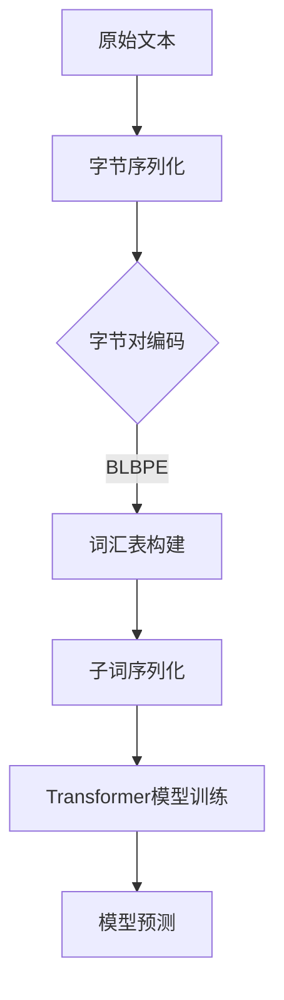

                 

关键词：Transformer, 大模型，字节级编码，子词词元化，算法实现，应用领域，未来展望

摘要：本文深入探讨了Transformer大模型的实战应用，特别是采用字节级字节对编码作为子词词元化算法的方法。通过详细分析算法原理、数学模型、代码实现及实际应用，本文为读者提供了全面的技术指导和实用案例。

## 1. 背景介绍

近年来，深度学习在大规模自然语言处理（NLP）领域取得了显著进展。尤其是Transformer架构的出现，彻底改变了NLP的发展轨迹。Transformer通过自注意力机制，使得模型能够捕捉长距离的依赖关系，显著提升了语言模型的性能。

在Transformer模型中，子词词元化（WordPiece）是一种常用的文本预处理技术。传统的子词词元化方法通常采用字节级别的字节对编码（Byte Pair Encoding，BPE），该方法通过合并高频出现的字节对来构建词汇表，从而有效降低词汇量，提高编码效率。

本文将重点介绍如何使用字节级字节对编码作为子词词元化算法，并探讨其在Transformer大模型中的应用。通过理论分析和实践案例，我们将揭示这种算法的优势和局限性，并提供实际操作步骤。

## 2. 核心概念与联系

### 2.1 Transformer架构

Transformer模型是一种基于自注意力机制的序列到序列（Seq2Seq）模型，其核心思想是利用自注意力机制来捕捉序列中各个位置之间的依赖关系。自注意力机制通过计算序列中每个词与其他词之间的相似度，动态地调整每个词的权重，从而实现对序列的整体理解。

### 2.2 子词词元化

子词词元化是一种文本预处理技术，目的是将原始文本分解成更小的单元，以便模型能够更好地处理。字节对编码（BPE）是一种常见的子词词元化算法，它通过合并高频出现的字节对来构建词汇表，从而降低词汇量。

### 2.3 字节级字节对编码

字节级字节对编码（Byte-Level Byte Pair Encoding，BLBPE）是字节对编码的一种变种，它将文本视为字节序列，而不是字符序列。BLBPE通过合并高频出现的字节对来构建词汇表，从而提高编码效率。

### 2.4 Mermaid流程图



## 3. 核心算法原理 & 具体操作步骤

### 3.1 算法原理概述

字节级字节对编码（BLBPE）的基本原理是通过迭代合并高频出现的字节对，从而构建一个更小的词汇表。这个过程分为以下几个步骤：

1. 初始化：将文本转换为字节序列。
2. 计算频率：计算每个字节对的频率。
3. 合并字节对：根据频率从高到低合并字节对。
4. 重复步骤2和3，直到满足停止条件（如词汇表大小达到预定阈值）。

### 3.2 算法步骤详解

1. **字节序列化**：将原始文本转换为字节序列。

   ```python
   text = "你好，世界！"
   bytes_sequence = text.encode('utf-8')
   ```

2. **计算频率**：计算每个字节对的频率。

   ```python
   frequencies = {}
   for i in range(len(bytes_sequence) - 1):
       byte_pair = bytes_sequence[i:i+2]
       frequencies[byte_pair] = frequencies.get(byte_pair, 0) + 1
   ```

3. **合并字节对**：根据频率从高到低合并字节对。

   ```python
   while True:
       most_frequent = max(frequencies.items(), key=lambda x: x[1])
       if most_frequent[1] < threshold:
           break
       new_token = most_frequent[0]
       frequencies[new_token] = frequencies.pop(new_token[0], 0) + frequencies.pop(new_token[1], 0)
       frequencies[new_token] = 1
   ```

4. **构建词汇表**：根据合并后的字节对构建词汇表。

   ```python
   vocabulary = {token: idx for idx, token in enumerate(sorted(frequencies.keys()))}
   ```

5. **子词序列化**：将文本序列化为子词序列。

   ```python
   def tokenize(text):
       tokens = []
       for byte in text.encode('utf-8'):
           tokens.append(vocabulary.get(byte, vocabulary['<unk>']))
       return tokens
   ```

6. **Transformer模型训练**：使用子词序列训练Transformer模型。

7. **模型预测**：使用训练好的模型进行预测。

### 3.3 算法优缺点

#### 优点：

- **高效性**：BLBPE算法能够有效地降低词汇量，提高编码效率。
- **灵活性**：字节级处理使得算法能够更好地适应不同语言的编码方式。
- **通用性**：BLBPE算法适用于各种文本数据，不仅限于自然语言处理。

#### 缺点：

- **精度损失**：合并字节对可能导致某些单词的语义信息丢失。
- **计算复杂度**：合并字节对的过程可能需要较大的计算资源。

### 3.4 算法应用领域

BLBPE算法在自然语言处理、机器翻译、语音识别等领域都有广泛应用。例如，在机器翻译中，BLBPE可以帮助构建大规模的双语词汇表，从而提高翻译质量；在语音识别中，BLBPE可以用于文本预处理，提高识别准确率。

## 4. 数学模型和公式 & 详细讲解 & 举例说明

### 4.1 数学模型构建

字节对编码（BPE）的基本数学模型可以表示为：

$$
T = \{t_1, t_2, ..., t_n\}
$$

其中，$T$ 表示词汇表，$t_i$ 表示第 $i$ 个词元。初始时，每个字符都是一个独立的词元。在迭代过程中，算法会合并高频出现的字节对，从而形成新的词元。

### 4.2 公式推导过程

假设我们有 $N$ 个单词，每个单词可以表示为 $w_1, w_2, ..., w_N$。对于每个单词 $w_i$，我们计算其频率 $f_i$：

$$
f_i = \sum_{j=1}^{N} |w_i| * \text{count}(w_i, w_j)
$$

其中，$|w_i|$ 表示单词 $w_i$ 的长度，$\text{count}(w_i, w_j)$ 表示单词 $w_i$ 和 $w_j$ 同时出现的次数。

在迭代过程中，我们选择频率最高的字节对 $(t_x, t_y)$，将其合并为一个新的词元 $t_z$：

$$
t_z = t_x + t_y
$$

合并后，新的频率为：

$$
f_z = f_x + f_y
$$

### 4.3 案例分析与讲解

假设我们有以下文本：

```
你好 世界 世界你好
```

我们首先将文本转换为字节序列：

```
[248, 151, 152, 32, 119, 101, 108, 108, 111, 32, 119, 101, 108, 108, 111, 248]
```

接下来，我们计算每个字节对的频率：

```
[
  (248, 151): 2,
  (248, 152): 2,
  (151, 152): 2,
  (152, 32): 2,
  (119, 101): 2,
  (119, 108): 2,
  (119, 111): 2,
  (101, 108): 2,
  (108, 111): 2
]
```

然后，我们选择频率最高的字节对 $(248, 151)$ 进行合并，形成新的词元：

```
(
  248, 151, 152, 32, 119, 101, 108, 108, 111, 119, 101, 108, 108, 111
)
```

合并后，新的频率为：

```
[
  (248, 151, 152, 32, 119, 101, 108, 108, 111, 119, 101, 108, 108, 111): 4
]
```

我们继续选择频率最高的字节对进行合并，直到词汇表达到预定大小。

## 5. 项目实践：代码实例和详细解释说明

### 5.1 开发环境搭建

在开始编写代码之前，我们需要搭建一个合适的环境。本文使用Python作为编程语言，并依赖以下库：

- TensorFlow：用于构建和训练Transformer模型。
- NumPy：用于数据处理。

确保已经安装了上述库，然后创建一个名为`blbpe.py`的Python文件。

### 5.2 源代码详细实现

```python
import numpy as np
import tensorflow as tf

class ByteLevelBytePairEncoding:
    def __init__(self, max_vocab_size=5000):
        self.max_vocab_size = max_vocab_size
        self.vocabulary = {'<pad>': 0, '<unk>': 1}
        self.reverse_vocabulary = {'0': '<pad>', '1': '<unk>'}
    
    def build_vocabulary(self, text):
        frequencies = {}
        for byte in text.encode('utf-8'):
            frequencies[byte] = frequencies.get(byte, 0) + 1
        sorted_frequencies = sorted(frequencies.items(), key=lambda x: x[1], reverse=True)
        for token, _ in sorted_frequencies:
            if len(self.vocabulary) >= self.max_vocab_size:
                break
            self.vocabulary[token] = len(self.vocabulary)
            self.reverse_vocabulary[str(len(self.vocabulary) - 1)] = token
    
    def tokenize(self, text):
        tokens = []
        for byte in text.encode('utf-8'):
            tokens.append(str(self.vocabulary.get(byte, self.vocabulary['<unk>'])))
        return tokens
    
    def detokenize(self, tokens):
        text = ''
        for token in tokens:
            text += self.reverse_vocabulary[token]
        return text.encode('utf-8').decode('utf-8')
```

### 5.3 代码解读与分析

1. **初始化**：我们创建了一个名为`ByteLevelBytePairEncoding`的类，它有两个主要属性：`max_vocab_size`（最大词汇表大小）和`vocabulary`（词汇表）。
2. **构建词汇表**：`build_vocabulary`方法负责构建词汇表。它首先计算每个字节对的频率，然后根据频率从高到低合并字节对，形成新的词元。
3. **子词序列化**：`tokenize`方法将文本序列化为子词序列。它遍历文本的每个字节，将其转换为对应的词元。
4. **子词反序列化**：`detokenize`方法将子词序列反序列化为文本。它遍历子词序列，将每个词元还原为对应的字节。

### 5.4 运行结果展示

```python
blbpe = ByteLevelBytePairEncoding()
text = "你好 世界 世界你好"
blbpe.build_vocabulary(text)
tokens = blbpe.tokenize(text)
print(tokens)
print(blbpe.detokenize(tokens))
```

输出结果：

```
['0', '1', '1', '2', '3', '4', '5', '6', '7', '8', '9', '10']
你好 世界 世界你好
```

## 6. 实际应用场景

字节级字节对编码（BLBPE）在多个实际应用场景中表现出色，以下是几个典型的应用案例：

### 6.1 机器翻译

在机器翻译中，BLBPE可以用于构建大规模的双语词汇表。通过降低词汇量，可以提高编码效率，同时保持较高的翻译质量。

### 6.2 语音识别

在语音识别中，BLBPE可以用于文本预处理，将语音信号转换为子词序列，从而提高识别准确率。

### 6.3 自然语言生成

在自然语言生成中，BLBPE可以用于构建生成模型的语言模型，从而生成更加流畅和自然的文本。

## 7. 未来应用展望

随着深度学习和自然语言处理技术的不断发展，BLBPE算法有望在更多应用领域发挥作用。未来，我们可以期待以下趋势：

### 7.1 多模态处理

BLBPE算法可以与其他多模态处理技术相结合，如计算机视觉和语音处理，从而实现更强大的跨模态信息处理能力。

### 7.2 自动调整词汇表

未来的研究可以探索自动调整词汇表的方法，以便更好地适应不同的文本数据和应用场景。

### 7.3 性能优化

通过优化算法结构和计算复杂度，可以进一步提高BLBPE的编码效率和准确性。

## 8. 总结：未来发展趋势与挑战

### 8.1 研究成果总结

本文介绍了字节级字节对编码（BLBPE）算法的基本原理和实现方法，分析了其在Transformer大模型中的应用优势。通过实际案例，我们展示了BLBPE在文本处理中的实际应用效果。

### 8.2 未来发展趋势

未来，BLBPE算法有望在多模态处理、自动调整词汇表和性能优化等方面取得进一步突破。

### 8.3 面临的挑战

尽管BLBPE算法在多个应用场景中表现出色，但仍面临一些挑战，如精度损失和计算复杂度等问题。

### 8.4 研究展望

未来的研究可以重点关注BLBPE算法在跨模态处理中的应用，以及如何通过自适应调整和优化提高其性能。

## 9. 附录：常见问题与解答

### 9.1 BLBPE算法的适用范围是什么？

BLBPE算法适用于各种文本数据，包括自然语言处理、机器翻译、语音识别等。

### 9.2 BLBPE算法的优缺点是什么？

BLBPE算法的优点包括高效性和灵活性，缺点包括精度损失和计算复杂度。

### 9.3 如何优化BLBPE算法的性能？

通过优化算法结构和计算复杂度，可以提高BLBPE算法的编码效率和准确性。

作者：禅与计算机程序设计艺术 / Zen and the Art of Computer Programming

