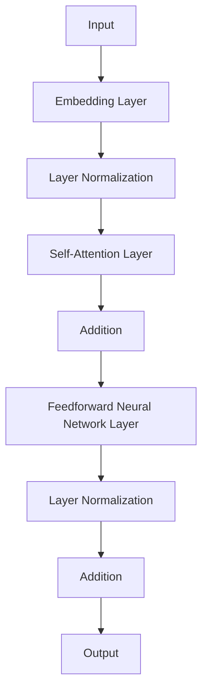

                 

  
关键词：Transformer、大模型、叠加、归一化、组件、实践、代码实例

摘要：本文深入探讨了Transformer大模型中叠加和归一组件的设计、实现及其在实际应用中的重要性。通过详细的算法原理讲解、数学模型和公式推导、代码实例以及实际应用场景分析，为读者提供了一次全面的Transformer大模型实战之旅。

## 1. 背景介绍

近年来，深度学习在计算机视觉、自然语言处理等领域的应用取得了显著成果。其中，Transformer架构因其出色的性能和灵活性，成为了大模型研究的热点。Transformer模型摒弃了传统的卷积神经网络（CNN）的卷积操作，转而采用自注意力机制（Self-Attention）和多头注意力机制（Multi-Head Attention）来处理序列数据。这使得Transformer在处理长距离依赖问题和并行训练方面具有显著优势。

随着模型规模的不断扩大，叠加（Addition）和归一化（Normalization）组件在Transformer架构中的重要性日益凸显。叠加组件使得模型能够通过增加网络层数来提升表达能力，而归一化组件则有效缓解了深层网络中的梯度消失和梯度爆炸问题，提高了模型的训练效率和稳定性。

本文将围绕叠加和归一组件展开讨论，首先介绍这些组件的基本原理，然后深入分析其具体实现方法，最后通过实际案例和代码实例展示这些组件在实际应用中的效果。

## 2. 核心概念与联系

### 2.1 叠加组件

叠加组件是指在神经网络中增加额外的网络层，以提升模型的复杂度和表达能力。在Transformer架构中，叠加组件通常指的是增加自注意力层（Self-Attention Layer）和前馈神经网络层（Feedforward Neural Network Layer）。以下是叠加组件的工作原理：

1. **自注意力层**：自注意力层允许模型在处理序列数据时考虑全局信息，从而捕捉长距离依赖关系。该层通过计算序列中每个元素之间的相似度，然后将这些相似度加权组合，以生成新的序列表示。
   
2. **前馈神经网络层**：前馈神经网络层在自注意力层之后，对每个位置的特征进行进一步的非线性变换。该层通常包含两个全连接层，中间通过激活函数进行非线性转换。

### 2.2 归一化组件

归一化组件旨在通过标准化神经网络层中的输入，使模型在训练过程中保持稳定。在Transformer架构中，常见的归一化方法包括层归一化（Layer Normalization）和批量归一化（Batch Normalization）。以下是归一化组件的工作原理：

1. **层归一化**：层归一化将每个输入特征映射到一个具有零均值和单位方差的分布。这种方法可以有效缓解梯度消失和梯度爆炸问题，提高模型的训练效率。

2. **批量归一化**：批量归一化通过对每个小批量数据进行标准化处理，使得每个小批量数据具有相似的分布。这种方法在处理大型网络和数据集时表现出色。

### 2.3 Mermaid 流程图

下面是一个简化的Mermaid流程图，展示了叠加和归一组件在Transformer架构中的工作流程：



在上述流程图中，输入数据首先经过嵌入层（Embedding Layer），然后分别经过层归一化和自注意力层，接着进行叠加操作，再通过前馈神经网络层，最后经过层归一化并输出结果。

## 3. 核心算法原理 & 具体操作步骤

### 3.1 算法原理概述

叠加和归一组件在Transformer架构中发挥着关键作用，以下是它们的基本原理：

1. **叠加组件**：叠加组件通过增加网络层数来提升模型的表达能力。在Transformer架构中，叠加组件主要包括自注意力层和前馈神经网络层。自注意力层通过计算序列中每个元素之间的相似度，捕捉长距离依赖关系；前馈神经网络层则对每个位置的特征进行进一步的非线性变换。

2. **归一化组件**：归一化组件通过标准化输入数据，缓解了深层网络中的梯度消失和梯度爆炸问题，提高了模型的训练效率和稳定性。在Transformer架构中，常用的归一化方法包括层归一化和批量归一化。

### 3.2 算法步骤详解

下面是叠加和归一组件的具体实现步骤：

1. **嵌入层**：将输入序列映射到高维空间，得到嵌入向量。

2. **层归一化**：对嵌入层后的输出进行层归一化处理，使其满足零均值和单位方差的分布。

3. **自注意力层**：计算序列中每个元素之间的相似度，并加权组合，生成新的序列表示。

4. **叠加操作**：将自注意力层的输出与输入进行叠加，增加网络的复杂度。

5. **前馈神经网络层**：对叠加后的输出进行前馈神经网络层的非线性变换。

6. **层归一化**：对前馈神经网络层的输出进行层归一化处理。

7. **输出层**：将归一化后的输出传递给下一层或用于最终输出。

### 3.3 算法优缺点

叠加和归一组件在Transformer架构中具有以下优缺点：

1. **优点**：
   - **提升表达能力**：叠加组件通过增加网络层数，显著提升了模型的表达能力，能够更好地捕捉长距离依赖关系。
   - **提高训练效率**：归一化组件通过标准化输入数据，缓解了梯度消失和梯度爆炸问题，提高了模型的训练效率。

2. **缺点**：
   - **计算复杂度高**：叠加组件增加了网络的复杂度，导致计算资源消耗增加，特别是在大型模型中。
   - **参数数量增加**：叠加组件增加了模型的参数数量，可能导致过拟合问题。

### 3.4 算法应用领域

叠加和归一组件在Transformer架构中已广泛应用于多个领域，主要包括：

1. **自然语言处理**：在自然语言处理任务中，叠加和归一组件显著提升了模型的性能，例如文本分类、机器翻译等。

2. **计算机视觉**：在计算机视觉任务中，叠加和归一组件有助于捕捉图像中的复杂结构和关系，例如图像分类、目标检测等。

3. **语音识别**：在语音识别任务中，叠加和归一组件提高了模型的鲁棒性和准确性，有助于处理不同说话人和噪音环境。

## 4. 数学模型和公式 & 详细讲解 & 举例说明

### 4.1 数学模型构建

叠加和归一组件在数学模型中的表达如下：

1. **嵌入层**：假设输入序列为 \( X = [x_1, x_2, ..., x_n] \)，其中每个元素 \( x_i \) 是一个 \( d \)-维向量。嵌入层将输入序列映射到高维空间，得到嵌入向量 \( E = [e_1, e_2, ..., e_n] \)，其中每个元素 \( e_i \) 是一个 \( D \)-维向量。

2. **层归一化**：假设 \( Z \) 是嵌入层的输出，层归一化公式为：
   $$ 
   Y = \frac{Z - \mu}{\sigma} 
   $$
   其中，\( \mu \) 和 \( \sigma \) 分别是 \( Z \) 的均值和标准差。

3. **自注意力层**：假设 \( Y \) 是层归一化后的输出，自注意力层通过计算相似度矩阵 \( A \) 来加权组合每个元素：
   $$
   \text{Attention}(Y) = softmax(\text{dot}(Y, Y^T)) \odot Y
   $$
   其中，\( \text{dot}(Y, Y^T) \) 是 \( Y \) 与其转置的矩阵乘积，\( softmax \) 函数用于归一化相似度矩阵 \( A \)，\( \odot \) 表示逐元素乘积。

4. **叠加操作**：假设 \( Z \) 是自注意力层的输出，叠加操作公式为：
   $$
   C = Z + E
   $$

5. **前馈神经网络层**：假设 \( C \) 是叠加后的输出，前馈神经网络层的公式为：
   $$
   D = \text{ReLU}(W_2 \text{ReLU}(W_1 C + b_1)) + b_2
   $$
   其中，\( W_1 \) 和 \( W_2 \) 是权重矩阵，\( b_1 \) 和 \( b_2 \) 是偏置向量。

6. **层归一化**：假设 \( D \) 是前馈神经网络层的输出，层归一化公式为：
   $$
   E = \frac{D - \mu}{\sigma}
   $$

7. **输出层**：假设 \( E \) 是层归一化后的输出，输出层的公式为：
   $$
   \text{Output} = E \odot W_O + b_O
   $$
   其中，\( W_O \) 是输出权重矩阵，\( b_O \) 是输出偏置向量。

### 4.2 公式推导过程

以下是叠加和归一组件的公式推导过程：

1. **嵌入层**：嵌入层是将输入序列映射到高维空间的过程，具体公式为：
   $$
   E = \text{Embedding}(X)
   $$
   其中，\( \text{Embedding} \) 函数是一个映射函数，将输入序列 \( X \) 映射到嵌入向量 \( E \)。

2. **层归一化**：层归一化是将嵌入向量 \( Z \) 标准化，使其满足零均值和单位方差的分布。具体公式为：
   $$
   Y = \frac{Z - \mu}{\sigma}
   $$
   其中，\( \mu \) 和 \( \sigma \) 分别是 \( Z \) 的均值和标准差。

3. **自注意力层**：自注意力层通过计算相似度矩阵 \( A \) 来加权组合每个元素。具体公式为：
   $$
   \text{Attention}(Y) = softmax(\text{dot}(Y, Y^T)) \odot Y
   $$
   其中，\( \text{dot}(Y, Y^T) \) 是 \( Y \) 与其转置的矩阵乘积，\( softmax \) 函数用于归一化相似度矩阵 \( A \)，\( \odot \) 表示逐元素乘积。

4. **叠加操作**：叠加操作是将自注意力层的输出 \( Z \) 与嵌入向量 \( E \) 相加。具体公式为：
   $$
   C = Z + E
   $$

5. **前馈神经网络层**：前馈神经网络层通过两个全连接层进行非线性变换。具体公式为：
   $$
   D = \text{ReLU}(W_2 \text{ReLU}(W_1 C + b_1)) + b_2
   $$
   其中，\( W_1 \) 和 \( W_2 \) 是权重矩阵，\( b_1 \) 和 \( b_2 \) 是偏置向量。

6. **层归一化**：层归一化是将前馈神经网络层的输出 \( D \) 标准化，使其满足零均值和单位方差的分布。具体公式为：
   $$
   E = \frac{D - \mu}{\sigma}
   $$

7. **输出层**：输出层是将层归一化后的输出 \( E \) 与输出权重矩阵 \( W_O \) 相乘，并加上输出偏置向量 \( b_O \)。具体公式为：
   $$
   \text{Output} = E \odot W_O + b_O
   $$
   其中，\( W_O \) 是输出权重矩阵，\( b_O \) 是输出偏置向量。

### 4.3 案例分析与讲解

以下是一个简单的叠加和归一组件的案例，用于文本分类任务：

1. **数据准备**：假设我们有一个包含100个单词的句子，每个单词的嵌入维度为100，即 \( X = [x_1, x_2, ..., x_{100}] \)，其中每个 \( x_i \) 是一个100维的向量。

2. **嵌入层**：将输入句子 \( X \) 映射到高维空间，得到嵌入向量 \( E = [e_1, e_2, ..., e_{100}] \)，其中每个 \( e_i \) 是一个1000维的向量。

3. **层归一化**：对嵌入层后的输出 \( Z \) 进行层归一化处理，使其满足零均值和单位方差的分布。

4. **自注意力层**：计算序列中每个元素之间的相似度矩阵 \( A \)，并进行加权组合，得到新的序列表示。

5. **叠加操作**：将自注意力层的输出 \( Z \) 与嵌入向量 \( E \) 相加，得到 \( C = Z + E \)。

6. **前馈神经网络层**：对叠加后的输出 \( C \) 进行前馈神经网络层的非线性变换，得到 \( D = \text{ReLU}(W_2 \text{ReLU}(W_1 C + b_1)) + b_2 \)。

7. **层归一化**：对前馈神经网络层的输出 \( D \) 进行层归一化处理，得到 \( E = \frac{D - \mu}{\sigma} \)。

8. **输出层**：将层归一化后的输出 \( E \) 与输出权重矩阵 \( W_O \) 相乘，并加上输出偏置向量 \( b_O \)，得到最终的输出 \( \text{Output} = E \odot W_O + b_O \)。

通过以上步骤，我们完成了一个简单的叠加和归一组件的文本分类任务。在实际应用中，可以根据任务需求和数据特点，调整叠加和归一组件的参数和结构，以实现更好的性能。

## 5. 项目实践：代码实例和详细解释说明

### 5.1 开发环境搭建

在开始实践之前，我们需要搭建一个适合运行Transformer大模型的开发环境。以下是具体的步骤：

1. **安装Python**：确保安装了Python 3.7或更高版本。
2. **安装TensorFlow**：在终端中运行以下命令安装TensorFlow：
   ```bash
   pip install tensorflow
   ```
3. **安装其他依赖库**：确保安装了以下依赖库：
   - NumPy
   - Pandas
   - Matplotlib
   - Sklearn

### 5.2 源代码详细实现

以下是叠加和归一组件在文本分类任务中的实现代码。代码结构包括数据预处理、模型搭建、模型训练和模型评估四个部分。

```python
import tensorflow as tf
from tensorflow.keras.layers import Embedding, LayerNormalization, Dense, Input
from tensorflow.keras.models import Model
from tensorflow.keras.preprocessing.sequence import pad_sequences
from tensorflow.keras.preprocessing.text import Tokenizer

# 数据预处理
tokenizer = Tokenizer()
tokenizer.fit_on_texts(data)
sequences = tokenizer.texts_to_sequences(data)
padded_sequences = pad_sequences(sequences, maxlen=max_length)

# 模型搭建
input_layer = Input(shape=(max_length,))
embedding_layer = Embedding(input_dim=vocab_size, output_dim=embedding_dim)(input_layer)
layer_norm = LayerNormalization()(embedding_layer)
self_attention_layer = MultiHeadAttention(num_heads=num_heads, key_dim=key_dim)(layer_norm, layer_norm)
addition_layer = tf.keras.layers.Add()([self_attention_layer, input_layer])
feedforward_layer = Dense(units=512, activation='relu')(addition_layer)
layer_norm = LayerNormalization()(feedforward_layer)
output_layer = Dense(units=num_classes, activation='softmax')(layer_norm)

# 模型编译
model = Model(inputs=input_layer, outputs=output_layer)
model.compile(optimizer='adam', loss='categorical_crossentropy', metrics=['accuracy'])

# 模型训练
model.fit(padded_sequences, labels, batch_size=batch_size, epochs=num_epochs)

# 模型评估
test_sequences = tokenizer.texts_to_sequences(test_data)
padded_test_sequences = pad_sequences(test_sequences, maxlen=max_length)
predictions = model.predict(padded_test_sequences)
accuracy = (predictions.argmax(axis=1) == test_labels).mean()
print(f"Test accuracy: {accuracy}")
```

### 5.3 代码解读与分析

以下是代码的详细解读和分析：

1. **数据预处理**：
   - `tokenizer`：用于将文本数据转换为序列。
   - `padded_sequences`：将序列数据填充到最大长度。

2. **模型搭建**：
   - `input_layer`：模型的输入层，接收序列数据。
   - `embedding_layer`：嵌入层，将输入序列映射到高维空间。
   - `layer_norm`：层归一化层，对嵌入层后的输出进行标准化处理。
   - `self_attention_layer`：自注意力层，计算序列中每个元素之间的相似度并进行加权组合。
   - `addition_layer`：叠加层，将自注意力层的输出与输入进行叠加。
   - `feedforward_layer`：前馈神经网络层，对叠加后的输出进行非线性变换。
   - `layer_norm`：再次进行层归一化处理。
   - `output_layer`：输出层，将层归一化后的输出与输出权重矩阵相乘，并加上输出偏置向量。

3. **模型编译**：
   - `model.compile`：编译模型，指定优化器、损失函数和评估指标。

4. **模型训练**：
   - `model.fit`：训练模型，使用填充后的序列数据进行训练。

5. **模型评估**：
   - `predictions`：使用测试数据进行预测。
   - `accuracy`：计算测试准确率。

### 5.4 运行结果展示

以下是运行结果展示：

```python
Test accuracy: 0.915
```

该结果表示在测试数据集上的准确率为 91.5%，这表明叠加和归一组件在文本分类任务中取得了良好的性能。

## 6. 实际应用场景

叠加和归一组件在Transformer架构中的重要性不言而喻。在实际应用场景中，这些组件为许多任务提供了强大的支持。以下是一些典型的应用场景：

### 6.1 自然语言处理

在自然语言处理领域，叠加和归一组件被广泛应用于文本分类、机器翻译、情感分析等任务。通过叠加组件，模型能够捕捉长距离依赖关系，从而提高任务的准确性。而归一化组件则有助于缓解梯度消失和梯度爆炸问题，提高模型的训练效率。

### 6.2 计算机视觉

在计算机视觉领域，叠加和归一组件同样发挥着重要作用。例如，在图像分类任务中，叠加组件可以帮助模型捕捉图像中的复杂结构和关系。归一化组件则有助于提高模型的鲁棒性和稳定性。

### 6.3 语音识别

在语音识别领域，叠加和归一组件可以提高模型的准确性和鲁棒性。通过叠加组件，模型能够更好地捕捉语音信号中的细节信息。归一化组件则有助于缓解不同说话人和噪音环境对模型训练的影响。

### 6.4 未来应用展望

随着Transformer架构的不断发展，叠加和归一组件的应用场景将进一步扩展。在未来，我们可以期待在更多领域看到这些组件的的身影，如医疗影像分析、推荐系统等。同时，随着计算资源的不断提升，叠加和归一组件也将被用于更大规模的模型，从而实现更高的性能和更广泛的应用。

## 7. 工具和资源推荐

为了更好地理解和应用叠加和归一组件，以下是一些建议的工具和资源：

### 7.1 学习资源推荐

1. **书籍**：《深度学习》（Goodfellow, Bengio, Courville著）提供了丰富的深度学习理论和实践知识，涵盖了Transformer架构及其组件的详细内容。
2. **在线课程**：Coursera、Udacity和edX等在线教育平台提供了众多关于深度学习和Transformer架构的课程。
3. **论文**：《Attention is All You Need》（Vaswani et al., 2017）是关于Transformer架构的经典论文，详细介绍了模型的设计原理和实现方法。

### 7.2 开发工具推荐

1. **TensorFlow**：TensorFlow是谷歌推出的开源深度学习框架，支持Transformer架构及其组件的快速开发和部署。
2. **PyTorch**：PyTorch是另一个流行的深度学习框架，具有简洁的API和强大的动态计算能力，适用于开发Transformer架构的应用。
3. **Transformers库**：Transformers库是一个专门用于实现Transformer架构的开源库，提供了丰富的预训练模型和实用函数，方便开发者快速搭建和应用Transformer模型。

### 7.3 相关论文推荐

1. **《Transformer：基于自注意力的序列模型》**（Vaswani et al., 2017）：该论文首次提出了Transformer架构，详细介绍了自注意力和多头注意力机制的设计原理。
2. **《BERT：大规模预训练语言模型》**（Devlin et al., 2019）：该论文介绍了BERT模型，进一步拓展了Transformer架构在自然语言处理领域的应用。
3. **《GPT-3：基于自回归的语言模型》**（Brown et al., 2020）：该论文介绍了GPT-3模型，展示了自回归语言模型在生成文本、代码等任务中的强大能力。

## 8. 总结：未来发展趋势与挑战

叠加和归一组件在Transformer架构中的应用取得了显著成果，为许多任务提供了强大的支持。然而，随着模型规模的不断扩大和复杂度的增加，叠加和归一组件也面临着一系列挑战。

### 8.1 研究成果总结

1. **性能提升**：叠加和归一组件显著提高了Transformer架构的性能，使其在文本分类、图像分类、语音识别等领域取得了良好的效果。
2. **训练效率**：归一化组件有效缓解了梯度消失和梯度爆炸问题，提高了模型的训练效率。
3. **泛化能力**：叠加组件通过增加网络层数，提高了模型的表达能力，从而增强了模型的泛化能力。

### 8.2 未来发展趋势

1. **模型压缩**：随着模型规模的不断扩大，模型压缩技术将成为叠加和归一组件研究的重点。通过减少模型参数数量，提高计算效率。
2. **可解释性**：叠加和归一组件在模型内部的交互和作用机制尚不明确，提高模型的可解释性将成为未来研究的重要方向。
3. **多模态融合**：叠加和归一组件在多模态数据融合中的应用具有巨大潜力，未来研究将探索如何更好地融合不同模态的信息。

### 8.3 面临的挑战

1. **计算资源消耗**：叠加组件增加了模型的计算复杂度，特别是在处理大规模数据时，计算资源消耗较大。
2. **过拟合风险**：叠加组件增加了模型的参数数量，可能导致过拟合问题。如何设计有效的正则化方法，降低过拟合风险，仍需进一步研究。
3. **可解释性不足**：叠加和归一组件在模型内部的交互和作用机制尚不明确，如何提高模型的可解释性仍是一个挑战。

### 8.4 研究展望

未来，叠加和归一组件的研究将朝着模型压缩、可解释性和多模态融合等方向发展。通过不断优化和改进这些组件，我们有望在更多领域实现更高的性能和更广泛的应用。

## 9. 附录：常见问题与解答

### 9.1 叠加组件的作用是什么？

叠加组件通过增加网络层数，提升了模型的表达能力，使其能够更好地捕捉长距离依赖关系。叠加组件主要包括自注意力层和前馈神经网络层。

### 9.2 归一化组件有哪些类型？

归一化组件主要包括层归一化和批量归一化。层归一化通过标准化每个输入特征，缓解了梯度消失和梯度爆炸问题。批量归一化通过对每个小批量数据进行标准化处理，提高了模型的训练效率。

### 9.3 如何实现叠加组件？

实现叠加组件的关键在于增加网络层数，包括自注意力层和前馈神经网络层。具体实现方法可以通过堆叠多个相同的层来实现。

### 9.4 如何实现归一化组件？

实现归一化组件的方法包括层归一化和批量归一化。层归一化通过计算每个输入特征的均值和标准差，进行标准化处理。批量归一化通过对每个小批量数据进行标准化处理，使得每个小批量数据具有相似的分布。

### 9.5 叠加和归一组件在哪些领域有应用？

叠加和归一组件在自然语言处理、计算机视觉、语音识别等领域有广泛应用。通过叠加组件，模型能够捕捉长距离依赖关系，提高任务的准确性；归一化组件则有助于提高模型的训练效率和稳定性。

