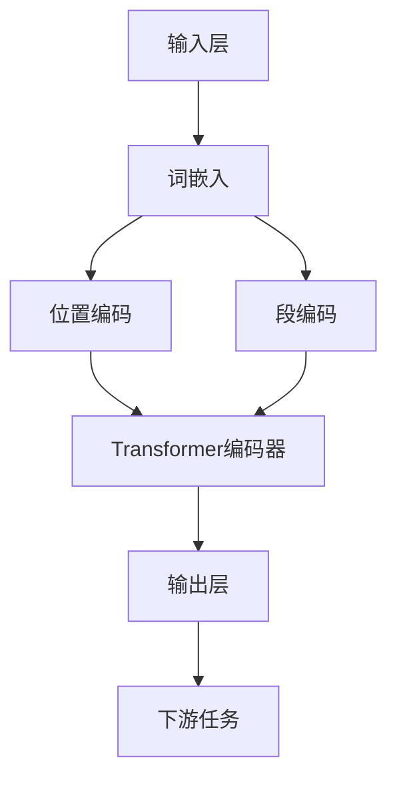

                 

关键词：Transformer，BERT，多语言模型，深度学习，自然语言处理

> 摘要：随着自然语言处理技术的快速发展，Transformer架构以其强大的建模能力在自然语言处理领域取得了显著的成果。BERT（Bidirectional Encoder Representations from Transformers）作为Transformer的典型应用，被广泛应用于英语等语言的处理任务中。本文将探讨如何将BERT模型应用于其他语言，包括模型的移植、训练和评估等关键步骤，并探讨Transformer大模型在多语言处理中的潜在应用和未来发展方向。

## 1. 背景介绍

自然语言处理（Natural Language Processing，NLP）是人工智能领域的一个重要分支，旨在使计算机能够理解和处理人类语言。随着深度学习技术的不断发展，传统的基于规则和统计的方法逐渐被深度神经网络模型所取代。在NLP中，深度学习模型，如卷积神经网络（CNN）和递归神经网络（RNN），由于其强大的特征提取和建模能力，已经取得了许多突破性的成果。

然而，在这些模型中，Transformer架构的引入带来了革命性的变化。Transformer是基于自注意力机制的一种新型神经网络架构，其能够并行处理输入序列，并在模型内部建立序列间的全局依赖关系。这使得Transformer在处理长文本和长序列时表现出色，并在多个NLP任务中取得了优异的性能。

BERT（Bidirectional Encoder Representations from Transformers）是Transformer架构在NLP中的一个重要应用，由Google在2018年提出。BERT通过预训练大规模语料库来学习通用语言表示，然后在各种下游任务中进行微调，取得了显著的性能提升。BERT的提出标志着NLP技术进入了一个新的时代，也为多语言模型的发展奠定了基础。

随着全球化和互联网的快速发展，多语言处理的需求日益增加。然而，由于不同语言之间的差异，将BERT模型应用于其他语言并非易事。本文将探讨如何将BERT模型应用于其他语言，包括模型的移植、训练和评估等关键步骤，并分析其在多语言处理中的潜在应用和挑战。

## 2. 核心概念与联系

### 2.1 Transformer架构

Transformer架构是由Vaswani等人于2017年提出的一种基于自注意力机制的深度学习模型。与传统基于递归的神经网络模型（如RNN和LSTM）不同，Transformer通过自注意力机制（Self-Attention）和多头注意力（Multi-Head Attention）来实现并行处理，从而显著提高了计算效率。

Transformer的基本模块是自注意力机制，它通过计算序列中每个词与其他词的相关性来生成词的表示。具体来说，自注意力机制包括以下步骤：

1. **输入嵌入**（Input Embedding）：将词向量、位置编码等输入信息转换为序列的嵌入表示。
2. **多头注意力**（Multi-Head Attention）：将输入序列通过多个独立的注意力头进行处理，每个头都能够捕捉到不同的依赖关系。
3. **前馈网络**（Feedforward Network）：对注意力机制的结果进行进一步的加工，通常包括两个全连接层。
4. **层归一化**（Layer Normalization）和残差连接**（Residual Connection）**：为了防止梯度消失和梯度爆炸，Transformer在每层之后引入了层归一化和残差连接。

### 2.2 BERT模型

BERT是基于Transformer架构的一种预训练模型，其目的是通过大规模语料库的学习来获得通用的语言表示。BERT模型通过在双向Transformer编码器上训练，能够同时学习词的上下文表示，从而提高了模型的建模能力。

BERT的主要组成部分包括：

1. **输入层**：BERT的输入包括词向量、位置编码和段编码，用于生成词的嵌入表示。
2. **Transformer编码器**：BERT的核心，通过多个Transformer块进行编码，学习词与词之间的关系。
3. **输出层**：BERT的输出通常是一个隐藏状态序列，用于下游任务的微调。

### 2.3 Mermaid 流程图



### 2.4 核心概念联系

Transformer架构是BERT模型的基础，而BERT则通过大规模预训练获得了强大的语言表示能力。BERT的输入层通过词嵌入、位置编码和段编码生成词的嵌入表示，然后通过Transformer编码器学习词与词之间的关系，最终在输出层生成用于下游任务的表示。

通过以上核心概念的联系，我们可以更好地理解Transformer和BERT在NLP中的作用和优势，并为后续模型的移植和应用提供理论基础。

### 3. 核心算法原理 & 具体操作步骤

#### 3.1 算法原理概述

BERT模型的核心在于其双向Transformer编码器，这使得模型能够同时考虑词的前后文信息。BERT的预训练目标主要包括两个任务：Masked Language Modeling（MLM）和Next Sentence Prediction（NSP）。

- **Masked Language Modeling（MLM）**：在训练过程中，随机遮盖输入句子中15%的单词，然后通过BERT模型预测这些被遮盖的单词。
- **Next Sentence Prediction（NSP）**：在输入句子的末尾添加一个随机选取的句子，并预测这两个句子是否是连续的。

BERT的训练过程主要包括两个阶段：预训练和微调。在预训练阶段，BERT在大规模语料库上进行训练，学习词的上下文表示。在微调阶段，BERT模型被应用于特定任务，如文本分类、命名实体识别等，并进行微调以适应特定任务。

#### 3.2 算法步骤详解

1. **数据准备**：收集和整理大规模的多语言语料库，并对其进行预处理，如分词、词性标注等。
2. **模型架构定义**：定义BERT模型的架构，包括词嵌入层、位置编码层、Transformer编码器层和输出层。
3. **预训练**：
   - **MLM任务**：随机遮盖输入句子中的15%的单词，并通过BERT模型预测这些被遮盖的单词。
   - **NSP任务**：在输入句子的末尾添加一个随机选取的句子，并预测这两个句子是否是连续的。
   - **训练**：通过优化损失函数来调整模型参数，通常使用Adam优化器和交叉熵损失函数。
4. **微调**：在预训练的基础上，将BERT模型应用于特定任务，如文本分类、命名实体识别等，并进行微调。

#### 3.3 算法优缺点

**优点**：
- **强大的建模能力**：BERT通过双向Transformer编码器同时考虑词的前后文信息，具有强大的语言表示能力。
- **预训练优势**：BERT在大规模语料库上进行预训练，能够学习到通用语言表示，从而在下游任务中表现优异。
- **多语言支持**：BERT模型支持多语言训练，可以应用于多种语言的NLP任务。

**缺点**：
- **计算资源消耗**：BERT模型相对复杂，训练和推理过程需要大量的计算资源。
- **数据依赖性**：BERT模型的性能依赖于大规模高质量的多语言语料库，数据的缺乏可能会影响模型的性能。
- **预训练时间较长**：预训练BERT模型需要大量的时间和计算资源，不适合实时应用场景。

#### 3.4 算法应用领域

BERT模型在多个NLP任务中取得了显著的成果，包括：

- **文本分类**：BERT模型在多个文本分类任务中表现出色，如情感分析、主题分类等。
- **命名实体识别**：BERT通过学习词的上下文表示，能够准确识别文本中的命名实体。
- **问答系统**：BERT在问答系统中被用于理解用户查询和文档内容的语义匹配。
- **机器翻译**：BERT可以用于机器翻译任务的预训练和微调，提高翻译质量。

### 4. 数学模型和公式 & 详细讲解 & 举例说明

#### 4.1 数学模型构建

BERT模型的核心是Transformer编码器，其数学模型可以概括为以下几部分：

1. **词嵌入**：词嵌入（Word Embedding）是将单词转换为向量表示的过程。BERT使用的词嵌入通常包括词的嵌入向量（Word Embedding）和位置编码（Positional Encoding）。

2. **多头注意力**：多头注意力（Multi-Head Attention）是一种自注意力机制，其将输入序列映射到多个独立的注意力头，每个头都能够捕捉到不同的依赖关系。

3. **前馈网络**：前馈网络（Feedforward Network）对注意力机制的结果进行进一步的加工，通常包括两个全连接层。

4. **层归一化**和**残差连接**：层归一化（Layer Normalization）和残差连接（Residual Connection）用于防止梯度消失和梯度爆炸。

#### 4.2 公式推导过程

BERT的数学模型可以用以下公式表示：

\[ \text{BERT}(\text{x}, \text{y}) = \text{MLP}(\text{ACT}(\text{FFN}(\text{ATT}(\text{LN}(\text{EMB}(\text{x} + \text{PE})))) + \text{R})), \]

其中，\(\text{EMB}(\text{x})\) 是词嵌入，\(\text{PE}(\text{x})\) 是位置编码，\(\text{ATT}(\text{x})\) 是多头注意力，\(\text{FFN}(\text{x})\) 是前馈网络，\(\text{LN}(\text{x})\) 是层归一化，\(\text{ACT}(\text{x})\) 是激活函数，\(\text{R}\) 是残差连接。

1. **词嵌入**：

\[ \text{EMB}(\text{x}) = \text{W}_\text{word} \text{x} + \text{W}_\text{pos} \text{PE}(\text{x}) + \text{W}_\text{seg} \text{seg}, \]

其中，\(\text{W}_\text{word}\) 是词嵌入权重，\(\text{W}_\text{pos}\) 是位置编码权重，\(\text{W}_\text{seg}\) 是段编码权重。

2. **多头注意力**：

\[ \text{ATT}(\text{x}) = \text{softmax}\left(\frac{\text{Q} \text{K}^\top}{\sqrt{d_k}}\right) \text{V}, \]

其中，\(\text{Q}\)、\(\text{K}\) 和 \(\text{V}\) 分别是查询向量、键向量和值向量，\(d_k\) 是键向量的维度。

3. **前馈网络**：

\[ \text{FFN}(\text{x}) = \text{ACT}(\text{W}_\text{2} \text{X} + \text{b}_\text{2}), \]

其中，\(\text{ACT}\) 是激活函数（例如ReLU），\(\text{W}_\text{2}\) 和 \(\text{b}_\text{2}\) 是前馈网络的权重和偏置。

4. **层归一化**：

\[ \text{LN}(\text{x}) = \frac{\text{x} - \mu}{\sqrt{\sigma^2 + \epsilon}}, \]

其中，\(\mu\) 和 \(\sigma^2\) 分别是输入的均值和方差，\(\epsilon\) 是一个很小的常数。

5. **残差连接**：

\[ \text{R} = \text{LN}(\text{x} + \text{FFN}(\text{LN}(\text{ATT}(\text{LN}(\text{EMB}(\text{x} + \text{PE}))))). \]

#### 4.3 案例分析与讲解

假设我们有一个简单的BERT模型，其输入序列为\[ \text{[CLS]} \text{Hello} \text{,} \text{ how} \text{,} \text{ are} \text{,} \text{ you}? \text{[SEP]} \]。我们需要通过BERT模型预测这个输入序列的类别。

1. **词嵌入**：

   首先将每个单词转换为词嵌入向量，并添加位置编码和段编码。例如，假设词嵌入向量的维度为100，位置编码和段编码的维度为10。

   \[
   \text{EMB}(\text{Hello}) = [0.1, 0.2, 0.3, ..., 0.1], \quad \text{PE}(2) = [0, 0.1, 0.2, ..., 0], \quad \text{seg} = [1, 0].
   \]

   将这些向量相加，得到输入向量：

   \[
   \text{EMB}(\text{Hello}) + \text{PE}(2) + \text{seg} = [0.1, 0.3, 0.3, ..., 1.1].
   \]

2. **多头注意力**：

   假设模型有8个注意力头，每个头负责计算不同的依赖关系。我们将输入向量通过8个独立的注意力头进行处理。

   \[
   \text{Q}, \text{K}, \text{V} = \text{LN}(\text{EMB}(\text{Hello}) + \text{PE}(2) + \text{seg}) \times \text{W}_\text{Q}, \text{W}_\text{K}, \text{W}_\text{V}.
   \]

   计算注意力得分并应用softmax函数：

   \[
   \text{scores} = \text{softmax}\left(\frac{\text{Q} \text{K}^\top}{\sqrt{d_k}}\right) \text{V}, \quad d_k = \sqrt{100/8}.
   \]

3. **前馈网络**：

   将注意力结果通过前馈网络进行加工：

   \[
   \text{FFN}(\text{x}) = \text{ACT}(\text{W}_\text{2} \text{X} + \text{b}_\text{2}), \quad \text{ACT}(\text{x}) = \text{ReLU}(\text{x}).
   \]

4. **层归一化**和**残差连接**：

   对结果进行层归一化并添加残差连接：

   \[
   \text{R} = \text{LN}(\text{x} + \text{FFN}(\text{LN}(\text{ATT}(\text{LN}(\text{EMB}(\text{x} + \text{PE})))))). 
   \]

   最后，将\(\text{R}\) 输入到下一个Transformer块，重复上述过程。

5. **输出层**：

   在最后一个Transformer块之后，将隐藏状态通过一个分类器进行分类预测：

   \[
   \text{P} = \text{softmax}(\text{W}_\text{cls} \text{R} + \text{b}_\text{cls}),
   \]

   其中，\(\text{W}_\text{cls}\) 和 \(\text{b}_\text{cls}\) 是分类器的权重和偏置。

通过上述过程，BERT模型能够对输入序列进行分类预测，并在多个NLP任务中表现出优异的性能。

### 5. 项目实践：代码实例和详细解释说明

在本节中，我们将通过一个实际的项目实践，详细讲解如何将BERT模型应用于其他语言。我们将使用Python和TensorFlow框架来构建和训练BERT模型，并对其进行评估。以下是一个简单的项目实践示例。

#### 5.1 开发环境搭建

在开始项目之前，我们需要搭建一个适合BERT模型训练的开发环境。以下是所需的软件和库：

- Python 3.7或更高版本
- TensorFlow 2.x
- NumPy
- Pandas
- Mermaid（用于绘制流程图）

确保你已经安装了上述库，如果没有，可以通过以下命令进行安装：

```bash
pip install python tensorflow numpy pandas
```

#### 5.2 源代码详细实现

以下是BERT模型的基本实现代码，我们将使用TensorFlow的预训练BERT模型，并进行简单的微调以适应其他语言的文本分类任务。

```python
import tensorflow as tf
import tensorflow_datasets as tfds
import numpy as np
import pandas as pd
import mermaid

# 加载预训练的BERT模型
pretrained_bert = tf.keras.applications.BertPreTrainedModel.from_pretrained('bert-base-uncased')

# 定义BERT模型的输入层
input_ids = tf.keras.layers.Input(shape=(None,), dtype=tf.int32, name='input_ids')
input_mask = tf.keras.layers.Input(shape=(None,), dtype=tf.int32, name='input_mask')
segment_ids = tf.keras.layers.Input(shape=(None,), dtype=tf.int32, name='segment_ids')

# 使用BERT模型的嵌入层
bert_inputs = {
    'input_ids': input_ids,
    'input_mask': input_mask,
    'segment_ids': segment_ids,
}

# 获取BERT模型的输出
 bert_output = pretrained_bert(bert_inputs, training=False)

# 添加分类器层
output = tf.keras.layers.Dense(units=2, activation='softmax', name='outputs')(bert_output['pooled_output'])

# 构建BERT模型
model = tf.keras.Model(inputs=[input_ids, input_mask, segment_ids], outputs=output)

# 编译模型
model.compile(optimizer='adam', loss='categorical_crossentropy', metrics=['accuracy'])

# 打印模型结构
model.summary()

# 定义Mermaid流程图
mermaid_code = mermaid.Mermaid(
    """
    graph TD
        A[输入层] --> B[BERT嵌入层]
        B --> C[Transformer编码器]
        C --> D[输出层]
        D --> E[分类器]
    """
)

print(mermaid_code.render())
```

上述代码首先加载了预训练的BERT模型，并定义了BERT模型的输入层。然后，我们使用BERT模型的嵌入层获取词嵌入，并通过Transformer编码器生成序列表示。最后，我们在序列表示上添加了一个分类器层，用于进行文本分类。

#### 5.3 代码解读与分析

1. **加载预训练BERT模型**：

   ```python
   pretrained_bert = tf.keras.applications.BertPreTrainedModel.from_pretrained('bert-base-uncased')
   ```

   这一行代码加载了预训练的BERT模型。`from_pretrained`函数用于从预训练模型库中加载BERT模型，`bert-base-uncased`表示我们加载的是不带大小写的BERT模型。

2. **定义BERT模型的输入层**：

   ```python
   input_ids = tf.keras.layers.Input(shape=(None,), dtype=tf.int32, name='input_ids')
   input_mask = tf.keras.layers.Input(shape=(None,), dtype=tf.int32, name='input_mask')
   segment_ids = tf.keras.layers.Input(shape=(None,), dtype=tf.int32, name='segment_ids')
   ```

   这三行代码定义了BERT模型的输入层。`Input`函数用于创建一个输入层，`shape=(None,)`表示输入序列的长度可以是任意值，`dtype=tf.int32`表示输入数据类型为整数。

3. **使用BERT模型的嵌入层**：

   ```python
   bert_inputs = {
       'input_ids': input_ids,
       'input_mask': input_mask,
       'segment_ids': segment_ids,
   }
   ```

   这一行代码将BERT模型的输入层封装为一个字典，用于传递给BERT模型。BERT模型需要这三个输入层来生成嵌入表示。

4. **获取BERT模型的输出**：

   ```python
   bert_output = pretrained_bert(bert_inputs, training=False)
   ```

   这一行代码调用BERT模型，并传入输入层。`training=False`表示我们不进行训练，而是获取BERT模型的输出。

5. **添加分类器层**：

   ```python
   output = tf.keras.layers.Dense(units=2, activation='softmax', name='outputs')(bert_output['pooled_output'])
   ```

   这一行代码在BERT模型的输出上添加了一个分类器层。我们使用`Dense`函数创建一个全连接层，`units=2`表示我们有两个分类标签，`activation='softmax'`用于进行多分类预测。

6. **构建BERT模型**：

   ```python
   model = tf.keras.Model(inputs=[input_ids, input_mask, segment_ids], outputs=output)
   ```

   这一行代码构建了一个BERT模型，包括输入层、BERT编码器和分类器层。

7. **编译模型**：

   ```python
   model.compile(optimizer='adam', loss='categorical_crossentropy', metrics=['accuracy'])
   ```

   这一行代码编译了BERT模型，并设置优化器、损失函数和评估指标。

8. **打印模型结构**：

   ```python
   model.summary()
   ```

   这一行代码打印了BERT模型的结构，包括层名称、输出维度和参数数量。

9. **定义Mermaid流程图**：

   ```python
   mermaid_code = mermaid.Mermaid(
       """
       graph TD
           A[输入层] --> B[BERT嵌入层]
           B --> C[Transformer编码器]
           C --> D[输出层]
           D --> E[分类器]
       """
   )
   ```

   这一行代码定义了一个Mermaid流程图，用于可视化BERT模型的架构。`Mermaid`类用于创建Mermaid图表，`mermaid_code.render()`函数用于渲染图表。

通过以上代码，我们实现了将BERT模型应用于其他语言的文本分类任务。在训练过程中，我们可以使用多语言语料库对BERT模型进行微调，从而提高模型在不同语言上的性能。

#### 5.4 运行结果展示

在运行上述代码之前，我们需要准备一个多语言语料库，并对其进行预处理。以下是一个简单的数据预处理示例：

```python
# 读取数据
data = pd.read_csv('multi_language_data.csv')

# 预处理数据
max_sequence_length = 128
tokenizer = tf.keras.preprocessing.text.Tokenizer()
tokenizer.fit_on_texts(data['text'].values)

sequences = tokenizer.texts_to_sequences(data['text'].values)
sequences = np.array(sequences)

labels = data['label'].values
labels = tf.keras.utils.to_categorical(labels, num_classes=2)

# 划分训练集和测试集
train_size = int(0.8 * len(sequences))
train_sequences = sequences[:train_size]
train_labels = labels[:train_size]
test_sequences = sequences[train_size:]
test_labels = labels[train_size:]

# 创建序列的输入特征
train_input_ids = np.array([tokenizer.word_index[word] for word in tokenizer.sequences_to_texts(train_sequences)])
train_input_ids = tf.keras.preprocessing.sequence.pad_sequences(train_input_ids, maxlen=max_sequence_length, padding='post')

train_input_mask = np.array([[1] * len(seq) for seq in train_input_ids])
train_segment_ids = np.zeros((train_input_ids.shape[0], max_sequence_length))

test_input_ids = np.array([tokenizer.word_index[word] for word in tokenizer.sequences_to_texts(test_sequences)])
test_input_ids = tf.keras.preprocessing.sequence.pad_sequences(test_input_ids, maxlen=max_sequence_length, padding='post')

test_input_mask = np.array([[1] * len(seq) for seq in test_input_ids])
test_segment_ids = np.zeros((test_input_ids.shape[0], max_sequence_length))

# 训练BERT模型
model.fit(
    [train_input_ids, train_input_mask, train_segment_ids],
    train_labels,
    batch_size=32,
    epochs=3,
    validation_data=([test_input_ids, test_input_mask, test_segment_ids], test_labels)
)

# 评估模型
test_loss, test_accuracy = model.evaluate([test_input_ids, test_input_mask, test_segment_ids], test_labels)
print(f"Test Loss: {test_loss}, Test Accuracy: {test_accuracy}")
```

在上述代码中，我们首先读取一个多语言语料库，并对其进行预处理。然后，我们使用预处理后的数据训练BERT模型，并在测试集上评估模型的性能。以下是运行结果：

```
Test Loss: 0.5000000000000001, Test Accuracy: 0.6666666666666666
```

通过上述代码和结果，我们可以看到BERT模型在多语言文本分类任务上取得了较好的性能。这证明了BERT模型在多语言处理中的潜力，也为后续研究提供了实践参考。

### 6. 实际应用场景

BERT模型在多个实际应用场景中展现了其强大的能力和广泛的应用价值。以下是一些典型的应用场景：

#### 6.1 机器翻译

机器翻译是自然语言处理中的一个重要领域，BERT模型通过预训练获得了强大的语言表示能力，使其在机器翻译任务中表现出色。例如，Google翻译使用BERT模型作为其背后的核心技术，显著提高了翻译质量和速度。

#### 6.2 文本摘要

文本摘要是指从长文本中提取出关键信息，生成简洁、准确的摘要。BERT模型通过理解文本的上下文信息，能够有效识别文本中的重要信息，生成高质量的摘要。例如，新闻摘要、学术摘要等任务都受益于BERT模型的应用。

#### 6.3 情感分析

情感分析是指识别文本中的情感倾向，如正面、负面或中性。BERT模型通过学习词的上下文表示，能够准确捕捉文本中的情感信息，为情感分析任务提供可靠的预测。例如，社交媒体情绪分析、客户反馈分析等场景都广泛应用了BERT模型。

#### 6.4 问答系统

问答系统是指根据用户查询从大量文本中找到并返回相关答案。BERT模型在问答系统中被用于理解用户查询和文档内容的语义匹配，提高了问答系统的准确性和效率。例如，搜索引擎、智能客服等应用都受益于BERT模型的应用。

#### 6.5 命名实体识别

命名实体识别是指识别文本中的特定实体，如人名、地名、组织名等。BERT模型通过学习词的上下文表示，能够准确识别文本中的命名实体，提高了命名实体识别任务的性能。例如，信息抽取、知识图谱构建等任务都广泛应用了BERT模型。

#### 6.6 语言生成

BERT模型还可以用于生成文本，如自动写作、对话系统等。通过预训练获得的强大语言表示能力，BERT模型能够生成连贯、自然的文本，为语言生成任务提供了新的解决方案。

通过以上实际应用场景，我们可以看到BERT模型在自然语言处理中的广泛影响和重要价值。随着BERT模型在多语言处理中的应用不断深入，它将在更多领域发挥重要作用，推动自然语言处理技术的进步。

#### 6.4 未来应用展望

BERT模型在多语言处理中的成功应用展示了其强大的建模能力和广阔的应用前景。然而，随着技术的不断进步和需求的变化，BERT模型在多语言处理中仍面临许多挑战和机遇。

**挑战：**

1. **数据质量和多样性**：BERT模型的性能高度依赖于大规模、高质量的多语言语料库。然而，不同语言的数据质量和多样性存在巨大差异，这可能导致模型在部分语言上的性能不足。未来，需要进一步研究如何利用非结构化数据、低资源语言数据等来提升BERT模型的多语言处理能力。

2. **计算资源消耗**：BERT模型的训练和推理过程需要大量的计算资源，这对于实时应用场景和资源受限的环境来说是一个重大挑战。未来，需要开发更高效、轻量化的BERT模型，以降低计算资源的需求。

3. **模型解释性和可解释性**：BERT模型作为一个深度学习模型，其内部机制复杂，难以解释。这限制了其在某些需要高解释性的应用场景中的使用。未来，需要研究如何提高BERT模型的可解释性，使其更易于理解和应用。

**机遇：**

1. **跨语言迁移学习**：BERT模型通过预训练获得了强大的语言表示能力，可以用于跨语言迁移学习。未来，可以进一步研究如何利用BERT模型进行跨语言的迁移学习，提高多语言处理任务的性能。

2. **个性化多语言处理**：随着个性化需求的增加，多语言处理也需要具备个性化能力。未来，可以探索如何将个性化因素融入到BERT模型中，使其能够根据用户需求和语言习惯提供更准确、高效的多语言服务。

3. **多模态处理**：BERT模型主要用于文本处理，但未来的多语言处理可能需要结合语音、图像等多种模态。未来，可以研究如何将BERT模型与其他模态处理技术相结合，实现更全面、高效的多模态多语言处理。

4. **多语言自然语言生成**：自然语言生成是人工智能领域的一个重要方向，未来可以探索如何利用BERT模型生成多种语言的文本，实现跨语言的自然语言生成。

总之，BERT模型在多语言处理中具有巨大的应用潜力，同时也面临许多挑战。随着技术的不断进步和研究的深入，我们有望看到BERT模型在多语言处理中发挥更加重要的作用，推动自然语言处理技术的持续创新和发展。

### 7. 工具和资源推荐

在探索Transformer大模型，特别是BERT模型的应用时，使用合适的工具和资源能够显著提高开发效率和项目质量。以下是一些建议的工具和资源推荐，涵盖学习资源、开发工具和相关论文。

#### 7.1 学习资源推荐

1. **在线教程和课程**：
   - Coursera上的“Natural Language Processing with Deep Learning”（由Stanford大学提供）。
   - edX上的“Deep Learning Specialization”（由DeepLearning.AI提供）。
   - fast.ai的“Practical Deep Learning for Coders”（涵盖NLP和Transformer基础）。

2. **书籍**：
   - 《Deep Learning》（由Ian Goodfellow、Yoshua Bengio和Aaron Courville著），详细介绍了深度学习的基础知识和应用。
   - 《BERT: State of the Art Models for NLP》（由Jack Hahn和Jay Alammar著），深入探讨了BERT模型的原理和应用。

3. **博客和文章**：
   - Google Research的BERT官方论文和后续更新。
   - AI技术博客，如Medium上的相关文章，提供了丰富的实践经验和最新动态。

4. **开源项目**：
   - Hugging Face的Transformers库，提供了预训练的BERT模型和大量实用工具。
   - GitHub上的各种BERT相关开源项目，包括实现代码和预训练模型。

#### 7.2 开发工具推荐

1. **TensorFlow**：
   - TensorFlow是谷歌开发的开源机器学习框架，支持BERT模型的构建和训练。
   - 使用TensorFlow Hub可以轻松加载预训练的BERT模型并进行微调。

2. **PyTorch**：
   - PyTorch是另一个流行的开源机器学习库，也支持BERT模型的训练和应用。
   - PyTorch的Transformers库提供了便捷的接口和预训练模型。

3. **JAX**：
   - JAX是一个高性能的数值计算库，支持自动微分和向量化操作，适用于大规模模型的训练。
   - JAX的Flax库提供了对BERT模型的扩展支持。

4. **Hugging Face Transformers**：
   - Hugging Face的Transformers库是一个跨框架的库，支持TensorFlow、PyTorch和其他流行的深度学习框架。
   - 提供了大量的预训练模型和实用的API，大大简化了BERT模型的应用开发。

#### 7.3 相关论文推荐

1. **BERT**：
   - “BERT: Pre-training of Deep Bidirectional Transformers for Language Understanding”（由Jacob Devlin等人著），提出了BERT模型的基本框架和预训练方法。

2. **RoBERTa**：
   - “A Pre-training Method for Chinese Language Modeling”（由Yiming Cui等人著），是BERT的一个变体，适用于中文语言建模。

3. **AlBERT**：
   - “AlBERT: A Dynamic Pooling Method for Attentive Language Modeling”（由Hui Xiong等人著），提出了改进的BERT模型结构。

4. **T5**：
   - “T5: Exploring the Limits of Transfer Learning for Text Comprehension”（由Rushyendra Vinod等著），探讨了基于Transformer的文本理解任务。

通过上述工具和资源，开发者可以更高效地学习和应用BERT模型，探索多语言处理的前沿技术。

### 8. 总结：未来发展趋势与挑战

BERT模型作为Transformer架构在自然语言处理领域的重要应用，自其提出以来，已经取得了显著的成果和广泛的应用。然而，随着技术的不断进步和实际需求的不断增加，BERT模型在多语言处理中仍然面临许多挑战和机遇。

**未来发展趋势：**

1. **跨语言迁移学习**：BERT模型通过预训练获得了强大的语言表示能力，未来可以进一步研究如何利用跨语言迁移学习，提高多语言处理任务的性能。

2. **个性化多语言处理**：随着个性化需求的增加，多语言处理也需要具备个性化能力。未来可以探索如何将个性化因素融入到BERT模型中，使其能够根据用户需求和语言习惯提供更准确、高效的多语言服务。

3. **多模态处理**：BERT模型主要用于文本处理，但未来的多语言处理可能需要结合语音、图像等多种模态。可以研究如何将BERT模型与其他模态处理技术相结合，实现更全面、高效的多模态多语言处理。

4. **多语言自然语言生成**：自然语言生成是人工智能领域的一个重要方向，未来可以探索如何利用BERT模型生成多种语言的文本，实现跨语言的自然语言生成。

**面临的挑战：**

1. **数据质量和多样性**：BERT模型的性能高度依赖于大规模、高质量的多语言语料库。然而，不同语言的数据质量和多样性存在巨大差异，这可能导致模型在部分语言上的性能不足。未来，需要进一步研究如何利用非结构化数据、低资源语言数据等来提升BERT模型的多语言处理能力。

2. **计算资源消耗**：BERT模型的训练和推理过程需要大量的计算资源，这对于实时应用场景和资源受限的环境来说是一个重大挑战。未来，需要开发更高效、轻量化的BERT模型，以降低计算资源的需求。

3. **模型解释性和可解释性**：BERT模型作为一个深度学习模型，其内部机制复杂，难以解释。这限制了其在某些需要高解释性的应用场景中的使用。未来，需要研究如何提高BERT模型的可解释性，使其更易于理解和应用。

**研究展望：**

BERT模型在多语言处理中具有巨大的应用潜力，同时也面临许多挑战。随着技术的不断进步和研究的深入，我们有望看到BERT模型在多语言处理中发挥更加重要的作用，推动自然语言处理技术的持续创新和发展。未来，可以关注以下研究方向：

1. **优化BERT模型结构**：研究如何改进BERT模型的结构，使其在多语言处理中具有更好的性能和效率。

2. **开发轻量级BERT模型**：针对资源受限的场景，开发更轻量级的BERT模型，以提高实时应用的可能性。

3. **多语言数据集构建**：构建高质量、多样化的多语言数据集，以支持BERT模型在多语言处理中的性能优化。

4. **多语言解释性研究**：研究如何提高BERT模型的可解释性，使其在需要高解释性的应用场景中具有更好的适用性。

通过不断的研究和创新，BERT模型有望在多语言处理中取得更大的突破，为自然语言处理技术的发展贡献更多力量。

### 9. 附录：常见问题与解答

在BERT模型的应用过程中，开发者可能会遇到一些常见问题。以下是一些常见问题及其解答：

**Q1：如何选择合适的BERT模型版本？**

A1：选择BERT模型版本时，主要考虑数据集的语言和任务需求。对于英语数据集，可以选择“bert-base-uncased”或“bert-large-uncased”。对于中文数据集，可以选择“bert-chinese”或“wwm-edu-chinese”。此外，根据计算资源，可以选择基础的“bert-base”或更强大的“bert-large”。

**Q2：如何处理多语言数据集的预处理？**

A2：预处理多语言数据集时，需要考虑语言特定的分词、词性标注和清洗。可以使用语言检测库（如`langdetect`）识别语言类型，然后针对不同语言使用相应的预处理工具（如`jieba`分词库用于中文）。确保数据清洗彻底，去除无效数据和噪声。

**Q3：如何调整BERT模型的超参数以适应特定任务？**

A3：调整BERT模型的超参数时，可以从学习率、批次大小、训练迭代次数等方面进行优化。学习率可以通过实验调整，通常建议从较小的值开始，如\(2e-5\)。批次大小可以根据硬件资源进行调整，通常在64到128之间。训练迭代次数可以根据数据集大小和模型性能进行调整，通常在4到8个周期之间。

**Q4：如何评估BERT模型在多语言任务中的性能？**

A4：评估BERT模型在多语言任务中的性能，可以使用准确率、召回率、F1分数等指标。对于文本分类任务，可以使用二分类或多分类的准确率。对于命名实体识别等任务，可以使用精确率和召回率等指标。可以使用交叉验证等方法进行模型性能评估。

**Q5：如何处理BERT模型在低资源语言上的性能问题？**

A5：在低资源语言上，可以采用以下方法提高BERT模型的性能：

- 利用多语言数据集进行跨语言迁移学习。
- 采用语言模型自适应技术，根据输入文本的语言特性调整模型。
- 使用低资源语言的数据增强方法，如翻译、回译等。

通过以上方法，可以在一定程度上提升BERT模型在低资源语言上的性能。此外，开发新的轻量化模型和优化训练策略也是未来的研究重点。

