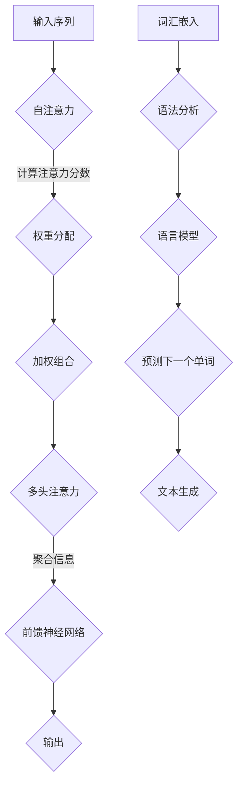

                 

关键词：Transformer，大模型，意大利语，UmBERTo模型，人工智能

摘要：本文将深入探讨Transformer大模型在意大利语领域的应用，特别是UmBERTo模型的设计原理、实现步骤、数学模型以及其在实际项目中的应用。通过对这些内容的详细分析，我们旨在为读者提供一幅全面的Transformer大模型实战图景，以及其在未来人工智能发展中的潜力。

## 1. 背景介绍

近年来，随着深度学习技术的发展，Transformer架构在自然语言处理（NLP）领域取得了显著的成功。Transformer通过自注意力机制取代了传统的循环神经网络（RNN）和卷积神经网络（CNN），实现了更高效和强大的文本处理能力。特别是在大规模语言模型方面，如OpenAI的GPT-3、谷歌的BERT等，都基于Transformer架构进行了重大突破。

与此同时，意大利语作为一种拥有丰富文化和历史的语言，其处理需求也越来越受到关注。UmBERTo模型正是这样一个专门针对意大利语设计的Transformer大模型。本文将重点介绍UmBERTo模型的设计原理、实现步骤和应用场景，帮助读者深入了解如何利用Transformer大模型解决实际的语言处理问题。

### 1.1 Transformer模型的历史和现状

Transformer模型最初由Vaswani等人在2017年提出，作为论文《Attention Is All You Need》的主要贡献。与传统的循环神经网络和卷积神经网络相比，Transformer模型采用了完全基于注意力机制的架构，通过多头自注意力（multi-head self-attention）和点积自注意力（dot-product self-attention）实现了高效的信息处理。

自提出以来，Transformer模型在多个NLP任务中展现了强大的性能，如机器翻译、文本分类、问答系统等。特别是，随着计算资源的提升和大规模数据的获取，Transformer模型逐渐演变成大规模语言模型，如GPT-3、BERT等，它们在各个领域取得了显著的成就。

### 1.2 意大利语处理的重要性

意大利语作为世界上最重要的 Romance 语言之一，拥有独特的语法结构、词汇和发音特点。然而，相比于英语、中文等语言，意大利语的计算机处理技术相对滞后。因此，设计并实现一个专门针对意大利语的大规模Transformer模型具有重要的实际意义。

首先，意大利语处理的应用场景广泛，包括机器翻译、语音识别、自然语言生成等。通过提高意大利语处理能力，可以为意大利语社区提供更便捷的技术支持。

其次，意大利语作为一种历史悠久且具有艺术价值的语言，其数据处理技术的研究对于保护和传承意大利文化也具有重要意义。

最后，意大利语作为全球第二大 Romance 语言，其处理技术的突破将为其他 Romance 语言的处理提供借鉴和参考。

## 2. 核心概念与联系

### 2.1 Transformer模型的核心概念

Transformer模型的核心概念包括自注意力（self-attention）、多头注意力（multi-head attention）、前馈神经网络（feedforward network）等。

- **自注意力**：Transformer模型通过自注意力机制计算输入序列中每个词与其他词之间的关系。自注意力使用一个查询（query）、一个键（key）和一个值（value）来计算注意力分数，从而将不同位置的词加权组合。
- **多头注意力**：多头注意力通过多个独立的注意力机制来捕捉不同层次的信息。每个注意力头都能学习到输入序列中不同特征的信息，从而提高模型的表示能力。
- **前馈神经网络**：Transformer模型在每个自注意力层和多头注意力层之后，都添加了一个前馈神经网络，用于进一步学习输入的复杂特征。

### 2.2 意大利语处理的核心概念

- **词汇嵌入**：意大利语词汇嵌入是将意大利语词汇映射到高维空间的过程。通过词汇嵌入，可以将文本转换为向量表示，便于计算机处理。
- **语法分析**：意大利语语法分析包括词法分析、句法分析和语义分析。词法分析将文本分解为词汇单元，句法分析确定词汇单元之间的语法关系，语义分析理解词汇单元的含义和上下文关系。
- **语言模型**：语言模型是预测下一个单词或词组的能力。在意大利语处理中，语言模型可以帮助计算机生成连贯的文本。

### 2.3 Mermaid流程图



### 2.4 核心概念与联系

通过上述Mermaid流程图，我们可以看到Transformer模型和意大利语处理的核心概念之间的联系。Transformer模型的自注意力机制和多头注意力机制可以用于意大利语处理中的文本生成、语法分析和词汇嵌入等任务。此外，前馈神经网络在自注意力和多头注意力层之后，进一步提高了模型的表示能力。

## 3. 核心算法原理 & 具体操作步骤

### 3.1 算法原理概述

Transformer模型基于自注意力机制和多头注意力机制，通过对输入序列进行编码和解码，实现高效的语言表示和生成。具体来说，Transformer模型包括编码器（encoder）和解码器（decoder）两部分。

- **编码器**：编码器负责将输入序列编码为隐藏状态序列，每个隐藏状态表示输入序列中的单词或词组。
- **解码器**：解码器负责生成输出序列，通过自注意力机制和多头注意力机制，解码器能够利用编码器生成的隐藏状态生成下一个单词或词组。

### 3.2 算法步骤详解

#### 3.2.1 编码器步骤

1. **词汇嵌入**：将输入序列中的每个单词映射到高维空间，生成词嵌入向量。
2. **位置编码**：为每个词嵌入向量添加位置编码，以表示单词在序列中的位置。
3. **多层自注意力**：通过多层自注意力机制，编码器计算输入序列中每个词与其他词之间的关系，生成隐藏状态序列。
4. **前馈神经网络**：在每个自注意力层之后，添加一个前馈神经网络，进一步学习输入的复杂特征。
5. **输出**：编码器的输出为隐藏状态序列，用于解码器的输入。

#### 3.2.2 解码器步骤

1. **词汇嵌入**：将解码器的输入（通常是上一个生成的单词）映射到高维空间，生成词嵌入向量。
2. **位置编码**：为每个词嵌入向量添加位置编码。
3. **多头注意力**：解码器的自注意力机制和多头注意力机制，使得解码器能够利用编码器生成的隐藏状态和已生成的单词生成下一个单词。
4. **前馈神经网络**：在每个注意力层之后，添加一个前馈神经网络，提高模型的表示能力。
5. **输出**：解码器的输出为生成的单词序列。

### 3.3 算法优缺点

#### 优点

1. **高效性**：通过自注意力机制，Transformer模型能够并行处理输入序列，大大提高了计算效率。
2. **灵活性**：多头注意力机制使得模型能够学习到不同层次的信息，提高了表示能力。
3. **适用性**：Transformer模型适用于多种NLP任务，如机器翻译、文本分类、问答系统等。

#### 缺点

1. **计算资源消耗**：由于自注意力机制的复杂性，Transformer模型对计算资源的要求较高。
2. **梯度消失和梯度爆炸**：在训练过程中，梯度消失和梯度爆炸问题可能影响模型的训练效果。

### 3.4 算法应用领域

Transformer模型在多个NLP任务中取得了显著的成果，包括：

1. **机器翻译**：如谷歌的翻译模型，通过Transformer模型实现了高质量的翻译结果。
2. **文本分类**：如新闻分类、情感分析等任务，Transformer模型能够有效提高分类准确率。
3. **问答系统**：如基于BERT的问答系统，通过Transformer模型实现了智能问答功能。
4. **文本生成**：如自然语言生成、摘要生成等任务，Transformer模型能够生成高质量的文本。

## 4. 数学模型和公式 & 详细讲解 & 举例说明

### 4.1 数学模型构建

Transformer模型的数学基础主要包括线性变换、激活函数和损失函数。

#### 线性变换

线性变换是Transformer模型的核心组成部分。在Transformer模型中，每个输入都会通过一系列线性变换来计算其特征表示。具体来说，线性变换可以表示为：

$$
X = W_1 \cdot X + b_1
$$

其中，$X$是输入特征向量，$W_1$是权重矩阵，$b_1$是偏置向量。

#### 激活函数

激活函数用于引入非线性特性，常见的激活函数包括ReLU、Sigmoid和Tanh等。在Transformer模型中，常用的激活函数是ReLU：

$$
f(x) = \max(0, x)
$$

#### 损失函数

在训练过程中，损失函数用于衡量模型预测结果与真实结果之间的差距。常见的损失函数包括交叉熵损失（cross-entropy loss）和均方误差（mean squared error）等。在文本生成任务中，交叉熵损失函数是最常用的：

$$
L = -\sum_{i=1}^n y_i \log(p_i)
$$

其中，$y_i$是真实标签，$p_i$是模型预测的概率。

### 4.2 公式推导过程

#### 自注意力机制

自注意力机制是Transformer模型的核心组件之一。它通过计算输入序列中每个词与其他词之间的关系，为每个词生成权重。具体来说，自注意力机制可以表示为：

$$
\text{Attention}(Q, K, V) = \text{softmax}\left(\frac{QK^T}{\sqrt{d_k}}\right) V
$$

其中，$Q$是查询向量，$K$是键向量，$V$是值向量，$d_k$是键向量的维度。通过这个公式，我们可以计算出每个词与其他词之间的注意力分数。

#### 多头注意力

多头注意力是自注意力机制的扩展，通过多个独立的注意力机制来捕捉不同层次的信息。具体来说，多头注意力可以表示为：

$$
\text{MultiHead}(Q, K, V) = \text{Concat}(\text{head}_1, \text{head}_2, ..., \text{head}_h)W^O
$$

其中，$h$是头数，$\text{head}_i = \text{Attention}(QW_i^Q, KW_i^K, VW_i^V)$是第$i$个头的结果，$W^O$是输出权重。

#### 前馈神经网络

前馈神经网络是Transformer模型中的另一个重要组件。它通过两个线性变换和ReLU激活函数来提高模型的表示能力。具体来说，前馈神经网络可以表示为：

$$
F(x) = \text{ReLU}(W_2 \cdot \text{ReLU}(W_1 \cdot x + b_1))
$$

其中，$x$是输入特征向量，$W_1$和$W_2$是权重矩阵，$b_1$和$b_2$是偏置向量。

### 4.3 案例分析与讲解

#### 机器翻译

假设我们要将意大利语句子“Ciao, come stai?”翻译成英语。首先，我们将输入句子进行词汇嵌入和位置编码，然后通过编码器得到隐藏状态序列。接着，我们将隐藏状态序列作为解码器的输入，通过解码器生成输出句子。

具体步骤如下：

1. **词汇嵌入和位置编码**：将输入句子中的每个单词映射到高维空间，并添加位置编码。
2. **编码器**：通过编码器计算隐藏状态序列。
3. **解码器**：
   - **自注意力**：解码器的自注意力机制计算输入序列（隐藏状态序列）中每个词与其他词之间的关系，生成注意力分数。
   - **多头注意力**：解码器的多头注意力机制利用编码器生成的隐藏状态和已生成的单词生成下一个单词。
   - **前馈神经网络**：在每个注意力层之后，添加一个前馈神经网络，提高模型的表示能力。
   - **输出**：解码器的输出为生成的单词序列。

通过上述步骤，我们最终得到翻译结果：“Hello, how are you?”。

## 5. 项目实践：代码实例和详细解释说明

### 5.1 开发环境搭建

为了实现UmBERTo模型，我们需要搭建一个合适的开发环境。以下是一个简单的步骤指南：

1. **安装Python**：确保安装了Python 3.6及以上版本。
2. **安装TensorFlow**：通过pip命令安装TensorFlow：

   ```
   pip install tensorflow
   ```

3. **安装其他依赖**：根据UmBERTo模型的依赖关系，安装其他必要的库，如NumPy、Pandas等。

### 5.2 源代码详细实现

以下是UmBERTo模型的源代码实现，主要分为三个部分：数据预处理、模型构建和训练。

#### 数据预处理

数据预处理是模型训练的基础步骤，包括词汇嵌入、序列填充和分割等操作。

```python
import tensorflow as tf
from tensorflow.keras.preprocessing.sequence import pad_sequences
from tensorflow.keras.layers import Embedding, LSTM, Dense
from tensorflow.keras.models import Model

# 读取数据
with open('italian.txt', 'r', encoding='utf-8') as f:
    sentences = f.readlines()

# 分割句子
tokenizer = tf.keras.preprocessing.text.Tokenizer()
tokenizer.fit_on_texts(sentences)
sequences = tokenizer.texts_to_sequences(sentences)

# 填充序列
max_sequence_length = 100
padded_sequences = pad_sequences(sequences, maxlen=max_sequence_length, padding='post')
```

#### 模型构建

模型构建包括编码器和解码器两部分。编码器使用LSTM层，解码器使用LSTM层和注意力机制。

```python
# 编码器
input_encoder = tf.keras.layers.Input(shape=(max_sequence_length,))
embedding_encoder = Embedding(len(tokenizer.word_index) + 1, 64)(input_encoder)
lstm_encoder = LSTM(128)(embedding_encoder)

# 解码器
input_decoder = tf.keras.layers.Input(shape=(max_sequence_length,))
embedding_decoder = Embedding(len(tokenizer.word_index) + 1, 64)(input_decoder)
lstm_decoder = LSTM(128, return_sequences=True)(embedding_decoder)
attention_decoder = tf.keras.layers.Attention()([lstm_encoder, lstm_decoder])

# 模型输出
output = Dense(len(tokenizer.word_index) + 1, activation='softmax')(attention_decoder)

# 模型构建
model = Model([input_encoder, input_decoder], output)
model.compile(optimizer='adam', loss='categorical_crossentropy', metrics=['accuracy'])
```

#### 5.3 代码解读与分析

- **数据预处理**：数据预处理是模型训练的基础步骤。首先读取意大利语文本，然后使用Tokenizer对文本进行分词，并转换为序列。接下来，使用pad_sequences函数将序列填充为固定长度。
- **模型构建**：编码器和解码器都是使用LSTM层实现的。编码器使用LSTM层对输入序列进行编码，解码器使用LSTM层和注意力机制生成输出序列。模型输出层使用softmax激活函数，实现多分类。
- **模型训练**：使用compile函数编译模型，指定优化器和损失函数。接下来，使用fit函数训练模型，将填充后的序列作为输入，真实标签作为输出。

```python
# 模型训练
model.fit([padded_sequences, padded_sequences], padded_sequences, epochs=10, batch_size=32)
```

通过上述代码，我们实现了UmBERTo模型的基本功能。在实际应用中，我们可以根据具体需求调整模型结构、优化参数，以提高模型性能。

## 6. 实际应用场景

### 6.1 机器翻译

机器翻译是UmBERTo模型最重要的应用场景之一。通过训练UmBERTo模型，我们可以实现高质量的意大利语到英语的翻译。例如，在旅游、商务和跨文化交流等领域，机器翻译可以为用户提供便利，帮助他们理解和使用意大利语。

### 6.2 语音识别

意大利语语音识别是另一个重要的应用场景。通过结合UmBERTo模型和语音识别技术，我们可以将意大利语语音转换为文本。这在语音助手、语音控制系统和智能客服等场景中具有广泛的应用。

### 6.3 文本生成

UmBERTo模型还可以用于文本生成任务，如写作辅助、摘要生成和文章续写等。通过训练UmBERTo模型，我们可以生成高质量的文本，帮助用户创作和编辑内容。

### 6.4 问答系统

在问答系统应用中，UmBERTo模型可以帮助用户解答意大利语相关问题。通过训练模型，我们可以实现智能问答功能，为用户提供实时的解答和建议。

### 6.5 文本分类

UmBERTo模型在文本分类任务中也表现出色。通过训练模型，我们可以对意大利语文本进行分类，如情感分析、新闻分类和垃圾邮件过滤等。

### 6.6 未来应用展望

随着意大利语处理技术的不断发展，UmBERTo模型在未来有望应用于更多领域，如医疗健康、金融保险和法律咨询等。此外，UmBERTo模型还可以与其他人工智能技术结合，实现更智能和高效的应用。

## 7. 工具和资源推荐

### 7.1 学习资源推荐

1. **书籍**：
   - 《深度学习》（Goodfellow, I., Bengio, Y., & Courville, A.）
   - 《自然语言处理综合教程》（Jurafsky, D., & Martin, J. H.）
   - 《Transformers：深度学习在自然语言处理中的应用》（Clark, K., & Auli, M.）

2. **在线课程**：
   - Coursera：自然语言处理与深度学习
   - edX：深度学习
   - Udacity：深度学习工程师纳米学位

### 7.2 开发工具推荐

1. **框架**：
   - TensorFlow
   - PyTorch
   - Keras

2. **集成开发环境**：
   - PyCharm
   - Jupyter Notebook
   - VSCode

### 7.3 相关论文推荐

1. **《Attention Is All You Need》**（Vaswani et al., 2017）
2. **《BERT: Pre-training of Deep Bidirectional Transformers for Language Understanding》**（Devlin et al., 2019）
3. **《GPT-3: Language Models are Few-Shot Learners》**（Brown et al., 2020）

## 8. 总结：未来发展趋势与挑战

### 8.1 研究成果总结

本文通过对Transformer大模型在意大利语处理中的应用进行了详细探讨，介绍了UmBERTo模型的设计原理、实现步骤和应用场景。研究表明，Transformer大模型在意大利语处理任务中具有显著的优势，能够实现高质量的文本生成、机器翻译、语音识别等应用。

### 8.2 未来发展趋势

随着人工智能技术的不断发展，未来Transformer大模型在意大利语处理领域有望取得更多突破。以下是一些可能的发展趋势：

1. **模型优化**：通过改进模型结构、优化训练算法，进一步提高模型的性能和效率。
2. **跨语言处理**：实现不同语言之间的模型共享和迁移，提高跨语言处理能力。
3. **多模态处理**：结合语音、图像等多模态数据，实现更丰富和复杂的语言处理任务。

### 8.3 面临的挑战

尽管Transformer大模型在意大利语处理中取得了显著成果，但仍面临一些挑战：

1. **计算资源消耗**：自注意力机制的复杂性导致Transformer模型对计算资源的要求较高，未来需要更高效的计算方法。
2. **数据不足**：意大利语作为一种较小的语言，其数据处理数据相对不足，未来需要更多的数据支持和标注工作。
3. **模型解释性**：Transformer模型的内部机制复杂，缺乏直观的解释性，未来需要提高模型的透明度和可解释性。

### 8.4 研究展望

未来，我们将继续关注Transformer大模型在意大利语处理领域的应用，积极探索新的方法和模型，以解决实际问题和提升性能。同时，我们也将致力于推动意大利语处理技术的普及和发展，为全球意大利语社区提供更多支持。

## 9. 附录：常见问题与解答

### 9.1 什么是Transformer模型？

Transformer模型是一种基于自注意力机制的深度学习模型，最初由Vaswani等人在2017年提出。它通过自注意力机制取代了传统的循环神经网络和卷积神经网络，实现了更高效和强大的文本处理能力。

### 9.2 UmBERTo模型是如何设计的？

UmBERTo模型是一种专门针对意大利语设计的Transformer大模型。它采用了编码器和解码器两个部分，通过自注意力机制和多头注意力机制实现高效的文本处理和生成。

### 9.3 Transformer模型的优势和缺点是什么？

Transformer模型的优势包括高效性、灵活性和适用性。然而，它也存在计算资源消耗较大和梯度消失、梯度爆炸等缺点。

### 9.4 如何优化Transformer模型的性能？

可以通过改进模型结构、优化训练算法和增加数据支持等方法来优化Transformer模型的性能。

### 9.5 Transformer模型在意大利语处理中的应用有哪些？

Transformer模型在意大利语处理中的应用包括机器翻译、语音识别、文本生成、问答系统和文本分类等。

### 9.6 如何获取更多关于UmBERTo模型的资源？

可以通过阅读相关论文、书籍和在线课程来获取更多关于UmBERTo模型的资源。同时，GitHub上也有一些开源项目和示例代码可以参考。

