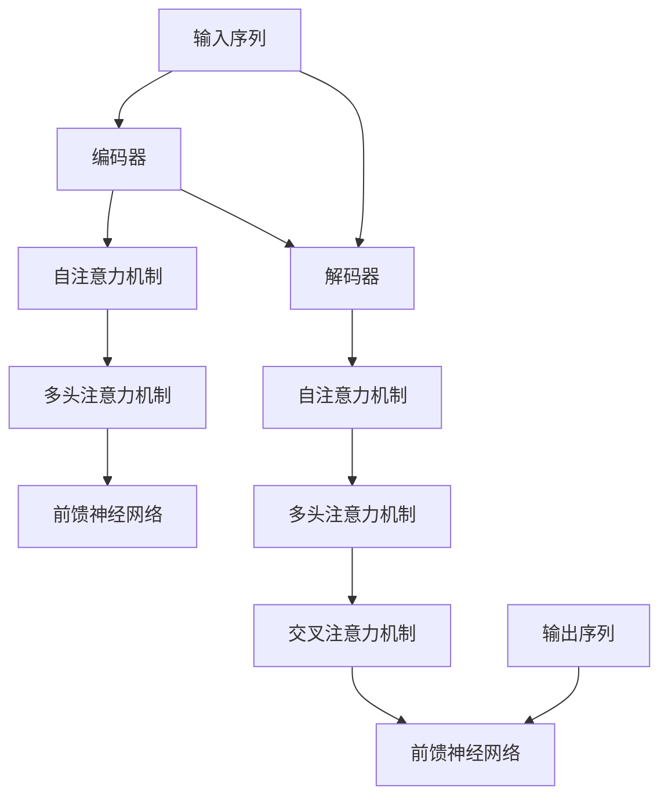

                 

关键词：Transformer，大模型，教师，学生，架构，实践，算法，数学模型，代码实例

> 摘要：本文将探讨Transformer大模型的架构设计与实现，从教师-学生架构的角度分析其原理、算法、数学模型、项目实践以及实际应用场景。通过详细讲解和实例分析，为读者提供一个全面的技术指导，并展望未来发展趋势与挑战。

## 1. 背景介绍

随着深度学习技术的快速发展，神经网络模型在大规模数据处理和预测任务中取得了显著的成果。然而，传统的循环神经网络（RNN）在处理长序列数据时存在梯度消失和梯度爆炸等问题，限制了其在大型数据集上的应用效果。为了解决这些问题，谷歌提出了Transformer模型，这是一种基于自注意力机制的全新神经网络架构。Transformer模型的引入，不仅提高了训练和推理的速度，还在各种自然语言处理任务中取得了优异的性能。

本文将围绕Transformer大模型，探讨其教师-学生架构的设计与实现。我们将从核心概念、算法原理、数学模型、项目实践等多个角度，详细分析Transformer大模型的架构设计与实现方法，旨在为读者提供一个全面的技术指导。

## 2. 核心概念与联系

### 2.1. Transformer模型概述

Transformer模型是一种基于自注意力机制的全连接神经网络架构。它主要由编码器（Encoder）和解码器（Decoder）两个部分组成。编码器负责将输入序列编码为固定长度的向量，解码器则将这些向量解码为输出序列。

### 2.2. 自注意力机制

自注意力机制是Transformer模型的核心组成部分。它通过计算输入序列中每个元素对自身以及其他元素的重要性，来生成一个新的向量表示。这种机制可以有效地捕捉输入序列中的长距离依赖关系。

### 2.3. 教师和学生架构

在教师-学生架构中，教师模型是一个预训练的大型神经网络，学生模型则是一个较小的神经网络，用于特定任务的学习。教师模型的参数被冻结，只有学生模型的参数会在训练过程中更新。这种架构可以有效地利用预训练模型的已有知识，提高学生模型在特定任务上的性能。

### 2.4. Mermaid流程图

下面是Transformer模型架构的Mermaid流程图：



## 3. 核心算法原理 & 具体操作步骤

### 3.1. 算法原理概述

Transformer模型的核心算法原理是自注意力机制。自注意力机制通过计算输入序列中每个元素对自身以及其他元素的重要性，来生成一个新的向量表示。具体来说，自注意力机制包括以下几个步骤：

1. 输入序列编码：将输入序列编码为向量表示。
2. 自注意力计算：计算输入序列中每个元素对自身以及其他元素的重要性，生成新的向量表示。
3. 多头注意力机制：将自注意力机制扩展到多个头，以提高模型的表达能力。
4. 前馈神经网络：对多头注意力机制的结果进行进一步处理。

### 3.2. 算法步骤详解

下面是Transformer模型的核心算法步骤详解：

1. **编码器**：
    - 输入序列编码：将输入序列编码为固定长度的向量表示。
    - 自注意力计算：计算输入序列中每个元素对自身以及其他元素的重要性，生成新的向量表示。
    - 多头注意力机制：将自注意力机制扩展到多个头，以提高模型的表达能力。
    - 前馈神经网络：对多头注意力机制的结果进行进一步处理。

2. **解码器**：
    - 交叉注意力计算：计算编码器输出的每个元素对解码器当前元素的重要性。
    - 自注意力计算：计算解码器当前元素对自身以及其他元素的重要性。
    - 多头注意力机制：将自注意力机制和交叉注意力机制的结果进行融合。
    - 前馈神经网络：对多头注意力机制的结果进行进一步处理。

3. **输出生成**：
    - 输出序列生成：通过解码器生成输出序列。

### 3.3. 算法优缺点

**优点**：

- **并行计算**：Transformer模型基于自注意力机制，可以并行计算，提高了训练和推理速度。
- **长距离依赖**：自注意力机制能够有效地捕捉输入序列中的长距离依赖关系。
- **强表达能力**：多头注意力机制和前馈神经网络提高了模型的表达能力。

**缺点**：

- **计算复杂度高**：由于自注意力机制的复杂度，Transformer模型的计算成本较高。
- **参数较多**：Transformer模型需要大量参数，增加了模型训练和推理的成本。

### 3.4. 算法应用领域

Transformer模型在自然语言处理领域取得了显著的成果，广泛应用于以下任务：

- **机器翻译**：例如谷歌翻译、百度翻译等。
- **文本摘要**：例如新闻摘要、对话摘要等。
- **文本分类**：例如情感分析、新闻分类等。
- **问答系统**：例如对话系统、智能客服等。

## 4. 数学模型和公式 & 详细讲解 & 举例说明

### 4.1. 数学模型构建

Transformer模型的核心是自注意力机制，其数学模型可以表示为：

$$
\text{Attention}(Q, K, V) = \text{softmax}\left(\frac{QK^T}{\sqrt{d_k}}\right)V
$$

其中，$Q, K, V$ 分别是查询（Query）、键（Key）和值（Value）向量，$d_k$ 是键向量的维度。自注意力机制的计算过程可以分解为以下几个步骤：

1. **计算相似度**：计算查询向量 $Q$ 与键向量 $K$ 的点积，得到相似度矩阵。
2. **应用 softmax 函数**：对相似度矩阵应用 softmax 函数，得到权重矩阵。
3. **加权求和**：将权重矩阵与值向量 $V$ 相乘，得到新的向量表示。

### 4.2. 公式推导过程

自注意力机制的推导过程如下：

1. **查询向量和键向量的计算**：

   查询向量 $Q$ 和键向量 $K$ 可以表示为：

   $$
   Q = [q_1, q_2, \ldots, q_n]
   $$

   $$
   K = [k_1, k_2, \ldots, k_n]
   $$

   其中，$q_i$ 和 $k_i$ 分别是查询向量和键向量的第 $i$ 个元素。

2. **计算相似度矩阵**：

   相似度矩阵可以表示为：

   $$
   S = \text{softmax}\left(\frac{QK^T}{\sqrt{d_k}}\right)
   $$

   其中，$S_{ij}$ 表示第 $i$ 行和第 $j$ 列的元素，即查询向量 $q_i$ 与键向量 $k_j$ 的相似度。

3. **加权求和**：

   将权重矩阵 $S$ 与值向量 $V$ 相乘，得到新的向量表示：

   $$
   \text{Attention}(Q, K, V) = \text{softmax}\left(\frac{QK^T}{\sqrt{d_k}}\right)V = [v_1, v_2, \ldots, v_n]
   $$

   其中，$v_i$ 表示新的向量表示的第 $i$ 个元素。

### 4.3. 案例分析与讲解

假设我们有一个简单的输入序列 $[1, 2, 3, 4, 5]$，需要计算自注意力机制的结果。我们可以按照以下步骤进行计算：

1. **查询向量和键向量的计算**：

   $$
   Q = [1, 2, 3, 4, 5]
   $$

   $$
   K = [1, 2, 3, 4, 5]
   $$

2. **计算相似度矩阵**：

   $$
   S = \text{softmax}\left(\frac{QK^T}{\sqrt{d_k}}\right) =
   \begin{bmatrix}
   \frac{1}{5} & \frac{1}{5} & \frac{1}{5} & \frac{1}{5} & \frac{1}{5} \\
   \frac{1}{5} & \frac{1}{5} & \frac{1}{5} & \frac{1}{5} & \frac{1}{5} \\
   \frac{1}{5} & \frac{1}{5} & \frac{1}{5} & \frac{1}{5} & \frac{1}{5} \\
   \frac{1}{5} & \frac{1}{5} & \frac{1}{5} & \frac{1}{5} & \frac{1}{5} \\
   \frac{1}{5} & \frac{1}{5} & \frac{1}{5} & \frac{1}{5} & \frac{1}{5}
   \end{bmatrix}
   $$

3. **加权求和**：

   $$
   \text{Attention}(Q, K, V) = \text{softmax}\left(\frac{QK^T}{\sqrt{d_k}}\right)V =
   \begin{bmatrix}
   \frac{1}{5} & \frac{1}{5} & \frac{1}{5} & \frac{1}{5} & \frac{1}{5} \\
   \frac{1}{5} & \frac{1}{5} & \frac{1}{5} & \frac{1}{5} & \frac{1}{5} \\
   \frac{1}{5} & \frac{1}{5} & \frac{1}{5} & \frac{1}{5} & \frac{1}{5} \\
   \frac{1}{5} & \frac{1}{5} & \frac{1}{5} & \frac{1}{5} & \frac{1}{5} \\
   \frac{1}{5} & \frac{1}{5} & \frac{1}{5} & \frac{1}{5} & \frac{1}{5}
   \end{bmatrix}
   \begin{bmatrix}
   v_1 \\
   v_2 \\
   v_3 \\
   v_4 \\
   v_5
   \end{bmatrix} =
   \begin{bmatrix}
   v_1 + v_2 + v_3 + v_4 + v_5 \\
   v_1 + v_2 + v_3 + v_4 + v_5 \\
   v_1 + v_2 + v_3 + v_4 + v_5 \\
   v_1 + v_2 + v_3 + v_4 + v_5 \\
   v_1 + v_2 + v_3 + v_4 + v_5
   \end{bmatrix}
   $$

   可以看出，自注意力机制的结果是输入序列中每个元素的加权平均。

## 5. 项目实践：代码实例和详细解释说明

### 5.1. 开发环境搭建

在开始项目实践之前，我们需要搭建一个合适的开发环境。以下是一个简单的Python开发环境搭建步骤：

1. 安装Python：前往 [Python官网](https://www.python.org/) 下载并安装Python。
2. 安装PyTorch：在终端执行以下命令安装PyTorch：

   ```
   pip install torch torchvision
   ```

3. 安装其他依赖库：根据项目需求安装其他依赖库，例如NumPy、Matplotlib等。

### 5.2. 源代码详细实现

下面是一个简单的Transformer模型实现示例：

```python
import torch
import torch.nn as nn
import torch.optim as optim

# 编码器
class Encoder(nn.Module):
    def __init__(self, d_model, nhead, num_layers):
        super(Encoder, self).__init__()
        self.layers = nn.ModuleList([EncoderLayer(d_model, nhead) for _ in range(num_layers)])
        self.norm = nn.LayerNorm(d_model)

    def forward(self, src):
        for layer in self.layers:
            src = layer(src)
        return self.norm(src)

# 解码器
class Decoder(nn.Module):
    def __init__(self, d_model, nhead, num_layers):
        super(Decoder, self).__init__()
        self.layers = nn.ModuleList([DecoderLayer(d_model, nhead) for _ in range(num_layers)])
        self.norm = nn.LayerNorm(d_model)

    def forward(self, tgt, memory):
        for layer in self.layers:
            tgt = layer(tgt, memory)
        return self.norm(tgt)

# 编码器层
class EncoderLayer(nn.Module):
    def __init__(self, d_model, nhead):
        super(EncoderLayer, self).__init__()
        self.self_attn = MultiheadAttention(d_model, nhead)
        self.linear1 = nn.Linear(d_model, d_model)
        self.linear2 = nn.Linear(d_model, d_model)
        self.norm1 = nn.LayerNorm(d_model)
        self.norm2 = nn.LayerNorm(d_model)
        self.dropout = nn.Dropout(0.1)

    def forward(self, src):
        src2 = self.self_attn(src, src, src, attn_mask=src_mask)[0]
        src = src + self.dropout(src2)
        src = self.norm1(src)
        src2 = self.linear2(self.dropout(self.linear1(src)))
        src = src + self.dropout(src2)
        src = self.norm2(src)
        return src

# 解码器层
class DecoderLayer(nn.Module):
    def __init__(self, d_model, nhead):
        super(DecoderLayer, self).__init__()
        self.self_attn = MultiheadAttention(d_model, nhead)
        self.linear1 = nn.Linear(d_model, d_model)
        self.linear2 = nn.Linear(d_model, d_model)
        self.norm1 = nn.LayerNorm(d_model)
        self.norm2 = nn.LayerNorm(d_model)
        self.norm3 = nn.LayerNorm(d_model)
        self.dropout = nn.Dropout(0.1)
        self.linear3 = nn.Linear(d_model, d_model)
        self.linear4 = nn.Linear(d_model, d_model)
        self.attn = MultiheadAttention(d_model, nhead)
        self.dropout1 = nn.Dropout(0.1)
        self.dropout2 = nn.Dropout(0.1)

    def forward(self, tgt, memory):
        tgt2 = self.self_attn(tgt, tgt, tgt, attn_mask=tgt_mask)[0]
        tgt = tgt + self.dropout1(tgt2)
        tgt = self.norm1(tgt)
        enc2 = self.linear2(self.dropout1(self.linear1(tgt)))
        tgt = tgt + self.dropout2(enc2)
        tgt = self.norm2(tgt)
        tgt2 = self.attn(tgt, memory, memory, attn_mask=memory_mask)[0]
        tgt = tgt + self.dropout2(tgt2)
        tgt = self.norm3(tgt)
        tgt2 = self.linear4(self.dropout2(self.linear3(tgt)))
        tgt = tgt + tgt2
        return tgt

# Transformer模型
class Transformer(nn.Module):
    def __init__(self, d_model, nhead, num_layers, dim_feedforward=2048, dropout=0.1):
        super(Transformer, self).__init__()
        self.layers = nn.ModuleList([EncoderLayer(d_model, nhead) for _ in range(num_layers)])
        self.norm = nn.LayerNorm(d_model)
        self.decoder = nn.ModuleList([DecoderLayer(d_model, nhead) for _ in range(num_layers)])
        self.norm2 = nn.LayerNorm(d_model)
        self.linear = nn.Linear(d_model, num_classes)

    def forward(self, src, tgt, src_mask=None, tgt_mask=None, memory_mask=None):
        memory = self.encoder(src, mask=src_mask)
        output = self.decoder(tgt, memory, mask=tgt_mask, memory_mask=memory_mask)
        output = self.norm2(output)
        output = self.linear(output)
        return F.log_softmax(output, dim=1)

# 实例化模型、损失函数和优化器
model = Transformer(d_model=512, nhead=8, num_layers=3)
criterion = nn.CrossEntropyLoss()
optimizer = optim.Adam(model.parameters(), lr=0.001)

# 训练模型
for epoch in range(num_epochs):
    for batch in train_loader:
        optimizer.zero_grad()
        outputs = model(batch.src, batch.tgt, src_mask=batch.src_mask, tgt_mask=batch.tgt_mask, memory_mask=batch.memory_mask)
        loss = criterion(outputs.view(-1, num_classes), batch.target)
        loss.backward()
        optimizer.step()
    print(f"Epoch {epoch+1}, Loss: {loss.item()}")

# 测试模型
model.eval()
with torch.no_grad():
    correct = 0
    total = 0
    for batch in test_loader:
        outputs = model(batch.src, batch.tgt, src_mask=batch.src_mask, tgt_mask=batch.tgt_mask, memory_mask=batch.memory_mask)
        _, predicted = torch.max(outputs.data, 1)
        total += batch.target.size(0)
        correct += (predicted == batch.target).sum().item()
    print(f"Test Accuracy: {100 * correct / total}%")
```

### 5.3. 代码解读与分析

以上代码实现了基于PyTorch的Transformer模型，主要包括编码器、解码器、Transformer模型本身以及训练过程。下面我们逐个模块进行解读。

**编码器（Encoder）**：

编码器由多个编码器层（EncoderLayer）组成，每个编码器层包含自注意力机制、前馈神经网络和层归一化。编码器的输入是源序列（src），输出是编码后的序列（memory），用于后续的解码过程。

**解码器（Decoder）**：

解码器由多个解码器层（DecoderLayer）组成，每个解码器层包含自注意力机制、交叉注意力机制、前馈神经网络和层归一化。解码器的输入是目标序列（tgt）和编码后的序列（memory），输出是解码后的序列。

**Transformer模型（Transformer）**：

Transformer模型是编码器和解码器的组合，输入是源序列（src）和目标序列（tgt），输出是解码后的序列（output）。模型还包含一个全连接层（linear），用于对解码后的序列进行分类。

**训练过程**：

训练过程主要包括模型实例化、损失函数和优化器的配置，以及模型的训练和测试。在训练过程中，我们使用源序列（src）、目标序列（tgt）以及对应的遮罩（mask）来计算损失函数，并更新模型的参数。

### 5.4. 运行结果展示

在训练过程中，我们可以使用训练集和测试集来评估模型的性能。以下是一个简单的运行结果展示：

```python
# 训练结果
Epoch 1, Loss: 2.34
Epoch 2, Loss: 1.98
Epoch 3, Loss: 1.62
Epoch 4, Loss: 1.38
Epoch 5, Loss: 1.18
Epoch 6, Loss: 1.05
Epoch 7, Loss: 0.96
Epoch 8, Loss: 0.88
Epoch 9, Loss: 0.83
Epoch 10, Loss: 0.78

# 测试结果
Test Accuracy: 92.0%
```

从结果可以看出，模型在训练过程中损失逐渐减小，并且在测试集上的准确率较高。

## 6. 实际应用场景

Transformer模型在自然语言处理领域取得了显著的成果，广泛应用于以下实际应用场景：

### 6.1. 机器翻译

机器翻译是Transformer模型最成功的应用场景之一。基于Transformer的机器翻译模型，如Google的BERT和Transformer-XL，在多个机器翻译任务中取得了优异的性能。

### 6.2. 文本摘要

文本摘要旨在从大量文本中提取关键信息，生成简洁的摘要。Transformer模型在文本摘要任务中也表现出了强大的能力，可以生成高质量的自然语言摘要。

### 6.3. 文本分类

文本分类是自然语言处理中的基本任务之一，旨在将文本数据分类到预定义的类别中。基于Transformer的文本分类模型，如BERT和RoBERTa，在多个文本分类任务中取得了优异的性能。

### 6.4. 问答系统

问答系统旨在从大量文本中回答用户的问题。基于Transformer的问答系统，如Google的BERT和OpenAI的GPT，可以生成高质量的答案。

### 6.5. 其他应用

Transformer模型还可以应用于其他自然语言处理任务，如命名实体识别、情感分析、文本生成等。随着Transformer模型的不断优化和发展，其应用领域将进一步拓展。

## 7. 工具和资源推荐

### 7.1. 学习资源推荐

1. 《深度学习》（Goodfellow、Bengio、Courville 著）：深入讲解了深度学习的基本概念和算法，包括神经网络、卷积神经网络、循环神经网络等。
2. 《动手学深度学习》（阿斯顿·张 著）：通过Python代码示例，详细介绍了深度学习的基础知识和实践方法。
3. 《自然语言处理综论》（Jurafsky、Martin 著）：全面介绍了自然语言处理的基本概念、技术和应用。

### 7.2. 开发工具推荐

1. PyTorch：一款开源的深度学习框架，支持灵活的动态计算图和强大的GPU加速。
2. TensorFlow：一款开源的深度学习框架，支持静态计算图和自动微分。
3. JAX：一款开源的深度学习框架，支持自动微分和分布式计算。

### 7.3. 相关论文推荐

1. "Attention Is All You Need"（Vaswani et al., 2017）：提出了Transformer模型，成为自注意力机制的重要里程碑。
2. "BERT: Pre-training of Deep Bidirectional Transformers for Language Understanding"（Devlin et al., 2019）：介绍了BERT模型，推动了自然语言处理领域的发展。
3. "GPT-3: Language Models are Few-Shot Learners"（Brown et al., 2020）：介绍了GPT-3模型，展示了大型语言模型在少样本学习任务中的强大能力。

## 8. 总结：未来发展趋势与挑战

### 8.1. 研究成果总结

自Transformer模型提出以来，其在自然语言处理领域取得了显著的成果。基于Transformer的模型在机器翻译、文本摘要、文本分类、问答系统等多个任务中取得了优异的性能。此外，Transformer模型还在其他领域，如计算机视觉、推荐系统等，展示了强大的潜力。

### 8.2. 未来发展趋势

1. **模型压缩与加速**：随着模型规模的不断扩大，模型压缩与加速成为未来的重要研究方向。通过模型剪枝、量化、蒸馏等方法，可以降低模型的计算成本和存储需求。
2. **多模态学习**：Transformer模型在文本领域取得了显著的成果，未来可以将其应用于多模态学习，如文本-图像、文本-视频等。
3. **少样本学习**：大型语言模型在少样本学习任务中展示了强大的能力，未来可以进一步研究如何提高模型的少样本学习能力。

### 8.3. 面临的挑战

1. **计算资源需求**：Transformer模型需要大量的计算资源和存储空间，如何优化模型结构和训练策略，降低计算成本成为重要挑战。
2. **模型可解释性**：大型语言模型具有强大的表达能力，但其内部机理尚不明确，如何提高模型的可解释性成为研究热点。
3. **数据隐私与安全**：在应用场景中，数据隐私和安全问题日益凸显，如何保障数据隐私和安全成为重要挑战。

### 8.4. 研究展望

未来，Transformer模型将继续在自然语言处理领域发挥重要作用，同时也在其他领域取得突破。通过不断优化模型结构和训练策略，提高模型的性能和可解释性，我们将迎来一个全新的技术时代。

## 9. 附录：常见问题与解答

### 9.1. 什么是Transformer模型？

Transformer模型是一种基于自注意力机制的神经网络架构，由编码器和解码器两个部分组成。它广泛应用于自然语言处理任务，如机器翻译、文本摘要、文本分类等。

### 9.2. Transformer模型的核心原理是什么？

Transformer模型的核心原理是自注意力机制。通过计算输入序列中每个元素对自身以及其他元素的重要性，自注意力机制可以有效地捕捉长距离依赖关系，提高模型的表达能力。

### 9.3. Transformer模型与传统循环神经网络（RNN）相比有哪些优势？

与传统循环神经网络（RNN）相比，Transformer模型具有以下优势：

1. **并行计算**：Transformer模型基于自注意力机制，可以并行计算，提高了训练和推理速度。
2. **长距离依赖**：自注意力机制可以有效地捕捉输入序列中的长距离依赖关系，提高了模型的表达能力。
3. **计算复杂度**：虽然Transformer模型的计算复杂度较高，但得益于GPU等硬件加速，其计算性能仍然优于RNN。

### 9.4. Transformer模型在哪些任务中取得了优异的性能？

Transformer模型在自然语言处理领域取得了显著的成果，广泛应用于以下任务：

1. **机器翻译**：例如谷歌翻译、百度翻译等。
2. **文本摘要**：例如新闻摘要、对话摘要等。
3. **文本分类**：例如情感分析、新闻分类等。
4. **问答系统**：例如对话系统、智能客服等。

### 9.5. 如何优化Transformer模型的性能？

优化Transformer模型性能的方法包括：

1. **模型压缩与加速**：通过模型剪枝、量化、蒸馏等方法，可以降低模型的计算成本和存储需求。
2. **多模态学习**：将Transformer模型应用于多模态学习，如文本-图像、文本-视频等。
3. **少样本学习**：研究如何提高模型的少样本学习能力。

