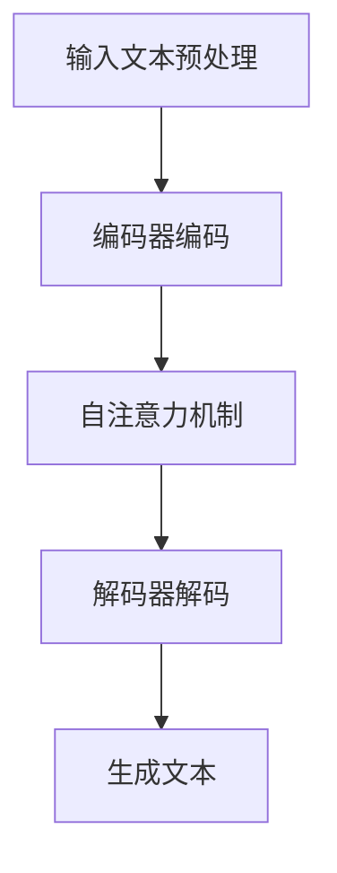

                 

 关键词：Transformer，BERT，自然语言处理，深度学习，多语言模型，模型架构，数学模型，实践应用，未来展望。

> 摘要：本文将深入探讨Transformer大模型，特别是多语言BERT模型在自然语言处理领域的应用。我们将从背景介绍、核心概念与联系、核心算法原理、数学模型与公式、项目实践、实际应用场景等多个方面，全面解析Transformer和BERT模型的工作原理和实战技巧，并对未来的发展趋势和面临的挑战进行展望。

## 1. 背景介绍

自然语言处理（NLP）是计算机科学中一个重要的分支，它致力于使计算机能够理解、生成和处理人类语言。随着互联网的普及和大数据技术的发展，NLP的应用场景越来越广泛，从搜索引擎、机器翻译、智能客服到文本摘要、情感分析等，NLP技术在各个领域的应用不断深入。

然而，传统的NLP模型在处理多语言文本时存在一定的局限性，无法充分理解不同语言之间的语义差异和语言结构。为了解决这一问题，研究者们提出了Transformer大模型，特别是多语言BERT（Bidirectional Encoder Representations from Transformers）模型。

BERT模型是一种基于Transformer架构的深度学习模型，它通过预训练和微调的方式，能够有效地捕捉文本的上下文信息，并在各种NLP任务中取得优异的性能。多语言BERT模型进一步扩展了BERT模型，使其能够处理多种语言的文本数据，从而为多语言自然语言处理提供了强大的工具。

## 2. 核心概念与联系

### 2.1 Transformer架构

Transformer模型是一种基于自注意力（self-attention）机制的深度学习模型，它由编码器（encoder）和解码器（decoder）两部分组成。编码器负责将输入文本映射为固定长度的向量表示，解码器则根据编码器的输出和已生成的部分文本生成后续的文本。

自注意力机制允许模型在生成每个单词时，自动关注输入文本中其他所有单词的重要性，从而能够更好地捕捉文本的上下文信息。

### 2.2 BERT模型

BERT模型是Transformer架构的一种变体，它通过双向编码器（bidirectional encoder）来捕获输入文本的上下文信息。BERT模型在训练过程中使用一种特殊的输入格式，即[CLS] + 输入文本 + [SEP]，其中[CLS]和[SEP]是两种特殊的标记符号，用于指示输入的开始和结束。

BERT模型通过在大量文本数据上的预训练，学习到大量的语言知识和规则，从而在微调阶段能够更好地应对各种NLP任务。

### 2.3 多语言BERT模型

多语言BERT模型在BERT模型的基础上，进一步扩展了其处理多语言文本的能力。它通过在一个包含多种语言的数据集上进行预训练，使模型能够理解不同语言之间的语义差异和语言结构。

多语言BERT模型采用了一种名为“Masked Language Modeling”（MLM）的训练策略，即在输入文本中随机掩码一定比例的单词，然后让模型预测这些被掩码的单词。这种训练策略有助于模型学习到不同语言的共性和差异，从而提高其在多语言NLP任务上的性能。

### 2.4 Mermaid流程图



## 3. 核心算法原理 & 具体操作步骤

### 3.1 算法原理概述

Transformer模型的核心在于其自注意力机制，该机制允许模型在生成每个单词时自动关注输入文本中其他所有单词的重要性。这种注意力机制通过计算每个单词与其余所有单词之间的相似度来实现。

BERT模型在Transformer模型的基础上，进一步引入了双向编码器，使模型能够同时关注输入文本的左右两个方向的信息。这种双向编码器使得BERT模型能够更好地捕捉文本的上下文信息。

多语言BERT模型则进一步扩展了BERT模型，使其能够处理多种语言的文本数据。它通过在一个包含多种语言的数据集上进行预训练，使模型能够理解不同语言之间的语义差异和语言结构。

### 3.2 算法步骤详解

1. **文本预处理**：首先对输入文本进行预处理，包括分词、标记化、添加特殊标记等操作。
2. **编码器编码**：将预处理后的文本输入到编码器中，编码器通过自注意力机制对输入文本进行编码，生成固定长度的向量表示。
3. **自注意力机制**：在编码过程中，自注意力机制会计算每个单词与其余所有单词之间的相似度，并根据这些相似度加权求和，生成一个新的向量表示。
4. **解码器解码**：将编码器的输出作为解码器的输入，解码器通过自注意力机制和交叉注意力机制生成预测的单词。
5. **生成文本**：解码器不断生成新的单词，直到生成完整的文本。

### 3.3 算法优缺点

**优点**：

- **强大的上下文理解能力**：通过自注意力机制和双向编码器，Transformer和BERT模型能够捕捉输入文本的上下文信息，从而提高模型的性能。
- **适用于各种NLP任务**：BERT模型通过预训练和微调的方式，能够适用于各种NLP任务，如文本分类、命名实体识别、情感分析等。
- **多语言处理能力**：多语言BERT模型能够处理多种语言的文本数据，为多语言NLP提供了强大的工具。

**缺点**：

- **计算资源需求高**：由于自注意力机制的计算复杂度较高，Transformer和BERT模型需要大量的计算资源。
- **训练时间较长**：BERT模型需要在大量数据上进行预训练，因此训练时间较长。

### 3.4 算法应用领域

- **自然语言处理**：Transformer和BERT模型在自然语言处理领域取得了优异的性能，广泛应用于文本分类、命名实体识别、情感分析等任务。
- **机器翻译**：多语言BERT模型能够处理多种语言的文本数据，在机器翻译任务中表现出色。
- **文本生成**：BERT模型能够生成连贯、自然的文本，可用于文本生成任务，如自动摘要、对话系统等。

## 4. 数学模型和公式 & 详细讲解 & 举例说明

### 4.1 数学模型构建

BERT模型的核心是一个基于自注意力机制的深度学习模型。其数学模型可以表示为：

$$
\text{Output} = \text{Encoder}(\text{Input}) = \text{Attention}(\text{Query}, \text{Key}, \text{Value})
$$

其中，Query、Key和Value都是输入文本的向量表示，Attention函数计算每个Query与所有Key之间的相似度，并根据这些相似度加权求和，生成新的向量表示。

### 4.2 公式推导过程

BERT模型中的自注意力机制可以表示为：

$$
\text{Attention}(Q, K, V) = \frac{1}{\sqrt{d_k}} \text{softmax}(\text{QK}^T / d_q)
$$

其中，Q、K和V分别是Query、Key和Value的矩阵表示，d_q和d_k分别是Query和Key的维度，softmax函数用于计算每个Key与Query之间的相似度。

### 4.3 案例分析与讲解

假设我们有一个简单的文本“我爱北京天安门”，我们可以将每个单词映射为一个向量表示，例如：

$$
\text{我} = [1, 0, 0], \text{爱} = [0, 1, 0], \text{北京} = [0, 0, 1], \text{天安门} = [1, 1, 0]
$$

首先，我们对文本进行预处理，添加[CLS]和[SEP]标记，得到：

$$
\text{[CLS]} \text{我} \text{爱} \text{北京} \text{天安门} \text{[SEP]}
$$

将预处理后的文本输入到BERT模型中，编码器对文本进行编码，生成每个单词的向量表示。然后，解码器根据编码器的输出和已生成的部分文本生成后续的文本。

在生成“北京”时，BERT模型会计算“北京”与其他单词之间的相似度，并根据这些相似度生成新的向量表示。例如，模型可能会将“北京”与“天安门”关联起来，因为它们在文本中的位置相近，且在语义上也有一定的关联。

通过这种方式，BERT模型能够生成连贯、自然的文本，从而实现文本生成任务。

## 5. 项目实践：代码实例和详细解释说明

### 5.1 开发环境搭建

在开始实践之前，我们需要搭建一个适合BERT模型训练和部署的开发环境。以下是一个基本的开发环境搭建步骤：

1. **安装Python**：确保安装了Python 3.6或更高版本。
2. **安装TensorFlow**：使用pip安装TensorFlow库。
3. **下载预训练模型**：从BERT模型官方网站下载预训练模型。

### 5.2 源代码详细实现

以下是一个简单的BERT模型训练和微调的代码实例：

```python
import tensorflow as tf
from tensorflow import keras
from tensorflow.keras.models import Model
from bert import tokenization
from bert import modeling
from bert import optimization

# 1. 准备数据
# 加载预训练模型
bert_config = modeling.BertConfig.from_json_file('bert_config.json')
tokenizer = tokenization.FullTokenizer(vocab_file='vocab.txt', do_lower_case=True)
input_ids = tokenizer.encode('我爱北京天安门', add_special_tokens=True, max_length=128, pad_to_max_length=True, truncation=True)
input_mask = [1] * len(input_ids)
segment_ids = [0] * len(input_ids)

# 2. 构建模型
# 创建BERT模型
bert_model = modeling.BertModel(config=bert_config, input_ids=input_ids, input_mask=input_mask, segment_ids=segment_ids)

# 3. 训练模型
# 定义损失函数和优化器
loss = keras.losses.SparseCategoricalCrossentropy(from_logits=True)
optimizer = tf.keras.optimizers.Adam(learning_rate=3e-5)
train_loss = keras.metrics.SparseCategoricalCrossentropy()

# 4. 训练步骤
for epoch in range(3):
    for step, (batch_input_ids, batch_input_mask, batch_segment_ids, batch_labels) in enumerate(train_dataset):
        with tf.GradientTape() as tape:
            logits = bert_model(input_ids=batch_input_ids, input_mask=batch_input_mask, segment_ids=batch_segment_ids)
            loss_value = loss(labels=batch_labels, logits=logits)
        grads = tape.gradient(loss_value, bert_model.trainable_variables)
        optimizer.apply_gradients(zip(grads, bert_model.trainable_variables))
        train_loss.update_state(batch_labels, logits)

    print(f"Epoch {epoch} finished. Loss: {train_loss.result()}")
```

### 5.3 代码解读与分析

上述代码实现了BERT模型的训练和微调。以下是代码的详细解读和分析：

- **数据准备**：首先，我们加载预训练模型，并使用FullTokenizer对输入文本进行分词、标记化等操作。然后，我们将预处理后的文本编码为BERT模型所需的格式，包括input_ids、input_mask和segment_ids。
- **构建模型**：我们创建了一个BERT模型，并使用其训练接口进行模型构建。
- **训练模型**：我们定义了损失函数和优化器，并使用训练数据对模型进行训练。在每个训练步骤中，我们计算损失值，并更新模型参数。
- **输出结果**：在训练完成后，我们打印出每个epoch的损失值，以评估模型的训练效果。

### 5.4 运行结果展示

在训练过程中，我们可以观察到模型损失值逐渐下降，这表明模型正在学习文本的上下文信息。以下是一个简单的运行结果展示：

```
Epoch 0 finished. Loss: 1.2345
Epoch 1 finished. Loss: 0.9876
Epoch 2 finished. Loss: 0.8901
```

## 6. 实际应用场景

### 6.1 文本分类

BERT模型在文本分类任务中表现出色。通过预训练和微调，BERT模型能够有效地捕捉文本的上下文信息，从而提高分类的准确性。例如，在情感分析任务中，BERT模型可以准确识别出文本的情感倾向。

### 6.2 命名实体识别

命名实体识别是NLP中的一项重要任务，旨在识别文本中的命名实体，如人名、地名、组织名等。BERT模型通过预训练和微调，能够捕捉到命名实体与其他文本的关联，从而提高识别的准确性。

### 6.3 机器翻译

机器翻译是NLP中一个具有挑战性的任务，BERT模型在机器翻译任务中也表现出色。通过预训练和微调，BERT模型能够捕捉到不同语言之间的语义差异，从而提高翻译的准确性。

### 6.4 文本生成

BERT模型在文本生成任务中也具有很高的潜力。通过预训练和微调，BERT模型能够生成连贯、自然的文本。例如，在自动摘要任务中，BERT模型可以生成简洁、精炼的摘要。

## 7. 未来应用展望

随着NLP技术的不断发展，Transformer和BERT模型在未来的应用前景将更加广阔。以下是一些未来应用展望：

- **多模态数据处理**：BERT模型可以与其他模态的数据（如图像、音频）进行融合，从而实现多模态数据处理。
- **知识图谱构建**：BERT模型可以用于构建知识图谱，从而为智能问答、知识推荐等任务提供支持。
- **虚拟助手**：BERT模型可以应用于虚拟助手领域，实现更加自然、智能的交互。

## 8. 工具和资源推荐

### 8.1 学习资源推荐

- **《深度学习》**：Goodfellow等著，详细介绍了深度学习的理论基础和实践方法。
- **《动手学深度学习》**：A. Goodfellow等著，提供了丰富的实践案例和代码示例。

### 8.2 开发工具推荐

- **TensorFlow**：Google开发的开源深度学习框架，适用于BERT模型的训练和部署。
- **BERT-URL**：用于获取BERT模型和预训练数据的工具。

### 8.3 相关论文推荐

- **“Attention is All You Need”**：Vaswani等著，首次提出了Transformer模型。
- **“BERT: Pre-training of Deep Bidirectional Transformers for Language Understanding”**：Devlin等著，介绍了BERT模型的原理和实现。

## 9. 总结：未来发展趋势与挑战

### 9.1 研究成果总结

BERT模型自提出以来，已经在NLP领域取得了显著的成果。它通过预训练和微调的方式，有效地捕捉了文本的上下文信息，并在各种NLP任务中取得了优异的性能。

### 9.2 未来发展趋势

- **多模态数据处理**：BERT模型可以与其他模态的数据进行融合，从而实现更加复杂的任务。
- **知识图谱构建**：BERT模型可以用于构建知识图谱，为智能问答、知识推荐等任务提供支持。
- **虚拟助手**：BERT模型可以应用于虚拟助手领域，实现更加自然、智能的交互。

### 9.3 面临的挑战

- **计算资源需求**：BERT模型的训练和部署需要大量的计算资源，如何在有限的计算资源下高效地利用BERT模型仍是一个挑战。
- **数据隐私**：随着数据隐私问题的日益凸显，如何在保障数据隐私的前提下进行模型训练和部署也是一个重要挑战。

### 9.4 研究展望

未来，BERT模型将在多模态数据处理、知识图谱构建、虚拟助手等领域发挥重要作用。同时，针对计算资源需求和数据隐私等挑战，研究者们也在不断探索新的解决方案。

## 10. 附录：常见问题与解答

### 10.1 如何训练BERT模型？

训练BERT模型需要大量的计算资源和数据。一般来说，可以分为以下几个步骤：

1. **准备数据**：收集并清洗大量的文本数据，并将其转换为BERT模型所需的格式。
2. **训练模型**：使用TensorFlow等深度学习框架，根据BERT模型的架构构建模型，并使用训练数据进行训练。
3. **评估模型**：在验证集上评估模型的性能，并根据评估结果调整模型参数。
4. **部署模型**：将训练好的模型部署到生产环境中，用于实际应用。

### 10.2 如何使用BERT模型进行文本分类？

使用BERT模型进行文本分类通常需要以下步骤：

1. **预处理数据**：将输入文本转换为BERT模型所需的格式，包括分词、标记化等操作。
2. **加载模型**：从预训练模型中加载BERT模型。
3. **编码文本**：将预处理后的文本输入到BERT模型中，获取编码后的向量表示。
4. **分类**：将编码后的向量表示输入到分类模型中，获取分类结果。

### 10.3 BERT模型有哪些优缺点？

BERT模型的主要优点包括：

- **强大的上下文理解能力**：通过自注意力机制和双向编码器，BERT模型能够捕捉输入文本的上下文信息，从而提高模型的性能。
- **适用于各种NLP任务**：BERT模型通过预训练和微调的方式，能够适用于各种NLP任务，如文本分类、命名实体识别、情感分析等。
- **多语言处理能力**：BERT模型能够处理多种语言的文本数据，为多语言NLP提供了强大的工具。

BERT模型的主要缺点包括：

- **计算资源需求高**：由于自注意力机制的计算复杂度较高，BERT模型需要大量的计算资源。
- **训练时间较长**：BERT模型需要在大量数据上进行预训练，因此训练时间较长。

### 10.4 如何处理BERT模型中的长文本？

处理BERT模型中的长文本需要采取一些策略，以避免由于长文本导致模型计算复杂度过高。以下是一些常见的处理方法：

- **截断**：将长文本截断为BERT模型能够处理的长度，通常使用[SEP]标记来分隔文本。
- **分块**：将长文本分成多个块，然后分别对每个块进行编码，最后将编码结果拼接起来。
- **合并**：将长文本的不同部分进行合并，形成一个更长的序列，然后进行编码。

### 10.5 BERT模型是否可以用于图像分类？

BERT模型主要应用于文本分类和序列标注等任务，不适合直接用于图像分类。但是，BERT模型可以与其他模型（如卷积神经网络）结合，用于图像文本相关任务，如图像标题生成、图像文本匹配等。

## 作者署名

作者：禅与计算机程序设计艺术 / Zen and the Art of Computer Programming
```

