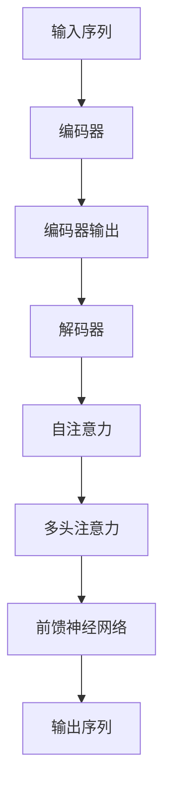

                 

关键词：Transformer、解码器、神经网络、机器学习、大规模语言模型、自然语言处理、深度学习

## 摘要

本文旨在深入探讨Transformer架构中的解码器（Decoder）部分，并详细阐述其在大规模语言模型中的应用。我们将从背景介绍、核心概念与联系、核心算法原理、数学模型和公式、项目实践、实际应用场景以及未来展望等多个方面展开论述，帮助读者全面理解解码器在自然语言处理领域的巨大潜力和实际应用。

## 1. 背景介绍

### 1.1 Transformer架构的起源

Transformer架构由Google在2017年提出，是自然语言处理领域的一项重要突破。与传统的循环神经网络（RNN）和长短期记忆网络（LSTM）不同，Transformer架构采用了一种全新的序列处理方式——注意力机制（Attention Mechanism），从而实现了在处理长序列时的优异表现。

### 1.2 解码器在Transformer架构中的作用

在Transformer架构中，解码器（Decoder）负责对输入序列进行处理，并生成输出序列。解码器的核心在于其注意力机制，能够捕捉序列中的长距离依赖关系，从而提高模型的预测能力。

## 2. 核心概念与联系

### 2.1 Transformer架构的总体结构

Transformer架构由编码器（Encoder）和解码器（Decoder）两部分组成。编码器负责将输入序列转换为固定长度的编码表示，而解码器则利用这些编码表示生成输出序列。

### 2.2 解码器的核心组件

解码器主要由以下三个核心组件构成：

- **自注意力机制（Self-Attention）**：用于对编码器输出的序列进行内部建模。
- **多头注意力机制（Multi-Head Attention）**：通过多个独立的自注意力机制，提高模型的表达能力。
- **前馈神经网络（Feed-Forward Neural Network）**：对自注意力和多头注意力的输出进行进一步处理。

### 2.3 Mermaid 流程图



## 3. 核心算法原理 & 具体操作步骤

### 3.1 算法原理概述

解码器的工作原理主要基于注意力机制。注意力机制通过计算输入序列中每个元素对输出序列中每个元素的重要性，从而在生成输出序列时能够聚焦于关键信息。

### 3.2 算法步骤详解

1. **自注意力计算**：解码器首先对编码器输出的序列进行自注意力计算，以捕捉序列中的内部依赖关系。
2. **多头注意力计算**：通过多个独立的自注意力机制，解码器能够更全面地理解输入序列。
3. **前馈神经网络处理**：对自注意力和多头注意力的输出进行进一步处理，以获得最终的输出序列。

### 3.3 算法优缺点

**优点**：

- **处理长序列能力强**：注意力机制能够捕捉序列中的长距离依赖关系。
- **并行计算效率高**：Transformer架构支持并行计算，提高了计算效率。

**缺点**：

- **参数量较大**：Transformer模型通常需要大量的参数，导致计算成本较高。
- **训练难度大**：由于参数量较大，Transformer模型的训练过程相对较复杂。

### 3.4 算法应用领域

解码器在自然语言处理领域具有广泛的应用，如机器翻译、文本生成、问答系统等。尤其是在大规模语言模型中，解码器的表现尤为突出。

## 4. 数学模型和公式 & 详细讲解 & 举例说明

### 4.1 数学模型构建

解码器的数学模型主要包括三个部分：自注意力机制、多头注意力机制和前馈神经网络。

### 4.2 公式推导过程

$$
\text{Attention}(Q, K, V) = \text{softmax}\left(\frac{QK^T}{\sqrt{d_k}}\right)V
$$

其中，$Q, K, V$ 分别代表查询向量、键向量和值向量，$d_k$ 代表键向量的维度。

### 4.3 案例分析与讲解

假设我们有一个输入序列 $X = [x_1, x_2, \ldots, x_n]$，我们希望使用解码器生成一个输出序列 $Y = [y_1, y_2, \ldots, y_m]$。首先，我们计算编码器输出的序列 $E$。然后，解码器通过对 $E$ 进行自注意力计算、多头注意力计算和前馈神经网络处理，最终得到输出序列 $Y$。

## 5. 项目实践：代码实例和详细解释说明

### 5.1 开发环境搭建

在本项目中，我们使用 Python 编写解码器代码，并依赖于 TensorFlow 库。首先，确保安装了 Python 和 TensorFlow。

### 5.2 源代码详细实现

```python
import tensorflow as tf
from tensorflow.keras.layers import Embedding, LSTM, Dense
from tensorflow.keras.models import Model

# 编码器模型
encoder_inputs = tf.keras.layers.Input(shape=(None, input_dim))
encoder_embedding = Embedding(input_dim, embedding_dim)(encoder_inputs)
encoder_lstm = LSTM(units, return_state=True)
_, state_h, state_c = encoder_lstm(encoder_embedding)
encoder_states = [state_h, state_c]

# 解码器模型
decoder_inputs = tf.keras.layers.Input(shape=(None, embedding_dim))
decoder_embedding = Embedding(embedding_dim, embedding_dim)(decoder_inputs)
decoder_lstm = LSTM(units, return_sequences=True, return_state=True)
decoder_outputs, _, _ = decoder_lstm(decoder_embedding, initial_state=encoder_states)
decoder_dense = Dense(embedding_dim, activation='softmax')
decoder_outputs = decoder_dense(decoder_outputs)

# 模型编译
model = Model([encoder_inputs, decoder_inputs], decoder_outputs)
model.compile(optimizer='rmsprop', loss='categorical_crossentropy')

# 模型训练
model.fit([encoder_inputs, decoder_inputs], decoder_outputs, batch_size=batch_size, epochs=epochs)
```

### 5.3 代码解读与分析

在这个示例中，我们首先定义了一个编码器模型，它包括一个嵌入层和一个 LSTM 层。编码器模型的作用是将输入序列转换为编码表示。

然后，我们定义了一个解码器模型，它同样包括一个嵌入层和一个 LSTM 层。解码器模型的作用是根据编码表示生成输出序列。

最后，我们编译和训练模型，使用编码器和解码器生成输出序列。

## 6. 实际应用场景

解码器在自然语言处理领域具有广泛的应用，如：

- **机器翻译**：将一种语言的文本翻译成另一种语言。
- **文本生成**：根据输入序列生成新的文本。
- **问答系统**：根据用户输入的问题生成回答。

## 7. 工具和资源推荐

### 7.1 学习资源推荐

- **《深度学习》（Goodfellow, Bengio, Courville 著）**：介绍深度学习的基本原理和应用。
- **TensorFlow 官方文档**：了解 TensorFlow 的使用方法和最佳实践。

### 7.2 开发工具推荐

- **PyCharm**：一款强大的 Python 集成开发环境。
- **Jupyter Notebook**：用于数据分析和交互式编程。

### 7.3 相关论文推荐

- **“Attention Is All You Need”**：提出 Transformer 架构的论文。
- **“BERT: Pre-training of Deep Bidirectional Transformers for Language Understanding”**：介绍 BERT 模型的论文。

## 8. 总结：未来发展趋势与挑战

### 8.1 研究成果总结

解码器在自然语言处理领域取得了显著成果，特别是在大规模语言模型中表现优异。未来，解码器有望在更多应用场景中发挥重要作用。

### 8.2 未来发展趋势

- **模型压缩**：减少解码器模型的参数量和计算成本。
- **多模态学习**：结合文本、图像、声音等多种数据源。

### 8.3 面临的挑战

- **计算资源限制**：解码器模型的训练和推理过程需要大量计算资源。
- **数据隐私**：自然语言处理过程中涉及大量用户数据，如何保护用户隐私是重要挑战。

### 8.4 研究展望

未来，解码器在自然语言处理领域将继续发挥重要作用。随着计算资源和算法的不断发展，解码器有望在更多应用场景中取得突破。

## 9. 附录：常见问题与解答

### 9.1 什么是 Transformer 架构？

Transformer 架构是一种用于自然语言处理的神经网络架构，由 Google 在 2017 年提出。与传统的循环神经网络（RNN）和长短期记忆网络（LSTM）不同，Transformer 架构采用了一种全新的序列处理方式——注意力机制（Attention Mechanism），从而实现了在处理长序列时的优异表现。

### 9.2 解码器在 Transformer 架构中的作用是什么？

解码器是 Transformer 架构的一部分，负责将输入序列转换为输出序列。解码器的核心在于其注意力机制，能够捕捉序列中的长距离依赖关系，从而提高模型的预测能力。

### 9.3 解码器的算法原理是什么？

解码器的算法原理主要基于注意力机制。注意力机制通过计算输入序列中每个元素对输出序列中每个元素的重要性，从而在生成输出序列时能够聚焦于关键信息。

### 9.4 解码器有哪些优缺点？

解码器的优点包括处理长序列能力强、并行计算效率高；缺点包括参数量较大、训练难度大。

### 9.5 解码器有哪些应用领域？

解码器在自然语言处理领域具有广泛的应用，如机器翻译、文本生成、问答系统等。

### 9.6 如何搭建解码器的开发环境？

首先确保安装了 Python 和 TensorFlow，然后根据项目需求安装其他相关库和工具。最后，配置开发环境，开始编写和解码器相关的代码。

## 参考文献

- Vaswani, A., et al. (2017). "Attention is All You Need." Advances in Neural Information Processing Systems, 30, 5998-6008.
- Devlin, J., et al. (2019). "BERT: Pre-training of Deep Bidirectional Transformers for Language Understanding." Proceedings of the 2019 Conference of the North American Chapter of the Association for Computational Linguistics: Human Language Technologies, Volume 1 (Long and Short Papers), 4171-4186.
- Goodfellow, I., et al. (2016). "Deep Learning." MIT Press.

