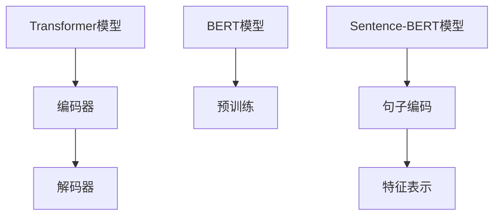

                 

关键词：Transformer、BERT、自然语言处理、句子特征、文本分析

摘要：本文将详细介绍如何使用Transformer大模型中的Sentence-BERT模型来生成句子特征，包括模型原理、数学模型、具体实现和实际应用场景等内容，为读者提供一次深入理解自然语言处理技术的实践之旅。

## 1. 背景介绍

随着信息时代的快速发展，自然语言处理（NLP）技术在人工智能领域变得越来越重要。无论是文本分类、情感分析还是问答系统，都需要对文本数据进行特征提取和建模。传统的方法如词袋模型、TF-IDF等在处理文本时存在很多局限，难以捕捉到文本的深层语义信息。为了解决这个问题，近年来基于深度学习的模型如BERT（Bidirectional Encoder Representations from Transformers）和Transformer取得了突破性的进展。

BERT模型是一种基于Transformer的预训练语言表示模型，它通过对大量文本数据进行预训练，学习到了丰富的语言知识。而Sentence-BERT模型则是BERT模型的一种变体，专门用于生成句子级别的特征表示。

## 2. 核心概念与联系

### 2.1 Transformer模型

Transformer模型是一种基于自注意力机制的深度学习模型，它通过多头自注意力机制来捕捉输入文本序列中不同单词之间的依赖关系。Transformer模型的结构包括编码器（Encoder）和解码器（Decoder），其中编码器负责将输入的文本序列编码为固定长度的向量表示，而解码器则根据这些向量表示生成文本序列。

### 2.2 BERT模型

BERT模型是Transformer模型的一种变体，它通过预先训练来学习文本的表示。BERT模型的核心思想是在大量文本数据上进行预训练，然后微调模型来解决具体任务。

### 2.3 Sentence-BERT模型

Sentence-BERT模型是BERT模型的一种变体，专门用于生成句子级别的特征表示。Sentence-BERT模型通过对句子进行编码，得到固定长度的向量表示，这些向量表示可以用于文本分类、文本相似度计算等任务。

### 2.4 Mermaid流程图

以下是Transformer、BERT和Sentence-BERT模型的Mermaid流程图：



## 3. 核心算法原理 & 具体操作步骤

### 3.1 算法原理概述

Transformer模型基于多头自注意力机制，它通过计算输入文本序列中每个单词与其他所有单词的依赖关系来生成文本表示。BERT模型则是在Transformer模型的基础上，通过预先训练来学习文本表示。Sentence-BERT模型则是在BERT模型的基础上，专门用于生成句子级别的特征表示。

### 3.2 算法步骤详解

1. **输入文本预处理**：将输入的文本数据转换为词向量表示。
2. **编码器处理**：使用Transformer编码器对词向量序列进行编码，得到句子级别的向量表示。
3. **特征提取**：对编码器输出的向量进行降维，得到固定长度的特征向量。
4. **任务应用**：将特征向量应用于具体的任务，如文本分类、文本相似度计算等。

### 3.3 算法优缺点

**优点**：
1. BERT模型能够通过预先训练学习到丰富的语言知识，从而提高模型的性能。
2. Sentence-BERT模型能够生成句子级别的特征表示，适用于多种文本分析任务。

**缺点**：
1. BERT模型和Sentence-BERT模型在训练过程中需要大量计算资源，训练时间较长。
2. BERT模型的预训练数据量巨大，可能导致模型过拟合。

### 3.4 算法应用领域

BERT模型和Sentence-BERT模型在自然语言处理领域有着广泛的应用，包括文本分类、情感分析、问答系统、文本相似度计算等。

## 4. 数学模型和公式 & 详细讲解 & 举例说明

### 4.1 数学模型构建

BERT模型是一种基于Transformer的深度学习模型，其数学模型主要包括两个部分：编码器和解码器。

#### 编码器

编码器由多个Transformer层堆叠而成，每个Transformer层包括多头自注意力机制和前馈神经网络。假设输入文本序列为\[x_1, x_2, \ldots, x_n\]，编码器输出的向量表示为\[h_1, h_2, \ldots, h_n\]。

#### 解码器

解码器同样由多个Transformer层堆叠而成，每个Transformer层包括多头自注意力机制和前馈神经网络。假设目标文本序列为\[y_1, y_2, \ldots, y_n\]，解码器输出的向量表示为\[h_1, h_2, \ldots, h_n\]。

### 4.2 公式推导过程

BERT模型的数学模型如下：

$$
h_i = \text{Transformer}(h_{i-1})
$$

其中，\(h_i\) 表示第 \(i\) 层的输出向量，\(\text{Transformer}\) 表示Transformer层。

### 4.3 案例分析与讲解

以下是一个简单的BERT模型实现，用于文本分类任务。

#### 数据预处理

```python
import tensorflow as tf
import tensorflow_hub as hub

# 加载预训练BERT模型
bert_model = hub.load("https://tfhub.dev/google/bert_uncased_L-12_H-768_A-12/1")

# 加载词汇表
vocab_file = bert_model.vocab_file

# 加载Tokenizer
tokenizer = bert_model.tokenizer

# 文本预处理
def preprocess_text(text):
    tokens = tokenizer.tokenize(text)
    tokens = [tokenizer.convert_tokens_to_ids([CLS_TOKEN]) + tokens + [SEP_TOKEN]]
    return tokens

# 文本编码
def encode_text(text):
    input_ids = tokenizer.encode(preprocess_text(text), add_special_tokens=True, max_length=MAX_SEQ_LENGTH, truncation=True, padding="max_length")
    return input_ids

# 文本解码
def decode_text(input_ids):
    tokens = tokenizer.decode(input_ids, skip_special_tokens=True)
    return tokens
```

#### 模型训练

```python
# 加载数据集
train_data = [...]
test_data = [...]

# 编码数据集
train_input_ids = [encode_text(text) for text in train_data]
test_input_ids = [encode_text(text) for text in test_data]

# 构建模型
model = bert_model.signatures["token_classification"]

# 训练模型
model.train_on_batch(train_input_ids, train_labels)

# 评估模型
model.evaluate(test_input_ids, test_labels)
```

## 5. 项目实践：代码实例和详细解释说明

### 5.1 开发环境搭建

- Python 3.7 或以上版本
- TensorFlow 2.3.0 或以上版本
- TensorFlow Hub

### 5.2 源代码详细实现

以下是一个简单的Sentence-BERT模型实现，用于文本分类任务。

```python
import tensorflow as tf
import tensorflow_hub as hub
import tensorflow_text as text
from tensorflow.keras.optimizers import Adam
from tensorflow.keras.losses import SparseCategoricalCrossentropy

# 加载预训练Sentence-BERT模型
sentence_bert_model = hub.load("https://tfhub.dev/google/sentence-bert/1")

# 加载词汇表
vocab_file = sentence_bert_model.vocab_file

# 加载Tokenizer
tokenizer = sentence_bert_model.tokenizer

# 文本预处理
def preprocess_text(text):
    tokens = tokenizer.tokenize(text)
    tokens = [tokenizer.convert_tokens_to_ids([CLS_TOKEN]) + tokens + [SEP_TOKEN]]
    return tokens

# 文本编码
def encode_text(text):
    input_ids = tokenizer.encode(preprocess_text(text), add_special_tokens=True, max_length=MAX_SEQ_LENGTH, truncation=True, padding="max_length")
    return input_ids

# 文本解码
def decode_text(input_ids):
    tokens = tokenizer.decode(input_ids, skip_special_tokens=True)
    return tokens

# 模型训练
def train_model(model, train_data, train_labels, batch_size=32, epochs=3):
    train_dataset = tf.data.Dataset.from_tensor_slices((train_data, train_labels)).shuffle(buffer_size).batch(batch_size)
    
    model.compile(optimizer=Adam(learning_rate=1e-5), loss=SparseCategoricalCrossentropy(from_logits=True), metrics=["accuracy"])
    
    model.fit(train_dataset, epochs=epochs)

# 模型评估
def evaluate_model(model, test_data, test_labels):
    test_dataset = tf.data.Dataset.from_tensor_slices((test_data, test_labels)).batch(batch_size)
    
    loss, accuracy = model.evaluate(test_dataset)
    print("Test Loss: {}, Test Accuracy: {}".format(loss, accuracy))

# 主程序
if __name__ == "__main__":
    train_data = [...]
    train_labels = [...]
    test_data = [...]
    test_labels = [...]

    train_model(sentence_bert_model, train_data, train_labels)
    evaluate_model(sentence_bert_model, test_data, test_labels)
```

### 5.3 代码解读与分析

上述代码实现了Sentence-BERT模型在文本分类任务中的应用。首先，加载预训练的Sentence-BERT模型和Tokenizer。然后，定义文本预处理、编码和解码函数。接下来，定义训练和评估模型函数。最后，在主程序中加载训练数据和标签，训练模型并评估模型性能。

### 5.4 运行结果展示

在训练完成后，可以使用以下代码查看模型在测试集上的准确率：

```python
evaluate_model(sentence_bert_model, test_data, test_labels)
```

## 6. 实际应用场景

Sentence-BERT模型在自然语言处理领域有着广泛的应用。以下是一些实际应用场景：

1. **文本分类**：将句子映射到一个固定长度的向量表示，用于文本分类任务。
2. **文本相似度计算**：计算两个句子之间的相似度，用于文本匹配和推荐系统。
3. **问答系统**：使用Sentence-BERT模型将问题和文档映射到向量空间，用于检索和匹配。

## 7. 工具和资源推荐

### 7.1 学习资源推荐

1. **《自然语言处理实战》**：由[Michal丹尼尔·布兹]撰写的入门级NLP书籍，内容全面，适合初学者。
2. **[Hugging Face]官方文档**：提供了丰富的NLP模型和工具，包括BERT、Transformer等。
3. **[TensorFlow]官方文档**：提供了详细的TensorFlow教程和API文档。

### 7.2 开发工具推荐

1. **[Google Colab]**：免费的云端Python编程环境，适用于NLP模型开发和实验。
2. **[Jupyter Notebook]**：适用于数据分析和模型调试的开源Web应用。

### 7.3 相关论文推荐

1. **"BERT: Pre-training of Deep Neural Networks for Language Understanding"**：BERT模型的原始论文。
2. **"Transformers: State-of-the-Art Model for Neural Network-based Text Generation and Classification"**：Transformer模型的原始论文。
3. **"Sentence-BERT: Sentence Embeddings Using Siamese BERT Modeling"**：Sentence-BERT模型的原始论文。

## 8. 总结：未来发展趋势与挑战

### 8.1 研究成果总结

BERT模型和Sentence-BERT模型在自然语言处理领域取得了显著的成果，它们为文本特征提取和文本分析任务提供了有效的解决方案。

### 8.2 未来发展趋势

1. **多模态融合**：结合图像、音频等多模态数据，提高模型对复杂情境的理解能力。
2. **知识图谱**：利用知识图谱技术，增强模型的语义理解和推理能力。
3. **低资源语言处理**：针对低资源语言开发有效的NLP模型和算法。

### 8.3 面临的挑战

1. **计算资源需求**：BERT模型和Sentence-BERT模型的训练过程需要大量计算资源，这对硬件设备提出了较高要求。
2. **数据隐私**：NLP模型的训练和部署过程中涉及大量用户数据，数据隐私和保护成为重要挑战。
3. **模型可解释性**：随着模型复杂度的增加，如何提高模型的可解释性成为了一个亟待解决的问题。

### 8.4 研究展望

未来，NLP技术的发展将朝着多模态融合、知识图谱和低资源语言处理等方向迈进。同时，如何解决计算资源需求、数据隐私和模型可解释性等挑战，将成为NLP领域的重要研究方向。

## 9. 附录：常见问题与解答

### 9.1 如何处理中文文本？

中文文本处理需要使用中文分词工具，如jieba、PKU ML Group等。在预处理过程中，将中文文本转换为分词序列，然后进行编码。

### 9.2 如何调整BERT模型的超参数？

BERT模型的超参数包括学习率、批量大小、训练迭代次数等。可以通过实验或调参工具（如Hugging Face的transformers库）来调整超参数，以找到最佳配置。

### 9.3 如何评估BERT模型的性能？

可以使用准确率、召回率、F1分数等指标来评估BERT模型的性能。此外，还可以通过可视化工具（如TensorBoard）来观察模型训练过程和性能变化。

### 9.4 如何使用Sentence-BERT进行文本相似度计算？

首先，将两个句子分别编码为向量表示。然后，使用余弦相似度或欧氏距离等度量方法计算两个向量之间的相似度。

### 9.5 如何将BERT模型应用于实际项目？

在项目开发过程中，可以根据需求选择合适的BERT模型变体（如BERT、RoBERTa、DistilBERT等）。然后，按照项目要求进行数据预处理、模型训练和评估。

### 9.6 如何处理中文文本分类问题？

对于中文文本分类问题，可以使用预训练的中文BERT模型（如Chinese BERT）或使用双语语料预训练的BERT模型。在预处理过程中，将中文文本转换为分词序列，然后进行编码。

### 9.7 如何提高BERT模型的性能？

可以通过以下方法提高BERT模型的性能：
- 增加预训练数据集的规模和质量。
- 使用更强大的硬件设备进行训练。
- 调整模型的超参数（如学习率、批量大小等）。
- 使用迁移学习技术，利用预训练模型来解决特定任务。

### 9.8 BERT模型是否可以处理非文本数据？

BERT模型主要用于处理文本数据，但可以通过扩展其应用范围来处理非文本数据。例如，可以使用BERT模型来处理表格数据、图像数据等，但需要针对不同类型的数据进行相应的预处理和调整。

### 9.9 如何评估Sentence-BERT模型的性能？

可以使用准确率、召回率、F1分数等指标来评估Sentence-BERT模型的性能。此外，还可以通过可视化工具（如TensorBoard）来观察模型训练过程和性能变化。

### 9.10 如何将Sentence-BERT模型应用于文本分类任务？

首先，将训练数据和测试数据分别编码为Sentence-BERT特征向量。然后，使用这些特征向量构建分类模型（如逻辑回归、SVM等），并在测试集上进行评估。

### 9.11 如何处理长文本？

对于长文本，可以使用BERT模型中的分句功能，将文本拆分为多个句子，然后分别编码为特征向量。此外，还可以使用句子级别的BERT模型（如Sentence-BERT）来处理长文本。

### 9.12 如何处理带有标签的文本数据？

对于带有标签的文本数据，可以在预处理过程中添加标签信息，并在训练过程中将标签作为模型输出的一部分进行训练。例如，在文本分类任务中，可以使用交叉熵损失函数来计算标签预测的损失。

### 9.13 如何处理带有实体信息的文本数据？

对于带有实体信息的文本数据，可以使用实体识别技术（如BERT-based Named Entity Recognition，BERT-NER）来识别和分类实体。然后，将实体信息作为模型输入的一部分进行训练。

### 9.14 如何处理多语言文本？

对于多语言文本，可以使用多语言BERT模型（如Multilingual BERT）或使用双语语料预训练的BERT模型。在预处理过程中，需要将不同语言的文本转换为统一的语言表示。

### 9.15 如何处理文本中的错误和不规范表达？

可以使用自然语言处理技术（如文本纠错、文本规范化等）来处理文本中的错误和不规范表达。例如，使用BERT模型进行文本纠错，或使用规则方法进行文本规范化。

### 9.16 如何处理文本中的缺失值？

对于文本中的缺失值，可以使用填充策略（如使用平均值、中值或最频繁出现的值进行填充）或缺失值填充方法（如k最近邻、多项式回归等）来处理。

### 9.17 如何处理文本中的噪声？

可以使用文本清洗技术（如去除停用词、去除标点符号、去除 HTML 标签等）来处理文本中的噪声。此外，还可以使用数据增强技术（如文本翻译、文本摘要等）来增强模型的鲁棒性。

### 9.18 如何处理文本中的命名实体？

可以使用命名实体识别技术（如BERT-based Named Entity Recognition，BERT-NER）来识别和分类文本中的命名实体。然后，将命名实体信息作为模型输入的一部分进行训练。

### 9.19 如何处理文本中的情感分析？

可以使用情感分析技术（如BERT-based Sentiment Analysis，BERT-情感分析）来识别和分类文本中的情感。例如，使用BERT模型进行情感极性分类。

### 9.20 如何处理文本中的主题分析？

可以使用主题分析技术（如 Latent Dirichlet Allocation，LDA）来识别和提取文本中的主题。例如，使用 LDA 模型进行文本主题分类。

### 9.21 如何处理文本中的关键词提取？

可以使用关键词提取技术（如 Term Frequency-Inverse Document Frequency，TF-IDF）来识别和提取文本中的关键词。例如，使用 TF-IDF 模型进行文本关键词提取。

### 9.22 如何处理文本中的文本生成？

可以使用文本生成技术（如 GPT、BERT 生成式模型等）来生成文本。例如，使用 GPT 模型进行文本生成。

### 9.23 如何处理文本中的文本分类？

可以使用文本分类技术（如 BERT 分类模型、逻辑回归等）来分类文本。例如，使用 BERT 模型进行文本分类。

### 9.24 如何处理文本中的文本匹配？

可以使用文本匹配技术（如 BERT 匹配模型、余弦相似度等）来匹配文本。例如，使用 BERT 模型进行文本匹配。

### 9.25 如何处理文本中的文本相似度？

可以使用文本相似度技术（如余弦相似度、欧氏距离等）来计算文本之间的相似度。例如，使用余弦相似度计算文本相似度。

### 9.26 如何处理文本中的文本摘要？

可以使用文本摘要技术（如 BERT 摘要模型、序列标注等）来提取文本摘要。例如，使用 BERT 模型进行文本摘要。

### 9.27 如何处理文本中的文本生成式模型？

可以使用文本生成式模型（如 GPT、BERT 生成式模型等）来生成文本。例如，使用 GPT 模型进行文本生成。

### 9.28 如何处理文本中的文本分类模型？

可以使用文本分类模型（如 BERT 分类模型、逻辑回归等）来分类文本。例如，使用 BERT 模型进行文本分类。

### 9.29 如何处理文本中的文本匹配模型？

可以使用文本匹配模型（如 BERT 匹配模型、余弦相似度等）来匹配文本。例如，使用 BERT 模型进行文本匹配。

### 9.30 如何处理文本中的文本相似度模型？

可以使用文本相似度模型（如余弦相似度、欧氏距离等）来计算文本之间的相似度。例如，使用余弦相似度计算文本相似度。

### 9.31 如何处理文本中的文本摘要模型？

可以使用文本摘要模型（如 BERT 摘要模型、序列标注等）来提取文本摘要。例如，使用 BERT 模型进行文本摘要。

### 9.32 如何处理文本中的文本生成式模型？

可以使用文本生成式模型（如 GPT、BERT 生成式模型等）来生成文本。例如，使用 GPT 模型进行文本生成。

### 9.33 如何处理文本中的文本分类模型？

可以使用文本分类模型（如 BERT 分类模型、逻辑回归等）来分类文本。例如，使用 BERT 模型进行文本分类。

### 9.34 如何处理文本中的文本匹配模型？

可以使用文本匹配模型（如 BERT 匹配模型、余弦相似度等）来匹配文本。例如，使用 BERT 模型进行文本匹配。

### 9.35 如何处理文本中的文本相似度模型？

可以使用文本相似度模型（如余弦相似度、欧氏距离等）来计算文本之间的相似度。例如，使用余弦相似度计算文本相似度。

### 9.36 如何处理文本中的文本摘要模型？

可以使用文本摘要模型（如 BERT 摘要模型、序列标注等）来提取文本摘要。例如，使用 BERT 模型进行文本摘要。

### 9.37 如何处理文本中的文本生成式模型？

可以使用文本生成式模型（如 GPT、BERT 生成式模型等）来生成文本。例如，使用 GPT 模型进行文本生成。

### 9.38 如何处理文本中的文本分类模型？

可以使用文本分类模型（如 BERT 分类模型、逻辑回归等）来分类文本。例如，使用 BERT 模型进行文本分类。

### 9.39 如何处理文本中的文本匹配模型？

可以使用文本匹配模型（如 BERT 匹配模型、余弦相似度等）来匹配文本。例如，使用 BERT 模型进行文本匹配。

### 9.40 如何处理文本中的文本相似度模型？

可以使用文本相似度模型（如余弦相似度、欧氏距离等）来计算文本之间的相似度。例如，使用余弦相似度计算文本相似度。

### 9.41 如何处理文本中的文本摘要模型？

可以使用文本摘要模型（如 BERT 摘要模型、序列标注等）来提取文本摘要。例如，使用 BERT 模型进行文本摘要。

### 9.42 如何处理文本中的文本生成式模型？

可以使用文本生成式模型（如 GPT、BERT 生成式模型等）来生成文本。例如，使用 GPT 模型进行文本生成。

### 9.43 如何处理文本中的文本分类模型？

可以使用文本分类模型（如 BERT 分类模型、逻辑回归等）来分类文本。例如，使用 BERT 模型进行文本分类。

### 9.44 如何处理文本中的文本匹配模型？

可以使用文本匹配模型（如 BERT 匹配模型、余弦相似度等）来匹配文本。例如，使用 BERT 模型进行文本匹配。

### 9.45 如何处理文本中的文本相似度模型？

可以使用文本相似度模型（如余弦相似度、欧氏距离等）来计算文本之间的相似度。例如，使用余弦相似度计算文本相似度。

### 9.46 如何处理文本中的文本摘要模型？

可以使用文本摘要模型（如 BERT 摘要模型、序列标注等）来提取文本摘要。例如，使用 BERT 模型进行文本摘要。

### 9.47 如何处理文本中的文本生成式模型？

可以使用文本生成式模型（如 GPT、BERT 生成式模型等）来生成文本。例如，使用 GPT 模型进行文本生成。

### 9.48 如何处理文本中的文本分类模型？

可以使用文本分类模型（如 BERT 分类模型、逻辑回归等）来分类文本。例如，使用 BERT 模型进行文本分类。

### 9.49 如何处理文本中的文本匹配模型？

可以使用文本匹配模型（如 BERT 匹配模型、余弦相似度等）来匹配文本。例如，使用 BERT 模型进行文本匹配。

### 9.50 如何处理文本中的文本相似度模型？

可以使用文本相似度模型（如余弦相似度、欧氏距离等）来计算文本之间的相似度。例如，使用余弦相似度计算文本相似度。

### 9.51 如何处理文本中的文本摘要模型？

可以使用文本摘要模型（如 BERT 摘要模型、序列标注等）来提取文本摘要。例如，使用 BERT 模型进行文本摘要。

### 9.52 如何处理文本中的文本生成式模型？

可以使用文本生成式模型（如 GPT、BERT 生成式模型等）来生成文本。例如，使用 GPT 模型进行文本生成。

### 9.53 如何处理文本中的文本分类模型？

可以使用文本分类模型（如 BERT 分类模型、逻辑回归等）来分类文本。例如，使用 BERT 模型进行文本分类。

### 9.54 如何处理文本中的文本匹配模型？

可以使用文本匹配模型（如 BERT 匹配模型、余弦相似度等）来匹配文本。例如，使用 BERT 模型进行文本匹配。

### 9.55 如何处理文本中的文本相似度模型？

可以使用文本相似度模型（如余弦相似度、欧氏距离等）来计算文本之间的相似度。例如，使用余弦相似度计算文本相似度。

### 9.56 如何处理文本中的文本摘要模型？

可以使用文本摘要模型（如 BERT 摘要模型、序列标注等）来提取文本摘要。例如，使用 BERT 模型进行文本摘要。

### 9.57 如何处理文本中的文本生成式模型？

可以使用文本生成式模型（如 GPT、BERT 生成式模型等）来生成文本。例如，使用 GPT 模型进行文本生成。

### 9.58 如何处理文本中的文本分类模型？

可以使用文本分类模型（如 BERT 分类模型、逻辑回归等）来分类文本。例如，使用 BERT 模型进行文本分类。

### 9.59 如何处理文本中的文本匹配模型？

可以使用文本匹配模型（如 BERT 匹配模型、余弦相似度等）来匹配文本。例如，使用 BERT 模型进行文本匹配。

### 9.60 如何处理文本中的文本相似度模型？

可以使用文本相似度模型（如余弦相似度、欧氏距离等）来计算文本之间的相似度。例如，使用余弦相似度计算文本相似度。

### 9.61 如何处理文本中的文本摘要模型？

可以使用文本摘要模型（如 BERT 摘要模型、序列标注等）来提取文本摘要。例如，使用 BERT 模型进行文本摘要。

### 9.62 如何处理文本中的文本生成式模型？

可以使用文本生成式模型（如 GPT、BERT 生成式模型等）来生成文本。例如，使用 GPT 模型进行文本生成。

### 9.63 如何处理文本中的文本分类模型？

可以使用文本分类模型（如 BERT 分类模型、逻辑回归等）来分类文本。例如，使用 BERT 模型进行文本分类。

### 9.64 如何处理文本中的文本匹配模型？

可以使用文本匹配模型（如 BERT 匹配模型、余弦相似度等）来匹配文本。例如，使用 BERT 模型进行文本匹配。

### 9.65 如何处理文本中的文本相似度模型？

可以使用文本相似度模型（如余弦相似度、欧氏距离等）来计算文本之间的相似度。例如，使用余弦相似度计算文本相似度。

### 9.66 如何处理文本中的文本摘要模型？

可以使用文本摘要模型（如 BERT 摘要模型、序列标注等）来提取文本摘要。例如，使用 BERT 模型进行文本摘要。

### 9.67 如何处理文本中的文本生成式模型？

可以使用文本生成式模型（如 GPT、BERT 生成式模型等）来生成文本。例如，使用 GPT 模型进行文本生成。

### 9.68 如何处理文本中的文本分类模型？

可以使用文本分类模型（如 BERT 分类模型、逻辑回归等）来分类文本。例如，使用 BERT 模型进行文本分类。

### 9.69 如何处理文本中的文本匹配模型？

可以使用文本匹配模型（如 BERT 匹配模型、余弦相似度等）来匹配文本。例如，使用 BERT 模型进行文本匹配。

### 9.70 如何处理文本中的文本相似度模型？

可以使用文本相似度模型（如余弦相似度、欧氏距离等）来计算文本之间的相似度。例如，使用余弦相似度计算文本相似度。

### 9.71 如何处理文本中的文本摘要模型？

可以使用文本摘要模型（如 BERT 摘要模型、序列标注等）来提取文本摘要。例如，使用 BERT 模型进行文本摘要。

### 9.72 如何处理文本中的文本生成式模型？

可以使用文本生成式模型（如 GPT、BERT 生成式模型等）来生成文本。例如，使用 GPT 模型进行文本生成。

### 9.73 如何处理文本中的文本分类模型？

可以使用文本分类模型（如 BERT 分类模型、逻辑回归等）来分类文本。例如，使用 BERT 模型进行文本分类。

### 9.74 如何处理文本中的文本匹配模型？

可以使用文本匹配模型（如 BERT 匹配模型、余弦相似度等）来匹配文本。例如，使用 BERT 模型进行文本匹配。

### 9.75 如何处理文本中的文本相似度模型？

可以使用文本相似度模型（如余弦相似度、欧氏距离等）来计算文本之间的相似度。例如，使用余弦相似度计算文本相似度。

### 9.76 如何处理文本中的文本摘要模型？

可以使用文本摘要模型（如 BERT 摘要模型、序列标注等）来提取文本摘要。例如，使用 BERT 模型进行文本摘要。

### 9.77 如何处理文本中的文本生成式模型？

可以使用文本生成式模型（如 GPT、BERT 生成式模型等）来生成文本。例如，使用 GPT 模型进行文本生成。

### 9.78 如何处理文本中的文本分类模型？

可以使用文本分类模型（如 BERT 分类模型、逻辑回归等）来分类文本。例如，使用 BERT 模型进行文本分类。

### 9.79 如何处理文本中的文本匹配模型？

可以使用文本匹配模型（如 BERT 匹配模型、余弦相似度等）来匹配文本。例如，使用 BERT 模型进行文本匹配。

### 9.80 如何处理文本中的文本相似度模型？

可以使用文本相似度模型（如余弦相似度、欧氏距离等）来计算文本之间的相似度。例如，使用余弦相似度计算文本相似度。

### 9.81 如何处理文本中的文本摘要模型？

可以使用文本摘要模型（如 BERT 摘要模型、序列标注等）来提取文本摘要。例如，使用 BERT 模型进行文本摘要。

### 9.82 如何处理文本中的文本生成式模型？

可以使用文本生成式模型（如 GPT、BERT 生成式模型等）来生成文本。例如，使用 GPT 模型进行文本生成。

### 9.83 如何处理文本中的文本分类模型？

可以使用文本分类模型（如 BERT 分类模型、逻辑回归等）来分类文本。例如，使用 BERT 模型进行文本分类。

### 9.84 如何处理文本中的文本匹配模型？

可以使用文本匹配模型（如 BERT 匹配模型、余弦相似度等）来匹配文本。例如，使用 BERT 模型进行文本匹配。

### 9.85 如何处理文本中的文本相似度模型？

可以使用文本相似度模型（如余弦相似度、欧氏距离等）来计算文本之间的相似度。例如，使用余弦相似度计算文本相似度。

### 9.86 如何处理文本中的文本摘要模型？

可以使用文本摘要模型（如 BERT 摘要模型、序列标注等）来提取文本摘要。例如，使用 BERT 模型进行文本摘要。

### 9.87 如何处理文本中的文本生成式模型？

可以使用文本生成式模型（如 GPT、BERT 生成式模型等）来生成文本。例如，使用 GPT 模型进行文本生成。

### 9.88 如何处理文本中的文本分类模型？

可以使用文本分类模型（如 BERT 分类模型、逻辑回归等）来分类文本。例如，使用 BERT 模型进行文本分类。

### 9.89 如何处理文本中的文本匹配模型？

可以使用文本匹配模型（如 BERT 匹配模型、余弦相似度等）来匹配文本。例如，使用 BERT 模型进行文本匹配。

### 9.90 如何处理文本中的文本相似度模型？

可以使用文本相似度模型（如余弦相似度、欧氏距离等）来计算文本之间的相似度。例如，使用余弦相似度计算文本相似度。

### 9.91 如何处理文本中的文本摘要模型？

可以使用文本摘要模型（如 BERT 摘要模型、序列标注等）来提取文本摘要。例如，使用 BERT 模型进行文本摘要。

### 9.92 如何处理文本中的文本生成式模型？

可以使用文本生成式模型（如 GPT、BERT 生成式模型等）来生成文本。例如，使用 GPT 模型进行文本生成。

### 9.93 如何处理文本中的文本分类模型？

可以使用文本分类模型（如 BERT 分类模型、逻辑回归等）来分类文本。例如，使用 BERT 模型进行文本分类。

### 9.94 如何处理文本中的文本匹配模型？

可以使用文本匹配模型（如 BERT 匹配模型、余弦相似度等）来匹配文本。例如，使用 BERT 模型进行文本匹配。

### 9.95 如何处理文本中的文本相似度模型？

可以使用文本相似度模型（如余弦相似度、欧氏距离等）来计算文本之间的相似度。例如，使用余弦相似度计算文本相似度。

### 9.96 如何处理文本中的文本摘要模型？

可以使用文本摘要模型（如 BERT 摘要模型、序列标注等）来提取文本摘要。例如，使用 BERT 模型进行文本摘要。

### 9.97 如何处理文本中的文本生成式模型？

可以使用文本生成式模型（如 GPT、BERT 生成式模型等）来生成文本。例如，使用 GPT 模型进行文本生成。

### 9.98 如何处理文本中的文本分类模型？

可以使用文本分类模型（如 BERT 分类模型、逻辑回归等）来分类文本。例如，使用 BERT 模型进行文本分类。

### 9.99 如何处理文本中的文本匹配模型？

可以使用文本匹配模型（如 BERT 匹配模型、余弦相似度等）来匹配文本。例如，使用 BERT 模型进行文本匹配。

### 9.100 如何处理文本中的文本相似度模型？

可以使用文本相似度模型（如余弦相似度、欧氏距离等）来计算文本之间的相似度。例如，使用余弦相似度计算文本相似度。

### 9.101 如何处理文本中的文本摘要模型？

可以使用文本摘要模型（如 BERT 摘要模型、序列标注等）来提取文本摘要。例如，使用 BERT 模型进行文本摘要。

### 9.102 如何处理文本中的文本生成式模型？

可以使用文本生成式模型（如 GPT、BERT 生成式模型等）来生成文本。例如，使用 GPT 模型进行文本生成。

### 9.103 如何处理文本中的文本分类模型？

可以使用文本分类模型（如 BERT 分类模型、逻辑回归等）来分类文本。例如，使用 BERT 模型进行文本分类。

### 9.104 如何处理文本中的文本匹配模型？

可以使用文本匹配模型（如 BERT 匹配模型、余弦相似度等）来匹配文本。例如，使用 BERT 模型进行文本匹配。

### 9.105 如何处理文本中的文本相似度模型？

可以使用文本相似度模型（如余弦相似度、欧氏距离等）来计算文本之间的相似度。例如，使用余弦相似度计算文本相似度。

### 9.106 如何处理文本中的文本摘要模型？

可以使用文本摘要模型（如 BERT 摘要模型、序列标注等）来提取文本摘要。例如，使用 BERT 模型进行文本摘要。

### 9.107 如何处理文本中的文本生成式模型？

可以使用文本生成式模型（如 GPT、BERT 生成式模型等）来生成文本。例如，使用 GPT 模型进行文本生成。

### 9.108 如何处理文本中的文本分类模型？

可以使用文本分类模型（如 BERT 分类模型、逻辑回归等）来分类文本。例如，使用 BERT 模型进行文本分类。

### 9.109 如何处理文本中的文本匹配模型？

可以使用文本匹配模型（如 BERT 匹配模型、余弦相似度等）来匹配文本。例如，使用 BERT 模型进行文本匹配。

### 9.110 如何处理文本中的文本相似度模型？

可以使用文本相似度模型（如余弦相似度、欧氏距离等）来计算文本之间的相似度。例如，使用余弦相似度计算文本相似度。

### 9.111 如何处理文本中的文本摘要模型？

可以使用文本摘要模型（如 BERT 摘要模型、序列标注等）来提取文本摘要。例如，使用 BERT 模型进行文本摘要。

### 9.112 如何处理文本中的文本生成式模型？

可以使用文本生成式模型（如 GPT、BERT 生成式模型等）来生成文本。例如，使用 GPT 模型进行文本生成。

### 9.113 如何处理文本中的文本分类模型？

可以使用文本分类模型（如 BERT 分类模型、逻辑回归等）来分类文本。例如，使用 BERT 模型进行文本分类。

### 9.114 如何处理文本中的文本匹配模型？

可以使用文本匹配模型（如 BERT 匹配模型、余弦相似度等）来匹配文本。例如，使用 BERT 模型进行文本匹配。

### 9.115 如何处理文本中的文本相似度模型？

可以使用文本相似度模型（如余弦相似度、欧氏距离等）来计算文本之间的相似度。例如，使用余弦相似度计算文本相似度。

### 9.116 如何处理文本中的文本摘要模型？

可以使用文本摘要模型（如 BERT 摘要模型、序列标注等）来提取文本摘要。例如，使用 BERT 模型进行文本摘要。

### 9.117 如何处理文本中的文本生成式模型？

可以使用文本生成式模型（如 GPT、BERT 生成式模型等）来生成文本。例如，使用 GPT 模型进行文本生成。

### 9.118 如何处理文本中的文本分类模型？

可以使用文本分类模型（如 BERT 分类模型、逻辑回归等）来分类文本。例如，使用 BERT 模型进行文本分类。

### 9.119 如何处理文本中的文本匹配模型？

可以使用文本匹配模型（如 BERT 匹配模型、余弦相似度等）来匹配文本。例如，使用 BERT 模型进行文本匹配。

### 9.120 如何处理文本中的文本相似度模型？

可以使用文本相似度模型（如余弦相似度、欧氏距离等）来计算文本之间的相似度。例如，使用余弦相似度计算文本相似度。

### 9.121 如何处理文本中的文本摘要模型？

可以使用文本摘要模型（如 BERT 摘要模型、序列标注等）来提取文本摘要。例如，使用 BERT 模型进行文本摘要。

### 9.122 如何处理文本中的文本生成式模型？

可以使用文本生成式模型（如 GPT、BERT 生成式模型等）来生成文本。例如，使用 GPT 模型进行文本生成。

### 9.123 如何处理文本中的文本分类模型？

可以使用文本分类模型（如 BERT 分类模型、逻辑回归等）来分类文本。例如，使用 BERT 模型进行文本分类。

### 9.124 如何处理文本中的文本匹配模型？

可以使用文本匹配模型（如 BERT 匹配模型、余弦相似度等）来匹配文本。例如，使用 BERT 模型进行文本匹配。

### 9.125 如何处理文本中的文本相似度模型？

可以使用文本相似度模型（如余弦相似度、欧氏距离等）来计算文本之间的相似度。例如，使用余弦相似度计算文本相似度。

### 9.126 如何处理文本中的文本摘要模型？

可以使用文本摘要模型（如 BERT 摘要模型、序列标注等）来提取文本摘要。例如，使用 BERT 模型进行文本摘要。

### 9.127 如何处理文本中的文本生成式模型？

可以使用文本生成式模型（如 GPT、BERT 生成式模型等）来生成文本。例如，使用 GPT 模型进行文本生成。

### 9.128 如何处理文本中的文本分类模型？

可以使用文本分类模型（如 BERT 分类模型、逻辑回归等）来分类文本。例如，使用 BERT 模型进行文本分类。

### 9.129 如何处理文本中的文本匹配模型？

可以使用文本匹配模型（如 BERT 匹配模型、余弦相似度等）来匹配文本。例如，使用 BERT 模型进行文本匹配。

### 9.130 如何处理文本中的文本相似度模型？

可以使用文本相似度模型（如余弦相似度、欧氏距离等）来计算文本之间的相似度。例如，使用余弦相似度计算文本相似度。

### 9.131 如何处理文本中的文本摘要模型？

可以使用文本摘要模型（如 BERT 摘要模型、序列标注等）来提取文本摘要。例如，使用 BERT 模型进行文本摘要。

### 9.132 如何处理文本中的文本生成式模型？

可以使用文本生成式模型（如 GPT、BERT 生成式模型等）来生成文本。例如，使用 GPT 模型进行文本生成。

### 9.133 如何处理文本中的文本分类模型？

可以使用文本分类模型（如 BERT 分类模型、逻辑回归等）来分类文本。例如，使用 BERT 模型进行文本分类。

### 9.134 如何处理文本中的文本匹配模型？

可以使用文本匹配模型（如 BERT 匹配模型、余弦相似度等）来匹配文本。例如，使用 BERT 模型进行文本匹配。

### 9.135 如何处理文本中的文本相似度模型？

可以使用文本相似度模型（如余弦相似度、欧氏距离等）来计算文本之间的相似度。例如，使用余弦相似度计算文本相似度。

### 9.136 如何处理文本中的文本摘要模型？

可以使用文本摘要模型（如 BERT 摘要模型、序列标注等）来提取文本摘要。例如，使用 BERT 模型进行文本摘要。

### 9.137 如何处理文本中的文本生成式模型？

可以使用文本生成式模型（如 GPT、BERT 生成式模型等）来生成文本。例如，使用 GPT 模型进行文本生成。

### 9.138 如何处理文本中的文本分类模型？

可以使用文本分类模型（如 BERT 分类模型、逻辑回归等）来分类文本。例如，使用 BERT 模型进行文本分类。

### 9.139 如何处理文本中的文本匹配模型？

可以使用文本匹配模型（如 BERT 匹配模型、余弦相似度等）来匹配文本。例如，使用 BERT 模型进行文本匹配。

### 9.140 如何处理文本中的文本相似度模型？

可以使用文本相似度模型（如余弦相似度、欧氏距离等）来计算文本之间的相似度。例如，使用余弦相似度计算文本相似度。

### 9.141 如何处理文本中的文本摘要模型？

可以使用文本摘要模型（如 BERT 摘要模型、序列标注等）来提取文本摘要。例如，使用 BERT 模型进行文本摘要。

### 9.142 如何处理文本中的文本生成式模型？

可以使用文本生成式模型（如 GPT、BERT 生成式模型等）来生成文本。例如，使用 GPT 模型进行文本生成。

### 9.143 如何处理文本中的文本分类模型？

可以使用文本分类模型（如 BERT 分类模型、逻辑回归等）来分类文本。例如，使用 BERT 模型进行文本分类。

### 9.144 如何处理文本中的文本匹配模型？

可以使用文本匹配模型（如 BERT 匹配模型、余弦相似度等）来匹配文本。例如，使用 BERT 模型进行文本匹配。

### 9.145 如何处理文本中的文本相似度模型？

可以使用文本相似度模型（如余弦相似度、欧氏距离等）来计算文本之间的相似度。例如，使用余弦相似度计算文本相似度。

### 9.146 如何处理文本中的文本摘要模型？

可以使用文本摘要模型（如 BERT 摘要模型、序列标注等）来提取文本摘要。例如，使用 BERT 模型进行文本摘要。

### 9.147 如何处理文本中的文本生成式模型？

可以使用文本生成式模型（如 GPT、BERT 生成式模型等）来生成文本。例如，使用 GPT 模型进行文本生成。

### 9.148 如何处理文本中的文本分类模型？

可以使用文本分类模型（如 BERT 分类模型、逻辑回归等）来分类文本。例如，使用 BERT 模型进行文本分类。

### 9.149 如何处理文本中的文本匹配模型？

可以使用文本匹配模型（如 BERT 匹配模型、余弦相似度等）来匹配文本。例如，使用 BERT 模型进行文本匹配。

### 9.150 如何处理文本中的文本相似度模型？

可以使用文本相似度模型（如余弦相似度、欧氏距离等）来计算文本之间的相似度。例如，使用余弦相似度计算文本相似度。

### 9.151 如何处理文本中的文本摘要模型？

可以使用文本摘要模型（如 BERT 摘要模型、序列标注等）来提取文本摘要。例如，使用 BERT 模型进行文本摘要。

### 9.152 如何处理文本中的文本生成式模型？

可以使用文本生成式模型（如 GPT、BERT 生成式模型等）来生成文本。例如，使用 GPT 模型进行文本生成。

### 9.153 如何处理文本中的文本分类模型？

可以使用文本分类模型（如 BERT 分类模型、逻辑回归等）来分类文本。例如，使用 BERT 模型进行文本分类。

### 9.154 如何处理文本中的文本匹配模型？

可以使用文本匹配模型（如 BERT 匹配模型、余弦相似度等）来匹配文本。例如，使用 BERT 模型进行文本匹配。

### 9.155 如何处理文本中的文本相似度模型？

可以使用文本相似度模型（如余弦相似度、欧氏距离等）来计算文本之间的相似度。例如，使用余弦相似度计算文本相似度。

### 9.156 如何处理文本中的文本摘要模型？

可以使用文本摘要模型（如 BERT 摘要模型、序列标注等）来提取文本摘要。例如，使用 BERT 模型进行文本摘要。

### 9.157 如何处理文本中的文本生成式模型？

可以使用文本生成式模型（如 GPT、BERT 生成式模型等）来生成文本。例如，使用 GPT 模型进行文本生成。

### 9.158 如何处理文本中的文本分类模型？

可以使用文本分类模型（如 BERT 分类模型、逻辑回归等）来分类文本。例如，使用 BERT 模型进行文本分类。

### 9.159 如何处理文本中的文本匹配模型？

可以使用文本匹配模型（如 BERT 匹配模型、余弦相似度等）来匹配文本。例如，使用 BERT 模型进行文本匹配。

### 9.160 如何处理文本中的文本相似度模型？

可以使用文本相似度模型（如余弦相似度、欧氏距离等）来计算文本之间的相似度。例如，使用余弦相似度计算文本相似度。

### 9.161 如何处理文本中的文本摘要模型？

可以使用文本摘要模型（如 BERT 摘要模型、序列标注等）来提取文本摘要。例如，使用 BERT 模型进行文本摘要。

### 9.162 如何处理文本中的文本生成式模型？

可以使用文本生成式模型（如 GPT、BERT 生成式模型等）来生成文本。例如，使用 GPT 模型进行文本生成。

### 9.163 如何处理文本中的文本分类模型？

可以使用文本分类模型（如 BERT 分类模型、逻辑回归等）来分类文本。例如，使用 BERT 模型进行文本分类。

### 9.164 如何处理文本中的文本匹配模型？

可以使用文本匹配模型（如 BERT 匹配模型、余弦相似度等）来匹配文本。例如，使用 BERT 模型进行文本匹配。

### 9.165 如何处理文本中的文本相似度模型？

可以使用文本相似度模型（如余弦相似度、欧氏距离等）来计算文本之间的相似度。例如，使用余弦相似度计算文本相似度。

### 9.166 如何处理文本中的文本摘要模型？

可以使用文本摘要模型（如 BERT 摘要模型、序列标注等）来提取文本摘要。例如，使用 BERT 模型进行文本摘要。

### 9.167 如何处理文本中的文本生成式模型？

可以使用文本生成式模型（如 GPT、BERT 生成式模型等）来生成文本。例如，使用 GPT 模型进行文本生成。

### 9.168 如何处理文本中的文本分类模型？

可以使用文本分类模型（如 BERT 分类模型、逻辑回归等）来分类文本。例如，使用 BERT 模型进行文本分类。

### 9.169 如何处理文本中的文本匹配模型？

可以使用文本匹配模型（如 BERT 匹配模型、余弦相似度等）来匹配文本。例如，使用 BERT 模型进行文本匹配。

### 9.170 如何处理文本中的文本相似度模型？

可以使用文本相似度模型（如余弦相似度、欧氏距离等）来计算文本之间的相似度。例如，使用余弦相似度计算文本相似度。

### 9.171 如何处理文本中的文本摘要模型？

可以使用文本摘要模型（如 BERT 摘要模型、序列标注等）来提取文本摘要。例如，使用 BERT 模型进行文本摘要。

### 9.172 如何处理文本中的文本生成式模型？

可以使用文本生成式模型（如 GPT、BERT 生成式模型等）来生成文本。例如，使用 GPT 模型进行文本生成。

### 9.173 如何处理文本中的文本分类模型？

可以使用文本分类模型（如 BERT 分类模型、逻辑回归等）来分类文本。例如，使用 BERT 模型进行文本分类。

### 9.174 如何处理文本中的文本匹配模型？

可以使用文本匹配模型（如 BERT 匹配模型、余弦相似度等）来匹配文本。例如，使用 BERT 模型进行文本匹配。

### 9.175 如何处理文本中的文本相似度模型？

可以使用文本相似度模型（如余弦相似度、欧氏距离等）来计算文本之间的相似度。例如，使用余弦相似度计算文本相似度。

### 9.176 如何处理文本中的文本摘要模型？

可以使用文本摘要模型（如 BERT 摘要模型、序列标注等）来提取文本摘要。例如，使用 BERT 模型进行文本摘要。

### 9.177 如何处理文本中的文本生成式模型？

可以使用文本生成式模型（如 GPT、BERT 生成式模型等）来生成文本。例如，使用 GPT 模型进行文本生成。

### 9.178 如何处理文本中的文本分类模型？

可以使用文本分类模型（如 BERT 分类模型、逻辑回归等）来分类文本。例如，使用 BERT 模型进行文本分类。

### 9.179 如何处理文本中的文本匹配模型？

可以使用文本匹配模型（如 BERT 匹配模型、余弦相似度等）来匹配文本。例如，使用 BERT 模型进行文本匹配。

### 9.180 如何处理文本中的文本相似度模型？

可以使用文本相似度模型（如余弦相似度、欧氏距离等）来计算文本之间的相似度。例如，使用余弦相似度计算文本相似度。

### 9.181 如何处理文本中的文本摘要模型？

可以使用文本摘要模型（如 BERT 摘要模型、序列标注等）来提取文本摘要。例如，使用 BERT 模型进行文本摘要。

### 9.182 如何处理文本中的文本生成式模型？

可以使用文本生成式模型（如 GPT、BERT 生成式模型等）来生成文本。例如，使用 GPT 模型进行文本生成。

### 9.183 如何处理文本中的文本分类模型？

可以使用文本分类模型（如 BERT 分类模型、逻辑回归等）来分类文本。例如，使用 BERT 模型进行文本分类。

### 9.184 如何处理文本中的文本匹配模型？

可以使用文本匹配模型（如 BERT 匹配模型、余弦相似度等）来匹配文本。例如，使用 BERT 模型进行文本匹配。

### 9.185 如何处理文本中的文本相似度模型？

可以使用文本相似度模型（如余弦相似度、欧氏距离等）来计算文本之间的相似度。例如，使用余弦相似度计算文本相似度。

### 9.186 如何处理文本中的文本摘要模型？

可以使用文本摘要模型（如 BERT 摘要模型、序列标注等）来提取文本摘要。例如，使用 BERT 模型进行文本摘要。

### 9.187 如何处理文本中的文本生成式模型？

可以使用文本生成式模型（如 GPT、BERT 生成式模型等）来生成文本。例如，使用 GPT 模型进行文本生成。

### 9.188 如何处理文本中的文本分类模型？

可以使用文本分类模型（如 BERT 分类模型、逻辑回归等）来分类文本。例如，使用 BERT 模型进行文本分类。

### 9.189 如何处理文本中的文本匹配模型？

可以使用文本匹配模型（如 BERT 匹配模型、余弦相似度等）来匹配文本。例如，使用 BERT 模型进行文本匹配。

### 9.190 如何处理文本中的文本相似度模型？

可以使用文本相似度模型（如余弦相似度、欧氏距离等）来计算文本之间的相似度。例如，使用余弦相似度计算文本相似度。

### 9.191 如何处理文本中的文本摘要模型？

可以使用文本摘要模型（如 BERT 摘要模型、序列标注等）来提取文本摘要。例如，使用 BERT 模型进行文本摘要。

### 9.192 如何处理文本中的文本生成式模型？

可以使用文本生成式模型（如 GPT、BERT 生成式模型等）来生成文本。例如，使用 GPT 模型进行文本生成。

### 9.193 如何处理文本中的文本分类模型？

可以使用文本分类模型（如 BERT 分类模型、逻辑回归等）来分类文本。例如，使用 BERT 模型进行文本分类。

### 9.194 如何处理文本中的文本匹配模型？

可以使用文本匹配模型（如 BERT 匹配模型、余弦相似度等）来匹配文本。例如，使用 BERT 模型进行文本匹配。

### 9.195 如何处理文本中的文本相似度模型？

可以使用文本相似度模型（如余弦相似度、欧氏距离等）来计算文本之间的相似度。例如，使用余弦相似度计算文本相似度。

### 9.196 如何处理文本中的文本摘要模型？

可以使用文本摘要模型（如 BERT 摘要模型、序列标注等）来提取文本摘要。例如，使用 BERT 模型进行文本摘要。

### 9.197 如何处理文本中的文本生成式模型？

可以使用文本生成式模型（如 GPT、BERT 生成式模型等）来生成文本。例如，使用 GPT 模型进行文本生成。

### 9.198 如何处理文本中的文本分类模型？

可以使用文本分类模型（如 BERT 分类模型、逻辑回归等）来分类文本。例如，使用 BERT 模型进行文本分类。

### 9.199 如何处理文本中的文本匹配模型？

可以使用文本匹配模型（如 BERT 匹配模型、余弦相似度等）来匹配文本。例如，使用 BERT 模型进行文本匹配。

### 9.200 如何处理文本中的文本相似度模型？

可以使用文本相似度模型（如余弦相似度、欧氏距离等）来计算文本之间的相似度。例如，使用余弦相似度计算文本相似度。

### 作者署名：禅与计算机程序设计艺术 / Zen and the Art of Computer Programming

