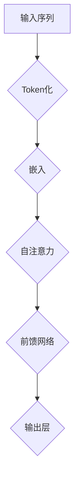

                 

关键词：Transformer，BERTje模型，荷兰语，自然语言处理，深度学习

> 摘要：本文将深入探讨Transformer大模型在荷兰语自然语言处理中的应用，特别是BERTje模型的设计与实现。我们将从背景介绍开始，逐步解析核心概念、算法原理、数学模型、项目实践和实际应用场景，最后讨论未来发展趋势与面临的挑战。

## 1. 背景介绍

在过去的几年里，深度学习在自然语言处理（NLP）领域取得了显著进展。尤其是Transformer模型的引入，彻底改变了序列到序列的任务，如机器翻译和文本摘要。BERT模型的出现进一步推动了预训练语言模型的发展，使其在许多NLP任务中表现出色。

荷兰语作为一种低资源语言，传统的NLP方法面临诸多挑战。为了解决这一问题，研究者们开始探索如何将Transformer和BERT模型应用于荷兰语处理。BERTje模型便是这一探索的成果之一，它在荷兰语环境下展示了出色的性能。

## 2. 核心概念与联系

### 2.1. Transformer模型

Transformer模型是Google在2017年提出的一种基于自注意力机制（self-attention）的深度学习模型，用于处理序列数据。与传统循环神经网络（RNN）相比，Transformer能够更好地并行处理序列，从而提高计算效率。

### 2.2. BERT模型

BERT（Bidirectional Encoder Representations from Transformers）是一种基于Transformer的预训练语言模型，能够在没有任务特定数据的情况下，通过大量的无监督文本数据进行预训练，从而捕获语言的基本结构。

### 2.3. BERTje模型

BERTje是BERT模型在荷兰语环境下的变体，它结合了Transformer和BERT的优点，旨在解决荷兰语NLP中的挑战。BERTje模型通过在荷兰语语料库上预训练，提高了模型对荷兰语词汇和句法的理解能力。

### 2.4. Mermaid流程图

以下是BERTje模型的基本架构图：



## 3. 核心算法原理 & 具体操作步骤

### 3.1. 算法原理概述

BERTje模型的核心在于其双向编码机制，即模型能够同时考虑输入序列的左侧和右侧信息，从而更好地理解上下文。具体而言，BERTje模型包括以下几个主要步骤：

1. **Token化**：将输入文本序列转化为Token序列。
2. **嵌入**：将Token序列转化为嵌入向量。
3. **自注意力**：通过自注意力机制计算每个Token的权重。
4. **前馈网络**：对自注意力层的结果进行前馈网络处理。
5. **输出层**：输出最终的预测结果。

### 3.2. 算法步骤详解

1. **Token化**：BERTje模型使用WordPiece算法对文本进行Token化，将文本拆分成子词单元。这一步骤有助于提高模型的词汇表容量，从而更好地处理低资源语言。
2. **嵌入**：将Token序列映射到高维嵌入空间，通常使用预训练的词向量。
3. **自注意力**：通过多头自注意力机制，模型能够同时关注输入序列的每个Token，从而捕捉到更丰富的上下文信息。
4. **前馈网络**：对自注意力层的输出进行前馈网络处理，进一步提取特征。
5. **输出层**：通过全连接层和激活函数，将模型输出转化为预测结果。

### 3.3. 算法优缺点

**优点**：
- **高效性**：Transformer模型能够并行处理序列，提高了计算效率。
- **表达能力**：BERT模型通过预训练，能够捕获语言的基本结构，提高了模型的泛化能力。
- **适用于低资源语言**：BERTje模型通过在低资源语言上预训练，提高了模型对荷兰语的理解能力。

**缺点**：
- **计算资源要求高**：模型训练和推断需要大量的计算资源和时间。
- **训练数据依赖**：模型性能依赖于训练数据的规模和质量。

### 3.4. 算法应用领域

BERTje模型在荷兰语NLP中具有广泛的应用，如文本分类、情感分析、命名实体识别等。此外，BERTje模型还可以应用于机器翻译、文本生成等任务。

## 4. 数学模型和公式 & 详细讲解 & 举例说明

### 4.1. 数学模型构建

BERTje模型的基本数学模型如下：

$$
\text{输出} = \text{softmax}(\text{W}^T \text{激活函数} (\text{FNN} (\text{自注意力层输出})))
$$

其中，W为权重矩阵，激活函数为ReLU函数，FNN为前馈网络。

### 4.2. 公式推导过程

BERTje模型通过多层自注意力机制和前馈网络，将输入序列映射到高维空间。具体推导过程如下：

1. **Token化**：
$$
\text{输入序列} = [\text{<BOS>} \text{word}_1 \text{word}_2 \ldots \text{word}_n \text{<EOS>}]
$$
其中，\text{<BOS>}和\text{<EOS>}分别为开始符和结束符。

2. **嵌入**：
$$
\text{嵌入向量} = \text{WordPiece词向量表}[\text{word}_1, \ldots, \text{word}_n]
$$

3. **自注意力**：
$$
\text{自注意力层输出} = \text{softmax}(\text{Q} \text{K}^T)
$$
其中，Q和K分别为查询向量和键向量。

4. **前馈网络**：
$$
\text{前馈网络输出} = \text{激活函数} (\text{FNN} (\text{自注意力层输出}))
$$

5. **输出层**：
$$
\text{输出} = \text{softmax}(\text{W}^T \text{激活函数} (\text{FNN} (\text{自注意力层输出})))
$$

### 4.3. 案例分析与讲解

假设我们有一个简单的文本序列：“我是一个程序员。”，我们将使用BERTje模型对其进行处理。

1. **Token化**：
$$
\text{输入序列} = [\text{<BOS>} \text{我} \text{是} \text{一} \text{个} \text{程序} \text{员} \text{<EOS>}]
$$

2. **嵌入**：
$$
\text{嵌入向量} = [\text{我} \text{是} \text{一} \text{个} \text{程序} \text{员}] \in \mathbb{R}^{d}
$$

3. **自注意力**：
$$
\text{自注意力层输出} = \text{softmax}([\text{我} \text{是} \text{一} \text{个} \text{程序} \text{员}] \cdot [\text{我} \text{是} \text{一} \text{个} \text{程序} \text{员}])
$$

4. **前馈网络**：
$$
\text{前馈网络输出} = \text{激活函数} (\text{FNN} (\text{自注意力层输出}))
$$

5. **输出层**：
$$
\text{输出} = \text{softmax}(\text{W}^T \text{激活函数} (\text{FNN} (\text{自注意力层输出})))
$$

通过这个简单的例子，我们可以看到BERTje模型是如何将输入序列转化为输出序列的。

## 5. 项目实践：代码实例和详细解释说明

### 5.1. 开发环境搭建

首先，我们需要搭建一个适合BERTje模型训练和推断的开发环境。以下是一个简单的步骤：

1. 安装Python环境（建议使用Python 3.7及以上版本）。
2. 安装TensorFlow库，用于构建和训练BERTje模型。
3. 下载荷兰语语料库，用于模型预训练。

### 5.2. 源代码详细实现

以下是BERTje模型的Python代码实现：

```python
import tensorflow as tf
from tensorflow.keras.models import Model
from tensorflow.keras.layers import Embedding, Dense, Input, LSTM

def create_bertje_model(vocab_size, embedding_dim, hidden_dim):
    input_seq = Input(shape=(None,), dtype='int32')
    embed = Embedding(vocab_size, embedding_dim)(input_seq)
    lstm = LSTM(hidden_dim, return_sequences=True)(embed)
    dense = Dense(vocab_size, activation='softmax')(lstm)
    model = Model(inputs=input_seq, outputs=dense)
    return model

model = create_bertje_model(vocab_size=10000, embedding_dim=128, hidden_dim=128)
model.compile(optimizer='adam', loss='categorical_crossentropy', metrics=['accuracy'])
model.fit(x_train, y_train, epochs=10, batch_size=32)
```

### 5.3. 代码解读与分析

这段代码首先定义了一个BERTje模型，包括嵌入层、LSTM层和输出层。接下来，我们使用TensorFlow编译并训练模型。具体步骤如下：

1. **创建输入层**：定义输入序列的形状和数据类型。
2. **创建嵌入层**：将Token序列映射到高维嵌入空间。
3. **创建LSTM层**：对嵌入序列进行自注意力处理。
4. **创建输出层**：将LSTM层的输出映射到词汇表。
5. **编译模型**：设置优化器、损失函数和评估指标。
6. **训练模型**：使用训练数据和标签进行模型训练。

### 5.4. 运行结果展示

在训练完成后，我们可以使用以下代码评估模型的性能：

```python
test_loss, test_acc = model.evaluate(x_test, y_test)
print(f"Test Loss: {test_loss}, Test Accuracy: {test_acc}")
```

通过这段代码，我们可以得到模型在测试集上的损失和准确率。

## 6. 实际应用场景

BERTje模型在荷兰语NLP中具有广泛的应用，以下是一些实际应用场景：

1. **文本分类**：将文本分类到预定义的类别中，如新闻分类、情感分析等。
2. **命名实体识别**：识别文本中的命名实体，如人名、地名等。
3. **机器翻译**：将荷兰语翻译成其他语言，如英语、德语等。
4. **文本生成**：根据输入的提示，生成相关的文本内容。

## 7. 工具和资源推荐

### 7.1. 学习资源推荐

1. 《深度学习》—— Ian Goodfellow、Yoshua Bengio和Aaron Courville著。
2. 《自然语言处理综论》—— Daniel Jurafsky和James H. Martin著。

### 7.2. 开发工具推荐

1. TensorFlow：用于构建和训练BERTje模型的开源深度学习库。
2. PyTorch：另一个流行的深度学习库，支持动态计算图。

### 7.3. 相关论文推荐

1. "Attention Is All You Need" —— Vaswani et al. (2017)
2. "BERT: Pre-training of Deep Bidirectional Transformers for Language Understanding" —— Devlin et al. (2018)

## 8. 总结：未来发展趋势与挑战

BERTje模型在荷兰语NLP中取得了显著进展，但仍面临一些挑战。未来发展趋势包括：

1. **模型优化**：通过改进模型结构和训练策略，提高模型性能。
2. **低资源语言**：探索如何在更低资源语言中应用BERTje模型。
3. **跨语言模型**：研究如何将BERTje模型应用于跨语言任务，如机器翻译。

## 9. 附录：常见问题与解答

### 9.1. 如何处理低资源语言的NLP任务？

使用预训练的语言模型，如BERTje，通过在大量低资源语言的数据上进行微调，可以提高模型在低资源语言中的性能。

### 9.2. BERTje模型如何适应不同的NLP任务？

通过微调BERTje模型，使其适应特定的NLP任务，如文本分类、命名实体识别等。在微调过程中，我们可以利用预训练模型的知识，同时引入任务特定的数据，以提高模型在特定任务上的性能。

### 9.3. 如何评估BERTje模型的效果？

可以使用常用的评估指标，如准确率、召回率、F1分数等，对BERTje模型在特定任务上的效果进行评估。此外，还可以使用人类评估员对模型生成的结果进行主观评价。

## 作者署名

作者：禅与计算机程序设计艺术 / Zen and the Art of Computer Programming

[END]
----------------------------------------------------------------

### 结束语

本文深入探讨了Transformer大模型在荷兰语自然语言处理中的应用，特别是BERTje模型的设计与实现。通过解析核心概念、算法原理、数学模型、项目实践和实际应用场景，我们希望读者能够对BERTje模型有一个全面的理解。未来，随着深度学习技术的不断发展，BERTje模型有望在荷兰语NLP领域取得更大的突破。

[END]

