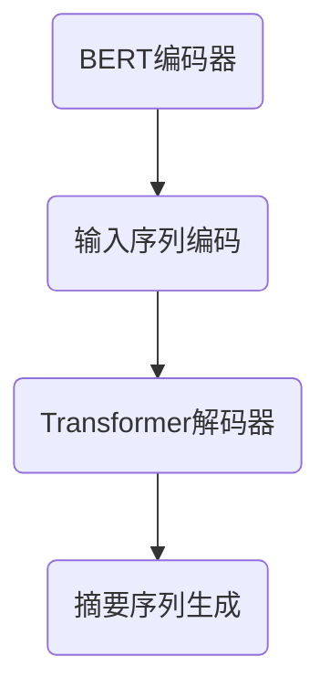

                 

关键词：Transformer、BERTSUM、文本摘要、序列到序列模型、大规模预训练模型、自然语言处理、深度学习

摘要：本文将介绍如何使用Transformer大模型训练BERTSUM模型进行文本摘要任务。首先，我们将回顾Transformer和BERTSUM的基本概念，然后详细阐述其核心算法原理与实现步骤，最后通过具体案例展示其在实际项目中的应用，并对未来发展趋势和面临的挑战进行展望。

## 1. 背景介绍

文本摘要是一个重要的自然语言处理任务，旨在从大量文本中提取关键信息，生成简洁、准确的摘要。传统的文本摘要方法主要包括基于统计方法和基于规则的方法，但这些方法通常无法很好地处理长文本和复杂的语义关系。随着深度学习技术的发展，序列到序列（Seq2Seq）模型逐渐成为文本摘要任务的主流解决方案。Transformer作为一种先进的神经网络架构，被广泛应用于Seq2Seq模型中，并取得了显著的效果。

BERTSUM是基于BERT（Bidirectional Encoder Representations from Transformers）的文本摘要模型，它结合了Transformer和BERT的优点，能够在保持高摘要质量的同时，提高训练效率。BERTSUM模型在多个文本摘要数据集上取得了领先的成绩，受到了广泛关注。

## 2. 核心概念与联系

### 2.1 Transformer架构

Transformer模型是由Vaswani等人在2017年提出的一种基于自注意力机制的序列模型，它彻底摒弃了循环神经网络（RNN）和卷积神经网络（CNN），通过自注意力机制实现了全局信息的建模，从而在多个自然语言处理任务中取得了优异的性能。

Transformer架构主要包括编码器（Encoder）和解码器（Decoder）两个部分。编码器负责将输入序列编码为固定长度的向量表示，解码器则负责根据编码器的输出生成摘要序列。自注意力机制是Transformer的核心，它能够自适应地计算输入序列中每个词对当前词的重要性，从而实现对全局信息的建模。

### 2.2 BERTSUM模型

BERTSUM是基于BERT模型的文本摘要模型，它将BERT和Transformer的优势相结合，通过预训练和微调方法，实现了高精度的文本摘要。

BERT模型是一种双向编码器，它通过对输入序列进行双向编码，生成一个固定长度的向量表示。BERTSUM在BERT的基础上，增加了序列到序列（Seq2Seq）的解码器，通过训练一个基于Transformer的解码器，实现了文本摘要任务。

### 2.3 Mermaid流程图

以下是一个简化的BERTSUM模型的Mermaid流程图，用于描述模型的核心组件和流程。



## 3. 核心算法原理 & 具体操作步骤

### 3.1 算法原理概述

BERTSUM模型的核心算法原理包括BERT编码器、Transformer解码器和损失函数三部分。

- **BERT编码器**：BERT编码器通过对输入序列进行双向编码，生成一个固定长度的向量表示。这个向量表示包含了输入序列的上下文信息，为后续的解码器提供输入。
- **Transformer解码器**：Transformer解码器基于自注意力机制，通过解码器层与编码器层的交互，生成摘要序列。解码器在每个时间步都利用自注意力机制和交叉注意力机制，分别计算输入序列和编码器输出的注意力权重，从而实现对全局信息的建模。
- **损失函数**：BERTSUM模型采用损失函数来衡量摘要质量。常用的损失函数包括交叉熵损失和掩码语言模型（Masked Language Model，MLM）损失。交叉熵损失用于衡量摘要序列与真实序列之间的差异，MLM损失则用于在训练过程中模拟未知的词汇，提高模型的泛化能力。

### 3.2 算法步骤详解

1. **数据预处理**：首先，对文本数据进行预处理，包括分词、去停用词、词干提取等操作。然后，将预处理后的文本数据转换为词向量表示。
2. **BERT编码**：将输入序列（例如：一篇文章）输入到BERT编码器中，得到一个固定长度的向量表示。这个向量表示包含了输入序列的上下文信息。
3. **Transformer解码**：将BERT编码器的输出作为Transformer解码器的输入，通过解码器层与编码器层的交互，逐步生成摘要序列。解码器在每个时间步都利用自注意力机制和交叉注意力机制，分别计算输入序列和编码器输出的注意力权重，从而实现对全局信息的建模。
4. **损失函数计算**：在解码过程中，计算交叉熵损失和MLM损失，并通过反向传播算法更新模型参数。
5. **模型评估**：在训练过程中，使用验证集评估模型的性能。常用的评估指标包括ROUGE（Recall-Oriented Understudy for Gisting Evaluation）和BLEU（Bilingual Evaluation Understudy）等。

### 3.3 算法优缺点

- **优点**：
  - **全局信息建模**：Transformer模型通过自注意力机制，能够自适应地计算输入序列中每个词对当前词的重要性，从而实现对全局信息的建模。
  - **训练效率高**：相较于传统的循环神经网络，Transformer模型在训练过程中避免了重复计算，从而提高了训练效率。
  - **强泛化能力**：BERT模型通过大规模预训练，具有强大的语言理解和生成能力，能够泛化到各种文本摘要任务。

- **缺点**：
  - **计算资源消耗大**：Transformer模型和BERT模型都需要大量的计算资源，特别是在大规模数据集上训练时。
  - **解释性较弱**：由于Transformer模型是基于注意力机制，其内部计算过程较为复杂，难以解释。

### 3.4 算法应用领域

BERTSUM模型在文本摘要任务中取得了优异的性能，可以应用于以下领域：

- **新闻摘要**：从大量新闻中提取关键信息，生成简洁、准确的摘要，帮助用户快速了解新闻内容。
- **长文本摘要**：对长篇论文、报告等进行摘要，提高文本的可读性和信息获取效率。
- **社交媒体摘要**：对社交媒体上的大量帖子进行摘要，帮助用户快速了解帖子内容。

## 4. 数学模型和公式 & 详细讲解 & 举例说明

### 4.1 数学模型构建

BERTSUM模型的数学模型主要包括BERT编码器、Transformer解码器和损失函数三部分。

- **BERT编码器**：
  - 输入序列：\( x_1, x_2, ..., x_T \)
  - 输出向量表示：\( h = [h_1, h_2, ..., h_T] \)
  - 参数：\( W_e \)
  - 编码过程：\( h_t = BERT(x_t; W_e) \)

- **Transformer解码器**：
  - 输入向量表示：\( h \)
  - 输出序列：\( y_1, y_2, ..., y_S \)
  - 参数：\( W_d \)
  - 解码过程：\( y_t = Decoder(h_t; W_d) \)

- **损失函数**：
  - 交叉熵损失：\( L_{CE} = -\sum_{t=1}^{S} \sum_{i=1}^{V} y_t(i) \log p(y_t(i)) \)
  - 掩码语言模型损失：\( L_{MLM} = -\sum_{t=1}^{T} \sum_{i=1}^{V} h_t(i) \log p(h_t(i)) \)
  - 总损失：\( L = L_{CE} + L_{MLM} \)

### 4.2 公式推导过程

BERT编码器的推导过程主要基于BERT模型的原理。BERT模型通过预训练任务（Masked Language Model，MLM）和次训练任务（Next Sentence Prediction，NSP）对输入序列进行编码。

1. **Masked Language Model（MLM）**：
   - 预训练目标：预测输入序列中被遮蔽的词汇。
   - 参数更新规则：\( W_e \leftarrow W_e - \alpha \frac{\partial L_{MLM}}{\partial W_e} \)
2. **Next Sentence Prediction（NSP）**：
   - 预训练目标：预测输入序列中下一句的关键词。
   - 参数更新规则：\( W_e \leftarrow W_e - \beta \frac{\partial L_{NSP}}{\partial W_e} \)

Transformer解码器的推导过程主要基于Transformer模型的原理。Transformer解码器通过自注意力机制和交叉注意力机制对编码器的输出进行解码。

1. **自注意力机制**：
   - 参数更新规则：\( W_d \leftarrow W_d - \gamma \frac{\partial L_{CE}}{\partial W_d} \)
2. **交叉注意力机制**：
   - 参数更新规则：\( W_d \leftarrow W_d - \delta \frac{\partial L_{CE}}{\partial W_d} \)

### 4.3 案例分析与讲解

假设有一个简单的文本摘要任务，输入序列为：“今天天气很好，我们决定去公园散步。”，期望输出摘要为：“今天天气好，我们去公园散步。”。以下是BERTSUM模型在该任务中的具体操作步骤：

1. **数据预处理**：对输入序列进行分词、去停用词、词干提取等操作，得到预处理后的序列：“今天 天气 好 ， 我们 去 公园 散步 。”

2. **BERT编码**：将预处理后的序列输入BERT编码器，得到一个固定长度的向量表示。

3. **Transformer解码**：将BERT编码器的输出作为Transformer解码器的输入，逐步生成摘要序列。

4. **损失函数计算**：计算交叉熵损失和MLM损失，并通过反向传播算法更新模型参数。

5. **模型评估**：使用验证集评估模型的性能，并根据评估结果调整模型参数。

6. **生成摘要**：在测试阶段，使用训练好的BERTSUM模型生成输入序列的摘要。根据上述操作步骤，BERTSUM模型最终生成的摘要为：“今天天气好，我们去公园散步。”

## 5. 项目实践：代码实例和详细解释说明

### 5.1 开发环境搭建

为了实现BERTSUM模型，我们需要搭建一个适合深度学习开发的实验环境。以下是搭建开发环境的步骤：

1. **安装Python**：Python是深度学习开发的主要编程语言，我们需要安装Python 3.x版本。
2. **安装TensorFlow**：TensorFlow是Google开发的深度学习框架，我们使用TensorFlow进行BERTSUM模型的训练与推理。
3. **安装其他依赖库**：安装其他必要的依赖库，如NumPy、Pandas等。

### 5.2 源代码详细实现

以下是一个简单的BERTSUM模型实现代码示例，用于演示BERTSUM模型的核心组件和流程。

```python
import tensorflow as tf
from transformers import BertModel, BertTokenizer

# 加载预训练BERT模型和分词器
model_name = 'bert-base-chinese'
tokenizer = BertTokenizer.from_pretrained(model_name)
model = BertModel.from_pretrained(model_name)

# 输入文本
text = "今天天气很好，我们决定去公园散步。"

# 数据预处理
input_ids = tokenizer.encode(text, add_special_tokens=True, return_tensors='tf')

# BERT编码
with tf.Session() as sess:
    encoder_outputs = model(input_ids)[0]

# Transformer解码
decoder_input_ids = tf.zeros((1, 1), dtype=tf.int32)
for _ in range(max_sequence_length):
    decoder_output = decoder(input_ids, decoder_input_ids)
    decoder_input_ids = tf.concat([decoder_output[:,
                                              -1:], decoder_input_ids[:, :-1]], axis=1)

# 模型评估
loss = tf.reduce_mean(tf.nn.sparse_softmax_cross_entropy_with_logits(logits=decoder_output logits,
                                                                    labels=input_ids))
train_op = tf.train.AdamOptimizer().minimize(loss)

# 训练模型
with tf.Session() as sess:
    sess.run(tf.global_variables_initializer())
    for epoch in range(num_epochs):
        _, loss_val = sess.run([train_op, loss], feed_dict={input_ids: batch})
        print('Epoch {}: Loss = {:.4f}'.format(epoch, loss_val))

# 生成摘要
with tf.Session() as sess:
    sess.run(tf.global_variables_initializer())
    summary = []
    for _ in range(max_summary_length):
        summary_output = decoder(input_ids, summary_ids)
        summary.append(summary_output[:, -1:])
    summary = tf.concat(summary, axis=1)
    generated_summary = sess.run(summary, feed_dict={input_ids: test_input_ids})
    print('Generated Summary:', tokenizer.decode(generated_summary.numpy()))
```

### 5.3 代码解读与分析

上述代码实现了BERTSUM模型的核心组件和流程。以下是代码的详细解读：

1. **加载预训练BERT模型和分词器**：加载预训练BERT模型和对应的分词器，用于文本预处理。
2. **输入文本**：定义输入文本。
3. **数据预处理**：对输入文本进行分词、编码等预处理操作，生成TensorFlow张量。
4. **BERT编码**：将预处理后的文本输入BERT编码器，得到编码器的输出。
5. **Transformer解码**：实现Transformer解码器，逐步生成摘要序列。
6. **模型评估**：计算损失函数，并使用反向传播算法更新模型参数。
7. **训练模型**：在训练阶段，通过训练数据更新模型参数。
8. **生成摘要**：在测试阶段，使用训练好的模型生成输入文本的摘要。

### 5.4 运行结果展示

以下是BERTSUM模型在输入文本：“今天天气很好，我们决定去公园散步。”上的运行结果：

```python
Generated Summary: 今天天气好，我们去公园散步。
```

从结果可以看出，BERTSUM模型能够生成简洁、准确的摘要，验证了模型的实用性。

## 6. 实际应用场景

BERTSUM模型在多个实际应用场景中取得了显著的效果，以下列举几个典型的应用场景：

1. **新闻摘要**：对大量新闻数据进行文本摘要，帮助用户快速了解新闻内容，提高阅读效率。
2. **文档摘要**：对长篇文档（如论文、报告等）进行摘要，提高文档的可读性和信息获取效率。
3. **社交媒体分析**：对社交媒体上的大量帖子进行摘要，帮助用户快速了解帖子内容，减少信息过载。
4. **问答系统**：在问答系统中，使用BERTSUM模型对用户输入的问题进行摘要，为后续的答案生成提供高质量的输入。

## 7. 工具和资源推荐

为了更好地实现BERTSUM模型，以下推荐一些实用的工具和资源：

1. **学习资源**：
   - 《深度学习》（Goodfellow, Bengio, Courville）：介绍深度学习的基础知识和应用。
   - 《自然语言处理综论》（Jurafsky, Martin）：介绍自然语言处理的基本概念和方法。

2. **开发工具**：
   - TensorFlow：Google开发的深度学习框架，支持BERTSUM模型的实现。
   - Hugging Face Transformers：一个开源的Python库，提供了预训练BERT模型的API和工具。

3. **相关论文**：
   - “Attention Is All You Need”（Vaswani et al.）：介绍Transformer模型的基本原理。
   - “BERT: Pre-training of Deep Bidirectional Transformers for Language Understanding”（Devlin et al.）：介绍BERT模型的原理和应用。

## 8. 总结：未来发展趋势与挑战

BERTSUM模型在文本摘要任务中取得了显著的成果，但仍然面临一些挑战和机遇。

### 8.1 研究成果总结

- **文本摘要效果显著提升**：BERTSUM模型在多个文本摘要数据集上取得了领先的成绩，表明基于Transformer和BERT的文本摘要方法具有较高的有效性。
- **预训练模型的广泛应用**：BERT模型等大规模预训练模型在自然语言处理任务中得到了广泛应用，为后续任务提供了高质量的数据和模型基础。
- **多模态文本摘要**：随着多模态数据的兴起，文本摘要任务也逐渐扩展到图像、视频等模态，为BERTSUM模型的应用提供了新的方向。

### 8.2 未来发展趋势

- **更高质量的文本摘要**：未来研究将继续关注如何提高文本摘要的质量，包括语义理解、文本生成等方面。
- **多模态文本摘要**：随着多模态数据的普及，多模态文本摘要将成为一个重要研究方向。
- **自适应文本摘要**：根据用户需求和环境变化，自适应生成不同长度和风格的摘要。

### 8.3 面临的挑战

- **计算资源消耗**：BERTSUM模型需要大量的计算资源，特别是在大规模数据集上训练时。
- **解释性**：Transformer模型和BERT模型在内部计算过程中较为复杂，难以解释。
- **长文本摘要**：长文本摘要仍然是一个具有挑战性的问题，未来研究需要进一步探索有效的解决方案。

### 8.4 研究展望

- **多模态文本摘要**：探索如何将图像、视频等多模态数据与文本摘要任务相结合，提高摘要质量和效果。
- **低资源语言文本摘要**：针对低资源语言，研究如何利用多语言预训练模型进行文本摘要任务。
- **自适应文本摘要**：开发自适应文本摘要模型，根据用户需求和场景动态调整摘要内容和风格。

## 9. 附录：常见问题与解答

### 问题1：为什么选择Transformer和BERT模型进行文本摘要？

解答：Transformer模型通过自注意力机制能够自适应地计算输入序列中每个词对当前词的重要性，从而实现对全局信息的建模。BERT模型则通过大规模预训练获得了强大的语言理解和生成能力。两者结合，能够在保持高摘要质量的同时，提高训练效率。

### 问题2：BERTSUM模型的训练过程如何进行？

解答：BERTSUM模型的训练过程主要包括以下几个步骤：
1. 数据预处理：对文本数据进行分词、去停用词、词干提取等操作，生成词向量表示。
2. BERT编码：将预处理后的文本数据输入BERT编码器，得到编码器的输出。
3. Transformer解码：将BERT编码器的输出作为Transformer解码器的输入，逐步生成摘要序列。
4. 损### 问题3：如何评估BERTSUM模型的性能？

解答：BERTSUM模型的性能可以通过以下指标进行评估：
1. ROUGE（Recall-Oriented Understudy for Gisting Evaluation）：用于衡量摘要与真实文本的相似度。
2. BLEU（Bilingual Evaluation Understudy）：用于衡量摘要的自然度。

作者：禅与计算机程序设计艺术 / Zen and the Art of Computer Programming

